榜樣的力量-吳恩達採訪人工智慧大師實錄
=====================================
[TOC]
### 吳恩達採訪 Geoffery Hinton

**Geoffery Hinton**主要觀點：要閱讀文獻，但不要讀太多，絕對不要停止編程。

**Geoffrey Hinton：**謝謝你的邀請

**吳恩達：**我想你是至今為止整個地球上發明最多深度學習核心理念的人，很多人都稱呼你為“深度學習教父”，儘管我是直到和你聊了幾分鐘之後才發現我是第一個這樣稱呼你的人，
對此我深感榮幸不過我想問的是，許多人把你看作傳奇，我更想知道一些傳奇背後的私人故事，所以你是怎樣在很久之前就投身於人工智慧，機器學習以及神經網路之中的呢？

**Geoffrey Hinton：**當我還在高中時有一個什麼都比我強的同學，他是個才華橫溢的數學家，有天他來學校並且問我，你知道大腦是用全像圖運作的嗎？那時應該是1966年，我回答他
全像圖是個什麼？他就解釋了一下，在全像圖中，你可以切掉它的一半，但依然了解得到全貌，還有大腦中的記憶可能是分布於整個大腦中的，我大概猜到他可能是讀過關於Karl Lashley的實驗，其中講到切掉老鼠幾個小部分的腦子，然後發現很難找到哪一部分存儲哪種特別的記憶，那是第一次讓我對大腦，怎麼儲存記憶產生興趣的時刻，然後當我去上大學的時候，我就開始學習生理學和物理學，當我在劍橋的時候我是唯一一個在學生理學和物理學的大學生，之後我放棄了這個選擇並且嘗試學哲學，因為我覺得那可能會給我更多的深入了解，但是後來我又覺得缺乏真正能夠辨別錯誤說法的方法，然後我就轉去學了心理學而在心理學中有著非常非常過於簡單的理論，對我個人來說用來解釋大腦的運作看起來無可救藥的不充分，之後我花了點時間做一個木匠，然後我又決定想去試試看人工智慧，於是就跑去愛丁堡跟Longuet Higgins學人工智慧，他已經做了很棒的關於神經網路的研究並且剛剛決定放棄於此，轉而對Terry Winograd的學說表示讚賞，我剛去的時候他覺得我做這個（神經網路）已經過時了，應該開始搞符號主義人工智慧，關於這個我們有很多爭論，但我還是堅持做自己相信的事情，然後呢？最終我拿到了人工智慧博士學位。
但我在英國找不到工作，但我注意到了一個很不錯的加州Sloan獎學金的廣告，我拿到了這個獎學金，我去了加州，那裡感覺很不一樣。在英國“神經網路”看起來很愚蠢，而在加州 Don Norman和David Rumelhart對於神經網路的觀念非常開放，在那裡我第一次開始考慮大腦是怎麼運作的，和心理學會有什麼聯繫，看起來是一個積極的方向，這其中有很多樂趣，特別是和David Rumelhart一起工作相當棒。

**吳恩達：**我懂了，很好，1982年你在UCSD和Rumelhart在一起工作，最後寫出了反向傳播的論文，事實上，比這還要複雜點，什麼情況呢？

**Geoffrey Hinton：**大概在1982年初David Rumelhart和我，還有Ron Williams我們開發了反向傳播算法，這主要是David Rumelhart的想法，我們發現不少人都發明過David Parker發明過，可能比我們晚，但發表比我們早，Paul Werbos發表了好幾年的，不過沒人注意到還有其他人也做出了類似的算法，但不能清晰地表述出“反向傳播”的含義，用鏈式法則求導並不是很新的想法。

**吳恩達：**明白，為什麼你會認為你們的論文極大地幫助大家理解了“反向傳播”呢？似乎你們的論文被認為是讓大家去接受這個算法一個里程碑式的影響。

**Geoffrey Hinton：**最後我們的論文上了《自然》，為了論文被接受，我做了不少人事工作，我想到其中一個審稿人很可能會是Stuart Sutherland英國一位很有名的心理學家，我跑去和他聊了很久，跟他解釋這到底是怎麼一回事，給他留下了很深刻的印象，因為我們給他展示了反向傳播法可以學習字元表示，你可以看到這些表示都是一些向量，你可以理解每一個特徵的意義，實際上我們訓練了三個名字的家族樹模型，比如Mary的媽媽是Victoria，你給出前面兩個名字，它能預測到最後的名字，訓練過後你可以看到每一個名字的所有特徵，比如某個人的國籍，是第幾代，在家族樹中的哪一旁枝等等，這震驚了Stuart Sutherland，我想，這是論文被通過的原因。

**吳恩達：**非常早期的放棄詞向量，並且你已經在接觸在訓練算法中出現的能被學習的語義特徵了。

**Geoffrey Hinton：**是的，所以從一個心理學家的角度來說，真正有趣的是它能把兩股完全不同的知識概念統一起來曾有一些心理學家認為，知識概念是一大束特徵，對此也有很多相關證據，之後又出現了現代AI的觀點，也就是正式的結構主義觀點，意思即是任何一個概念都有許多其他概念與其相關，為了理解一個概念，你會需要一個圖形結構或是一個語義網路，然後這個後向傳播的例子展示了你可以把訊息傳給它，訊息會變成圖形結構，在這個特殊情況是一個族譜，然後輸入訊息會用這樣的方式變成特徵，然後它能夠使用這些特徵來得到新的前後一致的訊息，也就是歸納總結化。但是真正重要的是這樣來回往復的圖形或樹形的表現族譜方式，把裡面的人變成特徵向量這種形式，事實上從圖形狀的表現手法，你也能夠得到特徵向量，從特徵向量你又可以得到更多的圖形陳述，那時候是1986年。90年代早期 Bengio就已經展示過，你可以把真實的數據，比如你可以拿來英文文本，然後使用這些技巧得到文本的詞語向量，這曾經驚艷了許多人。

**吳恩達：**最近我們在聊的都是計算機變得有多快，比如使深度學習不斷提高的新的GPU和超級電腦，我在90年代到1986年那時還不存在的這些工具，聽起來你和Bengio那時就已經開始引發了這個潮流。

**Geoffrey Hinton：**是的，在當時的確是很大的進步。在1986年，我曾經用一個速度小於十分之一秒百萬次浮點運算的列表機，大概1993年左右，人們才逐漸開始見到十秒百萬次浮點運算，所以曾經都是100的倍數，在那時也許還挺好用的。因為計算機才剛剛開始變快。

**吳恩達：**原來如此，前幾十年的時候，你就已經發明了這麼多神經網路和深度學習相關的概念，我其實很好奇，在這麼多你發明的東西中，哪些是你到現在為止依然還是保持熱情的。

**Geoffrey Hinton：**我認為最具學術之美的是我和Terry Sejnowski做的Boltzmann機器，我們發現它能用非常非常簡單的學習算法去應用到密度很高的連接起來的網路，這些網路中只有一些節點能被看到，那麼隱藏表示方式，能夠用非常簡單的算法學習，看起來也是一種你應該能夠應用大腦的東西，因為只需要知道直接和每一個突觸相連接的兩個神經元所被傳播的訊息應該都是一樣的，這裡有兩個不同的時期，我們也可以稱為喚醒和睡眠，但是在這兩個不同時期傳播訊息的方法都是一樣的，不像在後向傳播中有前後向兩種，方法不同，因為發送不同種類的信號，這就是我覺得它的魅力所在，很多年以來都看似只是好奇心所向，因為運行速度很慢，不過後來，我去繁為簡，開始只在簡單些的網路用一個循環，於是就有了受限Boltzmann機，實際中反而更有效，在Netflix的比賽中，舉個例子，受限Boltzmann機是第一名所用的算法之一。

**吳恩達：**事實上，很多最近復甦的神經網路，深度學習，從2007年開始，受限Boltzmann機和解除限制Boltzmann機，你和你實驗室做了很多貢獻。

**Geoffrey Hinton：**這是另外讓我做得很開心的工作，你能訓練受限Boltamann機的想法，僅用一層的隱藏特徵，只學一層特徵，然後你可以重複把特徵當成數據，然後再把新的特徵當成數據，再重複，直到你想要的次數，實際能夠應用，的確很不錯，然後Uy Tay（音）發現這全部過程，可以想成是一個模型，雖然有點奇怪，這個模型頂部是一個受限Boltzmann機，往下是個s形置信網，這發明很超前，這是個針對模型，並且我們想要，能訓練這些受限Boltzmann機，能有效地適用於s形置信網，那時，已經有人在做神經網路了，在用高密度連接的網路，但是沒有足夠好的機率標記，也有人在做圖模型，不像我的孩子們能做合適推理，但是也只能用在稀疏連接的網路，我們展示了訓練深層置信網路的方法，使大致上的推理變得非常快，只需要一個前向推進，結果就能很美麗，你可以保證，每次學一層新的特徵，都有新的帶，每次都是這樣，每個新的帶都會比舊的好。

**吳恩達：**變分帶顯示你是否新加了層數，對，我記得那個影片。

**Geoffrey Hinton：**這也是第二件我始終很感興趣的東西，第三個是做過的一些變分法，統計學者們也做過類似的東西，不過那時我們並不知道，我們讓EN變得更有效，通過證明你不需完美的E步驟，而只需要個大約的，EN當時在統計學很有分量，我們證明了它能被一統化，特別是 1993年 和Van Camp，我寫了篇論文，是第一篇變分貝葉斯的論文，並且證明了可以只用一個版本的貝葉斯學習，更容易處理，因為能用a來估算真正的後驗機率，也可以用在神經網路中，我對此非常興奮。

**吳恩達：**原來如此，哇，真牛。對，我記得提到的所有論文，你和Hinton（口誤）在論文上花了很多時間，我認為一些現在用的算法或大多數人幾乎每天用的一些算法，比如dropout 或來源於你團隊的啟動函數。

**Geoffrey Hinton：**對但不完全是，那麼其他人可能也做過ReLU，我們在受限Boltzmann機上花功夫證明了ReLU幾乎完全等同於一疊logistic單元，這是其中之一推進ReLU前進的力量。

**吳恩達：**我對此非常好奇，這論文的價值是，用了大量數學證明此函數能被複雜公式估算，你是為了發表論文做的數學，還是真的為了影響0和x的最大值的發展。

**Geoffrey Hinton：**並不是為了發論文的情況，數學對推進這個想法，真的很有影響力，我顯然已經知道ReLU還有logistic單元，由於我花了心血在Boltzmann機上，全都是用的logistic單元，那時候面臨的問題是，這個學習算法可能用在ReLU嗎，證明完ReLU幾乎等同一疊logistic單元後，我們展示了所有的數學證明。

**吳恩達：**原來如此，它為無數現在使用ReLU的人們提供了靈感，也不需要特別懂得每個細節。

**Geoffrey Hinton：**對，那麼其中之一的發現在我到Google之後，是2014年我在Google講ReLU的用法以及怎麼用單位矩陣初始化，因為ReLU的一大優點是，如果不斷複製隱藏層，又用單位矩陣初始化，它會複製下層的模式，我展示了你可以訓練一個300個隱層的網路，並且用單位矩陣初始化，會很有效率，但是我沒有繼續研究下去，也非常後悔，我們只發了一篇論文，能證明你可以初始化，可以初始化重複發生，我應該繼續研究的，後來就剩下來了。

**吳恩達：**很多年以來我都聽到你談論大腦，我聽到過你談論後向傳播和大腦的關係，現在你對此是什麼想法。

**Geoffrey Hinton：**我現在正好有論文在準備中，主要想法就是這個，如果後向傳播是個好的學習算法，那進化過程肯定會從中干擾，有些細胞會變成眼球或是牙齒，如果細胞能做這些，就一定能應用後向傳播了，這樣假設會造成極大的選擇性壓力，所以我覺得，毫不懷疑這種想法的神經科學家有點犯傻，可能有比較微妙的應用，我想大腦可能，不會完全用後向傳播，但是足夠相似，這麼多年以來我想出很多可能的理論，在1987年我和Jay McClelland做出了循環算法，核心想法是你發送訊息並循環，並在循環之中保持，它所包括的訊息，最簡單的版本是，你有輸入和隱藏單元，然後你從輸入發訊息到隱藏單元，再回到輸入，再到隱藏，再回到輸入，以此類推，那麼你想要
訓練一個自動譯碼器，但是你想繞開後向傳播，你只要訓練，並且去掉所產生的變化，核心想法是神經元突觸的學習方式，通過改變突破前的輸入權重比重，同時按比例改變突破後的輸入，在再流通時，你需要突破後的輸入，舊的比較好，新的較差，這是比較理想的情況，我們在神經科學家發明尖峰時序依賴可塑性之前，發明了這個算法，尖峰時序依賴可塑性，是個相同的算法，但是，相反，需要新的東西較好，舊的較差，所以，用預先設定前景活動的權重比例，乘以新的，再減去舊的，後來我在2007年發掘，如果你用一疊，受限Boltzmann機來訓練，訓練完，你會有完全正確的條件，來重建並實現後向傳播，如果你關注重建時期，重建時期實際會告訴你偏差表現的導數，2007年的第一個深度學習專題討論中，我曾做過相關演講，那時幾乎被完全遺漏的部分，後來 Joshua Bengio重拾這個想法，下了很多功夫，我自己本人也做了很多相關研究，如果你有一疊自動譯碼器，就可以通過後向傳送活動和重建點定位，得到導數，這個有趣的想法也是大腦工作的原理之一。

**吳恩達：**另一個據我所知，你正在研究的，怎麼在深度學習中解決多個時間技巧，能分享一些你的想法嗎？

**Geoffrey Hinton：**沒問題，這要回溯到我研究生第一年，我第一次展示了怎麼用快速權重，也就是適應很快，衰退也很快的權重，所以只有短期記憶，我在1973年展示了一個很簡單的系統，可以用這些權重做真實循環，真實循環的意思是，用到的神經元來表示循環核心的東西用到的權重，實際也是在循環核心被重複利用的知識引導出的新問題是，當你突出循環核心時，怎麼記得已經是在過程中了，這個記憶從何而來，因為你用過了重複核心的神經元，答案是你可以把記憶放入快速權重中，這些活動神經元可以從快速權重中復原和Jimmy Ba最近的研究中，我們已經有了篇關於，這樣來用快速權重復原的論文，這個空缺非常大，1973年的第一個模型沒有被發表，接下來就是2015或2016年Jimmy Ba的模型，前後相隔40年。

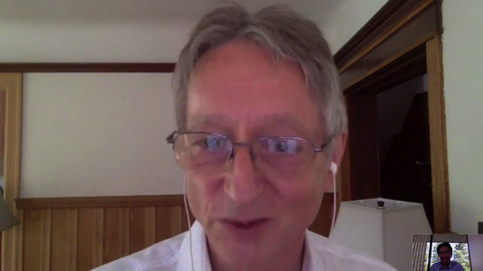

**吳恩達：**是個有些年頭的概念，五年左右，叫做膠囊，你目前進展如何？

**Geoffrey Hinton：**我回到之前所在的狀態，就是我非常篤定地相信，所有人都不信的東西，我提交了一些論文都會被拒接但是我真的相信這個想法，我也會繼續研究，在轉移中有一些很重要的概念，其一是如何表示多維個體，你可以用些借殼活動，表示多維個體，只要你知道其中的任何一個，在圖片中任何一個區域，你會假設至少有一個特別的特徵，之後你會用一堆神經元，以及它們的活動來表示特徵的不同方面，比如$x,y$坐標具體在哪，在哪個方向，移動速度是多快，是什麼顏色，什麼亮度，類似等等，你可以用一堆神經元，來代表不同維度的同一個東西，假如只有其中一個，這種做法很不一樣，相比於普通方式，普通來說在神經網路中就只有一個很宏觀的層，所有的單元和作用都在裡面，但是你不會想到把它們結合成一個個小組，來用不同的坐標表示相同的東西，我們應該去掉多餘的結構，另一個想法是。

**吳恩達：**在真實的表示方法中，再分段表示，對不同的子集，去表示。

**Geoffrey Hinton：**我把這些子集叫做膠囊，膠囊是能夠表示一個特徵的，一個並只有一個的情況，它能表示特徵的所有不同性質，膠囊比一般的神經元能表示更多性質，或是一個普通的神經網路，因為只能表示一個度量上的屬性。

**吳恩達：**原來是這樣。

**Geoffrey Hinton：**當你能這麼做之後，你還能做到普通神經網路表現很差的是，我稱為常規協議，假設你想要分層，然後圖片中有一張嘴，一個鼻子或是別的東西，你想知道你該不該嘗試組合成一個東西，這個想法就可以用膠囊。比如一張嘴，有關於嘴的參數，還有鼻子的膠囊。也有關於鼻子的參數，再確定該不該把它們拼起來，你會有來決定能不能拼成臉的參數，要是嘴鼻子有對的空間關係，它們就會對應上，在統一層面有兩個相應的膠囊，能組成到下一個層面，就可以決定應該組合起來，因為在高維度能對應上很難得，這過濾方法很不同尋常，相比普通情況的神經網路，常規協議會變得至關重要，特別是用有限數據總結概括時，這個觀念上的改變會幫助完成分段，我希望統計角度也更有效，對比我們現在的神經網路，如果你想要改變觀點，你就得嘗試做，並且全都訓練一遍。

**吳恩達：**好的，相比FIFO學習，監督學習，還可以做點不一樣的。

**Geoffrey Hinton：**我還是計劃做監督學習，但是前向路線會很不一樣，不同之處在於裡面還有些循環過程，比如你覺得找到個嘴，找到個鼻子，之後用幾個循環去決定，它們能不能組成一張臉，用這個循環可以做後向傳播，也可以有偏重地試試看，我在多倫多的小組正在研究這個，在多倫多我有一個Google小組，是Brain組的一部分，現在我對此非常興奮。

**吳恩達**：的確很棒，很期待論文的發表。

**Geoffrey Hinton：**哈哈對，假設能發表的話。

**吳恩達**：你研究深度學習都幾十年了，我很好奇你的想法，關於AI有什麼改變嗎？

**Geoffrey Hinton：**我用了很多時間，在後向傳播上，比如怎麼使用，怎麼實現它的力量，剛開始，80年代中時，我們在做偏重學習，結果很不錯，然後到90年代早期，大多數人類學習都，應該是無監督學習，然後我對無監督學習產生濃厚興趣，開始研究Wegstein算法。

**吳恩達：**那時候你的探討對我個人影響也很大，我在領導Google Brain團隊時，第一個項目就在你的影響下研究了好多無監督學習。

**Geoffrey Hinton：**是呢，我可能誤導你啦，因為長期來說，無監督學習絕對會變得很重要，但是面對現實，近十年以來所做的都是監督學習，側重學習都有標籤，你想預測一個系列的下一個東西，也就是標籤，結果驚人的好，我仍相信無監督學習會很重要，當我們真正搞明白一些東西以後，結果會比現在好得多，不過目前還沒到。

**吳恩達：**嗯，深度學習裡的高級研究人員，包括我自己對此依然非常激動，因為我們中沒有一個人知道該怎麼辦，可能你知道，但是我不行了。

**Geoffrey Hinton：**變分法改變代碼是你會用到更新參數化的地方，這想法看起來很不錯，生成對抗網路也是很棒的想法，生成對抗網路我認為是深度學習中最新最重要的想法，我希望膠囊也能這麼成功，生成對抗網路目前是很大的突破。

**吳恩達：**稀疏，緩慢的特徵上有發生什麼嗎？其他兩個無監督建模的原則是什麼。

**Geoffrey Hinton：**我從未像你一樣看重稀疏性，但是慢速特徵，我認為，是個錯誤，不應該說慢，基本想法是對的，但不應該只考慮不變的特徵，而是可預測改變的特徵，建任何模型的基本原則大概是，先記錄測量，對其應用非線性變換，直到狀態向量成為表達式，這項活動變得線性時，不能像做普通滲透一樣，假設線性應該找一個從觀察轉換，到潛在變數的轉換，線性操作，比如潛在變數的矩陣乘積。即是如此，舉個例子：如果你想改變觀點，如果你想從另一個觀點產生圖像，需要從像素轉化到坐標，當你有坐標表示後，希望膠囊也能做到如此，你就可以做矩陣乘數來改變觀點，再投射到像素中。

**吳恩達：**這就是為什麼這是個非常宏觀的原則，也是你做臉部人工合成的原因，對嗎，即是把臉壓縮成低維度向量，再生成其他的臉。

**Geoffrey Hinton：**我曾有個學生研究這個，我自己本人沒怎麼做。

**吳恩達：**你應該常常被問到，如果有人想要入門深度學習，該做什麼，你有什麼建議嗎？之前應該有很多一對一的情況，但對於全球範圍都在看這個影片的觀眾，對於要學深度學習的人們，你有什麼樣的建議。

**Geoffrey Hinton：**好，我的建議是多讀論文，但別讀太多，我從導師那裡得到這個建議，很不想大多數人說的，大多數會告訴你儘量多讀，然後開始自己的研究，對一些研究人員應該是正確的，但是對有創意的人應該讀一少部分，然後發現一點你認為所有人都錯了的東西，在這點我一般都逆著來，你看到它，感覺不太對，然後想怎麼才能做對，當人們反對你時，要堅持自我，我支持人們堅持自我的原則，是判斷直覺的對錯，你直覺還不錯的話，就該堅持，最後一定會成功，要是你直覺一般的話，做什麼都無所謂。

**吳恩達：**我懂了哈哈，鼓舞人心的建議 就堅持下去。

**Geoffrey Hinton：**該相信直覺，不相信就沒意義了

**吳恩達：**我懂了，是的。我通常建議人們不要只看，而是要重現發表了的論文，自然而然限制了你做的數量，因為重現結果很耗時間。

**Geoffrey Hinton：**對，當你重現發表的論文時，會發現所有使之成功的小技巧；另一個建議是，永遠不要停止編程，因為如果你給學生布置任務，他們三天打魚兩天曬網，回頭就會告訴你看，沒做成，沒做成的原因，往往是他們所做的小決定，當時不覺得很重要，舉個例子，如果你給一個好學生任務，你可以給他們任何人任務，他都會做成，我記得曾經有一次，我說。欸等等，我們上次討論時，因為某某原因，是不可能成功呀，學生回答說：“對呀，你說完我就發現了，就假設不是你真的意思”。

**吳恩達：**哈哈原來這樣，那很厲害，還有其他關於AI和深度學習的建議嗎？

**Geoffrey Hinton：**我認為基本上，開始鍛鍊直覺時要讀夠，然後相信直覺，自己動手，不要擔心別人有反對意見。

**吳恩達：**你也沒辦法證明，他們說的對不對，除非親自做了，才能知道

**Geoffrey Hinton：**對，但還有一點，如果你有個絕好的想法，別人都覺得完全荒謬，那你就找對東西了，舉個例子，當我剛想出來變分法時，我給之前一個叫Peter Brown的學生寫了封信，他懂得很多EN相關知識，他就拿去給一起工作的人看，名字叫倆兄弟，可能是雙胞胎吧，然後他說，倆兄弟說了，你要嘛是你喝多了，要嘛是傻，倆兄弟當真認為是荒謬之論，部分原因可能是我用的解釋方式，因為我只解釋了直覺，但當你有個很不錯的想法時，其他人覺得完全是垃圾，就是個好想法的信號了。

**吳恩達：**好的，研究課題的話，新研究生們應該多研究膠囊，無監督學習，還有其他嗎？

**Geoffrey Hinton：**對新研究生的一個好建議是，找一個和你意見一致的導師，因為如果你做的東西，導師也深深贊同，你會得到很好的建議，要是做你導師不感興趣的東西，你會得到沒什麼用的建議。

**吳恩達：**好的，最後對於學習者的建議，有什麼建議給想攻讀博士的人，或去頂級公司工作，或頂級研究團隊。

**Geoffrey Hinton：**這問題複雜。我認為現在，沒有足夠的深度學習學者在大學中教育有求知慾的人，就沒有足夠的教職人員，不過應該是暫時性的，發生的事是這樣，大多數部門很少有，真正懂得這場革命的人，我幾乎同意，這並不是二次工業革命，但是規模接近，有如此巨大的改變，基本是因為我們和計算機的關係改變，不再只是編程序，而是讓它們有能力自動解決問題，從根本上改變了計算機的用法，電腦科學部門，卻是在之前基礎上建立起來的，他們暫且不懂，訓練計算機會和編程一樣重要，部門中一半的人，得實際去試過訓練計算機，我所在的部門就拒絕承認，應該放手讓很多人去做，他們覺得有幾個就夠，可不能放太多人去，這種情況下，你就得建議大公司多花點時間訓練員工，Google培養的人們，我們叫做brain居民，我很懷疑最後大學們能趕上。

**吳恩達：**嗯，沒錯，實際上，能有很多學生都發現了，前50的學校超過一半的申請者實際，只想訓練計算機而不是真正做編程，是，歸因齊宗，深度學習AI的微專業課程，據我所知，最初都是，你在Coursera上教授的，還得回溯到2012年，奇怪的是，也是你發表RMS算法的時候，也還挺難的。

**Geoffrey Hinton：**你邀請我去做，大型開放網課，我可是很懷疑的，但你一直逼我，我很慶幸我那麼做了，儘管工作量極大。

**吳恩達：**是的，感謝你做到了，我還記得你發牢騷，說要做的這麼多，你還老是熬夜，但我覺得很多很多的學者都受益於你的課程，我也非常感激你真的做到了。

**Geoffrey Hinton：**很棒，對。

**吳恩達：**這些年來，我也目睹你被捲入AI界模範的辯論中，以及是否有過AI的變更，你可以分享一下你的想法嗎？

**Geoffrey Hinton：**我很樂意，早期時，大概50年代，像Von Neumann之類的人，都不相信符號化AI，他們靈感更多來源於大腦，不幸的是，他們都英年早逝，未能使自己的想法面世，AI早期時，人們完全被說服，智力的表示該是，某種符號表達，比較整潔的邏輯，而不完全是邏輯，但是類似邏輯，智力的本質是推理，現在發生的是，有種完全不同的觀點，就是無論想法是什麼，都是一個很大的神經活動向量，對比符號化的表示，我認為那些把想法想成是符號表達的人，大錯特錯，輸入是一串字元，輸出是一串單詞，因此，單詞的字串顯然能作為表達式，他們覺得一定是字串，或其他類似字串的東西，我卻不認為是這樣，我覺得想法該是某種語言，簡直和，把想法置於空間層面理解，必須得是像素進，像素出，一樣傻，要是我們能與點矩陣印表機相連，那像素就會出來，但中間的並不是像素，所以我認為想法該是一個大向量，有因果能力的大向量，能引發出其他大向量，這於AI的標準觀點，符號化表達完全不同。

**吳恩達：**好的，AI是肯定會改變，到新的視角的。

**Geoffrey Hinton：**起碼一部分，大多數人還是認為，AI是符號式的

吳恩達：非常感謝你願意接受採訪，能聽到深度學習進化的全過程很棒，還有你依舊在帶領它前進，很感謝你Geoff。

**Geoffrey Hinton：**感謝你給我這個機會，謝謝你。

### 吳恩達採訪 Ian Goodfellow

**吳恩達：**嗨，Ian，感謝你今天接受採訪。

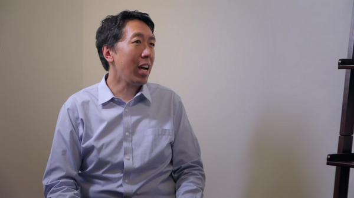

**Ian：**謝謝你邀請我，Andrew，我很高興來到這裡。

**吳恩達：**今天你也許是世界上最知名的深度學習研究員之一，讓我們來聽聽你的心路歷程吧，你是怎樣一步步進入這行的呢?

**Ian：**好，是個好想法，我想我是在遇到你之後才開始對機器學習感興趣的，我一直從事神經科學研究，我的本科時代導師斯坦福大學的Jerry Cain鼓勵我去上你的AI課。

**吳恩達：**啊，這我不知道呢。

**Ian：**好，所以我一直覺得AI是個好想法，但在實踐中，主要的，我想主要達到實用的是一些比如遊戲AI，有很多人工編碼的規則，讓遊戲中的非玩家角色，在不同的時間點說出不同的腳本對話，然後，當我在上你的AI入門課程時，你講到的話題，線性回歸和線性回歸，誤差的偏差和方差分解，我開始意識到這可以是真正的科學，我實際上可以，在AI領域從事科學研究而不是神經科學。

**吳恩達：**我知道了，很好，那接下來呢?

**Ian：**然後我就回來當你的課程助教了呀。

**吳恩達：**原來如此，當我的助教。

**Ian：**其實我人生的一大轉折點，就是在當那門課助教的時候，其中一名學生，我的朋友Ethan
Dreifuss對Geoff Hinton的深度信念網路論文很感興趣。

**吳恩達：**我知道了...

**Ian：**是我們兩個最後一起在斯坦福大學搭建了世界第一台GPU CUDA機器,專門用來跑玻爾茲曼機,就在那年寒假的業餘時間裡,我知道了,在那時候,我開始有一個非常強烈的直覺,深度學習才是未來,那時我們接觸了很多其他算法,比如支持向量機,它們的漸近線不太可靠,當你輸入更多訓練數據時,它們卻在變慢,或者對於相同數量的訓練數據,改變其他設定並沒有改善它們的表現,從那開始,我就專注於深度學習了。

**吳恩達：**我記得Richard Reyna有一篇很老的GPU文章,提到你做了很多早期的工作。

**Ian：**是的，是的，那篇文章用的就是我們搭建的一些機器，是的，我建造的第一台機器就是Ethan和我建立的機器，用我們自己的錢在Ethan媽媽的房子裡搭的，之後，我們用實驗室經費在斯坦福實驗室搭了兩三台。

**吳恩達：**哇，太神奇了，我還不知道這事，太好了。那麼，今天真正以風暴席捲深度學習世界的，是你發明的生成式對抗網路(GAN)，那麼你怎麼想出來的呢?我一直在研究生成模型很久，所以GAN是其中一種生成模型，你有很多訓練數據，你希望學會製造更多類似它們的數據，但它們都是虛構的，網路還沒見過這種形式的虛構數據，還有幾種辦法可以做生成模型，在我們想出GAN之前還流行了幾年，在我讀博的時候，我一直在研究其他各種方法，我非常了解所有其他框架的優缺點，玻爾茲曼機器和稀疏編碼，還有其他多年來一直很受歡迎的方法，我那時正在尋找某個可以同時避免所有方法缺點的東西，最後，當我在一個酒吧裡和朋友爭論生成模型的時候，靈感來了，我開始告訴他們，你需要這麼做，這麼，這麼做我保證管用，我的朋友不相信會管用，我本來還在寫一本深度學習的教科書。

**吳恩達：**我知道了..

**Ian：**但是我強烈相信，這個想法是可靠的，我馬上回家，當天晚上就除錯成功了。

**吳恩達：**所以只花了一晚上就除錯成功第一個GAN了?

**Ian：**我大概在午夜做完的，就從我朋友在酒吧的離職派對離開回到家之後。

**吳恩達：**我知道了..

**Ian：**而它的第一個版本是有效的，這是非常非常幸運的，我沒有搜索超參數或任何東西。

**吳恩達：**我在某個地方讀過一個故事，在那裡你有一次涉死體驗，讓你對AI的信仰更堅定了，給我講講那個故事。

**Ian：**我其實沒有涉死啦，但有那麼一瞬間我覺得要死了，我頭很痛很痛，一些醫生認為我可能有腦出血，在我等待我的MRI結果，看看有沒有腦出血時，我意識到，我的大部分想法都是，要確定有其他人繼續嘗試我當時的研究思路。

**吳恩達：**我懂了，我懂了。

**Ian：**回想起來，那些都是非常愚蠢的研究思路。

**吳恩達：**我懂了..

**Ian：**但在這一點上，我意識到這實際上是我生活中優先度最高的事，就是做機器學習研究工作。

**吳恩達：**我懂了，是啊，那很棒，當你以為你快要死的時候，你還是想如何完成研究。

**Ian：**是的。

**吳恩達：**是，這真的是信仰。

**Ian：**是的。

**吳恩達：**是啊，是啊，所以今天你仍然處於GAN研究的風暴中心，就是這個生成性對抗網路，可以告訴我怎麼看GAN的未來嗎？

**Ian：**現在GANs應用在很多場合裡，比如半監督學習，生成其他模型的訓練數據，甚至模擬科學實驗，原則上這些東西都可以用其他生成模型來做，所以我認為GAN現在在一個重要的十字路口，現在它們有時候效果很好，但要把它們的潛力真正發揮出來，更像是藝術而不是科學，10年前人們對深度學習的感覺或多或少也是如此，當時我們正在使用，以波爾茲曼機器為基礎的深層信念網路。它們他們非常非常挑剔。隨著時間的推移，我們切換到修正線性單元和批次歸一化，深入學習變得更加可靠，如果我們可以把GAN變得像深度學習一樣可靠，那麼我想我們會繼續看到GAN，在今天它們的應用領域裡獲得更大的成功，如果我們弄不清楚如何穩定GAN，那麼我想它對深度學習歷史的貢獻，就是它向人們展示了如何完成這些涉及到生成模型的全部任務，最終，我們將用其他形式的生成模型來代替它們，所以我花了大約40%的時間試圖穩定GAN。

**吳恩達：**我懂了，很酷，我想就像很多人大約10年前進入深度學校領域一樣，比如你自己，最後變成了領域的先驅者，也許今天加入GAN的人，如果它確實管用，那麼最後可能也會成為先驅。

**Ian：**是啊，很多人已經是GAN的早期先驅，如果你想描述GAN的歷史，你真的需要提到
比如Indico等其他組織，還有Facebook和伯克利，那些小組完成的各種工作。

**吳恩達：**所以除了你的研究，你還合著了一本關於深度學習的書，可以說說嗎?

**Ian：**沒錯，我和Yoshua Bengio和Aaron
Courville合著的，他們是我的博士導師，我們寫了一本現代版深度學習教科書，一直很受歡迎，英文版和中文版都很受歡迎，我們已經售出了我想兩種語言加起來有70000本吧，而且我從學生那裡得到了很多回饋他們說獲益良多，我們有件事做得和其他教材不同，我們一開始就介紹深度學習需要用到的數學知識，我從斯坦福大學課程中得到的一件事是，線性代數和機率論非常重要，人們對機器學習算法感到興奮，但如果你想成為一名非常優秀的從業者，你必須掌握基本數學，這是整個算法的基礎，所以我們確保一開始，集中討論需要的數學基礎，這樣，你就不需要從頭開始學習線性代數，你可以得到一個短期訓練課程，了解對深度學習最有用的線性代數。

**吳恩達：**所以即使有些學生數學基礎不好或者有幾年沒接觸過數學，你就可以從教材的開始，學到進入深度學習的所有背景知識。

**Ian：**你需要知道的所有事實都在那裡，當然，你肯定需要集中精神去掌握其中一些概念。

**吳恩達：**是的，是的，很好。

**Ian：**如果有人真的害怕數學，這經歷可能還會有點痛苦，但如果你準備好去學習的話，我相信你一定可以掌握的，你們需要的所有工具都在哪了。

**吳恩達：**作為在深度學習領域工作了很長時間的研究員，我很好奇，果你回頭看看這幾年，可以告訴我你的一些想法嗎？AI和深度學習在這些年是如何逐漸演變的。

**Ian：**十年前，我覺得，作為一個社區，機器學習中最大的挑戰就是這樣，如何讓它可以處理AI相關的任務，對於更簡單的任務，我們那時有很好的工具，比如我們想要提取特徵，識別規律，人類設計師可以做很多事情，他們設計出這些功能，然後交給計算機去做，這種做法對很多任務效果都很好，比如預測用戶會不會點開廣告，或者不同的基本科學分析，但當我們要處理幾百萬像素的圖片時，就很困難了，或者處理音訊波形，其中系統必須從零開始學到所有知識，五年前我們開始跨越了這個障礙，現在我們來到了一個時代。如果你想從事AI事業，有太多不同的道路可以走，也許他們面臨的最難的問題是應該選擇哪條路走下去，你希望讓加強學習效果和監督學習一樣好嗎?你希望讓無監督學習效果和監督學習一樣好嗎?你希望機器學習算法是不偏不倚，不會帶上我們的偏見，儘量避免這些偏見，如果你想確保和AI有關的社會問題得到妥善解決，確保AI可以讓所有人獲益，而不是造成社會動盪和大規模失業?我想現在，真的可以做到很多不同的東西，可以避開AI的所有缺點，同時利用它能提供的所有優點。

**吳恩達：**今天有很多人想進入AI領域，你對這些人有什麼建議?

**Ian：**我想很多想進入AI領域的人，一開始想，他們絕對需要獲得博士學位或者這樣那樣的證書，我覺得實際上這已經不是必要條件了，其中一種獲得注意的方式是，在GitHub上寫很好的代碼，如果你有一個很好玩的項目，解決了某人在前沿希望解決的問題，一旦他們找到了你的GitHub代碼，他們會直接找到你，讓你到他們那工作，我雇的很多人，去年在OpenAI或今年在谷歌招聘的人，我一開始想很他們合作因為，我見到他們在網際網路開源論壇上發表的一些程式碼段，寫文章並發表到arXiv上也是可以的，很多時候要將一個東西打磨完美成為對科學文獻的新貢獻是很難的，但在這之前你可能已經能開發出一個有用的軟體產品了。

**吳恩達：**所以讀讀你的教材，在各種材料上練習然後把代碼發布到GitHub 或者arXiv上。

**Ian：**如果你要用那本教材學習，那麼同時開始做一個項目是很重要的，總之要選擇某種方式，將機器學習應用到你興趣的領域，比如，如果你是一名田野生物學家，你想利用深度學習，也許你可以用它來識別鳥類，或者如果你不知道想用機器學習做什麼，你可以去做，比如街景門牌號碼分類器，這裡所有數據集都設立好了，你直接可以用，這樣你就可以練習一下，教材介紹到的所有基本技能，或者當你看給你解釋概念的Coursera影片時，直接去練習。

**吳恩達：**所以在過去的幾年裡，我看到你做的一些對抗性樣本的工作，告訴我們一下。

**Ian：**是，我想對抗性樣本就是我稱為機器學習安全的新領域，過去，我們看到計算機安全問題，攻擊者可能會騙計算機跑錯誤的代碼，這就是所謂的應用級安全性，以前有些攻擊方式是人類可以騙過一台計算機，讓它相信網路上的消息來自某個可信任的人，但其實不是真的，這就是所謂的網路級安全性，現在我們開始看到，你也可以騙到機器學習算法，讓它們去做不應該做的事情，即使運行機器學習算法的程序運行的代碼完全正確，即使運行機器學習算法的程序知道網路上所有消息的來源，也能騙到，我認為在新技術開發初期，考慮加入安全性非常重要，我們發現把一個系統建立起來以後，再引入安全性是很難的，所以我對現在要研究的想法非常激動，如果我們現在開始預見機器學習的安全問題，就可以從一開始確保這些算法的安全性，而不是過幾年再回頭打補丁。

**吳恩達：**謝謝，那太棒了，你的故事有很多神奇的地方，儘管已經認識你很多年了，我實際上並不知道，所以感謝你分享這一切。

**Ian：**你太客氣了，謝謝你邀請我，這是很好的機會。

**吳恩達：**好的，謝謝。

**Ian：**非常感謝！

### 吳恩達採訪 Ruslan Salakhutdinov

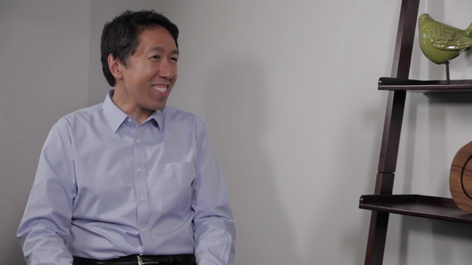

**吳恩達：**歡迎你，Rus，很高興今天你能接受採訪。

**Rus：**謝謝你，謝謝你，Andrew。

**吳恩達：**現在你是蘋果公司的研究主管，你也有一個教職，卡內基梅隆大學的教授，所以我很想聽聽你的個人故事，你是如何一步步進入深度學習領域工作的呢?

**Rus：**是的，其實，某種程度上，我進入深度學習領域純粹是運氣，我在多倫多大學讀的碩士，然後我休學了一年，我實際上在金融領域工作，很意外吧，那時候，我不太清楚是否要去讀一個博士學位，然後發生了一些事情，發生了一些意外的事情，有一天早上我要上班路上遇到了Geoff Hinton，Geoff告訴我，嘿，我有這個好想法，來我辦公室，我跟你說，所以我們基本上一起散步，然後他開始給我講波爾茲曼機器，對比散度法還有其他算法，當時我並沒有明白他在說什麼，但真的，我真的很激動，太令人興奮了，我非常興奮，後來就這樣，三個月內，我就跟著Geoff讀博了，所以這是開始，因為那是2005，2006年的事了，這是一些原始的深度學習算法，使用受限玻爾茲曼機，無人監督的預訓練，這些概念開始成熟，這就是一切的開始，真的是這樣，那個特別的早晨，我偶然碰到了Geoff，完全改變了我未來的事業發展方向。

**吳恩達：**然後你其實是早期一篇關於受限玻爾茲曼機的論文的合著者，真正讓神經網路和深度學習的概念涅槃重生，你可以告訴我更多關於那個研討會的工作嗎?

**Rus：**是的，這其實真的很激動人心，是的，那是第一年，我的PhD生涯的第一年，Geoff和我試圖探索使用受限玻爾茲曼機的這些算法，使用預訓練等技巧訓練多層網路，具體來說
我們集中精力處理自動編碼器，我們應該怎麼高效的去做PCA的非線性拉伸呢?這是非常令人興奮的，因為我們的系統能夠處理MNIST數字，這是令人興奮的，但那之後我們走的路，讓我們看到這些模型真的可以推廣到人臉識別，我還記得那時我們有這個Olivetti人臉數據集然後我們開始在想，是不是可以改善文件壓縮，我們開始觀察所有這些不同的數據，實值計數，布爾代數，用了整整一年，我還是博士生第一年，所以那是很充實的學習經驗，但是
真的在六七個月內，我們已經能夠得到非常有趣的結果，我是說非常好的結果，我想我們能夠訓練這些層次非常深的自動編碼器，，這是當時還做不到的事情，用傳統的最佳化技術做不到的事情，但接下來，這就變成了對我們來說非常激動人心的時期，那是超級激動人心的，是的，因為我那時不斷在學習新知識，但同時，我們的工作出來的結果，真的很令人印象深刻。

**吳恩達：**所以在深度學習復興初期，很多研究都集中在受限玻爾茲曼機上，然後是深玻爾茲曼機，還出來了很多令人興奮的研究，包括你們組的一些研究，但玻爾茲曼機還有受限玻爾茲曼機器現在怎麼樣了?

**Rus：**是的，這是一個很好的問題，我覺得在早期，我們使用受限玻爾茲機器的方式，你可以想像一下訓練一堆這些受限玻爾茲曼機，讓你能夠很有效地一次學習一層，有很好的理論基礎，告訴你添加特定的一層之後，你可以在特定條件上證明它是有變分界限之類的，所以是有理論支持的，這些模型能夠在預訓練這些系統方面達到很好的效果，然後在2009年左右，2010年，計算力量開始出現了，GPU開始很強，我們很多人開始意識到，直接最佳化這些深層神經網路，可以得到類似的結果，甚至更好的結果。

**吳恩達：**所以只是標準的反向傳播，不帶預訓練的受限玻爾茲曼機。

**Rus：**沒錯，沒錯，那之後大概過了三四年，大家都變得很興奮，因為人們覺得，哇，你真的可以用預訓練機制這麼訓練深層模型，然後，隨著更多計算力量變強，人們突然發現，你可以直接做標準反向傳播，那是2005年或2004年我們絕對做不到的事情，因為CPU計算要幾個月的時間，所以這是一個很大的變化，另一件事，我們還沒想清楚的是，如何使用玻爾茲曼機和深波爾茲漫機，我相信他們是非常強大的模型，因為你們可以把它們看成是生成性模型，它們試圖對數據進行耦合分布建模，但是當我們開始研究學習算法時，現在學習算法，他們需要使用馬爾可夫鏈，蒙特卡羅和變分學習等，它們並不像反向傳播算法那樣可以輕鬆擴展，我們還沒有想出更有效訓練這類模型的方法，還有卷積的使用，這些模型有點難以適應到現在的計算硬體，我還記得你當時有些工作用的是機率最大池化，來構建這些不同對象的生成模型，來構建這些不同對象的生成模型，但同時，訓練這些模型還是很困難的。

**吳恩達：**可行性有多高呢?

**Rus：**是啊，可行性有多高呢?我們還是要弄清楚怎麼辦，另一方面，最近使用變分自動編碼器的一些工作，例如，可以看成是可以看作是玻爾茲曼機的互動式版本，我們想出了訓練這些模組的辦法，是Max Welling和Diederik Kingma的工作，或者使用重新參數化技巧，我們現在可以在隨機系統內使用反向傳播算法，正在推動著各方面很大的進步，但是波爾茲曼機這邊，我們還沒想出應該怎麼做到這點。

**吳恩達：**這實際上是一個非常有趣的視角，我實際上並不知道在計算機較慢的早期RBM，預訓練真的很重要，只有計算硬體力量的上升才推動了到標準反向傳播的轉變，在社區對深度學習思想的演變方面，還有其他話題，我知道你花了很多時間思考這個，生成的無監督方法vs 監督的方法，你可以給我們分享一下你的想法是如何隨著時間推移演變的嗎?

**Rus：**是的，我覺得這真是，非常重要的話題，特別是如果我們考慮無監督，半監督或生成模型，因為某種程度上我們最近看到的很多成功案例是來自監督學習的，而在早期無監督學習主要被視為無監督預訓練，因為我們不知道如何訓練這些多層系統，即使在今天，如果你的系統面對的是大量無標籤數據和一小部分有標籤數據的樣本，這些無監督的預訓練模型建立這些生成模型可以幫到監督訓練，所以我覺我們社區裡很多人都抱有這樣的信念，當我開始做博士後，做的都是生成模型並試圖學習這些堆疊起來的模型，因為那時是訓練這些系統的唯一途徑，今天在生成建模領域裡有很多工作，你們看看生成對抗網路，你們看看變分自動編碼器，深度能量模型是我的實驗室現在正在研究的，我認為這是非常令人興奮的研究，但也許我們還沒有把它弄清楚，再次，對於正在考慮進入深度學習領域的許多人來說，這個領域我覺得，我認為我們還會取得很大進展，希望在不久的將來。

**吳恩達：**所以無監督學習。

**Rus：**無監督的學習，對，或者你可以看成是無監督學習或者半監督學習，其中我們會給一些提示或者例子，說明不同東西的含義，然後丟給你大量的無標籤數據。

吳恩達：所以這實際上是一個非常重要的見解，在深度學習的早期，那時計算機要慢一些，必須用到受限玻爾茲曼機和深玻爾茲曼機，初始化神經網路權重，但隨著計算機變得更快，直接反向傳播開始效果更好了。還有一個話題我知道你花了很多時間去想的，監督學習和生成模型，無監督學習的對比，你的看法呢?可以告訴我們，關於這個爭議的看法是怎麼隨時間演變的?

**Rus：**我們所有人都相信在那裡可以取得進展，就是這些玻爾茲曼機，變分自動編碼器，GAN 所有工作，你認為這裡很多模型都是生成模型，但是我們還沒有弄清楚如何真正讓它們變得可行，如何利用大量數據，即使對於..
我在IT業界見到很多，公司有大量的數據，大量的未標記的數據，有很多注釋數據的努力，因為現在這是取得進展的唯一途徑，我們應該能夠利用這些無標籤數據，因為實在太多了，我們還沒弄清楚如何做到。

吳恩達：所以你提到對於要進入深度學習領域的人，無監督學習是令人興奮的領域，今天有很多人想進入深度學習做研究或應用工作，對於這個全球性的社區來說，要做研究或應用工作，你會有什麼建議?

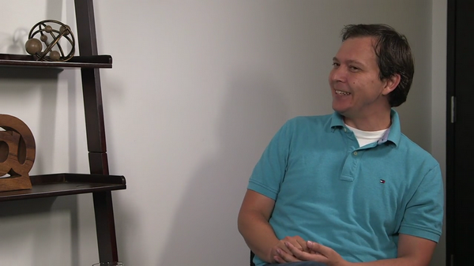

**Rus：**是的，我認為最關鍵的建議之一，要給進入這個領域新人的建議，我會鼓勵他們嘗試不同的事情，不要害怕嘗試新事物，不要害怕嘗試創新，我可以給你一個例子，當我是研究生時，我們正在研究神經網路，這些是非常難以最佳化的非凸系統，我還記得在最佳化社區的朋友聊天，他們的回饋總是這樣，這些問題你們解決不了的，因為這些是非凸的，你們不了解最佳化，凸最佳化都那麼難做，你們還要做非凸最佳化?然後令人驚訝的是在我們的實驗室裡，我們從來不關心這麼具體的問題，我們正在考慮如何最佳化，看看能否獲得有趣的結果，這種心態有效地推動了社區的發展，我們沒有害怕，也許一定程度上是因為，我們沒有認真研究最佳化背後的理論，但我會鼓勵人們嘗試，不要害怕，要試試挑戰一些困難的問題。

**吳恩達：**是的，我記得你曾經說過，不要只學編寫高層次的深度學習框架，應該實際了解深度學習的底層。

**Rus：**是的，沒錯，我認為，當我教深度學習課程時，我一直嘗試去做的是，在作業裡，我要求人們實際編寫，卷積神經網路的反向傳播算法，那很痛苦，但如果你做過一次之後，你就真正了解這些系統背後的運作原理以及如何在GPU上高效實現它們，我認為當你進入研究或工業界時，最重要的是你對這些系統實際在做的事情要有很深入的理解，所以我想這很重要。

**吳恩達：**既然你有學術界當教授的經驗，也有企業經驗，我很好奇，如果有人想進入深度學習領域讀博和進入公司各有什麼利弊?

**Rus：**是的，我認為這其實是個很好的問題，特別是在我的實驗室裡，我有各種背景的學生，有些學生想去走學術路線，有些學生想走工業路線，現在變得非常有挑戰性了，因為在工業裡你也能做出一流的研究，你也可以在學術界做出一流的研究，但利弊方面，在學術界，我覺得你有更多的自由來處理長期的問題或者如果你喜歡思考一些瘋狂的問題，你想自由自在的工作，去研究，與此同時，在企業裡的研究也很激動人心，因為很多情況下，你的研究可以直接影響到數百萬用戶，比如開發一個核心的AI技術，顯然，在企業裡你有更多的計算資源，能夠做到非常驚人的事情，所以都有優缺點，這真的取決於你想做什麼，現在環境非常有趣，有學術界轉向工業界的，還有工業界的轉向學術界的，雖然更少一點，但現在是非常令人興奮的時代。

**吳恩達：**聽起來學術界機器學習不錯，企業界機器學習也很棒，最重要的是跳進去，對吧?選一個，跳進去。

**Rus：**這真的取決於你的喜好，因為你在什麼地方都可以做出驚人的研究。

**吳恩達：**所以你提到無監督學習是一個令人興奮的研究前沿，你覺得還有其他領域你覺得是令人興奮的研究前沿嗎?

**Rus：**是的，當然了，我想我現在看到，在現在的社區裡看到，特別是在深度學習社區，有幾個趨勢，我認為有一個特別的趨於特別令人興奮是深度加強學習領域，因為我們能夠弄清楚，我們如何在虛擬世界中訓練代理程序，這是過去幾年裡，我們看到很多的有很多進展，我們是如何把這些系統推廣到更大規模上，我們如何開發新的算法，如何讓代理程序互相溝通，我覺得這個領域，一般來說，你能和環境交互這些場合是非常激動人心的，我認為還有另一個領域令人興奮，就是推理和自然語言理解的領域，我們可以建立基於對話的系統嗎?

我們可以建立能夠推理，能夠讀懂文本的系統，能夠智慧回答問題的系統嗎?我認為這是現在很多研究的重點，然後還有另一類子領域也是，這個領域可以從很少的幾個例子中學到知識，所以通常人們說是一次學習或遷移學習，你從環境習得某種東西，然後我給你一個新的任務，你可以很快地解決這個任務，就像人類一樣，而不需要很多很多帶標籤的樣本，所以這個概念是我們社區裡很多人都想弄清楚的，我們應該如何做到，如何達到接近人類的學習能力。

**吳恩達：**謝謝Rus給我們分享所有的評論和見解，更有趣的是，能聽到你的早年故事

**Rus：**謝謝 Andrew，是的，謝謝你的採訪。

### 吳恩達採訪 Yoshua Bengio

**吳恩達：**Yoshua你好，很高興您能參加我們的訪談活動(字幕來源：網易雲課堂)。

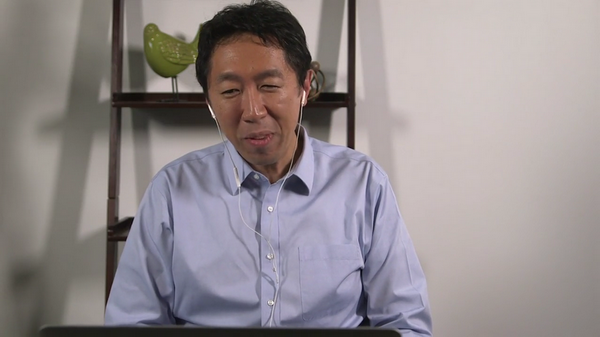

**Yoshua：**我也很高興。

**吳恩達：**您不僅僅是深度學習方面的研究員，工程師，還是該領域和學術研究界的代表人物之一，我很想知道您是如何入門的，您是如何進入深度學習這個領域
，並不懈探索的。

**Yoshua：**小的時候，我讀了很多科幻小說和很多同齡人一樣，1985年研究生階段，我開始閱讀神經網路方面的論文，當時特別興奮，也逐漸對這個領域燃起了熱情。

**吳恩達：**1980年代中期 1985年。您還記得當時讀到那些論文的情形嗎？

**Yoshua：**當時和專業人士們一起上經典的AI課程，我突然發現，這個領域研究的都是人類如何學習，人工智慧，如何把人類學習與人工智慧和計算機聯繫起來這樣的問題，發現這類文獻的時候我異常興奮，於是開始拜讀Geoff
Hinton等人撰寫的，關於聯結主義的論文，我研究過循環神經網路，語音識別，HMN，圖模型，之後我很快進入了AT&T貝爾實驗室和麻省理工學院攻讀博士後，並發現了訓練神經網路的長期依賴問題，之後不久，我受聘來到蒙特婁大學任教，我的年少歲月多半也都是在蒙特婁度過的，過去幾十年一直投身於此。

**吳恩達：**
您一定深有感觸，談談您對深度學習的看法以及神經網路這些年的發展歷程吧。

**Yoshua：**我們從實驗，直覺認識入手，而後提出了一些理論，現在我們在認識和理解上清晰了很多，比如為什麼Backprop（反向傳播）如此行之有效，為什麼深度如此重要，當時我們對這些概念沒有任何可靠的論證依據，2000年初，我們開始研究深度網路的時候，我們直覺認為神經網路更深才會更加強大，但是我們不知道應該如何深化，如何最佳化，當然，我們最初進行的相關實驗也未能成功。

**吳恩達：**與30年前相比，您認為哪些最關鍵的設想得到了時間的驗證，而哪些又錯得最讓人意想不到我犯過的一個最大的錯誤就是和當時90年代所有人一樣，我也認為執行backprop需要光滑非線性算法，因為我覺得，如果當時我們有非線性矯正算法，它有些部分會比較平坦，訓練起來就很難了，因為很多地方的導數都是0，2010年前後，我們開始在深度網路中嘗試Relu算法，我當時執著地認為，我們應當注意導數為0區域上的神經元會不會太飽和，最終，ReLU比sigmoids函數的效果更好，這出乎我的意料，我們探索這個函數是生物連接的原因，並非我們認為它更容易最佳化，但結果證明它效果更好，之前我還認為它訓練起來會比較難。

**吳恩達：**請問，深度學習和大腦之間有什麼關係，雖然有明確答案，但我更想知道您對此的看法。

**Yoshua：**最初讓我關注神經網路的一種見解是，連接主義者提出訊息是分布在被啟動的神經元中，而不是由祖母細胞來描述的，他們稱之為“符號描述”，它是傳統AI的觀點，我依然相信這是非常重要的訊息，甚至近期，人們重新發現它的重要性，它確實是一項重大發現，深度學習是後來才提出的，大約在2000年初，但是我90年代研究的並不是這些。

**吳恩達：**是的，我記得，很早以前，您曾搭建過許多相對不深的詞向量分布式表達。

**Yoshua：**是的，沒錯，那是90年代後期，我很感興趣的內容之一，我和我兄弟Samy一起做了嘗試就是使用神經網路來解決維數災難的問題，它是統計學習中的一個核心問題，我們能夠以一種非常高效的方式，利用這些分布式表達來表示許多隨機變數的聯合分布，效果很好，之後我把它擴展到詞序列的聯合分布，這就是詞向量的由來，因為我當時認為，這可以實現對擁有相似語義的單詞的泛化。

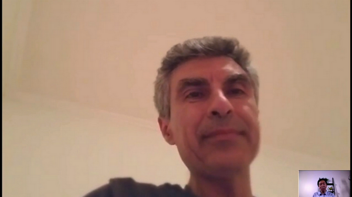

**吳恩達：**過去20年，您的研究小組完成了多項研究，提出了很多想法，短短幾分鐘之內無法細數，我好奇的是，小組中的哪項研究或想法，最讓您感到自豪。

**Yoshua：**好的，我前面提到了長期依賴的研究，我想人們依然不能很好理解它，然後是我剛提到的維數災難，還有近期應用於神經網路的聯合分布，它是由Hugo Larochelle負責的涵蓋了應用於聯合分布的，學習詞向量的各項工作，然後，我覺得，我們最被關注的研究就是深度學習在自動編碼器和RBMs堆棧上的應用，還有就是，如何更好地理解用初始化參數解決深度網路訓練的難點，還有深度網路中的梯度消失，這項研究及後續實驗體現了分段線性活化函數的重要性，其他重要研究還包括無監督學習，降噪自動編碼，GANs，這些都是當前非常流行的生成式對抗網路，我們對基於注意力機制的神經網路機器翻譯的研究，對翻譯工作起到了很重要的作用，現在已經應用到工業系統中，如谷歌翻譯，對注意力機制的研究確實改變了我對神經網路的看法，我們曾經認為神經網路只是機器，不過是向量之間的映射，但基於注意力機制，我們現在可以處理各種數據結構，這的確打開了很多有趣領域的大門，生物學聯結方面，最近兩年我一直在研究的一個課題是，就是我們如何想出像backprop這樣的概念，而且大腦也可以執行，我們已經發表了幾篇論文，神經科學界人士對此很感興趣，我們將繼續對這個課題的研究。

**吳恩達：**我知道你一直關注的一個話題就是，深度學習與大腦之間的關係，能談談這個嗎？

**Yoshua：**我一直在思考兩者這間的生物學關聯，而且平日裡也經常"幻想"，因為我覺得它就像個謎題，首先通過學習大腦，研究大腦，我們有這麼多的證據，如穗時序依賴型可塑性，但另一方面，們又有這麼多關於機器學習的概念，比如針對一個目標函數對整個系統進行全局訓練，比如Backprop，，麼Backprop到底是什麼意思，還有
"信用分配"到底是什麼意思，當我開始思考大腦如何能像backprop一樣工作時，就想到，許在backprop背後，在著更通用的概念，可以讓backprop更高效地工作，也許有很多方法可以完成信用分配，這也呼應了增強學習領域的一些問題，所以說這一點很有意思，一個簡單的問題開始，你會一步步思考更多的問題，而讓你把這麼多不同的事物聯繫起來，像在解一個大謎題，這個過程持續了幾年，我要說一點，這些所有的嘗試大一定程度上是受了Jeff
Hinton的啟發，他在2007年的時候發表過一次演講，當時是第一個關於深度學習的研討會，他講了他對於大腦工作方式的想法，比如怎麼利用時間編碼，來輔助backprop的一些工作，這件事對我近幾年的一些探索起到了引導性的作用，說起來這一路走來，已經有10多年了。

**吳恩達：**另外我經常聽到你談到的一個話題就是無監督學習，能說說關於這方面的想法嗎？

**Yoshua：**當然，無監督學習非常重要，目前業內的系統都是基於有監督學習的，這就要求人類先定義出當前問題的一些重要概念，並在資料庫中講這些概念標記出來，目前的玩具問題服務，系統都是基於這個的，但人類本身其實可以做得更好，人類可以探索世界，通過觀察發現新的概念並與世界互動，2歲的小孩，能自己理解直觀物理概念，比如他們理解重力，理解壓力，理解慣性，理解液體，固體，而且他們的父母並沒有給他們解釋過這些概念，那他們是怎麼理解的呢，這就是無監督學習所要解決的問題，不是簡單地在資料庫中做不做標識的問題，而是如何構建一個精神結構，從而解決如何透過觀察來解釋世界，最近，我還在嘗試，把無監督學習和增強學習整合在一起，因為我相信，我們在努力嘗試解釋的重要基礎概念，原本是有很強的指示的，但我們可能沒有把它們聯繫起來，也就是說，人類或機器如何通過與世界互動，通過探索世界，嘗試不同的事物和控制事物，這些是我認為與無監督學習緊密關聯的，所以我15年前一開始研究無監督學習時，從不同的機構，到RBM等等，最主要關注的是如何實現學習"良好的表現"，當然現在這個問題也仍然重要，但是我們不確定的是到底如何定義“良好的表現”，比如如何確定一個目標函數，過去幾年我們試了好多方法，這也是無監督學習研究的一個魅力所在，解決方案的想法有很多，解決問題的方式有很多，也許明年我們就會發現一個完全不同的方案，也許大腦的工作方式跟我們現在所知的完全不一樣，目前該領域還沒有進入漸進式研究，它本身還是在探索一個完全未知的領域，我們現在還不能清晰地確定什麼樣的目標函數，能夠評估一個系統在無監督學習上是否表現的很好，當然，這很有挑戰性，但同時它也意味著更多未知的可能，而這一點正是研究人員最為著迷的，至少我是這樣。

**吳恩達：**今天，深度學習已經得到了長足的發展，我想目前不管對於誰來講，都不太可能遍歷現今所有關於深度學習的著作了，所以我比較好奇，關於深度學習，你最感興趣的是什麼。

**Yoshua：**我比較有想法，我感覺現在關於深度學習的研究，已經脫離了我心目中最理想的方向，我感覺現在機器經常出現些小錯誤，說明它對世界的認知還很表面化，所以最讓我興奮的是，我們現在的研究方向，不是要讓我們的系統實現什麼功能，而是回到最本原的原理，如何讓電腦來觀察世界，與世界互動，發現世界，即使世界很簡單，就像編一個電腦遊戲，我們也沒辦法做得很好，但是這點很好，因為我不用跟谷歌，Facebook，百度他們競爭，因為這就很根本的研究，誰都可以做，而且在家裡的車庫裡就可以了，當然，解決這個問題的方向有很多，但我也看到很多溝通互動功能方面，深度學習和增強學習的融合起著很重要的作用，我非常激動的是，這個方向的研究進度，，在實際應用方面已經有了很大的成就，因為如果看一下我們在實際應用方面面臨著巨大的挑戰，比如如何應對新的領域或新的範疇，現成的成功的案例很少，但是人類解決這些問題是完全沒有問題的，而對於這些遷移學習的問題，如果我們能夠讓計算機更好地理解世界，處理這些就會效果好很多，更深度的理解，是吧，眼前的世界在發生什麼，我看到的是什麼，如何透過行為來影響我的所見所聞，這些是我最近最為關心的問題，另外過去20年人工智慧面臨的老問題，深度學習都已經有了變革性的發展，因為深度學習的大多數成功是在認知層面的，那接下來的目標呢，接下來的就是高級條件，就是在抽象層面明白事物的原理，現在我們在研究如何能讓機器理解更高級的抽象層面，目前還沒有達到，所以我們要繼續努力，我們要研究原因，研究訊息的時序處理，要研究因果關係，如何讓機器自己來發現這些事物，未來可能還需要人類的指導，但主要還是要自主完成。

**吳恩達：**根據你的描述來看，你是喜歡使用研究方法的，比如你在做的"玩具問題"實驗——這裡完全沒有貶意，是的，但只是對於小問題，而且你相信這個未來可以轉到大的問題上。

**Yoshua：**是的，完全可以，當然我們先要一點點加大規模，從而最終實現，對這些問題的解決，但是之所以先從玩具問題入手，是因為它可以讓我們更清楚地明白我們的失敗，從而開始對直觀物理概念認識的研究，讓機器更容易地理解這些概念，算是經典的分步解決方法吧，另外，我覺得有些人可能沒想過的是，其實研究週期是可以快很多的，如果幾個小時就能做一個實驗，我的進度就可以快很多，如果需要嘗試一個較大模型，用來捕捉常識，和普通知識層面的事物，當然這個最後我們是要去做的，只是現有的硬體，每次實驗都要花太多時間，所以在硬體運行速度提到上千上百萬倍之前，我只能先做玩具問題的實驗。

**吳恩達：**您還說過，深度學習，不僅僅是一門工程學科，還要多下功夫去了解其中的來龍去脈，可否分享一下您的看法。

**Yoshua：**是的，的確如此，我們目前的工作（方式）有點像盲人走路，我們運氣不錯，也發現了一些有趣的東西，但是，如果我們能夠稍微停一停腳步，試著以一種可以轉換的方式理解我們所做的事情，因為我們要歸於理論，我所說的理論不一定是數學，當然我喜歡數學，但是我不認為一切事物都要數學化，而是要邏輯化，並不是我可以讓別人相信這樣有用，可行，這才是最重要的，然後再透過數學來強化和精煉，但更多的是理解，還有做研究，不是要成為下一個基準或標杆，或者打敗其他實驗室，他公司的人，更多的是，我們應該提出哪些問題來幫助我們，更好地理解我們感興趣的現象，比如，是什麼導致更深度神經網路，或循環神經網路很難訓練，我們已經有了一些認識，但還有很多東西我們不了解，所以我們設計實驗，可以不以獲得更好的算法為目的，而是以更好地理解現有算法為目的，或者研究某算法在什麼情況下表現更好並找到原因，為什麼才是真正重要的，科學的意義就是提疑解疑。

**吳恩達：**現如今，有好多人希望進入這個領域，您會給那些想進入AI和深度學習領域的人一些什麼建議呢？我知道在一對一活動上，您已經回答過很多次了，不過我還是代觀看影片的所有網友問一問。

**Yoshua：**首先大家可以從事的工作和目的各不相同，研究深度學習和應用深度學習來構建產品，所需要具備的東西可能並不一樣，在認知水平上，這兩種情況是不同的，但是無論哪種情況都需要親身實踐，想真正掌握一門學問，比如深度學習，當然，也需要大量閱讀你必須自己動手編程，我經常面試一些使用過軟體的學生，現在有太多即插即用的軟體，使用者根本不了解自己在做什麼，或是只停留在粗淺了解的程度，一旦出現問題，使用者很難解決，也不知道原因，所以大家要親自實踐，即便效率不高，只要知道是怎麼回事就好，這很有幫助，儘量親自動手。

**吳恩達：**所以不要用那種幾行程式碼就可以解決一切，卻不知道其中原理的程式框架。

**Yoshua：**沒錯，沒錯，我還想說的是，如果可以的話，儘量從基本原理入手獲取認識，真的很有幫助，當然，平時還要多閱讀，多看看別人的代碼，自己動手編寫程式碼，多做實驗，要真正理解自己做的每一件事，尤其是科學研究層面，多問問自己，我為什麼要這麼做，人們為什麼要這麼做，也許書中就能找到答案，所以要多讀書，如果能自己搞清楚當然更好。

**吳恩達：**很酷的建議，我讀了您和Ian Goodfellow、Aaron Courville合編的書，各方評價很高。

**Yoshua：**謝謝， 謝謝，是的
，銷量不錯，有點超出預料，我感覺現在讀它的人要比能讀懂它的人多，呵呵呵，ICLR大會論文集可以說是，優秀論文最集中的所在，當然，NIPS，ICML和其他大會也有非常優秀的論文，但如果你想閱讀大量優秀論文，去看看最近幾年的ICLR大會論文集就好，你會對這個領域有一個良好的認識。

**吳恩達：**酷，有人會問 ，關於深度學習，如何才能做到掌握和精通？對此您有什麼看法和建議呢。

**Yoshua：**這個取決於你的背景，不要畏懼數學，只管發展直覺認識，一旦在你在直覺經驗層面得心應手了，數學問題會變得更容易理解，好消息是，不需要攻讀五年博士也可以精通深度學習，你可以很快速地上手學習，如果你具備良好的電腦科學和數學功底，幾個月時間，你就可以學到足夠的應用知識來構建系統，並開始進行研究性實驗，接受過良好培訓的人可能6個月左右吧，或許他們對機器學習一無所知，但是，如果他們精於數學和電腦科學，學起來會非常快，當然，這意味著你要具備良好的數學和電腦科學背景，有時候，電腦科學課程上學到東西還遠遠不夠，你還要繼續學習，尤其是數學知識，比如，機率，代數和最佳化。

**吳恩達：**了解，還有微積分。

**Yoshua：**對，對，還有微積分。

**吳恩達：**非常感謝Yoshua與我們分享這些看法，見解和建議，雖然認識您已久，但很多早期經歷的細節我也是今天才知道，謝謝。

**Yoshua：**也謝謝Andrew製作了這樣一個特殊的訪談以及現在所致力的事情，希望能夠為大家所用。

### 吳恩達採訪 林元慶

**吳恩達：**歡迎你，元慶，今天你能參與我們的活動，我真的很高興。

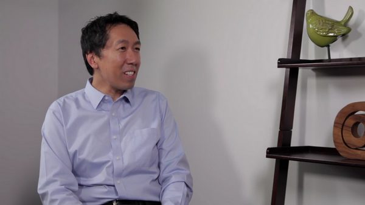

**林元慶：**沒問題。

**吳恩達：**如今你是IT屆的領頭羊，當中國政府尋求英才，去著手建立國家深度學習實驗室時，他們發掘了你，我認為在深度學習領域，你可以說是全國第一人，我想問一些關於你工作的一些問題，但在這之前，我想聽聽你的個人經歷，那你是如何發展到做現在的工作的？

**林元慶：**好的，事實上，在我讀博士之前，我的專業是光學和物理學有很多共同之處，我認為，我的數學基礎很堅實，我來美國之後，我就想什麼專業能做我的博士課題？我就想，好吧，我可以選擇光學或者其他什麼的，早在2000年的時候，我覺著那時候奈米技術很紅，但我當時就想也許我應該著眼於更激動人心的東西，恰巧那時有個好機會，我在賓夕法尼亞大學上課，在那裡，我認識了Dan Lee，之後，他成了我的博士導師，我就想機器學習是很棒的一件事情，我興奮異常，然後換了專業，因此我是在賓夕法尼亞大學讀的博士，我的專業是機器學習，我在那待了5年，很令人興奮的時光，我學到了很多東西，很多算法甚至是PCAs，我以前從不知道那些東西，我感覺每天都會學到新的東西，所以對我來說，那是極其令人激動的經歷。

**吳恩達：**那是你許多新嘗試之一，你做了很多工作，儘管在那些時代並不為人所欣賞。

**林元慶：**對，確實是，所以我認為NEC是個神奇的地方（NEC：美國智慧圖像研究院），剛開始我在那裡的身份是一名研究人員，我也喜歡，學到很多東西的感覺，事實上，在NEC的後期，我開始研究計算機視覺方向，說真的，在計算機視覺領域，我起步相對較晚，那時
我做的第一件事是參加了ImageNet大規模視覺識別挑戰賽，那時這個比賽第一年舉辦，我負責一個團隊研究一個項目，很幸運，我們實力很強，我們得了第一，以絕對的優勢得了第一。

**吳恩達：**所以你是ImageNet挑戰賽冠軍的第一位得主？

**林元慶：**是的，我在那場會議上做了演講，對我來說，那是一次很棒的經歷，那讓我接觸到了如此大型的計算機視覺技術，從那時起我就開始研究這種大型問題了，當紐約時報頭版文章發表後，之後關於AlexNet也被發表時，我真的很震驚，我想，哇，深度學習是如此強大，從那以後，我在此方面付出很多努力。

**吳恩達：**作為中國國家深度學習實驗室的主任，你們肯定正研究很多振奮人心的項目，那對正在觀看的全球觀眾而言，關於這個實驗室，他們應該了解些什麼？

**林元慶：**國家工程實驗室的目標就是建立一個巨大的深度學習的平台，希望是最大的一個或至少在中國是最大的，這個平台會給大家提供深度學習的框架，類似於PaddlePaddle，我們會提供大規模的計算資源，我們還提供龐大的資料庫，如果大家能夠能在這個平台上開展研究或開發好的技術，我們會提供巨大的應用空間，比如說，技術在巨大的應用如百度上被證明，技術水準就可以融合進來並對其做出改善，因此，我們認為整合這些資源，我認為會造就一個強大的平台，我各舉一個例子，比如說，我們現在發表了一篇文章，另一個人想要重複操作的話，最好的方法就是在某平台處提供代碼，之後你就可以把代碼下載到電腦上，，你會嘗試尋找某處的數據組，然後你大概也需要得到好的計算能力，以便讓你的計算資源運轉如飛，所以這一切會讓你省些功夫，在國家實驗室工作將會變得很容易，如果某些人應用此平台做一些工作，寫一些文章，實驗室能在平台上擁有這些程式碼，計算架構已經建立起來了，數據也是，基本上你只需要一根線把資料庫連接起來，所以，這可以給電腦科學重複性問題的損失帶來巨大改善，所以，很簡單的，在幾秒之內，你就可以開始學習文獻上的一些東西，對，這是很強大的，所以，這只是我們工作中的一個例子，以確保我們提供給整個社會和產業一個真正有效的平台。

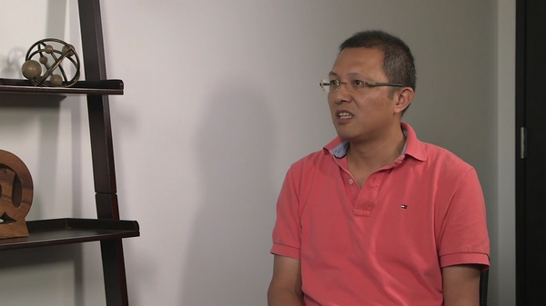

**吳恩達：**太神奇了，這確實加速了深度學習研究。

**林元慶：**沒錯。

**吳恩達：**你能透露下中國政府給國家深度學習實驗室提供了多少資源嗎？

**林元慶：**我認為，對於國家工程實驗室而言，政府可以投資建設一些基礎設施，但我認為更重要的是這將會成為中國的一個旗艦機構，引領許多有關深度學習方面的研究，包括像國家項目，法律政策等，事實上這是很有效的，我認為百度，我們很榮幸擁有這個實驗室。

**吳恩達：**你可以說是居於中國深度學習領域的核心地位，中國有很多項目，全世界的觀眾都還未曾意識到或見到，那國外的人們，應該對中國的深度學習領域有哪些了解呢？

**林元慶：**我認為在中國，尤其是過去的幾年，深度學習充實了一個產品，此領域的確在急速發展，從搜尋引擎到，比如說，詞組識別，監控，乃至電子商務等許多方面，我認為，他們正在深度學習領域投入巨大的努力，並充分利用技術使這個產業變得更有影響力，總體而言高科技的發展是很重要的，我認為對我來說，能和許多人分享這些，我們相信，這是很重要的，這通常被稱為正向循環，舉個例子，我們開始構想建立一些技術，這些技術會有一些初始數據，也會有一些初始算法，這些會形成服務的初始產品，接著我們能獲得用戶的數據，其他人會得到更多的數據，所以，我們就可以研發更好的算法，因為我們看到更多的數據就會找到更好的算法，於是我們就有了更多的數據和更好的算法，我們就可以為產品服務提供更先進的技術，然後我們也絕對希望會吸引到更多的用戶，科技變得更加先進，接著，我們就可以得到更多的數據，這是非常好的積極地舉措，這也是很特別的，尤其對於AI相關的科技和比如雷射等傳統科技而言，我以前研究過那些，所以，科技發展的過程會變得很線性，但之前AI科技因為有了正向的循環，你可以想像科技肯定會發展的非常快，當我們進行研究時，這也是很重要的，當我們設計ND時，我們在快速發展時期的方向研究，，但如果整個產業沒能夠建立起這個正向循環，如果我們沒能夠建立起這個強大的正向循環，這很可能行不通，因為有遠見的其他人會建立起此循環，他們會比我們更快的到達那個水平，對我們而言，這個邏輯很重要，需要我們注意，比如說，你需要一個公司，那我們該在哪個方向研究，不該在哪個方向研究，，這絕對是需要注意的因素。

**吳恩達：**如今，無論在中國，還是美國乃至全球有許多人想進軍深度學習和AI領域，對於那些人你有什麼建議？

**林元慶：**如今，初始進軍者肯定擁有開源框架，我認為這是很有效的，當我開始研究深度學習時，當時並沒有很多開源資源可用，但今天，在AI 特別是深度學習領域，是很好的一個社區，那有很多很傑出的人才，就像是TensorFlow，一個caffe，他們也稱之為caffe 2是吧？在中國，我們有很好的PaddlePaddle甚至是在網上，他們有很多教學課程，教你怎麼利用那些資源，還有，如今也有很多公共可用的標準，人們會看到技術高超，富有經驗的先驅，比如，他們是怎麼利用那些標準的，總的來說，是接觸深度學習的好時機，我認為，這些都是很好的出發點。

**吳恩達：**你是如何得到這些啟發的？

**林元慶：**事實上，我曾走在南轅北轍的路上，我學習了PCA LDA等其它之後，才學習的深度學習，總體而言，我感覺這也是條不錯的學習道路，打下了很多基礎，我們學習了圖模型，這些都是很重要的，儘管現在，深度學習發展的無法想像，但知道一些規則會給你關於深度學習的運作模式很好的直覺感，然後有一天，深度學習和法則之間會產生關聯，就像框架和途徑那樣，我認為這之間存在很多聯繫，這些法則豐富了深度學習，我的意思是為深度學習提供了多樣途徑，是的。我認為開放原始碼是很好的開始，那是很有效的資源，我還會建議你學習一些有關機器學習的基礎知識。

**吳恩達：**謝謝你，聽起來很棒，即使我認識你很長時間了，我現在都沒想到你思考的很多細節，很感謝你。

**林元慶：**謝謝讓我參與。

### 吳恩達採訪 Pieter Abbeel

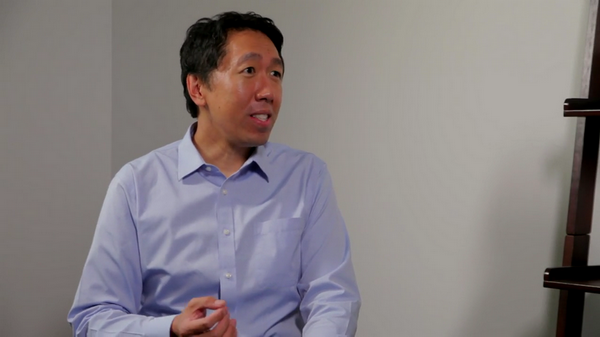

**吳恩達：**謝謝你，Pieter，能夠來到這(字幕來源：網易雲課堂)，很多人都認為你是一位有名的機器學習，深度學習，機器人技術的研究者，我想讓更多人知道你的故事，你是怎麼開始的呢。

**Pieter Abbeel：**這是個好問題，要是你問14歲的我，我的志向在什麼，可能就不會是現在的答案，那時候我想當職業籃球運動員，我不認為我能做到。

**吳恩達：**機器學習僥倖做成了，籃球應該沒戲。

**Pieter Abbeel：**是的，沒戲，打籃球很好玩，但是變成職業不太行，在學校我最喜歡物理和數學，所以之後學工程就比較自然，也就是實際應用物理和數學，之後，我本科畢業於電子工程後，我不太確定做什麼，因為工程相關的一切都太有趣了，去懂得一個東西如何運作很有趣，建一個東西也是某種意義上，AI贏了，因為看起來它在某種程度能幫助所有學科，並且它看起來是一切東西的核心，你會思考一個機器怎麼思考的，那可能是一切的核心，也就不用選某個特定的學科。

**吳恩達：**我一直在說AI是新的電力，聽起來14歲時的你，已經有很超前的意識，過去幾年你在深度增強學習中貢獻很大，現在情況如何，為什麼深度增強學習突然變得重要。

**Pieter Abbeel：**在我研究它之前，我研究了很多增強學習，與你和Durant在斯坦福的時候，
當然了，我們做了自主直升機飛行，後來去伯克利和我的學生們，做了個會疊衣服的機器人。可以說是用組合的學習方式來描述，做成一些不學習就無法做成的事，也結合了領域知識才能完成，這很有趣，因為你需要領域知識，想辦法學到很好玩，但同時每次想做成新的應用都會很耗時，需要領域知識和機器學習知識，在2012年，通過Geoff Hinton多倫多小組對ImageNet的研究結果突破AlexNet證明監督學習，突然之間大大減少了工程量，AlexNet中所用的工程量非常之小，讓我開始思考，我們該用類似觀點回顧增強學習，看我們能否用增強學習做與監督學習同樣有趣的事。

**吳恩達：**聽起來你早於，大多數人前，發現深度監督學習的潛力，展望未來，你看到下一件事是什麼，你對下一階段有什麼樣的預測在深度增強學習中。

**Pieter Abbeel：**我認為深度增強學習有趣在於，某種程度上比監督學習有更多的問題，在監督學習中問題在於輸入，輸出，映射；在增強學習中是數據是從何而來的，就是探索問題本身，當你有數據之後，你怎麼做信用賦值，你怎樣理解早期做什麼，才能之後受益以及安全問題，當你有自主收集數據的系統後，在很多情況下其實很危險，想像一家自駕車公司說，我們只會用深度增強學習來運行車輛，聽著就像會有很多事故，在真正起作用之前。

**吳恩達：**你需要反面例子，對吧。

**Pieter Abbeel：**是需要反面例子，希望也有正面的，我覺得深度增強學習還有很多挑戰，

在解決特定問題時及如何做成功，深邃的部分在於表達，增強學習本身還有很多問題，我個人覺得是深度學習的進步，一部分增強學習的謎團能被解開，就是表達的部分，如果有模式，我們可能表達為一個深度網路，並抓取模式，怎麼分解模式仍然是增強學習中很大的挑戰，我認為大挑戰在於，如何讓系統在長時間線上保持推理能力，現今很多深度增強學習，都是短時間線上的。還有很多問題是，如果對五秒的反應不錯，對整個問題的反應都會不錯。五秒和一天的規模相差很大，或是讓機器人或軟體主體保持一輩子的功能。我認為這裡面有很多挑戰，安全方面的挑戰是如何安全持續地學習，當效果已經很不錯時。所以，再舉個例子，很多人對自主駕駛車很熟悉，讓它們比人開車更好，假設人在每三百萬英里，碰到一次很糟的事故，會需要很長時間才會有負面數據，如果和人一樣好的話，但你想要更好，那麼數據的收集就變得很難，很難得到讓系統表現更好的數據，探索其中有許多牽連的挑戰，我最興奮看到的是，我們能不能往後一步，還是能學增強學習的算法，增強是很複雜，信用賦值也是，探索更是，就像對於深度學習中的監督學習，可以做到替代領域知識，可能也能有程序--增強學習的程序也能做到所有，取代我們親自設計細節。

**吳恩達：**比如整個程序的回報函數。

**Pieter Abbeel：**這就需要學習整個增強學習程序，可能是，想像一下，你有這麼個程序，不管是什麼，你給它一個問題，看多久才能學會，然後發現，嗯，花了挺久，讓另一個程序來修正原本這個，加完這一步，試試看，要是學的快多了，修正的就很好，然後從此想辦法繼續進步。

**吳恩達：**我明白了，奠定基礎。

**Pieter Abbeel：**這可能和可用的計算量有關，就像在內環中運行增強學習，現在，運行增強學習是最後一步，越多計算量越有可能運行的了，就像在內環的增強學習是更宏觀算法的一部分。

**吳恩達：**從14歲起，你在AI工作有二十多年了，你怎麼理解AI這段時間的進化。

**Pieter Abbeel：**我試著理解AI的時候很有趣，因為其實與我在斯坦福的碩士學位相符，其中有很多領袖我親自交流過的，比如John McCarthy，但用的方法與眾不同，相比較2000年時，大多數人在做的事，然後和Daphne
Koller的交談，形成了我對AI最初的想法，她的AI課程，她的機率圖模型課，讓我真正產生興趣，隨機的變數如何應用於簡單的分布，再被分成子集變數，然後其他的結論，都會讓你知道好多，要是能讓它計算起來也容易，那就很具挑戰了，從那之後，我開始攻讀博士，你到斯坦福後，是個很棒的現實提醒，也就是，不該去檢驗你研究裡的度量是否正確，而是去看一種關聯，你在做的事情和影響你的東西之間有何關聯，你的研究實際改變了什麼，而不是具體裡面出現的數學。

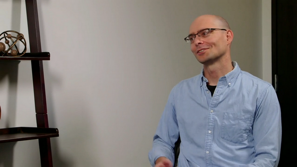

**吳恩達：**對，很棒，我沒發現之前遺忘了這點。

**Pieter Abbeel：**是的，這是其中一件，除了大多數人在問的，哪一個Andrew給的意見，一直在影響你，是確保你能看到這種關聯性。

**吳恩達：**你已經並且會繼續在AI領域有很棒的職業前途，對一些在看影片的人，要是他們想入門AI，你有什麼意見。

**Pieter Abbeel：**我想現在是進入AI的大好時機，需求量是如此之高，工作機會如此之多，有大量研究課題，也有大量創業機會等等，所以我很肯定決定入行是很機智的決定，你們中的大多數都能夠自學，不管是不是在學校裡，有好多好多網課，比如andrew的機器學習課，也有，比如說，Andrej Karpathy的深度學習課，也有線上影片，作為開始很棒，Berkeley也有增強學習的課程，所有課都在網上，都是很棒的入門方式，很重要的是，你自己要真正著手去做，不是只看看影片，要親自試，可以用TensorFlow，Chainer Theano，PyTorch等等，隨便你喜歡哪個，開始是很容易的，進展也會很快。

**吳恩達：**只要不斷練習，對不，實際操作並關注什麼成功了，什麼沒成功。

**Pieter Abbeel：**Mashable上週有篇文章，講一個英國16歲，Kaggle比賽中的領導，裡面提到他跑去學習，在網上找到東西，自學了一切，從未上過任何正統課程，一個16歲的少年能在Kaggle上有這麼強的競爭力，說明是真的可能。

**吳恩達：**我們生在好時代，對人們學習的好時代。

**Pieter Abbeel：**完全正確。

**吳恩達：**還有個應該常被問到的問題是，要是有人想進入AI機器學習，深度學習的領域，他們該讀博還是去大公司工作。

**Pieter Abbeel：**
很大程度上取決於你能得到的指導，在博士學位裡，基本肯定的，是教授的本職工作，也是你的導師，會來主動找你，竭盡他們所能去成就你，幫助你在任何領域，比如AI，得到成功，有很多用功的人，有時會有兩個導師，那是他們的本職工作，也是為什麼他們當了教授，大多數教授都能幫助學生做更多事情，但不是說在公司裡不是這樣，很多公司有很棒的導師並且很愛幫助教育和推進其他人等等。只不過是，可能不會有那樣的保障，不會像攻讀博士一樣，而博士的一大優點，就是你肯定能學到好多並且總有人能幫助你學習。

**吳恩達：**取決於公司和博士項目本身。

**Pieter Abbeel：**完全正確，但是我想，主要還是得自己能學很多東西，要是自學的很快，再加上一個更有經驗的人，能加速過程，因為他們的職責就是幫助推進你的進步。

**吳恩達：**你是深度增強學習中很有名的領袖之一，那麼是什麼樣的東西，在深度增強學習中已經很成功了。

**Pieter Abbeel：**關注深度增強學習中的成功例子，非常非常引人入勝，比如說，通過像素學習玩Atari，處理像素也就是被處理的數字，被變成一個遊戲中的行動，然後，舉個例子，我們在Berkeley做過的一些研究，造了會走路也有回饋的模仿型機器人，只是簡單的告訴它越往北走越好，對地面影響越小越好，它突然會選擇，走路或跑步，即使並沒有人告訴它什麼是走和跑，或讓機器人學講給兒童的故事，並想法子組在一起，創造更多開放結局等等。

我認為有趣的是，它們能學習，從原始的感覺輸入到控制，比如發動機中的扭矩，但是是同時完成的，有趣在於你能用一個單一算法，比如，推力是一瞬間的，你可以學習，可以讓機器人學會跑，學會站立，可以有兩條腿的機器人，再換成四條腿的，只要用同樣的算法，它都會跑，所以增強算法不用改變，非常宏觀，Atari遊戲也是如此，每個遊戲裡DQN都是同一個DQN，當它開始進入，還未曾實現的邊界後，它能為每一個任務從頭一點點學起，但要是能重複利用，之前學過的東西，更好了，那樣學下一個任務就更快了，這是目前未能實現的事情，本質上，它總是從頭學起。

**吳恩達：**你覺得多快，就能看到使用深度增強學習的機器人，出現在我們身邊，被廣泛應用在全世界。

**Pieter Abbeel：**我認為真實情況是，從監督學習開始，行為複製人類的工作，我覺得會有很多業務會建立起來，但總是有人類在幕後指揮工作，比如Facebook的訊息助手，像這樣的助手能被建起，但背後一定有人，做大量工作，機器學習能做人所做的事，並開始為人們提建議，人類會被提供，有限的幾個選擇，過一陣子，就能變得更好，可以給增強學習，一些實際目的，而不是讓人在幕後工作，是實際給它們目標去完成，比如，兩者中哪個能更快計劃好會議，或多快能定好機票，或是花了多長時間，滿意程度如何，不過可能會需要大量複製人類行為的引導程序，去告訴它們怎麼做。

**吳恩達：**聽起來行為複製就是監督學習，去模仿人在做的事，之後逐漸增強學習會能思考的更長遠，這樣總結合適嗎？

**Pieter Abbeel：**我覺得是，單因為觀察增強學習，從頭開始，就很有意思，超級有趣，很少有比觀察增強學習機器人從什麼都不會到發明創造更好玩的事了，不過非常耗時，而且不總是那麼安全。

**吳恩達：**太謝謝你了，這個採訪太棒了，我很榮幸我們有這次聊天機會。

**Pieter Abbeel：**謝謝你邀請我，我非常感謝。

### 吳恩達採訪 Andrej Karpathy

**吳恩達：**歡迎Andrej，今天你能來我很高興。

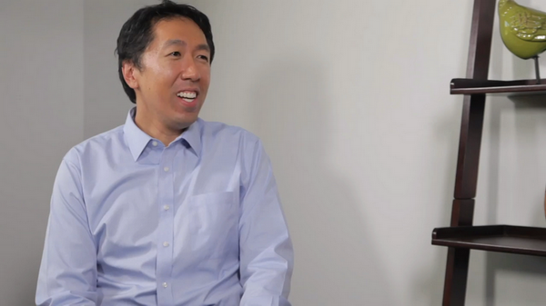

**Andrej：**是的，謝謝你的採訪邀請。

**吳恩達：**人們已經很熟悉你在深度學習領域中的工作了，但不是每個人都知道你的個人故事，不如你就告訴我們，你是怎麼一步步完成深度學習的這些工作的?

**Andrej：**是的，當然好，我第一次接觸深度學習時，還是一個在多倫多大學的大學生，那時Geoff Hinton就在那裡，他帶一門深度學習課，那時候用的是受限玻爾茲曼機，在MNIST手寫數字集上訓練，但我真的很喜歡Geoff談到訓練網路的方式，他會用網路的智慧，這些詞，我那時想，這聽起來，當我們訓練這些數字時會發生奇蹟，這是我第一次接觸，不過那時候我沒有了解很多細節，後來當我在不列顛哥倫比亞大學讀碩士時，我上了一門[
Nato Defreiter]教的課，還是機器學習，那時我第一次深入了解這些網路和相關知識，我覺得很有趣，當時我對人工智慧非常感興趣，所以我上了很多人工智慧課，但是我看到的很多東西沒那麼令人滿意，那時課程介紹了很多深度優先搜索，廣度優先搜索，Alpha-Beta剪枝各種方法，我那時不太懂，我並不滿意，當我第一次在機器學習課程中見到神經網路時，我覺得這個詞更技術一點，知名度沒那麼高，人工智慧大家都能說上一兩句，但機器學習就更小眾一點，可以這麼說吧，所以我對人工智慧不滿意，當我看到機器學習，我就想這才是我要花時間研究的AI
這才是真正有趣的東西，就是這些原因讓我開始走這條路，這幾乎是全新的計算範式，可以這麼說，因為正常情況下是人類在編程，但是在這種情況下是最佳化程序自己寫程式碼，所以當你建立了輸入輸出規範之後，你只需要給它餵一大堆例子，最佳化程序就自動編程，有時候它寫出的程序比人工的還好，所以我覺得這只是一種非常新穎的程式思路，這就是讓我感興趣的地方。

**吳恩達：**然後通過你的工作，其中一件讓你聲名遠揚的事是你是ImageNet分類競賽的人類基準，這是怎麼來的?

**Andrej：**所以基本上，他們的ImageNet比賽可以說成是計算機視覺領域的世界盃，不管人們是否注意這個基準和數字，我們的錯誤率也會隨時間下降，對我來說，人類在這個評分標準上的位置並不清楚，我之前在CIFAR-10數據集上做了類似的小規模實驗，我在CIFAR-10數據集中做的是，我觀察了這些32x32的圖像，我試圖自己對他們進行分類，那時候只有十大類，所以很容易構造一個界面去人工分類，那是我自己的錯誤率大概是6%，然後根據我實際見到的東西，一個具體任務有多難，我預測出最低能達到的錯誤率大概會是多少，好吧，我不記得具體數字是多少，我想大概是10%，現在算法做到了3%或2%，或者某個變態的數值，那是我第一次做人類基線實驗，非常有趣，我認為這是非常重要的，做這個基線的目的和你的影片裡介紹的一樣，我的意思是你真的希望這個數字能夠表示人類的水準，這樣我們就可以和機器學習算法比較，而對於ImageNet似乎存在一些分歧，這個基準到底有多重要，應該花多少精力去儘量得到較低的數字，我們甚至不了解人類自己在這個評分系統中的位置，所以我寫了這個JavaScript界面，我給自己看圖，然後ImageNet的問題在於，你不只有10個分類，你有1000個分類，這幾乎就像一個用戶界面挑戰，顯然我自己記不住1000多個分類，所以我應該怎麼設計這個界面，讓比賽公平一點，所以我把全部分類列表處理，然後給我自己看看各個分類的例子，所以對於每張圖像，我大概瀏覽了1000多個類別，只是想看看，根據我在每個類別里看到的例子判斷這個圖像可能是什麼，而且我認為這個練習本身就是非常有啟發性的，我的意思是，我不明白為什麼ImageNet有三分之一類別都是狗，狗的品種，所以我興致勃勃地看著那個網路花了大量時間去處理狗，我想它的三分之一性能用來處理狗。我這個小實驗做了一兩個星期，我把其他所有任務都擱置了，我那時想這練習非常有趣，我最後得到了一個數字，我覺得一個人是不夠的，我需要更多人參與到這個實驗中來，我試圖在實驗室內組織人員做同樣的事情，我想那時大家都不怎麼願意貢獻，花上一兩週時間來做這麼痛苦的工作，就是坐五個小時，嘗試分辨出這隻狗的品種是什麼，所以在這方面，我無法得到足夠多的數據，我們大概估計了一下人類的表現，我覺得很有趣，然後就傳開了，那時我還沒覺得很明顯，我只是想知道這個數字，但這很快變成了一個概念，大家都很喜歡這個事實，然後就這樣了，大家都開玩笑地說，我是那個作為基準的人，當然，我都笑死了，是啊。

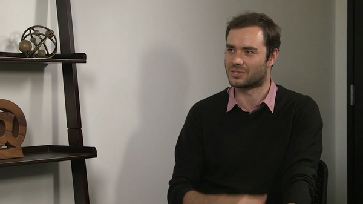

**吳恩達：**當DeepNet軟體超越了你的表現時，你有沒有很驚訝?

**Andrej：**絕對，是的，絕對的，我的意思是，有時一張圖真的很難看出是什麼，那圖就是小塊黑白色，還有一些黑點，到處都是，我沒看出來是什麼，我只能猜測這屬於20個類別之間，但網路就直接懂了，我不明白是怎麼一回事，所以這裡有點點超人類的意思了，但還有，我想網路非常擅長識別這些，地磚圖案和紋理的統計規律，我想在這方面，網路比人類表現優秀毫不奇怪，它可以從大量圖像中提取精細的統計特徵，而在許多情況下，我很驚訝，因為有些圖像需要識字，圖片有時就是一個瓶子，你看不出來是什麼，但它上面有文本，告訴你它是什麼，作為人類，我可以閱讀文字，這沒問題，但網路必須自己學習讀取訊息來識別物體，因為單看圖像並不明顯。

**吳恩達：**還有一件事讓你聲名遠揚，深度學習社區一直很感激你的貢獻，就是你教了CS231n課程，並把它放到網上，可以告訴我具體的經過嗎?

**Andrej：**是的，當然了，所以我有個強烈的感覺，這種技術是革命性的，很多人都希望能用上，這幾乎像一把錘子，我想做的是，我那時能夠隨意把這把錘子交給很多人，我覺得這種工作很有吸引力，從博士生的角度來看，不太建議做這種事，因為你會把你的研究擱置一邊，我的意思是說，這占用了我120%時間，我必須將所有研究放一邊，我是說，這門課我帶過兩次，每次都要4個月時間，所以時間基本上是花在課上，所以從這個角度來看不太建議，但這基本上是我的博士階段的亮點，這與研究甚至沒有關係，我認為教一門課絕對是我博士生的亮點，只要看到學生，看到他們真的很興奮，這門課和一般的不同，通常，課程裡講的內容是19世紀發現的，這些經典知識，但這樣一門課，我可以介紹一週前剛發表的論文，甚至昨天剛發表的，這些都是前沿研究，想大學生，還有其他學生，真的很喜歡這門課貼近前沿的特點，他們發現他們是可以理解到前沿的，這不是核物理或火箭科學，你只需要會微積分，代數，你實際上就能理解所有背後的原理，我想這個事實如此強大，事實上這個領域日新月異，學生們就會覺得每天都處於時代浪潮的前端，我想這就是大家那麼喜歡這門課的原因。

**吳恩達：**而且你真的幫助了很多人，送出去了很多錘子，是啊，作為一個研究深度學習，有些時日的研究員，這個領域還在迅速發展，我想知道，你自己的想法是怎樣的，這麼多年來你對深度學習的理解有何改變?

**Andrej：**是的，基本上當年我見到的是受限玻爾茲曼機處理這些手寫數字數據，那時我還不知道這種技術會被大規模應用，不知道這個領域有多重要，還有，當我開始研究計算機視覺，卷積網路時，這些概念都已經存在，但它們並不像是計算機視覺界很快就會使用的東西，那時人們的看法是，這些處理小案例不錯，但無法推廣到更大的圖像，這種認識錯到極端了。[笑]所以基本上，我很驚訝現在這個技術到處都在用，結果非常好，我說這是最大的驚喜，而且還不僅如此，它在一個地方表現很好，比如ImageNet，但另一方面，沒有人預計到它的趨勢，
至少我自己沒預計到，就是你可以把這些預先訓練好的網路遷移到其他領域，你可以在任意其他任務中精細調校網路，因為現在你不只解決了ImageNet問題，而且你需要數百萬個例子，網路變成了非常普適的特徵提取器，而且這是我的第二個想法，我覺得更少人預計到了這個發展，還有這些論文，它們就在這裡，人們在計算機視覺裡的一切努力，場景分類，動作識別，對象識別，基本屬性等等，人們只需要透過微調網路就把每個任務都解決了，所以對我來說是非常意外的。

**吳恩達：**是的，我想監督學習在媒體上很熱門，但是，然而預先訓練微調或遷移學習，其實都效果拔群，但這些領域媒體報導更少一些。

**Andrej：**對的，就是這樣，是的，我覺得其中一個進展不大的方向是無監督學習，被寄予了太多希望，我認為這才是真正吸引，在2007年左右吸引很多研究人員進入了這個領域的概念，但我覺得那個夢想還沒被實現，還有令我意外的一方面是，監督學習竟然效果這麼好，而無監督學習，它還是處於很原始的狀態，怎麼利用它，或者怎麼讓它達到實用，還不太明顯，即使很多人還是對它的未來深信不疑，我說在這個領域，可以用這個詞。

**吳恩達：**所以我知道你是其中一個，一直在思考AI遠期未來的研究員，你想分享你的想法嗎?

**Andrej：**所以我最後花了差不多一年半，在OpenAI這裡思考這些話題，在我看來，這個領域會分成兩條軌跡，一邊是應用AI 就是搭建這些神經網路，訓練它們，主要用監督學習，有可能用無監督學習，然後慢慢提升性能，比如說提高圖像識別率之類的；另一個方向是，更一般的人工智慧方向，就是如何讓神經網路變成一個完全動態的系統，可以思考，有語言能力，可以做人類能做的所有事情，並以這種方式獲得智慧，我認為一直到很有趣的地方是
例如在計算機視覺中，我們一開始研究的方向，我想是錯誤的，那時我們試圖把它分解成不同的部分，我們就像是，人可以識別人，可以識別場景，人可以識別物體，所以我們就開始研究人類能做的各種事情，一旦做出來了，就分成各種不同的子領域了，一旦我們有了這些獨立的系統，我們再開始把它們組裝起來，我覺得這種做法是錯誤的，我們已經見到歷史上這麼做結果如何，我想這裡還有其他類似的事情正在發展，很可能是更高水準的AI，所以人類會問問題，會做計劃，會做實驗來了解世界運作的規律，或者和其他人交談，我們就發明了語言，人們試圖透過功能來區分各種能力，然後複製每一種能力，把它們放到一起組成某種機械大腦，我覺得這個方法論是錯的，我更感興趣的領域，不是這種分解的，還原論的手段，而是希望構建一種全面動態的神經網路系統，這樣你一直處理的是完整的代理人程序。

那麼問題在於，你如何構思目標去最佳化權重，最佳化構成大腦的各種權重，才能得到真正的智慧行為?所以這是OpenAI裡我一直在想的很多東西，我認為有很多不同的方式，人們在這個問題上也有很多思考，，例如，在監督學習方向，我在網上發了這篇文章，這不是一篇文章，而是我寫的一個小故事，這個小故事嘗試構想出一個虛擬的世界，如果我們只透過擴大監督學習規模來逼近這個AGI，我們知道這是可行的，然後得到像這樣的東西，比如亞馬遜土耳其機器人，人們可以接觸不同機器人，讓它們完成各種任務，然後我們在這個基礎上訓練，把它看成是模仿人類的監督學習數據集，這樣的東西會具體是什麼樣的，所以這裡還有其他方向，比如基於算法訊息理論的無監督學習，如AIXI，或者構成人工生命，看起來更像人工進化的東西，所以這就是我花時間思考很多的事情，我已經得到正確答案了，但我不願意在這裡說。

**吳恩達：**至少我們可以透過閱讀你的博文來了解更多訊息。

**Andrej：**是的，當然了。

**吳恩達：**你今天已經提出了很多建議，還有很多人想進入AI和深度學習領域，對於這些人來說，你有什麼建議呢?

**Andrej：**是的，當然了，我想人們在討論CS231n的時候，為什麼他們認為這是一個非常有用的課程，我聽到最多的是，人們很喜歡我會一直講到最底層的技術細節，他們要調用的不是一個庫，而是可以看到底層代碼，看到一切是怎麼實現的，然後，他們自己去實現各大部分，所以你必須接觸到最底層，知道一切程序背後的原理，不要隨便抽象化，你必須充分了解全棧，了解整個流程，當我學習這些內容時，我發現這樣學，學到的東西最多，就是你自己從零開始去實現，這是很重要的，就是這部分學習性價比最高，從理解領域知識方面來看，所以我自己寫庫，這個庫叫ConvNetJS，它是用Javascript寫的，可以實現卷積神經網路，那是我學習後向傳播的方法，我一直建議別人不要一開始就用TensorFlow之類的東西，一旦你自己寫出了最底層的代碼之後，你可以用，因為你知道所有背後的原理，這樣你就很放心，現在就可以使用這樣的框架，可以幫你省去一點細節功夫，，但你自己必須知道背後的所有原理，所以這是幫助我最多的東西，這是人們在上CS231n課程時最感興趣的東西，所以我建議很多人這麼做。

**吳恩達：**不是直接跑神經網路，讓一切自然發生。

**Andrej：**是的，在某些層的序列中，我知道當我加入一些dropout層，可以讓它表現更好，但這不是你想要的在這種情況下， 你會無法有效除錯，你不能有效地改進模型。

**吳恩達：**是的，
這個答案讓我想起我們的deeplearning.ai課程，一開始先用幾週介紹Python編程，然後再..。

**Andrej：**是的 這樣很好。

**吳恩達：**非常感謝你來到這裡分享你的見解和建議，在深度學習世界中，你已經是很多人的偶像了，我真的很高興，非常感謝你今天可以接受採訪。

**Andrej：**是的 謝謝你邀請我。

