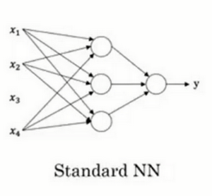
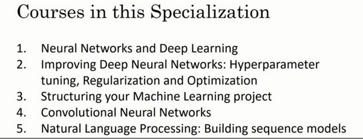

第一門課 神經網路和深度學習(Neural Networks and Deep Learning)
==============================================================
[TOC]
第一週：深度學習引言(Introduction to Deep Learning)
---------------------------------------------------

### 1.1 歡迎(Welcome)

第一個影片主要講了什麼是深度學習，深度學習能做些什麼事情。以下是吳恩達老師的原話：

深度學習改變了傳統網際網路業務，例如如網路搜尋和廣告。但是深度學習同時也使得許多新產品和企業以很多方式幫助人們，從獲得更好的健康關注。

深度學習做的非常好的一個方面就是讀取X光圖像，到生活中的個性化教育，到精準化農業，甚至到駕駛汽車以及其它一些方面。如果你想要學習深度學習的這些工具，並應用它們來做這些令人窒息的操作，本課程將幫助你做到這一點。當你完成**cousera**上面的這一系列專項課程，你將能更加自信的繼續深度學習之路。在接下來的十年中，我認為我們所有人都有機會創造一個驚人的世界和社會，這就是**AI**（人工智慧）的力量。我希望你們能在創建**AI**（人工智慧）社會的過程中發揮重要作用。

我認為AI是最新的電力，大約在一百年前，我們社會的電氣化改變了每個主要行業，從交通運輸行業到製造業、醫療保健、通訊等方面，我認為如今我們見到了**AI**明顯的令人驚訝的能量，帶來了同樣巨大的轉變。顯然，AI的各個分支中，發展的最為迅速的就是深度學習。因此現在，深度學習是在科技世界中廣受歡迎的一種技巧。

通過這個課程，以及這門課程後面的幾門課程，你將獲取並且掌握那些技能。

下面是你將學習到的內容：

在**cousera**的這一系列也叫做專項課程中,在第一門課中（**神經網路和深度學習**），你將學習神經網路的基礎，你將學習神經網路和深度學習，這門課將持續四周，專項課程中的每門課將持續2至4週。

但是在第一門課程中，你將學習如何建立神經網路（包含一個深度神經網路），以及如何在數據上面訓練他們。在這門課程的結尾，你將用一個深度神經網路進行辨認貓。

由於某種原因，第一門課會以貓作為對象識別。

接下來在第二門課中，我們將使用三週時間。你將進行深度學習方面的實踐，學習嚴密地構建神經網路，如何真正讓它表現良好，因此你將要學習超參數調整、正則化、診斷偏差和方差以及一些高級最佳化算法，比如**Momentum**和**Adam**算法，猶如黑魔法一樣根據你建立網路的方式。第二門課只有三週學習時間。

在第三門課中，我們將使用兩週時間來學習如何結構化你的機器學習工程。事實證明，構建機器學習系統的策略改變了深度學習的錯誤。

舉個例子：你分割數據的方式，分割成訓練集、比較集或改變的驗證集，以及測試集合，改變了深度學習的錯誤。

所以最好的實踐方式是什麼呢？

你的訓練集和測試集來自不同的貢獻度在深度學習中的影響很大，那麼你應該怎麼處理呢？

如果你聽說過端對端深度學習，你也會在第三門課中了解到更多，進而了解到你是否需要使用它，第三課的資料是相對比較獨特的，我將和你分享。我們了解到的所有的熱門領域的建立並且改良許多的深度學習問題。這些當今熱門的資料，絕大部分大學在他們的深度學習課堂上面裡面不會教的，我認為它會提供你幫助，讓深度學習系統工作的更好。

在第四門課程中，我們將會提到卷積神經網路(**CNN(s)**)，它經常被用於圖像領域，你將會在第四門課程中學到如何搭建這樣的模型。

最後在第五門課中，你將會學習到序列模型，以及如何將它們應用於自然語言處理，以及其它問題。

序列模型包括的模型有循環神經網路（**RNN**）、全稱是長短期記憶網路（**LSTM**）。你將在課程五中了解其中的時期是什麼含義，並且有能力應用到自然語言處理（**NLP**）問題。

總之你將在課程五中學習這些模型，以及能夠將它們應用於序列數據。比如說，自然語言就是一個單詞序列。你也將能夠理解這些模型如何應用到語音識別或者是編曲以及其它問題。

因此，通過這些課程，你將學習深度學習的這些工具，你將能夠去使用它們去做一些神奇的事情，並藉此來提升你的職業生涯。

吳恩達

****

### 1.2 什麼是神經網路？(What is a Neural Network)

我們常常用深度學習這個術語來指訓練神經網路的過程。有時它指的是特別大規模的神經網路訓練。那麼神經網路究竟是什麼呢？在這個影片中，我會講解一些直觀的基礎知識。

讓我們從一個房價預測的例子開始講起。

假設你有一個數據集，它包含了六棟房子的訊息。所以，你知道房屋的面積是多少平方英尺或者平方米，並且知道房屋價格。這時，你想要擬合一個根據房屋面積預測房價的函數。

如果你對線性回歸很熟悉，你可能會說：“好吧，讓我們用這些數據擬合一條直線。”於是你可能會得到這樣一條直線。

但有點奇怪的是，你可能也發現了，我們知道價格永遠不會是負數的。因此，為了替代一條可能會讓價格為負的直線，我們把直線彎曲一點，讓它最終在零結束。這條粗的藍線最終就是你的函數，用於根據房屋面積預測價格。有部分是零，而直線的部分擬合的很好。你也許認為這個函數隻擬合房屋價格。

作為一個神經網路，這幾乎可能是最簡單的神經網路。我們把房屋的面積作為神經網路的輸入（我們稱之為$x$），通過一個節點（一個小圓圈），最終輸出了價格（我們用$y$表示）。其實這個小圓圈就是一個單獨的神經元。接著你的網路實現了左邊這個函數的功能。

在有關神經網路的文獻中，你經常看得到這個函數。從趨近於零開始，然後變成一條直線。這個函數被稱作**ReLU**啟動函數，它的全稱是**Rectified Linear Unit**。rectify（修正）可以理解成$max(0,x)$，這也是你得到一個這種形狀的函數的原因。

你現在不用擔心不理解**ReLU**函數，你將會在這門課的後面再次看到它。

如果這是一個單神經元網路，不管規模大小，它正是透過把這些單個神經元疊加在一起來形成。如果你把這些神經元想像成單獨的樂高積木，你就透過搭積木來完成一個更大的神經網路。

讓我們來看一個例子，我們不僅僅用房屋的面積來預測它的價格，現在你有了一些有關房屋的其它特徵，比如臥室的數量，或許有一個很重要的因素，一家人的數量也會影響房屋價格，這個房屋能住下一家人或者是四五個人的家庭嗎？而這確實是基於房屋大小，以及真正決定一棟房子是否能適合你們家庭人數的臥室數。

換個話題，你可能知道郵政編碼或許能作為一個特徵，告訴你步行化程度。比如這附近是不是高度步行化，你是否能步行去雜貨店或者是學校，以及你是否需要駕駛汽車。有些人喜歡居住在以步行為主的區域，另外根據郵政編碼還和富裕程度相關（在美國是這樣的）。但在其它國家也可能體現出附近學校的水準有多好。

在圖上每一個畫的小圓圈都可以是**ReLU**的一部分，也就是指修正線性單元，或者其它稍微非線性的函數。基於房屋面積和臥室數量，可以估算家庭人口，基於郵遞區號，可以估測步行化程度或者學校的質量。最後你可能會這樣想，這些決定人們樂意花費多少錢。

對於一個房子來說，這些都是與它息息相關的事情。在這個情景裡，家庭人口、步行化程度以及學校的質量都能幫助你預測房屋的價格。以此為例，$x$ 是所有的這四個輸入，$y$ 是你嘗試預測的價格，把這些單個的神經元疊加在一起，我們就有了一個稍微大一點的神經網路。這顯示了神經網路的神奇之處，雖然我已經描述了一個神經網路，它可以需要你得到房屋面積、步行化程度和學校的質量，或者其它影響價格的因素。

神經網路的一部分神奇之處在於，當你實現它之後，你要做的只是輸入$x$，就能得到輸出$y$。因為它可以自己計算你訓練集中樣本的數目以及所有的中間過程。所以，你實際上要做的就是：這裡有四個輸入的神經網路，這輸入的特徵可能是房屋的大小、臥室的數量、郵政編碼和區域的富裕程度。給出這些輸入的特徵之後，神經網路的工作就是預測對應的價格。同時也注意到這些被叫做隱藏單元圓圈，在一個神經網路中，它們每個都從輸入的四個特徵獲得自身輸入，比如說，第一個結點代表家庭人口，而家庭人口僅僅取決於$x_1$和$x_2$特徵，換句話說，在神經網路中，你決定在這個結點中想要得到什麼，然後用所有的四個輸入來計算想要得到的。因此，我們說輸入層和中間層被緊密的連接起來了。

值得注意的是神經網路給予了足夠多的關於$x$和$y$的數據，給予了足夠的訓練樣本有關$x$和$y$。神經網路非常擅長計算從$x$到$y$的精準映射函數。

這就是一個基礎的神經網路。你可能發現你自己的神經網路在監督學習的環境下是如此的有效和強大，也就是說你只要嘗試輸入一個$x$，即可把它映射成$y$，就好像我們在剛才房價預測的例子中看到的效果。

在下一個影片中，讓我們複習一下更多監督學習的例子，有些例子會讓你覺得你的網路會十分有用，並且你實際應用起來也是如此。

### 1.3 神經網路的監督學習(Supervised Learning with Neural Networks)

關於神經網路也有很多的種類，考慮到它們的使用效果，有些使用起來恰到好處，但事實表明，到目前幾乎所有由神經網路創造的經濟價值，本質上都離不開一種叫做監督學習的機器學習類別，讓我們舉例看看。

在監督學習中你有一些輸入$x$，你想學習到一個函數來映射到一些輸出$y$，比如我們之前提到的房價預測的例子，你只要輸入有關房屋的一些特徵，試著去輸出或者估計價格$y$。我們舉一些其它的例子，來說明神經網路已經被高效應用到其它地方。

如今應用深度學習獲利最多的一個領域，就是在線廣告。這也許不是最鼓舞人心的，但真的很賺錢。具體就是通過在網站上輸入一個廣告的相關訊息，因為也輸入了用戶的訊息，於是網站就會考慮是否向你展示廣告。

神經網路已經非常擅長預測你是否會點開這個廣告，透過向用戶展示最有可能點開的廣告，這就是神經網路在很多家公司難以置信地提高獲利的一種應用。因為有了這種向你展示你最有可能點擊的廣告的能力，而這一點擊的行為的改變會直接影響到一些大型的在線廣告公司的收入。

計算機視覺在過去的幾年裡也取得了長足的進步，這也多虧了深度學習。你可以輸入一個圖像，然後想輸出一個索引，範圍從1到1000來試著告訴你這張照片，它可能是，比方說，1000個不同的圖像中的任何一個，所以你可能會選擇用它來給照片打標籤。

深度學習最近在語音識別方面的進步也是非常令人興奮的，你現在可以將音訊片段輸入神經網路，然後讓它輸出文本記錄。得益於深度學習，機器翻譯也有很大的發展。你可以利用神經網路輸入英語句子，接著輸出一個中文句子。

在自動駕駛技術中，你可以輸入一幅圖像，就好像一個訊息雷達展示汽車前方有什麼，據此，你可以訓練一個神經網路，來告訴汽車在馬路上面具體的位置，這就是神經網路在自動駕駛系統中的一個關鍵成分。

那麼深度學習系統已經可以創造如此多的價值，通過智慧的選擇，哪些作為$x$哪些作為$y$，來針對於你當前的問題，然後擬合監督學習部分，往往是一個更大的系統，比如自動駕駛。這表明神經網路類型的輕微不同，也可以產生不同的應用，比如說，應用到我們在上一個影片提到的房地產領域，我們不就使用了一個普遍標準神經網路架構嗎？

也許對於房地產和在線廣告來說可能是相對的標準一些的神經網路，正如我們之前見到的。對於圖像應用，我們經常在神經網路上使用卷積（**Convolutional Neural Network**），通常縮寫為**CNN**。對於序列數據，例如音訊，有一個時間組件，隨著時間的推移，音訊被播放出來，所以音訊是最自然的表現。作為一維時間序列（兩種英文說法**one-dimensional time series / temporal sequence**）.對於序列數據，經常使用**RNN**，一種遞迴神經網路（**Recurrent Neural Network**），語言，英語和漢語字母表或單詞都是逐個出現的，所以語言也是最自然的序列數據，因此更複雜的**RNNs**版本經常用於這些應用。

對於更複雜的應用比如自動駕駛，你有一張圖片，可能會顯示更多的**CNN**卷積神經網路結構，其中的雷達訊息是完全不同的，你可能會有一個更訂製的，或者一些更複雜的混合的神經網路結構。所以為了更具體地說明什麼是標準的**CNN**和**RNN**結構，在文獻中你可能見過這樣的圖片，這是一個標準的神經網路。

你也可能見過這樣的圖片，這是一個卷積神經網路的例子。

我們會在後面的課程了解這幅圖的原理和實現，卷積網路(**CNN**)通常用於圖像數據。

你可能也會看到這樣的圖片，而且你將在以後的課程中學習如何實現它。

遞迴神經網路(**RNN**)非常適合這種一維序列，數據可能是一個時間組成部分。

你可能也聽說過機器學習對於結構化數據和非結構化數據的應用，結構化數據意味著數據的基本資料庫。例如在房價預測中，你可能有一個資料庫，有專門的幾列數據告訴你臥室的大小和數量，這就是結構化數據。或預測用戶是否會點擊廣告，你可能會得到關於用戶的訊息，比如年齡以及關於廣告的一些訊息，然後對你的預測分類標註，這就是結構化數據，意思是每個特徵，比如說房屋大小臥室數量，或者是一個用戶的年齡，都有一個很好的定義。

相反非結構化數據是指比如音訊，原始音訊或者你想要識別的圖像或文本中的內容。這裡的特徵可能是圖像中的像素值或文本中的單個單詞。

從歷史經驗上看，處理非結構化數據是很難的，與結構化數據比較，讓計算機理解非結構化數據很難，而人類進化得非常善於理解音訊信號和圖像，文本是一個更近代的發明，但是人們真的很擅長解讀非結構化數據。

神經網路的興起就是這樣最令人興奮的事情之一，多虧了深度學習和神經網路，計算機現在能更好地解釋非結構化數據，這是與幾年前相比的結果，這為我們創造了機會。許多新的令人興奮的應用被使用，語音識別、圖像識別、自然語言文字處理，甚至可能比兩三年前的還要多。因為人們天生就有本領去理解非結構化數據，你可能聽說了神經網路更多在媒體非結構化數據的成功，當神經網路識別了一隻貓時那真的很酷，我們都知道那意味著什麼。

但結果也表明，神經網路在許多短期經濟價值的創造，也是基於結構化數據的。比如更好的廣告系統、更好的利潤建議，還有更好的處理大數據的能力。許多公司不得不根據神經網路做出準確的預測。

因此在這門課中，我們將要討論的許多技術都將適用，不論是對結構化數據還是非結構化數據。為了解釋算法，我們將在使用非結構化數據的範例中多畫一點圖片，但正如你所想的，你自己團隊裡透過運用神經網路，我希望你能發現，神經網路算法對於結構化和非結構化數據都有用處。

神經網路已經改變了監督學習，正創造著巨大的經濟價值，事實證明，基本的神經網路背後的技術理念大部分都離我們不遙遠，有的是幾十年，那麼為什麼他們現在才剛剛起步，效果那麼好，下一集影片中我們將討論為什麼最近的神經網路已經成為你可以使用的強大工具。

### 1.4 為什麼深度學習會興起？(Why is Deep Learning taking off?)

本節影片主要講了推動深度學習變得如此熱門的主要因素。包括數據規模、計算量及算法的創新。

深度學習和神經網路之前的基礎技術理念已經存在大概幾十年了，為什麼它們現在才突然流行起來呢？本節課程主要講述一些使得深度學習變得如此熱門的主要驅動因素，這將會幫助你在你的組織機構內發現最好的時機來應用這些東西。

在過去的幾年裡，很多人都問我為什麼深度學習能夠如此有效。當我回答這個問題時，我通常給他們畫個圖，在水平軸上畫一個形狀，在此繪製出所有任務的數據量，而在垂直軸上，畫出機器學習算法的性能。比如說準確率體現在垃圾郵件過濾或者廣告點擊預測，或者是神經網路在自動駕駛汽車時判斷位置的準確性，根據圖像可以發現，如果你把一個傳統機器學習算法的性能畫出來，作為數據量的一個函數，你可能得到一個彎曲的線，就像圖中這樣，它的性能一開始在增加更多數據時會上升，但是一段變化後它的性能就會像一個高原一樣。假設你的水準軸拉的很長很長，它們不知道如何處理規模巨大的數據，而過去十年的社會裡，我們遇到的很多問題只有相對較少的數據量。

多虧數位化社會的來臨，現在的數據量都非常巨大，我們花了很多時間活動在這些數字的領域，比如在電腦網站上、在手機軟體上以及其它數位化的服務，它們都能創建數據，同時便宜的相機被配置到手機，還有加速儀及各類各樣的感測器，同時在物聯網領域我們也收集到了越來越多的數據。僅僅在過去的20年裡對於很多應用，我們便收集到了大量的數據，遠超過機器學習算法能夠高效發揮它們優勢的規模。

神經網路展現出的是，如果你訓練一個小型的神經網路，那麼這個性能可能會像下圖黃色曲線表示那樣；如果你訓練一個稍微大一點的神經網路，比如說一個中等規模的神經網路（下圖藍色曲線），它在某些數據上面的性能也會更好一些；如果你訓練一個非常大的神經網路，它就會變成下圖綠色曲線那樣，並且保持變得越來越好。因此可以注意到兩點：如果你想要獲得較高的性能體現，那麼你有兩個條件要完成，第一個是你需要訓練一個規模足夠大的神經網路，以發揮數據規模量巨大的優點，另外你需要能畫到$x$軸的這個位置，所以你需要很多的數據。因此我們經常說規模一直在推動深度學習的進步，這裡的規模指的也同時是神經網路的規模，我們需要一個帶有許多隱藏單元的神經網路，也有許多的參數及關聯性，就如同需要大規模的數據一樣。事實上如今最可靠的方法來在神經網路上獲得更好的性能，往往就是**要嘛訓練一個更大的神經網路，要嘛投入更多的數據**，這只能在一定程度上起作用，因為最終你耗盡了數據，或者最終你的網路是如此大規模導致將要用太久的時間去訓練，但是僅僅提升規模的的確確地讓我們在深度學習的世界中摸索了很多時間。為了使這個圖更加從技術上講更精確一點，我在$x$軸下面已經寫明的數據量，這裡加上一個標籤（label）量，通過添加這個標籤量，也就是指在訓練樣本時，我們同時輸入$x$和標籤$y$，接下來引入一點符號，使用小寫的字母$m$表示訓練集的規模，或者說訓練樣本的數量，這個小寫字母$m$就橫軸結合其他一些細節到這個圖像中。

在這個小的訓練集中，各種算法的優先度事實上定義的也不是很明確，所以如果你沒有大量的訓練集，那效果會取決於你的特徵工程能力，那將決定最終的性能。假設有些人訓練出了一個**SVM**（支持向量機）表現的更接近正確特徵，然而有些人訓練的規模大一些，可能在這個小的訓練集中**SVM**算法可以做的更好。因此你知道在這個圖形區域的左邊，各種算法之間的優先度並不是定義的很明確，最終的性能更多的是取決於你在用工程選擇特徵方面的能力以及算法處理方面的一些細節，只是在某些大數據規模非常龐大的訓練集，也就是在右邊這個$m$會非常的大時，我們能更加持續地看到更大的由神經網路控制的其它方法，因此如果你的任何某個朋友問你為什麼神經網路這麼流行，我會鼓勵你也替他們畫這樣一個圖形。

所以可以這麼說，在深度學習萌芽的初期，數據的規模以及計算量，局限在我們對於訓練一個特別大的神經網路的能力，無論是在CPU還是GPU上面，那都使得我們取得了巨大的進步。但是漸漸地，尤其是在最近這幾年，我們也見證了算法方面的極大創新。許多算法方面的創新，一直是在嘗試著使得神經網路運行的更快。

作為一個具體的例子，神經網路方面的一個巨大突破是從**sigmoid**函數轉換到一個**ReLU**函數，這個函數我們在之前的課程裡提到過。

如果你無法理解剛才我說的某個細節，也不需要擔心，可以知道的一個使用**sigmoid**函數和機器學習問題是，在這個區域，也就是這個**sigmoid**函數的梯度會接近零，所以學習的速度會變得非常緩慢，因為當你實現梯度下降以及梯度接近零的時候，參數會更新的很慢，所以學習的速率也會變的很慢，而通過改變這個被叫做啟動函數的東西，神經網路換用這一個函數，叫做**ReLU**的函數（修正線性單元），**ReLU**它的梯度對於所有輸入的負值都是零，因此梯度更加不會趨向逐漸減少到零。而這裡的梯度，這條線的斜率在這左邊是零，僅僅透過將**Sigmod**函數轉換成**ReLU**函數，便能夠使得一個叫做梯度下降（**gradient descent**）的算法運行的更快，這就是一個或許相對比較簡單的算法創新的例子。但是根本上算法創新所帶來的影響，實際上是對計算帶來的最佳化，所以有很多像這樣的例子，我們通過改變算法，使得代碼運行的更快，這也使得我們能夠訓練規模更大的神經網路，或者是多埠的網路。即使我們從所有的數據中擁有了大規模的神經網路，快速計算顯得更加重要的另一個原因是，訓練你的神經網路的過程，很多時候是憑藉直覺的，往往你對神經網路架構有了一個想法，於是你嘗試寫程式碼實現你的想法，然後讓你運行一個試驗環境來告訴你，你的神經網路效果有多好，通過參考這個結果再返回去修改你的神經網路裡面的一些細節，然後你不斷的重複上面的操作，當你的神經網路需要很長時間去訓練，需要很長時間重複這一循環，在這裡就有很大的區別，根據你的生產效率去構建更高效的神經網路。當你能夠有一個想法，試一試，看效果如何。在10分鐘內，或者也許要花上一整天，如果你訓練你的神經網路用了一個月的時間，有時候發生這樣的事情，也是值得的，因為你很快得到了一個結果。在10分鐘內或者一天內，你應該嘗試更多的想法，那極有可能使得你的神經網路在你的應用方面工作的更好、更快的計算，在提高速度方面真的有幫助，那樣你就能更快地得到你的實驗結果。這也同時幫助了神經網路的實驗人員和有關項目的研究人員在深度學習的工作中疊代的更快，也能夠更快的改進你的想法，所有這些都使得整個深度學習的研究社群變的如此繁榮，包括令人難以置信地發明新的算法和取得不間斷的進步，這些都是開拓者在做的事情，這些力量使得深度學習不斷壯大。

好消息是這些力量目前也正常不斷的奏效，使得深度學習越來越好。研究表明我們的社會仍然正在拋出越來越多的數位化數據，或者用一些特殊的硬體來進行計算，比如說**GPU**，以及更快的網路連接各種硬體。我非常有信心，我們可以做一個超級大規模的神經網路，而計算的能力也會進一步的得到改善，還有算法相對的學習研究社區連續不斷的在算法前沿產生非凡的創新。根據這些我們可以樂觀地回答，同時對深度學習保持樂觀態度，在接下來的這些年它都會變的越來越好。

### 1.5 關於這門課(About this Course)

你的學習進度已經快接近這個專項課程的第一門課的第一週結尾了，首先，快速地介紹一下下週的學習內容：

在第一個影片已經提到，這個專項有五門課程，目前正處於第一門課：神經網路與深度學習。在這門課中將教會你最重要的基礎知識。當學習到第一門課末尾，你將學到如何建立一個深度神經網路並且使之奏效。

下面是關於第一門課的一些細節，這門課有四周的學習資料：

第一週：關於深度學習的介紹。在每一週的結尾也會有十個多選題用來檢驗自己對材料的理解；

第二週：關於神經網路的程式知識，了解神經網路的結構，逐步完善算法並思考如何使得神經網路高效地實現。從第二週開始做一些編程訓練（付費項目），自己實現算法；

第三週：在學習了神經網路編程的框架之後，你將可以編寫一個隱藏層神經網路，所以需要學習所有必須的關鍵概念來實現神經網路的工作；

第四周：建立一個深層的神經網路。

這段影片即將結束，希望在這段影片之後，你們可以看看課程網站的十道選擇題來檢查自己的理解，不必複習前面的知識，有的知識是你現在不知道的，可以不斷嘗試，直到全部做對以理解全部概念。

### 1.6 課程資源(Course Resources)

我希望你們喜歡這門課程，為了幫助你們完成課程，本次課程將列舉一些課程資源。

首先，如果你有任何疑問，或是想和其他同學討論問題，或是想和包括我在內的教學人員討論任何問題，或是想要歸檔一個錯誤，論壇是最好的去處，我和其他教學人員將定期關注論壇的內容。論壇也是一個你從同學那裡得到問題答案的好地方，如果想要回答同學的問題，可以從課程首頁來到論壇：

**點擊論壇標籤可以進入論壇**

在論壇上是提問的最佳途徑，但是出於一些原因，可能要直接聯絡我們，可以將郵件發送到這個地址，我們會盡力閱讀每一份郵件並嘗試解決普遍出現的問。由於郵件數量龐大，不一定能迅速回復每一封郵件。另外，一些公司會嘗試給員工做深度學習培訓，如果你們想對員工負責，聘請專家培訓上百甚至更多員工深度學習，請用企業信箱與我們聯繫。我們處在大學學術開發的初始階段，如果你是大學領導或者是管理人員，並且希望在你們學校開設一門深度學習課程，請通過大學信箱聯絡我們。信箱地址如下，祝你們好運！

Contact us: <feedback@deeplearning.ai>

Companies: <enterprise@deeplearning.ai>

Universities: <academic@deeplearning.ai>

