第二週：神經網路的程式基礎(Basics of Neural Network programming)
--------------------------------------------------------------------
[TOC]
### 2.1 二分類(Binary Classification)

這週我們將學習神經網路的基礎知識，其中需要注意的是，當實現一個神經網路的時候，我們需要知道一些非常重要的技術和技巧。例如有一個包含$m$個樣本的訓練集，你很可能習慣於用一個**for**循環來遍歷訓練集中的每個樣本，但是當實現一個神經網路的時候，我們通常不直接使用**for**循環來遍歷整個訓練集，所以在這週的課程中你將學會如何處理訓練集。

另外在神經網路的計算中，通常先有一個叫做前向暫停(**forward pause**)或叫做前向傳播(**foward propagation**)的步驟，接著有一個叫做反向暫停(**backward pause**) 或叫做反向傳播**(backward propagation**)的步驟。所以這週我也會向你介紹為什麼神經網路的訓練過程可以分為前向傳播和反向傳播兩個獨立的部分。

在課程中我將使用邏輯回歸(l**ogistic regression**)來傳達這些想法，以使大家能夠更加容易地理解這些概念。即使你之前了解過邏輯回歸，我認為這裡還是有些新的、有趣的東西等著你去發現和了解，所以現在開始進入正題。

邏輯回歸是一個用於二分類(**binary classification**)的算法。首先我們從一個問題開始說起，這裡有一個二分類問題的例子，假如你有一張圖片作為輸入，比如這隻貓，如果識別這張圖片為貓，則輸出標籤1作為結果；如果識別出不是貓，那麼輸出標籤0作為結果。現在我們可以用字母 $y$來 表示輸出的結果標籤，如下圖所示：


我們來看看一張圖片在計算機中是如何表示的，為了保存一張圖片，需要保存三個矩陣，它們分別對應圖片中的紅、綠、藍三種顏色通道，如果你的圖片大小為64x64像素，那麼你就有三個規模為64x64的矩陣，分別對應圖片中紅、綠、藍三種像素的強度值。為了便於表示，這裡我畫了三個很小的矩陣，注意它們的規模為5x4 而不是64x64，如下圖所示：


為了把這些像素值放到一個特徵向量中，我們需要把這些像素值提取出來，然後放入一個特徵向量$x$。為了把這些像素值轉換為特徵向量 $x$，我們需要像下面這樣定義一個特徵向量 $x$ 來表示這張圖片，我們把所有的像素都取出來，例如255、231等等，直到取完所有的紅色像素，接著最後是255、134、…、255、134等等，直到得到一個特徵向量，把圖片中所有的紅、綠、藍像素值都列出來。如果圖片的大小為64x64像素，那麼向量 $x$ 的總維度，將是64乘以64乘以3，這是三個像素矩陣中像素的總量。在這個例子中結果為12,288。現在我們用$n_x=12,288$，來表示輸入特徵向量的維度，有時候為了簡潔，我會直接用小寫的$n$來表示輸入特徵向量$x$的維度。所以在二分類問題中，我們的目標就是習得一個分類器，它以圖片的特徵向量作為輸入，然後預測輸出結果$y$為1還是0，也就是預測圖片中是否有貓：


接下來我們說明一些在餘下課程中，需要用到的一些符號。

**符號定義** ：

$x$：表示一個$n_x$維數據，為輸入數據，維度為$(n_x,1)$； 

$y​$：表示輸出結果，取值為$(0,1)​$；

$(x^{(i)},y^{(i)})$：表示第$i$組數據，可能是訓練數據，也可能是測試數據，此處預設為訓練數據； 

$X=[x^{(1)},x^{(2)},...,x^{(m)}]$：表示所有的訓練數據集的輸入值，放在一個 $n_x×m$的矩陣中，其中$m$表示樣本數目; 

$Y=[y^{(1)},y^{(2)},...,y^{(m)}]$：對應表示所有訓練數據集的輸出值，維度為$1×m$。

用一對$(x,y)$來表示一個單獨的樣本，$x$代表$n_x$維的特徵向量，$y$ 表示標籤(輸出結果)只能為0或1。
而訓練集將由$m$個訓練樣本組成，其中$(x^{(1)},y^{(1)})$表示第一個樣本的輸入和輸出，$(x^{(2)},y^{(2)})$表示第二個樣本的輸入和輸出，直到最後一個樣本$(x^{(m)},y^{(m)})$，然後所有的這些一起表示整個訓練集。有時候為了強調這是訓練樣本的個數，會寫作$M_{train}$，當涉及到測試集的時候，我們會使用$M_{test}$來表示測試集的樣本數，所以這是測試集的樣本數：

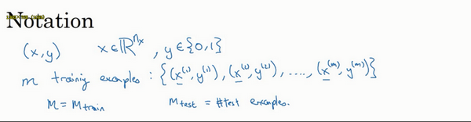

最後為了能把訓練集表示得更緊湊一點，我們會定義一個矩陣用大寫$X$的表示，它由輸入向量$x^{(1)}$、$x^{(2)}$等組成，如下圖放在矩陣的列中，所以現在我們把$x^{(1)}$作為第一列放在矩陣中，$x^{(2)}$作為第二列，$x^{(m)}$放到第$m$列，然後我們就得到了訓練集矩陣$X$。所以這個矩陣有$m$列，$m$是訓練集的樣本數量，然後這個矩陣的高度記為$n_x$，注意有時候可能因為其他某些原因，矩陣$X$會由訓練樣本按照行堆疊起來而不是列，如下圖所示：$x^{(1)}$的轉置直到$x^{(m)}$的轉置，但是在實現神經網路的時候，使用左邊的這種形式，會讓整個實現的過程變得更加簡單：


現在來簡單溫習一下:$X$是一個規模為$n_x$乘以$m$的矩陣，當你用**Python**實現的時候，你會看到`X.shape`，這是一條**Python**命令，用於顯示矩陣的規模，即`X.shape`等於$(n_x,m)$，$X$是一個規模為$n_x$乘以$m$的矩陣。所以綜上所述，這就是如何將訓練樣本（輸入向量$X$的集合）表示為一個矩陣。

那麼輸出標籤$y$呢？同樣的道理，為了能更加容易地實現一個神經網路，將標籤$y$放在列中將會使得後續計算非常方便，所以我們定義大寫的$Y$等於${{y}^{\left( 1 \right)}},{{y}^{\left( m \right)}},...,{{y}^{\left( m \right)}}$，所以在這裡是一個規模為1乘以$m$的矩陣，同樣地使用**Python**將表示為`Y.shape`等於$(1,m)$，表示這是一個規模為1乘以$m$的矩陣。


當你在後面的課程中實現神經網路的時候，你會發現，一個好的符號約定能夠將不同訓練樣本的數據很好地組織起來。而我所說的數據不僅包括 $x$ 或者 $y$ 還包括之後你會看到的其他的量。將不同的訓練樣本的數據提取出來，然後就像剛剛我們對 $x$ 或者 $y$ 所做的那樣，將他們堆疊在矩陣的列中，形成我們之後會在邏輯回歸和神經網路上要用到的符號表示。如果有時候你忘了這些符號的意思，比如什麼是 $m$，或者什麼是 $n$，或者忘了其他一些東西，我們也會在課程的網站上放上符號說明，然後你可以快速地查閱每個具體的符號代表什麼意思，好了，我們接著到下一個影片，在下個影片中，我們將以邏輯回歸作為開始。
備註：附錄裡也寫了符號說明。


### 2.2 邏輯回歸(Logistic Regression)

在這個影片中，我們會重溫邏輯回歸學習算法，該算法適用於二分類問題，本節將主要介紹邏輯回歸的**Hypothesis Function**（假設函數）。

對於二元分類問題來講，給定一個輸入特徵向量$X$，它可能對應一張圖片，你想識別這張圖片識別看它是否是一隻貓或者不是一隻貓的圖片，你想要一個算法能夠輸出預測，你只能稱之為$\hat{y}$，也就是你對實際值 $y$ 的估計。更正式地來說，你想讓 $\hat{y}$ 表示 $y$ 等於1的一種可能性或者是機會，前提條件是給定了輸入特徵$X$。換句話來說，如果$X$是我們在上個影片看到的圖片，你想讓 $\hat{y}$ 來告訴你這是一隻貓的圖片的機率有多大。在之前的影片中所說的，$X$是一個$n_x$維的向量（相當於有$n_x$個特徵的特徵向量）。我們用$w$來表示邏輯回歸的參數，這也是一個$n_x$維向量（因為$w$實際上是特徵權重，維度與特徵向量相同），參數裡面還有$b$，這是一個實數（表示偏差）。所以給出輸入$x$以及參數$w$和$b$之後，我們怎樣產生輸出預測值$\hat{y}$，一件你可以嘗試卻不可行的事是讓$\hat{y}={{w}^{T}}x+b$。


這時候我們得到的是一個關於輸入$x$的線性函數，實際上這是你在做線性回歸時所用到的，但是這對於二元分類問題來講不是一個非常好的算法，因為你想讓$\hat{y}$表示實際值$y$等於1的機率的話，$\hat{y}$ 應該在0到1之間。這是一個需要解決的問題，因為${{w}^{T}}x+b$可能比1要大得多，或者甚至為一個負值。對於你想要的在0和1之間的機率來說它是沒有意義的，因此在邏輯回歸中，我們的輸出應該是$\hat{y}$等於由上面得到的線性函數式子作為自變數的**sigmoid**函數中，公式如上圖最下面所示，將線性函數轉換為非線性函數。

下圖是**sigmoid**函數的圖像，如果我把水平軸作為$z$軸，那麼關於$z$的**sigmoid**函數是這樣的，它是平滑地從0走向1，讓我在這裡標記縱軸，這是0，曲線與縱軸相交的截距是0.5，這就是關於$z$的**sigmoid**函數的圖像。我們通常都使用$z$來表示${{w}^{T}}x+b$的值。

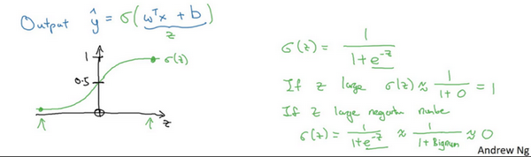

關於**sigmoid**函數的公式是這樣的，$\sigma \left( z \right)=\frac{1}{1+{{e}^{-z}}}$,在這裡$z$是一個實數，這裡要說明一些要注意的事情，如果$z$非常大那麼${{e}^{-z}}$將會接近於0，關於$z$的**sigmoid**函數將會近似等於1除以1加上某個非常接近於0的項，因為$e$ 的指數如果是個絕對值很大的負數的話，這項將會接近於0，所以如果$z$很大的話那麼關於$z$的**sigmoid**函數會非常接近1。相反地，如果$z$非常小或者說是一個絕對值很大的負數，那麼關於${{e}^{-z}}$這項會變成一個很大的數，你可以認為這是1除以1加上一個非常非常大的數，所以這個就接近於0。實際上你看到當$z$變成一個絕對值很大的負數，關於$z$的**sigmoid**函數就會非常接近於0，因此當你實現邏輯回歸時，你的工作就是去讓機器學習參數$w$以及$b$這樣才使得$\hat{y}$成為對$y=1$這一情況的機率的一個很好的估計。


在繼續進行下一步之前，介紹一種符號慣例，可以讓參數$w$和參數$b$分開。在符號上要注意的一點是當我們對神經網路進行編程時經常會讓參數$w$和參數$b$分開，在這裡參數$b$對應的是一種偏置。在之前的機器學習課程裡，你可能已經見過處理這個問題時的其他符號表示。比如在某些例子裡，你定義一個額外的特徵稱之為${{x}_{0}}$，並且使它等於1，那麼現在$X$就是一個$n_x$加1維的變數，然後你定義$\hat{y}=\sigma \left( {{\theta }^{T}}x \right)$的**sigmoid**函數。在這個備選的符號慣例裡，你有一個參數向量${{\theta }_{0}},{{\theta }_{1}},{{\theta }_{2}},...,{{\theta }_{{{n}_{x}}}}$，這樣${{\theta }_{0}}$就充當了$b$，這是一個實數，而剩下的${{\theta }_{1}}$ 直到${{\theta }_{{{n}_{x}}}}$充當了$w$，結果就是當你實現你的神經網路時，有一個比較簡單的方法是保持$b$和$w$分開。但是在這節課裡我們不會使用任何這類符號慣例，所以不用去擔心。
現在你已經知道邏輯回歸模型是什麼樣子了，下一步要做的是訓練參數$w$和參數$b$，你需要定義一個代價函數，讓我們在下節課裡對其進行解釋。

### 2.3 邏輯回歸的代價函數（Logistic Regression Cost Function）

在上個影片中，我們講了邏輯回歸模型，這個影片裡，我們講邏輯回歸的代價函數（也翻譯作成本函數）。

**為什麼需要代價函數：**

為了訓練邏輯回歸模型的參數參數$w$和參數$b$我們，需要一個代價函數，透過訓練代價函數來得到參數$w$和參數$b$。先看一下邏輯回歸的輸出函數：


為了讓模型通過學習調整參數，你需要給予一個$m$樣本的訓練集，這會讓你在訓練集上找到參數$w$和參數$b$,，來得到你的輸出。

對訓練集的預測值，我們將它寫成$\hat{y}$，我們更希望它會接近於訓練集中的$y$值，為了對上面的公式更詳細的介紹，我們需要說明上面的定義是對一個訓練樣本來說的，這種形式也使用於每個訓練樣本，我們使用這些帶有圓括號的上標來區分索引和樣本，訓練樣本$i$所對應的預測值是${{y}^{(i)}}$,是用訓練樣本的${{w}^{T}}{{x}^{(i)}}+b$然後透過**sigmoid**函數來得到，也可以把$z$定義為${{z}^{(i)}}={{w}^{T}}{{x}^{(i)}}+b$,我們將使用這個符號$(i)$註解，上標$(i)$來指明數據表示$x$或者$y$或者$z$或者其他數據的第$i$個訓練樣本，這就是上標$(i)$的含義。

**損失函數：**

損失函數又叫做誤差函數，用來衡量算法的運行情況，**Loss function:$L\left( \hat{y},y \right)$.**

我們通過這個$L$稱為的損失函數，來衡量預測輸出值和實際值有多接近。一般我們用預測值和實際值的平方差或者它們平方差的一半，但是通常在邏輯回歸中我們不這麼做，因為當我們在學習邏輯回歸參數的時候，會發現我們的最佳化目標不是凸最佳化，只能找到多個局部最優值，梯度下降法很可能找不到全局最優值，雖然平方差是一個不錯的損失函數，但是我們在邏輯回歸模型中會定義另外一個損失函數。

我們在邏輯回歸中用到的損失函數是：$L\left( \hat{y},y \right)=-y\log(\hat{y})-(1-y)\log (1-\hat{y})$

為什麼要用這個函數作為邏輯損失函數？當我們使用平方誤差作為損失函數的時候，你會想要讓這個誤差儘可能地小，對於這個邏輯回歸損失函數，我們也想讓它儘可能地小，為了更好地理解這個損失函數怎麼起作用，我們舉兩個例子：

當$y=1$時損失函數$L=-\log (\hat{y})$，如果想要損失函數$L$儘可能得小，那麼$\hat{y}$就要儘可能大，因為**sigmoid**函數取值$[0,1]$，所以$\hat{y}$會無限接近於1。

當$y=0$時損失函數$L=-\log (1-\hat{y})$，如果想要損失函數$L$儘可能得小，那麼$\hat{y}$就要儘可能小，因為**sigmoid**函數取值$[0,1]$，所以$\hat{y}$會無限接近於0。

**在這門課中有很多的函數效果和現在這個類似，就是如果$y$等於1，我們就儘可能讓$\hat{y}$變大，如果$y$等於0，我們就儘可能讓 $\hat{y}$ 變小。**
損失函數是在單個訓練樣本中定義的，它衡量的是算法在單個訓練樣本中表現如何，為了衡量算法在全部訓練樣本上的表現如何，我們需要定義一個算法的代價函數，算法的代價函數是對$m$個樣本的損失函數求和然後除以$m$:
$J\left( w,b \right)=\frac{1}{m}\sum\limits_{i=1}^{m}{L\left( {{{\hat{y}}}^{(i)}},{{y}^{(i)}} \right)}=\frac{1}{m}\sum\limits_{i=1}^{m}{\left( -{{y}^{(i)}}\log {{{\hat{y}}}^{(i)}}-(1-{{y}^{(i)}})\log (1-{{{\hat{y}}}^{(i)}}) \right)}$
損失函數隻適用於像這樣的單個訓練樣本，而代價函數是參數的總代價，所以在訓練邏輯回歸模型時候，我們需要找到合適的$w$和$b$，來讓代價函數 $J$ 的總代價降到最低。
根據我們對邏輯回歸算法的推導及對單個樣本的損失函數的推導和針對算法所選用參數的總代價函數的推導，結果表明邏輯回歸可以看做是一個非常小的神經網路，在下一個影片中，我們會看到神經網路會做什麼。


### 2.4 梯度下降法（Gradient Descent）

**梯度下降法可以做什麼？**

在你測試集上，通過最小化代價函數（成本函數）$J(w,b)$來訓練的參數$w$和$b$， 

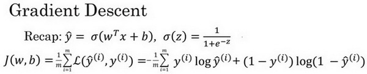

如圖，在第二行給出和之前一樣的邏輯回歸算法的代價函數（成本函數）

**梯度下降法的形象化說明**


在這個圖中，橫軸表示你的空間參數$w$和$b$，在實踐中，$w$可以是更高的維度，但是為了更好地繪圖，我們定義$w$和$b$，都是單一實數，代價函數（成本函數）$J(w,b)$是在水平軸$w$和$b$上的曲面，因此曲面的高度就是$J(w,b)$在某一點的函數值。我們所做的就是找到使得代價函數（成本函數）$J(w,b)$函數值是最小值，對應的參數$w$和$b$。


如圖，代價函數（成本函數）$J(w,b)$是一個凸函數(**convex function**)，像一個大碗一樣。


如圖，這就與剛才的圖有些相反，因為它是非凸的並且有很多不同的局部最小值。由於邏輯回歸的代價函數（成本函數）$J(w,b)$特性，我們必須定義代價函數（成本函數）$J(w,b)$為凸函數。
**初始化$w$和$b$，**


可以用如圖那個小紅點來初始化參數$w$和$b$，也可以採用隨機初始化的方法，對於邏輯回歸幾乎所有的初始化方法都有效，因為函數是凸函數，無論在哪裡初始化，應該達到同一點或大致相同的點。


我們以如圖的小紅點的坐標來初始化參數$w$和$b$。

**2. 朝最陡的下坡方向走一步，不斷地疊代**


我們朝最陡的下坡方向走一步，如圖，走到了如圖中第二個小紅點處。


我們可能停在這裡也有可能繼續朝最陡的下坡方向再走一步，如圖，經過兩次疊代走到第三個小紅點處。

**3.直到走到全局最優解或者接近全局最優解的地方**

通過以上的三個步驟我們可以找到全局最優解，也就是代價函數（成本函數）$J(w,b)$這個凸函數的最小值點。

**梯度下降法的細節化說明（僅有一個參數）**


假定代價函數（成本函數）$J(w)$ 只有一個參數$w$，即用一維曲線代替多維曲線，這樣可以更好畫出圖像。


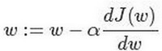

疊代就是不斷重複做如圖的公式:

$:=$表示更新參數,

$a $ 表示學習率（**learning rate**），用來控制步長（**step**），即向下走一步的長度$\frac{dJ(w)}{dw}$  就是函數$J(w)$對$w$ 求導（**derivative**），在代碼中我們會使用$dw$表示這個結果


對於導數更加形象化的理解就是斜率（**slope**），如圖該點的導數就是這個點相切於 $J(w)$的小三角形的高除寬。假設我們以如圖點為初始化點，該點處的斜率的符號是正的，即$\frac{dJ(w)}{dw}>0$，所以接下來會向左走一步。


整個梯度下降法的疊代過程就是不斷地向左走，直至逼近最小值點。

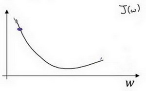

假設我們以如圖點為初始化點，該點處的斜率的符號是負的，即$\frac{dJ(w)}{dw}<0$，所以接下來會向右走一步。

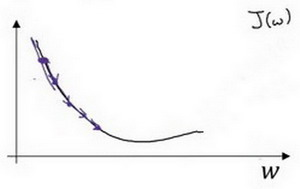

整個梯度下降法的疊代過程就是不斷地向右走，即朝著最小值點方向走。

**梯度下降法的細節化說明（兩個參數）**

邏輯回歸的代價函數（成本函數）$J(w,b)$是含有兩個參數的。

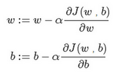
$\partial $ 表示求偏導符號，可以讀作**round**，
$\frac{\partial J(w,b)}{\partial w}$  就是函數$J(w,b)$ 對$w$ 求偏導，在代碼中我們會使用$dw$ 表示這個結果，
$\frac{\partial J(w,b)}{\partial b}$  就是函數$J(w,b)$對$b$ 求偏導，在代碼中我們會使用$db$ 表示這個結果，
小寫字母$d$ 用在求導數（**derivative**），即函數只有一個參數，
偏導數符號$\partial $ 用在求偏導（**partial derivative**），即函數含有兩個以上的參數。


### 2.5 導數（Derivatives）

這個影片我主要是想幫你獲得對微積分和導數直觀的理解。或許你認為自從大學畢以後你再也沒有接觸微積分。這取決於你什麼時候畢業，也許有一段時間了，如果你顧慮這點，請不要擔心。為了高效應用神經網路和深度學習，你並不需要非常深入理解微積分。因此如果你觀看這個影片或者以後的影片時心想：“哇哦，這些知識、這些運算對我來說很複雜。”我給你的建議是：堅持學習影片，最好下課後做作業，成功的完成編程作業，然後你就可以使用深度學習了。在第四周之後的學習中，你會看到定義的很多種類的函數，透過微積分他們能夠幫助你把所有的知識結合起來，其中有的叫做前向函數和反向函數，因此你不需要了解所有你使用的那些微積分中的函數。所以你不用擔心他們，除此之外在對深度學習的嘗試中，這週我們要進一步深入了解微積分的細節。所有你只需要直觀地認識微積分，用來構建和成功的應用這些算法。最後，如果你是精通微積分的那一小部分人群，你對微積分非常熟悉，你可以跳過這部分影片。其他同學讓我們開始深入學習導數。


一個函數$f(a)=3a$，它是一條直線。下面我們來簡單理解下導數。讓我們看看函數中幾個點，假定$a=2$，那麼$f(a)$是$a$的3倍等於6，也就是說如果$a=2$，那麼函數$f(a)=6$。假定稍微改變一點點$a$的值，只增加一點，變為2.001，這時$a$將向右做微小的移動。0.001的差別實在是太小了，不能在圖中顯示出來，我們把它右移一點，現在$f(a)$等於$a$的3倍是6.003，畫在圖裡，比例不太符合。請看綠色高亮部分的這個小三角形，如果向右移動0.001，那麼$f(a)$增加0.003，$f(a)$的值增加3倍於右移的$a$，因此我們說函數$f(a)$在$a=2$，.是這個導數的斜率，或者說，當$a=2$時，斜率是3。導數這個概念意味著斜率，導數聽起來是一個很可怕、很令人驚恐的詞，但是斜率以一種很友好的方式來描述導數這個概念。所以提到導數，我們把它當作函數的斜率就好了。更正式的斜率定義為在上圖這個綠色的小三角形中，高除以寬。即斜率等於0.003除以0.001，等於3。或者說導數等於3，這表示當你將$a$右移0.001，$f(a)$的值增加3倍水平方向的量。

現在讓我們從不同的角度理解這個函數。
假設$a=5$ ，此時$f(a)=3a=15$。
把$a$右移一個很小的幅度，增加到5.001，$f(a)=15.003$。
即在$a=5$ 時，斜率是3，這就是表示，當微小改變變數$a$的值，$\frac{df(a)}{da}=3$ 。一個等價的導數表達式可以這樣寫$\frac{d}{da}f(a)$  ，不管你是否將$f(a)$放在上面或者放在右邊都沒有關係。
在這個影片中，我講解導數討論的情況是我們將$a$偏移0.001，如果你想知道導數的數學定義，導數是你右移很小的$a$值（不是0.001，而是一個非常非常小的值）。通常導數的定義是你右移$a$(可度量的值)一個無限小的值，$f(a)$增加3倍（增加了一個非常非常小的值）。也就是這個三角形右邊的高度。

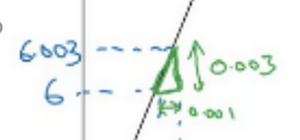

那就是導數的正式定義。但是為了直觀的認識，我們將探討右移$a=0.001$ 這個值，即使0.001並不是無窮小的可測數據。導數的一個特性是：這個函數任何地方的斜率總是等於3，不管$a=2$或 $a=5$，這個函數的斜率總等於3，也就是說不管$a$的值如何變化，如果你增加0.001，$f(a)$的值就增加3倍。這個函數在所有地方的斜率都相等。一種證明方式是無論你將小三角形畫在哪裡，它的高除以寬總是3。

我希望帶給你一種感覺：什麼是斜率？什麼是導函數？對於一條直線，在例子中函數的斜率，在任何地方都是3。在下一個影片讓我們看一個更複雜的例子，這個例子中函數在不同點的斜率是可變的。

### 2.6 更多的導數例子（More Derivative Examples）

在這個影片中我將給出一個更加複雜的例子，在這個例子中，函數在不同點處的斜率是不一樣的，先來舉個例子:

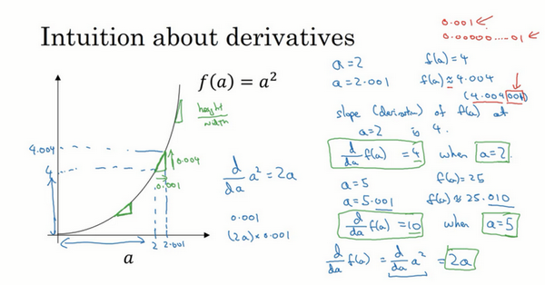

我在這裡畫一個函數，$f(a)={{\text{a}}^{\text{2}}}$，如果$a=\text{2}$ 的話，那麼$f(a)=4$。讓我們稍稍往右推進一點點，現在$a=\text{2}.\text{001}$ ，則$f(a)\approx 4.004$  (如果你用計算器算的話，這個準確的值應該為4.004。0.001 我只是為了簡便起見，省略了後面的部分)，如果你在這裡畫，一個小三角形，你就會發現，如果把$a$往右移動0.001，那麼$f(a)$將增大四倍，即增大0.004。在微積分中我們把這個三角形斜邊的斜率，稱為$f(a)$在點$a=\text{2}$ 處的導數(即為4)，或者寫成微積分的形式，當$a=\text{2}$  的時候， $\frac{d}{da}f(a)=4$  由此可知，函數$f(a)={{a}^{{2}}}$，在$a$取不同值的時候，它的斜率是不同的，這和上個影片中的例子是不同的。

這裡有種直觀的方法可以解釋，為什麼一個點的斜率，在不同位置會不同如果你在曲線上，的不同位置畫一些小小的三角形你就會發現，三角形高和寬的比值，在曲線上不同的地方，它們是不同的。所以當$a=2$ 時，斜率為4；而當$a=5$時，斜率為10 。如果你翻看微積分的課本，課本會告訴你，函數$f(a)={{a}^{{2}}}$的斜率（即導數）為$2a$。這意味著任意給定一點$a$，如果你稍微將$a$，增大0.001，那麼你會看到$f(a)$將增大$2a$，即增大的值為點在$a$處斜率或導數，乘以你向右移動的距離。

現在有個小細節需要注意，導數增大的值，不是剛好等於導數公式算出來的值，而只是根據導數算出來的一個估計值。

**為了總結這堂課所學的知識，我們再來看看幾個例子：**


假設$f(a)={{a}^{\text{3}}}$ 如果你翻看導數公式表，你會發現這個函數的導數，等於$3{{a}^{2}}$。所以這是什麼意思呢，同樣地舉一個例子：我們再次令$a=2$，所以${{a}^{3}}=8$ ，如果我們又將$a$增大一點點，你會發現$f(a)\approx 8.012$， 你可以自己檢查一遍，如果我們取8.012，你會發現${{2.001}^{3}}$ ，和8.012很接近，事實上當$a=2$時，導數值為$3×{{2}^{2}}$，即$3×4=12$。所以導數公式，表明如果你將$a$向右移動0.001時，$f(a)$ 將會向右移動12倍，即0.012。

來看最後一個例子，假設$f(a)={{\log }_{e}}a$，有些可能會寫作$\ln a$，函數$\log a$ 的斜率應該為$\frac{1}{a}$，所以我們可以解釋如下：如果$a$取任何值，比如又取$a=2$，然後又把$a$向右邊移動0.001 那麼$f(a)$將增大$\frac{\text{1}}{a}\times \text{0}\text{.001}$，如果你借助計算器的話，你會發現當$a=2$時$f(a)\approx \text{0}\text{.69315}$ ；而$a=2.001$時，$f(a)\approx \text{0}\text{.69365}$。所以$f(a)$增大了0.0005，如果你查看導數公式，當$a=2$的時候，導數值$\frac{d}{da}f(a)=\frac{\text{1}}{\text{2}}$。這表明如果你把 增大0.001，$f(a)$將只會增大0.001的二分之一，即0.0005。如果你畫個小三角形你就會發現，如果$x$ 軸增加了0.001，那麼$y$ 軸上的函數$\log a$，將增大0.001的一半 即0.0005。所以 $\frac{1}{a}$ ，當$a=2$時這裡是 ，就是當$a=2$時這條線的斜率。這些就是有關，導數的一些知識。

**在這個影片中，你只需要記住兩點：**

第一點，導數就是斜率，而函數的斜率，在不同的點是不同的。在第一個例子中$f(a)=\text{3}a$ ，這是一條直線，在任何點它的斜率都是相同的，均為3。但是對於函數$f(a)={{\text{a}}^{\text{2}}}$ ，或者$f(a)=\log a$，它們的斜率是變化的，所以它們的導數或者斜率，在曲線上不同的點處是不同的。

第二點，如果你想知道一個函數的導數，你可參考你的微積分課本或者維基百科，然後你應該就能找到這些函數的導數公式。

最後我希望，你能通過我生動的講解，掌握這些有關導數和斜率的知識，下一課我們將講解計算圖，以及如何用它來求更加複雜的函數的導數。

### 2.7 計算圖（Computation Graph）

可以說，一個神經網路的計算，都是按照前向或反向傳播過程組織的。首先我們計算出一個新的網路的輸出（前向過程），緊接著進行一個反向傳輸操作。後者我們用來計算出對應的梯度或導數。計算圖解釋了為什麼我們用這種方式組織這些計算過程。在這個影片中，我們將舉一個例子說明計算圖是什麼。讓我們舉一個比邏輯回歸更加簡單的，或者說不那麼正式的神經網路的例子。


我們嘗試計算函數$J$，$J$是由三個變數$a,b,c$組成的函數，這個函數是$\text{3(a}+\text{bc)}$ 。計算這個函數實際上有三個不同的步驟，首先是計算 $b$ 乘以 $c$，我們把它儲存在變數$u$中，因此${u}={bc}$；
然後計算$v=a+u$；最後輸出$J=3v$，這就是要計算的函數$J$。我們可以把這三步畫成如下的計算圖，我先在這畫三個變數$a,b,c$，第一步就是計算$u=bc$，我在這周圍放個矩形框，它的輸入是$b,c$，接著第二步$v=a+u$，最後一步$J=3v$。
舉個例子: $a=5,b=3,c=2$ ，$u=bc$就是6，$v=a+u$ ，就是5+6=11。$J$是3倍的 ，因此。即$3×(5+3×2)$。如果你把它算出來，實際上得到33就是$J$的值。
當有不同的或者一些特殊的輸出變數時，例如本例中的$J$和邏輯回歸中你想最佳化的代價函數$J$，因此計算圖用來處理這些計算會很方便。從這個小例子中我們可以看出，通過一個從左向右的過程，你可以計算出$J$的值。為了計算導數，從右到左（紅色箭頭，和藍色箭頭的過程相反）的過程是用於計算導數最自然的方式。
概括一下：計算圖組織計算的形式是用藍色箭頭從左到右的計算，讓我們看看下一個影片中如何進行反向紅色箭頭(也就是從右到左)的導數計算，讓我們繼續下一個影片的學習。


### 2.8 使用計算圖求導數（Derivatives with a Computation Graph）

在上一個影片中，我們看了一個例子使用流程計算圖來計算函數J。現在我們清理一下流程圖的描述，看看你如何利用它計算出函數$J$的導數。

下面用到的公式：

$\frac{dJ}{du}=\frac{dJ}{dv}\frac{dv}{du}$  ，         $\frac{dJ}{db}=\frac{dJ}{du}\frac{du}{db}$ ，          $\frac{dJ}{da}=\frac{dJ}{du}\frac{du}{da}$

這是一個流程圖：


假設你要計算$\frac{{dJ}}{{dv}}$，那要怎麼算呢？好，比如說，我們要把這個$v$值拿過來，改變一下，那麼$J$的值會怎麼變呢？

所以定義上$J = 3v$，現在$v=11$，所以如果你讓$v$增加一點點，比如到11.001，那麼$J =3v =33.003$，所以我這裡$v$增加了0.001，然後最終結果是$J$上升到原來的3倍，所以$\frac{{dJ}}{{dv}}=3$，因為對於任何 $v$ 的增量$J$都會有3倍增量，而且這類似於我們在上一個影片中的例子，我們有$f(a)=3a$，然後我們推導出$\frac{{df}(a)}{{da}}= 3$，所以這裡我們有$J=3v$，所以$\frac{{dJ}}{{dv}} =3$，這裡$J$扮演了$f$的角色，在之前的影片裡的例子。

在反向傳播算法中的術語，我們看到，如果你想計算最後輸出變數的導數，使用你最關心的變數對$v$的導數，那麼我們就做完了一步反向傳播，在這個流程圖中是一個反向步驟。

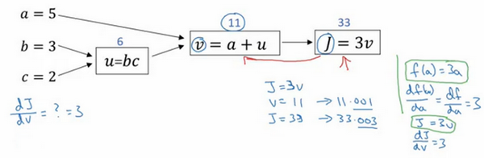

我們來看另一個例子，$\frac{{dJ}}{da}$是多少呢？換句話說，如果我們提高$a$的數值，對$J$的數值有什麼影響？

好，我們看看這個例子。變數$a=5$，我們讓它增加到5.001，那麼對v的影響就是$a+u$，之前$v=11$，現在變成11.001，我們從上面看到現在$J$ 就變成33.003了，所以我們看到的是，如果你讓$a$增加0.001，$J$增加0.003。那麼增加$a$，我是說如果你把這個5換成某個新值，那麼$a$的改變數就會傳播到流程圖的最右，所以$J$最後是33.003。所以J的增量是3乘以$a$的增量，意味著這個導數是3。


要解釋這個計算過程，其中一種方式是：如果你改變了$a$，那麼也會改變$v$，通過改變$v$，也會改變$J$，所以$J$值的淨變化量，當你提升這個值（0.001），當你把$a$值提高一點點，這就是$J$的變化量（0.003）。


首先a增加了，$v$也會增加，$v$增加多少呢？這取決於$\frac{{dv}}{da}$，然後$v$的變化導致$J$也在增加，所以這在微積分裡實際上叫鏈式法則，如果$a$影響到$v$，$v$影響到$J$，那麼當你讓$a$變大時，$J$的變化量就是當你改變$a$時，$v$的變化量乘以改變$v$時$J$的變化量，在微積分裡這叫鏈式法則。


我們從這個計算中看到，如果你讓$a$增加0.001，$v$也會變化相同的大小，所以$\frac{{dv}}{da}= 1$。事實上，如果你代入進去，我們之前算過$\frac{{dJ}}{{dv}} =3$，$\frac{{dv}}{da} =1$，所以這個乘積3×1，實際上就給出了正確答案，$\frac{{dJ}}{da} = 3$。

這張小圖表示了如何計算，$\frac{{dJ}}{{dv}}$就是$J$對變數$v$的導數，它可以幫助你計算$\frac{{dJ}}{da}$，所以這是另一步反向傳播計算。


現在我想介紹一個新的符號約定，當你編程實現反向傳播時，通常會有一個最終輸出值是你要關心的，最終的輸出變數，你真正想要關心或者說最佳化的。在這種情況下最終的輸出變數是J，就是流程圖裡最後一個符號，所以有很多計算嘗試計算輸出變數的導數，所以輸出變數對某個變數的導數，我們就用$dvar$命名，所以在很多計算中你需要計算最終輸出結果的導數，在這個例子裡是$J$，還有各種中間變數，比如$a、b、c、u、v$，當你在軟體裡實現的時候，變數名叫什麼？你可以做的一件事是，在**python**中，你可以寫一個很長的變數名，比如${dFinalOutputvar}\_{dvar}$，但這個變數名有點長，我們就用$dJ\_dvar$，但因為你一直對$dJ$求導，對這個最終輸出變數求導。我這裡要介紹一個新符號，在程序裡，當你編程的時候，在代碼裡，我們就使用變數名$dvar$，來表示那個量。


好，所以在程序裡是$dvar$表示導數，你關心的最終變數$J$的導數，有時最後是$L$，對代碼中各種中間量的導數，所以代碼裡這個東西，你用$dv$表示這個值，所以$dv=3$，你的代碼表示就是$da=3$。


好，所以我們通過這個流程圖完成部分的後向傳播算法。我們在下一張幻燈片看看這個例子剩下的部分。

我們清理出一張新的流程圖，我們回顧一下，到目前為止，我們一直在往回傳播，並計算$dv=3$，再次，$dv$是代碼裡的變數名，其真正的定義是$\frac{{dJ}}{{dv}}$。我發現$da=3$，再次，$da$是代碼裡的變數名，其實代表$\frac{{dJ}}{da}$的值。


大概手算了一下，兩條直線怎麼計算反向傳播。

好，我們繼續計算導數，我們看看這個值$u$，那麼$\frac{dJ}{du}$是多少呢？通過和之前類似的計算，現在我們從$u=6$出發，如果你令$u$增加到6.001，那麼$v$之前是11，現在變成11.001了，$J$ 就從33變成33.003，所以$J$ 增量是3倍，所以$\frac{{dJ}}{du}= 3$。對$u$的分析很類似對a的分析，實際上這計算起來就是$\frac{{dJ}}{dv}\cdot \frac{{dv}}{du}$，有了這個，我們可以算出$\frac{{dJ}}{dv} =3$，$\frac{{dv}}{du} = 1$，最終算出結果是$3×1=3$。


所以我們還有一步反向傳播，我們最終計算出$du=3$，這裡的$du$當然了，就是$\frac{{dJ}}{du}$。

現在，我們仔細看看最後一個例子，那麼$\frac{{dJ}}{db}$呢？想像一下，如果你改變了$b$的值，你想要然後變化一點，讓$J$ 值到達最大或最小，那麼導數是什麼呢？這個$J$函數的斜率，當你稍微改變$b$值之後。事實上，使用微積分鏈式法則，這可以寫成兩者的乘積，就是$\frac{{dJ}}{du}\cdot \frac{{du}}{db}$，理由是，如果你改變$b$一點點，所以$b$變化比如說3.001，它影響J的方式是，首先會影響$u$，它對$u$的影響有多大？好，$u$的定義是$b\cdot c$，所以$b=3$時這是6，現在就變成6.002了，對吧，因為在我們的例子中$c=2$，所以這告訴我們$\frac{{du}}{db}= 2$當你讓$b$增加0.001時，$u$就增加兩倍。所以$\frac{{du}}{db} =2$，現在我想$u$的增加量已經是$b$的兩倍，那麼$\frac{{dJ}}{du}$是多少呢？我們已經弄清楚了，這等於3，所以讓這兩部分相乘，我們發現$\frac{{dJ}}{db}= 6$。

好，這就是第二部分的推導，其中我們想知道 $u$ 增加0.002，會對$J$ 有什麼影響。實際上$\frac{{dJ}}{du}=3$，這告訴我們u增加0.002之後，$J$上升了3倍，那麼$J$ 應該上升0.006，對吧。這可以從$\frac{{dJ}}{du}= 3$推導出來。

如果你仔細看看這些數學內容，你會發現，如果$b$變成3.001，那麼$u$就變成6.002，$v$變成11.002，然後$J=3v=33.006$，對吧？這就是如何得到$\frac{{dJ}}{db}= 6$。


為了填進去，如果我們反向走的話，$db=6$，而$db$其實是**Python**代碼中的變數名，表示$\frac{{dJ}}{db}$。


我不會很詳細地介紹最後一個例子，但事實上，如果你計算$\frac{{dJ}}{dc} =\frac{{dJ}}{du}\cdot \frac{{du}}{dc} = 3 \times 3$，這個結果是9。

我不會詳細說明這個例子，在最後一步，我們可以推出$dc=9$。


所以這個影片的要點是，對於那個例子，當計算所有這些導數時，最有效率的辦法是從右到左計算，跟著這個紅色箭頭走。特別是當我們第一次計算對$v$的導數時，之後在計算對$a$導數就可以用到。然後對$u$的導數，比如說這個項和這裡這個項：


可以幫助計算對$b$的導數，然後對$c$的導數。

所以這是一個計算流程圖，就是正向或者說從左到右的計算來計算成本函數J，你可能需要最佳化的函數，然後反向從右到左計算導數。如果你不熟悉微積分或鏈式法則，我知道這裡有些細節講的很快，但如果你沒有跟上所有細節，也不用怕。在下一個影片中，我會再過一遍。在邏輯回歸的背景下過一遍，並給你介紹需要做什麼才能編寫程式碼，實現邏輯回歸模型中的導數計算。

### 2.9 邏輯回歸中的梯度下降（Logistic Regression Gradient Descent）

本節我們討論怎樣透過計算偏導數來實現邏輯回歸的梯度下降算法。它的關鍵點是幾個重要公式，其作用是用來實現邏輯回歸中梯度下降算法。但是在本節影片中，我將使用計算圖對梯度下降算法進行計算。我必須要承認的是，使用計算圖來計算邏輯回歸的梯度下降算法有點大材小用了。但是，我認為以這個例子作為開始來講解，可以使你更好的理解背後的思想。從而在討論神經網路時，你可以更深刻而全面地理解神經網路。接下來讓我們開始學習邏輯回歸的梯度下降算法。

假設樣本只有兩個特徵${{x}_{1}}$和${{x}_{2}}$，為了計算$z$，我們需要輸入參數${{w}_{1}}$、${{w}_{2}}$ 和$b$，除此之外還有特徵值${{x}_{1}}$和${{x}_{2}}$。因此$z$的計算公式為：
$z={{w}_{1}}{{x}_{1}}+{{w}_{2}}{{x}_{2}}+b$ 
回想一下邏輯回歸的公式定義如下：
$\hat{y}=a=\sigma (z)$
其中$z={{w}^{T}}x+b$ 
$\sigma \left( z \right)=\frac{1}{1+{{e}^{-z}}}$
損失函數：
$L( {{{\hat{y}}}^{(i)}},{{y}^{(i)}})=-{{y}^{(i)}}\log {{\hat{y}}^{(i)}}-(1-{{y}^{(i)}})\log (1-{{\hat{y}}^{(i)}})$ 
代價函數：
$J\left( w,b \right)=\frac{1}{m}\sum\nolimits_{i}^{m}{L( {{{\hat{y}}}^{(i)}},{{y}^{(i)}})}$ 
假設現在只考慮單個樣本的情況，單個樣本的代價函數定義如下：
$L(a,y)=-(y\log (a)+(1-y)\log (1-a))$ 
其中$a$是邏輯回歸的輸出，$y$是樣本的標籤值。現在讓我們畫出表示這個計算的計算圖。
這裡先複習下梯度下降法，$w$和$b$的修正量可以表達如下：

$w:=w-a \frac{\partial J(w,b)}{\partial w}$，$b:=b-a\frac{\partial J(w,b)}{\partial b}$


如圖：在這個公式的外側畫上長方形。然後計算：
$\hat{y}=a=\sigma(z)$
也就是計算圖的下一步。最後計算損失函數$L(a,y)$。
有了計算圖，我就不需要再寫出公式了。因此，為了使得邏輯回歸中最小化代價函數$L(a,y)$，我們需要做的僅僅是修改參數$w$和$b$的值。前面我們已經講解了如何在單個訓練樣本上計算代價函數的前向步驟。現在讓我們來討論通過反向計算出導數。
因為我們想要計算出的代價函數$L(a,y)$的導數，首先我們需要反向計算出代價函數$L(a,y)$關於$a$的導數，在編寫程式碼時，你只需要用$da$ 來表示$\frac{dL(a,y)}{da}$  。
通過微積分得到：
$\frac{dL(a,y)}{da}=-y/a+(1-y)/(1-a)$ 
如果你不熟悉微積分，也不必太擔心，我們會列出本課程涉及的所有求導公式。那麼如果你非常熟悉微積分，我們鼓勵你主動推導前面介紹的代價函數的求導公式，使用微積分直接求出$L(a,y)$關於變數$a$的導數。如果你不太了解微積分，也不用太擔心。現在我們已經計算出$da$，也就是最終輸出結果的導數。
現在可以再反向一步，在編寫**Python**代碼時，你只需要用$dz$來表示代價函數$L$關於$z$ 的導數$\frac{dL}{dz}$，也可以寫成$\frac{dL(a,y)}{dz}$，這兩種寫法都是正確的。
$\frac{dL}{dz}=a-y$ 。
因為$\frac{dL(a,y)}{dz}=\frac{dL}{dz}=(\frac{dL}{da})\cdot (\frac{da}{dz})$，
並且$\frac{da}{dz}=a\cdot (1-a)$，
而 $\frac{dL}{da}=(-\frac{y}{a}+\frac{(1-y)}{(1-a)})$，因此將這兩項相乘，得到：

${dz} = \frac{{dL}(a,y)}{{dz}} = \frac{{dL}}{{dz}} = \left( \frac{{dL}}{{da}} \right) \cdot \left(\frac{{da}}{{dz}} \right) = ( - \frac{y}{a} + \frac{(1 - y)}{(1 - a)})\cdot a(1 - a) = a - y$

影片中為了簡化推導過程，假設${{n}_{x}}$ 這個推導的過程就是我之前提到過的鏈式法則。如果你對微積分熟悉，放心地去推導整個求導過程，如果不熟悉微積分，你只需要知道$dz=(a-y)$已經計算好了。

現在進行最後一步反向推導，也就是計算$w$和$b$變化對代價函數$L$的影響，特別地，可以用:
$d{{w}_{1}}=\frac{1}{m}\sum\limits_{i}^{m}{x_{1}^{(i)}}({{a}^{(i)}}-{{y}^{(i)}})$ 
$d{{w}_{2}}=\frac{1}{m}\sum\limits_{i}^{m}{x_{2}^{(i)}}({{a}^{(i)}}-{{y}^{(i)}})$ 
$db=\frac{1}{m}\sum\limits_{i}^{m}{({{a}^{(i)}}-{{y}^{(i)}})}$ 
影片中，
$d{{w}_{1}}$ 表示$\frac{\partial L}{\partial {{w}_{1}}}={{x}_{1}}\cdot dz$， 
$d{{w}_{\text{2}}}$ 表示$\frac{\partial L}{\partial {{w}_{2}}}={{x}_{2}}\cdot dz$，
$db=dz$。
因此，關於單個樣本的梯度下降算法，你所需要做的就是如下的事情：
使用公式$dz=(a-y)$計算$dz$，
使用$d{{w}_{1}}={{x}_{1}}\cdot dz$ 計算$d{{w}_{1}}$， $d{{w}_{2}}={{x}_{2}}\cdot dz$計算$d{{w}_{2}}$，
$db=dz$ 來計算$db$，
然後:
更新${{w}_{1}}={{w}_{1}}-a d{{w}_{1}}$，
更新${{w}_{2}}={{w}_{2}}-a d{{w}_{2}}$，
更新$b=b-\alpha db$。
這就是關於單個樣本實例的梯度下降算法中參數更新一次的步驟。


現在你已經知道了怎樣計算導數，並且實現針對單個訓練樣本的邏輯回歸的梯度下降算法。但是，訓練邏輯回歸模型不僅僅只有一個訓練樣本，而是有$m$個訓練樣本的整個訓練集。因此在下一節影片中，我們將這些思想應用到整個訓練樣本集中，而不僅僅只是單個樣本上。

### 2.10  m 個樣本的梯度下降(Gradient Descent on m Examples)

在之前的影片中,你已經看到如何計算導數，以及應用梯度下降在邏輯回歸的一個訓練樣本上。現在我們想要把它應用在$m$個訓練樣本上。

![02-10-Gradient [00_02_18][20170816-103833-9]](../images/bf930b1f68d8e0726dda5393afc83672.png)

首先，讓我們時刻記住有關於損失函數$J(w,b)$的定義。

$J(w,b)=\frac{1}{m}\sum\limits_{i=1}^{m}{L({{a}^{(i)}},{{y}^{(i)}})}$ 

當你的算法輸出關於樣本$y$的${{a}^{(i)}}$，${{a}^{(i)}}$是訓練樣本的預測值，即：$\sigma ( {{z}^{(i)}})=\sigma( {{w}^{T}}{{x}^{\left( i \right)}}+b)$。 
所以我們在前面的幻燈中展示的是對於任意單個訓練樣本，如何計算微分當你只有一個訓練樣本。因此$d{{w}_{1}}$，$d{{w}_{\text{2}}}$和$db$ 添上上標$i$表示你求得的相應的值。如果你面對的是我們在之前的幻燈中示範的那種情況，但只使用了一個訓練樣本$({{x}^{(i)}},{{y}^{(i)}})$。 
現在你知道帶有求和的全局代價函數，實際上是1到$m$項各個損失的平均。 所以它表明全局代價函數對${{w}_{1}}$的微分，對${{w}_{1}}$的微分也同樣是各項損失對${{w}_{1}}$微分的平均。


但之前我們已經示範了如何計算這項，即之前幻燈中示範的如何對單個訓練樣本進行計算。所以你真正需要做的是計算這些微分，如我們在之前的訓練樣本上做的。並且求平均，這會給你全局梯度值，你能夠把它直接應用到梯度下降算法中。

所以這裡有很多細節，但讓我們把這些裝進一個具體的算法。同時你需要一起應用的就是邏輯回歸和梯度下降。

我們初始化$J=0,d{{w}_{1}}=0,d{{w}_{2}}=0,db=0$

代碼流程：

```
J=0;dw1=0;dw2=0;db=0;
for i = 1 to m
    z(i) = wx(i)+b;
    a(i) = sigmoid(z(i));
    J += -[y(i)log(a(i))+(1-y(i)）log(1-a(i));
    dz(i) = a(i)-y(i);
    dw1 += x1(i)dz(i);
    dw2 += x2(i)dz(i);
    db += dz(i);
J/= m;
dw1/= m;
dw2/= m;
db/= m;
w=w-alpha*dw
b=b-alpha*db
```

幻燈片上只應用了一步梯度下降。因此你需要重複以上內容很多次，以應用多次梯度下降。看起來這些細節似乎很複雜，但目前不要擔心太多。希望你明白，當你繼續嘗試並應用這些在編程作業裡，所有這些會變的更加清楚。

但這種計算中有兩個缺點，也就是說應用此方法在邏輯回歸上你需要編寫兩個**for**循環。第一個**for**循環是一個小循環遍歷$m$個訓練樣本，第二個**for**循環是一個遍歷所有特徵的**for**循環。這個例子中我們只有2個特徵，所以$n$等於2並且${{n}_{x}}$ 等於2。 但如果你有更多特徵，你開始編寫你的因此$d{{w}_{1}}$，$d{{w}_{2}}$，你有相似的計算從$d{{w}_{3}}$一直下去到$d{{w}_{n}}$。所以看來你需要一個**for**循環遍歷所有$n$個特徵。

當你應用深度學習算法，你會發現在代碼中顯式地使用**for**循環使你的算法很低效，同時在深度學習領域會有越來越大的數據集。所以能夠應用你的算法且沒有顯式的**for**循環會是重要的，並且會幫助你適用於更大的數據集。所以這裡有一些叫做向量化技術,它可以允許你的代碼擺脫這些顯式的**for**循環。

我想在先於深度學習的時代，也就是深度學習興起之前，向量化是很棒的。可以使你有時候加速你的運算，但有時候也未必能夠。但是在深度學習時代向量化，擺脫for循環已經變得相當重要。因為我們越來越多地訓練非常大的數據集，因此你真的需要你的代碼變得非常高效。所以在接下來的幾個影片中，我們會談到向量化，以及如何應用向量化而連一個**for**循環都不使用。所以學習了這些，我希望你有關於如何應用邏輯回歸，或是用於邏輯回歸的梯度下降，事情會變得更加清晰。當你進行編程練習，但在真正做編程練習之前讓我們先談談向量化。然後你可以應用全部這些東西，應用一個梯度下降的疊代而不使用任何**for**循環。


### 2.11 向量化(Vectorization)

參考影片: 2.11 向量化

向量化是非常基礎的去除代碼中**for**循環的藝術，在深度學習安全領域、深度學習實踐中，你會經常發現自己訓練大數據集，因為深度學習算法處理大數據集效果很棒，所以你的代碼運行速度非常重要，否則如果在大數據集上，你的代碼可能花費很長時間去運行，你將要等待非常長的時間去得到結果。所以在深度學習領域，運行向量化是一個關鍵的技巧，讓我們舉個栗子說明什麼是向量化。

在邏輯回歸中你需要去計算$z={{w}^{T}}x+b$，$w$、$x$都是列向量。如果你有很多的特徵那麼就會有一個非常大的向量，所以$w\in {{\mathbb{R}}^{{{n}_{x}}}}$ , $x\in{{\mathbb{R}}^{{{n}_{x}}}}$，所以如果你想使用非向量化方法去計算${{w}^{T}}x$，你需要用如下方式（**python**）

```
z=0
for i in range(n_x):
    z += w[i]*x[i]
z += b
```

這是一個非向量化的實現，你會發現這真的很慢，作為一個對比，向量化實現將會非常直接計算${{w}^{T}}x$，代碼如下：

`z=np.dot(w,x)+b`

這是向量化計算${{w}^{T}}x$的方法，你將會發現這個非常快


讓我們用一個小例子說明一下，在我的我將會寫一些程式碼（以下為教授在他的**Jupyter notebook**上寫的**Python**代碼，）

```
import numpy as np #導入numpy庫
a = np.array([1,2,3,4]) #創建一個數據a
print(a)
# [1 2 3 4]

import time #導入時間庫
a = np.random.rand(1000000)
b = np.random.rand(1000000) #通過round隨機得到兩個一百萬維度的數組
tic = time.time() #現在測量一下當前時間

#向量化的版本
c = np.dot(a,b)
toc = time.time()
print("Vectorized version:" + str(1000*(toc-tic)) +"ms") #列印一下向量化的版本的時間

#繼續增加非向量化的版本
c = 0
tic = time.time()
for i in range(1000000):
    c += a[i]*b[i]
toc = time.time()
print(c)
print("For loop:" + str(1000*(toc-tic)) + "ms")#列印for循環的版本的時間
```

返回值見圖。

在兩個方法中，向量化和非向量化計算了相同的值，如你所見，向量化版本花費了1.5毫秒，非向量化版本的**for**循環花費了大約幾乎500毫秒，非向量化版本多花費了300倍時間。所以在這個例子中，僅僅是向量化你的代碼，就會運行300倍快。這意味著如果向量化方法需要花費一分鐘去運行的數據，**for**循環將會花費5個小時去運行。

一句話總結，以上都是再說和for循環相比，向量化可以快速得到結果。

你可能聽過很多類似如下的話，“大規模的深度學習使用了**GPU**或者圖像處理單元實現”，但是我做的所有的案例都是在**jupyter notebook**上面實現，這裡只有**CPU**，**CPU**和**GPU**都有並行化的指令，他們有時候會叫做**SIMD**指令，這個代表了一個單獨指令多維數據，這個的基礎意義是，如果你使用了**built-in**函數,像`np.function`或者並不要求你實現循環的函數，它可以讓**python**的充分利用並行化計算，這是事實在**GPU**和**CPU**上面計算，**GPU**更加擅長**SIMD**計算，但是**CPU**事實上也不是太差，可能沒有**GPU**那麼擅長吧。接下來的影片中，你將看到向量化怎麼能夠加速你的代碼，經驗法則是，無論什麼時候，避免使用明確的**for**循環。

以下代碼及運行結果截圖：


### 2.12 向量化的更多例子（More Examples of Vectorization）

從上節影片中，你知道了怎樣通過**numpy**內建函數和避開顯式的循環(**loop**)的方式進行向量化，從而有效提高代碼速度。

經驗提醒我，當我們在寫神經網路程序時，或者在寫邏輯(l**ogistic**)回歸，或者其他神經網路模型時，應該避免寫循環(**loop**)語句。雖然有時寫循環(**loop**)是不可避免的，但是我們可以使用比如**numpy**的內建函數或者其他辦法去計算。當你這樣使用後，程序效率總是快於循環(**loop)**。

讓我們看另外一個例子。如果你想計算向量$u=Av$，這時矩陣乘法定義為，矩陣乘法的定義就是：$u_{i} =\sum_{j}^{}{A_{\text{ij}}v_{i}}$，這取決於你怎麼定義$u_{i}$值。同樣使用非向量化實現，$u=np.zeros(n,1)$， 並且通過兩層循環$for(i):for(j):$，得到$u[i]=u[i]+A[i][j]*v[j]$ 。現在就有了$i$ 和 $j$ 的兩層循環，這就是非向量化。向量化方式就可以用$u=np.dot(A,v)$，右邊這種向量化實現方式，消除了兩層循環使得代碼運行速度更快。 	


下面透過另一個例子繼續了解向量化。如果你已經有一個向量$v$，並且想要對向量$v$的每個元素做指數操作，得到向量$u$等於$e$的$v_1$，$e$的$v_2$，一直到$e$的$v_n$次方。這裡是非向量化的實現方式，首先你初始化了向量$u=np.zeros(n,1)$，並且通過循環依次計算每個元素。但事實證明可以通過**python**的**numpy**內建函數，幫助你計算這樣的單個函數。所以我會引入`import numpy as np`，執行 $u=np.exp(v)$ 命令。注意到，在之前有循環的代碼中，這裡僅用了一行程式碼，向量$v$作為輸入，$u$作為輸出。你已經知道為什麼需要循環，並且通過右邊代碼實現，效率會明顯的快於循環方式。

事實上，**numpy**庫有很多向量函數。比如 `u=np.log`是計算對數函數($log$)、 `np.abs()` 計算數據的絕對值、`np.maximum(v, 0)` 按元素計算$v$中每個元素和和0相比的最大值，`v**2` 代表獲得元素 $v$ 每個值的平方、 `1/v` 獲取 $v$ 中每個元素的倒數等等。所以當你想寫循環時候，檢查**numpy**是否存在類似的內建函數，從而避免使用循環(**loop**)方式。


那麼，將剛才所學到的內容，運用在邏輯回歸的梯度下降上，看看我們是否能簡化兩個計算過程中的某一步。這是我們邏輯回歸的求導代碼，有兩層循環。在這例子我們有$n$個特徵值。如果你有超過兩個特徵時，需要循環 $dw_1$ 、$dw_2$ 、$dw_3$ 等等。所以 $j$ 的實際值是1、2 和 $n_x$，就是你想要更新的值。所以我們想要消除第二循環，在這一行，這樣我們就不用初始化 $dw_1$ ， $dw_2$ 都等於0。去掉這些，而是定義 $dw$ 為一個向量，設置 $u=np.zeros(n(x),1)$。定義了一個$x$行的一維向量，從而替代循環。我們僅僅使用了一個向量操作 $dw=dw+x^{(i)}dz^{(i)}$ 。最後，我們得到 $dw=dw/m$ 。現在我們透過將兩層循環轉成一層循環，我們仍然還有這個循環訓練樣本。


希望這個影片給了你一點向量化感覺，減少一層循環使你代碼更快，但事實證明我們能做得更好。所以在下個影片，我們將進一步的講解邏輯回歸，你將會看到更好的監督學習結果。在訓練中不需要使用任何 **for** 循環，你也可以寫出代碼去運行整個訓練集。到此為止一切都好，讓我們看下一個影片。

### 2.13 向量化邏輯回歸(Vectorizing Logistic Regression)

我們已經討論過向量化是如何顯著加速你的代碼，在本次影片中我們將討論如何實現邏輯回歸的向量化計算。這樣就能處理整個數據集，甚至不會用一個明確的for循環就能實現對於整個數據集梯度下降算法的最佳化。我對這項技術感到非常激動，並且當我們後面談到神經網路時同樣也不會用到一個明確的 **for** 循環。

讓我們開始吧，首先我們回顧一下邏輯回歸的前向傳播步驟。所以，如果你有 $m$ 個訓練樣本，然後對第一個樣本進行預測，你需要這樣計算。計算 $z$，我正在使用這個熟悉的公式 $z^{(1)}=w^{T}x^{(1)}+b$ 。然後計算啟動函數 $a^{(1)}=\sigma (z^{(1)})$ ，計算第一個樣本的預測值 $y$ 。

然後對第二個樣本進行預測，你需要計算 $z^{(2)}=w^{T}x^{(2)}+b$ ， $a^{(2)}=\sigma (z^{(2)})$ 。然後對第三個樣本進行預測，你需要計算 $z^{(3)}=w^{T}x^{(3)}+b$ ， $a^{(3)}=\sigma (z^{(3)})$ ，依次類推。如果你有 $m$ 個訓練樣本，你可能需要這樣做 $m$ 次，可以看出，為了完成前向傳播步驟，即對我們的 $m$ 個樣本都計算出預測值。有一個辦法可以並且不需要任何一個明確的**for**循環。讓我們來看一下你該怎樣做。

首先，回憶一下我們曾經定義了一個矩陣 $X$ 作為你的訓練輸入，(如下圖中藍色 $X$ )像這樣在不同的列中堆積在一起。這是一個 $n_x$ 行 $m$ 列的矩陣。我現在將它寫為**Python numpy**的形式 $$(n_{x},m)$$ ，這只是表示 $X$ 是一個 $n_x$ 乘以 $m$ 的矩陣 $$R^{n_x \times m}$$。


現在我首先想做的是告訴你該如何在一個步驟中計算 $z_1$、 $z_2$ 、$z_3$ 等等。實際上，只用了一行程式碼。所以，我打算先構建一個 $1\times m$ 的矩陣，實際上它是一個行向量，同時我準備計算 $z^{(1)}$， $z^{(2)}$ ……一直到 $z^{(m)}$ ，所有值都是在同一時間內完成。結果發現它可以表達為 $w$ 的轉置乘以大寫矩陣 $x$ 然後加上向量 $[b b...b]$ ， $([z^{(1)} z^{(2)}...z^{(m)}]=w^{T}+[bb...b])$ 。$[b b...b]$ 是一個 $1\times m$ 的向量或者 $1\times m$ 的矩陣或者是一個 $m$ 維的行向量。所以希望你熟悉矩陣乘法，你會發現的 $w$ 轉置乘以 $x^{(1)}$ ， $x^{(2)}$ 一直到 $x^{(m)}$ 。所以 $w$ 轉置可以是一個行向量。所以第一項 $w^{T}X$ 將計算 $w$ 的轉置乘以 $x^{(1)}$， $w$ 轉置乘以$x^{(2)}$ 等等。然後我們加上第二項 $[b b...b]$ ，你最終將 $b$ 加到了每個元素上。所以你最終得到了另一個 $1\times m$ 的向量， $[z^{(1)} z^{(2)}...z^{(m)}]=w^{T}X+[b b...b]=[w^{T}x^{(1)}+b,w^{T}x^{(2)}+b...w^{T}x^{(m)}+b]$ 。

$w^{T}x^{(1)}+b$ 這是第一個元素，$w^{T}x^{(2)}+b$ 這是第二個元素， $w^{T}x^{(m)}+b$ 這是第 $m$ 個元素。

如果你參照上面的定義，第一個元素恰好是 $z^{(1)}$ 的定義，第二個元素恰好是 $z^{(2)}$ 的定義，等等。所以，因為$X$是一次獲得的，當你得到你的訓練樣本，一個一個橫向堆積起來，這裡我將 $[z^{(1)} z^{(2)} ... z^{(m)}]$ 定義為大寫的 $Z$ ，你用小寫 $z$ 表示並將它們橫向排在一起。所以當你將不同訓練樣本對應的小寫 $x$ 橫向堆積在一起時得到大寫變數 $X$ 並且將小寫變數也用相同方法處理，將它們橫向堆積起來，你就得到大寫變數 $Z$ 。結果發現，為了計算 $W^{T}X+[b b ... b]$ ，**numpy**命令是$Z=np.dot(w.T,X)+b$。這裡在**Python**中有一個巧妙的地方，這裡 $b$ 是一個實數，或者你可以說是一個 $1\times 1$ 矩陣，只是一個普通的實數。但是當你將這個向量加上這個實數時，**Python**自動把這個實數 $b$ 擴展成一個 $1\times m$ 的行向量。所以這種情況下的操作似乎有點不可思議，它在**Python**中被稱作廣播(**brosdcasting**)，目前你不用對此感到顧慮，我們將在下一個影片中進行進一步的講解。話說回來它只用一行程式碼，用這一行程式碼，你可以計算大寫的 $Z$，而大寫 $Z$ 是一個包含所有小寫$z^{(1)}$  到 $ z^{(m)}$ 的 $1\times m$ 的矩陣。這就是 $Z$ 的內容，關於變數 $a$ 又是如何呢？

我們接下來要做的就是找到一個同時計算 $[a^{(1)} a^{(2)} ... a^{(m)}]$ 的方法。就像把小寫 $x$ 堆積起來得到大寫 $X$ 和橫向堆積小寫 $z$ 得到大寫 $Z$ 一樣，堆積小寫變數 $a$ 將形成一個新的變數，我們將它定義為大寫 $A$。在編程作業中，你將看到怎樣用一個向量在**sigmoid**函數中進行計算。所以**sigmoid**函數中輸入大寫 $Z$ 作為變數並且非常高效地輸出大寫 $A$。你將在編程作業中看到它的細節。

總結一下，在這張幻燈片中我們已經看到，不需要**for**循環，利用 $m$ 個訓練樣本一次性計算出小寫 $z$ 和小寫 $a$，用一行程式碼即可完成。

`Z = np.dot(w.T,X) + b`

這一行程式碼：$A=[a^{(1)} a^{(2)} ... a^{(m)}]=\sigma (Z)$ ，透過恰當地運用$\sigma$一次性計算所有 $a$。這就是在同一時間內你如何完成一個所有 $m$ 個訓練樣本的前向傳播向量化計算。

概括一下，你剛剛看到如何利用向量化在同一時間內高效地計算所有的啟動函數的所有 $a$值。接下來，可以證明，你也可以利用向量化高效地計算反向傳播並以此來計算梯度。讓我們在下一個影片中看該如何實現。


### 2.14 向量化 logistic 回歸的梯度輸出（Vectorizing Logistic Regression's Gradient）

註：本節中大寫字母代表向量，小寫字母代表元素

如何向量化計算的同時，對整個訓練集預測結果$a$，這是我們之前已經討論過的內容。在本次影片中我們將學習如何向量化地計算$m$個訓練數據的梯度，本次影片的重點是如何**同時**計算 $m$ 個數據的梯度，並且實現一個非常高效的邏輯回歸算法**(Logistic Regression**)。

之前我們在講梯度計算的時候，列舉過幾個例子， $dz^{(1)}=a^{(1)}-y^{(1)}$，$dz^{(2)}=a^{(2)}-y^{(2)}$ ……等等一系列類似公式。現在，對 $m$個訓練數據做同樣的運算，我們可以定義一個新的變數 $dZ=[dz^{(1)} ,dz^{(2)} ... dz^{(m)}]$
，所有的 $dz$ 變數橫向排列，因此，$dZ$ 是一個 $1\times m$ 的矩陣，或者說，一個 $m$ 維行向量。在之前的幻燈片中，我們已經知道如何計算$A$，即 $[a^{(1)},a^{(2)} ... a^{(m)}]$,我們需要找到這樣的一個行向量 $Y=[y^{(1)} y^{(2)} ... y^{(m)}]$ ，由此，我們可以這樣計算 $dZ=A-Y=[a^{(1)}-y^{(1)} a^{(2)}-y^{(2)} ... a^{(m)}-y^{(m)}]$，不難發現第一個元素就是 $dz^{(1)}$，第二個元素就是 $dz^{(2)}$ ……所以我們現在僅需一行程式碼，就可以同時完成這所有的計算。

在之前的實現中，我們已經去掉了一個**for**循環，但我們仍有一個遍歷訓練集的循環，如下所示：

$dw=0$

$dw + = x^{(1)}*{dz}^{(1)}$

$dw + = x^{(2)}\ *dz^{(2)}$

………….

$dw + = x^{(m)}*{dz}^{(m)}$

$dw = \frac{{dw}}{m}$

$db = 0$

$db + = {dz}^{(1)}$

$db + = {dz}^{(2)}$

………….

$db + = dz^{(m)}$

$db = \frac{{db}}{m}$

上述（偽）代碼就是我們在之前實現中做的，我們已經去掉了一個**for**循環，但用上述方法計算 $dw$ 仍然需要一個循環遍歷訓練集，我們現在要做的就是將其向量化！

首先我們來看 $db$，不難發現 $$db=\frac{1}{m}\sum_{i=1}^{m}dz^{(i)}$$ ，
之前的講解中，我們知道所有的$dz^{i)}$已經組成一個行向量 $dZ$了，所以在**Python**中，我們很容易地想到$$db=\frac{1}{m}*np.sum(dZ)$$；接下來看$dw$，我們先寫出它的公式 $$dw=\frac{1}{m}*X*dz^{T}$$
其中，$X$ 是一個行向量。因此展開後 $$dw=\frac{1}{m}*(x^{(1)}dz^{(1)}+x^{(2)}dz^{(2)}+...+x^{m}dz^{m})$$ 。因此我們可以僅用兩行程式碼進行計算：$$db=\frac{1}{m}*np.sum(dZ)$$， $$dw=\frac{1}{m}*X*dz^{T}$$。這樣，我們就避免了在訓練集上使用for循環。

現在，讓我們回顧一下，看看我們之前怎麼實現的邏輯回歸，可以發現，沒有向量化是非常低效的，如下圖所示代碼：


我們的目標是不使用**for**循環，而是向量，我們可以這麼做：

$Z = w^{T}X + b = np.dot( w.T,X)+b$

$A = \sigma( Z )$

$dZ = A - Y$

${{dw} = \frac{1}{m}*X*dz^{T}\ }$

$db= \frac{1}{m}*np.sum( dZ)​$

$w: = w - a*dw$

$b: = b - a*db$

現在我們利用前五個公式完成了前向和後向傳播，也實現了對所有訓練樣本進行預測和求導，再利用後兩個公式，梯度下降更新參數。我們的目的是不使用**for**循環，所以我們就通過一次疊代實現一次梯度下降，但如果你希望多次疊代進行梯度下降，那麼仍然需要**for**循環，放在最外層。不過我們還是覺得一次疊代就進行一次梯度下降，避免使用任何循環比較舒服一些。

最後，我們得到了一個高度向量化的、非常高效的邏輯回歸的梯度下降算法，我們將在下次影片中討論**Python**中的**Broadcasting**技術。


### 2.15 Python 中的廣播（Broadcasting in Python）


這是一個不同食物(每100g)中不同營養成分的卡路里含量表格，表格為3行4列，列表示不同的食物種類，從左至右依次為蘋果，牛肉，雞蛋，馬鈴薯。行表示不同的營養成分，從上到下依次為碳水化合物，蛋白質，脂肪。

那麼，我們現在想要計算不同食物中不同營養成分中的卡路里百分比。

現在計算蘋果中的碳水化合物卡路里百分比含量，首先計算蘋果（100g）中三種營養成分卡路里總和56+1.2+1.8
= 59，然後用56/59 = 94.9%算出結果。

可以看出蘋果中的卡路里大部分來自於碳水化合物，而牛肉則不同。

對於其他食物，計算方法類似。首先，按列求和，計算每種食物中（100g）三種營養成分總和，然後分別用不用營養成分的卡路里數量除以總和，計算百分比。

那麼，能否不使用**for**循環完成這樣的一個計算過程呢？

假設上圖的表格是一個4行3列的矩陣$A$，記為 $A_{3\times 4}$，接下來我們要使用**Python**的**numpy**庫完成這樣的計算。我們打算使用兩行程式碼完成，第一行程式碼對每一列進行求和，第二行程式碼分別計算每種食物每種營養成分的百分比。

在**jupyter notebook**中輸入如下代碼，按**shift+Enter**運行，輸出如下。


下面使用如下代碼計算每列的和，可以看到輸出是每種食物(100g)的卡路里總和。


其中`sum`的參數`axis=0`表示求和運算按列執行，之後會詳細解釋。

接下來計算百分比，這條指令將 $3\times 4$的矩陣$A$除以一個$1 \times 4$的矩陣，得到了一個 $3 \times 4$的結果矩陣，這個結果矩陣就是我們要求的百分比含量。


下面再來解釋一下`A.sum(axis = 0)`中的參數`axis`。**axis用來指明將要進行的運算是沿著哪個軸執行，在numpy中，0軸是垂直的，也就是列，而1軸是水平的，也就是行。**

而第二個`A/cal.reshape(1,4)`指令則調用了**numpy**中的廣播機制。這裡使用 $3 \times 4$的矩陣$A$除以 $1 \times 4$的矩陣$cal$。技術上來講，其實並不需要再將矩陣$cal$ `reshape`(重塑)成 $1 \times 4$，因為矩陣$cal$本身已經是 $1 \times 4$了。但是當我們寫程式碼時不確定矩陣維度的時候，通常會對矩陣進行重塑來確保得到我們想要的列向量或行向量。重塑操作`reshape`是一個常量時間的操作，時間複雜度是$O(1)$，它的調用代價極低。

那麼一個 $3 \times 4$ 的矩陣是怎麼和 $1 \times 4$的矩陣做除法的呢？讓我們來看一些更多的廣播的例子。

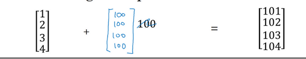

在numpy中，當一個 $4 \times 1$的列向量與一個常數做加法時，實際上會將常數擴展為一個 $4 \times 1$的列向量，然後兩者做逐元素加法。結果就是右邊的這個向量。這種廣播機制對於行向量和列向量均可以使用。

再看下一個例子。


用一個 $2 \times 3$的矩陣和一個 $1 \times 3$ 的矩陣相加，其泛化形式是 $m \times n$ 的矩陣和 $1 \times n$的矩陣相加。在執行加法操作時，其實是將 $1 \times n$ 的矩陣複製成為 $m \times n$ 的矩陣，然後兩者做逐元素加法得到結果。針對這個具體例子，相當於在矩陣的第一列加100，第二列加200，第三列加300。這就是在前一張幻燈片中計算卡路里百分比的廣播機制，只不過這裡是除法操作（廣播機制與執行的運算種類無關）。

下面是最後一個例子


這裡相當於是一個 $m \times n$ 的矩陣加上一個 $m \times 1$ 的矩陣。在進行運算時，會先將 $m \times 1$ 矩陣水平復製 $n$ 次，變成一個 $m \times n$ 的矩陣，然後再執行逐元素加法。

廣播機制的一般原則如下：


這裡我先說一下我本人對**numpy**廣播機制的理解，再解釋上面這張PPT。

首先是**numpy**廣播機制

**如果兩個數組的後緣維度的軸長度相符或其中一方的軸長度為1，則認為它們是廣播相容的。廣播會在缺失維度和軸長度為1的維度上進行。**

後緣維度的軸長度：`A.shape[-1]` 即矩陣維度元組中的最後一個位置的值

對於影片中卡路里計算的例子，矩陣 $A_{3,4}$ 後緣維度的軸長度是4，而矩陣 $cal_{1,4}$ 的後緣維度也是4，則他們滿足後緣維度軸長度相符，可以進行廣播。廣播會在軸長度為1的維度進行，軸長度為1的維度對應`axis=0`，即垂直方向，矩陣 $$\text{cal}_{1,4}$$ 沿`axis=0`(垂直方向)複製成為 $$\text{cal_temp}_{3,4}$$ ，之後兩者進行逐元素除法運算。

現在解釋上圖中的例子

矩陣 $A_{m,n}$ 和矩陣 $B_{1,n}$ 進行四則運算，後緣維度軸長度相符，可以廣播，廣播沿著軸長度為1的軸進行，即 $B_{1,n}$ 廣播成為 ${B_{m,n}}'$ ，之後做逐元素四則運算。

矩陣 $A_{m,n}$ 和矩陣 $B_{m,1}$ 進行四則運算，後緣維度軸長度不相符，但其中一方軸長度為1，可以廣播，廣播沿著軸長度為1的軸進行，即 $B_{m,1}$ 廣播成為 ${B_{m,n}}'$ ，之後做逐元素四則運算。

矩陣 $A_{m,1}$ 和常數$ R$ 進行四則運算，後緣維度軸長度不相符，但其中一方軸長度為1，可以廣播，廣播沿著缺失維度和軸長度為1的軸進行，缺失維度就是`axis=0`,軸長度為1的軸是`axis=1`，即$R$廣播成為 ${B_{m,1}}'$ ，之後做逐元素四則運算。

最後，對於**Matlab/Octave** 有類似功能的函數`bsxfun`。

總結一下`broadcasting`，可以看看下面的圖：


### 2.16 關於 python _ numpy 向量的說明（A note on python or numpy vectors）參考影片：

本節主要講**Python**中的**numpy**一維數組的特性，以及與行向量或列向量的區別。並介紹了老師在實際應用中的一些小技巧，去避免在**coding**中由於這些特性而導致的**bug**。

**Python**的特性允許你使用廣播（**broadcasting**）功能，這是**Python**的**numpy**程序語言庫中最靈活的地方。而我認為這是程序語言的優點，也是缺點。優點的原因在於它們創造出語言的表達性，**Python**語言巨大的靈活性使得你僅僅通過一行程式碼就能做很多事情。但是這也是缺點，由於廣播巨大的靈活性，有時候你對於廣播的特點以及廣播的工作原理這些細節不熟悉的話，你可能會產生很細微或者看起來很奇怪的**bug**。例如，如果你將一個列向量添加到一個行向量中，你會以為它報出維度不匹配或類型錯誤之類的錯誤，但是實際上你會得到一個行向量和列向量的求和。

在**Python**的這些奇怪的影響之中，其實是有一個內在的邏輯關係的。但是如果對**Python**不熟悉的話，我就曾經見過的一些學生非常生硬、非常艱難地去尋找**bug**。所以我在這裡想做的就是分享給你們一些技巧，這些技巧對我非常有用，它們能消除或者簡化我的代碼中所有看起來很奇怪的**bug**。同時我也希望透過這些技巧，你也能更容易地寫沒有**bug**的**Python**和**numpy**代碼。

為了示範**Python-numpy**的一個容易被忽略的效果，特別是怎樣在**Python-numpy**中構造向量，讓我來做一個快速示範。首先設置$a=np.random.randn(5)$，這樣會生成存儲在數組 $a$ 中的5個高斯隨機數變數。之後輸出 $a$，從螢幕上可以得知，此時 $a$ 的**shape**（形狀）是一個$(5,)$的結構。這在**Python**中被稱作**一個一維數組**。它既不是一個行向量也不是一個列向量，這也導致它有一些不是很直觀的效果。舉個例子，如果我輸出一個轉置陣，最終結果它會和$a$看起來一樣，所以$a$和$a$的轉置陣最終結果看起來一樣。而如果我輸出$a$和$a$的轉置陣的內積，你可能會想：$a$乘以$a$的轉置返回給你的可能會是一個矩陣。但是如果我這樣做，你只會得到一個數。  


所以建議你編寫神經網路時，不要使用shape為 _(5,)_、_(n,)_ 或者其他一維數組的數據結構。相反，如果你設置 $a$ 為$(5,1)$，那麼這就將置於5行1列向量中。在先前的操作裡 $a$ 和 $a$ 的轉置看起來一樣，而現在這樣的 $a$ 變成一個新的 $a$ 的轉置，並且它是一個行向量。請注意一個細微的差別，在這種數據結構中，當我們輸出 $a$ 的轉置時有兩對方括號，而之前只有一對方括號，所以這就是1行5列的矩陣和一維數組的差別。

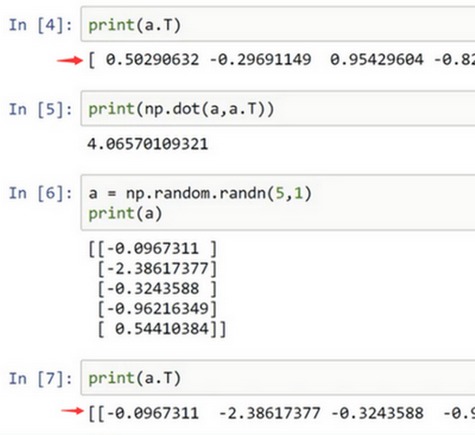

如果你輸出 $a$ 和 $a$ 的轉置的乘積，然後會返回給你一個向量的外積，是吧？所以這兩個向量的外積返回給你的是一個矩陣。

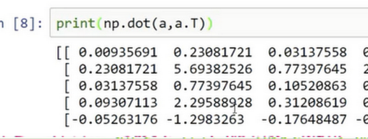

就我們剛才看到的，再進一步說明。首先我們剛剛運行的命令是這個 $(a=np.random.randn(5))$，它生成了一個數據結構$a$，其中$a.shape$是$(5,)$。這被稱作 $a$ 的一維數組，同時這也是一個非常有趣的數據結構。它不像行向量和列向量那樣表現的很一致，這使得它帶來一些不直觀的影響。所以我建議，當你在編程練習或者在執行邏輯回歸和神經網路時，你不需要使用這些一維數組。


相反，如果你每次創建一個數組，你都得讓它成為一個列向量，產生一個$(5,1)$向量或者你讓它成為一個行向量，那麼你的向量的行為可能會更容易被理解。所以在這種情況下，$a.shape$等同於$(5,1)$。這種表現很像 $a$，但是實際上卻是一個列向量。同時這也是為什麼當它是一個列向量的時候，你能認為這是矩陣$(5,1)$；同時這裡 $a.shape$ 將要變成$(1,5)$，這就像行向量一樣。所以當你需要一個向量時，我會說用這個或那個(**column vector or row vector**)，但絕不會是一維數組。  


我寫程式碼時還有一件經常做的事，那就是如果我不完全確定一個向量的維度(**dimension**)，我經常會扔進一個斷言語句(**assertion statement**)。像這樣，去確保在這種情況下是一個$(5,1)$向量，或者說是一個列向量。這些斷言語句實際上是要去執行的，並且它們也會有助於為你的代碼提供訊息。所以不論你要做什麼，不要猶豫直接插入斷言語句。如果你不小心以一維數組來執行，你也能夠重新改變數組維數 $a=reshape$，表明一個$(5,1)$數組或者一個$(1,5)$數組，以致於它表現更像列向量或行向量。


我有時候看見學生因為一維數組不直觀的影響，難以定位bug而告終。通過在原先的代碼裡清除一維數組，我的代碼變得更加簡潔。而且實際上就我在代碼中表現的事情而言，我從來不使用一維數組。因此，要去簡化你的代碼，而且不要使用一維數組。總是使用 $n \times 1$ 維矩陣（基本上是列向量），或者 $1 \times n$ 維矩陣（基本上是行向量），這樣你可以減少很多**assert**語句來節省核矩陣和數組的維數的時間。另外，為了確保你的矩陣或向量所需要的維數時，不要羞於 **reshape** 操作。

總之，我希望這些建議能幫助你解決一個**Python**中的bug，從而使你更容易地完成練習。


### 2.17 Jupyter/iPython Notebooks快速入門（Quick tour of Jupyter/iPython Notebooks）

學到現在，你即將要開始處理你的第一個編程作業。但在那之前，讓我快速地給你介紹一下在**Coursera**上的**iPython Notebooks**工具。


這就是**Jupyter iPython Notebooks**的界面，你可以通過它連接到**Coursera**。讓我快速地講解下它的一些特性。關於它的說明已經被寫入這個**Notebook**中。


這裡有一些空白區域的代碼塊，你可以在這裡編寫程式碼。有時，你也會看到一些函數塊。而關於這些的說明都已經在**iPython Notebook**的文本中。在**iPython Notebook**中，在這些較長的灰色的區域就是代碼塊。


有時，你會看到代碼塊中有像這樣的開始代碼和結束代碼。在進行編程練習時，請確保你的代碼寫在開始代碼和結束代碼之間。


比如，編寫列印輸出**Hello World**的代碼，然後執行這一代碼塊（你可以按**shift +enter**來執行這一代碼塊）。最終，它就會輸出我們想要的**Hello World**。


在運行一個單元格**cell**時，你也可以選擇運行其中的一塊代碼區域。通過點擊**Cell**菜單的**Run Cells**執行這部分代碼。

也許，在你的計算機上，運行**cell**的鍵盤捷徑可能並非是**shift enter**。但是，Mac應該和我的個人電腦一樣，可以使用**shift + enter**來運行**cell**。


當你正在閱讀指南時，如果不小心雙擊了它，點中的區域就會變成**markdown**語言形式。如果你不小心使其變成了這樣的文本框，只要運行下單元格**cell**，就可以回到原來的形式。所以，點擊**cell**菜單的**Run Cells**或者使用**shift + enter**，就可以使得它變回原樣。


這裡還有一些其他的小技巧。比如當你執行上面所使用的代碼時，它實際上會使用一個內核在伺服器上運行這段代碼。如果你正在運行超負荷的進程，或者電腦運行了很長一段時間，或者在運行中出了錯，又或者網路連接失敗，這裡依然有機會讓**Kernel**重新工作。你只要點擊**Kernel**，選擇**Restart**，它會重新運行**Kernel**使程序繼續工作。

所以，如果你只是運行相對較小的工作並且才剛剛啟動你的**ipad**或筆記型電腦，這種情況應該是不會發生的。但是，如果你看見錯誤訊息，比如**Kernel**已經中斷或者其他訊息,你可以試著重啟**Kernel**。


當我使用**iPython Notebook**時會有多個代碼區域塊。儘管我並沒有在前面的代碼塊中添加自己的代碼，但還是要確保先執行這塊代碼。因為在這個例子，它導入了**numpy**包並另命名為**np**等，並聲明了一些你可能需要的變數。為了能順利地執行下面的代碼，就必須確保先執行上面的代碼，即使不要求你去寫其他的代碼。

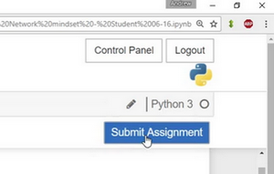

最後，當你完成作業後，可以通過點擊右上方藍色的**Submit Assignment**按鈕提交你的作業。

我發現這種互動式的**shell**命令，在**iPython Notebooks**是非常有用的，能使你快速地實現代碼並且查看輸出結果，便於學習。所以我希望這些練習和**Jupyter iPython Notebooks**會幫助你更快地學習和實踐，並且幫助你了解如何去實現這些學習算法。後面一個影片是一個選學影片，它主要是講解邏輯回歸中的代價函數。你可以選擇是否觀看。不管怎樣，都祝願你能通過這兩次編程作業。我會在新一週的課程裡等待著你。


### 2.18 （選修）logistic 損失函數的解釋（Explanation of logistic regression cost function）


在前面的影片中，我們已經分析了邏輯回歸的損失函數表達式，在這節選修影片中，我將給出一個簡潔的證明來說明邏輯回歸的損失函數為什麼是這種形式。


回想一下，在邏輯回歸中，需要預測的結果$\hat{y}$,可以表示為$\hat{y}=\sigma(w^{T}x+b)$，$\sigma$是我們熟悉的$S$型函數 $\sigma(z)=\sigma(w^{T}x+b)=\frac{1}{1+e^{-z}}$ 。我們約定 $\hat{y}=p(y=1|x)$ ，即算法的輸出$\hat{y}$ 是給定訓練樣本 $x$ 條件下 $y$ 等於1的機率。換句話說，如果$y=1$，在給定訓練樣本 $x$ 條件下$y=\hat{y}$；反過來說，如果$y=0$，在給定訓練樣本$x$條件下 $y$ 等於1減去$\hat{y}(y=1-\hat{y})$，因此，如果 $\hat{y}$ 代表 $y=1$ 的機率，那麼$1-\hat{y}$就是 $y=0$的機率。接下來，我們就來分析這兩個條件機率公式。

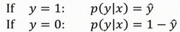

這兩個條件機率公式定義形式為 $p(y|x)$並且代表了 $y=0$ 或者 $y=1$ 這兩種情況，我們可以將這兩個公式合併成一個公式。需要指出的是我們討論的是二分類問題的損失函數，因此，$y$的取值只能是0或者1。上述的兩個條件機率公式可以合併成如下公式：

$p(y|x)={\hat{y}}^{y}{(1-\hat{y})}^{(1-y)}$

接下來我會解釋為什麼可以合併成這種形式的表達式：$(1-\hat{y})$的$(1-y)$次方這行表達式包含了上面的兩個條件機率公式，我來解釋一下為什麼。


第一種情況，假設 $y=1$，由於$y=1$，那麼${(\hat{y})}^{y}=\hat{y}$，因為 $\hat{y}$的1次方等於$\hat{y}$，$1-{(1-\hat{y})}^{(1-y)}$的指數項$(1-y)$等於0，由於任何數的0次方都是1，$\hat{y}$乘以1等於$\hat{y}$。因此當$y=1$時 $p(y|x)=\hat{y}$（圖中綠色部分）。

第二種情況，當 $y=0$ 時 $p(y|x)$ 等於多少呢?
假設$y=0$，$\hat{y}$的$y$次方就是 $$\hat{y}$$ 的0次方，任何數的0次方都等於1，因此 $p(y|x)=1×{(1-\hat{y})}^{1-y}$ ，前面假設 $y=0$ 因此$(1-y)$就等於1，因此 $p(y|x)=1×(1-\hat{y})$。因此在這裡當$y=0$時，$p(y|x)=1-\hat{y}$。這就是這個公式(第二個公式，圖中紫色字體部分)的結果。

因此，剛才的推導表明 $p(y|x)={\hat{y}}^{(y)}{(1-\hat{y})}^{(1-y)}$，就是 $p(y|x)$ 的完整定義。由於 log 函數是嚴格單調遞增的函數，最大化 $log(p(y|x))$ 等價於最大化 $p(y|x)$ 並且地計算 $p(y|x)$ 的 log對數，就是計算 $log({\hat{y}}^{(y)}{(1-\hat{y})}^{(1-y)})$ (其實就是將 $p(y|x)$ 代入)，通過對數函數化簡為：

$ylog\hat{y}+(1-y)log(1-\hat{y})$

而這就是我們前面提到的損失函數的負數 $(-L(\hat{y},y))$ ，前面有一個負號的原因是當你訓練學習算法時需要算法輸出值的機率是最大的（以最大的機率預測這個值），然而在邏輯回歸中我們需要最小化損失函數，因此最小化損失函數與最大化條件機率的對數 $log(p(y|x))$ 關聯起來了，因此這就是單個訓練樣本的損失函數表達式。


在 $m$個訓練樣本的整個訓練集中又該如何表示呢，讓我們一起來探討一下。

讓我們一起來探討一下，整個訓練集中標籤的機率，更正式地來寫一下。假設所有的訓練樣本服從同一分布且相互獨立，也即獨立同分布的，所有這些樣本的聯合機率就是每個樣本機率的乘積:

$P\left(\text{labels  in training set} \right) = \prod_{i =1}^{m}{P(y^{(i)}|x^{(i)})}$。


如果你想做最大似然估計，需要尋找一組參數，使得給定樣本的觀測值機率最大，但令這個機率最大化等價於令其對數最大化，在等式兩邊取對數：

$logp\left( \text{labels  in  training set} \right) = log\prod_{i =1}^{m}{P(y^{(i)}|x^{(i)})} = \sum_{i = 1}^{m}{logP(y^{(i)}|x^{(i)})} = \sum_{i =1}^{m}{- L(\hat y^{(i)},y^{(i)})}$

在統計學裡面，有一個方法叫做最大似然估計，即求出一組參數，使這個式子取最大值，也就是說，使得這個式子取最大值，$\sum_{i= 1}^{m}{- L(\hat y^{(i)},y^{(i)})}$，可以將負號移到求和符號的外面，$- \sum_{i =1}^{m}{L(\hat y^{(i)},y^{(i)})}$，這樣我們就推導出了前面給出的**logistic**回歸的成本函數$J(w,b)= \sum_{i = 1}^{m}{L(\hat y^{(i)},y^{\hat( i)})}$。


由於訓練模型時，目標是讓成本函數最小化，所以我們不是直接用最大似然機率，要去掉這裡的負號，最後為了方便，可以對成本函數進行適當的縮放，我們就在前面加一個額外的常數因子$\frac{1}{m}$，即:$J(w,b)= \frac{1}{m}\sum_{i = 1}^{m}{L(\hat y^{(i)},y^{(i)})}$。

總結一下，為了最小化成本函數$J(w,b)$，我們從**logistic**回歸模型的最大似然估計的角度出發，假設訓練集中的樣本都是獨立同分布的條件下。儘管這節課是選修性質的，但還是感謝觀看本節影片。我希望通過本節課您能更好地明白邏輯回歸的損失函數，為什麼是那種形式，明白了損失函數的原理，希望您能繼續完成課後的練習，前面課程的練習以及本週的測驗，在課後的小測驗和編程練習中，祝您好運。


