第三週：淺層神經網路(Shallow neural networks)
---------------------------------------------
[TOC]
### 3.1 神經網路概述（Neural Network Overview）

本週你將學習如何實現一個神經網路。在我們深入學習具體技術之前，我希望快速的帶你預覽一下本週你將會學到的東西。如果這個影片中的某些細節你沒有看懂你也不用擔心，我們將在後面的幾個影片中深入討論技術細節。

現在我們開始快速瀏覽一下如何實現神經網路。上週我們討論了邏輯回歸，我們了解了這個模型(見圖3.1.1)如何與下面公式3.1建立聯繫。
圖3.1.1 :
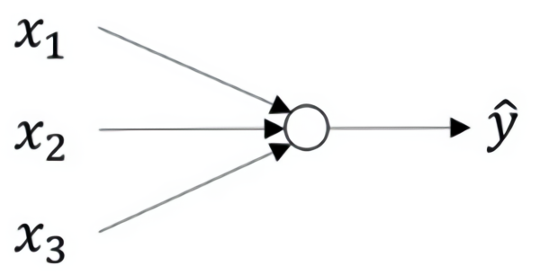

公式3.1：
$$
\left.
	\begin{array}{l}
	x\\
	w\\
	b
	\end{array}
	\right\}
	\implies{z={w}^Tx+b}
$$

如上所示，首先你需要輸入特徵$x​$，參數$w​$和$b​$，通過這些你就可以計算出$z​$，公式3.2：
$$
\left.
	\begin{array}{l}
	x\\
	w\\
	b
	\end{array}
	\right\}
	\implies{z={w}^Tx+b}
	\implies{a = \sigma(z)}\\ 
	\implies{{L}(a,y)}
$$

接下來使用$z$就可以計算出$a$。我們將的符號換為表示輸出$\hat{y}\implies{a = \sigma(z)}$,然後可以計算出**loss function** $L(a,y)$

神經網路看起來是如下這個樣子（圖3.1.2）。正如我之前已經提到過，你可以把許多**sigmoid**單元堆疊起來形成一個神經網路。對於圖3.1.1中的節點，它包含了之前講的計算的兩個步驟：首先通過公式3.1計算出值$z$，然後通過$\sigma(z)$計算值$a$。

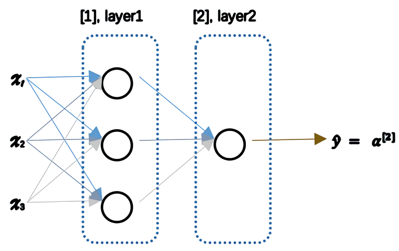

圖3.1.2

在這個神經網路（圖3.1.2）對應的3個節點，首先計算第一層網路中的各個節點相關的數$z^{[1]}$，接著計算$\alpha^{[1]}$，在計算下一層網路同理；
我們會使用符號$^{[m]}$表示第$m$層網路中節點相關的數，這些節點的集合被稱為第$m$層網路。這樣可以保證$^{[m]}$不會和我們之前用來表示單個的訓練樣本的$^{(i)}$(即我們使用表示第$i$個訓練樣本)混淆；
整個計算過程，公式如下:
公式3.3：
$$
\left.
	\begin{array}{r}
	{x }\\
	{W^{[1]}}\\
	{b^{[1]}}
	\end{array}
	\right\}
	\implies{z^{[1]}=W^{[1]}x+b^{[1]}}
	\implies{a^{[1]} = \sigma(z^{[1]})}
$$
公式3.4：
$$
\left.
	\begin{array}{r}
	\text{$a^{[1]} = \sigma(z^{[1]})$}\\
	\text{$W^{[2]}$}\\
	\text{$b^{[2]}$}\\
	\end{array}
	\right\}
	\implies{z^{[2]}=W^{[2]}a^{[1]}+b^{[2]}}
	\implies{a^{[2]} = \sigma(z^{[2]})}\\ 
	\implies{{L}\left(a^{[2]},y \right)}
$$

類似邏輯回歸，在計算後需要使用計算，接下來你需要使用另外一個線性方程對應的參數計算$z^{[2]}$，
計算$a^{[2]}$，此時$a^{[2]}$就是整個神經網路最終的輸出，用 $\hat{y}​$表示網路的輸出。

公式3.5：
$$
\left.
	\begin{array}{r}
	{da^{[1]} = {d}\sigma(z^{[1]})}\\
	{dW^{[2]}}\\
	{db^{[2]}}\\
	\end{array}
	\right\}
	\impliedby{{dz}^{[2]}={d}(W^{[2]}\alpha^{[1]}+b^{[2]}})
	\impliedby{{{da}^{[2]}} = {d}\sigma(z^{[2]})}\\
	\impliedby{{dL}\left(a^{[2]},y \right)}
$$

我知道這其中有很多細節，其中有一點非常難以理解，即在邏輯回歸中，通過直接計算$z$得到結果$a$。而這個神經網路中，我們反覆的計算$z$和$a$，計算$a$和$z$，最後得到了最終的輸出**loss function**。

你應該記得邏輯回歸中，有一些從後向前的計算用來計算導數$da$、$dz$。同樣，在神經網路中我們也有從後向前的計算，看起來就像這樣，最後會計算$da^{[2]}$ 、$dz^{[2]}$，計算出來之後，然後計算計算$dW^{[2]}$、$db^{[2]}$ 等，按公式3.4、3.5箭頭表示的那樣，從右到左反向計算。

現在你大概了解了一下什麼是神經網路，基於邏輯回歸重複使用了兩次該模型得到上述例子的神經網路。我清楚這裡面多了很多新符號和細節，如果沒有理解也不用擔心，在接下來的影片中我們會仔細討論具體細節。

那麼，下一個影片講述神經網路的表示。

### 3.2 神經網路的表示（Neural Network Representation）

先回顧一下我在上一個影片畫幾張神經網路的圖片，在這次課中我們將討論這些圖片的具體含義，也就是我們畫的這些神經網路到底代表什麼。

我們首先關注一個例子，本例中的神經網路只包含一個隱藏層（圖3.2.1）。這是一張神經網路的圖片，讓我們給此圖的不同部分取一些名字。

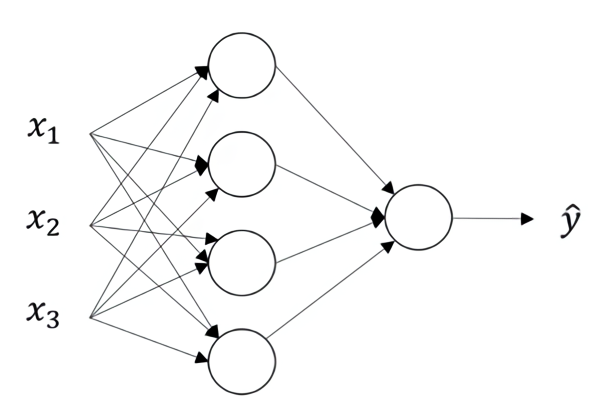

圖3.2.1

我們有輸入特徵$x_1$、$x_2$、$x_3$，它們被豎直地堆疊起來，這叫做神經網路的**輸入層**。它包含了神經網路的輸入；然後這裡有另外一層我們稱之為**隱藏層**（圖3.2.1的四個結點）。待會我會回過頭來講解術語"隱藏"的意義；在本例中最後一層只由一個結點構成，而這個只有一個結點的層被稱為**輸出層**，它負責產生預測值。解釋隱藏層的含義：在一個神經網路中，當你使用監督學習訓練它的時候，訓練集包含了輸入$x$也包含了目標輸出$y$，所以術語隱藏層的含義是在訓練集中，這些中間結點的準確值我們是不知道到的，也就是說你看不見它們在訓練集中應具有的值。你能看見輸入的值，你也能看見輸出的值，但是隱藏層中的東西，在訓練集中你是無法看到的。所以這也解釋了詞語隱藏層，只是表示你無法在訓練集中看到他們。

現在我們再引入幾個符號，就像我們之前用向量$x$表示輸入特徵。這裡有個可代替的記號$a^{[0]}$可以用來表示輸入特徵。$a$表示啟動的意思，它意味著網路中不同層的值會傳遞到它們後面的層中，輸入層將$x$傳遞給隱藏層，所以我們將輸入層的啟動值稱為$a^{[0]}$；下一層即隱藏層也同樣會產生一些啟動值，那麼我將其記作$a^{[1]}$，所以具體地，這裡的第一個單元或結點我們將其表示為$a^{[1]}_{1}$，第二個結點的值我們記為$a^{[1]}_{2}$以此類推。所以這裡的是一個四維的向量如果寫成**Python**代碼，那麼它是一個規模為4x1的矩陣或一個大小為4的列向量，如下公式，它是四維的，因為在本例中，我們有四個結點或者單元，或者稱為四個隱藏層單元；
公式3.7
$$
a^{[1]} =
	\left[
		\begin{array}{ccc}
		a^{[1]}_{1}\\
		a^{[1]}_{2}\\
		a^{[1]}_{3}\\
		a^{[1]}_{4}
		\end{array}
		\right]
$$

最後輸出層將產生某個數值$a$，它只是一個單獨的實數，所以的$\hat{y}$值將取為$a^{[2]}$。這與邏輯回歸很相似，在邏輯回歸中，我們有$\hat{y}$直接等於$a$，在邏輯回歸中我們只有一個輸出層，所以我們沒有用帶方括號的上標。但是在神經網路中，我們將使用這種帶上標的形式來明確地指出這些值來自於哪一層，有趣的是在約定俗成的符號傳統中，在這裡你所看到的這個例子，只能叫做一個兩層的神經網路（圖3.2.2）。原因是當我們計算網路的層數時，輸入層是不算入總層數內，所以隱藏層是第一層，輸出層是第二層。第二個慣例是我們將輸入層稱為第零層，所以在技術上，這仍然是一個三層的神經網路，因為這裡有輸入層、隱藏層，還有輸出層。但是在傳統的符號使用中，如果你閱讀研究論文或者在這門課中，你會看到人們將這個神經網路稱為一個兩層的神經網路，因為我們不將輸入層看作一個標準的層。

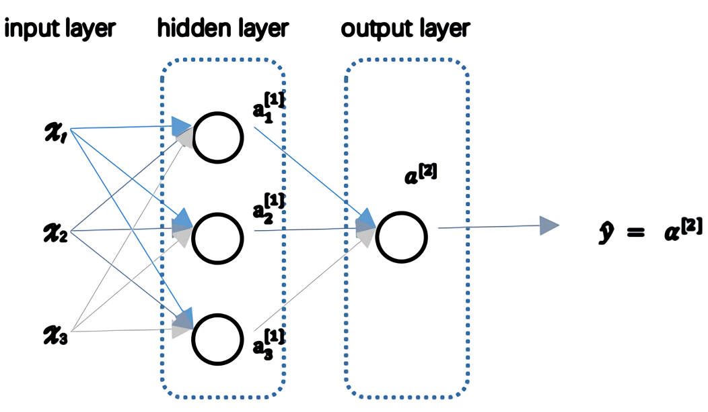
圖3.2.2

最後，我們要看到的隱藏層以及最後的輸出層是帶有參數的，這裡的隱藏層將擁有兩個參數$W$和$b$，我將給它們加上上標$^{[1]}$($W^{[1]}$,$b^{[1]}$)，表示這些參數是和第一層這個隱藏層有關係的。之後在這個例子中我們會看到$W$是一個4x3的矩陣，而$b$是一個4x1的向量，第一個數字4源自於我們有四個結點或隱藏層單元，然後數字3源自於這裡有三個輸入特徵，我們之後會更加詳細地討論這些矩陣的維數，到那時你可能就更加清楚了。相似的輸出層也有一些與之關聯的參數$W^{[2]}$以及$b^{[2]}$。從維數上來看，它們的規模分別是1x4以及1x1。1x4是因為隱藏層有四個隱藏層單元而輸出層只有一個單元，之後我們會對這些矩陣和向量的維度做出更加深入的解釋，所以現在你已經知道一個兩層的神經網路什麼樣的了，即它是一個只有一個隱藏層的神經網路。

在下一個影片中。我們將更深入地了解這個神經網路是如何進行計算的，也就是這個神經網路是怎麼輸入$x$，然後又是怎麼得到$\hat{y}$。

### 3.3 計算一個神經網路的輸出（Computing a Neural Network's output）

在上一節的影片中，我們介紹只有一個隱藏層的神經網路的結構與符號表示。在這節的影片中讓我們了解神經網路的輸出究竟是如何計算出來的。

首先，回顧下只有一個隱藏層的簡單兩層**神經網路結構**：

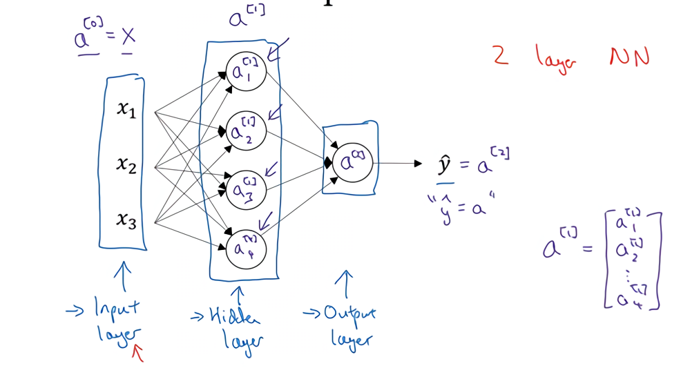
圖3.3.1

其中，$x$表示輸入特徵，$a$表示每個神經元的輸出，$W$表示特徵的權重，上標表示神經網路的層數（隱藏層為1），下標表示該層的第幾個神經元。這是神經網路的**符號慣例**，下同。

**神經網路的計算**

關於神經網路是怎麼計算的，從我們之前提及的邏輯回歸開始，如下圖所示。用圓圈表示神經網路的計算單元，邏輯回歸的計算有兩個步驟，首先你按步驟計算出$z$，然後在第二步中你以**sigmoid**函數為啟動函數計算$z$（得出$a$），一個神經網路只是這樣子做了好多次重複計算。

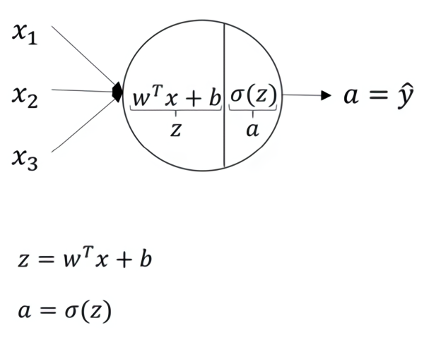
圖3.3.2

回到兩層的神經網路，我們從隱藏層的第一個神經元開始計算，如上圖第一個最上面的箭頭所指。從上圖可以看出，輸入與邏輯回歸相似，這個神經元的計算與邏輯回歸一樣分為兩步，小圓圈代表了計算的兩個步驟。

第一步，計算$z^{[1]}_1,z^{[1]}_1 = w^{[1]T}_1x + b^{[1]}_1$。

第二步，通過啟動函數計算$a^{[1]}_1,a^{[1]}_1 = \sigma(z^{[1]}_1)$。

隱藏層的第二個以及後面兩個神經元的計算過程一樣，只是注意符號表示不同，最終分別得到$a^{[1]}_2、a^{[1]}_3、a^{[1]}_4$，詳細結果見下:

$z^{[1]}_1 = w^{[1]T}_1x + b^{[1]}_1, a^{[1]}_1 = \sigma(z^{[1]}_1)$

$z^{[1]}_2 = w^{[1]T}_2x + b^{[1]}_2, a^{[1]}_2 = \sigma(z^{[1]}_2)$

$z^{[1]}_3 = w^{[1]T}_3x + b^{[1]}_3, a^{[1]}_3 = \sigma(z^{[1]}_3)$

$z^{[1]}_4 = w^{[1]T}_4x + b^{[1]}_4, a^{[1]}_4 = \sigma(z^{[1]}_4)$

**向量化計算**
如果你執行神經網路的程序，用for循環來做這些看起來真的很低效。所以接下來我們要做的就是把這四個等式向量化。向量化的過程是將神經網路中的一層神經元參數縱向堆積起來，例如隱藏層中的$w$縱向堆積起來變成一個$(4,3)$的矩陣，用符號$W^{[1]}$表示。另一個看待這個的方法是我們有四個邏輯回歸單元，且每一個邏輯回歸單元都有相對應的參數——向量$w$，把這四個向量堆積在一起，你會得出這4×3的矩陣。
因此，
公式3.8：
$z^{[n]} = w^{[n]}x + b^{[n]}$		

公式3.9：

$a^{[n]}=\sigma(z^{[n]})$								

詳細過程見下:
公式3.10：
$$
a^{[1]} =
	\left[
		\begin{array}{c}
		a^{[1]}_{1}\\
		a^{[1]}_{2}\\
		a^{[1]}_{3}\\
		a^{[1]}_{4}
		\end{array}
		\right]
		= \sigma(z^{[1]})
$$
公式3.11：
$$
\left[
		\begin{array}{c}
		z^{[1]}_{1}\\
		z^{[1]}_{2}\\
		z^{[1]}_{3}\\
		z^{[1]}_{4}\\
		\end{array}
		\right]
		 =
	\overbrace{
	\left[
		\begin{array}{c}
		...W^{[1]T}_{1}...\\
		...W^{[1]T}_{2}...\\
		...W^{[1]T}_{3}...\\
		...W^{[1]T}_{4}...
		\end{array}
		\right]
		}^{W^{[1]}}
		*
	\overbrace{
	\left[
		\begin{array}{c}
		x_1\\
		x_2\\
		x_3\\
		\end{array}
		\right]
		}^{input}
		+
	\overbrace{
	\left[
		\begin{array}{c}
		b^{[1]}_1\\
		b^{[1]}_2\\
		b^{[1]}_3\\
		b^{[1]}_4\\
		\end{array}
		\right]
		}^{b^{[1]}}
$$

對於神經網路的第一層，給予一個輸入$x$，得到$a^{[1]}$，$x$可以表示為$a^{[0]}$。通過相似的衍生你會發現，後一層的表示同樣可以寫成類似的形式，得到$a^{[2]}$，$\hat{y} = a^{[2]}$，具體過程見公式3.8、3.9。

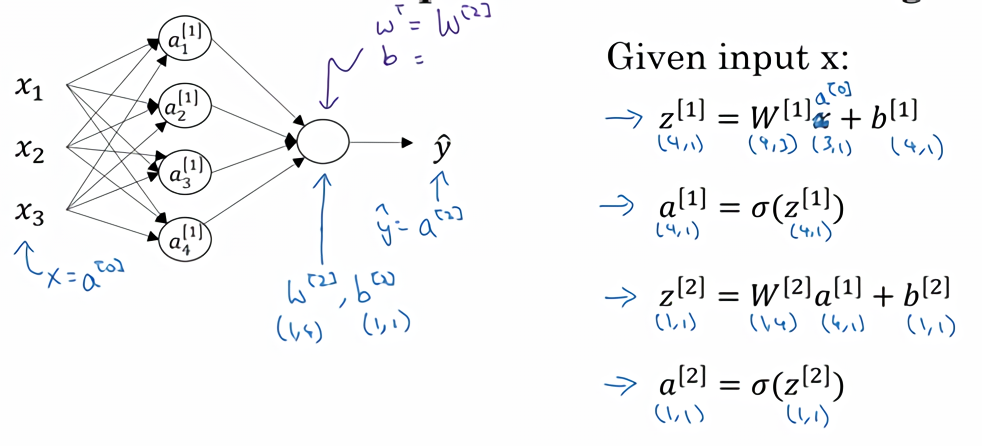
圖3.3.3

如上圖左半部分所示為神經網路，把網路左邊部分蓋住先忽略，那麼最後的輸出單元就相當於一個邏輯回歸的計算單元。當你有一個包含一層隱藏層的神經網路，你需要去實現以計算得到輸出的是右邊的四個等式，並且可以看成是一個向量化的計算過程，計算出隱藏層的四個邏輯回歸單元和整個隱藏層的輸出結果，如果編程實現需要的也只是這四行程式碼。

**總結**
通過本影片，你能夠根據給出的一個單獨的輸入特徵向量，運用四行程式碼計算出一個簡單神經網路的輸出。接下來你將了解的是如何一次能夠計算出不止一個樣本的神經網路輸出，而是能一次性計算整個訓練集的輸出。

### 3.4 多樣本向量化（Vectorizing across multiple examples）

在上一個影片，了解到如何針對於單一的訓練樣本，在神經網路上計算出預測值。

在這個影片，將會了解到如何向量化多個訓練樣本，並計算出結果。該過程與你在邏輯回歸中所做類似。

邏輯回歸是將各個訓練樣本組合成矩陣，對矩陣的各列進行計算。神經網路是通過對邏輯回歸中的等式簡單的變形，讓神經網路計算出輸出值。這種計算是所有的訓練樣本同時進行的，以下是實現它具體的步驟：

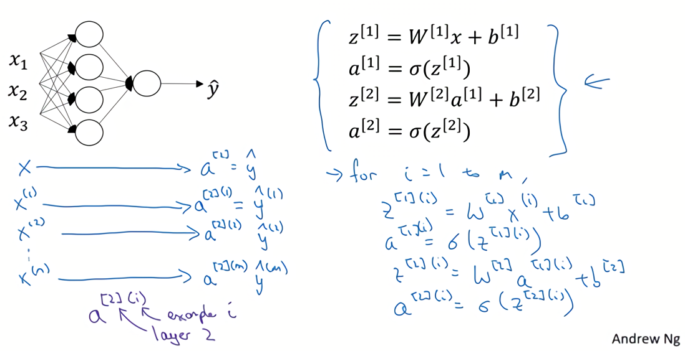
圖3.4.1

上一節影片中得到的四個等式。它們給出如何計算出$z^{[1]}$，$a^{[1]}$，$z^{[2]}$，$a^{[2]}$。

對於一個給定的輸入特徵向量$X$，這四個等式可以計算出$\alpha^{[2]}$等於$\hat{y}$。這是針對於單一的訓練樣本。如果有$m$個訓練樣本,那麼就需要重複這個過程。

用第一個訓練樣本$x^{[1]}$來計算出預測值$\hat{y}^{[1]}$，就是第一個訓練樣本上得出的結果。

然後，用$x^{[2]}$來計算出預測值$\hat{y}^{[2]}$，循環往復，直至用$x^{[m]}$計算出$\hat{y}^{[m]}$。

用啟動函數表示法，如上圖左下所示，它寫成$a^{[2](1)}$、$a^{[2](2)}$和$a^{[2](m)}$。

【註】：$a^{[2](i)}$，$(i)$是指第$i$個訓練樣本而$[2]$是指第二層。

如果有一個非向量化形式的實現，而且要計算出它的預測值，對於所有訓練樣本，需要讓$i$從1到$m$實現這四個等式：

$z^{[1](i)}=W^{[1](i)}x^{(i)}+b^{[1](i)}$

$a^{[1](i)}=\sigma(z^{[1](i)})$

$z^{[2](i)}=W^{[2](i)}a^{[1](i)}+b^{[2](i)}$

$a^{[2](i)}=\sigma(z^{[2](i)})$

對於上面的這個方程中的$^{(i)}$，是所有依賴於訓練樣本的變數，即將$(i)$添加到$x$，$z$和$a$。如果想計算$m$個訓練樣本上的所有輸出，就應該向量化整個計算，以簡化這列。

本課程需要使用很多線性代數的內容，重要的是能夠正確地實現這一點，尤其是在深度學習的錯誤中。實際上本課程認真地選擇了運算符號，這些符號只是針對於這個課程的，並且能使這些向量化容易一些。

所以，希望通過這個細節可以更快地正確實現這些算法。接下來講講如何向量化這些：
公式3.12：
$$
x =
	\left[
		\begin{array}{c}
		\vdots & \vdots & \vdots & \vdots\\
		x^{(1)} & x^{(2)} & \cdots & x^{(m)}\\
		\vdots & \vdots & \vdots & \vdots\\
		\end{array}
		\right]
$$
公式3.13：
$$
Z^{[1]} =
	\left[
		\begin{array}{c}
		\vdots & \vdots & \vdots & \vdots\\
		z^{[1](1)} & z^{[1](2)} & \cdots & z^{[1](m)}\\
		\vdots & \vdots & \vdots & \vdots\\
		\end{array}
		\right]
$$
公式3.14：
$$
A^{[1]} =
	\left[
		\begin{array}{c}
		\vdots & \vdots & \vdots & \vdots\\
		\alpha^{[1](1)} & \alpha^{[1](2)} & \cdots & \alpha^{[1](m)}\\
		\vdots & \vdots & \vdots & \vdots\\
		\end{array}
		\right]
$$
公式3.15：
$$
\left.
		\begin{array}{r}
		\text{$z^{[1](i)} = W^{[1](i)}x^{(i)} + b^{[1]}$}\\
		\text{$\alpha^{[1](i)} = \sigma(z^{[1](i)})$}\\
		\text{$z^{[2](i)} = W^{[2](i)}\alpha^{[1](i)} + b^{[2]}$}\\
		\text{$\alpha^{[2](i)} = \sigma(z^{[2](i)})$}\\
		\end{array}
		\right\}
		\implies
		\begin{cases}
		\text{$A^{[1]} = \sigma(z^{[1]})$}\\
		\text{$z^{[2]} = W^{[2]}A^{[1]} + b^{[2]}$}\\ 
		\text{$A^{[2]} = \sigma(z^{[2]})$}\\ 
		\end{cases}
$$

前一張幻燈片中的**for**循環是來遍歷所有個訓練樣本。
定義矩陣$X$等於訓練樣本，將它們組合成矩陣的各列，形成一個$n$維或$n$乘以$m$維矩陣。接下來計算見公式3.15：

以此類推，從小寫的向量$x$到這個大寫的矩陣$X$，只是通過組合$x$向量在矩陣的各列中。

同理，$z^{[1](1)}$，$z^{[1](2)}$等等都是$z^{[1](m)}$的列向量，將所有$m$都組合在各列中，就的到矩陣$Z^{[1]}$。

同理，$a^{[1](1)}$，$a^{[1](2)}$，……，$a^{[1](m)}$將其組合在矩陣各列中，如同從向量$x$到矩陣$X$，以及從向量$z$到矩陣$Z$一樣，就能得到矩陣$A^{[1]}$。

同樣的，對於$Z^{[2]}$和$A^{[2]}$，也是這樣得到。

這種符號其中一個作用就是，可以透過訓練樣本來進行索引。這就是水平索引對應於不同的訓練樣本的原因，這些訓練樣本是從左到右掃描訓練集而得到的。

在垂直方向，這個垂直索引對應於神經網路中的不同節點。例如，這個節點，該值位於矩陣的最左上角對應於啟動單元，它是位於第一個訓練樣本上的第一個隱藏單元。它的下一個值對應於第二個隱藏單元的啟動值。它是位於第一個訓練樣本上的，以及第一個訓練範例中第三個隱藏單元，等等。

當垂直掃描，是索引到隱藏單位的數字。當水平掃描，將從第一個訓練範例中從第一個隱藏的單元到第二個訓練樣本，第三個訓練樣本……直到節點對應於第一個隱藏單元的啟動值，且這個隱藏單元是位於這$m$個訓練樣本中的最終訓練樣本。

從水平上看，矩陣$A​$代表了各個訓練樣本。從豎直上看，矩陣$A​$的不同的索引對應於不同的隱藏單元。

對於矩陣$Z，X$情況也類似，水平方向上，對應於不同的訓練樣本；豎直方向上，對應不同的輸入特徵，而這就是神經網路輸入層中各個節點。

神經網路上透過在多樣本情況下的向量化來使用這些等式。

在下一個影片中，將證明為什麼這是一種正確向量化的實現。這種證明將會與邏輯回歸中的證明類似。

### 3.5 向量化實現的解釋（Justification for vectorized implementation）

在上一個影片中，我們學習到如何將多個訓練樣本橫向堆疊成一個矩陣$X$，然後就可以推導出神經網路中前向傳播（**forward propagation**）部分的向量化實現。

在這個影片中，我們將會繼續了解到，為什麼上一節中寫下的公式就是將多個樣本向量化的正確實現。

我們先手動對幾個樣本計算一下前向傳播，看看有什麼規律：
公式3.16：
$z^{[1](1)} = W^{[1]}x^{(1)} + b^{[1]}$

$z^{[1](2)} = W^{[1]}x^{(2)} + b^{[1]}$

$z^{[1](3)} = W^{[1]}x^{(3)} + b^{[1]}$

這裡，為了描述的簡便，我們先忽略掉 $b^{[1]}$後面你將會看到利用**Python** 的廣播機制，可以很容易的將$b^{[1]}$ 加進來。

現在 $W^{[1]}$ 是一個矩陣，$x^{(1)},x^{(2)},x^{(3)}$都是列向量，矩陣乘以列向量得到列向量，下面將它們用圖形直觀的表示出來:
公式3.17：
$$
W^{[1]}  x =
		\left[
		\begin{array}{ccc}
		\cdots \\
		\cdots \\
		\cdots \\
		\end{array}
		\right]
		
		\left[
		\begin{array}{c}
		\vdots &\vdots & \vdots & \vdots \\
		x^{(1)} & x^{(2)} & x^{(3)} & \vdots\\
		\vdots &\vdots & \vdots & \vdots \\
		\end{array}
		\right]
		=
		\left[
		\begin{array}{c}
		\vdots &\vdots & \vdots & \vdots \\
		w^{(1)}x^{(1)} & w^{(1)}x^{(2)} & w^{(1)}x^{(3)} & \vdots\\
		\vdots &\vdots & \vdots & \vdots \\
		\end{array}
		\right]
		=\\
		\left[
		\begin{array}{c}
		\vdots &\vdots & \vdots & \vdots \\
		z^{[1](1)} & z^{[1](2)} & z^{[1](3)} & \vdots\\
		\vdots &\vdots & \vdots & \vdots \\
		\end{array}
		\right]
		=
		Z^{[1]}
$$

影片中，吳恩達老師很細心的用不同的顏色表示不同的樣本向量，及其對應的輸出。所以從圖中可以看出，當加入更多樣本時，只需向矩陣$X$中加入更多列。

所以從這裡我們也可以了解到，為什麼之前我們對單個樣本的計算要寫成
$z^{[1](i)} = W^{[1]}x^{(i)} + b^{[1]}$
這種形式，因為當有不同的訓練樣本時，將它們堆到矩陣$X$的各列中，那麼它們的輸出也就會相應的堆疊到矩陣 $Z^{[1]}$ 的各列中。現在我們就可以直接計算矩陣 $Z^{[1]}$ 加上$b^{[1]}$，因為列向量 $b^{[1]}$ 和矩陣 $Z^{[1]}$的列向量有著相同的尺寸，而**Python**的廣播機制對於這種矩陣與向量直接相加的處理方式是，將向量與矩陣的每一列相加。
所以這一節只是說明了為什麼公式 $Z^{[1]} =W^{[1]}X + \ b^{[1]}$是前向傳播的第一步計算的正確向量化實現，但事實證明，類似的分析可以發現，前向傳播的其它步也可以使用非常相似的邏輯，即如果將輸入按列向量橫向堆疊進矩陣，那麼通過公式計算之後，也能得到成列堆疊的輸出。

最後，對這一段影片的內容做一個總結:

由公式3.12、公式3.13、公式3.14、公式3.15可以看出，使用向量化的方法，可以不需要顯示循環，而直接通過矩陣運算從$X​$就可以計算出 $A^{[1]}​$，實際上$X$可以記為 $A^{[0]}$，使用同樣的方法就可以由神經網路中的每一層的輸入 $A^{[i-1]}​$ 計算輸出 $A^{[i]}$。其實這些方程有一定對稱性，其中第一個方程也可以寫成$Z^{[1]} = W^{[1]}A^{[0]} + b^{[1]}$，你看這對方程，還有這對方程形式其實很類似，只不過這裡所有指標加了1。所以這樣就顯示出神經網路的不同層次，你知道大概每一步做的都是一樣的，或者只不過同樣的計算不斷重複而已。這裡我們有一個雙層神經網路，我們在下週影片裡會講深得多的神經網路，你看到隨著網路的深度變大，基本上也還是重複這兩步運算，只不過是比這裡你看到的重複次數更多。在下週的影片中將會講解更深層次的神經網路，隨著層數的加深，基本上也還是重複同樣的運算。

以上就是對神經網路向量化實現的正確性的解釋，到目前為止，我們僅使用**sigmoid**函數作為啟動函數，事實上這並非最好的選擇，在下一個影片中，將會繼續深入的講解如何使用更多不同種類的啟動函數。

### 3.6 啟動函數（Activation functions）

使用一個神經網路時，需要決定使用哪種啟動函數用隱藏層上，哪種用在輸出節點上。到目前為止，之前的影片只用過**sigmoid**啟動函數，但是，有時其他的啟動函數效果會更好。

在神經網路的前向傳播中，的$a^{[1]} = \sigma(z^{[1]})$和$a^{[2]} =\sigma(z^{[2]})$這兩步會使用到**sigmoid**函數。**sigmoid**函數在這裡被稱為啟動函數。
公式3.18：
$a = \sigma(z) = \frac{1}{{1 + e}^{- z}}$

更通常的情況下，使用不同的函數$g( z^{[1]})$，$g$可以是除了**sigmoid**函數以外的非線性函數。**tanh**函數或者雙曲正切函數是總體上都優於**sigmoid**函數的啟動函數。

如圖，$a = tan(z)$的值域是位於+1和-1之間。
公式3.19：
$a= tanh(z) = \frac{e^{z} - e^{- z}}{e^{z} + e^{- z}}$

事實上，**tanh**函數是**sigmoid**的向下平移和伸縮後的結果。對它進行了變形後，穿過了$(0,0)$點，並且值域介於+1和-1之間。

結果表明，如果在隱藏層上使用函數
公式3.20：
$g(z^{[1]}) = tanh(z^{[1]}) $
效果總是優於**sigmoid**函數。因為函數值域在-1和+1的啟動函數，其均值是更接近零均值的。在訓練一個算法模型時，如果使用**tanh**函數代替**sigmoid**函數中心化數據，使得數據的平均值更接近0而不是0.5.

這會使下一層學習簡單一點，在第二門課中會詳細講解。

在討論最佳化算法時，有一點要說明：我基本已經不用**sigmoid**啟動函數了，**tanh**函數在所有場合都優於**sigmoid**函數。

但有一個例外：在二分類的問題中，對於輸出層，因為$y​$的值是0或1，所以想讓$\hat{y}​$的數值介於0和1之間，而不是在-1和+1之間。所以需要使用**sigmoid**啟動函數。這裡的
公式3.21：
$g(z^{[2]}) = \sigma(z^{[2]})​$
在這個例子裡看到的是，對隱藏層使用**tanh**啟動函數，輸出層使用**sigmoid**函數。

所以，在不同的神經網路層中，啟動函數可以不同。為了表示不同的啟動函數，在不同的層中，使用方括號上標來指出$g$上標為$[1]$的啟動函數，可能會跟$g$上標為$[2]$不同。方括號上標$[1]$代表隱藏層，方括號上標$[2]$表示輸出層。

**sigmoid**函數和**tanh**函數兩者共同的缺點是，在$z$特別大或者特別小的情況下，導數的梯度或者函數的斜率會變得特別小，最後就會接近於0，導致降低梯度下降的速度。

在機器學習另一個很流行的函數是：修正線性單元的函數（**ReLu**），**ReLu**函數圖像是如下圖。
公式3.22：
$ a =max( 0,z) $
所以，只要$z$是正值的情況下，導數恆等於1，當$z$是負值的時候，導數恆等於0。從實際上來說，當使用$z$的導數時，$z$=0的導數是沒有定義的。但是當編程實現的時候，$z$的取值剛好等於0.00000001，這個值相當小，所以，在實踐中，不需要擔心這個值，$z$是等於0的時候，假設一個導數是1或者0效果都可以。

這有一些選擇啟動函數的經驗法則：

如果輸出是0、1值（二分類問題），則輸出層選擇**sigmoid**函數，然後其它的所有單元都選擇**Relu**函數。

這是很多啟動函數的預設選擇，如果在隱藏層上不確定使用哪個啟動函數，那麼通常會使用**Relu**啟動函數。有時，也會使用**tanh**啟動函數，但**Relu**的一個優點是：當$z$是負值的時候，導數等於0。

這裡也有另一個版本的**Relu**被稱為**Leaky Relu**。

當$z$是負值時，這個函數的值不是等於0，而是輕微的傾斜，如圖。

這個函數通常比**Relu**啟動函數效果要好，儘管在實際中**Leaky ReLu**使用的並不多。

圖3.6.1

兩者的優點是：

第一，在$z​$的區間變動很大的情況下，啟動函數的導數或者啟動函數的斜率都會遠大於0，在程序實現就是一個**if-else**語句，而**sigmoid**函數需要進行浮點四則運算，在實踐中，使用**ReLu**啟動函數神經網路通常會比使用**sigmoid**或者**tanh**啟動函數學習的更快。

第二，**sigmoid**和**tanh**函數的導數在正負飽和區的梯度都會接近於0，這會造成梯度彌散，而**Relu**和**Leaky ReLu**函數大於0部分都為常數，不會產生梯度彌散現象。(同時應該注意到的是，**Relu**進入負半區的時候，梯度為0，神經元此時不會訓練，產生所謂的稀疏性，而**Leaky ReLu**不會有這問題)

$z$在**ReLu**的梯度一半都是0，但是，有足夠的隱藏層使得z值大於0，所以對大多數的訓練數據來說學習過程仍然可以很快。

快速概括一下不同啟動函數的過程和結論。

**sigmoid**啟動函數：除了輸出層是一個二分類問題基本不會用它。

**tanh**啟動函數：**tanh**是非常優秀的，幾乎適合所有場合。

**ReLu**啟動函數：最常用的默認函數，，如果不確定用哪個啟動函數，就使用**ReLu**或者**Leaky ReLu**。公式3.23：
$a = max( 0.01z,z)$
為什麼常數是0.01？當然，可以為學習算法選擇不同的參數。

在選擇自己神經網路的啟動函數時，有一定的直觀感受，在深度學習中的經常遇到一個問題：在編寫神經網路的時候，會有很多選擇：隱藏層單元的個數、啟動函數的選擇、初始化權值……這些選擇想得到一個對比較好的指導原則是挺困難的。

鑑於以上三個原因，以及在工業界的見聞，提供一種直觀的感受，哪一種工業界用的多，哪一種用的少。但是，自己的神經網路的應用，以及其特殊性，是很難提前知道選擇哪些效果更好。所以通常的建議是：如果不確定哪一個啟動函數效果更好，可以把它們都試試，然後在驗證集或者發展集上進行評價。然後看哪一種表現的更好，就去使用它。

為自己的神經網路的應用測試這些不同的選擇，會在以後檢驗自己的神經網路或者評估算法的時候，看到不同的效果。如果僅僅遵守使用預設的**ReLu**啟動函數，而不要用其他的激勵函數，那就可能在近期或者往後，每次解決問題的時候都使用相同的辦法。

### 3.7 為什麼需要非線性啟動函數？（why need a nonlinear activation function?）

為什麼神經網路需要非線性啟動函數？事實證明：要讓你的神經網路能夠計算出有趣的函數，你必須使用非線性啟動函數，證明如下：

這是神經網路正向傳播的方程，現在我們去掉函數$g$，然後令$a^{[1]} = z^{[1]}$，或者我們也可以令$g(z)=z$，這個有時被叫做線性啟動函數（更學術點的名字是恆等激勵函數，因為它們就是把輸入值輸出）。為了說明問題我們把$a^{[2]} = z^{[2]}$，那麼這個模型的輸出$y$或僅僅只是輸入特徵$x$的線性組合。

如果我們改變前面的式子，令：
(1) $a^{[1]} = z^{[1]} = W^{[1]}x + b^{[1]}$

(2) $a^{[2]} = z^{[2]} = W^{[2]}a^{[1]}+ b^{[2]}$
將式子(1)代入式子(2)中，則：
$a^{[2]} = z^{[2]} = W^{[2]}(W^{[1]}x + b^{[1]}) + b^{[2]}$

(3) $a^{[2]} = z^{[2]} = W^{[2]}W^{[1]}x + W^{[2]}b^{[1]} + b^{[2]} $
簡化多項式得
$a^{[2]} = z^{[2]} = W^{'}x + b^{'} $
如果你是用線性啟動函數或者叫恆等激勵函數，那麼神經網路只是把輸入線性組合再輸出。

我們稍後會談到深度網路，有很多層的神經網路，很多隱藏層。事實證明，如果你使用線性啟動函數或者沒有使用一個啟動函數，那麼無論你的神經網路有多少層一直在做的只是計算線性函數，所以不如直接去掉全部隱藏層。在我們的簡明案例中，事實證明如果你在隱藏層用線性啟動函數，在輸出層用**sigmoid**函數，那麼這個模型的複雜度和沒有任何隱藏層的標準**Logistic**回歸是一樣的，如果你願意的話，可以證明一下。

在這裡線性隱層一點用也沒有，因為這兩個線性函數的組合本身就是線性函數，所以除非你引入非線性，否則你無法計算更有趣的函數，即使你的網路層數再多也不行；只有一個地方可以使用線性啟動函數------$g(z)=z$，就是你在做機器學習中的回歸問題。$y$ 是一個實數，舉個例子，比如你想預測房地產價格，$y$ 就不是二分類任務0或1，而是一個實數，從0到正無窮。如果$y$ 是個實數，那麼在輸出層用線性啟動函數也許可行，你的輸出也是一個實數，從負無窮到正無窮。

總而言之，不能在隱藏層用線性啟動函數，可以用**ReLU**或者**tanh**或者**leaky ReLU**或者其他的非線性啟動函數，唯一可以用線性啟動函數的通常就是輸出層；除了這種情況，會在隱層用線性函數的，除了一些特殊情況，比如與壓縮有關的，那方面在這裡將不深入討論。在這之外，在隱層使用線性啟動函數非常少見。因為房價都是非負數，所以我們也可以在輸出層使用**ReLU**函數這樣你的$\hat{y}$都大於等於0。

理解為什麼使用非線性啟動函數對於神經網路十分關鍵，接下來我們討論梯度下降，並在下一個影片中開始討論梯度下降的基礎——啟動函數的導數。

### 3.8 啟動函數的導數（Derivatives of activation functions）

在神經網路中使用反向傳播的時候，你真的需要計算啟動函數的斜率或者導數。針對以下四種啟動，求其導數如下：

1）**sigmoid activation function**

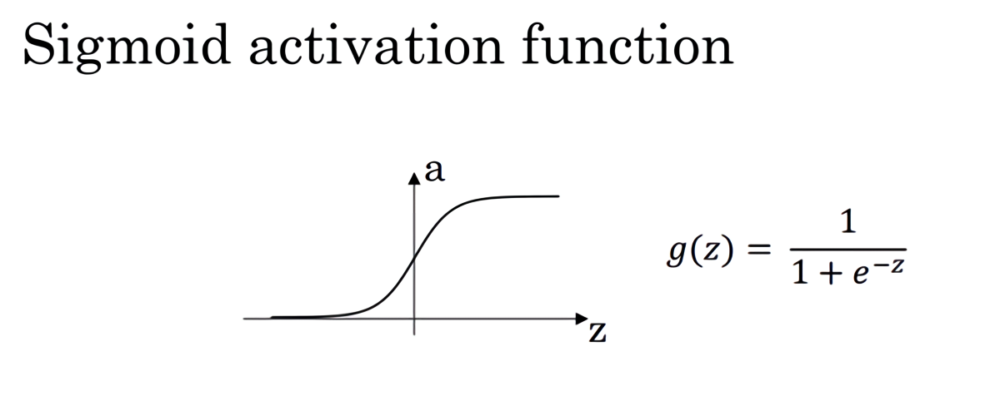
圖3.8.1

其具體的求導如下：
公式3.25：
$\frac{d}{dz}g(z) = {\frac{1}{1 + e^{-z}} (1-\frac{1}{1 + e^{-z}})}=g(z)(1-g(z))$

註：

當$z$ = 10或$z= -10$ ; $\frac{d}{dz}g(z)\approx0$

當$z $= 0 , $\frac{d}{dz}g(z)\text{=g(z)(1-g(z))=}{1}/{4}$

在神經網路中$a= g(z)$; $g{{(z)}^{'}}=\frac{d}{dz}g(z)=a(1-a)$

2) **Tanh activation function**

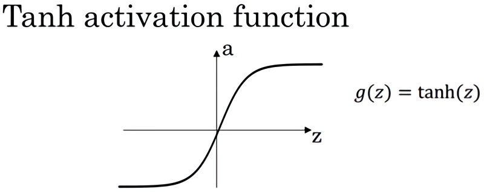
圖3.8.2

其具體的求導如下：
公式3.26：
$g(z) = tanh(z) = \frac{e^{z} - e^{-z}}{e^{z} + e^{-z}} $

公式3.27：
$\frac{d}{{d}z}g(z) = 1 - (tanh(z))^{2}$
註：

當$z$ = 10或$z= -10$  $\frac{d}{dz}g(z)\approx0$

當$z$ = 0,  $\frac{d}{dz}g(z)\text{=1-(0)=}1$

在神經網路中;

3）**Rectified Linear Unit (ReLU)**

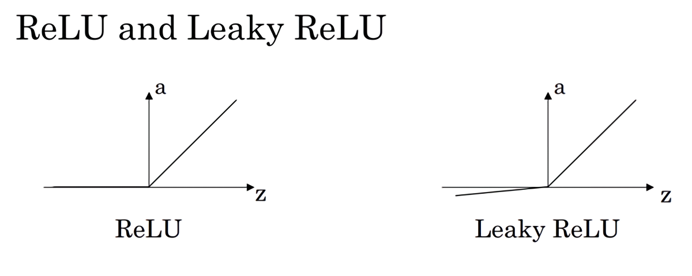
$g(z) =max (0,z)$

$$
g(z)^{'}=
  \begin{cases}
  0&	\text{if z < 0}\\
  1&	\text{if z > 0}\\
undefined&	\text{if z = 0}
\end{cases}
$$

註：通常在$z$= 0的時候給定其導數1,0；當然$z$=0的情況很少

4）**Leaky linear unit (Leaky ReLU)**

與**ReLU**類似
$$
g(z)=\max(0.01z,z) \\
	\\
	\\
g(z)^{'}=
\begin{cases}
0.01& 	\text{if z < 0}\\
1&	\text{if z > 0}\\
undefined&	\text{if z = 0}
\end{cases}
$$

註：通常在$z = 0$的時候給定其導數1,0.01；當然$z=0$的情況很少。

### 3.9 神經網路的梯度下降（Gradient descent for neural networks）

在這個影片中，我會給你實現反向傳播或者說梯度下降算法的方程組，在下一個影片我們會介紹為什麼這幾個特定的方程是針對你的神經網路實現梯度下降的正確方程。

你的單隱層神經網路會有$W^{[1]}$，$b^{[1]}$，$W^{[2]}$，$b^{[2]}$這些參數，還有個$n_x$表示輸入特徵的個數，$n^{[1]}$表示隱藏單元個數，$n^{[2]}$表示輸出單元個數。

在我們的例子中，我們只介紹過的這種情況，那麼參數:

矩陣$W^{[1]}$的維度就是($n^{[1]}, n^{[0]}$)，$b^{[1]}$就是$n^{[1]}$維向量，可以寫成$(n^{[1]}, 1)$，就是一個的列向量。
矩陣$W^{[2]}$的維度就是($n^{[2]}, n^{[1]}$)，$b^{[2]}$的維度就是$(n^{[2]},1)$維度。

你還有一個神經網路的成本函數，假設你在做二分類任務，那麼你的成本函數等於：

**Cost function**:
公式：
$J(W^{[1]},b^{[1]},W^{[2]},b^{[2]}) = {\frac{1}{m}}\sum_{i=1}^mL(\hat{y}, y)$
**loss function**和之前做**logistic**回歸完全一樣。

訓練參數需要做梯度下降，在訓練神經網路的時候，隨機初始化參數很重要，而不是初始化成全零。當你參數初始化成某些值後，每次梯度下降都會循環計算以下預測值：

$\hat{y}^{(i)},(i=1,2,…,m)$
公式3.28：
$dW^{[1]} = \frac{dJ}{dW^{[1]}},db^{[1]} = \frac{dJ}{db^{[1]}}$
公式3.29：
${d}W^{[2]} = \frac{{dJ}}{dW^{[2]}},{d}b^{[2]} = \frac{dJ}{db^{[2]}}$

其中

公式3.30：
$W^{[1]}\implies{W^{[1]} - adW^{[1]}},b^{[1]}\implies{b^{[1]} -adb^{[1]}}$

公式3.31：
$W^{[2]}\implies{W^{[2]} - \alpha{\rm d}W^{[2]}},b^{[2]}\implies{b^{[2]} - \alpha{\rm d}b^{[2]}}$
正向傳播方程如下（之前講過）：
**forward propagation**：
(1)
$z^{[1]} = W^{[1]}x + b^{[1]}$
(2)
$a^{[1]} = \sigma(z^{[1]})$
(3)
$z^{[2]} = W^{[2]}a^{[1]} + b^{[2]}$
(4)
$a^{[2]} = g^{[2]}(z^{[z]}) = \sigma(z^{[2]})$

反向傳播方程如下:

**back propagation**：
公式3.32：
$ dz^{[2]} = A^{[2]} - Y , Y = \begin{bmatrix}y^{[1]} & y^{[2]} & \cdots & y^{[m]}\\ \end{bmatrix} $
公式3.33：
$ dW^{[2]} = {\frac{1}{m}}dz^{[2]}A^{[1]T} $
公式3.34：
$ {\rm d}b^{[2]} = {\frac{1}{m}}np.sum({d}z^{[2]},axis=1,keepdims=True)$
公式3.35：
$ dz^{[1]} = \underbrace{W^{[2]T}{\rm d}z^{[2]}}_{(n^{[1]},m)}\quad*\underbrace{{g^{[1]}}^{'}}_{activation \; function \; of \; hidden \; layer}*\quad\underbrace{(z^{[1]})}_{(n^{[1]},m)} $
公式3.36：
$dW^{[1]} = {\frac{1}{m}}dz^{[1]}x^{T}$
公式3.37：
${\underbrace{db^{[1]}}_{(n^{[1]},1)}} = {\frac{1}{m}}np.sum(dz^{[1]},axis=1,keepdims=True)$

上述是反向傳播的步驟，註：這些都是針對所有樣本進行過向量化，$Y$是$1×m$的矩陣；這裡`np.sum`是python的numpy命令，`axis=1`表示水平相加求和，`keepdims`是防止**python**輸出那些古怪的秩數$(n,)$，加上這個確保陣矩陣$db^{[2]}$這個向量輸出的維度為$(n,1)$這樣標準的形式。 

目前為止，我們計算的都和**Logistic**回歸十分相似，但當你開始計算反向傳播時，你需要計算，是隱藏層函數的導數，輸出在使用**sigmoid**函數進行二元分類。這裡是進行逐個元素乘積，因為$W^{[2]T}dz^{[2]}$和$(z^{[1]})$這兩個都為$(n^{[1]},m)$矩陣；

還有一種防止**python**輸出奇怪的秩數，需要顯式地調用`reshape`把`np.sum`輸出結果寫成矩陣形式。

以上就是正向傳播的4個方程和反向傳播的6個方程，這裡我是直接給出的，在下個影片中，我會講如何導出反向傳播的這6個式子的。如果你要實現這些算法，你必須正確執行正向和反向傳播運算，你必須能計算所有需要的導數，用梯度下降來學習神經網路的參數；你也可以許多成功的深度學習從業者一樣直接實現這個算法，不去了解其中的知識。

### 3.10（選修）直觀理解反向傳播（Backpropagation intuition）

這個影片主要是推導反向傳播。

下圖是邏輯回歸的推導：

回想一下邏輯回歸的公式(參考公式3.2、公式3.5、公式3.6、公式3.15)
公式3.38：
$$
\left.
	\begin{array}{l}
	{x }\\
	{w }\\
	{b }
	\end{array}
	\right\}
	\implies{z={w}^Tx+b}
	\implies{\alpha = \sigma(z)} 
	\implies{{L}\left(a,y \right)}
$$
所以回想當時我們討論邏輯回歸的時候，我們有這個正向傳播步驟，其中我們計算$z$，然後$a$，然後損失函數$L$。

公式3.39：
$$
\underbrace{
	\left.
	\begin{array}{l}
	{x }\\
	{w }\\
	{b }
	\end{array}
	\right\}
	}_{dw={dz}\cdot x, db =dz}
	\impliedby\underbrace{{z={w}^Tx+b}}_{dz=da\cdot g^{'}(z),
	g(z)=\sigma(z),
	{\frac{{dL}}{dz}}={\frac{{dL}}{da}}\cdot{\frac{da}{dz}},
	{\frac{d}{ dz}}g(z)=g^{'}(z)}
	\impliedby\underbrace{{a = \sigma(z)} 
	\impliedby{L(a,y)}}_{da={\frac{{d}}{da}}{L}\left(a,y \right)=(-y\log{\alpha} - (1 - y)\log(1 - a))^{'}={-\frac{y}{a}} + {\frac{1 - y}{1 - a}{}} }
$$

神經網路的計算中，與邏輯回歸十分類似，但中間會有多層的計算。下圖是一個雙層神經網路，有一個輸入層，一個隱藏層和一個輸出層。

前向傳播：

計算$z^{[1]}$，$a^{[1]}$，再計算$z^{[2]}$，$a^{[2]}$，最後得到**loss function**。

反向傳播：

向後推算出$da^{[2]}$，然後推算出$dz^{[2]}$，接著推算出$da^{[1]}$，然後推算出$dz^{[1]}$。我們不需要對$x$求導，因為$x$是固定的，我們也不是想最佳化$x$。向後推算出$da^{[2]}$，然後推算出$dz^{[2]}$的步驟可以合為一步：
公式3.40：
$dz^{[2]}=a^{[2]}-y\;，\;dW^{[2]}=dz^{[2]}{a^{[1]}}^{T}$
(注意：邏輯回歸中；為什麼$a^{[1]T}$多了個轉置：$dw$中的$W$(影片裡是$W^{[2]}_i$)是一個列向量，而$W^{[2]}$是個行向量，故需要加個轉置);
公式3.41：
$db^{[2]}=dz^{[2]}$
公式3.42：
$dz^{[1]} = W^{[2]T}dz^{[2]}* g[1]^{'}(z^{[1]})$
注意：這裡的矩陣：$W^{[2]}$的維度是：$(n^{[2]},n^{[1]})$。

$z^{[2]}$ ， $dz^{[2]}$的維度都是：$(n^{[2]},1)$，如果是二分類，那維度就是$(1,1)$。

$z^{[1]}$，$dz^{[1]}$的維度都是：$(n^{[1]},1)$。

證明過程：
見公式3.42，其中$W^{[2]T}dz^{[2]}$維度為：$(n^{[1]},n^{[2]})$、$(n^{[2]},1)$相乘得到$(n^{[1]},1)$，和$z^{[1]}$維度相同，

$g[1]^{'}(z^{[1]})$的維度為$(n^{[1]},1)$，這就變成了兩個都是$(n^{[1]},1)$向量逐元素乘積。

實現後向傳播有個技巧，就是要保證矩陣的維度相互匹配。最後得到$dW^{[1]}$和$db^{[1]}$，公式3.43：
$dW^{[1]} =dz^{[1]}x^{T},db^{[1]} = dz^{[1]}$

可以看出$dW^{[1]}$ 和$dW^{[2]}$ 非常相似，其中$x$扮演了$a^{[0]}$的角色，$x^{T}$ 等同於$a^{[0]T}$。

由：
$Z^{[1]} = W^{[1]}x + b^{[1]}\;,\;a^{[1]}=g^{[1]}(Z^{[1]})$
得到：
$Z^{[1]} = W^{[1]}x + b^{[1]}, A^{[1]} = g^{[1]}(Z^{[1]})$
$$
Z^{[1]} =
	\left[
		\begin{array}{c}
		\vdots &\vdots & \vdots & \vdots \\
		z^{[1](1)} & z^{[1](2)} & \vdots & z^{[1](m)} \\
		\vdots &\vdots & \vdots & \vdots \\
		\end{array}
		\right]
$$
注意：大寫的$Z^{[1]}$表示$z^{[1](1)},z^{[1](2)},z^{[1](3)}...z^{[1](m)}$的列向量堆疊成的矩陣，以下類同。

下圖寫了主要的推導過程：
公式3.44：
$dZ^{[2]}=A^{[2]}-Y\;，\;dW^{[2]}={\frac{1}{m}}dZ^{[2]}{A^{[1]}}^{T}$
公式3.45：
$L = {\frac{1}{m}}\sum_i^n{L(\hat{y},y)}$
公式3.46：
$db^{[2]} = {\frac{1}{m}}np.sum(dZ^{[2]},axis=1,keepdims=True)$
公式3.47：
$\underbrace{dZ^{[1]}}_{(n^{[1]}, m)} = \underbrace{W^{[2]T}dZ^{[2]}}_{(n^{[1]}, m)}*\underbrace{g[1]^{'}(Z^{[1]})}_{(n^{[1]}, m)}$
公式3.48：
$dW^{[1]} = {\frac{1}{m}}dZ^{[1]}x^{T}$
公式3.49：
$db^{[1]} = {\frac{1}{m}}np.sum(dZ^{[1]},axis=1,keepdims=True) $

吳恩達老師認為反向傳播的推導是機器學習領域最難的數學推導之一，矩陣的導數要用鏈式法則來求，如果這章內容掌握不了也沒大的關係，只要有這種直覺就可以了。還有一點，就是初始化你的神經網路的權重，不要都是0，而是隨機初始化，下一章將詳細介紹原因。

### 3.11 隨機初始化（Random+Initialization）

當你訓練神經網路時，權重隨機初始化是很重要的。對於邏輯回歸，把權重初始化為0當然也是可以的。但是對於一個神經網路，如果你把權重或者參數都初始化為0，那麼梯度下降將不會起作用。

讓我們看看這是為什麼。有兩個輸入特徵，$n^{[0]} = 2$，2個隱藏層單元$n^{[1]}$就等於2。
因此與一個隱藏層相關的矩陣，或者說$W^{[1]}$是2\*2的矩陣，假設把它初始化為0的2\*2矩陣，$b^{[1]}$也等於 $[0\;0]^T$，把偏置項$b$初始化為0是合理的，但是把$w$初始化為0就有問題了。
那這個問題如果按照這樣初始化的話，你總是會發現$a_{1}^{[1]}$ 和 $a_{2}^{[1]}$相等，這個啟動單元和這個啟動單元就會一樣。因為兩個隱含單元計算同樣的函數，當你做反向傳播計算時，這會導致$\text{dz}_{1}^{[1]}$ 和 $\text{dz}_{2}^{[1]}$也會一樣，對稱這些隱含單元會初始化得一樣，這樣輸出的權值也會一模一樣，由此$W^{[2]}$等於$[0\;0]$；

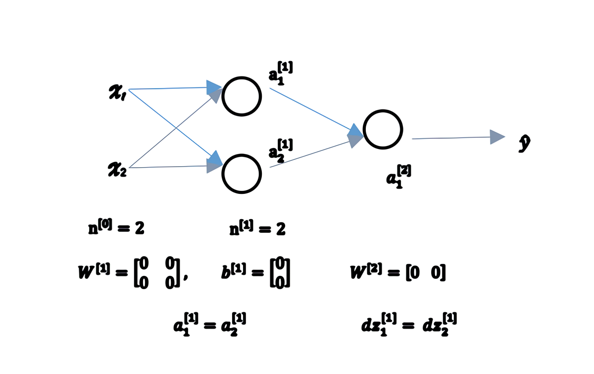

圖3.11.1
但是如果你這樣初始化這個神經網路，那麼這兩個隱含單元就會完全一樣，因此他們完全對稱，也就意味著計算同樣的函數，並且肯定的是最終經過每次訓練的疊代，這兩個隱含單元仍然是同一個函數，令人困惑。$dW$會是一個這樣的矩陣，每一行有同樣的值因此我們做權重更新把權重$W^{[1]}\implies{W^{[1]}-adW}$每次疊代後的$W^{[1]}$，第一行等於第二行。

由此可以推導，如果你把權重都初始化為0，那麼由於隱含單元開始計算同一個函數，所有的隱含單元就會對輸出單元有同樣的影響。一次疊代後同樣的表達式結果仍然是相同的，即隱含單元仍是對稱的。通過推導，兩次、三次、無論多少次疊代，不管你訓練網路多長時間，隱含單元仍然計算的是同樣的函數。因此這種情況下超過1個隱含單元也沒什麼意義，因為他們計算同樣的東西。當然更大的網路，比如你有3個特徵，還有相當多的隱含單元。

如果你要初始化成0，由於所有的隱含單元都是對稱的，無論你運行梯度下降多久，他們一直計算同樣的函數。這沒有任何幫助，因為你想要兩個不同的隱含單元計算不同的函數，這個問題的解決方法就是隨機初始化參數。你應該這麼做：把$W^{[1]}$設為`np.random.randn(2,2)`(生成高斯分布)，通常再乘上一個小的數，比如0.01，這樣把它初始化為很小的隨機數。然後$b$沒有這個對稱的問題（叫做**symmetry breaking problem**），所以可以把 $b$ 初始化為0，因為只要隨機初始化$W$你就有不同的隱含單元計算不同的東西，因此不會有**symmetry breaking**問題了。相似的，對於$W^{[2]}$你可以隨機初始化，$b^{[2]}$可以初始化為0。

$W^{[1]} = np.random.randn(2,2)\;*\;0.01\;,\;b^{[1]} = np.zeros((2,1))$
$W^{[2]} = np.random.randn(2,2)\;*\;0.01\;,\;b^{[2]} = 0$

你也許會疑惑，這個常數從哪裡來，為什麼是0.01，而不是100或者1000。我們通常傾向於初始化為很小的隨機數。因為如果你用**tanh**或者**sigmoid**啟動函數，或者說只在輸出層有一個**Sigmoid**，如果（數值）波動太大，當你計算啟動值時$z^{[1]} = W^{[1]}x + b^{[1]}\;,\;a^{[1]} = \sigma(z^{[1]})=g^{[1]}(z^{[1]})$如果$W$很大，$z$就會很大或者很小，因此這種情況下你很可能停在**tanh**/**sigmoid**函數的平坦的地方(見圖3.8.2)，這些地方梯度很小也就意味著梯度下降會很慢，因此學習也就很慢。

回顧一下：如果$w$很大，那麼你很可能最終停在（甚至在訓練剛剛開始的時候）$z$很大的值，這會造成**tanh**/**Sigmoid**啟動函數飽和在龜速的學習上，如果你沒有**sigmoid**/**tanh**啟動函數在你整個的神經網路裡，就不成問題。但如果你做二分類並且你的輸出單元是**Sigmoid**函數，那麼你不會想讓初始參數太大，因此這就是為什麼乘上0.01或者其他一些小數是合理的嘗試。對於$w^{[2]}$一樣，就是`np.random.randn((1,2))`，我猜會是乘以0.01。

事實上有時有比0.01更好的常數，當你訓練一個只有一層隱藏層的網路時（這是相對淺的神經網路，沒有太多的隱藏層），設為0.01可能也可以。但當你訓練一個非常非常深的神經網路，你可能要試試0.01以外的常數。下一節課我們會討論怎麼並且何時去選擇一個不同於0.01的常數，但是無論如何它通常都會是個相對小的數。

好了，這就是這週的影片。你現在已經知道如何建立一個一層的神經網路了，初始化參數，用前向傳播預測，還有計算導數，結合反向傳播用在梯度下降中。
