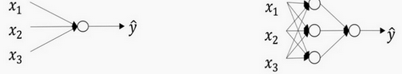
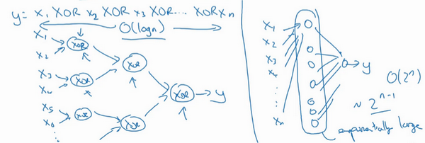
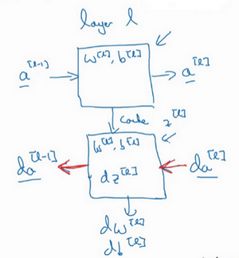
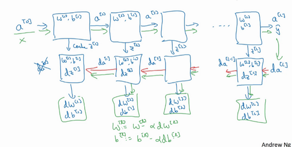
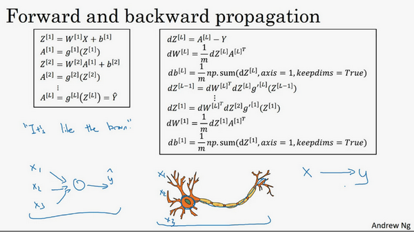

第四周：深層神經網路(Deep Neural Networks)
------------------------------------------
[TOC]
### 4.1 深層神經網路（Deep L-layer neural network）

目前為止我們學習了只有一個單獨隱藏層的神經網路的正向傳播和反向傳播，還有邏輯回歸，並且你還學到了向量化，這在隨機初始化權重時是很重要。

本週所要做的是把這些理念集合起來，就可以執行你自己的深度神經網路。

複習下前三週的課的內容：

1.邏輯回歸，結構如下圖左邊。一個隱藏層的神經網路，結構下圖右邊：

注意，神經網路的層數是這麼定義的：**從左到右，由0開始定義**，比如上面右圖，${x}_{1}$、${x}_{2}$、${x}_{3}$,這層是第0層，這層左邊的隱藏層是第1層，由此類推。如下圖左邊是兩個隱藏層的神經網路，右邊是5個隱藏層的神經網路。

嚴格上來說邏輯回歸也是一個一層的神經網路，而上面右圖一個深得多的模型，淺與深僅僅是指一種程度。記住以下要點：

有一個隱藏層的神經網路，就是一個兩層神經網路。記住當我們算神經網路的層數時，我們不算輸入層，我們只算隱藏層和輸出層。

但是在過去的幾年中，**DLI**（深度學習學院 **deep learning institute**）已經意識到有一些函數，只有非常深的神經網路能學會，而更淺的模型則辦不到。儘管對於任何給定的問題很難去提前預測到底需要多深的神經網路，所以先去嘗試邏輯回歸，嘗試一層然後兩層隱含層，然後把隱含層的數量看做是另一個可以自由選擇大小的超參數，然後再保留交叉驗證數據上評估，或者用你的開發集來評估。

我們再看下深度學習的符號定義：

上圖是一個四層的神經網路，有三個隱藏層。我們可以看到，第一層（即左邊數過去第二層，因為輸入層是第0層）有5個神經元數目，第二層5個，第三層3個。

我們用L表示層數，上圖：$L=4$，輸入層的索引為“0”，第一個隱藏層${n}^{[1]}=5$,表示有5個隱藏神經元，同理${n}^{[2]}=5$，${n}^{[3]}=3$，${{n}^{[4]}}$=${{n}^{[L]}}=1$（輸出單元為1）。而輸入層，${n}^{[0]}={n}_{x}=3$。

在不同層所擁有的神經元的數目，對於每層*l*都用${a}^{[l]}$來記作*l*層啟動後結果，我們會在後面看到在正向傳播時，最終能你會計算出${{a}^{[l]}}$。

透過用啟動函數 $g$ 計算${z}^{[l]}$，啟動函數也被索引為層數$l$，然後我們用${w}^{[l]}$來記作在*l*層計算${z}^{[l]}$值的權重。類似的，${{z}^{[l]}}$裡的方程${b}^{[l]}$也一樣。

最後總結下符號約定：

輸入的特徵記作$x$，但是$x$同樣也是0層的啟動函數，所以$x={a}^{[0]}$。

最後一層的啟動函數，所以${a}^{[L]}$是等於這個神經網路所預測的輸出結果。

但是如果你忘記了某些符號的意義，請看筆記最後的附件：[《深度學習符號指南》](notation.html)。

### 4.2 前向傳播和反向傳播（Forward and backward propagation）

之前我們學習了構成深度神經網路的基本模組，比如每一層都有前向傳播步驟以及一個相反的反向傳播步驟，這次影片我們講講如何實現這些步驟。

先講前向傳播，輸入${a}^{[l-1]}$，輸出是${a}^{[l]}$，快取為${z}^{[l]}$；從實現的角度來說我們可以快取下${w}^{[l]}$和${b}^{[l]}$，這樣更容易在不同的環節中調用函數。

所以前向傳播的步驟可以寫成：  ${z}^{[l]}={W}^{[l]}\cdot{a}^{[l-1]}+{b}^{[l]}$

​							${{a}^{[l]}}={{g}^{[l]}}\left( {{z}^{[l]}}\right)$

向量化實現過程可以寫成：       ${z}^{[l]}={W}^{[l]}\cdot {A}^{[l-1]}+{b}^{[l]}$

​						    ${A}^{[l]}={g}^{[l]}({Z}^{[l]})$

前向傳播需要餵入${A}^{[0]}$也就是$X$，來初始化；初始化的是第一層的輸入值。${a}^{[0]}$對應於一個訓練樣本的輸入特徵，而${{A}^{[0]}}$對應於一整個訓練樣本的輸入特徵，所以這就是這條鏈的第一個前向函數的輸入，重複這個步驟就可以從左到右計算前向傳播。

下面講反向傳播的步驟：

輸入為${{da}^{[l]}}$，輸出為${{da}^{[l-1]}}$，${{dw}^{[l]}}$, ${{db}^{[l]}}$

所以反向傳播的步驟可以寫成：

（1）$d{{z}^{[l]}}=d{{a}^{[l]}}*{{g}^{[l]}}'( {{z}^{[l]}})$

（2）$d{{w}^{[l]}}=d{{z}^{[l]}}\cdot{{a}^{[l-1]}}~$

（3）$d{{b}^{[l]}}=d{{z}^{[l]}}~~$

（4）$d{{a}^{[l-1]}}={{w}^{\left[ l \right]T}}\cdot {{dz}^{[l]}}$

（5）$d{{z}^{[l]}}={{w}^{[l+1]T}}d{{z}^{[l+1]}}\cdot \text{ }{{g}^{[l]}}'( {{z}^{[l]}})~$

式子（5）由式子（4）帶入式子（1）得到，前四個式子就可實現反向函數。

向量化實現過程可以寫成：

（6）$d{{Z}^{[l]}}=d{{A}^{[l]}}*{{g}^{\left[ l \right]}}'\left({{Z}^{[l]}} \right)~~$

（7）$d{{W}^{[l]}}=\frac{1}{m}\text{}d{{Z}^{[l]}}\cdot {{A}^{\left[ l-1 \right]T}}$

（8）$d{{b}^{[l]}}=\frac{1}{m}\text{ }np.sum(d{{z}^{[l]}},axis=1,keepdims=True)$

（9）$d{{A}^{[l-1]}}={{W}^{\left[ l \right]T}}.d{{Z}^{[l]}}$

總結一下：

第一層你可能有一個**ReLU**啟動函數，第二層為另一個**ReLU**啟動函數，第三層可能是**sigmoid**函數（如果你做二分類的話），輸出值為，用來計算損失；這樣你就可以向後疊代進行反向傳播求導來求${{dw}^{[3]}}$，${{db}^{[3]}}$ ，${{dw}^{[2]}}$ ，${{db}^{[2]}}$ ，${{dw}^{[1]}}$ ，${{db}^{[1]}}$。在計算的時候，快取會把${{z}^{[1]}}$ ${{z}^{[2]}}$${{z}^{[3]}}$傳遞過來，然後回傳${{da}^{[2]}}$，${{da}^{[1]}}$ ，可以用來計算${{da}^{[0]}}$，但我們不會使用它，這裡講述了一個三層網路的前向和反向傳播，還有一個細節沒講就是前向遞迴——用輸入數據來初始化，那麼反向遞迴（使用**Logistic**回歸做二分類）——對${{A}^{[l]}}$ 求導。

忠告：補補微積分和線性代數，多推導，多實踐。

### 4.3 深層網路中的前向傳播（Forward propagation in a Deep Network）

跟往常一樣，我們先來看對其中一個訓練樣本$x$如何應用前向傳播，之後討論向量化的版本。

第一層需要計算${{z}^{[1]}}={{w}^{[1]}}x+{{b}^{[1]}}$，${{a}^{[1]}}={{g}^{[1]}} {({z}^{[1]})}$（$x$可以看做${{a}^{[0]}}$）

第二層需要計算${{z}^{[2]}}={{w}^{[2]}}{{a}^{[1]}}+{{b}^{[2]}}$，${{a}^{[2]}}={{g}^{[2]}} {({z}^{[2]})}$

以此類推，

第四層為${{z}^{[4]}}={{w}^{[4]}}{{a}^{[3]}}+{{b}^{[4]}}$，${{a}^{[4]}}={{g}^{[4]}} {({z}^{[4]})}$

前向傳播可以歸納為多次疊代${{z}^{[l]}}={{w}^{[l]}}{{a}^{[l-1]}}+{{b}^{[l]}}$，${{a}^{[l]}}={{g}^{[l]}} {({z}^{[l]})}$。

向量化實現過程可以寫成：

${{Z}^{[l]}}={{W}^{[l]}}{{a}^{[l-1]}}+{{b}^{[l]}}$，${{A}^{[l]}}={{g}^{[l]}}{({Z}^{[l]})}$    (${{A}^{[0]}} = X)$

這裡只能用一個顯式**for**循環，$l$從1到$L$，然後一層接著一層去計算。下一節講的是避免代碼產生BUG，我所做的其中一件非常重要的工作。

### 4.4 核對矩陣的維數（Getting your matrix dimensions right）

當實現深度神經網路的時候，其中一個我常用的檢查代碼是否有錯的方法就是拿出一張紙過一遍算法中矩陣的維數。

$w$的維度是（下一層的維數，前一層的維數），即${{w}^{[l]}}$: (${{n}^{[l]}}$,${{n}^{[l-1]}}$)；

$b$的維度是（下一層的維數，1），即:

${{b}^{[l]}}$ : (${{n}^{[l]}},1)$；

${{z}^{[l]}}$,${{a}^{[l]}}$: $({{n}^{[l]}},1)$;

${{dw}^{[l]}}$和${{w}^{[l]}}$維度相同，${{db}^{[l]}}$和${{b}^{[l]}}$維度相同，且$w$和$b$向量化維度不變，但$z$,$a$以及$x$的維度會向量化後發生變化。

向量化後：

${Z}^{[l]}$可以看成由每一個單獨的${Z}^{[l]}$疊加而得到，${Z}^{[l]}=({{z}^{[l][1]}}，{{z}^{[l][2]}}，{{z}^{[l][3]}}，…，{{z}^{[l][m]}})$，

$m$為訓練集大小，所以${Z}^{[l]}$的維度不再是$({{n}^{[l]}},1)$，而是$({{n}^{[l]}},m)$。

${A}^{[l]}$：$({n}^{[l]},m)$，${A}^{[0]} = X =({n}^{[l]},m)$

在你做深度神經網路的反向傳播時，一定要確認所有的矩陣維數是前後一致的，可以大大提高代碼通過率。下一節我們講為什麼深層的網路在很多問題上比淺層的好。

### 4.5 為什麼使用深層表示？（Why deep representations?）

我們都知道深度神經網路能解決好多問題，其實並不需要很大的神經網路，但是得有深度，得有比較多的隱藏層，這是為什麼呢？我們一起來看幾個例子來幫助理解，為什麼深度神經網路會很好用。

首先，深度網路在計算什麼？

首先，深度網路究竟在計算什麼？如果你在建一個人臉識別或是人臉檢測系統，深度神經網路所做的事就是，當你輸入一張臉部的照片，然後你可以把深度神經網路的第一層，當成一個特徵探測器或者邊緣探測器。在這個例子裡，我會建一個大概有20個隱藏單元的深度神經網路，是怎麼針對這張圖計算的。隱藏單元就是這些圖裡這些小方塊（第一張大圖），舉個例子，這個小方塊（第一行第一列）就是一個隱藏單元，它會去找這張照片裡“\|”邊緣的方向。那麼這個隱藏單元（第四行第四列），可能是在找（“—”）水平向的邊緣在哪裡。之後的課程裡，我們會講專門做這種識別的卷積神經網路，到時候會細講，為什麼小單元是這麼表示的。你可以先把神經網路的第一層當作看圖，然後去找這張照片的各個邊緣。我們可以把照片裡組成邊緣的像素們放在一起看，然後它可以把被探測到的邊緣組合成臉部的不同部分（第二張大圖）。比如說，可能有一個神經元會去找眼睛的部分，另外還有別的在找鼻子的部分，然後把這許多的邊緣結合在一起，就可以開始檢測人臉的不同部分。最後再把這些部分放在一起，比如鼻子眼睛下巴，就可以識別或是探測不同的人臉（第三張大圖）。

你可以直覺上把這種神經網路的前幾層當作探測簡單的函數，比如邊緣，之後把它們跟後幾層結合在一起，那麼總體上就能學習更多複雜的函數。這些圖的意義，我們在學習卷積神經網路的時候再深入了解。還有一個技術性的細節需要理解的是，邊緣探測器其實相對來說都是針對照片中非常小塊的面積。就像這塊（第一行第一列），都是很小的區域。臉部探測器就會針對於大一些的區域，但是主要的概念是，一般你會從比較小的細節入手，比如邊緣，然後再一步步到更大更複雜的區域，比如一隻眼睛或是一個鼻子，再把眼睛鼻子裝一塊組成更複雜的部分。

這種從簡單到複雜的金字塔狀表示方法或者組成方法，也可以應用在圖像或者人臉識別以外的其他數據上。比如當你想要建一個語音識別系統的時候，需要解決的就是如何可視化語音，比如你輸入一個音訊片段，那麼神經網路的第一層可能就會去先開始試著探測比較低層次的音訊波形的一些特徵，比如音調是變高了還是低了，分辨白噪音，噝噝噝的聲音，或者音調，可以選擇這些相對程度比較低的波形特徵，然後把這些波形組合在一起就能去探測聲音的基本單元。在語言學中有個概念叫做音位，比如說單詞ca，c的發音，“嗑”就是一個音位，a的發音“啊”是個音位，t的發音“特”也是個音位，有了基本的聲音單元以後，組合起來，你就能識別音訊當中的單詞，單詞再組合起來就能識別詞組，再到完整的句子。

所以深度神經網路的這許多隱藏層中，較早的前幾層能學習一些低層次的簡單特徵，等到後幾層，就能把簡單的特徵結合起來，去探測更加複雜的東西。比如你錄在音訊裡的單詞、詞組或是句子，然後就能運行語音識別了。同時我們所計算的之前的幾層，也就是相對簡單的輸入函數，比如圖像單元的邊緣什麼的。到網路中的深層時，你實際上就能做很多複雜的事，比如探測臉部或是探測單詞、短語或是句子。

有些人喜歡把深度神經網路和人類大腦做類比，這些神經科學家覺得人的大腦也是先探測簡單的東西，比如你眼睛看得到的邊緣，然後組合起來才能探測複雜的物體，比如臉。這種深度學習和人類大腦的比較，有時候比較危險。但是不可否認的是，我們對大腦運作機制的認識很有價值，有可能大腦就是先從簡單的東西，比如邊緣著手，再組合成一個完整的複雜物體，這類簡單到複雜的過程，同樣也是其他一些深度學習的靈感來源，之後的影片我們也會繼續聊聊人類或是生物學理解的大腦。

**Small**：隱藏單元的數量相對較少

**Deep**：隱藏層數目比較多

深層的網路隱藏單元數量相對較少，隱藏層數目較多，如果淺層的網路想要達到同樣的計算結果則需要指數級增長的單元數量才能達到。

另外一個，關於神經網路為何有效的理論，來源於電路理論，它和你能夠用電路元件計算哪些函數有著分不開的聯繫。根據不同的基本邏輯閘，譬如與門、或門、非門。在非正式的情況下，這些函數都可以用相對較小，但很深的神經網路來計算，小在這裡的意思是隱藏單元的數量相對比較小，但是如果你用淺一些的神經網路計算同樣的函數，也就是說在我們不能用很多隱藏層時，你會需要成指數增長的單元數量才能達到同樣的計算結果。

我再來舉個例子，用沒那麼正式的語言介紹這個概念。假設你想要對輸入特徵計算異或或是奇偶性，你可以算$x_{1}XOR x_{2} XOR x_{3} XOR ……x_{n}$，假設你有$n$或者$n_{x}$個特徵，如果你畫一個異或的樹圖，先要計算$x_{1}$，$x_{2}$的異或，然後是$x_{3}$和$x_{4}$。技術上來說如果你只用或門，還有非門的話，你可能會需要幾層才能計算異或函數，但是用相對小的電路，你應該就可以計算異或了。然後你可以繼續建這樣的一個異或樹圖（上圖左），那麼你最後會得到這樣的電路來輸出結果$y$，$\hat{y}=y$，也就是輸入特徵的異或，或是奇偶性，要計算異或關係。這種樹圖對應網路的深度應該是$O(log(n))$，那麼節點的數量和電路部件，或是門的數量並不會很大，你也不需要太多門去計算異或。

但是如果你不能使用多隱層的神經網路的話，在這個例子中隱層數為$O(log(n))$，比如你被迫只能用單隱藏層來計算的話，這裡全部都指向從這些隱藏單元到後面這裡，再輸出$y$，那麼要計算奇偶性，或者異或關係函數就需要這一隱層（上圖右方框部分）的單元數呈指數增長才行，因為本質上來說你需要列舉耗盡$2^{n}$種可能的配置，或是$2^{n}$種輸入比特的配置。異或運算的最終結果是1或0，那麼你最終就會需要一個隱藏層，其中單元數目隨輸入比特指數上升。精確的說應該是$2^{n-1}$個隱藏單元數，也就是$O(2^{n})$。

我希望這能讓你有點概念，意識到有很多數學函數用深度網路計算比淺網路要容易得多，我個人倒是認為這種電路理論，對訓練直覺思維沒那麼有用，但這個結果人們還是經常提到的，用來解釋為什麼需要更深層的網路。

除了這些原因，說實話，我認為“深度學習”這個名字挺唬人的，這些概念以前都統稱為有很多隱藏層的神經網路，但是深度學習聽起來多高級，太深奧了，對嗎？這個詞流傳出去以後，這是神經網路的重新包裝或是多隱藏層神經網路的重新包裝，激發了大眾的想像力。拋開這些公關概念重新包裝不談，深度網路確實效果不錯，有時候人們還是會按照字面意思鑽牛角尖，非要用很多隱層。但是當我開始解決一個新問題時，我通常會從**logistic**回歸開始，再試試一到兩個隱層，把隱藏層數量當作參數、超參數一樣去除錯，這樣去找比較合適的深度。但是近幾年以來，有一些人會趨向於使用非常非常深邃的神經網路，比如好幾打的層數，某些問題中只有這種網路才是最佳模型。

這就是我想講的，為什麼深度學習效果拔群的直覺解釋，現在我們來看看除了正向傳播以外，反向傳播該怎麼具體實現。

### 4.6 搭建神經網路塊（Building blocks of deep neural networks）

這週的前幾個影片和之前幾週的影片裡，你已經看到過正向反向傳播的基礎組成部分了，它們也是深度神經網路的重要組成部分，現在我們來用它們建一個深度神經網路。

這是一個層數較少的神經網路，我們選擇其中一層（方框部分），從這一層的計算著手。在第$l$層你有參數$W^{[l]}$和$b^{[l]}$，正向傳播裡有輸入的啟動函數，輸入是前一層$a^{[l-1]}$，輸出是$a^{[l]}$，我們之前講過$z^{[l]} =W^{[l]}a^{[l-1]} +b^{[l]}$,$a^{[l]} =g^{[l]}(z^{[l]})$，那麼這就是你如何從輸入$a^{[l-1]}$走到輸出的$a^{[l]}$。之後你就可以把$z^{[l]}$的值快取起來，我在這裡也會把這包括在快取中，因為快取的$z^{[i]}$對以後的正向反向傳播的步驟非常有用。

然後是反向步驟或者說反向傳播步驟，同樣也是第$l$層的計算，你會需要實現一個函數輸入為$da^{[l]}$，輸出$da^{[l-1]}$的函數。一個小細節需要注意，輸入在這裡其實是$da^{[l]}$以及所快取的$z^{[l]}$值，之前計算好的$z^{[l]}$值，除了輸出$da^{[l-1]}$的值以外，也需要輸出你需要的梯度$dW^{[l]}$和$db^{[l]}$，這是為了實現梯度下降學習。

這就是基本的正向步驟的結構，我把它成為稱為正向函數，類似的在反向步驟中會稱為反向函數。總結起來就是，在l層，你會有正向函數，輸入$a^{[l-1]}$並且輸出$a^{[l]}$，為了計算結果你需要用$W^{[l]}$和$b^{[l]}$，以及輸出到快取的$z^{[l]}$。然後用作反向傳播的反向函數，是另一個函數，輸入$da^{[l]}$，輸出$da^{[l-1]}$，你就會得到對啟動函數的導數，也就是希望的導數值$da^{[l]}$。$a^{[l-1]}$是會變的，前一層算出的啟動函數導數。在這個方塊（第二個）裡你需要$W^{[l]}$和$b^{[l]}$，最後你要算的是$dz^{[l]}$。然後這個方塊（第三個）中，這個反向函數可以計算輸出$dW^{[l]}$和$db^{[l]}$。我會用紅色箭頭標註標註反向步驟，如果你們喜歡，我可以把這些箭頭塗成紅色。

然後如果實現了這兩個函數（正向和反向），然後神經網路的計算過程會是這樣的：

把輸入特徵$a^{[0]}$，放入第一層並計算第一層的啟動函數，用$a^{[1]}$表示，你需要$W^{[1]}$和$b^{[1]}$來計算，之後也快取$z^{[l]}$值。之後餵到第二層，第二層裡，需要用到$W^{[2]}$和$b^{[2]}$，你會需要計算第二層的啟動函數$a^{[2]}$。後面幾層以此類推，直到最後你算出了$a^{[L]}$，第$L$層的最終輸出值$\hat y$。在這些過程裡我們快取了所有的$z$值，這就是正向傳播的步驟。

對反向傳播的步驟而言，我們需要算一系列的反向疊代，就是這樣反向計算梯度，你需要把$da^{[L]}$的值放在這裡，然後這個方塊會給我們${da}^{[L-1]}$的值，以此類推，直到我們得到${da}^{[2]}$和${da}^{[1]}$，你還可以計算多一個輸出值，就是${da}^{[0]}$，但這其實是你的輸入特徵的導數，並不重要，起碼對於訓練監督學習的權重不算重要，你可以止步於此。反向傳播步驟中也會輸出$dW^{[l]}$和$db^{[l]}$，這會輸出$dW^{[3]}$和$db^{[3]}$等等。目前為止你算好了所有需要的導數，稍微填一下這個流程圖。

神經網路的一步訓練包含了，從$a^{[0]}$開始，也就是 $x$ 然後經過一系列正向傳播計算得到$\hat y$，之後再用輸出值計算這個（第二行最後方塊），再實現反向傳播。現在你就有所有的導數項了，$W$也會在每一層被更新為$W=W-αdW$，$b$也一樣，$b=b-αdb$，反向傳播就都計算完畢，我們有所有的導數值，那麼這是神經網路一個梯度下降循環。

繼續下去之前再補充一個細節，概念上會非常有幫助，那就是把反向函數計算出來的$z​$值快取下來。當你做編程練習的時候去實現它時，你會發現快取可能很方便，可以迅速得到$W^{[l]}​$和$b^{[l]}​$的值，非常方便的一個方法，在編程練習中你快取了$z​$，還有$W​$和$b​$對吧？從實現角度上看，我認為是一個很方便的方法，可以將參數複製到你在計算反向傳播時所需要的地方。好，這就是實現過程的細節，做編程練習時會用到。

現在你們見過實現深度神經網路的基本元件，在每一層中有一個正向傳播步驟，以及對應的反向傳播步驟，以及把訊息從一步傳遞到另一步的快取。下一個影片我們會講解這些元件具體實現過程，我們來看下一個影片吧。

### 4.7 參數VS超參數（Parameters vs Hyperparameters）

想要你的深度神經網路起很好的效果，你還需要規劃好你的參數以及超參數。

什麼是超參數？

比如算法中的**learning rate** $a$（學習率）、**iterations**(梯度下降法循環的數量)、$L$（隱藏層數目）、${{n}^{[l]}}$（隱藏層單元數目）、**choice of activation function**（啟動函數的選擇）都需要你來設置，這些數字實際上控制了最後的參數$W$和$b$的值，所以它們被稱作超參數。

實際上深度學習有很多不同的超參數，之後我們也會介紹一些其他的超參數，如**momentum**、**mini batch size**、**regularization parameters**等等。

如何尋找超參數的最優值？

走**Idea—Code—Experiment—Idea**這個循環，嘗試各種不同的參數，實現模型並觀察是否成功，然後再疊代。

今天的深度學習應用領域，還是很經驗性的過程，通常你有個想法，比如你可能大致知道一個最好的學習率值，可能說$a=0.01$最好，我會想先試試看，然後你可以實際試一下，訓練一下看看效果如何。然後基於嘗試的結果你會發現，你覺得學習率設定再提高到0.05會比較好。如果你不確定什麼值是最好的，你大可以先試試一個學習率$a$，再看看損失函數J的值有沒有下降。然後你可以試一試大一些的值，然後發現損失函數的值增加並發散了。然後可能試試其他數，看結果是否下降的很快或者收斂到在更高的位置。你可能嘗試不同的$a$並觀察損失函數$J$這麼變了，試試一組值，然後可能損失函數變成這樣，這個$a$值會加快學習過程，並且收斂在更低的損失函數值上（箭頭標識），我就用這個$a$值了。

在前面幾頁中，還有很多不同的超參數。然而，當你開始開發新應用時，預先很難確切知道，究竟超參數的最優值應該是什麼。所以通常，你必須嘗試很多不同的值，並走這個循環，試試各種參數。試試看5個隱藏層，這個數目的隱藏單元，實現模型並觀察是否成功，然後再疊代。這頁的標題是，應用深度學習領域，一個很大程度基於經驗的過程，憑經驗的過程通俗來說，就是試直到你找到合適的數值。

另一個近來深度學習的影響是它用於解決很多問題，從計算機視覺到語音識別，到自然語言處理，到很多結構化的數據應用，比如網路廣告或是網頁搜尋或產品推薦等等。我所看到過的就有很多其中一個領域的研究員，這些領域中的一個，嘗試了不同的設置，有時候這種設置超參數的直覺可以推廣，但有時又不會。所以我經常建議人們，特別是剛開始應用於新問題的人們，去試一定範圍的值看看結果如何。然後下一門課程，我們會用更系統的方法，用系統性的嘗試各種超參數取值。然後其次，甚至是你已經用了很久的模型，可能你在做網路廣告應用，在你開發途中，很有可能學習率的最優數值或是其他超參數的最優值是會變的，所以即使你每天都在用當前最優的參數除錯你的系統，你還是會發現，最優值過一年就會變化，因為電腦的基礎設施，**CPU**或是**GPU**可能會變化很大。所以有一條經驗規律可能每幾個月就會變。如果你所解決的問題需要很多年時間，只要經常試試不同的超參數，勤於檢驗結果，看看有沒有更好的超參數數值，相信你慢慢會得到設定超參數的直覺，知道你的問題最好用什麼數值。

這可能的確是深度學習比較讓人不滿的一部分，也就是你必須嘗試很多次不同可能性。但參數設定這個領域，深度學習研究還在進步中，所以可能過段時間就會有更好的方法決定超參數的值，也很有可能由於**CPU**、**GPU**、網路和數據都在變化，這樣的指南可能只會在一段時間內起作用，只要你不斷嘗試，並且嘗試保留交叉檢驗或類似的檢驗方法，然後挑一個對你的問題效果比較好的數值。

近來受深度學習影響，很多領域發生了變化，從計算機視覺到語音識別到自然語言處理到很多結構化的數據應用，比如網路廣告、網頁搜索、產品推薦等等；有些同一領域設置超參數的直覺可以推廣，但有時又不可以，特別是那些剛開始研究新問題的人們應該去嘗試一定範圍內的結果如何，甚至那些用了很久的模型得學習率或是其他超參數的最優值也有可能會改變。

在下個課程我們會用系統性的方法去嘗試各種超參數的取值。有一條經驗規律：經常試試不同的超參數，勤於檢查結果，看看有沒有更好的超參數取值，你將會得到設定超參數的直覺。

### 4.8 深度學習和大腦的關聯性（What does this have to do with the brain?）

深度學習和大腦有什麼關聯性嗎？

關聯不大。

那麼人們為什麼會說深度學習和大腦相關呢？

當你在實現一個神經網路的時候，那些公式是你在做的東西，你會做前向傳播、反向傳播、梯度下降法，其實很難表述這些公式具體做了什麼，深度學習像大腦這樣的類比其實是過度簡化了我們的大腦具體在做什麼，但因為這種形式很簡潔，也能讓普通人更願意公開討論，也方便新聞報導並且吸引大眾眼球，但這個類比是非常不準確的。

一個神經網路的邏輯單元可以看成是對一個生物神經元的過度簡化，但迄今為止連神經科學家都很難解釋究竟一個神經元能做什麼，它可能是極其複雜的；它的一些功能可能真的類似**logistic**回歸的運算，但單個神經元到底在做什麼目前還沒有人能夠真正可以解釋。

深度學習的確是個很好的工具來學習各種很靈活很複雜的函數，學習到從$x$到$y$的映射，在監督學習中學到輸入到輸出的映射。

但這個類比還是很粗略的，這是一個**logistic**回歸單元的**sigmoid**啟動函數，這裡是一個大腦中的神經元，圖中這個生物神經元，也是你大腦中的一個細胞，它能接受來自其他神經元的電信號，比如$x_1,x_2,x_3$，或可能來自於其他神經元$a_1,a_2,a_3$ 。其中有一個簡單的臨界計算值，如果這個神經元突然激發了，它會讓電脈衝沿著這條長長的軸突，或者說一條導線傳到另一個神經元。

所以這是一個過度簡化的對比，把一個神經網路的邏輯單元和右邊的生物神經元對比。至今為止其實連神經科學家們都很難解釋，究竟一個神經元能做什麼。一個小小的神經元其實卻是極其複雜的，以至於我們無法在神經科學的角度描述清楚，它的一些功能，可能真的是類似**logistic**回歸的運算，但單個神經元到底在做什麼，目前還沒有人能夠真正解釋，大腦中的神經元是怎麼學習的，至今這仍是一個謎之過程。到底大腦是用類似於後向傳播或是梯度下降的算法，或者人類大腦的學習過程用的是完全不同的原理。

所以雖然深度學習的確是個很好的工具，能學習到各種很靈活很複雜的函數來學到從x到y的映射。在監督學習中，學到輸入到輸出的映射，但這種和人類大腦的類比，在這個領域的早期也許值得一提。但現在這種類比已經逐漸過時了，我自己也在儘量少用這樣的說法。

這就是神經網路和大腦的關係，我相信在計算機視覺，或其他的學科都曾受人類大腦啟發，還有其他深度學習的領域也曾受人類大腦啟發。但是個人來講我用這個人類大腦類比的次數逐漸減少了。