# 第二門課 改善深層神經網路：超參數除錯、正則化以及最佳化(Improving Deep Neural Networks:Hyperparameter tuning, Regularization and Optimization)

第一週：深度學習的實踐層面(Practical aspects of Deep Learning)
--------------------------------------------------------------
[TOC]
### 1.1 訓練，驗證，測試集（Train / Dev / Test sets）

大家可能已經了解了，那麼本週，我們將繼續學習如何有效運作神經網路，內容涉及超參數調優，如何構建數據，以及如何確保最佳化算法快速運行，從而使學習算法在合理時間內完成自我學習。

第一週，我們首先說說神經網路機器學習中的問題，然後是隨機神經網路，還會學習一些確保神經網路正確運行的技巧，帶著這些問題，我們開始今天的課程。

在配置訓練、驗證和測試數據集的過程中做出正確決策會在很大程度上幫助大家創建高效的神經網路。訓練神經網路時，我們需要做出很多決策，例如：

1.  神經網路分多少層

2.  每層含有多少個隱藏單元

3.  學習速率是多少

4.  各層採用哪些啟動函數

創建新應用的過程中，我們不可能從一開始就準確預測出這些訊息和其他超級參數。實際上，應用型機器學習是一個高度疊代的過程，通常在項目啟動時，我們會先有一個初步想法，比如構建一個含有特定層數，隱藏單元數量或數據集個數等等的神經網路，然後編碼，並嘗試運行這些程式碼，通過運行和測試得到該神經網路或這些配置訊息的運行結果，你可能會根據輸出結果重新完善自己的想法，改變策略，或者為了找到更好的神經網路不斷疊代更新自己的方案。

現如今，深度學習已經在自然語言處理，計算機視覺，語音識別以及結構化數據應用等眾多領域取得巨大成功。結構化數據無所不包，從廣告到網路搜尋。其中網路搜尋不僅包括網路搜尋引擎，還包括購物網站，從所有根據搜索欄詞條傳輸結果的網站。再到計算機安全，物流，比如判斷司機去哪接送貨，範圍之廣，不勝枚舉。

我發現，可能有自然語言處理方面的人才想踏足計算機視覺領域，或者經驗豐富的語音識別專家想投身廣告行業，又或者，有的人想從電腦安全領域跳到物流行業，在我看來，從一個領域或者應用領域得來的直覺經驗，通常無法轉移到其他應用領域，最佳決策取決於你所擁有的數據量，電腦配備中輸入特徵的數量，用**GPU**訓練還是**CPU**，**GPU**和**CPU**的具體配置以及其他諸多因素。

目前為止，我覺得，對於很多應用系統，即使是經驗豐富的深度學習行家也不太可能一開始就預設出最匹配的超級參數，所以說，應用深度學習是一個典型的疊代過程，需要多次循環往復，才能為應用程式找到一個稱心的神經網路，因此循環該過程的效率是決定項目進展速度的一個關鍵因素，而創建高品質的訓練數據集，驗證集和測試集也有助於提高循環效率。

假設這是訓練數據，我用一個長方形表示，我們通常會將這些數據劃分成幾部分，一部分作為訓練集，一部分作為簡單交叉驗證集，有時也稱之為驗證集，方便起見，我就叫它驗證集（**dev set**），其實都是同一個概念，最後一部分則作為測試集。

接下來，我們開始對訓練集執行算法，通過驗證集或簡單交叉驗證集選擇最好的模型，經過充分驗證，我們選定了最終模型，然後就可以在測試集上進行評估了，為了無偏評估算法的運行狀況。

在機器學習發展的小數據量時代，常見做法是將所有數據三七分，就是人們常說的70%訓練集，30%測試集。如果明確設置了驗證集，也可以按照60%訓練集，20%驗證集和20%測試集來劃分。這是前幾年機器學習領域普遍認可的最好的實踐方法。

如果只有100條，1000條或者1萬條數據，那麼上述比例劃分是非常合理的。

但是在大數據時代，我們現在的數據量可能是百萬級別，那麼驗證集和測試集占數據總量的比例會趨向於變得更小。因為驗證集的目的就是驗證不同的算法，檢驗哪種算法更有效，因此，驗證集只要足夠大到能評估不同的算法，比如2個甚至10個不同算法，並迅速判斷出哪種算法更有效。我們可能不需要拿出20%的數據作為驗證集。

比如我們有100萬條數據，那麼取1萬條數據便足以進行評估，找出其中表現最好的1-2種算法。同樣地，根據最終選擇的分類器，測試集的主要目的是正確評估分類器的性能，所以，如果擁有百萬數據，我們只需要1000條數據，便足以評估單個分類器，並且準確評估該分類器的性能。假設我們有100萬條數據，其中1萬條作為驗證集，1萬條作為測試集，100萬里取1萬，比例是1%，即：訓練集占98%，驗證集和測試集各占1%。對於數據量過百萬的應用，訓練集可以占到99.5%，驗證和測試集各占0.25%，或者驗證集占0.4%，測試集占0.1%。

總結一下，在機器學習中，我們通常將樣本分成訓練集，驗證集和測試集三部分，數據集規模相對較小，適用傳統的劃分比例，數據集規模較大的，驗證集和測試集要小於數據總量的20%或10%。後面我會給出如何劃分驗證集和測試集的具體指導。

現代深度學習的另一個趨勢是越來越多的人在訓練和測試集分布不匹配的情況下進行訓練，假設你要構建一個用戶可以上傳大量圖片的應用程式，目的是找出並呈現所有貓咪圖片，可能你的用戶都是愛貓人士，訓練集可能是從網上下載的貓咪圖片，而驗證集和測試集是用戶在這個應用上上傳的貓的圖片，就是說，訓練集可能是從網路上抓下來的圖片。而驗證集和測試集是用戶上傳的圖片。結果許多網頁上的貓咪圖片解析度很高，很專業，後期製作精良，而用戶上傳的照片可能是用手機隨意拍攝的，像素低，比較模糊，這兩類數據有所不同，針對這種情況，根據經驗，我建議大家要確保驗證集和測試集的數據來自同一分布，關於這個問題我也會多講一些。因為你們要用驗證集來評估不同的模型，儘可能地最佳化性能。如果驗證集和測試集來自同一個分布就會很好。

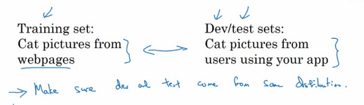

但由於深度學習算法需要大量的訓練數據，為了獲取更大規模的訓練數據集，我們可以採用當前流行的各種創意策略，例如，網頁抓取，代價就是訓練集數據與驗證集和測試集數據有可能不是來自同一分布。但只要遵循這個經驗法則，你就會發現機器學習算法會變得更快。我會在後面的課程中更加詳細地解釋這條經驗法則。

最後一點，就算沒有測試集也不要緊，測試集的目的是對最終所選定的神經網路系統做出無偏估計，如果不需要無偏估計，也可以不設置測試集。所以如果只有驗證集，沒有測試集，我們要做的就是，在訓練集上訓練，嘗試不同的模型框架，在驗證集上評估這些模型，然後疊代並選出適用的模型。因為驗證集中已經涵蓋測試集數據，其不再提供無偏性能評估。當然，如果你不需要無偏估計，那就再好不過了。

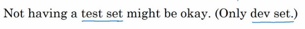

在機器學習中，如果只有一個訓練集和一個驗證集，而沒有獨立的測試集，遇到這種情況，訓練集還被人們稱為訓練集，而驗證集則被稱為測試集，不過在實際應用中，人們只是把測試集當成簡單交叉驗證集使用，並沒有完全實現該術語的功能，因為他們把驗證集數據過度擬合到了測試集中。如果某團隊跟你說他們只設置了一個訓練集和一個測試集，我會很謹慎，心想他們是不是真的有訓練驗證集，因為他們把驗證集數據過度擬合到了測試集中，讓這些團隊改變叫法，改稱其為“訓練驗證集”，而不是“訓練測試集”，可能不太容易。即便我認為“訓練驗證集“在專業用詞上更準確。實際上，如果你不需要無偏評估算法性能，那麼這樣是可以的。

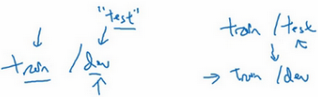

所以說，搭建訓練驗證集和測試集能夠加速神經網路的集成，也可以更有效地衡量算法地偏差和方差，從而幫助我們更高效地選擇合適方法來最佳化算法。

### 1.2 偏差，方差（Bias /Variance）

我注意到，幾乎所有機器學習從業人員都期望深刻理解偏差和方差，這兩個概念易學難精，即使你自己認為已經理解了偏差和方差的基本概念，卻總有一些意想不到的新東西出現。關於深度學習的誤差問題，另一個趨勢是對偏差和方差的權衡研究甚淺，你可能聽說過這兩個概念，但深度學習的誤差很少權衡二者，我們總是分別考慮偏差和方差，卻很少談及偏差和方差的權衡問題，下面我們來一探究竟。

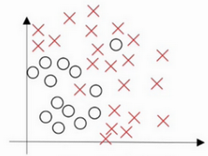

假設這就是數據集，如果給這個數據集擬合一條直線，可能得到一個邏輯回歸擬合，但它並不能很好地擬合該數據，這是高偏差（**high bias**）的情況，我們稱為“欠擬合”（**underfitting**）。

相反的如果我們擬合一個非常複雜的分類器，比如深度神經網路或含有隱藏單元的神經網路，可能就非常適用於這個數據集，但是這看起來也不是一種很好的擬合方式分類器方差較高（**high variance**），數據過度擬合（**overfitting**）。

在兩者之間，可能還有一些像圖中這樣的，複雜程度適中，數據擬合適度的分類器，這個數據擬合看起來更加合理，我們稱之為“適度擬合”（**just right**）是介於過度擬合和欠擬合中間的一類。

在這樣一個只有$x_1$和$x_2$兩個特徵的二維數據集中，我們可以繪製數據，將偏差和方差可視化。在多維空間數據中，繪製數據和可視化分割邊界無法實現，但我們可以通過幾個指標，來研究偏差和方差。

我們沿用貓咪圖片分類這個例子，左邊一張是貓咪圖片，右邊一張不是。理解偏差和方差的兩個關鍵數據是訓練集誤差（**Train set error**）和驗證集誤差（**Dev set error**），為了方便論證，假設我們可以辨別圖片中的小貓，我們用肉眼識別幾乎是不會出錯的。

假定訓練集誤差是1%，為了方便論證，假定驗證集誤差是11%，可以看出訓練集設置得非常好，而驗證集設置相對較差，我們可能過度擬合了訓練集，在某種程度上，驗證集並沒有充分利用交叉驗證集的作用，像這種情況，我們稱之為“高方差”。

通過查看訓練集誤差和驗證集誤差，我們便可以診斷算法是否具有高方差。也就是說衡量訓練集和驗證集誤差就可以得出不同結論。

假設訓練集誤差是15%，我們把訓練集誤差寫在首行，驗證集誤差是16%，假設該案例中人的錯誤率幾乎為0%，人們瀏覽這些圖片，分辨出是不是貓。算法並沒有在訓練集中得到很好訓練，如果訓練數據的擬合度不高，就是數據欠擬合，就可以說這種算法偏差比較高。相反，它對於驗證集產生的結果卻是合理的，驗證集中的錯誤率只比訓練集的多了1%，所以這種算法偏差高，因為它甚至不能擬合訓練集，這與上一張幻燈片最左邊的圖片相似。

再舉一個例子，訓練集誤差是15%，偏差相當高，但是，驗證集的評估結果更糟糕，錯誤率達到30%，在這種情況下，我會認為這種算法偏差高，因為它在訓練集上結果不理想，而且方差也很高，這是方差偏差都很糟糕的情況。

再看最後一個例子，訓練集誤差是0.5%，驗證集誤差是1%，用戶看到這樣的結果會很開心，貓咪分類器只有1%的錯誤率，偏差和方差都很低。

有一點我先在這個簡單提一下，具體的留在後面課程裡講，這些分析都是基於假設預測的，假設人眼辨別的錯誤率接近0%，一般來說，最優誤差也被稱為貝葉斯誤差，所以，最優誤差接近0%，我就不在這裡細講了，如果最優誤差或貝葉斯誤差非常高，比如15%。我們再看看這個分類器（訓練誤差15%，驗證誤差16%），15%的錯誤率對訓練集來說也是非常合理的，偏差不高，方差也非常低。

當所有分類器都不適用時，如何分析偏差和方差呢？比如，圖片很模糊，即使是人眼，或者沒有系統可以準確無誤地識別圖片，在這種情況下，最優誤差會更高，那麼分析過程就要做些改變了，我們暫時先不討論這些細微差別，重點是通過查看訓練集誤差，我們可以判斷數據擬合情況，至少對於訓練數據是這樣，可以判斷是否有偏差問題，然後查看錯誤率有多高。當完成訓練集訓練，開始使用驗證集驗證時，我們可以判斷方差是否過高，從訓練集到驗證集的這個過程中，我們可以判斷方差是否過高。

以上分析的前提都是假設基本誤差很小，訓練集和驗證集數據來自相同分布，如果沒有這些假設作為前提，分析過程更加複雜，我們將會在稍後課程裡討論。

上一張幻燈片，我們講了高偏差和高方差的情況，大家應該對優質分類器有了一定的認識，偏差和方差都高是什麼樣子呢？這種情況對於兩個衡量標準來說都是非常糟糕的。

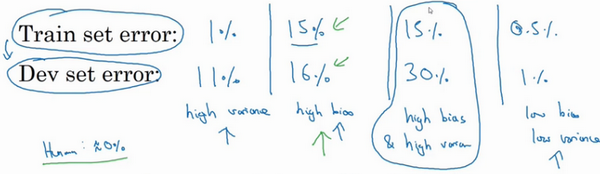

我們之前講過，這樣的分類器，會產生高偏差，因為它的數據擬合度低，像這種接近線性的分類器，數據擬合度低。

但是如果我們稍微改變一下分類器，我用紫色筆畫出，它會過度擬合部分數據，用紫色線畫出的分類器具有高偏差和高方差，偏差高是因為它幾乎是一條線性分類器，並未擬合數據。

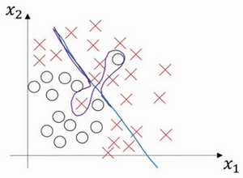

這種二次曲線能夠很好地擬合數據。

這條曲線中間部分靈活性非常高，卻過度擬合了這兩個樣本，這類分類器偏差很高，因為它幾乎是線性的。

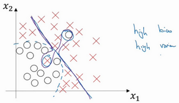

而採用曲線函數或二次元函數會產生高方差，因為它曲線靈活性太高以致擬合了這兩個錯誤樣本和中間這些活躍數據。

這看起來有些不自然，從兩個維度上看都不太自然，但對於高維數據，有些數據區域偏差高，有些數據區域方差高，所以在高維數據中採用這種分類器看起來就不會那麼牽強了。

總結一下，我們講了如何透過分析在訓練集上訓練算法產生的誤差和驗證集上驗證算法產生的誤差來診斷算法是否存在高偏差和高方差，是否兩個值都高，或者兩個值都不高，根據算法偏差和方差的具體情況決定接下來你要做的工作，下節課，我會根據算法偏差和方差的高低情況講解一些機器學習的基本方法，幫助大家更系統地最佳化算法，我們下節課見。

### 1.3 機器學習基礎（Basic Recipe for Machine Learning）

上節課我們講的是如何通過訓練誤差和驗證集誤差判斷算法偏差或方差是否偏高，幫助我們更加系統地在機器學習中運用這些方法來最佳化算法性能。

下圖就是我在訓練神經網路用到的基本方法：（嘗試這些方法，可能有用，可能沒用）

這是我在訓練神經網路時用到地基本方法，初始模型訓練完成後，我首先要知道算法的偏差高不高，如果偏差較高，試著評估訓練集或訓練數據的性能。如果偏差的確很高，甚至無法擬合訓練集，那麼你要做的就是選擇一個新的網路，比如含有更多隱藏層或者隱藏單元的網路，或者花費更多時間來訓練網路，或者嘗試更先進的最佳化算法，後面我們會講到這部分內容。你也可以嘗試其他方法，可能有用，也可能沒用。

一會我們會看到許多不同的神經網路架構，或許你能找到一個更合適解決此問題的新的網路架構，加上括號，因為其中一條就是你必須去嘗試，可能有用，也可能沒用，不過採用規模更大的網路通常都會有所幫助，延長訓練時間不一定有用，但也沒什麼壞處。訓練學習算法時，我會不斷嘗試這些方法，直到解決掉偏差問題，這是最低標準，反覆嘗試，直到可以擬合數據為止，至少能夠擬合訓練集。

如果網路足夠大，通常可以很好的擬合訓練集，只要你能擴大網路規模，如果圖片很模糊，算法可能無法擬合該圖片，但如果有人可以分辨出圖片，如果你覺得基本誤差不是很高，那麼訓練一個更大的網路，你就應該可以……至少可以很好地擬合訓練集，至少可以擬合或者過擬合訓練集。一旦偏差降低到可以接受的數值，檢查一下方差有沒有問題，為了評估方差，我們要查看驗證集性能，我們能從一個性能理想的訓練集推斷出驗證集的性能是否也理想，如果方差高，最好的解決辦法就是採用更多數據，如果你能做到，會有一定的幫助，但有時候，我們無法獲得更多數據，我們也可以嘗試通過正則化來減少過擬合，這個我們下節課會講。有時候我們不得不反覆嘗試，但是，如果能找到更合適的神經網路框架，有時它可能會一箭雙鵰，同時減少方差和偏差。如何實現呢？想系統地說出做法很難，總之就是不斷重複嘗試，直到找到一個低偏差，低方差的框架，這時你就成功了。

有兩點需要大家注意：

第一點，高偏差和高方差是兩種不同的情況，我們後續要嘗試的方法也可能完全不同，我通常會用訓練驗證集來診斷算法是否存在偏差或方差問題，然後根據結果選擇嘗試部分方法。舉個例子，如果算法存在高偏差問題，準備更多訓練數據其實也沒什麼用處，至少這不是更有效的方法，所以大家要清楚存在的問題是偏差還是方差，還是兩者都有問題，明確這一點有助於我們選擇出最有效的方法。

第二點，在機器學習的初期階段，關於所謂的偏差方差權衡的討論屢見不鮮，原因是我們能嘗試的方法有很多。可以增加偏差，減少方差，也可以減少偏差，增加方差，但是在深度學習的早期階段，我們沒有太多工具可以做到只減少偏差或方差卻不影響到另一方。但在當前的深度學習和大數據時代，只要持續訓練一個更大的網路，只要準備了更多數據，那麼也並非只有這兩種情況，我們假定是這樣，那麼，只要正則適度，通常構建一個更大的網路便可以，在不影響方差的同時減少偏差，而採用更多數據通常可以在不過多影響偏差的同時減少方差。這兩步實際要做的工作是：訓練網路，選擇網路或者準備更多數據，現在我們有工具可以做到在減少偏差或方差的同時，不對另一方產生過多不良影響。我覺得這就是深度學習對監督式學習大有裨益的一個重要原因，也是我們不用太過關注如何平衡偏差和方差的一個重要原因，但有時我們有很多選擇，減少偏差或方差而不增加另一方。最終，我們會得到一個非常規範化的網路。從下節課開始，我們將講解正則化，訓練一個更大的網路幾乎沒有任何負面影響，而訓練一個大型神經網路的主要代價也只是計算時間，前提是網路是比較規範化的。

 今天我們講了如何透過組織機器學習來診斷偏差和方差的基本方法，然後選擇解決問題的正確操作，希望大家有所了解和認識。我在課上不止一次提到了正則化，它是一種非常實用的減少方差的方法，正則化時會出現偏差方差權衡問題，偏差可能略有增加，如果網路足夠大，增幅通常不會太高，我們下節課再細講，以便大家更好理解如何實現神經網路的正則化。

### 1.4 正則化（Regularization）

深度學習可能存在過擬合問題——高方差，有兩個解決方法，一個是正則化，另一個是準備更多的數據，這是非常可靠的方法，但你可能無法時時刻刻準備足夠多的訓練數據或者獲取更多數據的成本很高，但正則化通常有助於避免過擬合或減少你的網路誤差。

如果你懷疑神經網路過度擬合了數據，即存在高方差問題，那麼最先想到的方法可能是正則化，另一個解決高方差的方法就是準備更多數據，這也是非常可靠的辦法，但你可能無法時時準備足夠多的訓練數據，或者，獲取更多數據的成本很高，但正則化有助於避免過度擬合，或者減少網路誤差，下面我們就來講講正則化的作用原理。

我們用邏輯回歸來實現這些設想，求成本函數$J$的最小值，它是我們定義的成本函數，參數包含一些訓練數據和不同數據中個體預測的損失，$w$和$b$是邏輯回歸的兩個參數，$w$是一個多維度參數向量，$b$是一個實數。在邏輯回歸函數中加入正則化，只需添加參數λ，也就是正則化參數，一會再詳細講。

$\frac{\lambda}{2m}$乘以$w$範數的平方，其中$\left\| w \right\|_2^2$是$w$的歐幾里德範數的平方，等於$w_{j}$（$j$ 值從1到$n_{x}$）平方的和，也可表示為$w^{T}w$，也就是向量參數$w$ 的歐幾里德範數（2範數）的平方，此方法稱為$L2$正則化，因為這裡用了歐幾里德範數，被稱為向量參數$w$的$L2$範數。

為什麼只正則化參數$w$？為什麼不再加上參數 $b$ 呢？你可以這麼做，只是我習慣省略不寫，因為$w$通常是一個高維參數向量，已經可以表達高偏差問題，$w$可能包含有很多參數，我們不可能擬合所有參數，而$b$只是單個數字，所以$w$幾乎涵蓋所有參數，而不是$b$，如果加了參數$b$，其實也沒太大影響，因為$b$只是眾多參數中的一個，所以我通常省略不計，如果你想加上這個參數，完全沒問題。

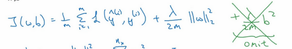

$L2$正則化是最常見的正則化類型，你們可能聽說過$L1$正則化，$L1$正則化，加的不是$L2$範數，而是正則項$\frac{\lambda}{m}$乘以$\sum_{j= 1}^{n_{x}}{|w|}$，$\sum_{j =1}^{n_{x}}{|w|}$也被稱為參數$w$向量的$L1$範數，無論分母是$m$還是$2m$，它都是一個比例常量。

如果用的是$L1$正則化，$w$最終會是稀疏的，也就是說$w$向量中有很多0，有人說這樣有利於壓縮模型，因為集合中參數均為0，存儲模型所占用的記憶體更少。實際上，雖然$L1$正則化使模型變得稀疏，卻沒有降低太多存儲記憶體，所以我認為這並不是$L1$正則化的目的，至少不是為了壓縮模型，人們在訓練網路時，越來越傾向於使用$L2$正則化。

我們來看最後一個細節，$\lambda$是正則化參數，我們通常使用驗證集或交叉驗證集來配置這個參數，嘗試各式各樣的數據，尋找最好的參數，我們要考慮訓練集之間的權衡，把參數設置為較小值，這樣可以避免過擬合，所以λ是另外一個需要調整的超級參數，順便說一下，為了方便寫程式碼，在**Python**程式語言中，$\lambda$是一個保留欄位，編寫程式碼時，我們刪掉$a$，寫成$lambd$，以免與**Python**中的保留欄位衝突，這就是在邏輯回歸函數中實現$L2$正則化的過程，如何在神經網路中實現$L2$正則化呢？

神經網路含有一個成本函數，該函數包含$W^{[1]}$，$b^{[1]}$到$W^{[l]}$，$b^{[l]}$所有參數，字母$L$是神經網路所含的層數，因此成本函數等於$m$個訓練樣本損失函數的總和乘以$\frac{1}{m}$，正則項為$\frac{\lambda }{2m}{{\sum\nolimits_{1}^{L}{| {{W}^{[l]}}|}}^{2}}$，我們稱${||W^{\left[l\right]}||}^{2}$為範數平方，這個矩陣範數${||W^{\left[l\right]}||}^{2}$（即平方範數），被定義為矩陣中所有元素的平方求和，

我們看下求和公式的具體參數，第一個求和符號其值$i$從1到$n^{[l - 1]}$，第二個其$J$值從1到$n^{[l]}$，因為$W$是一個$n^{[l]}\times n^{[l-1]}$的多維矩陣，$n^{[l]}$表示$l$ 層單元的數量，$n^{[l-1]}$表示第$l-1$層隱藏單元的數量。

該矩陣範數被稱作“弗羅貝尼烏斯範數”，用下標$F$標註”，鑑於線性代數中一些神秘晦澀的原因，我們不稱之為“矩陣$L2$範數”，而稱它為“弗羅貝尼烏斯範數”，矩陣$L2$範數聽起來更自然，但鑑於一些大家無須知道的特殊原因，按照慣例，我們稱之為“弗羅貝尼烏斯範數”，它表示一個矩陣中所有元素的平方和。

該如何使用該範數實現梯度下降呢？

用**backprop**計算出$dW​$的值，**backprop**會給出$J$對​$W$的偏導數，實際上是​$ W^{[l]}$，把​$W^{[l]}$替換為​$W^{[l]}$減去學習率乘以​$dW$。

這就是之前我們額外增加的正則化項，既然已經增加了這個正則項，現在我們要做的就是給$dW$加上這一項$\frac {\lambda}{m}W^{[l]}$，然後計算這個更新項，使用新定義的$dW^{[l]}$，它的定義含有相關參數代價函數導數和，以及最後添加的額外正則項，這也是$L2$正則化有時被稱為“權重衰減”的原因。

我們用$ dW^{[l]}$的定義替換此處的$dW^{[l]}$，可以看到，$W^{[l]}$的定義被更新為$W^{[l]}$減去學習率$\alpha$ 乘以**backprop** 再加上$\frac{\lambda}{m}W^{[l]}$。

該正則項說明，不論$W^{[l]}$是什麼，我們都試圖讓它變得更小，實際上，相當於我們給矩陣W乘以$(1 - \alpha\frac{\lambda}{m})$倍的權重，矩陣$W$減去$\alpha\frac{\lambda}{m}$倍的它，也就是用這個係數$(1-\alpha\frac{\lambda}{m})$乘以矩陣$W$，該係數小於1，因此$L2$範數正則化也被稱為“權重衰減”，因為它就像一般的梯度下降，$W$被更新為少了$\alpha$乘以**backprop**輸出的最初梯度值，同時$W$也乘以了這個係數，這個係數小於1，因此$L2$正則化也被稱為“權重衰減”。

我不打算這麼叫它，之所以叫它“權重衰減”是因為這兩項相等，權重指標乘以了一個小於1的係數。

以上就是在神經網路中應用$L2$正則化的過程，有人會問我，為什麼正則化可以預防過擬合，我們放在下節課講，同時直觀感受一下正則化是如何預防過擬合的。

### 1.5 為什麼正則化有利於預防過擬合呢？（Why regularization reduces overfitting?）

為什麼正則化有利於預防過擬合呢？為什麼它可以減少方差問題？我們透過兩個例子來直觀體會一下。

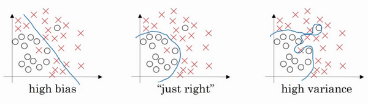

左圖是高偏差，右圖是高方差，中間是**Just Right**，這幾張圖我們在前面課程中看到過。

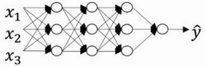

現在我們來看下這個龐大的深度擬合神經網路。我知道這張圖不夠大，深度也不夠，但你可以想像這是一個過擬合的神經網路。這是我們的代價函數$J$，含有參數$W$，$b$。我們添加正則項，它可以避免數據權值矩陣過大，這就是弗羅貝尼烏斯範數，為什麼壓縮$L2$範數，或者弗羅貝尼烏斯範數或者參數可以減少過擬合？

直觀上理解就是如果正則化$\lambda$設置得足夠大，權重矩陣$W$被設置為接近於0的值，直觀理解就是把多隱藏單元的權重設為0，於是基本上消除了這些隱藏單元的許多影響。如果是這種情況，這個被大大簡化了的神經網路會變成一個很小的網路，小到如同一個邏輯回歸單元，可是深度卻很大，它會使這個網路從過度擬合的狀態更接近左圖的高偏差狀態。

但是$\lambda$會存在一個中間值，於是會有一個接近“**Just Right**”的中間狀態。

直觀理解就是$\lambda$增加到足夠大，$W$會接近於0，實際上是不會發生這種情況的，我們嘗試消除或至少減少許多隱藏單元的影響，最終這個網路會變得更簡單，這個神經網路越來越接近邏輯回歸，我們直覺上認為大量隱藏單元被完全消除了，其實不然，實際上是該神經網路的所有隱藏單元依然存在，但是它們的影響變得更小了。神經網路變得更簡單了，好像這樣更不容易發生過擬合，因此我不確定這個直覺經驗是否有用，不過在編程中執行正則化時，你實際看到一些方差減少的結果。

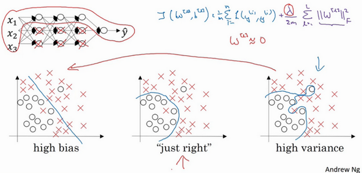

我們再來直觀感受一下，正則化為什麼可以預防過擬合，假設我們用的是這樣的雙曲線啟動函數。

用$g(z)$表示$tanh(z)$，我們發現如果 _z_ 非常小，比如 _z_ 只涉及很小範圍的參數（圖中原點附近的紅色區域），這裡我們利用了雙曲正切函數的線性狀態，只要$z$可以擴展為這樣的更大值或者更小值，啟動函數開始變得非線性。

現在你應該摒棄這個直覺，如果正則化參數λ很大，啟動函數的參數會相對較小，因為代價函數中的參數變大了，如果$W$很小，

如果$W$很小，相對來說，$z$也會很小。

特別是，如果$z$的值最終在這個範圍內，都是相對較小的值，$g(z)$大致呈線性，每層幾乎都是線性的，和線性回歸函數一樣。

第一節課我們講過，如果每層都是線性的，那麼整個網路就是一個線性網路，即使是一個非常深的深層網路，因具有線性啟動函數的特徵，最終我們只能計算線性函數，因此，它不適用於非常複雜的決策，以及過度擬合數據集的非線性決策邊界，如同我們在幻燈片中看到的過度擬合高方差的情況。

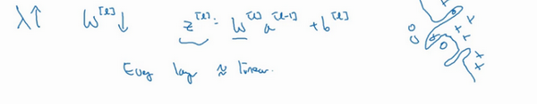

總結一下，如果正則化參數變得很大，參數$W$很小，$z$也會相對變小，此時忽略$b$的影響，$z$會相對變小，實際上，$z$的取值範圍很小，這個啟動函數，也就是曲線函數$tanh$會相對呈線性，整個神經網路會計算離線性函數近的值，這個線性函數非常簡單，並不是一個極複雜的高度非線性函數，不會發生過擬合。

大家在編程作業裡實現正則化的時候，會親眼看到這些結果，總結正則化之前，我給大家一個執行方面的小建議，在增加正則化項時，應用之前定義的代價函數$J$，我們做過修改，增加了一項，目的是預防權重過大。

如果你使用的是梯度下降函數，在除錯梯度下降時，其中一步就是把代價函數$J$設計成這樣一個函數，在除錯梯度下降時，它代表梯度下降的調幅數量。可以看到，代價函數對於梯度下降的每個調幅都單調遞減。如果你實施的是正則化函數，請牢記，$J$已經有一個全新的定義。如果你用的是原函數$J$，也就是這第一個項正則化項，你可能看不到單調遞減現象，為了除錯梯度下降，請務必使用新定義的$J$函數，它包含第二個正則化項，否則函數$J$可能不會在所有調幅範圍內都單調遞減。

這就是$L2$正則化，它是我在訓練深度學習模型時最常用的一種方法。在深度學習中，還有一種方法也用到了正則化，就是**dropout**正則化，我們下節課再講。

### 1.6 dropout 正則化（Dropout Regularization）

除了$L2$正則化，還有一個非常實用的正則化方法——“**Dropout**（隨機失活）”，我們來看看它的工作原理。

假設你在訓練上圖這樣的神經網路，它存在過擬合，這就是**dropout**所要處理的，我們複製這個神經網路，**dropout**會遍歷網路的每一層，並設置消除神經網路中節點的機率。假設網路中的每一層，每個節點都以拋硬幣的方式設置機率，每個節點得以保留和消除的機率都是0.5，設置完節點機率，我們會消除一些節點，然後刪除掉從該節點進出的連線，最後得到一個節點更少，規模更小的網路，然後用**backprop**方法進行訓練。

這是網路節點精簡後的一個樣本，對於其它樣本，我們照舊以拋硬幣的方式設置機率，保留一類節點集合，刪除其它類型的節點集合。對於每個訓練樣本，我們都將採用一個精簡後神經網路來訓練它，這種方法似乎有點怪，單純遍歷節點，編碼也是隨機的，可它真的有效。不過可想而知，我們針對每個訓練樣本訓練規模小得多的網路，最後你可能會認識到為什麼要正則化網路，因為我們在訓練規模小得多的網路。

如何實施**dropout**呢？方法有幾種，接下來我要講的是最常用的方法，即**inverted dropout**（反向隨機失活），出於完整性考慮，我們用一個三層（$l=3$）網路來舉例說明。編碼中會有很多涉及到3的地方。我只舉例說明如何在某一層中實施**dropout**。

首先要定義向量$d$，$d^{[3]}$表示網路第三層的**dropout**向量：

`d3 = np.random.rand(a3.shape[0],a3.shape[1])`

然後看它是否小於某數，我們稱之為**keep-prob**，**keep-prob**是一個具體數字，上個範例中它是0.5，而本例中它是0.8，它表示保留某個隱藏單元的機率，此處**keep-prob**等於0.8，它意味著消除任意一個隱藏單元的機率是0.2，它的作用就是生成隨機矩陣，如果對$a^{[3]}$進行因子分解，效果也是一樣的。$d^{[3]}$是一個矩陣，每個樣本和每個隱藏單元，其中$d^{[3]}$中的對應值為1的機率都是0.8，對應為0的機率是0.2，隨機數字小於0.8。它等於1的機率是0.8，等於0的機率是0.2。

接下來要做的就是從第三層中獲取啟動函數，這裡我們叫它$a^{[3]}$，$a^{[3]}$含有要計算的啟動函數，$a^{[3]}$等於上面的$a^{[3]}$乘以$d^{[3]}$，`a3 =np.multiply(a3,d3)`，這裡是元素相乘，也可寫為$a3*=d3$，它的作用就是讓$d^{[3]}$中所有等於0的元素（輸出），而各個元素等於0的機率只有20%，乘法運算最終把$d^{\left\lbrack3 \right]}$中相應元素輸出，即讓$d^{[3]}$中0元素與$a^{[3]}$中相對元素歸零。

如果用**python**實現該算法的話，$d^{[3]}$則是一個布爾型數組，值為**true**和**false**，而不是1和0，乘法運算依然有效，**python**會把**true**和**false**翻譯為1和0，大家可以用**python**嘗試一下。

最後，我們向外擴展$a^{[3]}$，用它除以0.8，或者除以**keep-prob**參數。

下面我解釋一下為什麼要這麼做，為方便起見，我們假設第三隱藏層上有50個單元或50個神經元，在一維上$a^{[3]}$是50，我們透過因子分解將它拆分成$50×m$維的，保留和刪除它們的機率分別為80%和20%，這意味著最後被刪除或歸零的單元平均有10（50×20%=10）個，現在我們看下$z^{\lbrack4]}$，$z^{[4]} = w^{[4]} a^{[3]} + b^{[4]}$，我們的預期是，$a^{[3]}$減少20%，也就是說$a^{[3]}$中有20%的元素被歸零，為了不影響$z^{\lbrack4]}$的期望值，我們需要用$w^{[4]} a^{[3]}/0.8$，它將會修正或彌補我們所需的那20%，$a^{[3]}$的期望值不會變，劃線部分就是所謂的**dropout**方法。

它的功能是，不論**keep-prop**的值是多少0.8，0.9甚至是1，如果**keep-prop**設置為1，那麼就不存在**dropout**，因為它會保留所有節點。反向隨機失活（**inverted dropout**）方法通過除以**keep-prob**，確保$a^{[3]}$的期望值不變。

事實證明，在測試階段，當我們評估一個神經網路時，也就是用綠線框標註的反向隨機失活方法，使測試階段變得更容易，因為它的數據擴展問題變少，我們將在下節課討論。

據我了解，目前實施**dropout**最常用的方法就是**Inverted dropout**，建議大家動手實踐一下。**Dropout**早期的疊代版本都沒有除以**keep-prob**，所以在測試階段，平均值會變得越來越複雜，不過那些版本已經不再使用了。

現在你使用的是$d$向量，你會發現，不同的訓練樣本，清除不同的隱藏單元也不同。實際上，如果你通過相同訓練集多次傳遞數據，每次訓練數據的梯度不同，則隨機對不同隱藏單元歸零，有時卻並非如此。比如，需要將相同隱藏單元歸零，第一次疊代梯度下降時，把一些隱藏單元歸零，第二次疊代梯度下降時，也就是第二次遍歷訓練集時，對不同類型的隱藏層單元歸零。向量$d$或$d^{[3]}$用來決定第三層中哪些單元歸零，無論用**foreprop**還是**backprop**，這裡我們只介紹了**foreprob**。

如何在測試階段訓練算法，在測試階段，我們已經給出了$x$，或是想預測的變數，用的是標準計數法。我用$a^{\lbrack0]}$，第0層的啟動函數標註為測試樣本$x$，我們在測試階段不使用**dropout**函數，尤其是像下列情況：

$z^{[1]} = w^{[1]} a^{[0]} + b^{[1]}$

$a^{[1]} = g^{[1]}(z^{[1]})$

$z^{[2]} = \ w^{[2]} a^{[1]} + b^{[2]}$

$a^{[2]} = \ldots$

以此類推直到最後一層，預測值為$\hat{y}$。

顯然在測試階段，我們並未使用**dropout**，自然也就不用拋硬幣來決定失活機率，以及要消除哪些隱藏單元了，因為在測試階段進行預測時，我們不期望輸出結果是隨機的，如果測試階段應用**dropout**函數，預測會受到干擾。理論上，你只需要多次運行預測處理過程，每一次，不同的隱藏單元會被隨機歸零，預測處理遍歷它們，但計算效率低，得出的結果也幾乎相同，與這個不同程序產生的結果極為相似。

**Inverted dropout**函數在除以**keep-prob**時可以記住上一步的操作，目的是確保即使在測試階段不執行**dropout**來調整數值範圍，啟動函數的預期結果也不會發生變化，所以沒必要在測試階段額外添加尺度參數，這與訓練階段不同。

$l=keep-prob$

這就是**dropout**，大家可以透過本週的程式練習來執行這個函數，親身實踐一下。

為什麼**dropout**會起作用呢？下節課我們將更加直觀地了解**dropout**的具體功能。

### 1.7 理解 dropout（Understanding Dropout）

**Dropout**可以隨機刪除網路中的神經單元，他為什麼可以透過正則化發揮如此大的作用呢？

直觀上理解：不要依賴於任何一個特徵，因為該單元的輸入可能隨時被清除，因此該單元透過這種方式傳播下去，並為單元的四個輸入增加一點權重，通過傳播所有權重，**dropout**將產生收縮權重的平方範數的效果，和之前講的$L2$正則化類似；實施**dropout**的結果實它會壓縮權重，並完成一些預防過擬合的外層正則化；$L2$對不同權重的衰減是不同的，它取決於啟動函數倍增的大小。

總結一下，**dropout**的功能類似於$L2$正則化，與$L2$正則化不同的是應用方式不同會帶來一點點小變化，甚至更適用於不同的輸入範圍。

第二個直觀認識是，我們從單個神經元入手，如圖，這個單元的工作就是輸入並生成一些有意義的輸出。通過**dropout**，該單元的輸入幾乎被消除，有時這兩個單元會被刪除，有時會刪除其它單元，就是說，我用紫色圈起來的這個單元，它不能依靠任何特徵，因為特徵都有可能被隨機清除，或者說該單元的輸入也都可能被隨機清除。我不願意把所有賭注都放在一個節點上，不願意給任何一個輸入加上太多權重，因為它可能會被刪除，因此該單元將透過這種方式積極地傳播開，並為單元的四個輸入增加一點權重，通過傳播所有權重，**dropout**將產生收縮權重的平方範數的效果，和我們之前講過的$L2$正則化類似，實施**dropout**的結果是它會壓縮權重，並完成一些預防過擬合的外層正則化。

事實證明，**dropout**被正式地作為一種正則化的替代形式，$L2$對不同權重的衰減是不同的，它取決於倍增的啟動函數的大小。

總結一下，**dropout**的功能類似於$L2$正則化，與$L2$正則化不同的是，被應用的方式不同，**dropout**也會有所不同，甚至更適用於不同的輸入範圍。

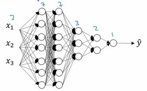

實施**dropout**的另一個細節是，這是一個擁有三個輸入特徵的網路，其中一個要選擇的參數是**keep-prob**，它代表每一層上保留單元的機率。所以不同層的**keep-prob**也可以變化。第一層，矩陣$W^{[1]}$是7×3，第二個權重矩陣$W^{[2]}$是7×7，第三個權重矩陣$W^{[3]}$是3×7，以此類推，$W^{[2]}$是最大的權重矩陣，因為$W^{[2]}$擁有最大參數集，即7×7，為了預防矩陣的過擬合，對於這一層，我認為這是第二層，它的**keep-prob**值應該相對較低，假設是0.5。對於其它層，過擬合的程度可能沒那麼嚴重，它們的**keep-prob**值可能高一些，可能是0.7，這裡是0.7。如果在某一層，我們不必擔心其過擬合的問題，那麼**keep-prob**可以為1，為了表達清除，我用紫色線筆把它們圈出來，每層**keep-prob**的值可能不同。

注意**keep-prob**的值是1，意味著保留所有單元，並且不在這一層使用**dropout**，對於有可能出現過擬合，且含有諸多參數的層，我們可以把**keep-prob**設置成比較小的值，以便應用更強大的**dropout**，有點像在處理$L2$正則化的正則化參數$\lambda$，我們嘗試對某些層施行更多正則化，從技術上講，我們也可以對輸入層應用**dropout**，我們有機會刪除一個或多個輸入特徵，雖然現實中我們通常不這麼做，**keep-prob**的值為1，是非常常用的輸入值，也可以用更大的值，或許是0.9。但是消除一半的輸入特徵是不太可能的，如果我們遵守這個準則，**keep-prob**會接近於1，即使你對輸入層應用**dropout**。

總結一下，如果你擔心某些層比其它層更容易發生過擬合，可以把某些層的**keep-prob**值設置得比其它層更低，缺點是為了使用交叉驗證，你要搜索更多的超級參數，另一種方案是在一些層上應用**dropout**，而有些層不用**dropout**，應用**dropout**的層只含有一個超級參數，就是**keep-prob**。

結束前分享兩個實施過程中的技巧，實施**dropout**，在計算機視覺領域有很多成功的第一次。計算視覺中的輸入量非常大，輸入太多像素，以至於沒有足夠的數據，所以**dropout**在計算機視覺中應用得比較頻繁，有些計算機視覺研究人員非常喜歡用它，幾乎成了預設的選擇，但要牢記一點，**dropout**是一種正則化方法，它有助於預防過擬合，因此除非算法過擬合，不然我是不會使用**dropout**的，所以它在其它領域應用得比較少，主要存在於計算機視覺領域，因為我們通常沒有足夠的數據，所以一直存在過擬合，這就是有些計算機視覺研究人員如此鍾情於**dropout**函數的原因。直觀上我認為不能概括其它學科。

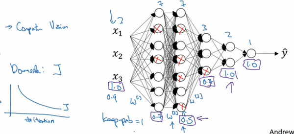

**dropout**一大缺點就是代價函數$J$不再被明確定義，每次疊代，都會隨機移除一些節點，如果再三檢查梯度下降的性能，實際上是很難進行複查的。定義明確的代價函數$J$每次疊代後都會下降，因為我們所最佳化的代價函數$J$實際上並沒有明確定義，或者說在某種程度上很難計算，所以我們失去了除錯工具來繪製這樣的圖片。我通常會關閉**dropout**函數，將**keep-prob**的值設為1，運行程式碼，確保J函數單調遞減。然後打開**dropout**函數，希望在**dropout**過程中，代碼並未引入**bug**。我覺得你也可以嘗試其它方法，雖然我們並沒有關於這些方法性能的數據統計，但你可以把它們與**dropout**方法一起使用。

### 1.8 其他正則化方法（Other regularization methods）

除了$L2$正則化和隨機失活（**dropout**）正則化，還有幾種方法可以減少神經網路中的過擬合:

一.數據擴增

假設你正在擬合貓咪圖片分類器，如果你想透過擴增訓練數據來解決過擬合，但擴增數據代價高，而且有時候我們無法擴增數據，但我們可以透過添加這類圖片來增加訓練集。例如，水平翻轉圖片，並把它添加到訓練集。所以現在訓練集中有原圖，還有翻轉後的這張圖片，所以通過水平翻轉圖片，訓練集則可以增大一倍，因為訓練集有冗餘，這雖然不如我們額外收集一組新圖片那麼好，但這樣做節省了獲取更多貓咪圖片的花費。

除了水平翻轉圖片，你也可以隨意裁剪圖片，這張圖是把原圖旋轉並隨意放大後裁剪的，仍能辨別出圖片中的貓咪。

通過隨意翻轉和裁剪圖片，我們可以增大數據集，額外生成假訓練數據。和全新的，獨立的貓咪圖片數據相比，這些額外的假的數據無法包含像全新數據那麼多的訊息，但我們這麼做基本沒有花費，代價幾乎為零，除了一些對抗性代價。以這種方式擴增算法數據，進而正則化數據集，減少過擬合比較廉價。

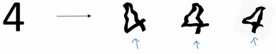

像這樣人工合成數據的話，我們要通過算法驗證，圖片中的貓經過水平翻轉之後依然是貓。大家注意，我並沒有垂直翻轉，因為我們不想上下顛倒圖片，也可以隨機選取放大後的部分圖片，貓可能還在上面。

對於光學字元識別，我們還可以通過添加數字，隨意旋轉或扭曲數字來擴增數據，把這些數字添加到訓練集，它們仍然是數字。為了方便說明，我對字元做了強變形處理，所以數字4看起來是波形的，其實不用對數字4做這麼誇張的扭曲，只要輕微的變形就好，我做成這樣是為了讓大家看的更清楚。實際操作的時候，我們通常對字元做更輕微的變形處理。因為這幾個4看起來有點扭曲。所以，數據擴增可作為正則化方法使用，實際功能上也與正則化相似。

二.**early stopping**

還有另外一種常用的方法叫作**early stopping**，運行梯度下降時，我們可以繪製訓練誤差，或只繪製代價函數$J$的最佳化過程，在訓練集上用0-1記錄分類誤差次數。呈單調下降趨勢，如圖。

因為在訓練過程中，我們希望訓練誤差，代價函數$J$都在下降，通過**early stopping**，我們不但可以繪製上面這些內容，還可以繪製驗證集誤差，它可以是驗證集上的分類誤差，或驗證集上的代價函數，邏輯損失和對數損失等，你會發現，驗證集誤差通常會先呈下降趨勢，然後在某個節點處開始上升，**early stopping**的作用是，你會說，神經網路已經在這個疊代過程中表現得很好了，我們在此停止訓練吧，得到驗證集誤差，它是怎麼發揮作用的？

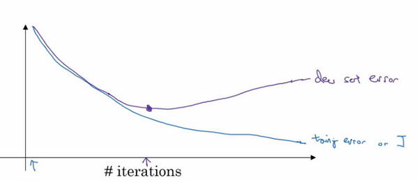

當你還未在神經網路上運行太多疊代過程的時候，參數$w$接近0，因為隨機初始化$w$值時，它的值可能都是較小的隨機值，所以在你長期訓練神經網路之前$w$依然很小，在疊代過程和訓練過程中$w$的值會變得越來越大，比如在這裡，神經網路中參數$w$的值已經非常大了，所以**early stopping**要做就是在中間點停止疊代過程，我們得到一個$w$值中等大小的弗羅貝尼烏斯範數，與$L2$正則化相似，選擇參數w範數較小的神經網路，但願你的神經網路過度擬合不嚴重。

術語**early stopping**代表提早停止訓練神經網路，訓練神經網路時，我有時會用到**early stopping**，但是它也有一個缺點，我們來了解一下。

我認為機器學習過程包括幾個步驟，其中一步是選擇一個算法來最佳化代價函數$J$，我們有很多種工具來解決這個問題，如梯度下降，後面我會介紹其它算法，例如**Momentum**，**RMSprop**和**Adam**等等，但是最佳化代價函數$J$之後，我也不想發生過擬合，也有一些工具可以解決該問題，比如正則化，擴增數據等等。

在機器學習中，超級參數激增，選出可行的算法也變得越來越複雜。我發現，如果我們用一組工具最佳化代價函數$J$，機器學習就會變得更簡單，在重點最佳化代價函數$J$時，你只需要留意$w$和$b$，$J(w,b)$的值越小越好，你只需要想辦法減小這個值，其它的不用關注。然後，預防過擬合還有其他任務，換句話說就是減少方差，這一步我們用另外一套工具來實現，這個原理有時被稱為“正交化”。思路就是在一個時間做一個任務，後面課上我會具體介紹正交化，如果你還不了解這個概念，不用擔心。

但對我來說**early stopping**的主要缺點就是你不能獨立地處理這兩個問題，因為提早停止梯度下降，也就是停止了最佳化代價函數$J$，因為現在你不再嘗試降低代價函數$J$，所以代價函數$J$的值可能不夠小，同時你又希望不出現過擬合，你沒有採取不同的方式來解決這兩個問題，而是用一種方法同時解決兩個問題，這樣做的結果是我要考慮的東西變得更複雜。

如果不用**early stopping**，另一種方法就是$L2$正則化，訓練神經網路的時間就可能很長。我發現，這導致超級參數搜索空間更容易分解，也更容易搜索，但是缺點在於，你必須嘗試很多正則化參數$\lambda$的值，這也導致搜索大量$\lambda$值的計算代價太高。

**Early stopping**的優點是，只運行一次梯度下降，你可以找出$w$的較小值，中間值和較大值，而無需嘗試$L2$正則化超級參數$\lambda$的很多值。

如果你還不能完全理解這個概念，沒關係，下節課我們會詳細講解正交化，這樣會更好理解。

雖然$L2$正則化有缺點，可還是有很多人願意用它。吳恩達老師個人更傾向於使用$L2$正則化，嘗試許多不同的$\lambda$值，假設你可以負擔大量計算的代價。而使用**early stopping**也能得到相似結果，還不用嘗試這麼多$\lambda$值。

這節課我們講了如何使用數據擴增，以及如何使用**early stopping**降低神經網路中的方差或預防過擬合。

### 1.9 歸一化輸入（Normalizing inputs）

訓練神經網路，其中一個加速訓練的方法就是歸一化輸入。假設一個訓練集有兩個特徵，輸入特徵為2維，歸一化需要兩個步驟：

1. 零均值

2. 歸一化方差；

   我們希望無論是訓練集和測試集都是通過相同的$μ$和$σ^2$定義的數據轉換，這兩個是由訓練集得出來的。

第一步是零均值化，$\mu = \frac{1}{m}\sum_{i =1}^{m}x^{(i)}$，它是一個向量，$x$等於每個訓練數據 $x$減去$\mu$，意思是移動訓練集，直到它完成零均值化。

第二步是歸一化方差，注意特徵$x_{1}$的方差比特徵$x_{2}$的方差要大得多，我們要做的是給$\sigma$賦值，$\sigma^{2}= \frac{1}{m}\sum_{i =1}^{m}{({x^{(i)})}^{2}}$，這是節點$y$ 的平方，$\sigma^{2}$是一個向量，它的每個特徵都有方差，注意，我們已經完成零值均化，$({x^{(i)})}^{2}$元素$y^{2}$就是方差，我們把所有數據除以向量$\sigma^{2}$，最後變成上圖形式。

$x_{1}$和$x_{2}$的方差都等於1。提示一下，如果你用它來調整訓練數據，那麼用相同的 $μ$ 和 $\sigma^{2}$來歸一化測試集。尤其是，你不希望訓練集和測試集的歸一化有所不同，不論$μ$的值是什麼，也不論$\sigma^{2}$的值是什麼，這兩個公式中都會用到它們。所以你要用同樣的方法調整測試集，而不是在訓練集和測試集上分別預估$μ$ 和 $\sigma^{2}$。因為我們希望不論是訓練數據還是測試數據，都是通過相同μ和$\sigma^{2}$定義的相同數據轉換，其中$μ$和$\sigma^{2}$是由訓練集數據計算得來的。

我們為什麼要這麼做呢？為什麼我們想要歸一化輸入特徵，回想一下右上角所定義的代價函數。

$J(w,b)=\frac{1}{m}\sum\limits_{i=1}^{m}{L({{{\hat{y}}}^{(i)}},{{y}^{(i)}})}$

如果你使用非歸一化的輸入特徵，代價函數會像這樣：

這是一個非常細長狹窄的代價函數，你要找的最小值應該在這裡。但如果特徵值在不同範圍，假如$x_{1}$取值範圍從1到1000，特徵$x_{2}$的取值範圍從0到1，結果是參數$w_{1}$和$w_{2}$值的範圍或比率將會非常不同，這些數據軸應該是$w_{1}$和$w_{2}$，但直觀理解，我標記為$w$和$b$，代價函數就有點像狹長的碗一樣，如果你能畫出該函數的部分輪廓，它會是這樣一個狹長的函數。

然而如果你歸一化特徵，代價函數平均起來看更對稱，如果你在上圖這樣的代價函數上運行梯度下降法，你必須使用一個非常小的學習率。因為如果是在這個位置，梯度下降法可能需要多次疊代過程，直到最後找到最小值。但如果函數是一個更圓的球形輪廓，那麼不論從哪個位置開始，梯度下降法都能夠更直接地找到最小值，你可以在梯度下降法中使用較大步長，而不需要像在左圖中那樣反覆執行。

當然，實際上$w$是一個高維向量，因此用二維繪製$w$並不能正確地傳達並直觀理解，但總地直觀理解是代價函數會更圓一些，而且更容易最佳化，前提是特徵都在相似範圍內，而不是從1到1000，0到1的範圍，而是在-1到1範圍內或相似偏差，這使得代價函數$J$最佳化起來更簡單快速。

實際上如果假設特徵$x_{1}$範圍在0-1之間，$x_{2}$的範圍在-1到1之間，$x_{3}$範圍在1-2之間，它們是相似範圍，所以會表現得很好。

當它們在非常不同的取值範圍內，如其中一個從1到1000，另一個從0到1，這對最佳化算法非常不利。但是僅將它們設置為均化零值，假設方差為1，就像上一張幻燈片裡設定的那樣，確保所有特徵都在相似範圍內，通常可以幫助學習算法運行得更快。

所以如果輸入特徵處於不同範圍內，可能有些特徵值從0到1，有些從1到1000，那麼歸一化特徵值就非常重要了。如果特徵值處於相似範圍內，那麼歸一化就不是很重要了。執行這類歸一化並不會產生什麼危害，我通常會做歸一化處理，雖然我不確定它能否提高訓練或算法速度。

這就是歸一化特徵輸入，下節課我們將繼續討論提升神經網路訓練速度的方法。

### 1.10 梯度消失/梯度爆炸（Vanishing / Exploding gradients）

訓練神經網路，尤其是深度神經所面臨的一個問題就是梯度消失或梯度爆炸，也就是你訓練神經網路的時候，導數或坡度有時會變得非常大，或者非常小，甚至於以指數方式變小，這加大了訓練的難度。

這節課，你將會了解梯度消失或梯度爆炸的真正含義，以及如何更明智地選擇隨機初始化權重，從而避免這個問題。
假設你正在訓練這樣一個極深的神經網路，為了節約幻燈片上的空間，我畫的神經網路每層只有兩個隱藏單元，但它可能含有更多，但這個神經網路會有參數$W^{[1]}$，$W^{[2]}$，$W^{[3]}$等等，直到$W^{[l]}$，為了簡單起見，假設我們使用啟動函數$g(z)=z$，也就是線性啟動函數，我們忽略$b$，假設$b^{[l]}$=0，如果那樣的話，輸出$ y=W^{[l]}W^{[L -1]}W^{[L - 2]}\ldots W^{[3]}W^{[2]}W^{[1]}x$，如果你想考驗我的數學水平，$W^{[1]} x = z^{[1]}$，因為$b=0$，所以我想$z^{[1]} =W^{[1]} x$，$a^{[1]} = g(z^{[1]})$，因為我們使用了一個線性啟動函數，它等於$z^{[1]}$，所以第一項$W^{[1]} x = a^{[1]}$，通過推理，你會得出$W^{[2]}W^{[1]}x =a^{[2]}$，因為$a^{[2]} = g(z^{[2]})$，還等於$g(W^{[2]}a^{[1]})$，可以用$W^{[1]}x$替換$a^{[1]}$，所以這一項就等於$a^{[2]}$，這個就是$a^{[3]}$($W^{[3]}W^{[2]}W^{[1]}x$)。

所有這些矩陣數據傳遞的協議將給出$\hat y$而不是$y$的值。

假設每個權重矩陣$W^{[l]} = \begin{bmatrix} 1.5 & 0 \\0 & 1.5 \\\end{bmatrix}$，從技術上來講，最後一項有不同維度，可能它就是餘下的權重矩陣，$y= W^{[1]}\begin{bmatrix} 1.5 & 0 \\ 0 & 1.5 \\\end{bmatrix}^{(L -1)}x$，因為我們假設所有矩陣都等於它，它是1.5倍的單位矩陣，最後的計算結果就是$\hat{y}$，$\hat{y}$也就是等於${1.5}^{(L-1)}x$。如果對於一個深度神經網路來說$L$值較大，那麼$\hat{y}$的值也會非常大，實際上它呈指數級增長的，它增長的比率是${1.5}^{L}$，因此對於一個深度神經網路，$y$的值將爆炸式增長。

相反的，如果權重是0.5，$W^{[l]} = \begin{bmatrix} 0.5& 0 \\ 0 & 0.5 \\ \end{bmatrix}$，它比1小，這項也就變成了${0.5}^{L}$，矩陣$y= W^{[1]}\begin{bmatrix} 0.5 & 0 \\ 0 & 0.5 \\\end{bmatrix}^{(L - 1)}x$，再次忽略$W^{[L]}$，因此每個矩陣都小於1，假設$x_{1}$和$x_{2}$都是1，啟動函數將變成$\frac{1}{2}$，$\frac{1}{2}$，$\frac{1}{4}$，$\frac{1}{4}$，$\frac{1}{8}$，$\frac{1}{8}$等，直到最後一項變成$\frac{1}{2^{L}}$，所以作為自訂函數，啟動函數的值將以指數級下降，它是與網路層數數量$L$相關的函數，在深度網路中，啟動函數以指數級遞減。

我希望你得到的直觀理解是，權重$W​$只比1略大一點，或者說只是比單位矩陣大一點，深度神經網路的啟動函數將爆炸式增長，如果$W​$比1略小一點，可能是$\begin{bmatrix}0.9 & 0 \\ 0 & 0.9 \\ \end{bmatrix}​$。

在深度神經網路中，啟動函數將以指數級遞減，雖然我只是討論了啟動函數以與$L$相關的指數級數增長或下降，它也適用於與層數$L$相關的導數或梯度函數，也是呈指數級增長或呈指數遞減。

對於當前的神經網路，假設$L=150$，最近**Microsoft**對152層神經網路的研究取得了很大進展，在這樣一個深度神經網路中，如果啟動函數或梯度函數以與$L$相關的指數增長或遞減，它們的值將會變得極大或極小，從而導致訓練難度上升，尤其是梯度指數小於$L$時，梯度下降算法的步長會非常非常小，梯度下降算法將花費很長時間來學習。

總結一下，我們講了深度神經網路是如何產生梯度消失或爆炸問題的，實際上，在很長一段時間內，它曾是訓練深度神經網路的阻力，雖然有一個不能徹底解決此問題的解決方案，但是已在如何選擇初始化權重問題上提供了很多幫助。

### 1.11 神經網路的權重初始化（Weight Initialization for Deep NetworksVanishing / Exploding gradients）

上節課，我們學習了深度神經網路如何產生梯度消失和梯度爆炸問題，最終針對該問題，我們想出了一個不完整的解決方案，雖然不能徹底解決問題，卻很有用，有助於我們為神經網路更謹慎地選擇隨機初始化參數，為了更好地理解它，我們先舉一個神經單元初始化地例子，然後再演變到整個深度網路。

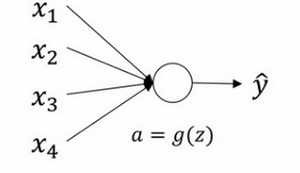

我們來看看只有一個神經元的情況，然後才是深度網路。

單個神經元可能有4個輸入特徵，從$x_{1}$到$x_{4}$，經過$a=g(z)$處理，最終得到$\hat{y}$，稍後講深度網路時，這些輸入表示為$a^{[l]}$，暫時我們用$x$表示。

$z = w_{1}x_{1} + w_{2}x_{2} + \ldots +w_{n}x_{n}$，$b=0$，暫時忽略$b$，為了預防$z$值過大或過小，你可以看到$n$越大，你希望$w_{i}$越小，因為$z$是$w_{i}x_{i}$的和，如果你把很多此類項相加，希望每項值更小，最合理的方法就是設置$w_{i}=\frac{1}{n}$，$n$表示神經元的輸入特徵數量，實際上，你要做的就是設置某層權重矩陣$w^{[l]} = np.random.randn( \text{shape})*\text{np.}\text{sqrt}(\frac{1}{n^{[l-1]}})$，$n^{[l - 1]}$就是我餵給第$l$層神經單元的數量（即第$l-1$層神經元數量）。

結果，如果你是用的是**Relu**啟動函數，而不是$\frac{1}{n}$，方差設置為$\frac{2}{n}$，效果會更好。你常常發現，初始化時，尤其是使用**Relu**啟動函數時，$g^{[l]}(z) =Relu(z)$,它取決於你對隨機變數的熟悉程度，這是高斯隨機變數，然後乘以它的平方根，也就是引用這個方差$\frac{2}{n}$。這裡，我用的是$n^{[l - 1]}$，因為本例中，邏輯回歸的特徵是不變的。但一般情況下$l$層上的每個神經元都有$n^{[l - 1]}$個輸入。如果啟動函數的輸入特徵被零均值和標準方差化，方差是1，$z$也會調整到相似範圍，這就沒解決問題（梯度消失和爆炸問題）。但它確實降低了梯度消失和爆炸問題，因為它給權重矩陣$w$設置了合理值，你也知道，它不能比1大很多，也不能比1小很多，所以梯度沒有爆炸或消失過快。

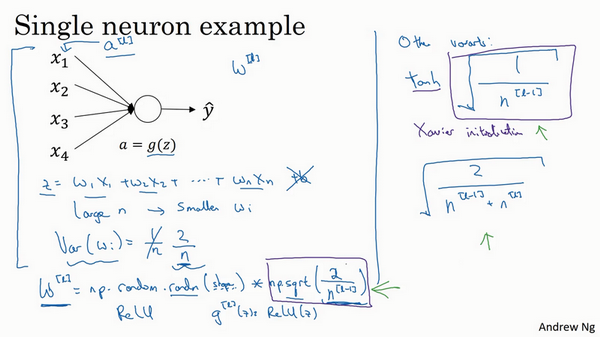

我提到了其它變體函數，剛剛提到的函數是**Relu**啟動函數，一篇由**Herd**等人撰寫的論文曾介紹過。對於幾個其它變體函數，如**tanh**啟動函數，有篇論文提到，常量1比常量2的效率更高，對於**tanh**函數來說，它是$\sqrt{\frac{1}{n^{[l-1]}}}$，這裡平方根的作用與這個公式作用相同($\text{np.}\text{sqrt}(\frac{1}{n^{[l-1]}})$)，它適用於**tanh**啟動函數，被稱為**Xavier**初始化。**Yoshua Bengio**和他的同事還提出另一種方法，你可能在一些論文中看到過，它們使用的是公式$\sqrt{\frac{2}{n^{[l-1]} + n^{\left[l\right]}}}$。其它理論已對此證明，但如果你想用**Relu**啟動函數，也就是最常用的啟動函數，我會用這個公式$\text{np.}\text{sqrt}(\frac{2}{n^{[l-1]}})$，如果使用**tanh**函數，可以用公式$\sqrt{\frac{1}{n^{[l-1]}}}$，有些作者也會使用這個函數。

實際上，我認為所有這些公式只是給你一個起點，它們給出初始化權重矩陣的方差的預設值，如果你想添加方差，方差參數則是另一個你需要調整的超級參數，可以給公式$\text{np.}\text{sqrt}(\frac{2}{n^{[l-1]}})$添加一個乘數參數，調優作為超級參數激增一份子的乘子參數。有時調優該超級參數效果一般，這並不是我想調優的首要超級參數，但我發現調優過程中產生的問題，雖然調優該參數能起到一定作用，但考慮到相比調優，其它超級參數的重要性，我通常把它的優先度放得比較低。

希望你現在對梯度消失或爆炸問題以及如何為權重初始化合理值已經有了一個直觀認識，希望你設置的權重矩陣既不會增長過快，也不會太快下降到0，從而訓練出一個權重或梯度不會增長或消失過快的深度網路。我們在訓練深度網路時，這也是一個加快訓練速度的技巧。

### 1.12 梯度的數值逼近（Numerical approximation of gradients）

在實施**backprop**時，有一個測試叫做梯度檢驗，它的作用是確保**backprop**正確實施。因為有時候，你雖然寫下了這些方程式，卻不能100%確定，執行**backprop**的所有細節都是正確的。為了逐漸實現梯度檢驗，我們首先說說如何計算梯度的數值逼近，下節課，我們將討論如何在**backprop**中執行梯度檢驗，以確保**backprop**正確實施。

我們先畫出函數$f$，標記為$f\left( \theta \right)$，$f\left( \theta \right)=\theta^{3}$，先看一下$\theta$的值，假設$\theta=1$，不增大$\theta$的值，而是在$\theta$ 右側，設置一個$\theta +\varepsilon$，在$\theta$左側，設置$\theta -\varepsilon$。因此$\theta=1$，$\theta +\varepsilon =1.01,\theta -\varepsilon =0.99$,，跟以前一樣，$\varepsilon$的值為0.01，看下這個小三角形，計算高和寬的比值，就是更準確的梯度預估，選擇$f$函數在$\theta -\varepsilon$上的這個點，用這個較大三角形的高比上寬，技術上的原因我就不詳細解釋了，較大三角形的高寬比值更接近於$\theta$的導數，把右上角的三角形下移，好像有了兩個三角形，右上角有一個，左下角有一個，我們通過這個綠色大三角形同時考慮了這兩個小三角形。所以我們得到的不是一個單邊公差而是一個雙邊公差。

我們寫一下數據算式，圖中綠色三角形上面的點的值是$f( \theta +\varepsilon )$，下面的點是$f( \theta-\varepsilon)$，這個三角形的高度是$f( \theta +\varepsilon)-f(\theta -\varepsilon)$，這兩個寬度都是ε，所以三角形的寬度是$2\varepsilon$，高寬比值為$\frac{f(\theta + \varepsilon ) - (\theta -\varepsilon)}{2\varepsilon}$，它的期望值接近$g( \theta)$，$f( \theta)=\theta^{3}$傳入參數值，$\frac {f\left( \theta + \varepsilon \right) - f(\theta -\varepsilon)}{2\varepsilon} = \frac{{(1.01)}^{3} - {(0.99)}^{3}}{2 \times0.01}$，大家可以暫停影片，用計算器算算結果，結果應該是3.0001，而前面一張幻燈片上面是，當$\theta =1$時，$g( \theta)=3\theta^{2} =3$，所以這兩個$g(\theta)$值非常接近，逼近誤差為0.0001，前一張幻燈片，我們只考慮了單邊公差，即從$\theta $到$\theta +\varepsilon$之間的誤差，$g( \theta)$的值為3.0301，逼近誤差是0.03，不是0.0001，所以使用雙邊誤差的方法更逼近導數，其結果接近於3，現在我們更加確信，$g( \theta)$可能是$f$導數的正確實現，在梯度檢驗和反向傳播中使用該方法時，最終，它與運行兩次單邊公差的速度一樣，實際上，我認為這種方法還是非常值得使用的，因為它的結果更準確。

這是一些你可能比較熟悉的微積分的理論，如果你不太明白我講的這些理論也沒關係，導數的官方定義是針對值很小的$\varepsilon$，導數的官方定義是$f^{'}\theta) = \operatorname{}\frac{f( \theta + \varepsilon) -f(\theta -\varepsilon)}{2\varepsilon}$，如果你上過微積分課，應該學過無窮盡的定義，我就不在這裡講了。

對於一個非零的$\varepsilon$，它的逼近誤差可以寫成$O(\varepsilon^{2})$，ε值非常小，如果$\varepsilon=0.01$，$\varepsilon^{2}=0.0001$，大寫符號$O$的含義是指逼近誤差其實是一些常量乘以$\varepsilon^{2}$，但它的確是很準確的逼近誤差，所以大寫$O$的常量有時是1。然而，如果我們用另外一個公式逼近誤差就是$O(\varepsilon)$，當$\varepsilon$小於1時，實際上$\varepsilon$比$\varepsilon^{2}$大很多，所以這個公式近似值遠沒有左邊公式的準確，所以在執行梯度檢驗時，我們使用雙邊誤差，即$\frac{f\left(\theta + \varepsilon \right) - f(\theta -\varepsilon)}{2\varepsilon}$，而不使用單邊公差，因為它不夠準確。

如果你不理解上面兩條結論，所有公式都在這裡，不用擔心，如果你對微積分和數值逼近有所了解，這些訊息已經足夠多了，重點是要記住，雙邊誤差公式的結果更準確，下節課我們做梯度檢驗時就會用到這個方法。

今天我們講了如何使用雙邊誤差來判斷別人給你的函數$g( \theta)$，是否正確實現了函數$f$的偏導，現在我們可以使用這個方法來檢驗反向傳播是否得以正確實施，如果不正確，它可能有bug需要你來解決。

### 1.13 梯度檢驗（Gradient checking）

梯度檢驗幫我們節省了很多時間，也多次幫我發現**backprop**實施過程中的bug，接下來，我們看看如何利用它來除錯或檢驗**backprop**的實施是否正確。

假設你的網路中含有下列參數，$W^{[1]}$和$b^{[1]}$……$W^{[l]}$和$b^{[l]}$，為了執行梯度檢驗，首先要做的就是，把所有參數轉換成一個巨大的向量數據，你要做的就是把矩陣$W$轉換成一個向量，把所有$W$矩陣轉換成向量之後，做連接運算，得到一個巨型向量$\theta$，該向量表示為參數$\theta$，代價函數$J$是所有$W$和$b$的函數，現在你得到了一個$\theta$的代價函數$J$（即$J(\theta)$）。接著，你得到與$W$和$b$順序相同的數據，你同樣可以把$dW^{[1]}$和${db}^{[1]}$……${dW}^{[l]}$和${db}^{[l]}$轉換成一個新的向量，用它們來初始化大向量$d\theta$，它與$\theta$具有相同維度。

同樣的，把$dW^{[1]}$轉換成矩陣，$db^{[1]}$已經是一個向量了，直到把${dW}^{[l]}$轉換成矩陣，這樣所有的$dW$都已經是矩陣，注意$dW^{[1]}$與$W^{[1]}$具有相同維度，$db^{[1]}$與$b^{[1]}$具有相同維度。經過相同的轉換和連接運算操作之後，你可以把所有導數轉換成一個大向量$d\theta$，它與$\theta$具有相同維度，現在的問題是$d\theta$和代價函數$J$的梯度或坡度有什麼關係？

這就是實施梯度檢驗的過程，英語裡通常簡稱為“**grad check**”，首先，我們要清楚$J$是超參數$\theta$的一個函數，你也可以將J函數展開為$J(\theta_{1},\theta_{2},\theta_{3},\ldots\ldots)$，不論超級參數向量$\theta$的維度是多少，為了實施梯度檢驗，你要做的就是循環執行，從而對每個$i$也就是對每個$\theta$組成元素計算$d\theta_{\text{approx}}[i]$的值，我使用雙邊誤差，也就是

$d\theta_{\text{approx}}\left[i \right] = \frac{J\left( \theta_{1},\theta_{2},\ldots\theta_{i} + \varepsilon,\ldots \right) - J\left( \theta_{1},\theta_{2},\ldots\theta_{i} - \varepsilon,\ldots \right)}{2\varepsilon}$

只對$\theta_{i}​$增加$\varepsilon​$，其它項保持不變，因為我們使用的是雙邊誤差，對另一邊做同樣的操作，只不過是減去$\varepsilon​$，$\theta​$其它項全都保持不變。

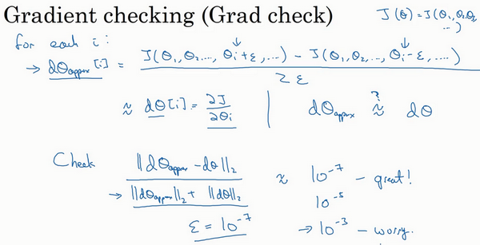

從上節課中我們了解到這個值（$d\theta_{\text{approx}}\left[i \right]$）應該逼近$d\theta\left[i \right]$=$\frac{\partial J}{\partial\theta_{i}}$，$d\theta\left[i \right]$是代價函數的偏導數，然後你需要對i的每個值都執行這個運算，最後得到兩個向量，得到$d\theta$的逼近值$d\theta_{\text{approx}}$，它與$d\theta$具有相同維度，它們兩個與$\theta$具有相同維度，你要做的就是驗證這些向量是否彼此接近。

具體來說，如何定義兩個向量是否真的接近彼此？我一般做下列運算，計算這兩個向量的距離，$d\theta_{\text{approx}}\left[i \right] - d\theta[i]$的歐幾里得範數，注意這裡（${||d\theta_{\text{approx}} -d\theta||}_{2}$）沒有平方，它是誤差平方之和，然後求平方根，得到歐式距離，然後用向量長度歸一化，使用向量長度的歐幾里得範數。分母只是用於預防這些向量太小或太大，分母使得這個方程式變成比率，我們實際執行這個方程式，$\varepsilon$可能為$10^{-7}$，使用這個取值範圍內的$\varepsilon$，如果你發現計算方程式得到的值為$10^{-7}$或更小，這就很好，這就意味著導數逼近很有可能是正確的，它的值非常小。

如果它的值在$10^{-5}$範圍內，我就要小心了，也許這個值沒問題，但我會再次檢查這個向量的所有項，確保沒有一項誤差過大，可能這裡有**bug**。

如果左邊這個方程式結果是$10^{-3}$，我就會擔心是否存在**bug**，計算結果應該比$10^{- 3}$小很多，如果比$10^{-3}$大很多，我就會很擔心，擔心是否存在**bug**。這時應該仔細檢查所有$\theta$項，看是否有一個具體的$i$值，使得$d\theta_{\text{approx}}\left[i \right]$與$ d\theta[i]$大不相同，並用它來追蹤一些求導計算是否正確，經過一些除錯，最終結果會是這種非常小的值（$10^{-7}$），那麼，你的實施可能是正確的。

在實施神經網路時，我經常需要執行**foreprop**和**backprop**，然後我可能發現這個梯度檢驗有一個相對較大的值，我會懷疑存在**bug**，然後開始除錯，除錯，除錯，除錯一段時間後，我得到一個很小的梯度檢驗值，現在我可以很自信的說，神經網路實施是正確的。

現在你已經了解了梯度檢驗的工作原理，它幫助我在神經網路實施中發現了很多**bug**，希望它對你也有所幫助。

### 1.14 梯度檢驗應用的注意事項（Gradient Checking Implementation Notes）

這節課，分享一些關於如何在神經網路實施梯度檢驗的實用技巧和注意事項。

首先，不要在訓練中使用梯度檢驗，它只用於除錯。我的意思是，計算所有$i$值的$d\theta_{\text{approx}}\left[i\right]$是一個非常漫長的計算過程，為了實施梯度下降，你必須使用$W$和$b$ **backprop**來計算$d\theta$，並使用**backprop**來計算導數，只要除錯的時候，你才會計算它，來確認數值是否接近$d\theta$。完成後，你會關閉梯度檢驗，梯度檢驗的每一個疊代過程都不執行它，因為它太慢了。

第二點，如果算法的梯度檢驗失敗，要檢查所有項，檢查每一項，並試著找出**bug**，也就是說，如果$d\theta_{\text{approx}}\left[i\right]$與dθ[i]的值相差很大，我們要做的就是查找不同的i值，看看是哪個導致$d\theta_{\text{approx}}\left[i\right]$與$d\theta\left[i\right]$的值相差這麼多。舉個例子，如果你發現，相對某些層或某層的$\theta$或$d\theta$的值相差很大，但是$\text{dw}^{[l]}$的各項非常接近，注意$\theta$的各項與$b$和$w$的各項都是一一對應的，這時，你可能會發現，在計算參數$b$的導數$db$的過程中存在**bug**。反過來也是一樣，如果你發現它們的值相差很大，$d\theta_{\text{approx}}\left[i\right]$的值與$d\theta\left[i\right]$的值相差很大，你會發現所有這些項目都來自於$dw$或某層的$dw$，可能幫你定位bug的位置，雖然未必能夠幫你準確定位bug的位置，但它可以幫助你估測需要在哪些地方追蹤**bug**。

第三點，在實施梯度檢驗時，如果使用正則化，請注意正則項。如果代價函數$J(\theta) = \frac{1}{m}\sum_{}^{}{L(\hat y^{(i)},y^{(i)})} + \frac{\lambda}{2m}\sum_{}^{}{||W^{[l]}||}^{2}$，這就是代價函數$J$的定義，$d\theta$等於與$\theta$相關的$J$函數的梯度，包括這個正則項，記住一定要包括這個正則項。

第四點，梯度檢驗不能與**dropout**同時使用，因為每次疊代過程中，**dropout**會隨機消除隱藏層單元的不同子集，難以計算**dropout**在梯度下降上的代價函數$J​$。因此**dropout**可作為最佳化代價函數$J​$的一種方法，但是代價函數J被定義為對所有指數極大的節點子集求和。而在任何疊代過程中，這些節點都有可能被消除，所以很難計算代價函數$J​$。你只是對成本函數做抽樣，用**dropout**，每次隨機消除不同的子集，所以很難用梯度檢驗來雙重檢驗**dropout**的計算，所以我一般不同時使用梯度檢驗和**dropout**。如果你想這樣做，可以把**dropout**中的**keepprob**設置為1.0，然後打開**dropout**，並寄希望於**dropout**的實施是正確的，你還可以做點別的，比如修改節點遺失模式確定梯度檢驗是正確的。實際上，我一般不這麼做，我建議關閉**dropout**，用梯度檢驗進行雙重檢查，在沒有**dropout**的情況下，你的算法至少是正確的，然後打開**dropout**。

最後一點，也是比較微妙的一點，現實中幾乎不會出現這種情況。當$w$和$b$接近0時，梯度下降的實施是正確的，在隨機初始化過程中……，但是在運行梯度下降時，$w$和$b$變得更大。可能只有在$w$和$b$接近0時，**backprop**的實施才是正確的。但是當$W$和$b$變大時，它會變得越來越不準確。你需要做一件事，我不經常這麼做，就是在隨機初始化過程中，運行梯度檢驗，然後再訓練網路，$w$和$b$會有一段時間遠離0，如果隨機初始化值比較小，反覆訓練網路之後，再重新運行梯度檢驗。

這就是梯度檢驗，恭喜大家，這是本週最後一課了。回顧這一週，我們講了如何配置訓練集，驗證集和測試集，如何分析偏差和方差，如何處理高偏差或高方差以及高偏差和高方差並存的問題，如何在神經網路中應用不同形式的正則化，如$L2​$正則化和**dropout**，還有加快神經網路訓練速度的技巧，最後是梯度檢驗。這一週我們學習了很多內容，你可以在本週編程作業中多多練習這些概念。祝你好運，期待下週再見。

