第二週：最佳化算法 (Optimization algorithms)
------------------------------------------
[TOC]
### 2.1 Mini-batch 梯度下降（Mini-batch gradient descent）

本週將學習最佳化算法，這能讓你的神經網路運行得更快。機器學習的應用是一個高度依賴經驗的過程，伴隨著大量疊代的過程，你需要訓練諸多模型，才能找到合適的那一個，所以，最佳化算法能夠幫助你快速訓練模型。

其中一個難點在於，深度學習沒有在大數據領域發揮最大的效果，我們可以利用一個巨大的數據集來訓練神經網路，而在巨大的數據集基礎上進行訓練速度很慢。因此，你會發現，使用快速的最佳化算法，使用好用的最佳化算法能夠大大提高你和團隊的效率，那麼，我們首先來談談**mini-batch**梯度下降法。

你之前學過，向量化能夠讓你有效地對所有$m$個樣本進行計算，允許你處理整個訓練集，而無需某個明確的公式。所以我們要把訓練樣本放大巨大的矩陣$X$當中去，$X= \lbrack x^{(1)}\ x^{(2)}\ x^{(3)}\ldots\ldots x^{(m)}\rbrack$，$Y$也是如此，$Y= \lbrack y^{(1)}\ y^{(2)}\ y^{(3)}\ldots \ldots y^{(m)}\rbrack$，所以$X$的維數是$(n_{x},m)$，$Y$的維數是$(1,m)$，向量化能夠讓你相對較快地處理所有$m$個樣本。如果$m$很大的話，處理速度仍然緩慢。比如說，如果$m$是500萬或5000萬或者更大的一個數，在對整個訓練集執行梯度下降法時，你要做的是，你必須處理整個訓練集，然後才能進行一步梯度下降法，然後你需要再重新處理500萬個訓練樣本，才能進行下一步梯度下降法。所以如果你在處理完整個500萬個樣本的訓練集之前，先讓梯度下降法處理一部分，你的算法速度會更快，準確地說，這是你可以做的一些事情。

你可以把訓練集分割為小一點的子集訓練，這些子集被取名為**mini-batch**，假設每一個子集中只有1000個樣本，那麼把其中的$x^{(1)}$到$x^{(1000)}$取出來，將其稱為第一個子訓練集，也叫做**mini-batch**，然後你再取出接下來的1000個樣本，從$x^{(1001)}$到$x^{(2000)}$，然後再取1000個樣本，以此類推。

接下來我要說一個新的符號，把$x^{(1)}$到$x^{(1000)}$稱為$X^{\{1\}}$，$x^{(1001)}$到$x^{(2000)}$稱為$X^{\{2\}}$，如果你的訓練樣本一共有500萬個，每個**mini-batch**都有1000個樣本，也就是說，你有5000個**mini-batch**，因為5000乘以1000就是5000萬。

你共有5000個**mini-batch**，所以最後得到是$X^{\left\{ 5000 \right\}}$

對$Y$也要進行相同處理，你也要相應地拆分$Y$的訓練集，所以這是$Y^{\{1\}}$，然後從$y^{(1001)}$到$y^{(2000)}$，這個叫$Y^{\{2\}}$，一直到$Y^{\{ 5000\}}$。

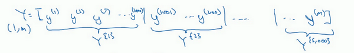

**mini-batch**的數量$t$組成了$X^{\{ t\}}$和$Y^{\{t\}}$，這就是1000個訓練樣本，包含相應的輸入輸出對。

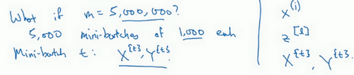

在繼續課程之前，先確定一下我的符號，之前我們使用了上角小括號$(i)$表示訓練集裡的值，所以$x^{(i)}$是第$i$個訓練樣本。我們用了上角中括號$[l]$來表示神經網路的層數，$z^{\lbrack l\rbrack}$表示神經網路中第$l$層的$z$值，我們現在引入了大括號${t}$來代表不同的**mini-batch**，所以我們有$X^{\{ t\}}$和$Y^{\{ t\}}$，檢查一下自己是否理解無誤。

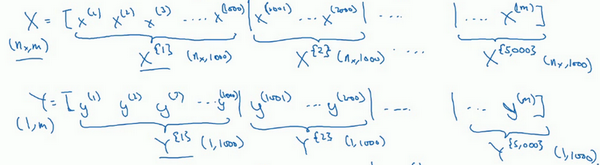

$X^{\{ t\}}$和$Y^{\{ t\}}$的維數：如果$X^{\{1\}}$是一個有1000個樣本的訓練集，或者說是1000個樣本的$x$值，所以維數應該是$(n_{x},1000)$，$X^{\{2\}}$的維數應該是$(n_{x},1000)$，以此類推。因此所有的子集維數都是$(n_{x},1000)$，而這些（$Y^{\{ t\}}$）的維數都是$(1,1000)$。

解釋一下這個算法的名稱，**batch**梯度下降法指的是我們之前講過的梯度下降法算法，就是同時處理整個訓練集，這個名字就是來源於能夠同時看到整個**batch**訓練集的樣本被處理，這個名字不怎麼樣，但就是這樣叫它。

相比之下，**mini-batch**梯度下降法，指的是我們在下一張幻燈片中會講到的算法，你每次同時處理的單個的**mini-batch** $X^{\{t\}}$和$Y^{\{ t\}}$，而不是同時處理全部的$X$和$Y$訓練集。

那麼究竟**mini-batch**梯度下降法的原理是什麼？在訓練集上運行**mini-batch**梯度下降法，你運行`for t=1……5000`，因為我們有5000個各有1000個樣本的組，在**for**循環裡你要做得基本就是對$X^{\{t\}}$和$Y^{\{t\}}$執行一步梯度下降法。假設你有一個擁有1000個樣本的訓練集，而且假設你已經很熟悉一次性處理完的方法，你要用向量化去幾乎同時處理1000個樣本。

首先對輸入也就是$X^{\{ t\}}$，執行前向傳播，然後執行$z^{\lbrack 1\rbrack} =W^{\lbrack 1\rbrack}X + b^{\lbrack 1\rbrack}$，之前我們這裡只有，但是現在你正在處理整個訓練集，你在處理第一個**mini-batch**，在處理**mini-batch**時它變成了$X^{\{ t\}}$，即$z^{\lbrack 1\rbrack} = W^{\lbrack 1\rbrack}X^{\{ t\}} + b^{\lbrack1\rbrack}$，然後執行$A^{[1]k} =g^{[1]}(Z^{[1]})$，之所以用大寫的$Z$是因為這是一個向量內涵，以此類推，直到$A^{\lbrack L\rbrack} = g^{\left\lbrack L \right\rbrack}(Z^{\lbrack L\rbrack})$，這就是你的預測值。注意這裡你需要用到一個向量化的執行命令，這個向量化的執行命令，一次性處理1000個而不是500萬個樣本。接下來你要計算損失成本函數$J$，因為子集規模是1000，$J= \frac{1}{1000}\sum_{i = 1}^{l}{L(\hat y^{(i)},y^{(i)})}$，說明一下，這（$L(\hat y^{(i)},y^{(i)})$）指的是來自於**mini-batch**$X^{\{ t\}}$和$Y^{\{t\}}$中的樣本。

如果你用到了正則化，你也可以使用正則化的術語，$J =\frac{1}{1000}\sum_{i = 1}^{l}{L(\hat y^{(i)},y^{(i)})} +\frac{\lambda}{2 1000}\sum_{l}^{}{||w^{[l]}||}_{F}^{2}$，因為這是一個**mini-batch**的損失，所以我將$J$損失記為上角標$t$，放在大括號裡（$J^{\{t\}} = \frac{1}{1000}\sum_{i = 1}^{l}{L(\hat y^{(i)},y^{(i)})} +\frac{\lambda}{2 1000}\sum_{l}^{}{||w^{[l]}||}_{F}^{2}$）。

你也會注意到，我們做的一切似曾相識，其實跟之前我們執行梯度下降法如出一轍，除了你現在的對象不是$X​$，$Y​$，而是$X^{\{t\}}​$和$Y^{\{ t\}}​$。接下來，你執行反向傳播來計算$J^{\{t\}}​$的梯度，你只是使用$X^{\{ t\}}​$和$Y^{\{t\}}​$，然後你更新加權值，$W​$實際上是$W^{\lbrack l\rbrack}​$，更新為$W^{[l]}:= W^{[l]} - adW^{[l]}​$，對$b​$做相同處理，$b^{[l]}:= b^{[l]} - adb^{[l]}​$。這是使用**mini-batch**梯度下降法訓練樣本的一步，我寫下的代碼也可被稱為進行“一代”（**1 epoch**）的訓練。一代這個詞意味著只是一次遍歷了訓練集。

使用**batch**梯度下降法，一次遍歷訓練集只能讓你做一個梯度下降，使用**mini-batch**梯度下降法，一次遍歷訓練集，能讓你做5000個梯度下降。當然正常來說你想要多次遍歷訓練集，還需要為另一個**while**循環設置另一個**for**循環。所以你可以一直處理遍歷訓練集，直到最後你能收斂到一個合適的精度。

如果你有一個遺失的訓練集，**mini-batch**梯度下降法比**batch**梯度下降法運行地更快，所以幾乎每個研習深度學習的人在訓練巨大的數據集時都會用到，下一個影片中，我們將進一步深度討論**mini-batch**梯度下降法，你也會因此更好地理解它的作用和原理。

### 2.2 理解mini-batch梯度下降法（Understanding mini-batch gradient descent）

在上週影片中，你知道了如何利用**mini-batch**梯度下降法來開始處理訓練集和開始梯度下降，即使你只處理了部分訓練集，即使你是第一次處理，本影片中，我們將進一步學習如何執行梯度下降法，更好地理解其作用和原理。

使用**batch**梯度下降法時，每次疊代你都需要歷遍整個訓練集，可以預期每次疊代成本都會下降，所以如果成本函數$J$是疊代次數的一個函數，它應該會隨著每次疊代而減少，如果$J$在某次疊代中增加了，那肯定出了問題，也許你的學習率太大。

使用**mini-batch**梯度下降法，如果你作出成本函數在整個過程中的圖，則並不是每次疊代都是下降的，特別是在每次疊代中，你要處理的是$X^{\{t\}}$和$Y^{\{ t\}}$，如果要作出成本函數$J^{\{ t\}}$的圖，而$J^{\{t\}}$只和$X^{\{ t\}}$，$Y^{\{t\}}$有關，也就是每次疊代下你都在訓練不同的樣本集或者說訓練不同的**mini-batch**，如果你要作出成本函數$J$的圖，你很可能會看到這樣的結果，走向朝下，但有更多的噪聲，所以如果你作出$J^{\{t\}}$的圖，因為在訓練**mini-batch**梯度下降法時，會經過多代，你可能會看到這樣的曲線。沒有每次疊代都下降是不要緊的，但走勢應該向下，噪聲產生的原因在於也許$X^{\{1\}}$和$Y^{\{1\}}$是比較容易計算的**mini-batch**，因此成本會低一些。不過也許出於偶然，$X^{\{2\}}$和$Y^{\{2\}}$是比較難運算的**mini-batch**，或許你需要一些殘缺的樣本，這樣一來，成本會更高一些，所以才會出現這些擺動，因為你是在運行**mini-batch**梯度下降法作出成本函數圖。

你需要決定的變數之一是**mini-batch**的大小，$m$就是訓練集的大小，極端情況下，如果**mini-batch**的大小等於$m$，其實就是**batch**梯度下降法，在這種極端情況下，你就有了**mini-batch**  $X^{\{1\}}$和$Y^{\{1\}}$，並且該**mini-batch**等於整個訓練集，所以把**mini-batch**大小設為$m$可以得到**batch**梯度下降法。

另一個極端情況，假設**mini-batch**大小為1，就有了新的算法，叫做隨機梯度下降法，每個樣本都是獨立的**mini-batch**，當你看第一個**mini-batch**，也就是$X^{\{1\}}$和$Y^{\{1\}}$，如果**mini-batch**大小為1，它就是你的第一個訓練樣本，這就是你的第一個訓練樣本。接著再看第二個**mini-batch**，也就是第二個訓練樣本，採取梯度下降步驟，然後是第三個訓練樣本，以此類推，一次只處理一個。

看在兩種極端下成本函數的最佳化情況，如果這是你想要最小化的成本函數的輪廓，最小值在那裡，**batch**梯度下降法從某處開始，相對噪聲低些，幅度也大一些，你可以繼續找最小值。

相反，在隨機梯度下降法中，從某一點開始，我們重新選取一個起始點，每次疊代，你只對一個樣本進行梯度下降，大部分時候你向著全局最小值靠近，有時候你會遠離最小值，因為那個樣本恰好給你指的方向不對，因此隨機梯度下降法是有很多噪聲的，平均來看，它最終會靠近最小值，不過有時候也會方向錯誤，因為隨機梯度下降法永遠不會收斂，而是會一直在最小值附近波動，但它並不會在達到最小值並停留在此。

實際上你選擇的**mini-batch**大小在二者之間，大小在1和$m$之間，而1太小了，$m$太大了，原因在於如果使用**batch**梯度下降法，**mini-batch**的大小為$m$，每個疊代需要處理大量訓練樣本，該算法的主要弊端在於特別是在訓練樣本數量巨大的時候，單次疊代耗時太長。如果訓練樣本不大，**batch**梯度下降法運行地很好。

相反，如果使用隨機梯度下降法，如果你只要處理一個樣本，那這個方法很好，這樣做沒有問題，通過減小學習率，噪聲會被改善或有所減小，但隨機梯度下降法的一大缺點是，你會失去所有向量化帶給你的加速，因為一次性只處理了一個訓練樣本，這樣效率過於低下，所以實踐中最好選擇不大不小的**mini-batch**尺寸，實際上學習率達到最快。你會發現兩個好處，一方面，你得到了大量向量化，上個影片中我們用過的例子中，如果**mini-batch**大小為1000個樣本，你就可以對1000個樣本向量化，比你一次性處理多個樣本快得多。另一方面，你不需要等待整個訓練集被處理完就可以開始進行後續工作，再用一下上個影片的數字，每次訓練集允許我們採取5000個梯度下降步驟，所以實際上一些位於中間的**mini-batch**大小效果最好。

用**mini-batch**梯度下降法，我們從這裡開始，一次疊代這樣做，兩次，三次，四次，它不會總朝向最小值靠近，但它比隨機梯度下降要更持續地靠近最小值的方向，它也不一定在很小的範圍內收斂或者波動，如果出現這個問題，可以慢慢減少學習率，我們在下個影片會講到學習率衰減，也就是如何減小學習率。

如果**mini-batch**大小既不是1也不是$m$，應該取中間值，那應該怎麼選擇呢？其實是有指導原則的。

首先，如果訓練集較小，直接使用**batch**梯度下降法，樣本集較小就沒必要使用**mini-batch**梯度下降法，你可以快速處理整個訓練集，所以使用**batch**梯度下降法也很好，這裡的少是說小於2000個樣本，這樣比較適合使用**batch**梯度下降法。不然，樣本數目較大的話，一般的**mini-batch**大小為64到512，考慮到電腦內存設置和使用的方式，如果**mini-batch**大小是2的$n$次方，代碼會運行地快一些，64就是2的6次方，以此類推，128是2的7次方，256是2的8次方，512是2的9次方。所以我經常把**mini-batch**大小設成2的次方。在上一個影片裡，我的**mini-batch**大小設為了1000，建議你可以試一下1024，也就是2的10次方。也有**mini-batch**的大小為1024，不過比較少見，64到512的**mini-batch**比較常見。

最後需要注意的是在你的**mini-batch**中，要確保$X^{\{ t\}}​$和$Y^{\{t\}}​$要符合**CPU**/**GPU**記憶體，取決於你的應用方向以及訓練集的大小。如果你處理的**mini-batch**和**CPU**/**GPU**記憶體不相符，不管你用什麼方法處理數據，你會注意到算法的表現急轉直下變得慘不忍睹，所以我希望你對一般人們使用的**mini-batch**大小有一個直觀了解。事實上**mini-batch**大小是另一個重要的變數，你需要做一個快速嘗試，才能找到能夠最有效地減少成本函數的那個，我一般會嘗試幾個不同的值，幾個不同的2次方，然後看能否找到一個讓梯度下降最佳化算法最高效的大小。希望這些能夠指導你如何開始找到這一數值。

你學會了如何執行**mini-batch**梯度下降，令算法運行得更快，特別是在訓練樣本數目較大的情況下。不過還有個更高效的算法，比梯度下降法和**mini-batch**梯度下降法都要高效的多，我們在接下來的影片中將為大家一一講解。
### 2.3 指數加權平均數（Exponentially weighted averages）

我想向你展示幾個最佳化算法，它們比梯度下降法快，要理解這些算法，你需要用到指數加權平均，在統計中也叫做指數加權移動平均，我們首先講這個，然後再來講更複雜的最佳化算法。

雖然現在我生活在美國，實際上我生於英國倫敦。比如我這裡有去年倫敦的每日溫度，所以1月1號，溫度是40華氏度，相當於4攝氏度。我知道世界上大部分地區使用攝氏度，但是美國使用華氏度。在1月2號是9攝氏度等等。在年中的時候，一年365天，年中就是說，大概180天的樣子，也就是5月末，溫度是60華氏度，也就是15攝氏度等等。夏季溫度轉暖，然後冬季降溫。

你用數據作圖，可以得到以下結果，起始日在1月份，這裡是夏季初，這裡是年末，相當於12月末。

這裡是1月1號，年中接近夏季的時候，隨後就是年末的數據，看起來有些雜亂，如果要計算趨勢的話，也就是溫度的局部平均值，或者說移動平均值。

你要做的是，首先使$v_{0} =0$，每天，需要使用0.9的加權數之前的數值加上當日溫度的0.1倍，即$v_{1} =0.9v_{0} + 0.1\theta_{1}$，所以這裡是第一天的溫度值。

第二天，又可以獲得一個加權平均數，0.9乘以之前的值加上當日的溫度0.1倍，即$v_{2}= 0.9v_{1} + 0.1\theta_{2}$，以此類推。

第二天值加上第三日數據的0.1，如此往下。大體公式就是某天的$v$等於前一天$v$值的0.9加上當日溫度的0.1。

如此計算，然後用紅線作圖的話，便得到這樣的結果。

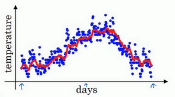

你得到了移動平均值，每日溫度的指數加權平均值。

看一下上一張幻燈片裡的公式，$v_{t} = 0.9v_{t - 1} +0.1\theta_{t}$，我們把0.9這個常數變成$\beta$，將之前的0.1變成$(1 - \beta)$，即$v_{t} = \beta v_{t - 1} + (1 - \beta)\theta_{t}$

由於以後我們要考慮的原因，在計算時可視$v_{t}$大概是$\frac{1}{(1 -\beta)}$的每日溫度，如果$\beta$是0.9，你會想，這是十天的平均值，也就是紅線部分。

我們來試試別的，將$\beta$設置為接近1的一個值，比如0.98，計算$\frac{1}{(1 - 0.98)} =50$，這就是粗略平均了一下，過去50天的溫度，這時作圖可以得到綠線。

這個高值$\beta$要注意幾點，你得到的曲線要平坦一些，原因在於你多平均了幾天的溫度，所以這個曲線，波動更小，更加平坦，缺點是曲線進一步右移，因為現在平均的溫度值更多，要平均更多的值，指數加權平均公式在溫度變化時，適應地更緩慢一些，所以會出現一定延遲，因為當$\beta=0.98$，相當於給前一天的值加了太多權重，只有0.02的權重給了當日的值，所以溫度變化時，溫度上下起伏，當$\beta$ 較大時，指數加權平均值適應地更緩慢一些。

我們可以再換一個值試一試，如果$\beta$是另一個極端值，比如說0.5，根據右邊的公式（$\frac{1}{(1-\beta)}$），這是平均了兩天的溫度。

作圖運行後得到黃線。

由於僅平均了兩天的溫度，平均的數據太少，所以得到的曲線有更多的噪聲，有可能出現異常值，但是這個曲線能夠更快適應溫度變化。

所以指數加權平均數經常被使用，再說一次，它在統計學中被稱為指數加權移動平均值，我們就簡稱為指數加權平均數。通過調整這個參數（$\beta$），或者說後面的算法學習，你會發現這是一個很重要的參數，可以取得稍微不同的效果，往往中間有某個值效果最好，$\beta$為中間值時得到的紅色曲線，比起綠線和黃線更好地平均了溫度。

現在你知道計算指數加權平均數的基本原理，下一個影片中，我們再聊聊它的本質作用。

### 2.4 理解指數加權平均數（Understanding exponentially weighted averages）

上個影片中，我們講到了指數加權平均數，這是幾個最佳化算法中的關鍵一環，而這幾個最佳化算法能幫助你訓練神經網路。本影片中，我希望進一步探討算法的本質作用。

回憶一下這個計算指數加權平均數的關鍵方程。

${{v}_{t}}=\beta {{v}_{t-1}}+(1-\beta ){{\theta }_{t}}$

$\beta=0.9$的時候，得到的結果是紅線，如果它更接近於1，比如0.98，結果就是綠線，如果$\beta$小一點，如果是0.5，結果就是黃線。

我們進一步地分析，來理解如何計算出每日溫度的平均值。

同樣的公式，${{v}_{t}}=\beta {{v}_{t-1}}+(1-\beta ){{\theta }_{t}}$

使$\beta=0.9$，寫下相應的幾個公式，所以在執行的時候，$t$從0到1到2到3，$t$的值在不斷增加，為了更好地分析，我寫的時候使得$t$的值不斷減小，然後繼續往下寫。

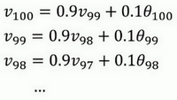

首先看第一個公式，理解$v_{100}$是什麼？我們調換一下這兩項（$0.9v_{99}0.1\theta_{100}$），$v_{100}= 0.1\theta_{100} + 0.9v_{99}$。

那麼$v_{99}$是什麼？我們就代入這個公式（$v_{99} = 0.1\theta_{99} +0.9v_{98}$），所以：

$v_{100} = 0.1\theta_{100} + 0.9(0.1\theta_{99} + 0.9v_{98})$。

那麼$v_{98}$是什麼？你可以用這個公式計算（$v_{98} = 0.1\theta_{98} +0.9v_{97}$），把公式代進去，所以：

$v_{100} = 0.1\theta_{100} + 0.9(0.1\theta_{99} + 0.9(0.1\theta_{98} +0.9v_{97}))$。

以此類推，如果你把這些括號都展開，

$v_{100} = 0.1\theta_{100} + 0.1 \times 0.9 \theta_{99} + 0.1 \times {(0.9)}^{2}\theta_{98} + 0.1 \times {(0.9)}^{3}\theta_{97} + 0.1 \times {(0.9)}^{4}\theta_{96} + \ldots$

所以這是一個加和並平均，100號數據，也就是當日溫度。我們分析$v_{100}$的組成，也就是在一年第100天計算的數據，但是這個是總和，包括100號數據，99號數據，97號數據等等。畫圖的一個辦法是，假設我們有一些日期的溫度，所以這是數據，這是$t$，所以100號數據有個數值，99號數據有個數值，98號數據等等，$t$為100，99，98等等，這就是數日的溫度數值。

然後我們構建一個指數衰減函數，從0.1開始，到$0.1 \times 0.9$，到$0.1 \times {(0.9)}^{2}$，以此類推，所以就有了這個指數衰減函數。

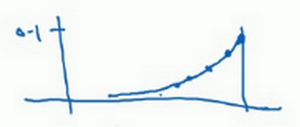

計算$v_{100}$是通過，把兩個函數對應的元素，然後求和，用這個數值100號數據值乘以0.1，99號數據值乘以0.1乘以${(0.9)}^{2}$，這是第二項，以此類推，所以選取的是每日溫度，將其與指數衰減函數相乘，然後求和，就得到了$v_{100}$。

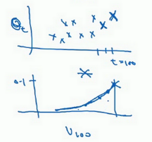

結果是，稍後我們詳細講解，不過所有的這些係數（$0.10.1 \times 0.90.1 \times {(0.9)}^{2}0.1 \times {(0.9)}^{3}\ldots$），相加起來為1或者逼近1，我們稱之為偏差修正，下個影片會涉及。

最後也許你會問，到底需要平均多少天的溫度。實際上${(0.9)}^{10}$大約為0.35，這大約是$\frac{1}{e}$，e是自然算法的基礎之一。大體上說，如果有$1-\varepsilon$，在這個例子中，$\varepsilon=0.1$，所以$1-\varepsilon=0.9$，${(1-\varepsilon)}^{(\frac{1}{\varepsilon})}$約等於$\frac{1}{e}$，大約是0.34，0.35，換句話說，10天後，曲線的高度下降到$\frac{1}{3}$，相當於在峰值的$\frac{1}{e}$。

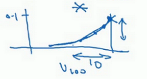

又因此當$\beta=0.9$的時候，我們說彷彿你在計算一個指數加權平均數，只關注了過去10天的溫度，因為10天後，權重下降到不到當日權重的三分之一。

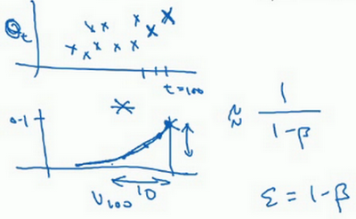

相反，如果，那麼0.98需要多少次方才能達到這麼小的數值？${(0.98)}^{50}$大約等於$\frac{1}{e}$，所以前50天這個數值比$\frac{1}{e}$大，數值會快速衰減，所以本質上這是一個下降幅度很大的函數，你可以看作平均了50天的溫度。因為在例子中，要代入等式的左邊，$\varepsilon=0.02$，所以$\frac{1}{\varepsilon}$為50，我們由此得到公式，我們平均了大約$\frac{1}{(1-\beta)}$天的溫度，這裡$\varepsilon$代替了$1-\beta$，也就是說根據一些常數，你能大概知道能夠平均多少日的溫度，不過這只是思考的大致方向，並不是正式的數學證明。

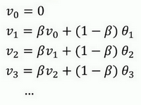

最後講講如何在實際中執行，還記得嗎？我們一開始將$v_{0}$設置為0，然後計算第一天$v_{1}$，然後$v_{2}$，以此類推。

現在解釋一下算法，可以將$v_{0}$，$v_{1}$，$v_{2}$等等寫成明確的變數，不過在實際中執行的話，你要做的是，一開始將$v$初始化為0，然後在第一天使$v:= \beta v + (1 - \beta)\theta_{1}$，然後第二天，更新$v$值，$v: = \beta v + (1 -\beta)\theta_{2}$，以此類推，有些人會把$v$加下標，來表示$v$是用來計算數據的指數加權平均數。

再說一次，但是換個說法，$v_{\theta} =0$，然後每一天，拿到第$t$天的數據，把$v$更新為$v: = \beta v_{\theta} + (1 -\beta)\theta_{t}$。

指數加權平均數公式的好處之一在於，它占用極少記憶體，電腦內存中只占用一行數字而已，然後把最新數據代入公式，不斷覆蓋就可以了，正因為這個原因，其效率，它基本上只占用一行程式碼，計算指數加權平均數也只占用單行數字的存儲和記憶體，當然它並不是最好的，也不是最精準的計算平均數的方法。如果你要計算移動窗，你直接算出過去10天的總和，過去50天的總和，除以10和50就好，如此往往會得到更好的估測。但缺點是，如果保存所有最近的溫度數據，和過去10天的總和，必須占用更多的記憶體，執行更加複雜，計算成本也更加高昂。

所以在接下來的影片中，我們會計算多個變數的平均值，從計算和記憶體效率來說，這是一個有效的方法，所以在機器學習中會經常使用，更不用說只要一行程式碼，這也是一個優勢。

現在你學會了計算指數加權平均數，你還需要知道一個專業概念，叫做偏差修正，下一個影片我們會講到它，接著你就可以用它構建更好的最佳化算法，而不是簡單直接的梯度下降法。

### 2.5 指數加權平均的偏差修正（Bias correction in exponentially weighted averages）

你學過了如何計算指數加權平均數，有一個技術名詞叫做偏差修正，可以讓平均數運算更加準確，來看看它是怎麼運行的。

${{v}_{t}}=\beta {{v}_{t-1}}+(1-\beta ){{\theta }_{t}}$

在上一個影片中，這個（紅色）曲線對應$\beta$的值為0.9，這個（綠色）曲線對應的$\beta$=0.98，如果你執行寫在這裡的公式，在$\beta$等於0.98的時候，得到的並不是綠色曲線，而是紫色曲線，你可以注意到紫色曲線的起點較低，我們來看看怎麼處理。

計算移動平均數的時候，初始化$v_{0} = 0$，$v_{1} = 0.98v_{0} +0.02\theta_{1}$，但是$v_{0} =0$，所以這部分沒有了（$0.98v_{0}$），所以$v_{1} =0.02\theta_{1}$，所以如果一天溫度是40華氏度，那麼$v_{1} = 0.02\theta_{1} =0.02 \times 40 = 8$，因此得到的值會小很多，所以第一天溫度的估測不準。

$v_{2} = 0.98v_{1} + 0.02\theta_{2}$，如果代入$v_{1}$，然後相乘，所以$v_{2}= 0.98 \times 0.02\theta_{1} + 0.02\theta_{2} = 0.0196\theta_{1} +0.02\theta_{2}$，假設$\theta_{1}$和$\theta_{2}$都是正數，計算後$v_{2}$要遠小於$\theta_{1}$和$\theta_{2}$，所以$v_{2}$不能很好估測出這一年前兩天的溫度。

有個辦法可以修改這一估測，讓估測變得更好，更準確，特別是在估測初期，也就是不用$v_{t}$，而是用$\frac{v_{t}}{1- \beta^{t}}$，t就是現在的天數。舉個具體例子，當$t=2$時，$1 - \beta^{t} = 1 -  {0.98}^{2} = 0.0396$，因此對第二天溫度的估測變成了$\frac{v_{2}}{0.0396} =\frac{0.0196\theta_{1} +  0.02\theta_{2}}{0.0396}$，也就是$\theta_{1}$和$\theta_{2}$的加權平均數，並去除了偏差。你會發現隨著$t$增加，$\beta^{t}$接近於0，所以當$t$很大的時候，偏差修正幾乎沒有作用，因此當$t$較大的時候，紫線基本和綠線重合了。不過在開始學習階段，你才開始預測熱身練習，偏差修正可以幫助你更好預測溫度，偏差修正可以幫助你使結果從紫線變成綠線。

在機器學習中，在計算指數加權平均數的大部分時候，大家不在乎執行偏差修正，因為大部分人寧願熬過初始時期，拿到具有偏差的估測，然後繼續計算下去。如果你關心初始時期的偏差，在剛開始計算指數加權移動平均數的時候，偏差修正能幫助你在早期獲取更好的估測。

所以你學會了計算指數加權移動平均數，我們接著用它來構建更好的最佳化算法吧！

### 2.6 動量梯度下降法（Gradient descent with Momentum）

還有一種算法叫做**Momentum**，或者叫做動量梯度下降法，運行速度幾乎總是快於標準的梯度下降算法，簡而言之，基本的想法就是計算梯度的指數加權平均數，並利用該梯度更新你的權重，在本影片中，我們呢要一起拆解單句描述，看看你到底如何計算。

例如，如果你要最佳化成本函數，函數形狀如圖，紅點代表最小值的位置，假設你從這裡（藍色點）開始梯度下降法，如果進行梯度下降法的一次疊代，無論是**batch**或**mini-batch**下降法，也許會指向這裡，現在在橢圓的另一邊，計算下一步梯度下降，結果或許如此，然後再計算一步，再一步，計算下去，你會發現梯度下降法要很多計算步驟對吧？

慢慢擺動到最小值，這種上下波動減慢了梯度下降法的速度，你就無法使用更大的學習率，如果你要用較大的學習率（紫色箭頭），結果可能會偏離函數的範圍，為了避免擺動過大，你要用一個較小的學習率。

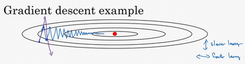

另一個看待問題的角度是，在縱軸上，你希望學習慢一點，因為你不想要這些擺動，但是在橫軸上，你希望加快學習，你希望快速從左向右移，移向最小值，移向紅點。所以使用動量梯度下降法，你需要做的是，在每次疊代中，確切來說在第$t$次疊代的過程中，你會計算微分$dW$，$db$，我會省略上標$[l]$，你用現有的**mini-batch**計算$dW$，$db$。如果你用**batch**梯度下降法，現在的**mini-batch**就是全部的**batch**，對於**batch**梯度下降法的效果是一樣的。如果現有的**mini-batch**就是整個訓練集，效果也不錯，你要做的是計算$v_{{dW}}= \beta v_{{dW}} + \left( 1 - \beta \right)dW$，這跟我們之前的計算相似，也就是$v = \beta v + \left( 1 - \beta \right)\theta_{t}$，$dW$的移動平均數，接著同樣地計算$v_{db}$，$v_{db} = \beta v_{{db}} + ( 1 - \beta){db}$，然後重新賦值權重，$W:= W -av_{{dW}}$，同樣$b:= b - a v_{db}$，這樣就可以減緩梯度下降的幅度。

例如，在上幾個導數中，你會發現這些縱軸上的擺動平均值接近於零，所以在縱軸方向，你希望放慢一點，平均過程中，正負數相互抵消，所以平均值接近於零。但在橫軸方向，所有的微分都指向橫軸方向，因此橫軸方向的平均值仍然較大，因此用算法幾次疊代後，你發現動量梯度下降法，最終縱軸方向的擺動變小了，橫軸方向運動更快，因此你的算法走了一條更加直接的路徑，在抵達最小值的路上減少了擺動。

動量梯度下降法的一個本質，這對有些人而不是所有人有效，就是如果你要最小化碗狀函數，這是碗的形狀，我畫的不太好。

它們能夠最小化碗狀函數，這些微分項，想像它們為你從山上往下滾的一個球，提供了加速度，**Momentum**項相當於速度。

想像你有一個碗，你拿一個球，微分項給了這個球一個加速度，此時球正向山下滾，球因為加速度越滾越快，而因為$\beta$ 稍小於1，表現出一些摩擦力，所以球不會無限加速下去，所以不像梯度下降法，每一步都獨立於之前的步驟，你的球可以向下滾，獲得動量，可以從碗向下加速獲得動量。我發現這個球從碗滾下的比喻，物理能力強的人接受得比較好，但不是所有人都能接受，如果球從碗中滾下這個比喻，你理解不了，別擔心。

最後我們來看具體如何計算，算法在此。

所以你有兩個超參數，學習率$a$以及參數$\beta$，$\beta$控制著指數加權平均數。$\beta$最常用的值是0.9，我們之前平均了過去十天的溫度，所以現在平均了前十次疊代的梯度。實際上$\beta$為0.9時，效果不錯，你可以嘗試不同的值，可以做一些超參數的研究，不過0.9是很棒的魯棒數。那麼關於偏差修正，所以你要拿$v_{dW}$和$v_{db}$除以$1-\beta^{t}$，實際上人們不這麼做，因為10次疊代之後，因為你的移動平均已經過了初始階段。實際中，在使用梯度下降法或動量梯度下降法時，人們不會受到偏差修正的困擾。當然$v_{{dW}}$初始值是0，要注意到這是和$dW$擁有相同維數的零矩陣，也就是跟$W$擁有相同的維數，$v_{db}$的初始值也是向量零，所以和$db$擁有相同的維數，也就是和$b$是同一維數。

最後要說一點，如果你查閱了動量梯度下降法相關資料，你經常會看到一個被刪除了的專業詞彙，$1-\beta$被刪除了，最後得到的是$v_{dW}= \beta v_{{dW}} +dW$。用紫色版本的結果就是，所以$v_{{dW}}$縮小了$1-\beta$倍，相當於乘以$\frac{1}{1- \beta}$，所以你要用梯度下降最新值的話，$a$要根據$\frac{1}{1 -\beta}$相應變化。實際上，二者效果都不錯，只會影響到學習率$a$的最佳值。我覺得這個公式用起來沒有那麼自然，因為有一個影響，如果你最後要調整超參數$\beta$，就會影響到$v_{{dW}}$和$v_{db}$，你也許還要修改學習率$a$，所以我更喜歡左邊的公式，而不是刪去了$1-\beta$的這個公式，所以我更傾向於使用左邊的公式，也就是有$1-\beta$的這個公式，但是兩個公式都將$\beta$設置為0.9，是超參數的常見選擇，只是在這兩個公式中，學習率$a$的調整會有所不同。

所以這就是動量梯度下降法，這個算法肯定要好於沒有**Momentum**的梯度下降算法，我們還可以做別的事情來加快學習算法，我們將在接下來的影片中探討這些問題。
### 2.7 RMSprop

你們知道了動量（**Momentum**）可以加快梯度下降，還有一個叫做**RMSprop**的算法，全稱是**root mean square prop**算法，它也可以加速梯度下降，我們來看看它是如何運作的。

回憶一下我們之前的例子，如果你執行梯度下降，雖然橫軸方向正在推進，但縱軸方向會有大幅度擺動，為了分析這個例子，假設縱軸代表參數$b$，橫軸代表參數$W$，可能有$W_{1}$，$W_{2}$或者其它重要的參數，為了便於理解，被稱為$b$和$W$。

所以，你想減緩$b$方向的學習，即縱軸方向，同時加快，至少不是減緩橫軸方向的學習，**RMSprop**算法可以實現這一點。

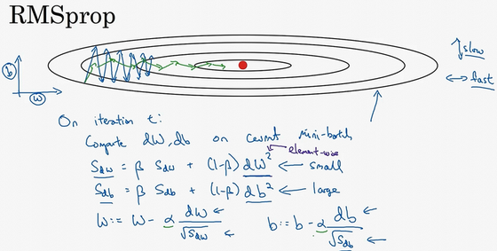

在第$t$次疊代中，該算法會照常計算當下**mini-batch**的微分$dW$，$db$，所以我會保留這個指數加權平均數，我們用到新符號$S_{dW}$，而不是$v_{dW}$，因此$S_{dW}= \beta S_{dW} + (1 -\beta) {dW}^{2}$，澄清一下，這個平方的操作是針對這一整個符號的，這樣做能夠保留微分平方的加權平均數，同樣$S_{db}= \beta S_{db} + (1 - \beta){db}^{2}$，再說一次，平方是針對整個符號的操作。

接著**RMSprop**會這樣更新參數值，$W:= W -a\frac{dW}{\sqrt{S_{dW}}}$，$b:=b -\alpha\frac{db}{\sqrt{S_{db}}}$，我們來理解一下其原理。記得在橫軸方向或者在例子中的$W$方向，我們希望學習速度快，而在垂直方向，也就是例子中的$b$方向，我們希望減緩縱軸上的擺動，所以有了$S_{dW}$和$S_{db}$，我們希望$S_{dW}$會相對較小，所以我們要除以一個較小的數，而希望$S_{db}$又較大，所以這裡我們要除以較大的數字，這樣就可以減緩縱軸上的變化。你看這些微分，垂直方向的要比水平方向的大得多，所以斜率在$b$方向特別大，所以這些微分中，$db$較大，$dW$較小，因為函數的傾斜程度，在縱軸上，也就是b方向上要大於在橫軸上，也就是$W$方向上。$db$的平方較大，所以$S_{db}$也會較大，而相比之下，$dW$會小一些，亦或$dW$平方會小一些，因此$S_{dW}$會小一些，結果就是縱軸上的更新要被一個較大的數相除，就能消除擺動，而水平方向的更新則被較小的數相除。

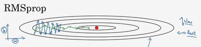

**RMSprop**的影響就是你的更新最後會變成這樣（綠色線），縱軸方向上擺動較小，而橫軸方向繼續推進。還有個影響就是，你可以用一個更大學習率$a$，然後加快學習，而無須在縱軸上垂直方向偏離。

要說明一點，我一直把縱軸和橫軸方向分別稱為$b$和$W$，只是為了方便展示而已。實際中，你會處於參數的高維度空間，所以需要消除擺動的垂直維度，你需要消除擺動，實際上是參數$W_1$，$W_2$等的合集，水平維度可能$W_3$，$W_4$等等，因此把$W$和$b$分開只是方便說明。實際中$dW$是一個高維度的參數向量，$db$也是一個高維度參數向量，但是你的直覺是，在你要消除擺動的維度中，最終你要計算一個更大的和值，這個平方和微分的加權平均值，所以你最後去掉了那些有擺動的方向。所以這就是**RMSprop**，全稱是均方根，因為你將微分進行平方，然後最後使用平方根。

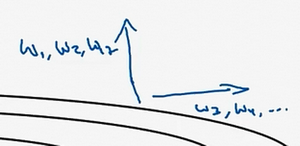

最後再就這個算法說一些細節的東西，然後我們再繼續。下一個影片中，我們會將**RMSprop**和**Momentum**結合起來，我們在**Momentum**中採用超參數$\beta$，為了避免混淆，我們現在不用$\beta$，而採用超參數$\beta_{2}$以保證在**Momentum**和**RMSprop**中採用同一超參數。要確保你的算法不會除以0，如果$S_{dW}$的平方根趨近於0怎麼辦？得到的答案就非常大，為了確保數值穩定，在實際操練的時候，你要在分母上加上一個很小很小的$\varepsilon$，$\varepsilon$是多少沒關係，$10^{-8}$是個不錯的選擇，這只是保證數值能穩定一些，無論什麼原因，你都不會除以一個很小很小的數。所以**RMSprop**跟**Momentum**有很相似的一點，可以消除梯度下降中的擺動，包括**mini-batch**梯度下降，並允許你使用一個更大的學習率$a$，從而加快你的算法學習速度。

所以你學會了如何運用**RMSprop**，這是給學習算法加速的另一方法。關於**RMSprop**的一個有趣的事是，它首次提出並不是在學術研究論文中，而是在多年前**Jeff Hinton**在**Coursera**的課程上。我想**Coursera**並不是故意打算成為一個傳播新興的學術研究的平台，但是卻達到了意想不到的效果。就是從**Coursera**課程開始，**RMSprop**開始被人們廣為熟知，並且發展迅猛。

我們講過了**Momentum**，我們講了**RMSprop**，如果二者結合起來，你會得到一個更好的最佳化算法，在下個影片中我們再好好講一講為什麼。

### 2.8 Adam 最佳化算法(Adam optimization algorithm)

在深度學習的歷史上，包括許多知名研究者在內，提出了最佳化算法，並很好地解決了一些問題，但隨後這些最佳化算法被指出並不能一般化，並不適用於多種神經網路，時間久了，深度學習圈子裡的人開始多少有些質疑全新的最佳化算法，很多人都覺得動量（**Momentum**）梯度下降法很好用，很難再想出更好的最佳化算法。所以**RMSprop**以及**Adam**最佳化算法（**Adam**最佳化算法也是本影片的內容），就是少有的經受住人們考驗的兩種算法，已被證明適用於不同的深度學習結構，這個算法我會毫不猶豫地推薦給你，因為很多人都試過，並且用它很好地解決了許多問題。

**Adam**最佳化算法基本上就是將**Momentum**和**RMSprop**結合在一起，那麼來看看如何使用**Adam**算法。

使用**Adam**算法，首先你要初始化，$v_{dW} = 0$，$S_{dW} =0$，$v_{db} = 0$，$S_{db} =0$，在第$t$次疊代中，你要計算微分，用當前的**mini-batch**計算$dW$，$db$，一般你會用**mini-batch**梯度下降法。接下來計算**Momentum**指數加權平均數，所以$v_{dW}= \beta_{1}v_{dW} + ( 1 - \beta_{1})dW$（使用$\beta_{1}$，這樣就不會跟超參數$\beta_{2}$混淆，因為後面**RMSprop**要用到$\beta_{2}$），使用**Momentum**時我們肯定會用這個公式，但現在不叫它$\beta$，而叫它$\beta_{1}$。同樣$v_{db}= \beta_{1}v_{db} + ( 1 -\beta_{1} ){db}$。

接著你用**RMSprop**進行更新，即用不同的超參數$\beta_{2}$，$S_{dW}=\beta_{2}S_{dW} + ( 1 - \beta_{2}){(dW)}^{2}$，再說一次，這裡是對整個微分$dW$進行平方處理，$S_{db} =\beta_{2}S_{db} + \left( 1 - \beta_{2} \right){(db)}^{2}$。

相當於**Momentum**更新了超參數$\beta_{1}$，**RMSprop**更新了超參數$\beta_{2}$。一般使用**Adam**算法的時候，要計算偏差修正，$v_{dW}^{\text{corrected}}$，修正也就是在偏差修正之後，

$v_{dW}^{\text{corrected}}= \frac{v_{dW}}{1 - \beta_{1}^{t}}$，

同樣$v_{db}^{\text{corrected}} =\frac{v_{db}}{1 -\beta_{1}^{t}}$，

$S$也使用偏差修正，也就是$S_{dW}^{\text{corrected}} =\frac{S_{dW}}{1 - \beta_{2}^{t}}$，$S_{db}^{\text{corrected}} =\frac{S_{db}}{1 - \beta_{2}^{t}}$。

最後更新權重，所以$W$更新後是$W:= W - \frac{a v_{dW}^{\text{corrected}}}{\sqrt{S_{dW}^{\text{corrected}}} +\varepsilon}$（如果你只是用**Momentum**，使用$v_{dW}$或者修正後的$v_{dW}$，但現在我們加入了**RMSprop**的部分，所以我們要除以修正後$S_{dW}$的平方根加上$\varepsilon$）。

根據類似的公式更新$b$值，$b:=b - \frac{\alpha v_{\text{db}}^{\text{corrected}}}{\sqrt{S_{\text{db}}^{\text{corrected}}} +\varepsilon}$。

所以**Adam**算法結合了**Momentum**和**RMSprop**梯度下降法，並且是一種極其常用的學習算法，被證明能有效適用於不同神經網路，適用於廣泛的結構。

本算法中有很多超參數，超參數學習率$a$很重要，也經常需要除錯，你可以嘗試一系列值，然後看哪個有效。$\beta_{1}$常用的預設值為0.9，這是dW的移動平均數，也就是$dW$的加權平均數，這是**Momentum**涉及的項。至於超參數$\beta_{2}$，**Adam**論文作者，也就是**Adam**算法的發明者，推薦使用0.999，這是在計算${(dW)}^{2}$以及${(db)}^{2}$的移動加權平均值，關於$\varepsilon$的選擇其實沒那麼重要，**Adam**論文的作者建議$\varepsilon$為$10^{-8}$，但你並不需要設置它，因為它並不會影響算法表現。但是在使用**Adam**的時候，人們往往使用預設值即可，$\beta_{1}$，$\beta_{2}$和$\varepsilon$都是如此，我覺得沒人會去調整$\varepsilon$，然後嘗試不同的$a$值，看看哪個效果最好。你也可以調整$\beta_{1}$和$\beta_{2}$，但我認識的業內人士很少這麼幹。

為什麼這個算法叫做**Adam**？**Adam**代表的是**Adaptive Moment Estimation**，$\beta_{1}$用於計算這個微分（$dW$），叫做第一矩，$\beta_{2}$用來計算平方數的指數加權平均數（${(dW)}^{2}$），叫做第二矩，所以**Adam**的名字由此而來，但是大家都簡稱**Adam**權威算法。

順便提一下，我有一個老朋友兼合作伙伴叫做**Adam Coates**。據我所知，他跟**Adam**算法沒有任何關係，不過我覺得他偶爾會用到這個算法，不過有時有人會問我這個問題，我想你可能也有相同的疑惑。

這就是關於**Adam**最佳化算法的全部內容，有了它，你可以更加快速地訓練神經網路，在結束本週課程之前，我們還要講一下超參數調整，以及更好地理解神經網路的最佳化問題有哪些。下個影片中，我們將講講學習率衰減。

### 2.9 學習率衰減(Learning rate decay)

加快學習算法的一個辦法就是隨時間慢慢減少學習率，我們將之稱為學習率衰減，我們來看看如何做到，首先通過一個例子看看，為什麼要計算學習率衰減。

假設你要使用**mini-batch**梯度下降法，**mini-batch**數量不大，大概64或者128個樣本，在疊代過程中會有噪音（藍色線），下降朝向這裡的最小值，但是不會精確地收斂，所以你的算法最後在附近擺動，並不會真正收斂，因為你用的$a$是固定值，不同的**mini-batch**中有噪音。

但要慢慢減少學習率$a$的話，在初期的時候，$a$學習率還較大，你的學習還是相對較快，但隨著$a$變小，你的步伐也會變慢變小，所以最後你的曲線（綠色線）會在最小值附近的一小塊區域裡擺動，而不是在訓練過程中，大幅度在最小值附近擺動。

所以慢慢減少$a$的本質在於，在學習初期，你能承受較大的步伐，但當開始收斂的時候，小一些的學習率能讓你步伐小一些。

你可以這樣做到學習率衰減，記得一代要遍歷一次數據，如果你有以下這樣的訓練集，

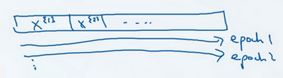

你應該拆分成不同的**mini-batch**，第一次遍歷訓練集叫做第一代。第二次就是第二代，依此類推，你可以將$a$學習率設為$a= \frac{1}{1 + decayrate * \text{epoch}\text{-num}}a_{0}$（**decay-rate**稱為衰減率，**epoch-num**為代數，$\alpha_{0}$為初始學習率），注意這個衰減率是另一個你需要調整的超參數。

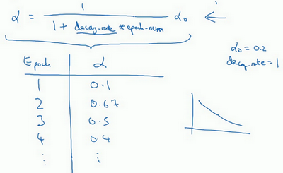

這裡有一個具體例子，如果你計算了幾代，也就是遍歷了幾次，如果$a_{0}$為0.2，衰減率**decay-rate**為1，那麼在第一代中，$a = \frac{1}{1 + 1}a_{0} = 0.1$，這是在代入這個公式計算（$a= \frac{1}{1 + decayrate * \text{epoch}\text{-num}}a_{0}$），此時衰減率是1而代數是1。在第二代學習率為0.67，第三代變成0.5，第四代為0.4等等，你可以自己多計算幾個數據。要理解，作為代數函數，根據上述公式，你的學習率呈遞減趨勢。如果你想用學習率衰減，要做的是要去嘗試不同的值，包括超參數$a_{0}$，以及超參數衰退率，找到合適的值，除了這個學習率衰減的公式，人們還會用其它的公式。

比如，這個叫做指數衰減，其中$a$相當於一個小於1的值，如$a ={0.95}^{\text{epoch-num}} a_{0}$，所以你的學習率呈指數下降。

人們用到的其它公式有$a =\frac{k}{\sqrt{\text{epoch-num}}}a_{0}$或者$a =\frac{k}{\sqrt{t}}a_{0}$（$t$為**mini-batch**的數字）。

有時人們也會用一個離散下降的學習率，也就是某個步驟有某個學習率，一會之後，學習率減少了一半，一會減少一半，一會又一半，這就是離散下降（**discrete stair cease**）的意思。

到現在，我們講了一些公式，看學習率$a$究竟如何隨時間變化。人們有時候還會做一件事，手動衰減。如果你一次只訓練一個模型，如果你要花上數小時或數天來訓練，有些人的確會這麼做，看看自己的模型訓練，耗上數日，然後他們覺得，學習速率變慢了，我把$a$調小一點。手動控制$a$當然有用，時復一時，日復一日地手動調整$a$，只有模型數量小的時候有用，但有時候人們也會這麼做。

所以現在你有了多個選擇來控制學習率$a$。你可能會想，好多超參數，究竟我應該做哪一個選擇，我覺得，現在擔心為時過早。下一週，我們會講到，如何系統選擇超參數。對我而言，學習率衰減並不是我嘗試的要點，設定一個固定的$a$，然後好好調整，會有很大的影響，學習率衰減的確大有裨益，有時候可以加快訓練，但它並不是我會率先嘗試的內容，但下週我們將涉及超參數調整，你能學到更多系統的辦法來管理所有的超參數，以及如何高效搜索超參數。

這就是學習率衰減，最後我還要講講神經網路中的局部最優以及鞍點，所以能更好理解在訓練神經網路過程中，你的算法正在解決的最佳化問題，下個影片我們就好好聊聊這些問題。

### 2.10 局部最優的問題(The problem of local optima)

在深度學習研究早期，人們總是擔心最佳化算法會困在極差的局部最優，不過隨著深度學習理論不斷發展，我們對局部最優的理解也發生了改變。我向你展示一下現在我們怎麼看待局部最優以及深度學習中的最佳化問題。

這是曾經人們在想到局部最優時腦海裡會出現的圖，也許你想最佳化一些參數，我們把它們稱之為$W_{1}$和$W_{2}$，平面的高度就是損失函數。在圖中似乎各處都分布著局部最優。梯度下降法或者某個算法可能困在一個局部最優中，而不會抵達全局最優。如果你要作圖計算一個數字，比如說這兩個維度，就容易出現有多個不同局部最優的圖，而這些低維的圖曾經影響了我們的理解，但是這些理解並不正確。事實上，如果你要創建一個神經網路，通常梯度為零的點並不是這個圖中的局部最優點，實際上成本函數的零梯度點，通常是鞍點。

也就是在這個點，這裡是$W_{1}$和$W_{2}$，高度即成本函數$J$的值。

但是一個具有高維度空間的函數，如果梯度為0，那麼在每個方向，它可能是凸函數，也可能是凹函數。如果你在2萬維空間中，那麼想要得到局部最優，所有的2萬個方向都需要是這樣，但發生的機率也許很小，也許是$2^{-20000}$，你更有可能遇到有些方向的曲線會這樣向上彎曲，另一些方向曲線向下彎，而不是所有的都向上彎曲，因此在高維度空間，你更可能碰到鞍點。

就像下面的這種：

而不會碰到局部最優。至於為什麼會把一個曲面叫做鞍點，你想像一下，就像是放在馬背上的馬鞍一樣，如果這是馬，這是馬的頭，這就是馬的眼睛，畫得不好請多包涵，然後你就是騎馬的人，要坐在馬鞍上，因此這裡的這個點，導數為0的點，這個點叫做鞍點。我想那確實是你坐在馬鞍上的那個點，而這裡導數為0。

所以我們從深度學習歷史中學到的一課就是，我們對低維度空間的大部分直覺，比如你可以畫出上面的圖，並不能應用到高維度空間中。適用於其它算法，因為如果你有2萬個參數，那麼$J$函數有2萬個維度向量，你更可能遇到鞍點，而不是局部最優點。

如果局部最優不是問題，那麼問題是什麼？結果是平穩段會減緩學習，平穩段是一塊區域，其中導數長時間接近於0，如果你在此處，梯度會從曲面從從上向下下降，因為梯度等於或接近0，曲面很平坦，你得花上很長時間慢慢抵達平穩段的這個點，因為左邊或右邊的隨機擾動，我換個筆墨顏色，大家看得清楚一些，然後你的算法能夠走出平穩段（紅色筆）。

我們可以沿著這段長坡走，直到這裡，然後走出平穩段。

所以此次影片的要點是，首先，你不太可能困在極差的局部最優中，條件是你在訓練較大的神經網路，存在大量參數，並且成本函數$J$被定義在較高的維度空間。

第二點，平穩段是一個問題，這樣使得學習十分緩慢，這也是像**Momentum**或是**RMSprop**，**Adam**這樣的算法，能夠加速學習算法的地方。在這些情況下，更成熟的最佳化算法，如**Adam**算法，能夠加快速度，讓你儘早往下走出平穩段。

因為你的網路要解決最佳化問題，說實話，要面臨如此之高的維度空間，我覺得沒有人有那麼好的直覺，知道這些空間長什麼樣，而且我們對它們的理解還在不斷發展，不過我希望這一點能夠讓你更好地理解最佳化算法所面臨的問題。

