第三週 超參數除錯、Batch正則化和程序框架（Hyperparameter tuning）
------------------------------------------
[TOC]
### 3.1 除錯處理（Tuning process）

大家好，歡迎回來，目前為止，你已經了解到，神經網路的改變會涉及到許多不同超參數的設置。現在，對於超參數而言，你要如何找到一套好的設定呢？在此影片中，我想和你分享一些指導原則，一些關於如何系統地組織超參除錯過程的技巧，希望這些能夠讓你更有效的聚焦到合適的超參設定中。


關於訓練深度最難的事情之一是你要處理的參數的數量，從學習速率$a$到**Momentum**（動量梯度下降法）的參數$\beta$。如果使用**Momentum**或**Adam**最佳化算法的參數，$\beta_{1}$，${\beta}_{2}$和$\varepsilon$，也許你還得選擇層數，也許你還得選擇不同層中隱藏單元的數量，也許你還想使用學習率衰減。所以，你使用的不是單一的學習率$a$。接著，當然你可能還需要選擇**mini-batch**的大小。

結果證實一些超參數比其它的更為重要，我認為，最為廣泛的學習應用是$a$，學習速率是需要除錯的最重要的超參數。

除了$a$，還有一些參數需要除錯，例如**Momentum**參數$\beta$，0.9就是個很好的預設值。我還會除錯**mini-batch**的大小，以確保最優算法運行有效。我還會經常除錯隱藏單元，我用橙色圈住的這些，這三個是我覺得其次比較重要的，相對於$a$而言。重要性排第三位的是其他因素，層數有時會產生很大的影響，學習率衰減也是如此。當應用**Adam**算法時，事實上，我從不除錯$\beta_{1}$，${\beta}_{2}$和$\varepsilon$，我總是選定其分別為0.9，0.999和$10^{-8}$，如果你想的話也可以除錯它們。

但希望你粗略了解到哪些超參數較為重要，$a$無疑是最重要的，接下來是我用橙色圈住的那些，然後是我用紫色圈住的那些，但這不是嚴格且快速的標準，我認為，其它深度學習的研究者可能會很不同意我的觀點或有著不同的直覺。


現在，如果你嘗試調整一些超參數，該如何選擇除錯值呢？在早一代的機器學習算法中，如果你有兩個超參數，這裡我會稱之為超參1，超參2，常見的做法是在網格中取樣點，像這樣，然後系統的研究這些數值。這裡我放置的是5×5的網格，實踐證明，網格可以是5×5，也可多可少，但對於這個例子，你可以嘗試這所有的25個點，然後選擇哪個參數效果最好。當參數的數量相對較少時，這個方法很實用。

在深度學習領域，我們常做的，我推薦你採用下面的做法，隨機選擇點，所以你可以選擇同等數量的點，對嗎？25個點，接著，用這些隨機取的點試驗超參數的效果。之所以這麼做是因為，對於你要解決的問題而言，你很難提前知道哪個超參數最重要，正如你之前看到的，一些超參數的確要比其它的更重要。

舉個例子，假設超參數1是$a$（學習速率），取一個極端的例子，假設超參數2是**Adam**算法中，分母中的$\varepsilon$。在這種情況下，$a$的取值很重要，而$\varepsilon$取值則無關緊要。如果你在網格中取點，接著，你試驗了$a$的5個取值，那你會發現，無論$\varepsilon$取何值，結果基本上都是一樣的。所以，你知道共有25種模型，但進行試驗的$a$值只有5個，我認為這是很重要的。

對比而言，如果你隨機取值，你會試驗25個獨立的$a$，似乎你更有可能發現效果做好的那個。


我已經解釋了兩個參數的情況，實踐中，你搜索的超參數可能不止兩個。假如，你有三個超參數，這時你搜索的不是一個方格，而是一個立方體，超參數3代表第三維，接著，在三維立方體中取值，你會試驗大量的更多的值，三個超參數中每個都是。


實踐中，你搜索的可能不止三個超參數有時很難預知，哪個是最重要的超參數，對於你的具體應用而言，隨機取值而不是網格取值表明，你探究了更多重要超參數的潛在值，無論結果是什麼。

當你給超參數取值時，另一個慣例是採用由粗糙到精細的策略。

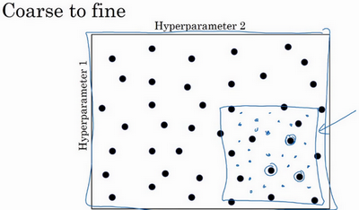

比如在二維的那個例子中，你進行了取值，也許你會發現效果最好的某個點，也許這個點周圍的其他一些點效果也很好，那在接下來要做的是放大這塊小區域（小藍色方框內），然後在其中更密集得取值或隨機取值，聚集更多的資源，在這個藍色的方格中搜索，如果你懷疑這些超參數在這個區域的最優結果，那在整個的方格中進行粗略搜索後，你會知道接下來應該聚焦到更小的方格中。在更小的方格中，你可以更密集得取點。所以這種從粗到細的搜索也經常使用。

通過試驗超參數的不同取值，你可以選擇對訓練集目標而言的最優值，或對於開發集而言的最優值，或在超參搜索過程中你最想最佳化的東西。

我希望，這能給你提供一種方法去系統地組織超參數搜索過程。另一個關鍵點是隨機取值和精確搜索，考慮使用由粗糙到精細的搜索過程。但超參數的搜索內容還不止這些，在下一個影片中，我會繼續講解關於如何選擇超參數取值的合理範圍。

### 3.2 為超參數選擇合適的範圍（Using an appropriate scale to pick hyperparameters）

在上一個影片中，你已經看到了在超參數範圍中，隨機取值可以提升你的搜索效率。但隨機取值並不是在有效範圍內的隨機均勻取值，而是選擇合適的標尺，用於探究這些超參數，這很重要。在這個影片中，我會教你怎麼做。

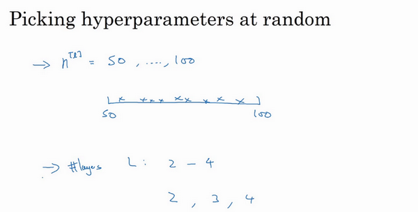

假設你要選取隱藏單元的數量$n^{[l]}$，假設，你選取的取值範圍是從50到100中某點，這種情況下，看到這條從50-100的數軸，你可以隨機在其取點，這是一個搜索特定超參數的很直觀的方式。或者，如果你要選取神經網路的層數，我們稱之為字母$L$，你也許會選擇層數為2到4中的某個值，接著順著2，3，4隨機均勻取樣才比較合理，你還可以應用網格搜索，你會覺得2，3，4，這三個數值是合理的，這是在幾個在你考慮範圍內隨機均勻取值的例子，這些取值還蠻合理的，但對某些超參數而言不適用。


看看這個例子，假設你在搜索超參數$a$（學習速率），假設你懷疑其值最小是0.0001或最大是1。如果你畫一條從0.0001到1的數軸，沿其隨機均勻取值，那90%的數值將會落在0.1到1之間，結果就是，在0.1到1之間，應用了90%的資源，而在0.0001到0.1之間，只有10%的搜索資源，這看起來不太對。

反而，用對數標尺搜索超參數的方式會更合理，因此這裡不使用線性軸，分別依次取0.0001，0.001，0.01，0.1，1，在對數軸上均勻隨機取點，這樣，在0.0001到0.001之間，就會有更多的搜索資源可用，還有在0.001到0.01之間等等。


所以在**Python**中，你可以這樣做，使`r=-4*np.random.rand()`，然後$a$隨機取值，$ a =10^{r}$，所以，第一行可以得出$r \in [ 4,0]$，那麼$a \in[10^{-4},10^{0}]$，所以最左邊的數字是$10^{-4}$，最右邊是$10^{0}$。


更常見的情況是，如果你在$10^{a}$和$10^{b}$之間取值，在此例中，這是$10^{a}$（0.0001），你可以通過$\operatorname{}{0.0001}$算出$a$的值，即-4，在右邊的值是$10^{b}$，你可以算出$b$的值$\operatorname{}1$，即0。你要做的就是在$[a,b]$區間隨機均勻地給$r$取值，這個例子中$r \in \lbrack - 4,0\rbrack$，然後你可以設置$a$的值，基於隨機取樣的超參數$a =10^{r}$。


所以總結一下，在對數坐標下取值，取最小值的對數就得到$a$的值，取最大值的對數就得到$b$值，所以現在你在對數軸上的$10^{a}$到$10^{b}$區間取值，在$a$，$b$間隨意均勻的選取$r$值，將超參數設置為$10^{r}$，這就是在對數軸上取值的過程。

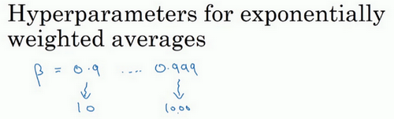

最後，另一個棘手的例子是給$\beta$ 取值，用於計算指數的加權平均值。假設你認為$\beta$是0.9到0.999之間的某個值，也許這就是你想搜索的範圍。記住這一點，當計算指數的加權平均值時，取0.9就像在10個值中計算平均值，有點類似於計算10天的溫度平均值，而取0.999就是在1000個值中取平均。

所以和上張幻燈片上的內容類似，如果你想在0.9到0.999區間搜索，那就不能用線性軸取值，對吧？不要隨機均勻在此區間取值，所以考慮這個問題最好的方法就是，我們要探究的是$1-\beta$，此值在0.1到0.001區間內，所以我們會給$1-\beta$取值，大概是從0.1到0.001，應用之前幻燈片中介紹的方法，這是$10^{-1}$，這是$10^{-3}$，值得注意的是，在之前的幻燈片裡，我們把最小值寫在左邊，最大值寫在右邊，但在這裡，我們顛倒了大小。這裡，左邊的是最大值，右邊的是最小值。所以你要做的就是在$[-3,-1]$裡隨機均勻的給r取值。你設定了$1- \beta = 10^{r}$，所以$\beta = 1-10^{r}$，然後這就變成了在特定的選擇範圍內超參數隨機取值。希望用這種方式得到想要的結果，你在0.9到0.99區間探究的資源，和在0.99到0.999區間探究的一樣多。


所以，如果你想研究更多正式的數學證明，關於為什麼我們要這樣做，為什麼用線性軸取值不是個好辦法，這是因為當$\beta$ 接近1時，所得結果的靈敏度會變化，即使$\beta$有微小的變化。所以$\beta$ 在0.9到0.9005之間取值，無關緊要，你的結果幾乎不會變化。


但$\beta$值如果在0.999到0.9995之間，這會對你的算法產生巨大影響，對吧？在這兩種情況下，是根據大概10個值取平均。但這裡，它是指數的加權平均值，基於1000個值，現在是2000個值，因為這個公式$\frac{1}{1- \beta}$，當$\beta$接近1時，$\beta$就會對細微的變化變得很敏感。所以整個取值過程中，你需要更加密集地取值，在$\beta$ 接近1的區間內，或者說，當$1-\beta$ 接近於0時，這樣，你就可以更加有效的分布取樣點，更有效率的探究可能的結果。

希望能幫助你選擇合適的標尺，來給超參數取值。如果你沒有在超參數選擇中作出正確的標尺決定，別擔心，即使你在均勻的標尺上取值，如果數值總量較多的話，你也會得到還不錯的結果，尤其是應用從粗到細的搜索方法，在之後的疊代中，你還是會聚焦到有用的超參數取值範圍上。

希望這會對你的超參數搜索有幫助，下一個影片中，我們將會分享一些關於如何組建搜索過程的思考，希望它能使你的工作更高效。

### 3.3 超參數除錯的實踐：Pandas VS Caviar（Hyperparameters tuning in practice: Pandas vs. Caviar）

到現在為止，你已經聽了許多關於如何搜索最優超參數的內容，在結束我們關於超參數搜索的討論之前，我想最後和你分享一些建議和技巧，關於如何組織你的超參數搜索過程。


如今的深度學習已經應用到許多不同的領域，某個應用領域的超參數設定，有可能通用於另一領域，不同的應用領域出現相互交融。比如，我曾經看到過計算機視覺領域中湧現的巧妙方法，比如說**Confonets**或**ResNets**，這我們會在後續課程中講到。它還成功應用於語音識別，我還看到過最初起源於語音識別的想法成功應用於**NLP**等等。

深度學習領域中，發展很好的一點是，不同應用領域的人們會閱讀越來越多其它研究領域的文章，跨領域去尋找靈感。

就超參數的設定而言，我見到過有些直覺想法變得很缺乏新意，所以，即使你只研究一個問題，比如說邏輯學，你也許已經找到一組很好的參數設置，並繼續發展算法，或許在幾個月的過程中，觀察到你的數據會逐漸改變，或也許只是在你的數據中心更新了伺服器，正因為有了這些變化，你原來的超參數的設定不再好用，所以我建議，或許只是重新測試或評估你的超參數，至少每隔幾個月一次，以確保你對數值依然很滿意。

最後，關於如何搜索超參數的問題，我見過大概兩種重要的思想流派或人們通常採用的兩種重要但不同的方式。


一種是你看顧一個模型，通常是有龐大的數據組，但沒有許多計算資源或足夠的**CPU**和**GPU**的前提下，基本而言，你只可以一次負擔起試驗一個模型或一小批模型，在這種情況下，即使當它在試驗時，你也可以逐漸改良。比如，第0天，你將隨機參數初始化，然後開始試驗，然後你逐漸觀察自己的學習曲線，也許是損失函數J，或者數據設置誤差或其它的東西，在第1天內逐漸減少，那這一天末的時候，你可能會說，看，它學習得真不錯。我試著增加一點學習速率，看看它會怎樣，也許結果證明它做得更好，那是你第二天的表現。兩天後，你會說，它依舊做得不錯，也許我現在可以填充下**Momentum**或減少變數。然後進入第三天，每天，你都會觀察它，不斷調整你的參數。也許有一天，你會發現你的學習率太大了，所以你可能又回歸之前的模型，像這樣，但你可以說是在每天花時間看顧此模型，即使是它在許多天或許多星期的試驗過程中。所以這是一個人們照料一個模型的方法，觀察它的表現，耐心地除錯學習率，但那通常是因為你沒有足夠的計算能力，不能在同一時間試驗大量模型時才採取的辦法。


另一種方法則是同時試驗多種模型，你設置了一些超參數，儘管讓它自己運行，或者是一天甚至多天，然後你會獲得像這樣的學習曲線，這可以是損失函數J或實驗誤差或損失或數據誤差的損失，但都是你曲線軌跡的度量。同時你可以開始一個有著不同超參數設定的不同模型，所以，你的第二個模型會生成一個不同的學習曲線，也許是像這樣的一條（紫色曲線），我會說這條看起來更好些。與此同時，你可以試驗第三種模型，其可能產生一條像這樣的學習曲線（紅色曲線），還有另一條（綠色曲線），也許這條有所偏離，像這樣，等等。或者你可以同時平行試驗許多不同的模型，橙色的線就是不同的模型。用這種方式你可以試驗許多不同的參數設定，然後只是最後快速選擇工作效果最好的那個。在這個例子中，也許這條看起來是最好的（下方綠色曲線）。


打個比方，我把左邊的方法稱為熊貓方式。當熊貓有了孩子，他們的孩子非常少，一次通常只有一個，然後他們花費很多精力撫養熊貓寶寶以確保其能成活，所以，這的確是一種照料，一種模型類似於一隻熊貓寶寶。對比而言，右邊的方式更像魚類的行為，我稱之為魚子醬方式。在交配季節，有些魚類會產下一億顆卵，但魚類繁殖的方式是，它們會產生很多卵，但不對其中任何一個多加照料，只是希望其中一個，或其中一群，能夠表現出色。我猜，這就是哺乳動物繁衍和魚類，很多爬蟲類動物繁衍的區別。我將稱之為熊貓方式與魚子醬方式，因為這很有趣，更容易記住。

所以這兩種方式的選擇，是由你擁有的計算資源決定的，如果你擁有足夠的計算機去平行試驗許多模型，那絕對採用魚子醬方式，嘗試許多不同的超參數，看效果怎麼樣。但在一些應用領域，比如在線廣告設置和計算機視覺應用領域，那裡的數據太多了，你需要試驗大量的模型，所以同時試驗大量的模型是很困難的，它的確是依賴於應用的過程。但我看到那些應用熊貓方式多一些的組織，那裡，你會像對嬰兒一樣看顧一個模型，除錯參數，試著讓它工作運轉。儘管，當然，甚至是在熊貓方式中，試驗一個模型，觀察它工作與否，也許第二或第三個星期後，也許我應該建立一個不同的模型（綠色曲線），像熊貓那樣照料它，我猜，這樣一生中可以培育幾個孩子，即使它們一次只有一個孩子或孩子的數量很少。


所以希望你能學會如何進行超參數的搜索過程，現在，還有另一種技巧，能使你的神經網路變得更加堅實，它並不是對所有的神經網路都適用，但當適用時，它可以使超參數搜索變得容易許多並加速試驗過程，我們在下個影片中再講解這個技巧。

### 3.4 歸一化網路的啟動函數（Normalizing activations in a network）

在深度學習興起後，最重要的一個思想是它的一種算法，叫做**Batch**歸一化，由**Sergey loffe**和**Christian Szegedy**兩位研究者創造。**Batch**歸一化會使你的參數搜索問題變得很容易，使神經網路對超參數的選擇更加穩定，超參數的範圍會更加龐大，工作效果也很好，也會是你的訓練更加容易，甚至是深層網路。讓我們來看看**Batch**歸一化是怎麼起作用的吧。


當訓練一個模型，比如**logistic**回歸時，你也許會記得，歸一化輸入特徵可以加快學習過程。你計算了平均值，從訓練集中減去平均值，計算了方差，接著根據方差歸一化你的數據集，在之前的影片中我們看到，這是如何把學習問題的輪廓，從很長的東西，變成更圓的東西，更易於算法最佳化。所以這是有效的，對**logistic**回歸和神經網路的歸一化輸入特徵值而言。


那麼更深的模型呢？你不僅輸入了特徵值$x$，而且這層有啟動值$a^{[1]}$，這層有啟動值$a^{[2]}$等等。如果你想訓練這些參數，比如$w^{[3]}$，$b^{[3]}$，那歸一化$a^{[2]}$的平均值和方差豈不是很好？以便使$w^{[3]}$，$b^{[3]}$的訓練更有效率。在**logistic**回歸的例子中，我們看到了如何歸一化$x_{1}$，$x_{2}$，$x_{3}$，會幫助你更有效的訓練$w$和$b$。

所以問題來了，對任何一個隱藏層而言，我們能否歸一化$a$值，在此例中，比如說$a^{[2]}$的值，但可以是任何隱藏層的，以更快的速度訓練$w^{[3]}$，$b^{[3]}$，因為$a^{[2]}$是下一層的輸入值，所以就會影響$w^{[3]}$，$b^{[3]}$的訓練。簡單來說，這就是**Batch**歸一化的作用。儘管嚴格來說，我們真正歸一化的不是$a^{[2]}$，而是$z^{[2]}$，深度學習文獻中有一些爭論，關於在啟動函數之前是否應該將值$z^{[2]}$歸一化，或是否應該在應用啟動函數$a^{[2]}$後再規範值。實踐中，經常做的是歸一化$z^{[2]}$，所以這就是我介紹的版本，我推薦其為預設選擇，那下面就是**Batch**歸一化的使用方法。


在神經網路中，已知一些中間值，假設你有一些隱藏單元值，從$z^{(1)}$到$z^{(m)}$，這些來源於隱藏層，所以這樣寫會更準確，即$z^{[l](i)}$為隱藏層，$i$從1到$m$，但這樣書寫，我要省略$l$及方括號，以便簡化這一行的符號。所以已知這些值，如下，你要計算平均值，強調一下，所有這些都是針對$l$層，但我省略$l$及方括號，然後用正如你常用的那個公式計算方差，接著，你會取每個$z^{(i)}$值，使其規範化，方法如下，減去均值再除以標準偏差，為了使數值穩定，通常將$\varepsilon$作為分母，以防$σ=0$的情況。


所以現在我們已把這些$z$值標準化，化為含平均值0和標準單位方差，所以$z$的每一個分量都含有平均值0和方差1，但我們不想讓隱藏單元總是含有平均值0和方差1，也許隱藏單元有了不同的分布會有意義，所以我們所要做的就是計算，我們稱之為${\tilde{z}}^{(i)}$，${\tilde{z}}^{(i)}= \gamma z_{\text{norm}}^{(i)} +\beta$，這裡$\gamma$和$\beta$是你模型的學習參數，所以我們使用梯度下降或一些其它類似梯度下降的算法，比如**Momentum**或者**Nesterov**，**Adam**，你會更新$\gamma$和$\beta$，正如更新神經網路的權重一樣。


請注意$\gamma$和$\beta$的作用是，你可以隨意設置${\tilde{z}}^{(i)}$的平均值，事實上，如果$\gamma= \sqrt{\sigma^{2} +\varepsilon}$，如果$\gamma$等於這個分母項（$z_{\text{norm}}^{(i)} = \frac{z^{(i)} -\mu}{\sqrt{\sigma^{2} +\varepsilon}}$中的分母），$\beta$等於$\mu$，這裡的這個值是$z_{\text{norm}}^{(i)}= \frac{z^{(i)} - \mu}{\sqrt{\sigma^{2} + \varepsilon}}$中的$\mu$，那麼$\gamma z_{\text{norm}}^{(i)} +\beta$的作用在於，它會精確轉化這個方程，如果這些成立（$\gamma =\sqrt{\sigma^{2} + \varepsilon},\beta =\mu$），那麼${\tilde{z}}^{(i)} = z^{(i)}$。

通過對$\gamma$和$\beta$合理設定，規範化過程，即這四個等式，從根本來說，只是計算恆等函數，通過賦予$\gamma$和$\beta$其它值，可以使你構造含其它平均值和方差的隱藏單元值。

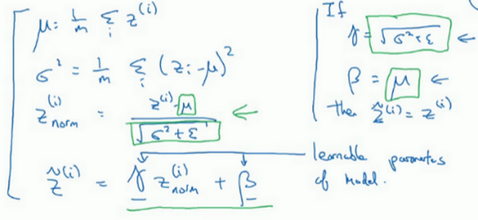

所以，在網路匹配這個單元的方式，之前可能是用$z^{(1)}$，$z^{(2)}$等等，現在則會用${\tilde{z}}^{(i)}$取代$z^{(i)}$，方便神經網路中的後續計算。如果你想放回$[l]$，以清楚的表明它位於哪層，你可以把它放這。


所以我希望你學到的是，歸一化輸入特徵$X$是怎樣有助於神經網路中的學習，**Batch**歸一化的作用是它適用的歸一化過程，不只是輸入層，甚至同樣適用於神經網路中的深度隱藏層。你應用**Batch**歸一化了一些隱藏單元值中的平均值和方差，不過訓練輸入和這些隱藏單元值的一個區別是，你也許不想隱藏單元值必須是平均值0和方差1。


比如，如果你有**sigmoid**啟動函數，你不想讓你的值總是全部集中在這裡，你想使它們有更大的方差，或不是0的平均值，以便更好的利用非線性的**sigmoid**函數，而不是使所有的值都集中於這個線性版本中，這就是為什麼有了$\gamma$和$\beta$兩個參數後，你可以確保所有的$z^{(i)}$值可以是你想賦予的任意值，或者它的作用是保證隱藏的單元已使均值和方差標準化。那裡，均值和方差由兩參數控制，即$\gamma$和$\beta$，學習算法可以設置為任何值，所以它真正的作用是，使隱藏單元值的均值和方差標準化，即$z^{(i)}$有固定的均值和方差，均值和方差可以是0和1，也可以是其它值，它是由$\gamma$和$\beta$兩參數控制的。

我希望你能學會怎樣使用**Batch**歸一化，至少就神經網路的單一層而言，在下一個影片中，我會教你如何將**Batch**歸一化與神經網路甚至是深度神經網路相匹配。對於神經網路許多不同層而言，又該如何使它適用，之後，我會告訴你，**Batch**歸一化有助於訓練神經網路的原因。所以如果覺得**Batch**歸一化起作用的原因還顯得有點神秘，那跟著我走，在接下來的兩個影片中，我們會弄清楚。

### 3.5 將 Batch Norm 擬合進神經網路（Fitting Batch Norm into a neural network）

你已經看到那些等式，它可以在單一隱藏層進行**Batch**歸一化，接下來，讓我們看看它是怎樣在深度網路訓練中擬合的吧。


假設你有一個這樣的神經網路，我之前說過，你可以認為每個單元負責計算兩件事。第一，它先計算z，然後應用其到啟動函數中再計算a，所以我可以認為，每個圓圈代表著兩步的計算過程。同樣的，對於下一層而言，那就是$z_{1}^{[2]}$和$a_{1}^{[2]}$等。所以如果你沒有應用**Batch**歸一化，你會把輸入$X$擬合到第一隱藏層，然後首先計算$z^{[1]}$，這是由$w^{[1]}$和$b^{[1]}$兩個參數控制的。接著，通常而言，你會把$z^{[1]}$擬合到啟動函數以計算$a^{[1]}$。但**Batch**歸一化的做法是將$z^{[1]}$值進行**Batch**歸一化，簡稱**BN**，此過程將由${\beta}^{[1]}$和$\gamma^{[1]}$兩參數控制，這一操作會給你一個新的規範化的$z^{[1]}$值（${\tilde{z}}^{[1]}$），然後將其輸入啟動函數中得到$a^{[1]}$，即$a^{[1]} = g^{[1]}({\tilde{z}}^{[ l]})$。


現在，你已在第一層進行了計算，此時**Batch**歸一化發生在z的計算和$a$之間，接下來，你需要應用$a^{[1]}$值來計算$z^{[2]}$，此過程是由$w^{[2]}$和$b^{[2]}$控制的。與你在第一層所做的類似，你會將$z^{[2]}$進行**Batch**歸一化，現在我們簡稱**BN**，這是由下一層的**Batch**歸一化參數所管制的，即${\beta}^{[2]}$和$\gamma^{[2]}$，現在你得到${\tilde{z}}^{[2]}$，再通過啟動函數計算出$a^{[2]}$等等。

所以需要強調的是**Batch**歸一化是發生在計算$z$和$a$之間的。直覺就是，與其應用沒有歸一化的$z$值，不如用歸一過的$\tilde{z}$，這是第一層（${\tilde{z}}^{[1]}$）。第二層同理，與其應用沒有規範過的$z^{[2]}$值，不如用經過方差和均值歸一後的${\tilde{z}}^{[2]}$。所以，你網路的參數就會是$w^{[1]}$，$b^{[1]}$，$w^{[2]}$和$b^{[2]}$等等，我們將要去掉這些參數。但現在，想像參數$w^{[1]}$，$b^{[1]}$到$w^{[l]}$，$b^{[l]}$，我們將另一些參數加入到此新網路中${\beta}^{[1]}$，${\beta}^{[2]}$，$\gamma^{[1]}$，$\gamma^{[2]}$等等。對於應用**Batch**歸一化的每一層而言。需要澄清的是，請注意，這裡的這些$\beta$（${\beta}^{[1]}$，${\beta}^{[2]}$等等）和超參數$\beta$沒有任何關係，下一張幻燈片中會解釋原因，後者是用於**Momentum**或計算各個指數的加權平均值。**Adam**論文的作者，在論文裡用$\beta$代表超參數。**Batch**歸一化論文的作者，則使用$\beta$代表此參數（${\beta}^{[1]}$，${\beta}^{[2]}$等等），但這是兩個完全不同的$\beta$。我在兩種情況下都決定使用$\beta$，以便你閱讀那些原創的論文，但**Batch**歸一化學習參數${\beta}^{[1]}$，${\beta}^{\left\lbrack2 \right\rbrack}$等等和用於**Momentum**、**Adam**、**RMSprop**算法中的$\beta$不同。


所以現在，這是你算法的新參數，接下來你可以使用想用的任何一種最佳化算法，比如使用梯度下降法來執行它。

舉個例子，對於給定層，你會計算$d{\beta}^{[l]}$，接著更新參數$\beta$為${\beta}^{[l]} = {\beta}^{[l]} - \alpha d{\beta}^{[l]}$。你也可以使用**Adam**或**RMSprop**或**Momentum**，以更新參數$\beta$和$\gamma$，並不是只應用梯度下降法。

即使在之前的影片中，我已經解釋過**Batch**歸一化是怎麼操作的，計算均值和方差，減去均值，再除以方差，如果它們使用的是深度學習程式框架，通常你不必自己把**Batch**歸一化步驟應用於**Batch**歸一化層。因此，探究框架，可寫成一行程式碼，比如說，在**TensorFlow**框架中，你可以用這個函數（`tf.nn.batch_normalization`）來實現**Batch**歸一化，我們稍後講解，但實踐中，你不必自己操作所有這些具體的細節，但知道它是如何作用的，你可以更好的理解代碼的作用。但在深度學習框架中，**Batch**歸一化的過程，經常是類似一行程式碼的東西。

所以，到目前為止，我們已經講了**Batch**歸一化，就像你在整個訓練站點上訓練一樣，或就像你正在使用**Batch**梯度下降法。


實踐中，**Batch**歸一化通常和訓練集的**mini-batch**一起使用。你應用**Batch**歸一化的方式就是，你用第一個**mini-batch**($X^{\{1\}}$)，然後計算$z^{[1]}$，這和上張幻燈片上我們所做的一樣，應用參數$w^{[1]}$和$b^{[1]}$，使用這個**mini-batch**($X^{\{1\}}$)。接著，繼續第二個**mini-batch**($X^{\{2\}}$)，接著**Batch**歸一化會減去均值，除以標準差，由${\beta}^{[1]}$和$\gamma^{[1]}$重新縮放，這樣就得到了${\tilde{z}}^{[1]}$，而所有的這些都是在第一個**mini-batch**的基礎上，你再應用啟動函數得到$a^{[1]}$。然後用$w^{[2]}$和$b^{[2]}$計算$z^{[2]}$，等等，所以你做的這一切都是為了在第一個**mini-batch**($X^{\{1\}}$)上進行一步梯度下降法。


類似的工作，你會在第二個**mini-batch**（$X^{\left\{2 \right\}}$）上計算$z^{[1]}$，然後用**Batch**歸一化來計算${\tilde{z}}^{[1]}$，所以**Batch**歸一化的此步中，你用第二個**mini-batch**（$X^{\left\{2 \right\}}$）中的數據使${\tilde{z}}^{[1]}$歸一化，這裡的**Batch**歸一化步驟也是如此，讓我們來看看在第二個**mini-batch**（$X^{\left\{2 \right\}}$）中的例子，在**mini-batch**上計算$z^{[1]}$的均值和方差，重新縮放的$\beta$和$\gamma$得到$z^{[1]}$，等等。


然後在第三個**mini-batch**（$X^{\left\{ 3 \right\}}$）上同樣這樣做，繼續訓練。

現在，我想澄清此參數的一個細節。先前我說過每層的參數是$w^{[l]}$和$b^{[l]}$，還有${\beta}^{[l]}$和$\gamma^{[l]}$，請注意計算$z$的方式如下，$z^{[l]} =w^{[l]}a^{\left\lbrack l - 1 \right\rbrack} +b^{[l]}$，但**Batch**歸一化做的是，它要看這個**mini-batch**，先將$z^{[l]}$歸一化，結果為均值0和標準方差，再由$\beta$和$$\gamma$$重縮放，但這意味著，無論$b^{[l]}$的值是多少，都是要被減去的，因為在**Batch**歸一化的過程中，你要計算$z^{[l]}$的均值，再減去平均值，在此例中的**mini-batch**中增加任何常數，數值都不會改變，因為加上的任何常數都將會被均值減去所抵消。


所以，如果你在使用**Batch**歸一化，其實你可以消除這個參數（$b^{[l]}$），或者你也可以，暫時把它設置為0，那麼，參數變成$z^{[l]} = w^{[l]}a^{\left\lbrack l - 1 \right\rbrack}$，然後你計算歸一化的$z^{[l]}$，${\tilde{z}}^{[l]} = \gamma^{[l]}z^{[l]} + {\beta}^{[l]}$，你最後會用參數${\beta}^{[l]}$，以便決定${\tilde{z}}^{[l]}$的取值，這就是原因。

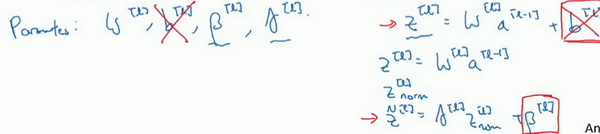

所以總結一下，因為**Batch**歸一化超過了此層$z^{[l]}$的均值，$b^{[l]}$這個參數沒有意義，所以，你必須去掉它，由${\beta}^{[l]}$代替，這是個控制參數，會影響轉移或偏置條件。

最後，請記住$z^{[l]}$的維數，因為在這個例子中，維數會是$(n^{[l]},1)$，$b^{[l]}$的尺寸為$(n^{[l]},1)$，如果是l層隱藏單元的數量，那${\beta}^{[l]}$和$\gamma^{[l]}$的維度也是$(n^{[l]},1)$，因為這是你隱藏層的數量，你有$n^{[l]}$隱藏單元，所以${\beta}^{[l]}$和$\gamma^{[l]}$用來將每個隱藏層的均值和方差縮放為網路想要的值。


讓我們總結一下關於如何用**Batch**歸一化來應用梯度下降法，假設你在使用**mini-batch**梯度下降法，你運行$t=1$到**batch**數量的**for**循環，你會在**mini-batch** $X^{\left\{ t\right\}}$上應用正向**prop**，每個隱藏層都應用正向**prop**，用**Batch**歸一化代替$z^{[l]}$為${\tilde{z}}^{[l]}$。接下來，它確保在這個**mini-batch**中，$z$值有歸一化的均值和方差，歸一化均值和方差後是${\tilde{z}}^{[l]}$，然後，你用反向**prop**計算$dw^{[l]}$和$db^{[l]}$，及所有l層所有的參數，$d{\beta}^{[l]}$和$d\gamma^{[l]}$。儘管嚴格來說，因為你要去掉$b$，這部分其實已經去掉了。最後，你更新這些參數：$w^{[l]} = w^{[l]} -\text{αd}w^{[l]}$，和以前一樣，${\beta}^{[l]} = {\beta}^{[l]} - {αd}{\beta}^{[l]}$，對於$\gamma$也是如此$\gamma^{[l]} = \gamma^{[l]} -{αd}\gamma^{[l]}$。

如果你已將梯度計算如下，你就可以使用梯度下降法了，這就是我寫到這裡的，但也適用於有**Momentum**、**RMSprop**、**Adam**的梯度下降法。與其使用梯度下降法更新**mini-batch**，你可以使用這些其它算法來更新，我們在之前幾個星期中的影片中討論過的，也可以應用其它的一些最佳化算法來更新由**Batch**歸一化添加到算法中的$\beta$ 和$\gamma$ 參數。


我希望，你能學會如何從頭開始應用**Batch**歸一化，如果你想的話。如果你使用深度學習程式框架之一，我們之後會談。，希望，你可以直接調用別人的程式框架，這會使**Batch**歸一化的使用變得很容易。

現在，以防**Batch**歸一化仍然看起來有些神秘，尤其是你還不清楚為什麼其能如此顯著的加速訓練，我們進入下一個影片，詳細討論**Batch**歸一化為何效果如此顯著，它到底在做什麼。

### 3.6 Batch Norm 為什麼奏效？（Why does Batch Norm work?）

為什麼**Batch**歸一化會起作用呢？

一個原因是，你已經看到如何歸一化輸入特徵值$x$，使其均值為0，方差1，它又是怎樣加速學習的，有一些從0到1而不是從1到1000的特徵值，通過歸一化所有的輸入特徵值$x$，以獲得類似範圍的值，可以加速學習。所以**Batch**歸一化起的作用的原因，直觀的一點就是，它在做類似的工作，但不僅僅對於這裡的輸入值，還有隱藏單元的值，這只是**Batch**歸一化作用的冰山一角，還有些深層的原理，它會有助於你對**Batch**歸一化的作用有更深的理解，讓我們一起來看看吧。

**Batch**歸一化有效的第二個原因是，它可以使權重比你的網路更滯後或更深層，比如，第10層的權重更能經受得了變化，相比於神經網路中前層的權重，比如第1層，為了解釋我的意思，讓我們來看看這個最生動形象的例子。

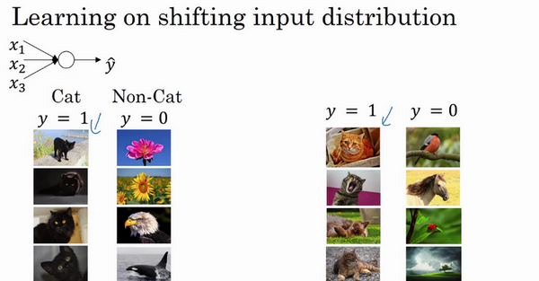

這是一個網路的訓練，也許是個淺層網路，比如**logistic**回歸或是一個神經網路，也許是個淺層網路，像這個回歸函數。或一個深層網路，建立在我們著名的貓臉識別檢測上，但假設你已經在所有黑貓的圖像上訓練了數據集，如果現在你要把此網路應用於有色貓，這種情況下，正面的例子不只是左邊的黑貓，還有右邊其它顏色的貓，那麼你的**cosfa**可能適用的不會很好。


如果圖像中，你的訓練集是這個樣子的，你的正面例子在這裡，反面例子在那裡（左圖），但你試圖把它們都統一於一個數據集，也許正面例子在這，反面例子在那裡（右圖）。你也許無法期待，在左邊訓練得很好的模組，同樣在右邊也運行得很好，即使存在運行都很好的同一個函數，但你不會希望你的學習算法去發現綠色的決策邊界，如果只看左邊數據的話。


所以使你數據改變分布的這個想法，有個有點怪的名字“**Covariate shift**”，想法是這樣的，如果你已經學習了$x$到$y$ 的映射，如果$x$ 的分布改變了，那麼你可能需要重新訓練你的學習算法。這種做法同樣適用於，如果真實函數由$x$ 到$y$ 映射保持不變，正如此例中，因為真實函數是此圖片是否是一隻貓，訓練你的函數的需要變得更加迫切，如果真實函數也改變，情況就更糟了。


“**Covariate shift**”的問題怎麼應用於神經網路呢？試想一個像這樣的深度網路，讓我們從這層（第三層）來看看學習過程。此網路已經學習了參數$w^{[3]}$和$b^{[3]}$，從第三隱藏層的角度來看，它從前層中取得一些值，接著它需要做些什麼，使希望輸出值$\hat y$接近真實值$y$。


讓我先遮住左邊的部分，從第三隱藏層的角度來看，它得到一些值，稱為$a_{1}^{[2]}$，$a_{2}^{[2]}$，$a_{3}^{[2]}$，$a_{4}^{[2]}$，但這些值也可以是特徵值$x_{1}$，$x_{2}$，$x_{3}$，$x_{4}$，第三層隱藏層的工作是找到一種方式，使這些值映射到$\hat y$，你可以想像做一些截斷，所以這些參數$w^{[3]}$和$b^{[3]}$或$w^{[4]}$和$b^{[4]}$或$w^{[5]}$和$b^{[5]}$，也許是學習這些參數，所以網路做的不錯，從左邊我用黑色筆寫的映射到輸出值$\hat y$。


現在我們把網路的左邊揭開，這個網路還有參數$w^{[2]}$，$b^{[2]}$和$w^{[1]}$，$b^{[1]}$，如果這些參數改變，這些$a^{[2]}$的值也會改變。所以從第三層隱藏層的角度來看，這些隱藏單元的值在不斷地改變，所以它就有了“**Covariate shift**”的問題，上張幻燈片中我們講過的。

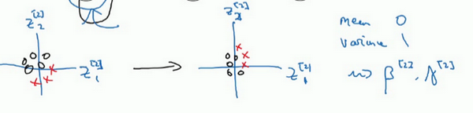

**Batch**歸一化做的，是它減少了這些隱藏值分布變化的數量。如果是繪製這些隱藏的單元值的分布，也許這是重整值$z$，這其實是$z_{1}^{[2]}$，$z_{2}^{[2]}$，我要繪製兩個值而不是四個值，以便我們設想為**2D**，**Batch**歸一化講的是$z_{1}^{[2]}$，$z_{2}^{[2]}$的值可以改變，它們的確會改變，當神經網路在之前層中更新參數，**Batch**歸一化可以確保無論其怎樣變化$z_{1}^{[2]}$，$z_{2}^{[2]}$的均值和方差保持不變，所以即使$z_{1}^{[2]}$，$z_{2}^{[2]}$的值改變，至少他們的均值和方差也會是均值0，方差1，或不一定必須是均值0，方差1，而是由${\beta}^{[2]}$和$\gamma^{[2]}$決定的值。如果神經網路選擇的話，可強制其為均值0，方差1，或其他任何均值和方差。但它做的是，它限制了在前層的參數更新，會影響數值分布的程度，第三層看到的這種情況，因此得到學習。

**Batch**歸一化減少了輸入值改變的問題，它的確使這些值變得更穩定，神經網路的之後層就會有更堅實的基礎。即使使輸入分布改變了一些，它會改變得更少。它做的是當前層保持學習，當改變時，迫使後層適應的程度減小了，你可以這樣想，它減弱了前層參數的作用與後層參數的作用之間的聯繫，它使得網路每層都可以自己學習，稍稍獨立於其它層，這有助於加速整個網路的學習。


所以，希望這能帶給你更好的直覺，重點是**Batch**歸一化的意思是，尤其從神經網路後層之一的角度而言，前層不會左右移動的那麼多，因為它們被同樣的均值和方差所限制，所以，這會使得後層的學習工作變得更容易些。

**Batch**歸一化還有一個作用，它有輕微的正則化效果，**Batch**歸一化中非直觀的一件事是，每個**mini-batch**，我會說**mini-batch**$X^{\{ t \}}$的值為$z^{\lbrack t\rbrack}$，$z^{[l]}$，在**mini-batch**計算中，由均值和方差縮放的，因為在**mini-batch**上計算的均值和方差，而不是在整個數據集上，均值和方差有一些小的噪聲，因為它只在你的**mini-batch**上計算，比如64或128或256或更大的訓練例子。因為均值和方差有一點小噪音，因為它只是由一小部分數據估計得出的。縮放過程從$z^{[l]}$到${\tilde{z}}^{[l]}$，過程也有一些噪音，因為它是用有些噪音的均值和方差計算得出的。


所以和**dropout**相似，它往每個隱藏層的啟動值上增加了噪音，**dropout**有增加噪音的方式，它使一個隱藏的單元，以一定的機率乘以0，以一定的機率乘以1，所以你的**dropout**含幾重噪音，因為它乘以0或1。

對比而言，**Batch**歸一化含幾重噪音，因為標準偏差的縮放和減去均值帶來的額外噪音。這裡的均值和標準差的估計值也是有噪音的，所以類似於**dropout**，**Batch**歸一化有輕微的正則化效果，因為給隱藏單元添加了噪音，這迫使後部單元不過分依賴任何一個隱藏單元，類似於**dropout**，它給隱藏層增加了噪音，因此有輕微的正則化效果。因為添加的噪音很微小，所以並不是巨大的正則化效果，你可以將**Batch**歸一化和**dropout**一起使用，如果你想得到**dropout**更強大的正則化效果。

也許另一個輕微非直觀的效果是，如果你應用了較大的**mini-batch**，對，比如說，你用了512而不是64，透過應用較大的**min-batch**，你減少了噪音，因此減少了正則化效果，這是**dropout**的一個奇怪的性質，就是應用較大的**mini-batch**可以減少正則化效果。

說到這裡，我會把**Batch**歸一化當成一種正則化，這確實不是其目的，但有時它會對你的算法有額外的期望效應或非期望效應。但是不要把**Batch**歸一化當作正則化，把它當作將你歸一化隱藏單元啟動值並加速學習的方式，我認為正則化幾乎是一個意想不到的副作用。

所以希望這能讓你更理解**Batch**歸一化的工作，在我們結束**Batch**歸一化的討論之前，我想確保你還知道一個細節。**Batch**歸一化一次只能處理一個**mini-batch**數據，它在**mini-batch**上計算均值和方差。所以測試時，你試圖做出預測，試著評估神經網路，你也許沒有**mini-batch**的例子，你也許一次只能進行一個簡單的例子，所以測試時，你需要做一些不同的東西以確保你的預測有意義。

在下一個也就是最後一個**Batch**歸一化影片中，讓我們詳細談談你需要注意的一些細節，來讓你的神經網路應用**Batch**歸一化來做出預測。

### 3.7 測試時的 Batch Norm（Batch Norm at test time）

**Batch**歸一化將你的數據以**mini-batch**的形式逐一處理，但在測試時，你可能需要對每個樣本逐一處理，我們來看一下怎樣調整你的網路來做到這一點。


回想一下，在訓練時，這些就是用來執行**Batch**歸一化的等式。在一個**mini-batch**中，你將**mini-batch**的$z^{(i)}$值求和，計算均值，所以這裡你只把一個**mini-batch**中的樣本都加起來，我用m來表示這個**mini-batch**中的樣本數量，而不是整個訓練集。然後計算方差，再算$z_{\text{norm}}^{(i)}$，即用均值和標準差來調整，加上$\varepsilon$是為了數值穩定性。$\tilde{z}$是用$\gamma$和$\beta$再次調整$z_{\text{norm}}$得到的。

請注意用於調節計算的$\mu$和$\sigma^{2}$是在整個**mini-batch**上進行計算，但是在測試時，你可能不能將一個**mini-batch**中的6428或2056個樣本同時處理，因此你需要用其它方式來得到$\mu$和$\sigma^{2}$，而且如果你只有一個樣本，一個樣本的均值和方差沒有意義。那麼實際上，為了將你的神經網路運用於測試，就需要單獨估算$\mu$和$\sigma^{2}$，在典型的**Batch**歸一化運用中，你需要用一個指數加權平均來估算，這個平均數涵蓋了所有**mini-batch**，接下來我會具體解釋。


我們選擇$l$層，假設我們有**mini-batch**，$X^{[1]}$，$X^{[2]}$，$X^{[3]}$……以及對應的$y$值等等，那麼在為$l$層訓練$X^{\{ 1\}}$時，你就得到了$\mu^{[l]}$，我還是把它寫做第一個**mini-batch**和這一層的$\mu$吧，（$\mu^{[l]} \rightarrow \mu^{\left\{1 \right\}[l]}$）。當你訓練第二個**mini-batch**，在這一層和這個**mini-batch**中，你就會得到第二個$\mu$（$\mu^{\{2\}[l]}$）值。然後在這一隱藏層的第三個**mini-batch**，你得到了第三個$\mu$（$\mu^{\left\{3 \right\}[l]}$）值。正如我們之前用的指數加權平均來計算$\theta_{1}$，$\theta_{2}$，$\theta_{3}$的均值，當時是試著計算當前氣溫的指數加權平均，你會這樣來追蹤你看到的這個均值向量的最新平均值，於是這個指數加權平均就成了你對這一隱藏層的$z$均值的估值。同樣的，你可以用指數加權平均來追蹤你在這一層的第一個**mini-batch**中所見的$\sigma^{2}$的值，以及第二個**mini-batch**中所見的$\sigma^{2}$的值等等。因此在用不同的**mini-batch**訓練神經網路的同時，能夠得到你所查看的每一層的$\mu$和$\sigma^{2}$的平均數的即時數值。


最後在測試時，對應這個等式（$z_{\text{norm}}^{(i)} = \frac{z^{(i)} -\mu}{\sqrt{\sigma^{2} +\varepsilon}}$），你只需要用你的$z$值來計算$z_{\text{norm}}^{(i)}$，用$\mu$和$\sigma^{2}$的指數加權平均，用你手頭的最新數值來做調整，然後你可以用左邊我們剛算出來的$z_{\text{norm}}$和你在神經網路訓練過程中得到的$\beta$和$\gamma$參數來計算你那個測試樣本的$\tilde{z}$值。

總結一下就是，在訓練時，$\mu$和$\sigma^{2}$是在整個**mini-batch**上計算出來的包含了像是64或28或其它一定數量的樣本，但在測試時，你可能需要逐一處理樣本，方法是根據你的訓練集估算$\mu$和$\sigma^{2}$，估算的方式有很多種，理論上你可以在最終的網路中運行整個訓練集來得到$\mu$和$\sigma^{2}$，但在實際操作中，我們通常運用指數加權平均來追蹤在訓練過程中你看到的$\mu$和$\sigma^{2}$的值。還可以用指數加權平均，有時也叫做流動平均來粗略估算$\mu$和$\sigma^{2}$，然後在測試中使用$\mu$和$\sigma^{2}$的值來進行你所需要的隱藏單元$z$值的調整。在實踐中，不管你用什麼方式估算$\mu$和$\sigma^{2}$，這套過程都是比較穩健的，因此我不太會擔心你具體的操作方式，而且如果你使用的是某種深度學習框架，通常會有預設的估算$\mu$和$\sigma^{2}$的方式，應該一樣會起到比較好的效果。但在實踐中，任何合理的估算你的隱藏單元$z$值的均值和方差的方式，在測試中應該都會有效。

**Batch**歸一化就講到這裡，使用**Batch**歸一化，你能夠訓練更深的網路，讓你的學習算法運行速度更快，在結束這週的課程之前，我還想和你們分享一些關於深度學習框架的想法，讓我們在下一段影片中一起討論這個話題。

### 3.8 Softmax 回歸（Softmax regression）

到目前為止，我們講到過的分類的例子都使用了二分分類，這種分類只有兩種可能的標記0或1，這是一隻貓或者不是一隻貓，如果我們有多種可能的類型的話呢？有一種**logistic**回歸的一般形式，叫做**Softmax**回歸，能讓你在試圖識別某一分類時做出預測，或者說是多種分類中的一個，不只是識別兩個分類，我們來一起看一下。


假設你不單需要識別貓，而是想識別貓，狗和小雞，我把貓加做類1，狗為類2，小雞是類3，如果不屬於以上任何一類，就分到“其它”或者說“以上均不符合”這一類，我把它叫做類0。這裡顯示的圖片及其對應的分類就是一個例子，這幅圖片上是一隻小雞，所以是類3，貓是類1，狗是類2，我猜這是一隻無尾熊，所以以上均不符合，那就是類0，下一個類3，以此類推。我們將會用符號表示，我會用大寫的$C$來表示你的輸入會被分入的類別總個數，在這個例子中，我們有4種可能的類別，包括“其它”或“以上均不符合”這一類。當有4個分類時，指示類別的數字，就是從0到$C-1$，換句話說就是0、1、2、3。

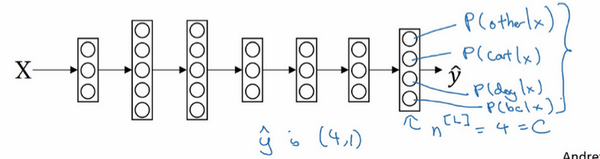

在這個例子中，我們將建立一個神經網路，其輸出層有4個，或者說$C$個輸出單元，因此$n$，即輸出層也就是$L$層的單元數量，等於4，或者一般而言等於$C$。我們想要輸出層單元的數字告訴我們這4種類型中每個的機率有多大，所以這裡的第一個節點(最後輸出的第1個方格+圓圈)輸出的應該是或者說我們希望它輸出“其它”類的機率。在輸入$X$的情況下，這個(最後輸出的第2個方格+圓圈)會輸作弊的機率。在輸入$X$的情況下，這個會輸出狗的機率(最後輸出的第3個方格+圓圈)。在輸入$X$的情況下，輸出小雞的機率（最後輸出的第4個方格+圓圈），我把小雞縮寫為**bc**（**baby chick**）。因此這裡的$\hat y$將是一個$4×1$維向量，因為它必須輸出四個數字，給你這四種機率，因為它們加起來應該等於1，輸出中的四個數字加起來應該等於1。

讓你的網路做到這一點的標準模型要用到**Softmax**層，以及輸出層來生成輸出，讓我把式子寫下來，然後回過頭來，就會對**Softmax**的作用有一點感覺了。


在神經網路的最後一層，你將會像往常一樣計算各層的線性部分，$z^{[l]}$這是最後一層的$z$變數，記住這是大寫$L$層，和往常一樣，計算方法是$z^{[l]} = W^{[l]}a^{[L-1]} + b^{[l]}$，算出了$z$之後，你需要應用**Softmax**啟動函數，這個啟動函數對於**Softmax**層而言有些不同，它的作用是這樣的。首先，我們要計算一個臨時變數，我們把它叫做t，它等於$e^{z^{[l]}}$，這適用於每個元素，而這裡的$z^{[l]}$，在我們的例子中，$z^{[l]}$是4×1的，四維向量$t=e^{z^{[l]}}$，這是對所有元素求冪，$t$也是一個4×1維向量，然後輸出的$a^{[l]}$，基本上就是向量$t$，但是會歸一化，使和為1。因此$a^{[l]} = \frac{e^{z^{[l]}}}{\sum_{j =1}^{4}t_{i}}$，換句話說，$a^{[l]}$也是一個4×1維向量，而這個四維向量的第$i$個元素，我把它寫下來，$a_{i}^{[l]} = \frac{t_{i}}{\sum_{j =1}^{4}t_{i}}$，以防這裡的計算不夠清晰易懂，我們馬上會舉個例子來詳細解釋。

我們來看一個例子，詳細解釋，假設你算出了$z^{[l]}$，$z^{[l]}$是一個四維向量，假設為$z^{[l]} = \begin{bmatrix} 5 \\ 2 \\  - 1 \\ 3 \\ \end{bmatrix}$，我們要做的就是用這個元素取冪方法來計算$t$，所以$t =\begin{bmatrix} e^{5} \\ e^{2} \\ e^{- 1} \\ e^{3} \\ \end{bmatrix}$，如果你按一下計算器就會得到以下值$t = \begin{bmatrix} 148.4 \\ 7.4 \\ 0.4 \\ 20.1 \\ \end{bmatrix}$，我們從向量$t$得到向量$a^{[l]}$就只需要將這些項目歸一化，使總和為1。如果你把$t$的元素都加起來，把這四個數字加起來，得到176.3，最終$a^{[l]} = \frac{t} {176.3}$。


例如這裡的第一個節點，它會輸出$\frac{e^{5}}{176.3} =0.842$，這樣說來，對於這張圖片，如果這是你得到的$z$值($\begin{bmatrix} 5 \\ 2 \\  - 1 \\ 3 \\ \end{bmatrix}$)，它是類0的機率就是84.2%。下一個節點輸出$\frac{e^{2}}{176.3} =0.042$，也就是4.2%的機率。下一個是$\frac{e^{- 1}}{176.3} =0.002$。最後一個是$\frac{e^{3}}{176.3} =0.114$，也就是11.4%的機率屬於類3，也就是小雞組，對吧？這就是它屬於類0，類1，類2，類3的可能性。


神經網路的輸出$a^{[l]}$，也就是$\hat y$，是一個4×1維向量，這個4×1向量的元素就是我們算出來的這四個數位($\begin{bmatrix} 0.842 \\ 0.042 \\ 0.002 \\ 0.114 \\ \end{bmatrix}$)，所以這種算法通過向量$z^{[l]}$計算出總和為1的四個機率。


如果我們總結一下從$z^{[l]}$到$a^{[l]}$的計算步驟，整個計算過程，從計算冪到得出臨時變數$t$，再歸一化，我們可以將此概括為一個**Softmax**啟動函數。設$a^{[l]} = g^{[l]}(z^{[l]})$，這一啟動函數的與眾不同之處在於，這個啟動函數$g$ 需要輸入一個4×1維向量，然後輸出一個4×1維向量。之前，我們的啟動函數都是接受單行數值輸入，例如**Sigmoid**和**ReLu**啟動函數，輸入一個實數，輸出一個實數。**Softmax**啟動函數的特殊之處在於，因為需要將所有可能的輸出歸一化，就需要輸入一個向量，最後輸出一個向量。

那麼**Softmax**分類器還可以代表其它的什麼東西嗎？我來舉幾個例子，你有兩個輸入$x_{1}$，$x_{2}$，它們直接輸入到**Softmax**層，它有三四個或者更多的輸出節點，輸出$\hat y$，我將向你展示一個沒有隱藏層的神經網路，它所做的就是計算$z^{[1]} = W^{[1]}x + b^{[1]}$，而輸出的出$a^{[l]}$，或者說$\hat y$，$a^{[l]} = y = g(z^{[1]})$，就是$z^{[1]}$的**Softmax**啟動函數，這個沒有隱藏層的神經網路應該能讓你對**Softmax**函數能夠代表的東西有所了解。


這個例子中（左邊圖），原始輸入只有$x_{1}$和$x_{2}$，一個$C=3$個輸出分類的**Softmax**層能夠代表這種類型的決策邊界，請注意這是幾條線性決策邊界，但這使得它能夠將數據分到3個類別中，在這張圖表中，我們所做的是選擇這張圖中顯示的訓練集，用數據的3種輸出標籤來訓練**Softmax**分類器，圖中的顏色顯示了**Softmax**分類器的輸出的閾值，輸入的著色是基於三種輸出中機率最高的那種。因此我們可以看到這是**logistic**回歸的一般形式，有類似線性的決策邊界，但有超過兩個分類，分類不只有0和1，而是可以是0，1或2。

這是（中間圖）另一個**Softmax**分類器可以代表的決策邊界的例子，用有三個分類的數據集來訓練，這裡（右邊圖）還有一個。對吧，但是直覺告訴我們，任何兩個分類之間的決策邊界都是線性的，這就是為什麼你看到，比如這裡黃色和紅色分類之間的決策邊界是線性邊界，紫色和紅色之間的也是線性邊界，紫色和黃色之間的也是線性決策邊界，但它能用這些不同的線性函數來把空間分成三類。


我們來看一下更多分類的例子，這個例子中（左邊圖）$C=4$，因此這個綠色分類和**Softmax**仍舊可以代表多種分類之間的這些類型的線性決策邊界。另一個例子（中間圖）是$C=5$類，最後一個例子（右邊圖）是$C=6$，這顯示了**Softmax**分類器在沒有隱藏層的情況下能夠做到的事情，當然更深的神經網路會有$x$，然後是一些隱藏單元，以及更多隱藏單元等等，你就可以學習更複雜的非線性決策邊界，來區分多種不同分類。

我希望你了解了神經網路中的**Softmax**層或者**Softmax**啟動函數有什麼作用，下一個影片中，我們來看一下你該怎樣訓練一個使用**Softmax**層的神經網路。

### 3.9 訓練一個 Softmax 分類器（Training a Softmax classifier）

上一個影片中我們學習了**Softmax**層和**Softmax**啟動函數，在這個影片中，你將更深入地了解**Softmax**分類，並學習如何訓練一個使用了**Softmax**層的模型。


回憶一下我們之前舉的的例子，輸出層計算出的$z^{[l]}$如下，$z^{[l]} = \begin{bmatrix} 5 \\ 2 \\  - 1 \\ 3 \\ \end{bmatrix}$我們有四個分類$C=4$，$z^{[l]}$可以是4×1維向量，我們計算了臨時變數$t$，$t = \begin{bmatrix} e^{5} \\ e^{2} \\ e^{- 1} \\ e^{3} \\ \end{bmatrix}$，對元素進行冪運算，最後，如果你的輸出層的啟動函數$g^{[L]}()$是**Softmax**啟動函數，那麼輸出就會是這樣的：


簡單來說就是用臨時變數$t$將它歸一化，使總和為1，於是這就變成了$a^{[L]}$，你注意到向量$z$中，最大的元素是5，而最大的機率也就是第一種機率。


**Softmax**這個名稱的來源是與所謂**hardmax**對比，**hardmax**會把向量$z$變成這個向量$\begin{bmatrix} 1 \\ 0 \\ 0 \\ 0 \\ \end{bmatrix}$，**hardmax**函數會觀察$z$的元素，然後在$z$中最大元素的位置放上1，其它位置放上0，所這是一個**hard max**，也就是最大的元素的輸出為1，其它的輸出都為0。與之相反，**Softmax**所做的從$z$到這些機率的映射更為溫和，我不知道這是不是一個好名字，但至少這就是**softmax**這一名稱背後所包含的想法，與**hardmax**正好相反。

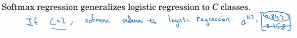

有一點我沒有細講，但之前已經提到過的，就是**Softmax**回歸或**Softmax**啟動函數將**logistic**啟動函數推廣到$C$類，而不僅僅是兩類，結果就是如果$C=2$，那麼$C=2$的**Softmax**實際上變回了**logistic**回歸，我不會在這個影片中給出證明，但是大致的證明思路是這樣的，如果$C=2$，並且你應用了**Softmax**，那麼輸出層$a^{[L]}$將會輸出兩個數字，如果$C=2$的話，也許輸出0.842和0.158，對吧？這兩個數字加起來要等於1，因為它們的和必須為1，其實它們是冗餘的，也許你不需要計算兩個，而只需要計算其中一個，結果就是你最終計算那個數字的方式又回到了**logistic**回歸計算單個輸出的方式。這算不上是一個證明，但我們可以從中得出結論，**Softmax**回歸將**logistic**回歸推廣到了兩種分類以上。


接下來我們來看怎樣訓練帶有**Softmax**輸出層的神經網路，具體而言，我們先定義訓練神經網路使會用到的損失函數。舉個例子，我們來看看訓練集中某個樣本的目標輸出，真實標籤是$\begin{bmatrix} 0 \\ 1 \\ 0 \\ 0 \\ \end{bmatrix}$，用上一個影片中講到過的例子，這表示這是一張貓的圖片，因為它屬於類1，現在我們假設你的神經網路輸出的是$\hat y$，$\hat y$是一個包括總和為1的機率的向量，$y = \begin{bmatrix} 0.3 \\ 0.2 \\ 0.1 \\ 0.4 \\ \end{bmatrix}$，你可以看到總和為1，這就是$a^{[l]}$，$a^{[l]} = y = \begin{bmatrix} 0.3 \\ 0.2 \\ 0.1 \\ 0.4 \\ \end{bmatrix}$。對於這個樣本神經網路的表現不佳，這實際上是一隻貓，但卻只分配到20%是貓的機率，所以在本例中表現不佳。


那麼你想用什麼損失函數來訓練這個神經網路？在**Softmax**分類中，我們一般用到的損失函數是$L(\hat y,y ) = - \sum_{j = 1}^{4}{y_{j}log\hat y_{j}}$，我們來看上面的單個樣本來更好地理解整個過程。注意在這個樣本中$y_{1} =y_{3} = y_{4} = 0$，因為這些都是0，只有$y_{2} =1$，如果你看這個求和，所有含有值為0的$y_{j}$的項都等於0，最後只剩下$-y_{2}t{log}\hat y_{2}$，因為當你按照下標$j$全部加起來，所有的項都為0，除了$j=2$時，又因為$y_{2}=1$，所以它就等於$- \ log\hat y_{2}$。
$L\left( \hat y,y \right) = - \sum_{j = 1}^{4}{y_{j}\log \hat y_{j}} = - y_{2}{\ log} \hat y_{2} = - {\ log} \hat y_{2}$

這就意味著，如果你的學習算法試圖將它變小，因為梯度下降法是用來減少訓練集的損失的，要使它變小的唯一方式就是使$-{\log}\hat y_{2}$變小，要想做到這一點，就需要使$\hat y_{2}$儘可能大，因為這些是機率，所以不可能比1大，但這的確也講得通，因為在這個例子中$x$是貓的圖片，你就需要這項輸出的機率儘可能地大（$y= \begin{bmatrix} 0.3 \\ 0.2 \\ 0.1 \\ 0.4 \\ \end{bmatrix}$中第二個元素）。

概括來講，損失函數所做的就是它找到你的訓練集中的真實類別，然後試圖使該類別相應的機率儘可能地高，如果你熟悉統計學中最大似然估計，這其實就是最大似然估計的一種形式。但如果你不知道那是什麼意思，也不用擔心，用我們剛剛講過的算法思維也足夠了。

這是單個訓練樣本的損失，整個訓練集的損失$J$又如何呢？也就是設定參數的代價之類的，還有各種形式的偏差的代價，它的定義你大致也能猜到，就是整個訓練集損失的總和，把你的訓練算法對所有訓練樣本的預測都加起來，

$J( w^{[1]},b^{[1]},\ldots\ldots) = \frac{1}{m}\sum_{i = 1}^{m}{L( \hat y^{(i)},y^{(i)})}$

因此你要做的就是用梯度下降法，使這裡的損失最小化。


最後還有一個實現細節，注意因為$C=4$，$y$是一個4×1向量，$y$也是一個4×1向量，如果你實現向量化，矩陣大寫$Y$就是$\lbrack y^{(1)}\text{}y^{(2)}\ldots\ldots\ y^{\left( m \right)}\rbrack$，例如如果上面這個樣本是你的第一個訓練樣本，那麼矩陣$Y =\begin{bmatrix} 0 & 0 & 1 & \ldots \\ 1 & 0 & 0 & \ldots \\ 0 & 1 & 0 & \ldots \\ 0 & 0 & 0 & \ldots \\ \end{bmatrix}$，那麼這個矩陣$Y$最終就是一個$4×m$維矩陣。類似的，$\hat{Y} = \lbrack{\hat{y}}^{(1)}{\hat{y}}^{(2)} \ldots \ldots\ {\hat{y}}^{(m)}\rbrack$，這個其實就是${\hat{y}}^{(1)}$（$a^{[l](1)} = y^{(1)} = \begin{bmatrix} 0.3 \\ 0.2 \\ 0.1 \\ 0.4 \\ \end{bmatrix}$），或是第一個訓練樣本的輸出，那麼$\hat{Y} = \begin{bmatrix} 0.3 & \ldots \\ 0.2 & \ldots \\ 0.1 & \ldots \\ 0.4 & \ldots \\ \end{bmatrix}$，$\hat{Y}$本身也是一個$4×m$維矩陣。


最後我們來看一下，在有**Softmax**輸出層時如何實現梯度下降法，這個輸出層會計算$z^{[l]}$，它是$C×1$維的，在這個例子中是4×1，然後你用**Softmax**啟動函數來得到$a^{[l]}$或者說$y$，然後又能由此計算出損失。我們已經講了如何實現神經網路前向傳播的步驟，來得到這些輸出，並計算損失，那麼反向傳播步驟或者梯度下降法又如何呢？其實初始化反向傳播所需要的關鍵步驟或者說關鍵方程是這個表達式$dz^{[l]} = \hat{y} -y$，你可以用$\hat{y}$這個4×1向量減去$y$這個4×1向量，你可以看到這些都會是4×1向量，當你有4個分類時，在一般情況下就是$C×1$，這符合我們對$dz$的一般定義，這是對$z^{[l]}$損失函數的偏導數（$dz^{[l]} = \frac{\partial J}{\partial z^{[l]}}$），如果你精通微積分就可以自己推導，或者說如果你精通微積分，可以試著自己推導，但如果你需要從零開始使用這個公式，它也一樣有用。


有了這個，你就可以計算$dz^{[l]}$，然後開始反向傳播的過程，計算整個神經網路中所需要的所有導數。


但在這週的初級練習中，我們將開始使用一種深度學習程式框架，對於這些編程框架，通常你只需要專注於把前向傳播做對，只要你將它指明為編程框架，前向傳播，它自己會弄明白怎樣反向傳播，會幫你實現反向傳播，所以這個表達式值得牢記（$dz^{[l]} = \hat{y} -y$），如果你需要從頭開始，實現**Softmax**回歸或者**Softmax**分類，但其實在這週的初級練習中你不會用到它，因為編程框架會幫你搞定導數計算。

**Softmax**分類就講到這裡，有了它，你就可以運用學習算法將輸入分成不止兩類，而是$C$個不同類別。接下來我想向你展示一些深度學習程式框架，可以讓你在實現深度學習算法時更加高效，讓我們在下一個影片中一起討論。

### 3.10 深度學習框架（Deep Learning frameworks）

你已經差不多從零開始學習了使用**Python**和**NumPy**實現深度學習算法，很高興你這樣做了，因為我希望你理解這些深度學習算法實際上在做什麼。但你會發現，除非應用更複雜的模型，例如卷積神經網路，或者循環神經網路，或者當你開始應用很大的模型，否則它就越來越不實用了，至少對大多數人而言，從零開始全部靠自己實現並不現實。

幸運的是，現在有很多好的深度學習軟體框架，可以幫助你實現這些模型。類比一下，我猜你知道如何做矩陣乘法，你還應該知道如何編程實現兩個矩陣相乘，但是當你在建很大的應用時，你很可能不想用自己的矩陣乘法函數，而是想要訪問一個數值線性代數庫，它會更高效，但如果你明白兩個矩陣相乘是怎麼回事還是挺有用的。我認為現在深度學習已經很成熟了，利用一些深度學習框架會更加實用，會使你的工作更加有效，那就讓我們來看下有哪些框架。


現在有許多深度學習框架，能讓實現神經網路變得更簡單，我們來講主要的幾個。每個框架都針對某一用戶或開發群體的，我覺得這裡的每一個框架都是某類應用的可靠選擇，有很多人寫文章比較這些深度學習框架，以及這些深度學習框架發展得有多好，而且因為這些框架往往不斷進化，每個月都在進步，如果你想看看關於這些框架的優劣之處的討論，我留給你自己去網上搜索，但我認為很多框架都在很快進步，越來越好，因此我就不做強烈推薦了，而是與你分享推薦一下選擇框架的標準。

一個重要的標準就是便於編程，這既包括神經網路的開發和疊代，還包括為產品進行配置，為了成千上百萬，甚至上億用戶的實際使用，取決於你想要做什麼。

第二個重要的標準是運行速度，特別是訓練大數據集時，一些框架能讓你更高效地運行和訓練神經網路。

還有一個標準人們不常提到，但我覺得很重要，那就是這個框架是否真的開放，要是一個框架真的開放，它不僅需要開源，而且需要良好的管理。不幸的是，在軟體行業中，一些公司有開源軟體的歷史，但是公司保持著對軟體的全權控制，當幾年時間過去，人們開始使用他們的軟體時，一些公司開始逐漸關閉曾經開放的資源，或將功能轉移到他們專營的雲服務中。因此我會注意的一件事就是你能否相信這個框架能長時間保持開源，而不是在一家公司的控制之下，它未來有可能出於某種原因選擇停止開源，即便現在這個軟體是以開源的形式發布的。但至少在短期內，取決於你對語言的偏好，看你更喜歡**Python**，**Java**還是**C++**或者其它什麼，也取決於你在開發的應用，是計算機視覺，還是自然語言處理或者線上廣告，等等，我認為這裡的多個框架都是很好的選擇。

程序框架就講到這裡，通過提供比數值線性代數庫更高程度的抽象化，這裡的每一個程序框架都能讓你在開發深度機器學習應用時更加高效。

### 3.11 TensorFlow

歡迎來到這週的最後一個影片，有很多很棒的深度學習程式框架，其中一個是**TensorFlow**，我很期待幫助你開始學習使用**TensorFlow**，我想在這個影片中向你展示**TensorFlow**程序的基本結構，然後讓你自己練習，學習更多細節，並運用到本週的程式練習中，這週的程式練習需要花些時間來做，所以請務必留出一些空餘時間。

先提一個啟發性的問題，假設你有一個損失函數$J$需要最小化，在本例中，我將使用這個高度簡化的損失函數，$Jw= w^{2}-10w+25$，這就是損失函數，也許你已經注意到該函數其實就是${(w -5)}^{2}$，如果你把這個二次方式子展開就得到了上面的表達式，所以使它最小的$w$值是5，但假設我們不知道這點，你只有這個函數，我們來看一下怎樣用**TensorFlow**將其最小化，因為一個非常類似的程序結構可以用來訓練神經網路。其中可以有一些複雜的損失函數$J(w,b)$取決於你的神經網路的所有參數，然後類似的，你就能用**TensorFlow**自動找到使損失函數最小的$w$和$b$的值。但讓我們先從左邊這個更簡單的例子入手。


我在我的**Jupyter notebook**中運行**Python**，

```
import numpy as np
import tensorflow as tf
#導入TensorFlow

w = tf.Variable(0,dtype = tf.float32)
#接下來，讓我們定義參數w，在TensorFlow中，你要用tf.Variable()來定義參數

#然後我們定義損失函數：

cost = tf.add(tf.add(w**2,tf.multiply(- 10.,w)),25)
#然後我們定義損失函數J
然後我們再寫：

train = tf.train.GradientDescentOptimizer(0.01).minimize(cost)
#(讓我們用0.01的學習率，目標是最小化損失)。

#最後下面的幾行是慣用表達式:

init = tf.global_variables_initializer()

session = tf.Session()#這樣就開啟了一個TensorFlow session。

session.run(init)#來初始化全局變數。

#然後讓TensorFlow評估一個變數，我們要用到:

session.run(w)

#上面的這一行將w初始化為0，並定義損失函數，我們定義train為學習算法，它用梯度下降法最佳化器使損失函數最小化，但實際上我們還沒有運行學習算法，所以#上面的這一行將w初始化為0，並定義損失函數，我們定義train為學習算法，它用梯度下降法最佳化器使損失函數最小化，但實際上我們還沒有運行學習算法，所以session.run(w)評估了w，讓我：：

print(session.run(w))

```

所以如果我們運行這個，它評估$w$等於0，因為我們什麼都還沒運行。

```
#現在讓我們輸入：

$session.run(train)，它所做的就是運行一步梯度下降法。
#接下來在運行了一步梯度下降法後，讓我們評估一下w的值，再print：

print(session.run(w))
#在一步梯度下降法之後，w現在是0.1。
```

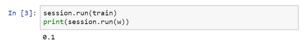

現在我們運行梯度下降1000次疊代：


這是運行了梯度下降的1000次疊代，最後$w$變成了4.99999，記不記得我們說${(w -5)}^{2}$最小化，因此$w$的最優值是5，這個結果已經很接近了。

希望這個讓你對**TensorFlow**程序的大致結構有了了解，當你做編程練習，使用更多**TensorFlow**代碼時，我這裡用到的一些函數你會熟悉起來，這裡有個地方要注意，$w$是我們想要最佳化的參數，因此將它稱為變數，注意我們需要做的就是定義一個損失函數，使用這些`add`和`multiply`之類的函數。**TensorFlow**知道如何對`add`和`mutiply`，還有其它函數求導，這就是為什麼你只需基本實現前向傳播，它能弄明白如何做反向傳播和梯度計算，因為它已經內建在`add`，`multiply`和平方函數中。

對了，要是覺得這種寫法不好看的話，**TensorFlow**其實還重載了一般的加減運算等等，因此你也可以把$cost$寫成更好看的形式，把之前的`cost`標成注釋，重新運行，得到了同樣的結果。


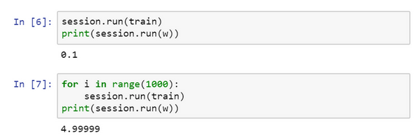

一旦$w$被稱為**TensorFlow**變數，平方，乘法和加減運算都重載了，因此你不必使用上面這種不好看的句法。

**TensorFlow**還有一個特點，我想告訴你，那就是這個例子將$w$的一個固定函數最小化了。如果你想要最小化的函數是訓練集函數又如何呢？不管你有什麼訓練數據$x$，當你訓練神經網路時，訓練數據$x$會改變，那麼如何把訓練數據加入**TensorFlow**程序呢？

我會定義$x$，把它想做扮演訓練數據的角色，事實上訓練數據有$x$和$y$，但這個例子中只有$x$，把$x$定義為：

`x = tf.placeholder(tf.float32,[3,1])`，讓它成為$[3,1]$數組，我要做的就是，因為$cost$這個二次方程的三項前有固定的係數，它是$w^{2}+10w + 25$，我們可以把這些數字1，-10和25變成數據，我要做的就是把$cost$替換成：

`cost = x[0][0]*w**2 +x[1][0]*w + x[2][0]`，現在$x$變成了控制這個二次函數係數的數據，這個**placeholder**函數告訴**TensorFlow**，你稍後會為$x$提供數值。

讓我們再定義一個數組，`coefficient = np.array([[1.],[-10.],[25.]])`，這就是我們要接入$x$的數據。最後我們需要用某種方式把這個係數數組接入變數$x$，做到這一點的句法是，在訓練這一步中，要提供給$x$的數值，我在這裡設置：

`feed_dict = {x:coefficients}`

好了，希望沒有語法錯誤，我們重新運行它，希望得到和之前一樣的結果。


現在如果你想改變這個二次函數的係數，假設你把：

`coefficient = np.array([[1.],[-10.],[25.]])`

改為：`coefficient = np.array([[1.],[-20.],[100.]])`

現在這個函數就變成了${(w -10)}^{2}$，如果我重新運行，希望我得到的使${(w -10)}^{2}$最小化的$w$值為10，讓我們看一下，很好，在梯度下降1000次疊代之後，我們得到接近10的$w$。


在你做編程練習時，見到更多的是，**TensorFlow**中的**placeholder**是一個你之後會賦值的變數，這種方式便於把訓練數據加入損失方程，把數據加入損失方程用的是這個句法，當你運行訓練疊代，用`feed_dict`來讓`x=coefficients`。如果你在做**mini-batch**梯度下降，在每次疊代時，你需要插入不同的**mini-batch**，那麼每次疊代，你就用`feed_dict`來餵入訓練集的不同子集，把不同的**mini-batch**餵入損失函數需要數據的地方。

希望這讓你了解了**TensorFlow**能做什麼，讓它如此強大的是，你只需說明如何計算損失函數，它就能求導，而且用一兩行程式碼就能運用梯度最佳化器，**Adam**最佳化器或者其他最佳化器。

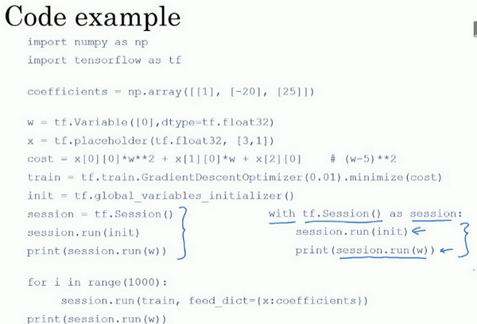

這還是剛才的代碼，我稍微整理了一下，儘管這些函數或變數看起來有點神秘，但你在做編程練習時多練習幾次就會熟悉起來了。


還有最後一點我想提一下，這三行（藍色大括號部分）在**TensorFlow**裡是符合表達習慣的，有些程式設計師會用這種形式來替代，作用基本上是一樣的。

但這個**with**結構也會在很多**TensorFlow**程序中用到，它的意思基本上和左邊的相同，但是**Python**中的**with**命令更方便清理，以防在執行這個內循環時出現錯誤或例外。所以你也會在編程練習中看到這種寫法。那麼這個代碼到底做了什麼呢？讓我們看這個等式：

`cost =x[0][0]*w**2 +x[1][0]*w + x[2][0]#(w-5)**2`

**TensorFlow**程序的核心是計算損失函數，然後**TensorFlow**自動計算出導數，以及如何最小化損失，因此這個等式或者這行程式碼所做的就是讓**TensorFlow**建立計算圖，計算圖所做的就是取$x[0][0]$，取$w$，然後將它平方，然後$x[0][0]$和$w^{2}$相乘，你就得到了$x[0][0]*w^{2}$，以此類推，最終整個建立起來計算$cost = [0][0]*w**2 + x[1][0]*w + x[2][0]$，最後你得到了損失函數。


**TensorFlow**的優點在於，透過用這個計算損失，計算圖基本實現前向傳播，**TensorFlow**已經內建了所有必要的反向函數，回憶一下訓練深度神經網路時的一組前向函數和一組反向函數，而像**TensorFlow**之類的程式框架已經內建了必要的反向函數，這也是為什麼透過內建函數來計算前向函數，它也能自動用反向函數來實現反向傳播，即便函數非常複雜，再幫你計算導數，這就是為什麼你不需要明確實現反向傳播，這是編程框架能幫你變得高效的原因之一。


如果你看**TensorFlow**的使用說明，我只是指出**TensorFlow**的說明用了一套和我不太一樣的符號來畫計算圖，它用了$x[0][0]​$，$w​$，然後它不是寫出值，想這裡的$w^{2}​$，**TensorFlow**使用說明傾向於只寫運算符，所以這裡就是平方運算，而這兩者一起指向乘法運算，以此類推，然後在最後的節點，我猜應該是一個將$x[2][0]​$加上去得到最終值的加法運算。


為本課程起見，我認為計算圖用第一種方式會更容易理解，但是如果你去看**TensorFlow**的使用說明，如果你看到說明裡的計算圖，你會看到另一種表示方式，節點都用運算來標記而不是值，但這兩種呈現方式表達的是同樣的計算圖。

在編程框架中你可以用一行程式碼做很多事情，例如，你不想用梯度下降法，而是想用**Adam**最佳化器，你只要改變這行程式碼，就能很快換掉它，換成更好的最佳化算法。所有現代深度學習程式框架都支持這樣的功能，讓你很容易就能編寫複雜的神經網路。

我希望我幫助你了解了**TensorFlow**程序典型的結構，概括一下這週的內容，你學習了如何系統化地組織超參數搜索過程，我們還講了**Batch**歸一化，以及如何用它來加速神經網路的訓練，最後我們講了深度學習的程式框架，有很多很棒的程式框架，這最後一個影片我們重點講了**TensorFlow**。有了它，我希望你享受這週的程式練習，幫助你更熟悉這些概念。
