#第三門課 結構化機器學習項目（Structuring Machine Learning Projects）

第一週 機器學習（ML）策略（1）（ML strategy（1））
--------------------------------------------------------------
[TOC]
### 1.1 為什麼是ML策略？（Why ML Strategy?）

大家好，歡迎收聽本課，如何構建你的機器學習項目也就是說機器學習的策略。我希望通過這門課程你們能夠學到如何更快速高效地最佳化你的機器學習系統。那麼，什麼是機器學習策略呢？

我們從一個啟發性的例子開始講，假設你正在除錯你的貓分類器，經過一段時間的調整，你的系統達到了90%準確率，但對你的應用程式來說還不夠好。

你可能有很多想法去改善你的系統，比如，你可能想我們去收集更多的訓練數據吧。或者你會說，可能你的訓練集的多樣性還不夠，你應該收集更多不同姿勢的貓咪圖片，或者更多樣化的反例集。或者你想再用梯度下降訓練算法，訓練久一點。或者你想嘗試用一個完全不同的最佳化算法，比如**Adam**最佳化算法。或者嘗試使用規模更大或者更小的神經網路。或者你想試試**dropout**或者$L2$正則化。或者你想修改網路的架構，比如修改啟動函數，改變隱藏單元的數目之類的方法。

當你嘗試最佳化一個深度學習系統時，你通常可以有很多想法可以去試，問題在於，如果你做出了錯誤的選擇，你完全有可能白費6個月的時間，往錯誤的方向前進，在6個月之後才意識到這方法根本不管用。比如，我見過一些團隊花了6個月時間收集更多數據，卻在6個月之後發現，這些數據幾乎沒有改善他們系統的性能。所以，假設你的項目沒有6個月的時間可以浪費，如果有快速有效的方法能夠判斷哪些想法是可靠的，或者甚至提出新的想法，判斷哪些是值得一試的想法，哪些是可以放心捨棄的。

我希望在這門課程中，可以教給你們一些策略，一些分析機器學習問題的方法，可以指引你們朝著最有希望的方向前進。這門課中，我會和你們分享我在搭建和部署大量深度學習產品時學到的經驗和教訓，我想這些內容是這門課程獨有的。比如說，很多大學深度學習課程很少提到這些策略。事實上，機器學習策略在深度學習的時代也在變化，因為現在對於深度學習算法來說能夠做到的事情，比上一代機器學習算法大不一樣。我希望這些策略能幫助你們提高效率，讓你們的深度學習系統更快投入實用。

### 1.2 正交化（Orthogonalization）

搭建建立機器學習系統的挑戰之一是，你可以嘗試和改變的東西太多太多了。包括，比如說，有那麼多的超參數可以調。我留意到，那些效率很高的機器學習專家有個特點，他們思維清晰，對於要調整什麼來達到某個效果，非常清楚，這個步驟我們稱之為正交化，讓我告訴你是什麼意思吧。

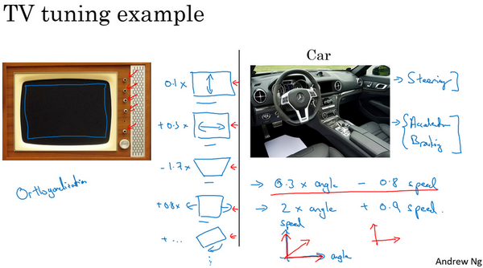

這是一張舊式電視圖片，有很多旋鈕可以用來調整圖像的各種性質，所以對於這些舊式電視，可能有一個旋鈕用來調圖像垂直方向的高度，另外有一個旋鈕用來調圖像寬度，也許還有一個旋鈕用來調梯形角度，還有一個旋鈕用來調整圖像左右偏移，還有一個旋鈕用來調圖像旋轉角度之類的。電視設計師花了大量時間設計電路，那時通常都是模擬電路來確保每個旋鈕都有相對明確的功能。如一個旋鈕來調整這個（高度），一個旋鈕調整這個（寬度），一個旋鈕調整這個（梯形角度），以此類推。

相比之下，想像一下，如果你有一個旋鈕調的是$0.1x$表示圖像高度，$+0.3x$表示圖像寬度，$-1.7x$表示梯形角度，$+0.8x$表示圖像在水平軸上的坐標之類的。如果你調整這個（其中一個）旋鈕，那麼圖像的高度、寬度、梯形角度、平移位置全部都會同時改變，如果你有這樣的旋鈕，那幾乎不可能把電視調好，讓圖像顯示在區域正中。

所以在這種情況下，正交化指的是電視設計師設計這樣的旋鈕，使得每個旋鈕都只調弄一個性質，這樣調整電視圖像就容易得多，就可以把圖像調到正中。

接下來是另一個正交化例子，你想想學車的時候，一輛車有三個主要控制，第一是方向盤，方向盤決定你往左右偏多少，還有油門和剎車。就是這三個控制，其中一個控制方向，另外兩個控制你的速度，這樣就比較容易解讀。知道不同控制的不同動作會對車子運動有什麼影響。

想像一下，如果有人這麼造車，造了個遊戲手把，手把的一個軸控制的是$0.3×$轉向角-速度，然後還有一個軸控制的是$2×$轉向角$+0.9×$車速，理論上來說，透過調整這兩個旋鈕你是可以將車子調整到你希望得到的角度和速度，但這樣比單獨控制轉向角度，分開獨立的速度控制要難得多。

所以正交化的概念是指，你可以想出一個維度，這個維度你想做的是控制轉向角，還有另一個維度來控制你的速度，那麼你就需要一個旋鈕儘量只控制轉向角，另一個旋鈕，在這個開車的例子裡其實是油門和剎車控制了你的速度。但如果你有一個控制旋鈕將兩者混在一起，比如說這樣一個控制裝置同時影響你的轉向角和速度，同時改變了兩個性質，那麼就很難令你的車子以想要的速度和角度前進。然而正交化之後，正交意味著互成90度。設計出正交化的控制裝置，最理想的情況是和你實際想控制的性質一致，這樣你調整參數時就容易得多。可以單獨調整轉向角，還有你的油門和剎車，令車子以你想要的方式運動。

那麼這與機器學習有什麼關係呢？要弄好一個監督學習系統，你通常需要調你的系統的旋鈕。

確保四件事情，首先，你通常必須確保至少系統在訓練集上得到的結果不錯，所以訓練集上的表現必須透過某種評估，達到能接受的程度，對於某些應用，這可能意味著達到人類水平的表現，但這取決於你的應用，我們將在下週更多地談談如何與人類水平的表現進行比較。但是，在訓練集上表現不錯之後，你就希望系統也能在開發集上有好的表現，然後你希望系統在測試集上也有好的表現。在最後，你希望系統在測試集上系統的成本函數在實際使用中表現令人滿意，比如說，你希望這些貓圖片應用的用戶滿意。

我們回到電視調節的例子，如果你的電視圖像太寬或太窄，你想要一個旋鈕去調整，你可不想要仔細調節五個不同的旋鈕，它們也會影響別的圖像性質，你只需要一個旋鈕去改變電視圖像的寬度。

所以類似地，如果你的算法在成本函數上不能很好地擬合訓練集，你想要一個旋鈕，是的我畫這東西表示旋鈕，或者一組特定的旋鈕，這樣你可以用來確保你的可以調整你的算法，讓它很好地擬合訓練集，所以你用來除錯的旋鈕是你可能可以訓練更大的網路，或者可以切換到更好的最佳化算法，比如**Adam**最佳化算法，等等。我們將在本週和下週討論一些其他選項。

相比之下，如果發現算法對開發集的擬合很差，那麼應該有獨立的一組旋鈕，是的，這就是我畫得毛毛躁躁的另一個旋鈕，你希望有一組獨立的旋鈕去除錯。比如說，你的算法在開發集上做的不好，它在訓練集上做得很好，但開發集不行，然後你有一組正則化的旋鈕可以調節，嘗試讓系統滿足第二個條件。類比到電視，就是現在你調好了電視的寬度，如果圖像的高度不太對，你就需要一個不同的旋鈕來調節電視圖像的高度，然後你希望這個旋鈕儘量不會影響到電視的寬度。增大訓練集可以是另一個可用的旋鈕，它可以幫助你的學習算法更好地歸納開發集的規律，現在調好了電視圖像的高度和寬度。

如果它不符合第三個標準呢？如果系統在開發集上做的很好，但測試集上做得不好呢？如果是這樣，那麼你需要調的旋鈕，可能是更大的開發集。因為如果它在開發集上做的不錯，但測試集不行這可能意味著你對開發集過擬合了，你需要往回退一步，使用更大的開發集。

最後，如果它在測試集上做得很好，但無法給你的貓圖片應用用戶提供良好的體驗，這意味著你需要回去，改變開發集或成本函數。因為如果根據某個成本函數，系統在測試集上做的很好，但它無法反映你的算法在現實世界中的表現，這意味著要嘛你的開發集分布設置不正確，要嘛你的成本函數測量的指標不對。

我們很快會逐一講到這些例子，我們以後會詳細介紹這些特定的旋鈕，在本週和下週晚些時候會介紹的。所以如果現在你無法理解全部細節，別擔心，但我希望你們對這種正交化過程有個概念。你要非常清楚，到底是四個問題中的哪一個，知道你可以調節哪些不同的東西嘗試解決那個問題。

當我訓練神經網路時，我一般不用**early stopping**，這個技巧也還不錯，很多人都這麼幹。但個人而言，我覺得用**early stopping**有點難以分析，因為這個旋鈕會同時影響你對訓練集的擬合，因為如果你早期停止，那麼對訓練集的擬合就不太好，但它同時也用來改善開發集的表現，所以這個旋鈕沒那麼正交化。因為它同時影響兩件事情，就像一個旋鈕同時影響電視圖像的寬度和高度。不是說這樣就不要用，如果你想用也是可以的。但如果你有更多的正交化控制，比如我這裡寫出的其他手段，用這些手段調網路會簡單不少。

所以我希望你們對正交化的意義有點概念，就像你看電視圖像一樣。如果你說，我的電視圖像太寬，所以我要調整這個旋鈕（寬度旋鈕）。或者它太高了，所以我要調整那個旋鈕（高度旋鈕）。或者它太梯形了，所以我要調整這個旋鈕（梯形角度旋鈕），這就很好。

在機器學習中，如果你可以觀察你的系統，然後說這一部分是錯的，它在訓練集上做的不好、在開發集上做的不好、它在測試集上做的不好，或者它在測試集上做的不錯，但在現實世界中不好，這就很好。必須弄清楚到底是什麼地方出問題了，然後我們剛好有對應的旋鈕，或者一組對應的旋鈕，剛好可以解決那個問題，那個限制了機器學習系統性能的問題。

這就是我們這週和下週要講到的，如何診斷出系統性能瓶頸到底在哪。還有找到你可以用的一組特定的旋鈕來調整你的系統，來改善它特定方面的性能，我們開始詳細講講這個過程吧。

### 1.3 單一數字評估指標（Single number evaluation metric）

無論你是調整超參數，或者是嘗試不同的學習算法，或者在搭建機器學習系統時嘗試不同手段，你會發現，如果你有一個單實數評估指標，你的進展會快得多，它可以快速告訴你，新嘗試的手段比之前的手段好還是差。所以當團隊開始進行機器學習項目時，我經常推薦他們為問題設置一個單實數評估指標。

我們來看一個例子，你之前聽過我說過，應用機器學習是一個非常經驗性的過程，我們通常有一個想法，編程序，跑實驗，看看效果如何，然後使用這些實驗結果來改善你的想法，然後繼續走這個循環，不斷改進你的算法。

比如說對於你的貓分類器，之前你搭建了某個分類器$A$，通過改變超參數，還有改變訓練集等手段，你現在訓練出來了一個新的分類器B，所以評估你的分類器的一個合理方式是觀察它的查准率（**precision**）和查全率（**recall**）。

查准率和查全率的確切細節對於這個例子來說不太重要。但簡而言之，查准率的定義是在你的分類器標記為貓的例子中，有多少真的是貓。所以如果分類器$A$有95%的查准率，這意味著你的分類器說這圖有貓的時候，有95%的機會真的是貓。

查全率就是，對於所有真貓的圖片，你的分類器正確識別出了多少百分比。實際為貓的圖片中，有多少被系統識別出來？如果分類器$A$查全率是90%，這意味著對於所有的圖像，比如說你的開發集都是真的貓圖，分類器$A$準確地分辨出了其中的90%。

所以關於查准率和查全率的定義，不用想太多。事實證明，查准率和查全率之間往往需要折衷，兩個指標都要顧及到。你希望得到的效果是，當你的分類器說某個東西是貓的時候，有很大的機會它真的是一隻貓，但對於所有是貓的圖片，你也希望系統能夠將大部分分類為貓，所以用查准率和查全率來評估分類器是比較合理的。

但使用查准率和查全率作為評估指標的時候，有個問題，如果分類器$A$在查全率上表現更好，分類器$B$在查准率上表現更好，你就無法判斷哪個分類器更好。如果你嘗試了很多不同想法，很多不同的超參數，你希望能夠快速試驗不僅僅是兩個分類器，也許是十幾個分類器，快速選出“最好的”那個，這樣你可以從那裡出發再疊代。如果有兩個評估指標，就很難去快速地二中選一或者十中選一，所以我並不推薦使用兩個評估指標，查准率和查全率來選擇一個分類器。你只需要找到一個新的評估指標，能夠結合查准率和查全率。

在機器學習文獻中，結合查准率和查全率的標準方法是所謂的$F_1$分數，$F_1$分數的細節並不重要。但非正式的，你可以認為這是查准率$P$和查全率$R$的平均值。正式來看，$F_1$分數的定義是這個公式：$\frac{2}{\frac{1}{P} + \frac{1}{R}}$

在數學中，這個函數叫做查准率$P$和查全率$R$的調和平均數。但非正式來說，你可以將它看成是某種查准率和查全率的平均值，只不過你算的不是直接的算術平均，而是用這個公式定義的調和平均。這個指標在權衡查准率和查全率時有一些優勢。

但在這個例子中，你可以馬上看出，分類器$A$的$F_1$分數更高。假設$F_1$分數是結合查准率和查全率的合理方式，你可以快速選出分類器$A$，淘汰分類器$B$。

我發現很多機器學習團隊就是這樣，有一個定義明確的開發集用來測量查准率和查全率，再加上這樣一個單一數值評估指標，有時我叫單實數評估指標，能讓你快速判斷分類器$A$或者分類器$B$更好。所以有這樣一個開發集，加上單實數評估指標，你的疊代速度肯定會很快，它可以加速改進您的機器學習算法的疊代過程。

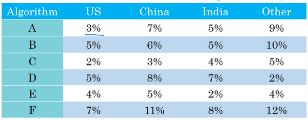

我們來看另一個例子，假設你在開發一個貓應用來服務四個地理大區的愛貓人士，美國、中國、印度還有世界其他地區。我們假設你的兩個分類器在來自四個地理大區的數據中得到了不同的錯誤率，比如算法$A$在美國用戶上傳的圖片中達到了3%錯誤率，等等。

所以跟蹤一下，你的分類器在不同市場和地理大區中的表現應該是有用的，但是通過跟蹤四個數字，很難掃一眼這些數值就快速判斷算法$A$或算法$B$哪個更好。如果你測試很多不同的分類器，那麼看著那麼多數字，然後快速選一個最優是很難的。所以在這個例子中，我建議，除了跟蹤分類器在四個不同的地理大區的表現，也要算算平均值。假設平均表現是一個合理的單實數評估指標，通過計算平均值，你就可以快速判斷。

看起來算法$C$的平均錯誤率最低，然後你可以繼續用那個算法。你必須選擇一個算法，然後不斷疊代，所以你的機器學習的工作流程往往是你有一個想法，你嘗試實現它，看看這個想法好不好。

所以本影片介紹的是，有一個單實數評估指標真的可以提高你的效率，或者提高你的團隊做出這些決策的效率。現在我們還沒有完整討論如何有效地建立評估指標。在下一個影片中，我會教你們如何設置最佳化以及滿足指標，我們來看下一段影片。

### 1.4 滿足和最佳化指標（Satisficing and optimizing metrics）

要把你顧及到的所有事情組合成單實數評估指標有時並不容易，在那些情況裡，我發現有時候設立滿足和最佳化指標是很重要的，讓我告訴你是什麼意思吧。

假設你已經決定你很看重貓分類器的分類準確度，這可以是$F_1$分數或者用其他衡量準確度的指標。但除了準確度之外，我們還需要考慮運行時間，就是需要多長時間來分類一張圖。分類器$A$需要80毫秒，$B$需要95毫秒，$C$需要1500毫秒，就是說需要1.5秒來分類圖像。

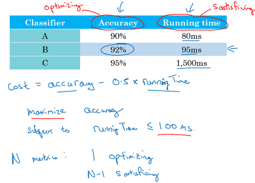

你可以這麼做，將準確度和運行時間組合成一個整體評估指標。所以成本，比如說，總體成本是$cost= accuracy - 0.5 \times\text{runningTime}$，這種組合方式可能太刻意，只用這樣的公式來組合準確度和運行時間，兩個數值的線性加權求和。

你還可以做其他事情，就是你可能選擇一個分類器，能夠最大限度提高準確度，但必須滿足運行時間要求，就是對圖像進行分類所需的時間必須小於等於100毫秒。所以在這種情況下，我們就說準確度是一個最佳化指標，因為你想要準確度最大化，你想做的儘可能準確，但是運行時間就是我們所說的滿足指標，意思是它必須足夠好，它只需要小於100毫秒，達到之後，你不在乎這指標有多好，或者至少你不會那麼在乎。所以這是一個相當合理的權衡方式，或者說將準確度和運行時間結合起來的方式。實際情況可能是，只要運行時間少於100毫秒，你的用戶就不會在乎運行時間是100毫秒還是50毫秒，甚至更快。

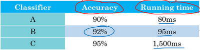

通過定義最佳化和滿足指標，就可以給你提供一個明確的方式，去選擇“最好的”分類器。在這種情況下分類器B最好，因為在所有的運行時間都小於100毫秒的分類器中，它的準確度最好。

所以更一般地說，如果你要考慮$N$個指標，有時候選擇其中一個指標做為最佳化指標是合理的。所以你想儘量最佳化那個指標，然後剩下$N-1$個指標都是滿足指標，意味著只要它們達到一定閾值，例如運行時間快於100毫秒，但只要達到一定的閾值，你不在乎它超過那個門檻之後的表現，但它們必須達到這個門檻。

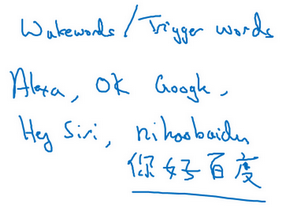

這裡是另一個例子，假設你正在構建一個系統來檢測喚醒語，也叫觸發詞，這指的是語音控制設備。比如亞馬遜**Echo**，你會說“**Alexa**”，或者用“**Okay Google**”來喚醒谷歌設備，或者對於蘋果設備，你會說“**Hey Siri**”，或者對於某些百度設備，我們用“你好百度”喚醒。

對的，這些就是喚醒詞，可以喚醒這些語音控制設備，然後監聽你想說的話。所以你可能會在乎觸發字檢測系統的準確性，所以當有人說出其中一個觸發詞時，有多大機率可以喚醒你的設備。

你可能也需要顧及假陽性（**false positive**）的數量，就是沒有人在說這個觸發詞時，它被隨機喚醒的機率有多大？所以這種情況下，組合這兩種評估指標的合理方式可能是最大化精確度。所以當某人說出喚醒詞時，你的設備被喚醒的機率最大化，然後必須滿足24小時內最多只能有1次假陽性，對吧？所以你的設備平均每天只會沒有人真的在說話時隨機喚醒一次。所以在這種情況下，準確度是最佳化指標，然後每24小時發生一次假陽性是滿足指標，你只要每24小時最多有一次假陽性就滿足了。

總結一下，如果你需要顧及多個指標，比如說，有一個最佳化指標，你想儘可能最佳化的，然後還有一個或多個滿足指標，需要滿足的，需要達到一定的門檻。現在你就有一個全自動的方法，在觀察多個成本大小時，選出"最好的"那個。現在這些評估指標必須是在訓練集或開發集或測試集上計算或求出來的。所以你還需要做一件事，就是設立訓練集、開發集，還有測試集。在下一個影片裡，我想和大家分享一些如何設置訓練、開發和測試集的指導方針，我們下一個影片繼續。

### 1.5 訓練/開發/測試集劃分（Train/dev/test distributions）

設立訓練集，開發集和測試集的方式大大影響了你或者你的團隊在建立機器學習應用方面取得進展的速度。同樣的團隊，即使是大公司裡的團隊，在設立這些數據集的方式，真的會讓團隊的進展變慢而不是加快，我們看看應該如何設立這些數據集，讓你的團隊效率最大化。

在這個影片中，我想集中討論如何設立開發集和測試集，開發（**dev**）集也叫做開發集（**development set**），有時稱為保留交叉驗證集（**hold out cross validation set**）。然後，機器學習中的工作流程是，你嘗試很多思路，用訓練集訓練不同的模型，然後使用開發集來評估不同的思路，然後選擇一個，然後不斷疊代去改善開發集的性能，直到最後你可以得到一個令你滿意的成本，然後你再用測試集去評估。

現在，舉個例子，你要開發一個貓分類器，然後你在這些區域裡運營，美國、英國、其他歐洲國家，南美洲、印度、中國，其他亞洲國家和澳大利亞，那麼你應該如何設立開發集和測試集呢？

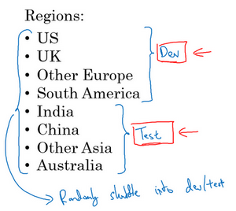

其中一種做法是，你可以選擇其中4個區域，我打算使用這四個（前四個），但也可以是隨機選的區域，然後說，來自這四個區域的數據構成開發集。然後其他四個區域，我打算用這四個（後四個），也可以隨機選擇4個，這些數據構成測試集。

事實證明，這個想法非常糟糕，因為這個例子中，你的開發集和測試集來自不同的分布。我建議你們不要這樣，而是讓你的開發集和測試集來自同一分布。我的意思是這樣，你們要記住，我想就是設立你的開發集加上一個單實數評估指標，這就是像是定下目標，然後告訴你的團隊，那就是你要瞄準的靶心，因為你一旦建立了這樣的開發集和指標，團隊就可以快速疊代，嘗試不同的想法，跑實驗，可以很快地使用開發集和指標去評估不同分類器，然後嘗試選出最好的那個。所以，機器學習團隊一般都很擅長使用不同方法去逼近目標，然後不斷疊代，不斷逼近靶心。所以，針對開發集上的指標最佳化。

然後在左邊的例子中，設立開發集和測試集時存在一個問題，你的團隊可能會花上幾個月時間在開發集上疊代最佳化，結果發現，當你們最終在測試集上測試系統時，來自這四個國家或者說下面這四個地區的數據（即測試集數據）和開發集裡的數據可能差異很大，所以你可能會收穫"意外驚喜"，並發現，花了那麼多個月的時間去針對開發集最佳化，在測試集上的表現卻不佳。所以，如果你的開發集和測試集來自不同的分布，就像你設了一個目標，讓你的團隊花幾個月嘗試逼近靶心，結果在幾個月工作之後發現，你說“等等”，測試的時候，"我要把目標移到這裡"，然後團隊可能會說"好吧，為什麼你讓我們花那麼多個月的時間去逼近那個靶心，然後突然間你可以把靶心移到不同的位置？"。

所以，為了避免這種情況，我建議的是你將所有數據隨機洗牌，放入開發集和測試集，所以開發集和測試集都有來自八個地區的數據，並且開發集和測試集都來自同一分布，這分布就是你的所有數據混在一起。

這裡有另一個例子，這是個真實的故事，但有一些細節變了。所以我知道有一個機器學習團隊，花了好幾個月在開發集上最佳化，開發集裡面有中等收入郵政編碼的貸款審批數據。那麼具體的機器學習問題是，輸入$x$為貸款申請，你是否可以預測輸出$y$，$y$是他們有沒有還貸能力？所以這系統能幫助銀行判斷是否批准貸款。所以開發集來自貸款申請，這些貸款申請來自中等收入郵政編碼，**zip code**就是美國的郵政編碼。但是在這上面訓練了幾個月之後，團隊突然決定要在，低收入郵政編碼數據上測試一下。當然了，這個分布數據裡面中等收入和低收入郵政編碼數據是很不一樣的，而且他們花了大量時間針對前面那組數據最佳化分類器，導致系統在後面那組數據中效果很差。所以這個特定團隊實際上浪費了3個月的時間，不得不退回去重新做很多工作。

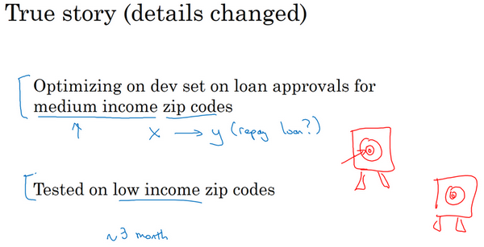

這裡實際發生的事情是，這個團隊花了三個月瞄準一個目標，三個月之後經理突然問"你們試試瞄準那個目標如何？"，這新目標位置完全不同，所以這件事對於這個團隊來說非常崩潰。

所以我建議你們在設立開發集和測試集時，要選擇這樣的開發集和測試集，能夠反映你未來會得到的數據，認為很重要的數據，必須得到好結果的數據，特別是，這裡的開發集和測試集可能來自同一個分布。所以不管你未來會得到什麼樣的數據，一旦你的算法效果不錯，要嘗試收集類似的數據，而且，不管那些數據是什麼，都要隨機分配到開發集和測試集上。因為這樣，你才能將瞄準想要的目標，讓你的團隊高效疊代來逼近同一個目標，希望最好是同一個目標。

我們還沒提到如何設立訓練集，我們會在之後的影片裡談談如何設立訓練集，但這個影片的重點在於，設立開發集以及評估指標，真的就定義了你要瞄準的目標。我們希望通過在同一分布中設立開發集和測試集，你就可以瞄準你所希望的機器學習團隊瞄準的目標。而設立訓練集的方式則會影響你逼近那個目標有多快，但我們可以在另一個講座裡提到。我知道有一些機器學習團隊，他們如果能遵循這個方針，就可以省下幾個月的工作，所以我希望這些方針也能幫到你們。

接下來，實際上你的開發集和測試集的規模，如何選擇它們的大小，在深度學習時代也在變化，我們會在下一個影片裡提到這些內容。

### 1.6 開發集和測試集的大小（Size of dev and test sets）

在上一個影片中你們知道了你的開發集和測試集為什麼必須來自同一分布，但它們規模應該多大？在深度學習時代，設立開發集和測試集的方針也在變化，我們來看看一些最佳做法。

你可能聽說過一條經驗法則，在機器學習中，把你取得的全部數據用70/30比例分成訓練集和測試集。或者如果你必須設立訓練集、開發集和測試集，你會這麼分60%訓練集，20%開發集，20%測試集。在機器學習的早期，這樣分是相當合理的，特別是以前的數據集大小要小得多。所以如果你總共有100個樣本，這樣70/30或者60/20/20分的經驗法則是相當合理的。如果你有幾千個樣本或者有一萬個樣本，這些做法也還是合理的。

但在現代機器學習中，我們更習慣操作規模大得多的數據集，比如說你有1百萬個訓練樣本，這樣分可能更合理，98%作為訓練集，1%開發集，1%測試集，我們用$D$和$T$縮寫來表示開發集和測試集。因為如果你有1百萬個樣本，那麼1%就是10,000個樣本，這對於開發集和測試集來說可能已經夠了。所以在現代深度學習時代，有時我們擁有大得多的數據集，所以使用小於20%的比例或者小於30%比例的數據作為開發集和測試集也是合理的。而且因為深度學習算法對數據的胃口很大，我們可以看到那些有巨量數據集的問題，有更高比例的數據劃分到訓練集裡，那麼測試集呢？

要記住，測試集的目的是完成系統開發之後，測試集可以幫你評估投產系統的性能。方針就是，令你的測試集足夠大，能夠以高置信度評估系統整體性能。所以除非你需要對最終投產系統有一個很精確的指標，一般來說測試集不需要上百萬個例子。對於你的應用程式，也許你想，有10,000個例子就能給你足夠的置信度來給出性能指標了，也許100,000個之類的可能就夠了，這數目可能遠遠小於比如說整體數據集的30%，取決於你有多少數據。

對於某些應用，你也許不需要對系統性能有置信度很高的評估，也許你只需要訓練集和開發集。我認為，不單獨分出一個測試集也是可以的。事實上，有時在實踐中有些人會只分成訓練集和測試集，他們實際上在測試集上疊代，所以這裡沒有測試集，他們有的是訓練集和開發集，但沒有測試集。如果你真的在除錯這個集，這個開發集或這個測試集，這最好稱為開發集。

不過在機器學習的歷史裡，不是每個人都把術語定義分得很清的，有時人們說的開發集，其實應該看作測試集。但如果你只要有數據去訓練，有數據去除錯就夠了。你打算不管測試集，直接部署最終系統，所以不用太擔心它的實際表現，我覺得這也是很好的，就將它們稱為訓練集、開發集就好。然後說清楚你沒有測試集，這是不是有點不正常？我絕對不建議在搭建系統時省略測試集，因為有個單獨的測試集比較令我安心。因為你可以使用這組不帶偏差的數據來測量系統的性能。但如果你的開發集非常大，這樣你就不會對開發集過擬合得太厲害，這種情況，只有訓練集和測試集也不是完全不合理的。不過我一般不建議這麼做。

總結一下，在大數據時代舊的經驗規則，這個70/30不再適用了。現在流行的是把大量數據分到訓練集，然後少量數據分到開發集和測試集，特別是當你有一個非常大的數據集時。以前的經驗法則其實是為了確保開發集足夠大，能夠達到它的目的，就是幫你評估不同的想法，然後選出$A$還是$B$更好。測試集的目的是評估你最終的成本偏差，你只需要設立足夠大的測試集，可以用來這麼評估就行了，可能只需要遠遠小於總體數據量的30%。

所以我希望本影片能給你們一點指導和建議，讓你們知道如何在深度學習時代設立開發和測試集。接下來，有時候在研究機器學習的問題途中，你可能需要更改評估指標，或者改動你的開發集和測試集，我們會講什麼時候需要這樣做。

### 1.7 什麼時候該改變開發/測試集和指標？（When to change dev/test sets and metrics）

你已經學過如何設置開發集和評估指標，就像是把目標定在某個位置，讓你的團隊瞄準。但有時候在項目進行途中，你可能意識到，目標的位置放錯了。這種情況下，你應該移動你的目標。

我們來看一個例子，假設你在構建一個貓分類器，試圖找到很多貓的照片，向你的愛貓人士用戶展示，你決定使用的指標是分類錯誤率。所以算法$A$和$B$分別有3％錯誤率和5％錯誤率，所以算法$A$似乎做得更好。

但我們實際試一下這些算法，你觀察一下這些算法，算法$A$由於某些原因，把很多色情圖像分類成貓了。如果你部署算法$A$，那麼用戶就會看到更多貓圖，因為它識別貓的錯誤率只有3%，但它同時也會給用戶推送一些色情圖像，這是你的公司完全不能接受的，你的用戶也完全不能接受。相比之下，算法$B$有5％的錯誤率，這樣分類器就得到較少的圖像，但它不會推送色情圖像。所以從你們公司的角度來看，以及從用戶接受的角度來看，算法$B$實際上是一個更好的算法，因為它不讓任何色情圖像通過。

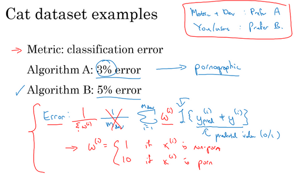

那麼在這個例子中，發生的事情就是，算法A在評估指標上做得更好，它的錯誤率達到3%，但實際上是個更糟糕的算法。在這種情況下，評估指標加上開發集它們都傾向於選擇算法$A$，因為它們會說，看算法A的錯誤率較低，這是你們自己定下來的指標評估出來的。但你和你的用戶更傾向於使用算法$B$，因為它不會將色情圖像分類為貓。所以當這種情況發生時，當你的評估指標無法正確衡量算法之間的優劣排序時，在這種情況下，原來的指標錯誤地預測算法A是更好的算法這就發出了信號，你應該改變評估指標了，或者要改變開發集或測試集。在這種情況下，你用的分類錯誤率指標可以寫成這樣：

$Error = \frac{1}{m_{{dev}}}\sum_{i = 1}^{m_{{dev}}}{I\{ y_{{pred}}^{(i)} \neq y^{(i)}\}}$

$m_{{dev}}$是你的開發集例子數，用$y_{{pred}}^{(i)}$表示預測值，其值為0或1，$I$這符號表示一個函數，統計出裡面這個表達式為真的樣本數，所以這個公式就統計了分類錯誤的樣本。這個評估指標的問題在於，它對色情圖片和非色情圖片一視同仁，但你其實真的希望你的分類器不會錯誤標記色情圖像。比如說把一張色情圖片分類為貓，然後推送給不知情的用戶，他們看到色情圖片會非常不滿。

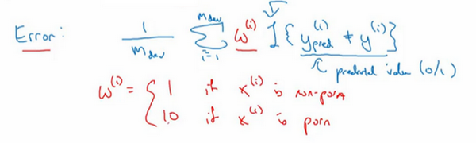

其中一個修改評估指標的方法是，這裡（$\frac{1}{m_{{dev}}}$與$\sum_{i =1}^{m_{{dev}}}{I\{ y_{{pred}}^{(i)} \neq y^{(i)}\}}$之間）加個權重項，即：

$Error = \frac{1}{m_{{dev}}}\sum_{i = 1}^{m_{{dev}}}{w^{(i)}I\{ y_{{pred}}^{(i)} \neq y^{(i)}\}}$

我們將這個稱為$w^{\left( i \right)}$，其中如果圖片$x^{(i)}$不是色情圖片，則$w^{\left( i \right)} = 1$。如果$x^{(i)}$是色情圖片，$w^{(i)}$可能就是10甚至100，這樣你賦予了色情圖片更大的權重，讓算法將色情圖分類為貓圖時，錯誤率這個項快速變大。這個例子裡，你把色情圖片分類成貓這一錯誤的懲罰權重加大10倍。

如果你希望得到歸一化常數，在技術上，就是$w^{(i)}$對所有$i$求和，這樣錯誤率仍然在0和1之間，即：

$Error = \frac{1}{\sum_{}^{}w^{(i)}}\sum_{i = 1}^{m_{{dev}}}{w^{(i)}I\{ y_{{pred}}^{(i)} \neq y^{(i)}\}}$

加權的細節並不重要，實際上要使用這種加權，你必須自己過一遍開發集和測試集，在開發集和測試集裡，自己把色情圖片標記出來，這樣你才能使用這個加權函數。

但粗略的結論是，如果你的評估指標無法正確評估好算法的排名，那麼就需要花時間定義一個新的評估指標。這是定義評估指標的其中一種可能方式（上述加權法）。評估指標的意義在於，準確告訴你已知兩個分類器，哪一個更適合你的應用。就這個影片的內容而言，我們不需要太注重新錯誤率指標是怎麼定義的，關鍵在於，如果你對舊的錯誤率指標不滿意，那就不要一直沿用你不滿意的錯誤率指標，而應該嘗試定義一個新的指標，能夠更加符合你的偏好，定義出實際更適合的算法。

你可能注意到了，到目前為止我們只討論了如何定義一個指標去評估分類器，也就是說，我們定義了一個評估指標幫助我們更好的把分類器排序，能夠區分出它們在識別色情圖片的不同水平，這實際上是一個正交化的例子。

我想你處理機器學習問題時，應該把它切分成獨立的步驟。一步是弄清楚如何定義一個指標來衡量你想做的事情的表現，然後我們可以分開考慮如何改善系統在這個指標上的表現。你們要把機器學習任務看成兩個獨立的步驟，用目標這個比喻，第一步就是設定目標。所以要定義你要瞄準的目標，這是完全獨立的一步，這是你可以調節的一個旋鈕。如何設立目標是一個完全獨立的問題，把它看成是一個單獨的旋鈕，可以除錯算法表現的旋鈕，如何精確瞄準，如何命中目標，定義指標是第一步。

然後第二步要做別的事情，在逼近目標的時候，也許你的學習算法針對某個長這樣的成本函數最佳化，$J=\frac{1}{m}\sum\limits_{i=1}^{m}{L({{\hat y}^{(i)}},{{y}^{(i)}})}$，你要最小化訓練集上的損失。你可以做的其中一件事是，修改這個，為了引入這些權重，也許最後需要修改這個歸一化常數，即：

$J=\frac{1}{\sum{{{w}^{(i)}}}}\sum\limits_{i=1}^{m}{{{w}^{(i)}}L({{\hat y}^{(i)}},{{y}^{(i)}})}$

再次，如何定義$J$並不重要，關鍵在於正交化的思路，把設立目標定為第一步，然後瞄準和射擊目標是獨立的第二步。換種說法，我鼓勵你們將定義指標看成一步，然後在定義了指標之後，你才能想如何最佳化系統來提高這個指標評分。比如改變你神經網路要最佳化的成本函數$J$。

在繼續之前，我們再講一個例子。假設你的兩個貓分類器$A$和$B$，分別有用開發集評估得到3%的錯誤率和5%的錯誤率。或者甚至用在網上下載的圖片構成的測試集上，這些是高品質，取景框很專業的圖像。但也許你在部署算法產品時，你發現算法$B$看起來表現更好，即使它在開發集上表現不錯，你發現你一直在用從網上下載的高品質圖片訓練，但當你部署到手機應用時，算法作用到用戶上傳的圖片時，那些圖片取景不專業，沒有把貓完整拍下來，或者貓的表情很古怪，也許圖像很模糊，當你實際測試算法時，你發現算法$B$表現其實更好。

這是另一個指標和開發集測試集出問題的例子，問題在於，你做評估用的是很漂亮的高解析度的開發集和測試集，圖片取景很專業。但你的用戶真正關心的是，他們上傳的圖片能不能被正確識別。那些圖片可能是沒那麼專業的照片，有點模糊，取景很業餘。

所以方針是，如果你在指標上表現很好，在當前開發集或者開發集和測試集分布中表現很好，但你的實際應用程式，你真正關注的地方表現不好，那麼就需要修改指標或者你的開發測試集。換句話說，如果你發現你的開發測試集都是這些高品質圖像，但在開發測試集上做的評估無法預測你的應用實際的表現。因為你的應用處理的是低品質圖像，那麼就應該改變你的開發測試集，讓你的數據更能反映你實際需要處理好的數據。

但總體方針就是，如果你當前的指標和當前用來評估的數據和你真正關心必須做好的事情關係不大，那就應該更改你的指標或者你的開發測試集，讓它們能更夠好地反映你的算法需要處理好的數據。

有一個評估指標和開發集讓你可以更快做出決策，判斷算法$A$還是算法$B$更優，這真的可以加速你和你的團隊疊代的速度。所以我的建議是，即使你無法定義出一個很完美的評估指標和開發集，你直接快速設立出來，然後使用它們來驅動你們團隊的疊代速度。如果在這之後，你發現選的不好，你有更好的想法，那麼完全可以馬上改。對於大多數團隊，我建議最好不要在沒有評估指標和開發集時跑太久，因為那樣可能會減慢你的團隊疊代和改善算法的速度。本影片講的是什麼時候需要改變你的評估指標和開發測試集，我希望這些方針能讓你的整個團隊設立一個明確的目標，一個你們可以高效疊代，改善性能的目標。

### 1.8 為什麼是人的表現？（Why human-level performance?）

在過去的幾年裡，更多的機器學習團隊一直在討論如何比較機器學習系統和人類的表現，為什麼呢？

我認為有兩個主要原因，首先是因為深度學習系統的進步，機器學習算法突然變得更好了。在許多機器學習的應用領域已經開始見到算法已經可以威脅到人類的表現了。其次，事實證明，當你試圖讓機器做人類能做的事情時，可以精心設計機器學習系統的工作流程，讓工作流程效率更高，所以在這些場合，比較人類和機器是很自然的，或者你要讓機器模仿人類的行為。

我們來看幾個這樣的例子，我看到很多機器學習任務中，當你在一個問題上付出了很多時間之後，所以$x$軸是時間，這可能是很多個月甚至是很多年。在這些時間裡，一些團隊或一些研究小組正在研究一個問題，當你開始往人類水平努力時，進展是很快的。但是過了一段時間，當這個算法表現比人類更好時，那麼進展和精確度的提升就變得更慢了。也許它還會越來越好，但是在超越人類水平之後，它還可以變得更好，但性能增速，準確度上升的速度這個斜率，會變得越來越平緩，我們都希望能達到理論最佳性能水平。隨著時間的推移，當您繼續訓練算法時，可能模型越來越大，數據越來越多，但是性能無法超過某個理論上限，這就是所謂的貝葉斯最優錯誤率（**Bayes optimal error**）。所以貝葉斯最優錯誤率一般認為是理論上可能達到的最優錯誤率，就是說沒有任何辦法設計出一個$x$到$y$的函數，讓它能夠超過一定的準確度。

例如，對於語音識別來說，如果$x$是音訊片段，有些音訊就是這麼嘈雜，基本不可能知道說的是什麼，所以完美的準確率可能不是100%。或者對於貓圖識別來說，也許一些圖像非常模糊，不管是人類還是機器，都無法判斷該圖片中是否有貓。所以，完美的準確度可能不是100%。

而貝葉斯最優錯誤率有時寫作**Bayesian**，即省略**optimal**，就是從$x$到$y$映射的理論最優函數，永遠不會被超越。所以你們應該不會感到意外，這紫色線，無論你在一個問題上工作多少年，你永遠不會超越貝葉斯錯誤率，貝葉斯最佳錯誤率。

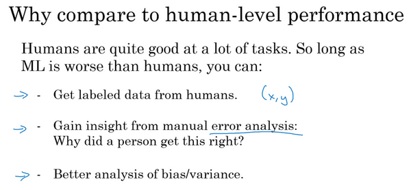

事實證明，機器學習的進展往往相當快，直到你超越人類的表現之前一直很快，當你超越人類的表現時，有時進展會變慢。我認為有兩個原因，為什麼當你超越人類的表現時，進展會慢下來。一個原因是人類水平在很多任務中離貝葉斯最優錯誤率已經不遠了，人們非常擅長看圖像，分辨裡面有沒有貓或者聽寫音訊。所以，當你超越人類的表現之後也許沒有太多的空間繼續改善了。但第二個原因是，只要你的表現比人類的表現更差，那麼實際上可以使用某些工具來提高性能。一旦你超越了人類的表現，這些工具就沒那麼好用了。

我的意思是這樣，對於人類相當擅長的任務，包括看圖識別事物，聽寫音訊，或閱讀語言，人類一般很擅長處理這些自然數據。對於人類擅長的任務，只要你的機器學習算法比人類差，你就可以從讓人幫你標記數據，你可以讓人幫忙或者花錢請人幫你標記例子，這樣你就有更多的數據可以餵給學習算法。下週我們會討論，人工錯誤率分析，但只要人類的表現比任何其他算法都要好，你就可以讓人類看看你算法處理的例子，知道錯誤出在哪裡，並嘗試了解為什麼人能做對，算法做錯。下週我們會看到，這樣做有助於提高算法的性能。你也可以更好地分析偏差和方差，我們稍後會談一談。但是只要你的算法仍然比人類糟糕，你就有這些重要策略可以改善算法。而一旦你的算法做得比人類好，這三種策略就很難利用了。所以這可能是另一個和人類表現比較的好處，特別是在人類做得很好的任務上。

為什麼機器學習算法往往很擅長模仿人類能做的事情，然後趕上甚至超越人類的表現。特別是，即使你知道偏差是多少，方差是多少。知道人類在特定任務上能做多好可以幫助你更好地了解你應該重點嘗試減少偏差，還是減少方差，我想在下一個影片中給你一個例子。

### 1.9 可避免偏差（Avoidable bias）

我們討論過，你希望你的學習算法能在訓練集上表現良好，但有時你實際上並不想做得太好。你得知道人類水平的表現是怎樣的，可以確切告訴你算法在訓練集上的表現到底應該有多好，或者有多不好，讓我告訴你是什麼意思吧。

我們經常使用貓分類器來做例子，比如人類具有近乎完美的準確度，所以人類水平的錯誤是1%。在這種情況下，如果您的學習算法達到8%的訓練錯誤率和10%的開發錯誤率，那麼你也許想在訓練集上得到更好的結果。所以事實上，你的算法在訓練集上的表現和人類水平的表現有很大差距的話，說明你的算法對訓練集的擬合並不好。所以從減少偏差和方差的工具這個角度看，在這種情況下，我會把重點放在減少偏差上。你需要做的是，比如說訓練更大的神經網路，或者跑久一點梯度下降，就試試能不能在訓練集上做得更好。

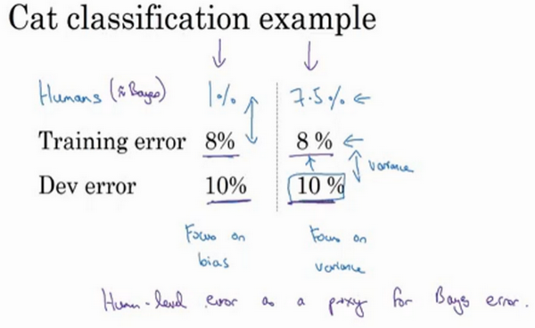

但現在我們看看同樣的訓練錯誤率和開發錯誤率，假設人類的表現不是1%，我們就把它抄寫過來。但你知道，在不同的應用或者說用在不同的數據集上，假設人類水平錯誤實際上是7.5%，也許你的數據集中的圖像非常模糊，即使人類都無法判斷這張照片中有沒有貓。這個例子可能稍微更複雜一些，因為人類其實很擅長看照片，分辨出照片裡有沒有貓。但就為了舉這個例子，比如說你的數據集中的圖像非常模糊，解析度很低，即使人類錯誤率也達到7.5%。在這種情況下，即使你的訓練錯誤率和開發錯誤率和其他例子裡一樣，你就知道，也許你的系統在訓練集上的表現還好，它只是比人類的表現差一點點。在第二個例子中，你可能希望專注減少這個分量，減少學習算法的方差，也許你可以試試正則化，讓你的開發錯誤率更接近你的訓練錯誤率。

所以在之前的課程關於偏差和方差的討論中，我們主要假設有一些任務的貝葉斯錯誤率幾乎為0。所以要解釋這裡發生的事情，看看這個貓分類器，用人類水平的錯誤率估計或代替貝葉斯錯誤率或貝葉斯最優錯誤率，對於計算機視覺任務而言，這樣替代相當合理，因為人類實際上是非常擅長計算機視覺任務的，所以人類能做到的水準和貝葉斯錯誤率相差不遠。根據定義，人類水平錯誤率比貝葉斯錯誤率高一點，因為貝葉斯錯誤率是理論上限，但人類水平錯誤率離貝葉斯錯誤率不會太遠。所以這裡比較意外的是取決於人類水平錯誤率有多少，或者這真的就很接近貝葉斯錯誤率，所以我們假設它就是，但取決於我們認為什麼樣的水準是可以實現的。

在這兩種情況下，具有同樣的訓練錯誤率和開發錯誤率，我們決定專注於減少偏差的策略或者減少方差的策略。那麼左邊的例子發生了什麼？
8%的訓練錯誤率真的很高，你認為你可以把它降到1%，那麼減少偏差的手段可能有效。而在右邊的例子中，如果你認為貝葉斯錯誤率是7.5%，這裡我們使用人類水平錯誤率來替代貝葉斯錯誤率，但是你認為貝葉斯錯誤率接近7.5%，你就知道沒有太多改善的空間了，不能繼續減少你的訓練錯誤率了，你也不會希望它比7.5%好得多，因為這種目標只能通過可能需要提供更進一步的訓練。而這邊，就還（訓練誤差和開發誤差之間）有更多的改進空間，可以將這個2%的差距縮小一點，使用減少方差的手段應該可行，比如正則化，或者收集更多的訓練數據。

所以要給這些概念命名一下，這不是廣泛使用的術語，但我覺得這麼說思考起來比較流暢。就是把這個差值，貝葉斯錯誤率或者對貝葉斯錯誤率的估計和訓練錯誤率之間的差值稱為可避免偏差，你可能希望一直提高訓練集表現，直到你接近貝葉斯錯誤率，但實際上你也不希望做到比貝葉斯錯誤率更好，這理論上是不可能超過貝葉斯錯誤率的，除非過擬合。而這個訓練錯誤率和開發錯誤率之前的差值，就大概說明你的算法在方差問題上還有多少改善空間。

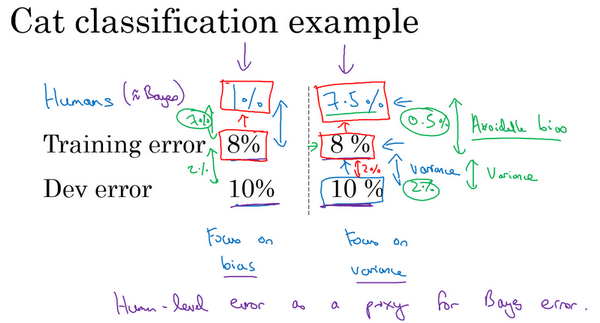

可避免偏差這個詞說明了有一些別的偏差，或者錯誤率有個無法超越的最低水準，那就是說如果貝葉斯錯誤率是7.5%。你實際上並不想得到低於該級別的錯誤率，所以你不會說你的訓練錯誤率是8%，然後8%就衡量了例子中的偏差大小。你應該說，可避免偏差可能在0.5%左右，或者0.5%是可避免偏差的指標。而這個2%是方差的指標，所以要減少這個2%比減少這個0.5%空間要大得多。而在左邊的例子中，這7%衡量了可避免偏差大小，而2%衡量了方差大小。所以在左邊這個例子裡，專注減少可避免偏差可能潛力更大。

所以在這個例子中，當你理解人類水平錯誤率，理解你對貝葉斯錯誤率的估計，你就可以在不同的場景中專注於不同的策略，使用避免偏差策略還是避免方差策略。在訓練時如何考慮人類水平表現來決定工作著力點，具體怎麼做還有更多微妙的細節，所以在下一個影片中，我們會深入了解人類水平表現的真正意義。

### 1.10 理解人的表現（Understanding human-level performance）

人類水平表現這個詞在論文裡經常隨意使用，但我現在告訴你這個詞更準確的定義，特別是使用人類水平表現這個詞的定義，可以幫助你們推動機器學習項目的進展。還記得上個影片中，我們用過這個詞“人類水平錯誤率”用來估計貝葉斯誤差，那就是理論最低的錯誤率，任何函數不管是現在還是將來，能夠到達的最低值。我們先記住這點，然後看看醫學圖像分類例子。

假設你要觀察這樣的放射科圖像，然後作出分類診斷，假設一個普通的人類，未經訓練的人類，在此任務上達到3%的錯誤率。普通的醫生，也許是普通的放射科醫生，能達到1%的錯誤率。經驗豐富的醫生做得更好，錯誤率為0.7%。還有一隊經驗豐富的醫生，就是說如果你有一個經驗豐富的醫生團隊，讓他們都看看這個圖像，然後討論並辯論，他們達成共識的意見達到0.5%的錯誤率。所以我想問你的問題是，你應該如何界定人類水平錯誤率？人類水平錯誤率3%,1%, 0.7%還是0.5%？

你也可以暫停影片思考一下，要回答這個問題，我想請你記住，思考人類水平錯誤率最有用的方式之一是，把它作為貝葉斯錯誤率的替代或估計。如果你願意，也可以暫停影片，思考一下這個問題。

但這裡我就直接給出人類水平錯誤率的定義，就是如果你想要替代或估計貝葉斯錯誤率，那麼一隊經驗豐富的醫生討論和辯論之後，可以達到0.5%的錯誤率。我們知道貝葉斯錯誤率小於等於0.5%，因為有些系統，這些醫生團隊可以達到0.5%的錯誤率。所以根據定義，最優錯誤率必須在0.5%以下。我們不知道多少更好，也許有一個更大的團隊，更有經驗的醫生能做得更好，所以也許比0.5%好一點。但是我們知道最優錯誤率不能高於0.5%，那麼在這個背景下，我就可以用0.5%估計貝葉斯錯誤率。所以我將人類水平定義為0.5%，至少如果你希望使用人類水平錯誤來分析偏差和方差的時候，就像上個影片那樣。

現在，為了發表研究論文或者部署系統，也許人類水平錯誤率的定義可以不一樣，你可以使用1%，只要你超越了一個普通醫生的表現，如果能達到這種水平，那系統已經達到實用了。也許超過一名放射科醫生，一名醫生的表現，意味著系統在一些情況下可以有部署價值了。

本影片的要點是，在定義人類水平錯誤率時，要弄清楚你的目標所在，如果要表明你可以超越單個人類，那麼就有理由在某些場合部署你的系統，也許這個定義是合適的。但是如果您的目標是替代貝葉斯錯誤率，那麼這個定義（經驗豐富的醫生團隊——0.5%）才合適。

要了解為什麼這個很重要，我們來看一個錯誤率分析的例子。比方說，在醫學圖像診斷例子中，你的訓練錯誤率是5%，你的開發錯誤率是6%。而在上一張幻燈片的例子中，我們的人類水平表現，我將它看成是貝葉斯錯誤率的替代品，取決於你是否將它定義成普通單個醫生的表現，還是有經驗的醫生或醫生團隊的表現，你可能會用1%或0.7%或0.5%。同時也回想一下，前面影片中的定義，貝葉斯錯誤率或者說貝葉斯錯誤率的估計和訓練錯誤率直接的差值就衡量了所謂的可避免偏差，這（訓練誤差與開發誤差之間的差值）可以衡量或者估計你的學習算法的方差問題有多嚴重。

所以在這個第一個例子中，無論你做出哪些選擇，可避免偏差大概是4%，這個值我想介於……，如果你取1%就是4%，如果你取0.5%就是4.5%，而這個差距（訓練誤差與開發誤差之間的差值）是1%。所以在這個例子中，我得說，不管你怎麼定義人類水平錯誤率，使用單個普通醫生的錯誤率定義，還是單個經驗豐富醫生的錯誤率定義或經驗豐富的醫生團隊的錯誤率定義，這是4%還是4.5%，這明顯比都比方差問題更大。所以在這種情況下，你應該專注於減少偏差的技術，例如培訓更大的網路。

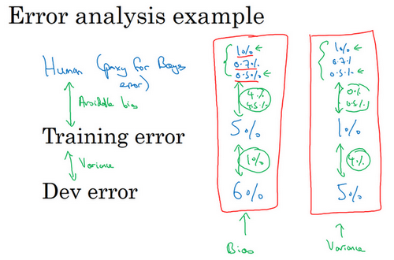

現在來看看第二個例子，比如說你的訓練錯誤率是1%，開發錯誤率是5%，這其實也不怎麼重要，這種問題更像學術界討論的，人類水平表現是1%或0.7%還是0.5%。因為不管你使用哪一個定義，你測量可避免偏差的方法是，如果用那個值，就是0%到0.5%之前，對吧？那就是人類水平和訓練錯誤率之前的差距，而這個差距是4%，所以這個4%差距比任何一種定義的可避免偏差都大。所以他們就建議，你應該主要使用減少方差的工具，比如正則化或者去獲取更大的訓練集。

什麼時候真正有效呢?

就是比如你的訓練錯誤率是0.7%，所以你現在已經做得很好了，你的開發錯誤率是0.8%。在這種情況下，你用0.5%來估計貝葉斯錯誤率關係就很大。因為在這種情況下，你測量到的可避免偏差是0.2%，這是你測量到的方差問題0.1%的兩倍，這表明也許偏差和方差都存在問題。但是，可避免偏差問題更嚴重。在這個例子中，我們在上一張幻燈片中討論的是0.5%，就是對貝葉斯錯誤率的最佳估計，因為一群人類醫生可以實現這一目標。如果你用0.7代替貝葉斯錯誤率，你測得的可避免偏差基本上是0%，那你就可能忽略可避免偏差了。實際上你應該試試能不能在訓練集上做得更好。

我希望講這個能讓你們有點概念，知道為什麼機器學習問題上取得進展會越來越難，當你接近人類水平時進展會越來越難。

在這個例子中，一旦你接近0.7%錯誤率，除非你非常小心估計貝葉斯錯誤率，你可能無法知道離貝葉斯錯誤率有多遠，所以你應該儘量減少可避免偏差。事實上，如果你只知道單個普通醫生能達到1%錯誤率，這可能很難知道是不是應該繼續去擬合訓練集，這種問題只會出現在你的算法已經做得很好的時候，只有你已經做到0.7%,
0.8%, 接近人類水平時會出現。

而在左邊的兩個例子中，當你遠離人類水平時，將最佳化目標放在偏差或方差上可能更容易一點。這就說明了，為什麼當你們接近人類水平時，更難分辨出問題是偏差還是方差。所以機器學習項目的進展在你已經做得很好的時候，很難更進一步。

總結一下我們講到的，如果你想理解偏差和方差，那麼在人類可以做得很好的任務中，你可以估計人類水平的錯誤率，你可以使用人類水平錯誤率來估計貝葉斯錯誤率。所以你到貝葉斯錯誤率估計值的差距，告訴你可避免偏差問題有多大，可避免偏差問題有多嚴重，而訓練錯誤率和開發錯誤率之間的差值告訴你方差上的問題有多大，你的算法是否能夠從訓練集泛化推廣到開發集。

今天講的和之前課程中見到的重大區別是，以前你們比較的是訓練錯誤率和0%，直接用這個值估計偏差。相比之下，在這個影片中，我們有一個更微妙的分析，其中並沒有假設你應該得到0%錯誤率，因為有時貝葉斯錯誤率是非零的，有時基本不可能做到比某個錯誤率閾值更低。所以在之前的課程中，我們測量的是訓練錯誤率，然後觀察的是訓練錯誤率比0%高多少，就用這個差值來估計偏差有多大。而事實證明，對於貝葉斯錯誤率幾乎是0%的問題這樣就行了，例如識別貓，人類表現接近完美，所以貝葉斯錯誤率也接近完美。所以當貝葉斯錯誤率幾乎為零時，可以那麼做。但數據噪點很多時，比如背景聲音很嘈雜的語言識別，有時幾乎不可能聽清楚說的是什麼，並正確記錄下來。對於這樣的問題，更好的估計貝葉斯錯誤率很有必要，可以幫助你更好地估計可避免偏差和方差，這樣你就能更好的做出決策，選擇減少偏差的策略，還是減少方差的策略。

回顧一下，對人類水平有大概的估計可以讓你做出對貝葉斯錯誤率的估計，這樣可以讓你更快地作出決定是否應該專注於減少算法的偏差，或者減少算法的方差。這個決策技巧通常很有效，直到你的系統性能開始超越人類，那麼你對貝葉斯錯誤率的估計就不再準確了，但這些技巧還是可以幫你做出明確的決定。

現在，深度學習的令人興奮的發展之一就是對於越來越多的任務，我們的系統實際上可以超越人類了。在下一個影片中，讓我們繼續談談超越人類水平的過程。

### 1.11 超過人的表現（Surpassing human- level performance）

很多團隊會因為機器在特定的識別分類任務中超越了人類水平而激動不已，我們談談這些情況，看看你們自己能不能達到。

我們討論過機器學習進展，會在接近或者超越人類水平的時候變得越來越慢。我們舉例談談為什麼會這樣。

假設你有一個問題，一組人類專家充分討論辯論之後，達到0.5%的錯誤率，單個人類專家錯誤率是1%，然後你訓練出來的算法有0.6%的訓練錯誤率，0.8%的開發錯誤率。所以在這種情況下，可避免偏差是多少？這個比較容易回答，0.5%是你對貝葉斯錯誤率的估計，所以可避免偏差就是0.1%。你不會用這個1%的數字作為參考，你用的是這個差值，所以也許你對可避免偏差的估計是至少0.1%，然後方差是0.2%。和減少可避免偏差比較起來，減少方差可能空間更大。

但現在我們來看一個比較難的例子，一個人類專家團和單個人類專家的表現和以前一樣，但你的算法可以得到0.3%訓練錯誤率，還有0.4%開發錯誤率。現在，可避免偏差是什麼呢？現在其實很難回答，事實上你的訓練錯誤率是0.3%，這是否意味著你過擬合了0.2%，或者說貝葉斯錯誤率其實是0.1%呢？或者也許貝葉斯錯誤率是0.2%？或者貝葉斯錯誤率是0.3%呢？你真的不知道。但是基於本例中給出的訊息，你實際上沒有足夠的訊息來判斷最佳化你的算法時應該專注減少偏差還是減少方差，這樣你取得進展的效率就會降低。還有比如說，如果你的錯誤率已經比一群充分討論辯論後的人類專家更低，那麼依靠人類直覺去判斷你的算法還能往什麼方向最佳化就很難了。所以在這個例子中，一旦你超過這個0.5%的門檻，要進一步最佳化你的機器學習問題就沒有明確的選項和前進的方向了。這並不意味著你不能取得進展，你仍然可以取得重大進展。但現有的一些工具幫助你指明方向的工具就沒那麼好用了。

現在，機器學習有很多問題已經可以大大超越人類水平了。例如，我想網路廣告，估計某個用戶點擊廣告的可能性，可能學習算法做到的水準已經超越任何人類了。還有提出產品建議，向你推薦電影或書籍之類的任務。我想今天的網站做到的水準已經超越你最親近的朋友了。還有物流預測，從$A$到$B$開車需要多久，或者預測快遞車從$A$開到$B$需要多少時間。或者預測某人會不會償還貸款，這樣你就能判斷是否批准這人的貸款。我想這些問題都是今天的機器學習遠遠超過了單個人類的表現。

請注意這四個例子，所有這四個例子都是從結構化數據中學習得來的，這裡你可能有個資料庫記錄用戶點擊的歷史，你的購物歷史資料庫，或者從A到B需要多長時間的資料庫，以前的貸款申請及結果的資料庫，這些並不是自然感知問題，這些不是計算機視覺問題，或語音識別，或自然語言處理任務。人類在自然感知任務中往往表現非常好，所以有可能對計算機來說在自然感知任務的表現要超越人類要更難一些。

最後，這些問題中，機器學習團隊都可以訪問大量數據，所以比如說，那四個應用中，最好的系統看到的數據量可能比任何人類能看到的都多，所以這樣就相對容易得到超越人類水平的系統。現在計算機可以檢索那麼多數據，它可以比人類更敏銳地識別出數據中的統計規律。

除了這些問題，今天已經有語音識別系統超越人類水平了，還有一些計算機視覺任務，一些圖像識別任務，計算機已經超越了人類水平。但是由於人類對這種自然感知任務非常擅長，我想計算機達到那種水平要難得多。還有一些醫療方面的任務，比如閱讀**ECG**或診斷皮膚癌，或者某些特定領域的放射科讀圖任務，這些任務計算機做得非常好了，也許超越了單個人類的水準。

在深度學習的最新進展中，其中一個振奮人心的方面是，即使在自然感知任務中，在某些情況下，計算機已經可以超越人類的水準了。不過現在肯定更加困難，因為人類一般很擅長這種自然感知任務。

所以要達到超越人類的表現往往不容易，但如果有足夠多的數據，已經有很多深度學習系統，在單一監督學習問題上已經超越了人類的水準，所以這對你在開發的應用是有意義的。我希望有一天你也能夠搭建出超越人類水平的深度學習系統。

### 1.12 改善你的模型的表現（Improving your model performance）

你們學過正交化，如何設立開發集和測試集，用人類水平錯誤率來估計貝葉斯錯誤率以及如何估計可避免偏差和方差。我們現在把它們全部組合起來寫成一套指導方針，如何提高學習算法性能的指導方針。

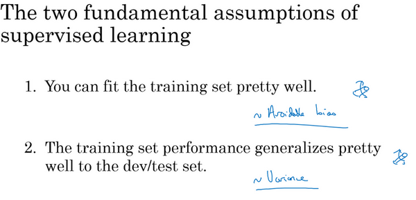

所以我想要讓一個監督學習算法達到實用，基本上希望或者假設你可以完成兩件事情。首先，你的算法對訓練集的擬合很好，這可以看成是你能做到可避免偏差很低。還有第二件事你可以做好的是，在訓練集中做得很好，然後推廣到開發集和測試集也很好，這就是說方差不是太大。

在正交化的精神下，你可以看到這裡有第二組旋鈕，可以修正可避免偏差問題，比如訓練更大的網路或者訓練更久。還有一套獨立的技巧可以用來處理方差問題，比如正則化或者收集更多訓練數據。

總結一下前幾段影片我們見到的步驟，如果你想提升機器學習系統的性能，我建議你們看看訓練錯誤率和貝葉斯錯誤率估計值之間的距離，讓你知道可避免偏差有多大。換句話說，就是你覺得還能做多好，你對訓練集的最佳化還有多少空間。然後看看你的開發錯誤率和訓練錯誤率之間的距離，就知道你的方差問題有多大。換句話說，你應該做多少努力讓你的算法表現能夠從訓練集推廣到開發集，算法是沒有在開發集上訓練的。

如果你想用盡一切辦法減少可避免偏差，我建議試試這樣的策略：比如使用規模更大的模型，這樣算法在訓練集上的表現會更好，或者訓練更久。使用更好的最佳化算法，比如說加入**momentum**或者**RMSprop**，或者使用更好的算法，比如**Adam**。你還可以試試尋找更好的新神經網路架構，或者說更好的超參數。這些手段包羅萬有，你可以改變啟動函數，改變層數或者隱藏單位數，雖然你這麼做可能會讓模型規模變大。或者試用其他模型，其他架構，如循環神經網路和卷積神經網路。在之後的課程裡我們會詳細介紹的，新的神經網路架構能否更好地擬合你的訓練集，有時也很難預先判斷，但有時換架構可能會得到好得多的結果。

另外當你發現方差是個問題時，你可以試用很多技巧，包括以下這些：你可以收集更多數據，因為收集更多數據去訓練可以幫你更好地推廣到系統看不到的開發集數據。你可以嘗試正則化，包括$L2$正則化，**dropout**正則化或者我們在之前課程中提到的數據增強。同時你也可以試用不同的神經網路架構，超參數搜索，看看能不能幫助你，找到一個更適合你的問題的神經網路架構。

我想這些偏差、可避免偏差和方差的概念是容易上手，難以精通的。如果你能系統全面地應用本週課程裡的概念，你實際上會比很多現有的機器學習團隊更有效率、更系統、更有策略地系統提高機器學習系統的性能。
