第二週：機器學習策略（2）(ML Strategy (2))
------------------------------------------
[TOC]
### 2.1 進行誤差分析（Carrying out error analysis）

你好，歡迎回來，如果你希望讓學習算法能夠勝任人類能做的任務，但你的學習算法還沒有達到人類的表現，那麼人工檢查一下你的算法犯的錯誤也許可以讓你了解接下來應該做什麼。這個過程稱為錯誤分析，我們從一個例子開始講吧。

假設你正在除錯貓分類器，然後你取得了90%準確率，相當於10%錯誤，，在你的開發集上做到這樣，這離你希望的目標還有很遠。也許你的隊員看了一下算法分類出錯的例子，注意到算法將一些狗分類為貓，你看看這兩隻狗，它們看起來是有點像貓，至少乍一看是。所以也許你的隊友給你一個建議，如何針對狗的圖片最佳化算法。試想一下，你可以針對狗，收集更多的狗圖，或者設計一些隻處理狗的算法功能之類的，為了讓你的貓分類器在狗圖上做的更好，讓算法不再將狗分類成貓。所以問題在於，你是不是應該去開始做一個項目專門處理狗？這項目可能需要花費幾個月的時間才能讓算法在狗圖片上犯更少的錯誤，這樣做值得嗎？或者與其花幾個月做這個項目，有可能最後發現這樣一點用都沒有。這裡有個錯誤分析流程，可以讓你很快知道這個方向是否值得努力。

這是我建議你做的，首先，收集一下，比如說100個錯誤標記的開發集樣本，然後手動檢查，一次只看一個，看看你的開發集裡有多少錯誤標記的樣本是狗。現在，假設事實上，你的100個錯誤標記樣本中只有5%是狗，就是說在100個錯誤標記的開發集樣本中，有5個是狗。這意味著100個樣本，在典型的100個出錯樣本中，即使你完全解決了狗的問題，你也只能修正這100個錯誤中的5個。或者換句話說，如果只有5%的錯誤是狗圖片，那麼如果你在狗的問題上花了很多時間，那麼你最多只能希望你的錯誤率從10%下降到9.5%，對吧？錯誤率相對下降了5%（總體下降了0.5%，100的錯誤樣本，錯誤率為10%，則樣本為1000），那就是10%下降到9.5%。你就可以確定這樣花時間不好，或者也許應該花時間，但至少這個分析給出了一個上限。如果你繼續處理狗的問題，能夠改善算法性能的上限，對吧？在機器學習中，有時我們稱之為性能上限，就意味著，最好能到哪裡，完全解決狗的問題可以對你有多少幫助。

但現在，假設發生了另一件事，假設我們觀察一下這100個錯誤標記的開發集樣本，你發現實際有50張圖都是狗，所以有50%都是狗的照片，現在花時間去解決狗的問題可能效果就很好。這種情況下，如果你真的解決了狗的問題，那麼你的錯誤率可能就從10%下降到5%了。然後你可能覺得讓錯誤率減半的方向值得一試，可以集中精力減少錯誤標記的狗圖的問題。

我知道在機器學習中，有時候我們很鄙視手工操作，或者使用了太多人為數值。但如果你要搭建應用系統，那這個簡單的人工統計步驟，錯誤分析，可以節省大量時間，可以迅速決定什麼是最重要的，或者最有希望的方向。實際上，如果你觀察100個錯誤標記的開發集樣本，也許只需要5到10分鐘的時間，親自看看這100個樣本，並親自統計一下有多少是狗。根據結果，看看有沒有占到5%、50%或者其他東西。這個在5到10分鐘之內就能給你估計這個方向有多少價值，並且可以幫助你做出更好的決定，是不是把未來幾個月的時間投入到解決錯誤標記的狗圖這個問題。

在本幻燈片中，我們要描述一下如何使用錯誤分析來評估某個想法，這個樣本裡狗的問題是否值得解決。有時你在做錯誤分析時，也可以同時並行評估幾個想法，比如，你有幾個改善貓檢測器的想法，也許你可以改善針對狗圖的性能，或者有時候要注意，那些貓科動物，如獅子，豹，獵豹等等，它們經常被分類成小貓或者家貓，所以你也許可以想辦法解決這個錯誤。或者也許你發現有些圖像是模糊的，如果你能設計出一些系統，能夠更好地處理模糊圖像。也許你有些想法，知道大概怎麼處理這些問題，要進行錯誤分析來評估這三個想法。

我會做的是建立這樣一個表格，我通常用電子表格來做，但普通文本文件也可以。在最左邊，人工過一遍你想分析的圖像集，所以圖像可能是從1到100，如果你觀察100張圖的話。電子表格的一列就對應你要評估的想法，所以狗的問題，貓科動物的問題，模糊圖像的問題，我通常也在電子表格中留下空位來寫評論。所以記住，在錯誤分析過程中，你就看看算法識別錯誤的開發集樣本，如果你發現第一張識別錯誤的圖片是狗圖，那麼我就在那裡打個勾，為了幫我自己記住這些圖片，有時我會在評論裡注釋，也許這是一張比特犬的圖。如果第二張照片很模糊，也記一下。如果第三張是在下雨天動物園裡的獅子，被識別成貓了，這是大型貓科動物，還有圖片模糊，在評論部分寫動物園下雨天，是雨天讓圖像模糊的之類的。最後，這組圖像過了一遍之後，我可以統計這些算法(錯誤)的百分比，或者這裡每個錯誤類型的百分比，有多少是狗，大貓或模糊這些錯誤類型。所以也許你檢查的圖像中8%是狗，可能43%屬於大貓，61%屬於模糊。這意味著掃過每一列，並統計那一列有多少百分比圖像打了勾。

在這個步驟做到一半時，有時你可能會發現其他錯誤類型，比如說你可能發現有**Instagram**濾鏡，那些花俏的圖像濾鏡，干擾了你的分類器。在這種情況下，實際上可以在錯誤分析途中，增加這樣一列，比如多色濾鏡
**Instagram**濾鏡和**Snapchat**濾鏡，然後再過一遍，也統計一下那些問題，並確定這個新的錯誤類型占了多少百分比，這個分析步驟的結果可以給出一個估計，是否值得去處理每個不同的錯誤類型。

例如，在這個樣本中，有很多錯誤來自模糊圖片，也有很多錯誤類型是大貓圖片。所以這個分析的結果不是說你一定要處理模糊圖片，這個分析沒有給你一個嚴格的數學公式，告訴你應該做什麼，但它能讓你對應該選擇那些手段有個概念。它也告訴你，比如說不管你對狗圖片或者**Instagram**圖片處理得有多好，在這些例子中，你最多只能取得8%或者12%的性能提升。而在大貓圖片這一類型，你可以做得更好。或者模糊圖像，這些類型有改進的潛力。這些類型裡，性能提高的上限空間要大得多。所以取決於你有多少改善性能的想法，比如改善大貓圖片或者模糊圖片的表現。也許你可以選擇其中兩個，或者你的團隊成員足夠多，也許你把團隊可以分成兩個團隊，其中一個想辦法改善大貓的識別，另一個團隊想辦法改善模糊圖片的識別。但這個快速統計的步驟，你可以經常做，最多需要幾小時，就可以真正幫你選出高優先度任務，並了解每種手段對性能有多大提升空間。

所以總結一下，進行錯誤分析，你應該找一組錯誤樣本，可能在你的開發集裡或者測試集裡，觀察錯誤標記的樣本，看看假陽性（**false positives**）和假陰性（**false negatives**），統計屬於不同錯誤類型的錯誤數量。在這個過程中，你可能會得到啟發，歸納出新的錯誤類型，就像我們看到的那樣。如果你過了一遍錯誤樣本，然後說，天，有這麼多**Instagram**濾鏡或**Snapchat**濾鏡，這些濾鏡干擾了我的分類器，你就可以在途中新建一個錯誤類型。總之，通過統計不同錯誤標記類型占總數的百分比，可以幫你發現哪些問題需要優先解決，或者給你構思新最佳化方向的靈感。在做錯誤分析的時候，有時你會注意到開發集裡有些樣本被錯誤標記了，這時應該怎麼做呢？我們下一個影片來討論。

### 2.2 清除標註錯誤的數據（Cleaning up Incorrectly labeled data）

你的監督學習問題的數據由輸入$x$和輸出標籤 $y$ 構成，如果你觀察一下你的數據，並發現有些輸出標籤 $y$ 是錯的。你的數據有些標籤是錯的，是否值得花時間去修正這些標籤呢？

我們看看在貓分類問題中，圖片是貓，$y=1$；不是貓，$y=0$。所以假設你看了一些數據樣本，發現這（倒數第二張圖片）其實不是貓，所以這是標記錯誤的樣本。我用了這個詞，“標記錯誤的樣本”來表示你的學習算法輸出了錯誤的 $y$ 值。但我要說的是，對於標記錯誤的樣本，參考你的數據集，在訓練集或者測試集 $y$ 的標籤，人類給這部分數據加的標籤，實際上是錯的，這實際上是一隻狗，所以 $y$ 其實應該是0，也許做標記的那人疏忽了。如果你發現你的數據有一些標記錯誤的樣本，你該怎麼辦？

首先，我們來考慮訓練集，事實證明，深度學習算法對於訓練集中的隨機錯誤是相當健壯的（**robust**）。只要你的標記出錯的樣本，只要這些錯誤樣本離隨機錯誤不太遠，有時可能做標記的人沒有注意或者不小心，按錯鍵了，如果錯誤足夠隨機，那麼放著這些錯誤不管可能也沒問題，而不要花太多時間修復它們。

當然你瀏覽一下訓練集，檢查一下這些標籤，並修正它們也沒什麼害處。有時候修正這些錯誤是有價值的，有時候放著不管也可以，只要總數據集總足夠大，實際錯誤率可能不會太高。我見過一大批機器學習算法訓練的時候，明知訓練集裡有$x$個錯誤標籤，但最後訓練出來也沒問題。

我這裡先警告一下，深度學習算法對隨機誤差很健壯，但對系統性的錯誤就沒那麼健壯了。所以比如說，如果做標記的人一直把白色的狗標記成貓，那就成問題了。因為你的分類器學習之後，會把所有白色的狗都分類為貓。但隨機錯誤或近似隨機錯誤，對於大多數深度學習算法來說不成問題。

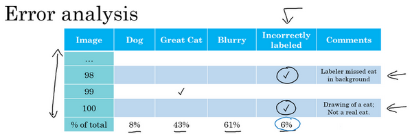

現在，之前的討論集中在訓練集中的標記出錯的樣本，那麼如果是開發集和測試集中有這些標記出錯的樣本呢？如果你擔心開發集或測試集上標記出錯的樣本帶來的影響，他們一般建議你在錯誤分析時，添加一個額外的列，這樣你也可以統計標籤 $y=1$錯誤的樣本數。所以比如說，也許你統計一下對100個標記出錯的樣本的影響，所以你會找到100個樣本，其中你的分類器的輸出和開發集的標籤不一致，有時對於其中的少數樣本，你的分類器輸出和標籤不同，是因為標籤錯了，而不是你的分類器出錯。所以也許在這個樣本中，你發現標記的人漏了背景裡的一隻貓，所以那裡打個勾，來表示樣本98標籤出錯了。也許這張圖實際上是貓的畫，而不是一隻真正的貓，也許你希望標記數據的人將它標記為$y=0$，而不是 $y=1$，然後再在那裡打個勾。當你統計出其他錯誤類型的百分比後，就像我們在之前的影片中看到的那樣，你還可以統計因為標籤錯誤所占的百分比，你的開發集裡的 $y$ 值是錯的，這就解釋了為什麼你的學習算法做出和數據集裡的標記不一樣的預測1。

所以現在問題是，是否值得修正這6%標記出錯的樣本，我的建議是，如果這些標記錯誤嚴重影響了你在開發集上評估算法的能力，那麼就應該去花時間修正錯誤的標籤。但是，如果它們沒有嚴重影響到你用開發集評估成本偏差的能力，那麼可能就不應該花寶貴的時間去處理。

我給你看一個樣本，解釋清楚我的意思。所以我建議你看3個數字來確定是否值得去人工修正標記出錯的數據，我建議你看看整體的開發集錯誤率，在我們以前的影片中的樣本，我們說也許我們的系統達到了90%整體準確度，所以有10%錯誤率，那麼你應該看看錯誤標記引起的錯誤的數量或者百分比。所以在這種情況下，6％的錯誤來自標記出錯，所以10%的6%就是0.6%。也許你應該看看其他原因導致的錯誤，如果你的開發集上有10%錯誤，其中0.6%是因為標記出錯，剩下的占9.4%，是其他原因導致的，比如把狗誤認為貓，大貓圖片。所以在這種情況下，我說有9.4%錯誤率需要集中精力修正，而標記出錯導致的錯誤是總體錯誤的一小部分而已，所以如果你一定要這麼做，你也可以手工修正各種錯誤標籤，但也許這不是當下最重要的任務。

我們再看另一個樣本，假設你在學習問題上取得了很大進展，所以現在錯誤率不再是10%了，假設你把錯誤率降到了2％，但總體錯誤中的0.6%還是標記出錯導致的。所以現在，如果你想檢查一組標記出錯的開發集圖片，開發集數據有2%標記錯誤了，那麼其中很大一部分，0.6%除以2%，實際上變成30%標籤而不是6%標籤了。有那麼多錯誤樣本其實是因為標記出錯導致的，所以現在其他原因導致的錯誤是1.4%。當測得的那麼大一部分的錯誤都是開發集標記出錯導致的，那似乎修正開發集裡的錯誤標籤似乎更有價值。

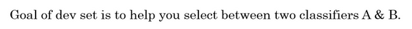

如果你還記得設立開發集的目標的話，開發集的主要目的是，你希望用它來從兩個分類器$A$和$B$中選擇一個。所以當你測試兩個分類器$A$和$B$時，在開發集上一個有2.1%錯誤率，另一個有1.9%錯誤率，但是你不能再信任開發集了，因為它無法告訴你這個分類器是否比這個好，因為0.6%的錯誤率是標記出錯導致的。那麼現在你就有很好的理由去修正開發集裡的錯誤標籤，因為在右邊這個樣本中，標記出錯對算法錯誤的整體評估標準有嚴重的影響。而左邊的樣本中，標記出錯對你算法影響的百分比還是相對較小的。

現在如果你決定要去修正開發集數據，手動重新檢查標籤，並嘗試修正一些標籤，這裡還有一些額外的方針和原則需要考慮。首先，我鼓勵你不管用什麼修正手段，都要同時作用到開發集和測試集上，我們之前討論過為什麼，開發和測試集必須來自相同的分布。開發集確定了你的目標，當你擊中目標後，你希望算法能夠推廣到測試集上，這樣你的團隊能夠更高效的在來自同一分布的開發集和測試集上疊代。如果你打算修正開發集上的部分數據，那麼最好也對測試集做同樣的修正以確保它們繼續來自相同的分布。所以我們僱傭了一個人來仔細檢查這些標籤，但必須同時檢查開發集和測試集。

其次，我強烈建議你要考慮同時檢驗算法判斷正確和判斷錯誤的樣本，要檢查算法出錯的樣本很容易，只需要看看那些樣本是否需要修正，但還有可能有些樣本算法判斷正確，那些也需要修正。如果你只修正算法出錯的樣本，你對算法的偏差估計可能會變大，這會讓你的算法有一點不公平的優勢，我們就需要再次檢查出錯的樣本，但也需要再次檢查做對的樣本，因為算法有可能因為運氣好把某個東西判斷對了。在那個特例裡，修正那些標籤可能會讓算法從判斷對變成判斷錯。這第二點不是很容易做，所以通常不會這麼做。通常不會這麼做的原因是，如果你的分類器很準確，那麼判斷錯的次數比判斷正確的次數要少得多。那麼就有2%出錯，98%都是對的，所以更容易檢查2%數據上的標籤，然而檢查98%數據上的標籤要花的時間長得多，所以通常不這麼做，但也是要考慮到的。

最後，如果你進入到一個開發集和測試集去修正這裡的部分標籤，你可能會，也可能不會去對訓練集做同樣的事情，還記得我們在其他影片裡講過，修正訓練集中的標籤其實相對沒那麼重要，你可能決定只修正開發集和測試集中的標籤，因為它們通常比訓練集小得多，你可能不想把所有額外的精力投入到修正大得多的訓練集中的標籤，所以這樣其實是可以的。我們將在本週晚些時候討論一些步驟，用於處理你的訓練數據分布和開發與測試數據不同的情況，對於這種情況學習算法其實相當健壯，你的開發集和測試集來自同一分布非常重要。但如果你的訓練集來自稍微不同的分布，通常這是一件很合理的事情，我會在本週晚些時候談談如何處理這個問題。

最後我講幾個建議：

首先，深度學習研究人員有時會喜歡這樣說：“我只是把數據提供給算法，我訓練過了，效果拔群”。這話說出了很多深度學習錯誤的真相，更多時候，我們把數據餵給算法，然後訓練它，並減少人工干預，減少使用人類的見解。但我認為，在構造實際系統時，通常需要更多的人工錯誤分析，更多的人類見解來架構這些系統，儘管深度學習的研究人員不願意承認這點。

其次，不知道為什麼，我看一些工程師和研究人員不願意親自去看這些樣本，也許做這些事情很無聊，坐下來看100或幾百個樣本來統計錯誤數量，但我經常親自這麼做。當我帶領一個機器學習團隊時，我想知道它所犯的錯誤，我會親自去看看這些數據，嘗試和一部分錯誤作鬥爭。我想就因為花了這幾分鐘，或者幾個小時去親自統計數據，真的可以幫你找到需要優先處理的任務，我發現花時間親自檢查數據非常值得，所以我強烈建議你們這樣做，如果你在搭建你的機器學習系統的話，然後你想確定應該優先嘗試哪些想法，或者哪些方向。

這就是錯誤分析過程，在下一個影片中，我想分享一下錯誤分析是如何在啟動新的機器學習項目中發揮作用的。
### 2.3 快速搭建你的第一個系統，並進行疊代（Build your first system quickly, then iterate）

如果你正在開發全新的機器學習應用，我通常會給你這樣的建議，你應該儘快建立你的第一個系統原型，然後快速疊代。

讓我告訴你我的意思，我在語音識別領域研究了很多年，如果你正在考慮建立一個新的語音識別系統，其實你可以走很多方向，可以優先考慮很多事情。

比如，有一些特定的技術，可以讓語音識別系統對嘈雜的背景更加健壯，嘈雜的背景可能是說咖啡店的噪音，背景裡有很多人在聊天，或者車輛的噪音，高速上汽車的噪音或者其他類型的噪音。有一些方法可以讓語音識別系統在處理帶口音時更健壯，還有特定的問題和麥克風與說話人距離很遠有關，就是所謂的遠場語音識別。兒童的語音識別帶來特殊的挑戰，挑戰來自單詞發音方面，還有他們選擇的詞彙，他們傾向於使用的詞彙。還有比如說，說話人口吃，或者說了很多無意義的短語，比如“哦”，“啊”之類的。你可以選擇很多不同的技術，讓你聽寫下來的文本可讀性更強，所以你可以做很多事情來改進語音識別系統。

一般來說，對於幾乎所有的機器學習程序可能會有50個不同的方向可以前進，並且每個方向都是相對合理的可以改善你的系統。但挑戰在於，你如何選擇一個方向集中精力處理。即使我已經在語音識別領域工作多年了，如果我要為一個新應用程式域構建新系統，我還是覺得很難不花時間去思考這個問題就直接選擇方向。所以我建議你們，如果你想搭建全新的機器學習程序，就是快速搭好你的第一個系統，然後開始疊代。我的意思是我建議你快速設立開發集和測試集還有指標，這樣就決定了你的目標所在，如果你的目標定錯了，之後改也是可以的。但一定要設立某個目標，然後我建議你馬上搭好一個機器學習系統原型，然後找到訓練集，訓練一下，看看效果，開始理解你的算法表現如何，在開發集測試集，你的評估指標上表現如何。當你建立第一個系統後，你就可以馬上用到之前說的偏差方差分析，還有之前最後幾個影片討論的錯誤分析，來確定下一步優先做什麼。特別是如果錯誤分析讓你了解到大部分的錯誤的來源是說話人遠離麥克風，這對語音識別構成特殊挑戰，那麼你就有很好的理由去集中精力研究這些技術，所謂遠場語音識別的技術，這基本上就是處理說話人離麥克風很遠的情況。

建立這個初始系統的所有意義在於，它可以是一個快速和粗糙的實現（**quick and dirty implementation**），你知道的，別想太多。初始系統的全部意義在於，有一個學習過的系統，有一個訓練過的系統，讓你確定偏差方差的範圍，就可以知道下一步應該優先做什麼，讓你能夠進行錯誤分析，可以觀察一些錯誤，然後想出所有能走的方向，哪些是實際上最有希望的方向。

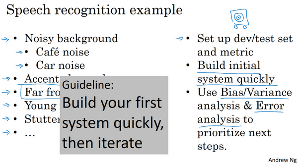

所以回顧一下，我建議你們快速建立你的第一個系統，然後疊代。不過如果你在這個應用程式領域有很多經驗，這個建議適用程度要低一些。還有一種情況適應程度更低，當這個領域有很多可以借鑑的學術文獻，處理的問題和你要解決的幾乎完全相同，所以，比如說，人臉識別就有很多學術文獻，如果你嘗試搭建一個人臉識別設備，那麼可以從現有大量學術文獻為基礎出發，一開始就搭建比較複雜的系統。但如果你第一次處理某個新問題，那我真的不鼓勵你想太多，或者把第一個系統弄得太複雜。我建議你們構建一些快速而粗糙的實現，然後用來幫你找到改善系統要優先處理的方向。我見過很多機器學習項目，我覺得有些團隊的解決方案想太多了，他們造出了過於複雜的系統。我也見過有限團隊想的不夠，然後造出過於簡單的系統。平均來說，我見到更多的團隊想太多，構建太複雜的系統。

所以我希望這些策略有幫助，如果你將機器學習算法應用到新的應用程式裡，你的主要目標是弄出能用的系統，你的主要目標並不是發明全新的機器學習算法，這是完全不同的目標，那時你的目標應該是想出某種效果非常好的算法。所以我鼓勵你們搭建快速而粗糙的實現，然後用它做偏差/方差分析，用它做錯誤分析，然後用分析結果確定下一步優先要做的方向。

### 2.4 使用來自不同分布的數據，進行訓練和測試（Training and testing on different distributions）

深度學習算法對訓練數據的胃口很大，當你收集到足夠多帶標籤的數據構成訓練集時，算法效果最好，這導致很多團隊用盡一切辦法收集數據，然後把它們堆到訓練集裡，讓訓練的數據量更大，即使有些數據，甚至是大部分數據都來自和開發集、測試集不同的分布。在深度學習時代，越來越多的團隊都用來自和開發集、測試集分布不同的數據來訓練，這裡有一些微妙的地方，一些最佳做法來處理訓練集和測試集存在差異的情況，我們來看看。

假設你在開發一個手機應用，用戶會上傳他們用手機拍攝的照片，你想識別用戶從應用中上傳的圖片是不是貓。現在你有兩個數據來源，一個是你真正關心的數據分布，來自應用上傳的數據，比如右邊的應用，這些照片一般更業餘，取景不太好，有些甚至很模糊，因為它們都是業餘用戶拍的。另一個數據來源就是你可以用爬蟲程式挖掘網頁直接下載，就這個樣本而言，可以下載很多取景專業、高解析度、拍攝專業的貓圖片。如果你的應用用戶數還不多，也許你只收集到10,000張用戶上傳的照片，但通過爬蟲挖掘網頁，你可以下載到巨量貓圖，也許你從網際網路上下載了超過20萬張貓圖。而你真正關心的算法表現是你的最終系統處理來自應用程式的這個圖片分布時效果好不好，因為最後你的用戶會上傳類似右邊這些圖片，你的分類器必須在這個任務中表現良好。現在你就陷入困境了，因為你有一個相對小的數據集，只有10,000個樣本來自那個分布，而你還有一個大得多的數據集來自另一個分布，圖片的外觀和你真正想要處理的並不一樣。但你又不想直接用這10,000張圖片，因為這樣你的訓練集就太小了，使用這20萬張圖片似乎有幫助。但是，困境在於，這20萬張圖片並不完全來自你想要的分布，那麼你可以怎麼做呢？

這裡有一種選擇，你可以做的一件事是將兩組數據合併在一起，這樣你就有21萬張照片，你可以把這21萬張照片隨機分配到訓練、開發和測試集中。為了說明觀點，我們假設你已經確定開發集和測試集各包含2500個樣本，所以你的訓練集有205000個樣本。現在這麼設立你的數據集有一些好處，也有壞處。好處在於，你的訓練集、開發集和測試集都來自同一分布，這樣更好管理。但壞處在於，這壞處還不小，就是如果你觀察開發集，看看這2500個樣本其中很多圖片都來自網頁下載的圖片，那並不是你真正關心的數據分布，你真正要處理的是來自手機的圖片。

所以結果你的數據總量，這200,000個樣本，我就用$200k$縮寫表示，我把那些是從網頁下載的數據總量寫成$210k$，所以對於這2500個樣本，數學期望值是：$2500\times \frac{200k}{210k} =2381$，有2381張圖來自網頁下載，這是期望值，確切數目會變化，取決於具體的隨機分配操作。但平均而言，只有119張圖來自手機上傳。要記住，設立開發集的目的是告訴你的團隊去瞄準的目標，而你瞄準目標的方式，你的大部分精力都用在最佳化來自網頁下載的圖片，這其實不是你想要的。所以我真的不建議使用第一個選項，因為這樣設立開發集就是告訴你的團隊，針對不同於你實際關心的數據分布去最佳化，所以不要這麼做。

我建議你走另外一條路，就是這樣，訓練集，比如說還是205,000張圖片，我們的訓練集是來自網頁下載的200,000張圖片，然後如果需要的話，再加上5000張來自手機上傳的圖片。然後對於開發集和測試集，這數據集的大小是按比例畫的，你的開發集和測試集都是手機圖。而訓練集包含了來自網頁的20萬張圖片，還有5000張來自應用的圖片，開發集就是2500張來自應用的圖片，測試集也是2500張來自應用的圖片。這樣將數據分成訓練集、開發集和測試集的好處在於，現在你瞄準的目標就是你想要處理的目標，你告訴你的團隊，我的開發集包含的數據全部來自手機上傳，這是你真正關心的圖片分布。我們試試搭建一個學習系統，讓系統在處理手機上傳圖片分布時效果良好。缺點在於，當然了，現在你的訓練集分布和你的開發集、測試集分布並不一樣。但事實證明，這樣把數據分成訓練、開發和測試集，在長期能給你帶來更好的系統性能。我們以後會討論一些特殊的技巧，可以處理
訓練集的分布和開發集和測試集分布不一樣的情況。

我們來看另一個樣本，假設你正在開發一個全新的產品，一個語音啟動汽車後視鏡，這在中國是個真實存在的產品，它正在進入其他國家。但這就是造一個後視鏡，把這個小東西換掉，現在你就可以和後視鏡對話了，然後只需要說：“親愛的後視鏡，請幫我找找到最近的加油站的導航方向”，然後後視鏡就會處理這個請求。所以這實際上是一個真正的產品，假設現在你要為你自己的國家研製這個產品，那麼你怎麼收集數據去訓練這個產品語言識別模組呢？

嗯，也許你已經在語音識別領域上工作了很久，所以你有很多來自其他語音識別應用的數據，它們並不是來自語音啟動後視鏡的數據。現在我講講如何分配訓練集、開發集和測試集。對於你的訓練集，你可以將你擁有的所有語音數據，從其他語音識別問題收集來的數據，比如這些年你從各種語音識別數據供應商買來的數據，今天你可以直接買到成$x$,$y$對的數據，其中$x$是音訊剪輯，$y$是聽寫記錄。或者也許你研究過智慧音箱，語音啟動音箱，所以你有一些數據，也許你做過語音啟動鍵盤的開發之類的。

舉例來說，也許你從這些來源收集了500,000段錄音，對於你的開發集和測試集也許數據集小得多，比如實際上來自語音啟動後視鏡的數據。因為用戶要查詢導航訊息或試圖找到通往各個地方的路線，這個數據集可能會有很多街道地址，對吧？“請幫我導航到這個街道地址”，或者說：“請幫助我導航到這個加油站”，所以這個數據的分布和左邊大不一樣，但這真的是你關心的數據，因為這些數據是你的產品必須處理好的，所以你就應該把它設成你的開發和測試集。

在這個樣本中，你應該這樣設立你的訓練集，左邊有500,000段語音，然後你的開發集和測試集，我把它簡寫成$D$和$T$，可能每個集包含10,000段語音，是從實際的語音啟動後視鏡收集的。或者換種方式，如果你覺得不需要將20,000段來自語音啟動後視鏡的錄音全部放進開發和測試集，也許你可以拿一半，把它放在訓練集裡，那麼訓練集可能是51萬段語音，包括來自那裡的50萬段語音，還有來自後視鏡的1萬段語音，然後開發集和測試集也許各自有5000段語音。所以有2萬段語音，也許1萬段語音放入了訓練集，5000放入開發集，5000放入測試集。所以這是另一種將你的數據分成訓練、開發和測試的方式。這樣你的訓練集大得多，大概有50萬段語音，比只用語音啟動後視鏡數據作為訓練集要大得多。

所以在這個影片中，你們見到幾組樣本，讓你的訓練集數據來自和開發集、測試集不同的分布，這樣你就可以有更多的訓練數據。在這些樣本中，這將改善你的學習算法。

現在你可能會問，是不是應該把收集到的數據都用掉？答案很微妙，不一定都是肯定的答案，我們在下段影片看看一個反例。

### 2.5 數據分布不匹配時，偏差與方差的分析（Bias and Variance with mismatched data distributions）

估計學習算法的偏差和方差真的可以幫你確定接下來應該優先做的方向，但是，當你的訓練集來自和開發集、測試集不同分布時，分析偏差和方差的方式可能不一樣，我們來看為什麼。

我們繼續用貓分類器為例，我們說人類在這個任務上能做到幾乎完美，所以貝葉斯錯誤率或者說貝葉斯最優錯誤率，我們知道這個問題裡幾乎是0%。所以要進行錯誤率分析，你通常需要看訓練誤差，也要看看開發集的誤差。比如說，在這個樣本中，你的訓練集誤差是1%，你的開發集誤差是10%，如果你的開發集來自和訓練集一樣的分布，你可能會說，這裡存在很大的方差問題，你的算法不能很好的從訓練集出發泛化，它處理訓練集很好，但處理開發集就突然間效果很差了。

但如果你的訓練數據和開發數據來自不同的分布，你就不能再放心下這個結論了。特別是，也許算法在開發集上做得不錯，可能因為訓練集很容易識別，因為訓練集都是高解析度圖片，很清晰的圖像，但開發集要難以識別得多。所以也許軟體沒有方差問題，這只不過反映了開發集包含更難準確分類的圖片。所以這個分析的問題在於，當你看訓練誤差，再看開發誤差，有兩件事變了。首先算法只見過訓練集數據，沒見過開發集數據。第二，開發集數據來自不同的分布。而且因為你同時改變了兩件事情，很難確認這增加的9%誤差率有多少是因為算法沒看到開發集中的數據導致的，這是問題方差的部分，有多少是因為開發集數據就是不一樣。

為了弄清楚哪個因素影響更大，如果你完全不懂這兩種影響到底是什麼，別擔心我們馬上會再講一遍。但為了分辨清楚兩個因素的影響，定義一組新的數據是有意義的，我們稱之為訓練-開發集，所以這是一個新的數據子集。我們應該從訓練集的分布裡挖出來，但你不會用來訓練你的網路。

我的意思是我們已經設立過這樣的訓練集、開發集和測試集了，並且開發集和測試集來自相同的分布，但訓練集來自不同的分布。

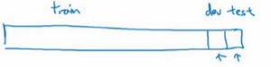

我們要做的是隨機打散訓練集，然後分出一部分訓練集作為訓練-開發集（training-dev），就像開發集和測試集來自同一分布，訓練集、訓練-開發集也來自同一分布。

但不同的地方是，現在你只在訓練集訓練你的神經網路，你不會讓神經網路在訓練-開發集上跑後向傳播。為了進行誤差分析，你應該做的是看看分類器在訓練集上的誤差，訓練-開發集上的誤差，還有開發集上的誤差。

比如說這個樣本中，訓練誤差是1%，我們說訓練-開發集上的誤差是9%，然後開發集誤差是10%，和以前一樣。你就可以從這裡得到結論，當你從訓練數據變到訓練-開發集數據時，錯誤率真的上升了很多。而訓練數據和訓練-開發數據的差異在於，你的神經網路能看到第一部分數據並直接在上面做了訓練，但沒有在訓練-開發集上直接訓練，這就告訴你，算法存在方差問題，因為訓練-開發集的錯誤率是在和訓練集來自同一分布的數據中測得的。所以你知道，儘管你的神經網路在訓練集中表現良好，但無法泛化到來自相同分布的訓練-開發集裡，它無法很好地泛化推廣到來自同一分布，但以前沒見過的數據中，所以在這個樣本中我們確實有一個方差問題。

我們來看一個不同的樣本，假設訓練誤差為1%，訓練-開發誤差為1.5%，但當你開始處理開發集時，錯誤率上升到10%。現在你的方差問題就很小了，因為當你從見過的訓練數據轉到訓練-開發集數據，神經網路還沒有看到的數據，錯誤率只上升了一點點。但當你轉到開發集時，錯誤率就大大上升了，所以這是數據不匹配的問題。因為你的學習算法沒有直接在訓練-開發集或者開發集訓練過，但是這兩個數據集來自不同的分布。但不管算法在學習什麼，它在訓練-開發集上做的很好，但開發集上做的不好，所以總之你的算法擅長處理和你關心的數據不同的分布，我們稱之為數據不匹配的問題。

我們再來看幾個樣本，我會在下一行裡寫出來，因上面沒空間了。所以訓練誤差、訓練-開發誤差、還有開發誤差，我們說訓練誤差是10%，訓練-開發誤差是11%，開發誤差為12%，要記住，人類水平對貝葉斯錯誤率的估計大概是0%，如果你得到了這種等級的表現，那就真的存在偏差問題了。存在可避免偏差問題，因為算法做的比人類水平差很多，所以這裡的偏差真的很高。

最後一個例子，如果你的訓練集錯誤率是10%，你的訓練-開發錯誤率是11%，開發錯誤率是20%，那麼這其實有兩個問題。第一，可避免偏差相當高，因為你在訓練集上都沒有做得很好，而人類能做到接近0%錯誤率，但你的算法在訓練集上錯誤率為10%。這裡方差似乎很小，但數據不匹配問題很大。所以對於這個樣本，我說，如果你有很大的偏差或者可避免偏差問題，還有數據不匹配問題。

我們看看這張幻燈片裡做了什麼，然後寫出一般的原則，我們要看的關鍵數據是人類水平錯誤率，你的訓練集錯誤率，訓練-開發集錯誤率，所以這分布和訓練集一樣，但你沒有直接在上面訓練。根據這些錯誤率之間差距有多大，你可以大概知道，可避免偏差、方差數據不匹配問題各自有多大。

我們說人類水平錯誤率是4%的話，你的訓練錯誤率是7%，而你的訓練-開發錯誤率是10%，而開發錯誤率是12%，這樣你就大概知道可避免偏差有多大。因為你知道，你希望你的算法至少要在訓練集上的表現接近人類。而這大概表明了方差大小，所以你從訓練集泛化推廣到訓練-開發集時效果如何？而這告訴你數據不匹配的問題大概有多大。技術上你還可以再加入一個數字，就是測試集表現，我們寫成測試集錯誤率，你不應該在測試集上開發，因為你不希望對測試集過擬合。但如果你看看這個，那麼這裡的差距就說明你對開發集過擬合的程度。所以如果開發集表現和測試集表現有很大差距，那麼你可能對開發集過擬合了，所以也許你需要一個更大的開發集，對吧？要記住，你的開發集和測試集來自同一分布，所以這裡存在很大差距的話。如果算法在開發集上做的很好，比測試集好得多，那麼你就可能對開發集過擬合了。如果是這種情況，那麼你可能要往回退一步，然後收集更多開發集數據。現在我寫出這些數字，這數字列表越往後數字越大。

這裡還有個例子，其中數字並沒有一直變大，也許人類的表現是4%，訓練錯誤率是7%，訓練-開發錯誤率是10%。但我們看看開發集，你發現，很意外，算法在開發集上做的更好，也許是6%。所以如果你見到這種現象，比如說在處理語音識別任務時發現這樣，其中訓練數據其實比你的開發集和測試集難識別得多。所以這兩個（7%，10%）是從訓練集分布評估的，而這兩個（6%，6%）是從開發測試集分布評估的。所以有時候如果你的開發測試集分布比你應用實際處理的數據要容易得多，那麼這些錯誤率可能真的會下降。所以如果你看到這樣的有趣的事情，可能需要比這個分析更普適的分析，我在下一張幻燈片裡快速解釋一下。

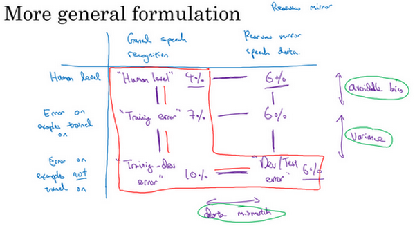

所以，我們就以語音啟動後視鏡為例子，事實證明，我們一直寫出的數字可以放到一張表裡，在水平軸上，我要放入不同的數據集。比如說，你可能從一般語音識別任務裡得到很多數據，所以你可能會有一堆數據，來自小型智慧音箱的語音識別問題的數據，你購買的數據等等。然後你收集了和後視鏡有關的語音數據，在車裡錄的。所以這是表格的$x$軸，不同的數據集。在另一條軸上，我要標記處理數據不同的方式或算法。

首先，人類水平，人類處理這些數據集時準確度是多少。然後這是神經網路訓練過的數據集上達到的錯誤率，然後還有神經網路沒有訓練過的數據集上達到的錯誤率。所以結果我們上一張幻燈片說是人類水平的錯誤率，數字填入這個單元格里（第二行第二列），人類對這一類數據處理得有多好，比如來自各種語音識別系統的數據，那些進入你的訓練集的成千上萬的語音片段，而上一張幻燈片中的例子是4%。這個數位（7%），可能是我們的訓練錯誤率，在上一張幻燈片中的例子中是7%。是的，如果你的學習算法見過這個樣本，在這個樣本上跑過梯度下降，這個樣本來自你的訓練集分布或一般的語音識別數據分布，你的算法在訓練過的數據中表現如何呢？然後這就是訓練-開發集錯誤率，通常來自這個分布的錯誤率會高一點，一般的語音識別數據，如果你的算法沒在來自這個分布的樣本上訓練過，它的表現如何呢？這就是我們說的訓練-開發集錯誤率。

如果你移到右邊去，這個單元格是開發集錯誤率，也可能是測試集錯誤，在剛剛的例子中是6%。而開發集和測試集，實際上是兩個數字，但都可以放入這個單元格里。如果你有來自後視鏡的數據，來自從後視鏡應用在車裡實際錄得的數據，但你的神經網路沒有在這些數據上做過反向傳播，那麼錯誤率是多少呢？

我們在上一張幻燈片作的分析是觀察這兩個數字之間的差異（**Human level 4%**和**Training error 7%**），還有這兩個數字之間（**Training error 7%**和**Training-dev error 10%**），這兩個數字之間（**Training-dev error 10%**和**Dev/Test dev 6%**）。這個差距（**Human level 4%**和**Training error 7%**）衡量了可避免偏差大小，這個差距**Training error 7%**和**Training-dev error 10%**）衡量了方差大小，而這個差距（**Training-dev error 10%**和**Dev/Test dev 6%**）衡量了數據不匹配問題的大小。

事實證明，把剩下的兩個數位（**rearview mirror speech data 6%**和**Error on examples trained on 6%**），也放到這個表格里也是有用的。如果結果這也是6%，那麼你獲得這個數字的方式是你讓一些人自己標記他們的後視鏡語音識別數據，看看人類在這個任務裡能做多好，也許結果也是6%。做法就是，你收集一些後視鏡語音識別數據，把它放在訓練集中，讓神經網路去學習，然後測量那個數據子集上的錯誤率，但如果你得到這樣的結果，好吧，那就是說你已經在後視鏡語音數據上達到人類水平了，所以也許你對那個數據分布做的已經不錯了。

當你繼續進行更多分析時，分析並不一定會給你指明一條前進道路，但有時候你可能洞察到一些特徵。比如比較這兩個數位（**General speech recognition Human level 4%**和**rearview mirror speech data 6%**），告訴我們對於人類來說，後視鏡的語音數據實際上比一般語音識別更難，因為人類都有6%的錯誤，而不是4%的錯誤，但看看這個差值，你就可以了解到偏差和方差，還有數據不匹配這些問題的不同程度。所以更一般的分析方法是，我已經用過幾次了。我還沒用過，但對於很多問題來說檢查這個子集的條目，看看這些差值，已經足夠讓你往相對有希望的方向前進了。但有時候填滿整個表格，你可能會洞察到更多特徵。

最後，我們以前講過很多處理偏差的手段，講過處理方差的手段，但怎麼處理數據不匹配呢？特別是開發集、測試集和你的訓練集數據來自不同分布時，這樣可以用更多訓練數據，真正幫你提高學習算法性能。但是，如果問題不僅來自偏差和方差，你現在又有了這個潛在的新問題，數據不匹配，有什麼好辦法可以處理數據不匹配的呢？實話說，並沒有很通用，或者至少說是系統解決數據不匹配問題的方法，但你可以做一些嘗試，可能會有幫助，我們在下一個影片裡看看這些嘗試。

所以我們講了如何使用來自和開發集、測試集不同分布的訓練數據，這可以給你提供更多訓練數據，因此有助於提高你的學習算法的性能，但是，潛在問題就不只是偏差和方差問題，這樣做會引入第三個潛在問題，數據不匹配。如果你做了錯誤分析，並發現數據不匹配是大量錯誤的來源，那麼你怎麼解決這個問題呢？但結果很不幸，並沒有特別系統的方法去解決數據不匹配問題，但你可以做一些嘗試，可能會有幫助，我們來看下一段影片。
### 2.6 處理數據不匹配問題（Addressing data mismatch）

如果您的訓練集來自和開發測試集不同的分布，如果錯誤分析顯示你有一個數據不匹配的問題該怎麼辦？這個問題沒有完全系統的解決方案，但我們可以看看一些可以嘗試的事情。如果我發現有嚴重的數據不匹配問題，我通常會親自做錯誤分析，嘗試了解訓練集和開發測試集的具體差異。技術上，為了避免對測試集過擬合，要做錯誤分析，你應該人工去看開發集而不是測試集。

但作為一個具體的例子，如果你正在開發一個語音啟動的後視鏡應用，你可能要看看……我想如果是語音的話，你可能要聽一下來自開發集的樣本，嘗試弄清楚開發集和訓練集到底有什麼不同。所以，比如說你可能會發現很多開發集樣本噪音很多，有很多汽車噪音，這是你的開發集和訓練集差異之一。也許你還會發現其他錯誤，比如在你的車子裡的語言啟動後視鏡，你發現它可能經常識別錯誤街道號碼，因為那裡有很多導航請求都有街道地址，所以得到正確的街道號碼真的很重要。當你了解開發集誤差的性質時，你就知道，開發集有可能跟訓練集不同或者更難識別，那麼你可以嘗試把訓練數據變得更像開發集一點，或者，你也可以收集更多類似你的開發集和測試集的數據。所以，比如說，如果你發現車輛背景噪音是主要的錯誤來源，那麼你可以模擬車輛噪聲數據，我會在下一張幻燈片裡詳細討論這個問題。或者你發現很難識別街道號碼，也許你可以有意識地收集更多人們說數字的音訊數據，加到你的訓練集裡。

現在我知道這張幻燈片只給出了粗略的指南，列出一些你可以做的嘗試，這不是一個系統化的過程，我想，這不能保證你一定能取得進展。但我發現這種人工見解，我們可以一起嘗試收集更多和真正重要的場合相似的數據，這通常有助於解決很多問題。所以，如果你的目標是讓訓練數據更接近你的開發集，那麼你可以怎麼做呢？

你可以利用的其中一種技術是人工合成數據（**artificial data synthesis**），我們討論一下。在解決汽車噪音問題的場合，所以要建立語音識別系統。也許實際上你沒那麼多實際在汽車背景噪音下錄得的音訊，或者在高速公路背景噪音下錄得的音訊。但我們發現，你可以合成。所以假設你錄製了大量清晰的音訊，不帶車輛背景噪音的音訊，“**The quick brown fox jumps over the lazy dog**”（音訊播放），所以，這可能是你的訓練集裡的一段音訊，順便說一下，這個句子在AI測試中經常使用，因為這個短句包含了從a到z所有字母，所以你會經常見到這個句子。但是，有了這個“**the quick brown fox jumps over the lazy dog**”這段錄音之後，你也可以收集一段這樣的汽車噪音，（播放汽車噪音音訊）這就是汽車內部的背景噪音，如果你一言不發開車的話，就是這種聲音。如果你把兩個音訊片段放到一起，你就可以合成出"**the quick brown fox jumps over the lazy dog**"（帶有汽車噪聲），在汽車背景噪音中的效果，聽起來像這樣，所以這是一個相對簡單的音訊合成例子。在實踐中，你可能會合成其他音訊效果，比如混響，就是聲音從汽車內壁上反彈疊加的效果。

但是通過人工數據合成，你可以快速製造更多的訓練數據，就像真的在車裡錄的那樣，那就不需要花時間實際出去收集數據，比如說在實際行駛中的車子，錄下上萬小時的音訊。所以，如果錯誤分析顯示你應該嘗試讓你的數據聽起來更像在車裡錄的，那麼人工合成那種音訊，然後餵給你的機器學習算法，這樣做是合理的。

現在我們要提醒一下，人工數據合成有一個潛在問題，比如說，你在安靜的背景裡錄得10,000小時音訊數據，然後，比如說，你只錄了一小時車輛背景噪音，那麼，你可以這麼做，將這1小時汽車噪音重播10,000次，併疊加到在安靜的背景下錄得的10,000小時數據。如果你這麼做了，人聽起來這個音訊沒什麼問題。但是有一個風險，有可能你的學習算法對這1小時汽車噪音過擬合。特別是，如果這組汽車裡錄的音訊可能是你可以想像的所有汽車噪音背景的集合，如果你只錄了一小時汽車噪音，那你可能只模擬了全部數據空間的一小部分，你可能只從汽車噪音的很小的子集來合成數據。

而對於人耳來說，這些音訊聽起來沒什麼問題，因為一小時的車輛噪音對人耳來說，聽起來和其他任意一小時車輛噪音是一樣的。但你有可能從這整個空間很小的一個子集出發合成數據，神經網路最後可能對你這一小時汽車噪音過擬合。我不知道以較低成本收集10,000小時的汽車噪音是否可行，這樣你就不用一遍又一遍地重播那1小時汽車噪音，你就有10,000個小時永不重複的汽車噪音來疊加到10,000小時安靜背景下錄得的永不重複的語音錄音。這是可以做的，但不保證能做。但是使用10,000小時永不重複的汽車噪音，而不是1小時重複學習，算法有可能取得更好的性能。人工數據合成的挑戰在於，人耳的話，人耳是無法分辨這10,000個小時聽起來和那1小時沒什麼區別，所以你最後可能會製造出這個原始數據很少的，在一個小得多的空間子集合成的訓練數據，但你自己沒意識到。

這裡有人工合成數據的另一個例子，假設你在研發無人駕駛汽車，你可能希望檢測出這樣的車，然後用這樣的框包住它。很多人都討論過的一個思路是，為什麼不用計算機合成圖像來模擬成千上萬的車輛呢？事實上，這裡有幾張車輛照片（下圖後兩張圖片），其實是用計算機合成的，我想這個合成是相當逼真的，我想通過這樣合成圖片，你可以訓練出一個相當不錯的計算機視覺系統來檢測車子。

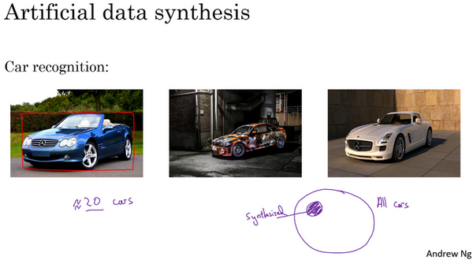

不幸的是，上一張幻燈片介紹的情況也會在這裡出現，比如這是所有車的集合，如果你只合成這些車中很小的子集，對於人眼來說也許這樣合成圖像沒什麼問題，但你的學習算法可能會對合成的這一個小子集過擬合。特別是很多人都獨立提出了一個想法，一旦你找到一個電腦遊戲，裡面車輛渲染的畫面很逼真，那麼就可以截圖，得到數量巨大的汽車圖片數據集。事實證明，如果你仔細觀察一個電視遊戲，如果這個遊戲只有20輛獨立的車，那麼這遊戲看起來還行。因為你是在遊戲裡開車，你只看到這20輛車，這個模擬看起來相當逼真。但現實世界裡車輛的設計可不只20種，如果你用著20量獨特的車合成的照片去訓練系統，那麼你的神經網路很可能對這20輛車過擬合，但人類很難分辨出來。即使這些圖像看起來很逼真，你可能真的只用了所有可能出現的車輛的很小的子集。

所以，總而言之，如果你認為存在數據不匹配問題，我建議你做錯誤分析，或者看看訓練集，或者看看開發集，試圖找出，試圖了解這兩個數據分布到底有什麼不同，然後看看是否有辦法收集更多看起來像開發集的數據作訓練。

我們談到其中一種辦法是人工數據合成，人工數據合成確實有效。在語音識別中。我已經看到人工數據合成顯著提升了已經非常好的語音識別系統的表現，所以這是可行的。但當你使用人工數據合成時，一定要謹慎，要記住你有可能從所有可能性的空間只選了很小一部分去模擬數據。

所以這就是如何處理數據不匹配問題，接下來，我想和你分享一些想法就是如何從多種類型的數據同時學習。

### 2.7 遷移學習（Transfer learning）

深度學習中，最強大的理念之一就是，有的時候神經網路可以從一個任務中習得知識，並將這些知識應用到另一個獨立的任務中。所以例如，也許你已經訓練好一個神經網路，能夠識別像貓這樣的對象，然後使用那些知識，或者部分習得的知識去幫助您更好地閱讀x射線掃描圖，這就是所謂的遷移學習。

我們來看看，假設你已經訓練好一個圖像識別神經網路，所以你首先用一個神經網路，並在$(x,y)$對上訓練，其中$x$是圖像，$y$是某些對象，圖像是貓、狗、鳥或其他東西。如果你把這個神經網路拿來，然後讓它適應或者說遷移，在不同任務中學到的知識，比如放射科診斷，就是說閱讀$X$射線掃描圖。你可以做的是把神經網路最後的輸出層拿走，就把它刪掉，還有進入到最後一層的權重刪掉，然後為最後一層重新賦予隨機權重，然後讓它在放射診斷數據上訓練。

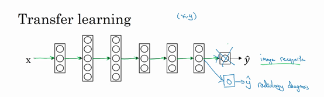

具體來說，在第一階段訓練過程中，當你進行圖像識別任務訓練時，你可以訓練神經網路的所有常用參數，所有的權重，所有的層，然後你就得到了一個能夠做圖像識別預測的網路。在訓練了這個神經網路後，要實現遷移學習，你現在要做的是，把數據集換成新的$(x,y)$對，現在這些變成放射科圖像，而$y$是你想要預測的診斷，你要做的是初始化最後一層的權重，讓我們稱之為$w^{[L]}$和$b^{[L]}$隨機初始化。

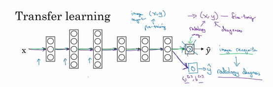

現在，我們在這個新數據集上重新訓練網路，在新的放射科數據集上訓練網路。要用放射科數據集重新訓練神經網路有幾種做法。你可能，如果你的放射科數據集很小，你可能只需要重新訓練最後一層的權重，就是$w^{[L]}$和$b^{[L]}$並保持其他參數不變。如果你有足夠多的數據，你可以重新訓練神經網路中剩下的所有層。經驗規則是，如果你有一個小數據集，就只訓練輸出層前的最後一層，或者也許是最後一兩層。但是如果你有很多數據，那麼也許你可以重新訓練網路中的所有參數。如果你重新訓練神經網路中的所有參數，那麼這個在圖像識別數據的初期訓練階段，有時稱為預訓練（**pre-training**），因為你在用圖像識別數據去預先初始化，或者預訓練神經網路的權重。然後，如果你以後更新所有權重，然後在放射科數據上訓練，有時這個過程叫微調（**fine tuning**）。如果你在深度學習文獻中看到預訓練和微調，你就知道它們說的是這個意思，預訓練和微調的權重來源於遷移學習。

在這個例子中你做的是，把圖像識別中學到的知識應用或遷移到放射科診斷上來，為什麼這樣做有效果呢？有很多低層次特徵，比如說邊緣檢測、曲線檢測、陽性對象檢測（**positive objects**），從非常大的圖像識別資料庫中習得這些能力可能有助於你的學習算法在放射科診斷中做得更好，算法學到了很多結構訊息，圖像形狀的訊息，其中一些知識可能會很有用，所以學會了圖像識別，它就可能學到足夠多的訊息，可以了解不同圖像的組成部分是怎樣的，學到線條、點、曲線這些知識，也許對象的一小部分，這些知識有可能幫助你的放射科診斷網路學習更快一些，或者需要更少的學習數據。

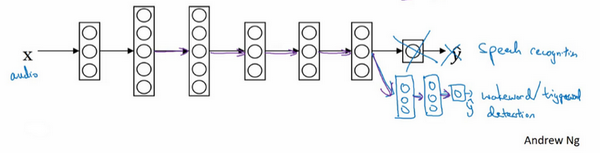

這裡是另一個例子，假設你已經訓練出一個語音識別系統，現在$x$是音訊或音訊片段輸入，而$y$是聽寫文本，所以你已經訓練了語音識別系統，讓它輸出聽寫文本。現在我們說你想搭建一個“喚醒詞”或“觸發詞”檢測系統，所謂喚醒詞或觸發詞就是我們說的一句話，可以喚醒家裡的語音控制設備，比如你說“**Alexa**”可以喚醒一個亞馬遜**Echo**設備,或用“**OK Google**”來喚醒**Google**設備，用"**Hey Siri**"來喚醒蘋果設備，用"你好百度"喚醒一個百度設備。要做到這點，你可能需要去掉神經網路的最後一層，然後加入新的輸出節點，但有時你可以不只加入一個新節點，或者甚至往你的神經網路加入幾個新層，然後把喚醒詞檢測問題的標籤$y$餵進去訓練。再次，這取決於你有多少數據，你可能只需要重新訓練網路的新層，也許你需要重新訓練神經網路中更多的層。

那麼遷移學習什麼時候是有意義的呢？遷移學習起作用的場合是，在遷移來源問題中你有很多數據，但遷移目標問題你沒有那麼多數據。例如，假設圖像識別任務中你有1百萬個樣本，所以這裡數據相當多。可以學習低層次特徵，可以在神經網路的前面幾層學到如何識別很多有用的特徵。但是對於放射科任務，也許你只有一百個樣本，所以你的放射學診斷問題數據很少，也許只有100次$X$射線掃描，所以你從圖像識別訓練中學到的很多知識可以遷移，並且真正幫你加強放射科識別任務的性能，即使你的放射科數據很少。

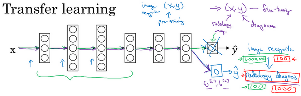

對於語音識別，也許你已經用10,000小時數據訓練過你的語言識別系統，所以你從這10,000小時數據學到了很多人類聲音的特徵，這數據量其實很多了。但對於觸發字檢測，也許你只有1小時數據，所以這數據太小，不能用來擬合很多參數。所以在這種情況下，預先學到很多人類聲音的特徵人類語言的組成部分等等知識，可以幫你建立一個很好的喚醒字檢測器，即使你的數據集相對較小。對於喚醒詞任務來說，至少數據集要小得多。

所以在這兩種情況下，你從數據量很多的問題遷移到數據量相對小的問題。然後反過來的話，遷移學習可能就沒有意義了。比如，你用100張圖訓練圖像識別系統，然後有100甚至1000張圖用於訓練放射科診斷系統，人們可能會想，為了提升放射科診斷的性能，假設你真的希望這個放射科診斷系統做得好，那麼用放射科圖像訓練可能比使用貓和狗的圖像更有價值，所以這裡（100甚至1000張圖用於訓練放射科診斷系統）的每個樣本價值比這裡（100張圖訓練圖像識別系統）要大得多，至少就建立性能良好的放射科系統而言是這樣。所以，如果你的放射科數據更多，那麼你這100張貓貓狗狗或者隨機物體的圖片肯定不會有太大幫助，因為來自貓狗識別任務中，每一張圖的價值肯定不如一張$X$射線掃描圖有價值，對於建立良好的放射科診斷系統而言是這樣。

所以，這是其中一個例子，說明遷移學習可能不會有害，但也別指望這麼做可以帶來有意義的增益。同樣，如果你用10小時數據訓練出一個語音識別系統。然後你實際上有10個小時甚至更多，比如說50個小時喚醒字檢測的數據，你知道遷移學習有可能會有幫助，也可能不會，也許把這10小時數據遷移學習不會有太大壞處，但是你也別指望會得到有意義的增益。

所以總結一下，什麼時候遷移學習是有意義的？如果你想從任務$A$學習並遷移一些知識到任務$B$，那麼當任務$A$和任務$B$都有同樣的輸入$x$時，遷移學習是有意義的。在第一個例子中，$A$和$B$的輸入都是圖像，在第二個例子中，兩者輸入都是音訊。當任務$A$的數據比任務$B$多得多時，遷移學習意義更大。所有這些假設的前提都是，你希望提高任務$B$的性能，因為任務$B$每個數據更有價值，對任務$B$來說通常任務$A$的數據量必須大得多，才有幫助，因為任務$A$裡單個樣本的價值沒有比任務$B$單個樣本價值大。然後如果你覺得任務$A$的低層次特徵，可以幫助任務$B$的學習，那遷移學習更有意義一些。

而在這兩個前面的例子中，也許學習圖像識別教給系統足夠多圖像相關的知識，讓它可以進行放射科診斷，也許學習語音識別教給系統足夠多人類語言訊息，能幫助你開發觸發字或喚醒字檢測器。

所以總結一下，遷移學習最有用的場合是，如果你嘗試最佳化任務B的性能，通常這個任務數據相對較少，例如，在放射科中你知道很難收集很多$X$射線掃描圖來搭建一個性能良好的放射科診斷系統，所以在這種情況下，你可能會找一個相關但不同的任務，如圖像識別，其中你可能用1百萬張圖片訓練過了，並從中學到很多低層次特徵，所以那也許能幫助網路在任務$B$在放射科任務上做得更好，儘管任務$B$沒有這麼多數據。遷移學習什麼時候是有意義的？它確實可以顯著提高你的學習任務的性能，但我有時候也見過有些場合使用遷移學習時，任務$A$實際上數據量比任務$B$要少，這種情況下增益可能不多。

好，這就是遷移學習，你從一個任務中學習，然後嘗試遷移到另一個不同任務中。從多個任務中學習還有另外一個版本，就是所謂的多任務學習，當你嘗試從多個任務中並行學習，而不是串列學習，在訓練了一個任務之後試圖遷移到另一個任務，所以在下一個影片中，讓我們來討論多任務學習。

### 2.8 多任務學習（Multi-task learning）

在遷移學習中，你的步驟是串列的，你從任務$A$裡學習只是然後遷移到任務$B$。在多任務學習中，你是同時開始學習的，試圖讓單個神經網路同時做幾件事情，然後希望這裡每個任務都能幫到其他所有任務。

我們來看一個例子，假設你在研發無人駕駛車輛，那麼你的無人駕駛車可能需要同時檢測不同的物體，比如檢測行人、車輛、停車標誌，還有交通燈各種其他東西。比如在左邊這個例子中，圖像裡有個停車標誌，然後圖像中有輛車，但沒有行人，也沒有交通燈。

如果這是輸入圖像$x^{(i)}$，那麼這裡不再是一個標籤 $y^{(i)}$，而是有4個標籤。在這個例子中，沒有行人，有一輛車，有一個停車標誌，沒有交通燈。然後如果你嘗試檢測其他物體，也許 $y^{(i)}$的維數會更高，現在我們就先用4個吧，所以 $y^{(i)}$是個4×1向量。如果你從整體來看這個訓練集標籤和以前類似，我們將訓練集的標籤水平堆疊起來，像這樣$y^{(1)}$一直到$y^{(m)}$：

$$
Y = \begin{bmatrix}
| & | & | & \ldots & | \\
y^{(1)} & y^{(2)} & y^{(3)} & \ldots & y^{(m)} \\
| & | & | & \ldots & | \\
\end{bmatrix}
$$

不過現在$y^{(i)}$是4×1向量，所以這些都是豎向的列向量，所以這個矩陣$Y$現在變成$4×m$矩陣。而之前，當$y$是單實數時，這就是$1×m$矩陣。

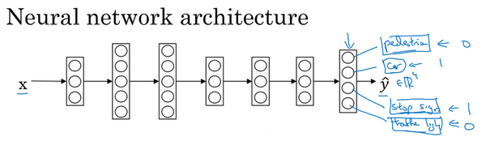

那麼你現在可以做的是訓練一個神經網路，來預測這些$y$值，你就得到這樣的神經網路，輸入$x$，現在輸出是一個四維向量$y$。請注意，這裡輸出我畫了四個節點，所以第一個節點就是我們想預測圖中有沒有行人，然後第二個輸出節點預測的是有沒有車，這裡預測有沒有停車標誌，這裡預測有沒有交通燈，所以這裡$\hat y$是四維的。

要訓練這個神經網路，你現在需要定義神經網路的損失函數，對於一個輸出$\hat y$，是個4維向量，對於整個訓練集的平均損失：

$\frac{1}{m}\sum_{i = 1}^{m}{\sum_{j = 1}^{4}{L(\hat y_{j}^{(i)},y_{j}^{(i)})}}$

$\sum_{j = 1}^{4}{L(\hat y_{j}^{(i)},y_{j}^{(i)})}$這些單個預測的損失，所以這就是對四個分量的求和，行人、車、停車標誌、交通燈，而這個標誌L指的是**logistic損失**，我們就這麼寫：

$L(\hat y_{j}^{(i)},y_{j}^{(i)}) = - y_{j}^{(i)}\log\hat y_{j}^{(i)} - (1 - y_{j}^{(i)})log(1 - \hat y_{j}^{(i)})$

整個訓練集的平均損失和之前分類貓的例子主要區別在於，現在你要對$j=1$到4求和，這與**softmax**回歸的主要區別在於，與**softmax**回歸不同，**softmax**將單個標籤分配給單個樣本。

而這張圖可以有很多不同的標籤，所以不是說每張圖都只是一張行人圖片，汽車圖片、停車標誌圖片或者交通燈圖片。你要知道每張照片是否有行人、或汽車、停車標誌或交通燈，多個物體可能同時出現在一張圖裡。實際上，在上一張幻燈片中，那張圖同時有車和停車標誌，但沒有行人和交通燈，所以你不是只給圖片一個標籤，而是需要遍歷不同類型，然後看看每個類型，那類物體有沒有出現在圖中。所以我就說在這個場合，一張圖可以有多個標籤。如果你訓練了一個神經網路，試圖最小化這個成本函數，你做的就是多任務學習。因為你現在做的是建立單個神經網路，觀察每張圖，然後解決四個問題，系統試圖告訴你，每張圖裡面有沒有這四個物體。另外你也可以訓練四個不同的神經網路，而不是訓練一個網路做四件事情。但神經網路一些早期特徵，在識別不同物體時都會用到，然後你發現，訓練一個神經網路做四件事情會比訓練四個完全獨立的神經網路分別做四件事性能要更好，這就是多任務學習的力量。

另一個細節，到目前為止，我是這麼描述算法的，好像每張圖都有全部標籤。事實證明，多任務學習也可以處理圖像只有部分物體被標記的情況。所以第一個訓練樣本，我們說有人，給數據貼標籤的人告訴你裡面有一個行人，沒有車，但他們沒有標記是否有停車標誌，或者是否有交通燈。也許第二個例子中，有行人，有車。但是，當標記人看著那張圖片時，他們沒有加標籤，沒有標記是否有停車標誌，是否有交通燈等等。也許有些樣本都有標記，但也許有些樣本他們只標記了有沒有車，然後還有一些是問號。

即使是這樣的數據集，你也可以在上面訓練算法，同時做四個任務，即使一些圖像只有一小部分標籤，其他是問號或者不管是什麼。然後你訓練算法的方式，即使這裡有些標籤是問號，或者沒有標記，這就是對$j$從1到4求和，你就只對帶0和1標籤的$j$值求和，所以當有問號的時候，你就在求和時忽略那個項，這樣只對有標籤的值求和，於是你就能利用這樣的數據集。

那麼多任務學習什麼時候有意義呢？當三件事為真時，它就是有意義的。

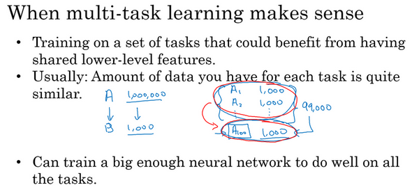

第一，如果你訓練的一組任務，可以共用低層次特徵。對於無人駕駛的例子，同時識別交通燈、汽車和行人是有道理的，這些物體有相似的特徵，也許能幫你識別停車標誌，因為這些都是道路上的特徵。

第二，這個準則沒有那麼絕對，所以不一定是對的。但我從很多成功的多任務學習案例中看到，如果每個任務的數據量很接近，你還記得遷移學習時，你從$A$任務學到知識然後遷移到$B$任務，所以如果任務$A$有1百萬個樣本，任務$B$只有1000個樣本，那麼你從這1百萬個樣本學到的知識，真的可以幫你增強對更小數據集任務$B$的訓練。那麼多任務學習又怎麼樣呢？在多任務學習中，你通常有更多任務而不僅僅是兩個，所以也許你有，以前我們有4個任務，但比如說你要完成100個任務，而你要做多任務學習，嘗試同時識別100種不同類型的物體。你可能會發現，每個任務大概有1000個樣本。所以如果你專注加強單個任務的性能，比如我們專注加強第100個任務的表現，我們用$A100$表示，如果你試圖單獨去做這個最後的任務，你只有1000個樣本去訓練這個任務，這是100項任務之一，而通過在其他99項任務的訓練，這些加起來可以一共有99000個樣本，這可能大幅提升算法性能，可以提供很多知識來增強這個任務的性能。不然對於任務$A100$，只有1000個樣本的訓練集，效果可能會很差。如果有對稱性，這其他99個任務，也許能提供一些數據或提供一些知識來幫到這100個任務中的每一個任務。所以第二點不是絕對正確的準則，但我通常會看的是如果你專注於單項任務，如果想要從多任務學習得到很大性能提升，那麼其他任務加起來必須要有比單個任務大得多的數據量。要滿足這個條件，其中一種方法是，比如右邊這個例子這樣，或者如果每個任務中的數據量很相近，但關鍵在於，如果對於單個任務你已經有1000個樣本了，那麼對於所有其他任務，你最好有超過1000個樣本，這樣其他任務的知識才能幫你改善這個任務的性能。

最後多任務學習往往在以下場合更有意義，當你可以訓練一個足夠大的神經網路，同時做好所有的工作，所以多任務學習的替代方法是為每個任務訓練一個單獨的神經網路。所以不是訓練單個神經網路同時處理行人、汽車、停車標誌和交通燈檢測。你可以訓練一個用於行人檢測的神經網路，一個用於汽車檢測的神經網路，一個用於停車標誌檢測的神經網路和一個用於交通信號燈檢測的神經網路。那麼研究員**Rich Carona**幾年前發現的是什麼呢？多任務學習會降低性能的唯一情況，和訓練單個神經網路相比性能更低的情況就是你的神經網路還不夠大。但如果你可以訓練一個足夠大的神經網路，那麼多任務學習肯定不會或者很少會降低性能，我們都希望它可以提升性能，比單獨訓練神經網路來單獨完成各個任務性能要更好。

所以這就是多任務學習，在實踐中，多任務學習的使用頻率要低於遷移學習。我看到很多遷移學習的應用，你需要解決一個問題，但你的訓練數據很少，所以你需要找一個數據很多的相關問題來預先學習，並將知識遷移到這個新問題上。但多任務學習比較少見，就是你需要同時處理很多任務，都要做好，你可以同時訓練所有這些任務，也許計算機視覺是一個例子。在物體檢測中，我們看到更多使用多任務學習的應用，其中一個神經網路嘗試檢測一大堆物體，比分別訓練不同的神經網路檢測物體更好。但我說，平均來說，目前遷移學習使用頻率更高，比多任務學習頻率要高，但兩者都可以成為你的強力工具。

所以總結一下，多任務學習能讓你訓練一個神經網路來執行許多任務，這可以給你更高的性能，比單獨完成各個任務更高的性能。但要注意，實際上遷移學習比多任務學習使用頻率更高。我看到很多任務都是，如果你想解決一個機器學習問題，但你的數據集相對較小，那麼遷移學習真的能幫到你，就是如果你找到一個相關問題，其中數據量要大得多，你就能以它為基礎訓練你的神經網路，然後遷移到這個數據量很少的任務上來。

今天我們學到了很多和遷移學習有關的問題，還有一些遷移學習和多任務學習的應用。但多任務學習，我覺得使用頻率比遷移學習要少得多，也許其中一個例外是計算機視覺，物體檢測。在那些任務中，人們經常訓練一個神經網路同時檢測很多不同物體，這比訓練單獨的神經網路來檢測視覺物體要更好。但平均而言，我認為即使遷移學習和多任務學習工作方式類似。實際上，我看到用遷移學習比多任務學習要更多，我覺得這是因為你很難找到那麼多相似且數據量對等的任務可以用單一神經網路訓練。再次，在計算機視覺領域，物體檢測這個例子是最顯著的例外情況。

所以這就是多任務學習，多任務學習和遷移學習都是你的工具包中的重要工具。最後，我想繼續討論端到端深度學習，所以我們來看下一個影片來討論端到端學習。

### 2.9 什麼是端到端的深度學習？（What is end-to-end deep learning?）

深度學習中最令人振奮的最新動態之一就是端到端深度學習的興起，那麼端到端學習到底是什麼呢？簡而言之，以前有一些數據處理系統或者學習系統，它們需要多個階段的處理。那麼端到端深度學習就是忽略所有這些不同的階段，用單個神經網路代替它。

我們來看一些例子，以語音識別為例，你的目標是輸入$x$，比如說一段音訊，然後把它映射到一個輸出$y$，就是這段音訊的聽寫文本。所以傳統上，語音識別需要很多階段的處理。首先你會提取一些特徵，一些手工設計的音訊特徵，也許你聽過**MFCC**，這種算法是用來從音訊中提取一組特定的人工設計的特徵。在提取出一些低層次特徵之後，你可以應用機器學習算法在音訊片段中找到音位，所以音位是聲音的基本單位，比如說“**Cat**”這個詞是三個音節構成的，**Cu-**、**Ah-**和**Tu-**，算法就把這三個音位提取出來，然後你將音位串在一起構成獨立的詞，然後你將詞串起來構成音訊片段的聽寫文本。

所以和這種有很多階段的流水線相比，端到端深度學習做的是，你訓練一個巨大的神經網路，輸入就是一段音訊，輸出直接是聽寫文本。**AI**的其中一個有趣的社會學效應是，隨著端到端深度學習系統表現開始更好，有一些花了大量時間或者整個事業生涯設計出流水線各個步驟的研究員，還有其他領域的研究員，不只是語言識別領域的，也許是計算機視覺，還有其他領域，他們花了大量的時間，寫了很多論文，有些甚至整個職業生涯的一大部分都投入到開發這個流水線的功能或者其他構件上去了。而端到端深度學習就只需要把訓練集拿過來，直接學到了$x$和$y$之間的函數映射，直接繞過了其中很多步驟。對一些學科裡的人來說，這點相當難以接受，他們無法接受這樣構建**AI**系統，因為有些情況，端到端方法完全取代了舊系統，某些投入了多年研究的中間組件也許已經過時了。

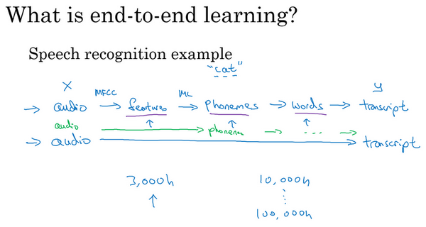

事實證明，端到端深度學習的挑戰之一是，你可能需要大量數據才能讓系統表現良好，比如，你只有3000小時數據去訓練你的語音識別系統，那麼傳統的流水線效果真的很好。但當你擁有非常大的數據集時，比如10,000小時數據或者100,000小時數據，這樣端到端方法突然開始很厲害了。所以當你的數據集較小的時候，傳統流水線方法其實效果也不錯，通常做得更好。你需要大數據集才能讓端到端方法真正發出耀眼光芒。如果你的數據量適中，那麼也可以用中間件方法，你可能輸入還是音訊，然後繞過特徵提取，直接嘗試從神經網路輸出音位，然後也可以在其他階段用，所以這是往端到端學習邁出的一小步，但還沒有到那裡。

這張圖上是一個研究員做的人臉識別門禁，是百度的林元慶研究員做的。這是一個相機，它會拍下接近門禁的人，如果它認出了那個人，門禁系統就自動打開，讓他通過，所以你不需要刷一個**RFID**工卡就能進入這個設施。系統部署在越來越多的中國辦公室，希望在其他國家也可以部署更多，你可以接近門禁，如果它認出你的臉，它就直接讓你通過，你不需要帶**RFID**工卡。

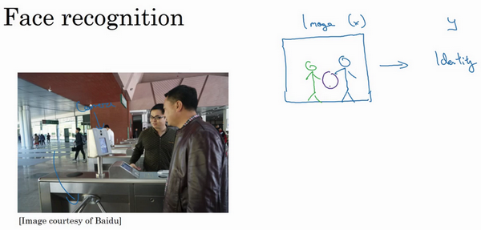

那麼，怎麼搭建這樣的系統呢？你可以做的第一件事是，看看相機拍到的照片，對吧？我想我畫的不太好，但也許這是相機照片，你知道，有人接近門禁了，所以這可能是相機拍到的圖像$x$。有件事你可以做，就是嘗試直接學習圖像$x$到人物$y$身份的函數映射，事實證明這不是最好的方法。其中一個問題是，人可以從很多不同的角度接近門禁，他們可能在綠色位置，可能在藍色位置。有時他們更靠近相機，所以他們看起來更大，有時候他們非常接近相機，那照片中臉就很大了。在實際研製這些門禁系統時，他不是直接將原始照片餵到一個神經網路，試圖找出一個人的身份。

相反，迄今為止最好的方法似乎是一個多步方法，首先，你運行一個軟體來檢測人臉，所以第一個檢測器找的是人臉位置，檢測到人臉，然後放大圖像的那部分，並裁剪圖像，使人臉居中顯示，然後就是這裡紅線框起來的照片，再餵到神經網路裡，讓網路去學習，或估計那人的身份。

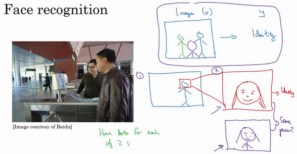

研究人員發現，比起一步到位，一步學習，把這個問題分解成兩個更簡單的步驟。首先，是弄清楚臉在哪裡。第二步是看著臉，弄清楚這是誰。這第二種方法讓學習算法，或者說兩個學習算法分別解決兩個更簡單的任務，並在整體上得到更好的表現。

順便說一句，如果你想知道第二步實際是怎麼工作的，我這裡其實省略了很多。訓練第二步的方式，訓練網路的方式就是輸入兩張圖片，然後你的網路做的就是將輸入的兩張圖比較一下，判斷是否是同一個人。比如你記錄了10,000個員工**ID**，你可以把紅色框起來的圖像快速比較……也許是全部10,000個員工記錄在案的**ID**，看看這張紅線內的照片，是不是那10000個員工之一，來判斷是否應該允許其進入這個設施或者進入這個辦公樓。這是一個門禁系統，允許員工進入工作場所的門禁。

為什麼兩步法更好呢？實際上有兩個原因。一是，你解決的兩個問題，每個問題實際上要簡單得多。但第二，兩個子任務的訓練數據都很多。具體來說，有很多數據可以用於人臉識別訓練，對於這裡的任務1來說，任務就是觀察一張圖，找出人臉所在的位置，把人臉圖像框出來，所以有很多數據，有很多標籤數據$(x,y)$，其中$x$是圖片，$y$是表示人臉的位置，你可以建立一個神經網路，可以很好地處理任務1。然後任務2，也有很多數據可用，今天，業界領先的公司擁有，比如說數百萬張人臉照片，所以輸入一張裁剪得很緊湊的照片，比如這張紅色照片，下面這個，今天業界領先的人臉識別團隊有至少數億的圖像，他們可以用來觀察兩張圖片，並試圖判斷照片裡人的身份，確定是否同一個人，所以任務2還有很多數據。相比之下，如果你想一步到位，這樣$(x,y)$的數據對就少得多，其中$x$是門禁系統拍攝的圖像，$y$是那人的身份，因為你沒有足夠多的數據去解決這個端到端學習問題，但你卻有足夠多的數據來解決子問題1和子問題2。

實際上，把這個分成兩個子問題，比純粹的端到端深度學習方法，達到更好的表現。不過如果你有足夠多的數據來做端到端學習，也許端到端方法效果更好。但在今天的實踐中，並不是最好的方法。

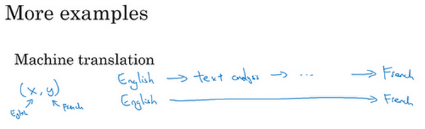

我們再來看幾個例子，比如機器翻譯。傳統上，機器翻譯系統也有一個很複雜的流水線，比如英語機翻得到文本，然後做文本分析，基本上要從文本中提取一些特徵之類的，經過很多步驟，你最後會將英文文本翻譯成法文。因為對於機器翻譯來說的確有很多(英文,法文)的數據對，端到端深度學習在機器翻譯領域非常好用，那是因為在今天可以收集$x-y$對的大數據集，就是英文句子和對應的法語翻譯。所以在這個例子中，端到端深度學習效果很好。

最後一個例子，比如說你希望觀察一個孩子手部的X光照片，並估計一個孩子的年齡。你知道，當我第一次聽到這個問題的時候，我以為這是一個非常酷的犯罪現場調查任務，你可能悲劇的發現了一個孩子的骨架，你想弄清楚孩子在生時是怎麼樣的。事實證明，這個問題的典型應用，從X射線圖估計孩子的年齡，是我想太多了，沒有我想像的犯罪現場調查腦洞那麼大，結果這是兒科醫生用來判斷一個孩子的發育是否正常。

處理這個例子的一個非端到端方法，就是照一張圖，然後分割出每一塊骨頭，所以就是分辨出那段骨頭應該在哪裡，那段骨頭在哪裡，那段骨頭在哪裡，等等。然後，知道不同骨骼的長度，你可以去查表，查到兒童手中骨頭的平均長度，然後用它來估計孩子的年齡，所以這種方法實際上很好。

相比之下，如果你直接從圖像去判斷孩子的年齡，那麼你需要大量的數據去直接訓練。據我所知，這種做法今天還是不行的，因為沒有足夠的數據來用端到端的方式來訓練這個任務。

你可以想像一下如何將這個問題分解成兩個步驟，第一步是一個比較簡單的問題，也許你不需要那麼多數據，也許你不需要許多X射線圖像來切分骨骼。而任務二，收集兒童手部的骨頭長度的統計數據，你不需要太多數據也能做出相當準確的估計，所以這個多步方法看起來很有希望，也許比端對端方法更有希望，至少直到你能獲得更多端到端學習的數據之前。

所以端到端深度學習系統是可行的，它表現可以很好，也可以簡化系統架構，讓你不需要搭建那麼多手工設計的單獨組件，但它也不是靈丹妙藥，並不是每次都能成功。在下一個影片中，我想與你分享一個更系統的描述，什麼時候你應該使用或者不應該使用端到端的深度學習，以及如何組裝這些複雜的機器學習系統。

### 2.10 是否要使用端到端的深度學習？（Whether to use end-to-end learning?）

假設你正在搭建一個機器學習系統，你要決定是否使用端對端方法，我們來看看端到端深度學習的一些優缺點，這樣你就可以根據一些準則，判斷你的應用程式是否有希望使用端到端方法。

這裡是應用端到端學習的一些好處，首先端到端學習真的只是讓數據說話。所以如果你有足夠多的$(x,y)$數據，那麼不管從$x$到$y$最適合的函數映射是什麼，如果你訓練一個足夠大的神經網路，希望這個神經網路能自己搞清楚，而使用純機器學習方法，直接從$x$到$y$輸進去訓練的神經網路，可能更能夠捕獲數據中的任何統計訊息，而不是被迫引入人類的成見。

例如，在語音識別領域，早期的識別系統有這個音位概念，就是基本的聲音單元，如cat單詞的“cat”的Cu-、Ah-和Tu-，我覺得這個音位是人類語言學家生造出來的，我實際上認為音位其實是語音學家的幻想，用音位描述語言也還算合理。但是不要強迫你的學習算法以音位為單位思考，這點有時沒那麼明顯。如果你讓你的學習算法學習它想學習的任意表示方式，而不是強迫你的學習算法使用音位作為表示方式，那麼其整體表現可能會更好。

端到端深度學習的第二個好處就是這樣，所需手工設計的組件更少，所以這也許能夠簡化你的設計工作流程，你不需要花太多時間去手工設計功能，手工設計這些中間表示方式。

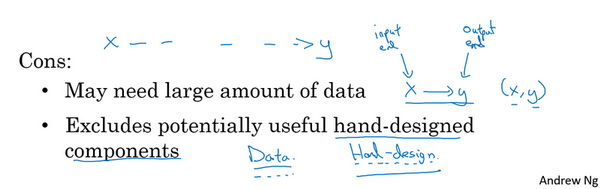

那麼缺點呢？這裡有一些缺點，首先，它可能需要大量的數據。要直接學到這個$x$到$y$的映射，你可能需要大量$(x,y)$數據。我們在以前的影片裡看過一個例子，其中你可以收集大量子任務數據，比如人臉識別，我們可以收集很多數據用來分辨圖像中的人臉，當你找到一張臉後，也可以找得到很多人臉識別數據。但是對於整個端到端任務，可能只有更少的數據可用。所以$x$這是端到端學習的輸入端，$y$是輸出端，所以你需要很多這樣的$(x,y)$數據，在輸入端和輸出端都有數據，這樣可以訓練這些系統。這就是為什麼我們稱之為端到端學習，因為你直接學習出從系統的一端到系統的另一端。

另一個缺點是，它排除了可能有用的手工設計組件。機器學習研究人員一般都很鄙視手工設計的東西，但如果你沒有很多數據，你的學習算法就沒辦法從很小的訓練集數據中獲得洞察力。所以手工設計組件在這種情況，可能是把人類知識直接注入算法的途徑，這總不是一件壞事。我覺得學習算法有兩個主要的知識來源，一個是數據，另一個是你手工設計的任何東西，可能是組件，功能，或者其他東西。所以當你有大量數據時，手工設計的東西就不太重要了，但是當你沒有太多的數據時，構造一個精心設計的系統，實際上可以將人類對這個問題的很多認識直接注入到問題裡，進入算法裡應該挺有幫助的。

所以端到端深度學習的弊端之一是它把可能有用的人工設計的組件排除在外了，精心設計的人工組件可能非常有用，但它們也有可能真的傷害到你的算法表現。例如，強制你的算法以音位為單位思考，也許讓算法自己找到更好的表示方法更好。所以這是一把雙刃劍，可能有壞處，可能有好處，但往往好處更多，手工設計的組件往往在訓練集更小的時候幫助更大。

如果你在構建一個新的機器學習系統，而你在嘗試決定是否使用端到端深度學習，我認為關鍵的問題是，你有足夠的數據能夠直接學到從$x$映射到$y$足夠複雜的函數嗎？我還沒有正式定義過這個詞“必要複雜度（**complexity needed**）”。但直覺上，如果你想從$x$到$y$的數據學習出一個函數，就是看著這樣的圖像識別出圖像中所有骨頭的位置，那麼也許這像是識別圖中骨頭這樣相對簡單的問題，也許系統不需要那麼多數據來學會處理這個任務。或給出一張人物照片，也許在圖中把人臉找出來不是什麼難事，所以你也許不需要太多數據去找到人臉，或者至少你可以找到足夠數據去解決這個問題。相對來說，把手的X射線照片直接映射到孩子的年齡，直接去找這種函數，直覺上似乎是更為複雜的問題。如果你用純端到端方法，需要很多數據去學習。

影片最後我講一個更複雜的例子，你可能知道我一直在花時間幫忙主攻無人駕駛技術的公司**drive.ai**，無人駕駛技術的發展其實讓我相當激動，你怎麼造出一輛自己能行駛的車呢？好，這裡你可以做一件事，這不是端到端的深度學習方法，你可以把你車前方的雷達、雷射雷達或者其他感測器的讀數看成是輸入圖像。但是為了說明起來簡單，我們就說拍一張車前方或者周圍的照片，然後駕駛要安全的話，你必須能檢測到附近的車，你也需要檢測到行人，你需要檢測其他的東西，當然，我們這裡提供的是高度簡化的例子。

弄清楚其他車和形如的位置之後，你就需要計劃你自己的路線。所以換句話說，當你看到其他車子在哪，行人在哪裡，你需要決定如何擺方向盤在接下來的幾秒鐘內引導車子的路徑。如果你決定了要走特定的路徑，也許這是道路的俯視圖，這是你的車，也許你決定了要走那條路線，這是一條路線，那麼你就需要擺動你的方向盤到合適的角度，還要發出合適的加速和煞車指令。所以從感測器或圖像輸入到檢測行人和車輛，深度學習可以做得很好，但一旦知道其他車輛和行人的位置或者動向，選擇一條車要走的路，這通常用的不是深度學習，而是用所謂的運動規劃軟體完成的。如果你學過機器人課程，你一定知道運動規劃，然後決定了你的車子要走的路徑之後。還會有一些其他算法，我們說這是一個控制算法，可以產生精確的決策確定方向盤應該精確地轉多少度，油門或剎車上應該用多少力。

所以這個例子就表明了，如果你想使用機器學習或者深度學習來學習某些單獨的組件，那麼當你應用監督學習時，你應該仔細選擇要學習的$x$到$y$映射類型，這取決於那些任務你可以收集數據。相比之下，談論純端到端深度學習方法是很激動人心的，你輸入圖像，直接得出方向盤轉角，但是就目前能收集到的數據而言，還有我們今天能夠用神經網路學習的數據類型而言，這實際上不是最有希望的方法，或者說這個方法並不是團隊想出的最好用的方法。而我認為這種純粹的端到端深度學習方法，其實前景不如這樣更複雜的多步方法。因為目前能收集到的數據，還有我們現在訓練神經網路的能力是有局限的。

這就是端到端的深度學習，有時候效果拔群。但你也要注意應該在什麼時候使用端到端深度學習。最後，謝謝你，恭喜你堅持到現在，如果你學完了上週的影片和本週的影片，那麼我認為你已經變得更聰明，更具戰略性，並能夠做出更好的優先分配任務的決策，更好地推動你的機器學習項目，也許比很多機器學習工程師，還有和我在矽谷看到的研究人員都強。所以恭喜你學到這裡，我希望你能看看本週的作業，應該能再給你一個機會去實踐這些理念，並確保你掌握它們。
