第四門課 卷積神經網路（Convolutional Neural Networks）
======================================================

第一週 卷積神經網路（Foundations of Convolutional Neural Networks）
------------------------------------------------------------------------
[TOC]
### 1.1 計算機視覺（Computer vision）

歡迎參加這次的卷積神經網路課程，計算機視覺是一個飛速發展的一個領域，這多虧了深度學習。深度學習與計算機視覺可以幫助汽車，查明周圍的行人和汽車，並幫助汽車避開它們。還使得人臉識別技術變得更加效率和精準，你們即將能夠體驗到或早已體驗過僅僅通過刷臉就能解鎖手機或者門鎖。當你解鎖了手機，我猜手機上一定有很多分享圖片的應用。在上面，你能看到美食，酒店或美麗風景的圖片。有些公司在這些應用上使用了深度學習技術來向你展示最為生動美麗以及與你最為相關的圖片。機器學習甚至還催生了新的藝術類型。深度學習之所以讓我興奮有下面兩個原因，我想你們也是這麼想的。

第一，計算機視覺的高速發展標誌著新型應用產生的可能，這是幾年前，人們所不敢想像的。透過學習使用這些工具，你也許能夠創造出新的產品和應用。

其次，即使到頭來你未能在計算機視覺上有所建樹，但我發現，人們對於計算機視覺的研究是如此富有想像力和創造力，由此衍生出新的神經網路結構與算法，這實際上啟發人們去創造出計算機視覺與其他領域的交叉成果。舉個例子，之前我在做語音識別的時候，我經常從計算機視覺領域中尋找靈感，
並將其應用於我的文獻當中。所以即使你在計算機視覺方面沒有做出成果，我也希望你也可以將所學的知識應用到其他算法和結構。就介紹到這裡，讓我們開始學習吧。

這是我們本節課將要學習的一些問題，你應該早就聽說過圖片分類，或者說圖片識別。比如給出這張64×64的圖片，讓計算機去分辨出這是一隻貓。

還有一個例子，在計算機視覺中有個問題叫做目標檢測，比如在一個無人駕駛項目中，你不一定非得識別出圖片中的物體是車輛，但你需要計算出其他車輛的位置，以確保自己能夠避開它們。所以在目標檢測項目中，首先需要計算出圖中有哪些物體，比如汽車，還有圖片中的其他東西，再將它們模擬成一個個盒子，或用一些其他的技術識別出它們在圖片中的位置。注意在這個例子中，在一張圖片中同時有多個車輛，每輛車相對與你來說都有一個確切的距離。

還有一個更有趣的例子，就是神經網路實現的圖片風格遷移，比如說你有一張圖片，但你想將這張圖片轉換為另外一種風格。所以圖片風格遷移，就是你有一張滿意的圖片和一張風格圖片，實際上右邊這幅畫是畢加索的畫作，而你可以利用神經網路將它們融合到一起，描繪出一張新的圖片。它的整體輪廓來自於左邊，卻是右邊的風格，最後生成下面這張圖片。這種神奇的算法創造出了新的藝術風格，所以在這門課程中，你也能通過學習做到這樣的事情。

但在應用計算機視覺時要面臨一個挑戰，就是數據的輸入可能會非常大。舉個例子，在過去的課程中，你們一般操作的都是64×64的小圖片，實際上，它的數據量是64×64×3，因為每張圖片都有3個顏色通道。如果計算一下的話，可得知數據量為12288，所以我們的特徵向量$x$維度為12288。這其實還好，因為64×64真的是很小的一張圖片。

如果你要操作更大的圖片，比如一張1000×1000的圖片，它足有1兆那麼大，但是特徵向量的維度達到了1000×1000×3，因為有3個**RGB**通道，所以數字將會是300萬。如果你在尺寸很小的螢幕上觀察，可能察覺不出上面的圖片只有64×64那麼大，而下面一張是1000×1000的大圖。

如果你要輸入300萬的數據量，這就意味著，特徵向量$x$的維度高達300萬。所以在第一隱藏層中，你也許會有1000個隱藏單元，而所有的權值組成了矩陣 $W^{[1]}$。如果你使用了標準的全連接網路，就像我們在第一門和第二門的課程裡說的，這個矩陣的大小將會是1000×300萬。因為現在$x$的維度為$3m$，$3m$通常用來表示300萬。這意味著矩陣$W^{[1]}$會有30億個參數，這是個非常巨大的數字。在參數如此大量的情況下，難以獲得足夠的數據來防止神經網路發生過擬合和競爭需求，要處理包含30億參數的神經網路，巨大的記憶體需求讓人不太能接受。

但對於計算機視覺應用來說，你肯定不想它只處理小圖片，你希望它同時也要能處理大圖。為此，你需要進行卷積計算，它是卷積神經網路中非常重要的一塊。下節課中，我會為你介紹如何進行這種運算，我將用邊緣檢測的例子來向你說明卷積的含義。

### 1.2 邊緣檢測範例（Edge detection example）

卷積運算是卷積神經網路最基本的組成部分，使用邊緣檢測作為入門樣例。在這個影片中，你會看到卷積是如何進行運算的。

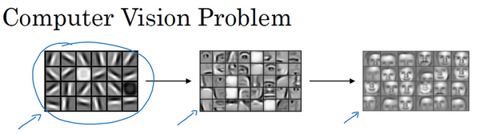

在之前的影片中，我說過神經網路的前幾層是如何檢測邊緣的，然後，後面的層有可能檢測到物體的部分區域，更靠後的一些層可能檢測到完整的物體，這個例子中就是人臉。在這個影片中，你會看到如何在一張圖片中進行邊緣檢測。

讓我們舉個例子，給了這樣一張圖片，讓電腦去搞清楚這張照片裡有什麼物體，你可能做的第一件事是檢測圖片中的垂直邊緣。比如說，在這張圖片中的欄杆就對應垂直線，與此同時，這些行人的輪廓線某種程度上也是垂線，這些線是垂直邊緣檢測器的輸出。同樣，你可能也想檢測水平邊緣，比如說這些欄杆就是很明顯的水平線，它們也能被檢測到，結果在這。所以如何在圖像中檢測這些邊緣？

看一個例子，這是一個6×6的灰度圖像。因為是灰度圖像，所以它是6×6×1的矩陣，而不是6×6×3的，因為沒有**RGB**三通道。為了檢測圖像中的垂直邊緣，你可以構造一個3×3矩陣。在共用習慣中，在卷積神經網路的術語中，它被稱為過濾器。我要構造一個3×3的過濾器，像這樣$\begin{bmatrix}1 & 0 & -1\\ 1 & 0 & -1\\ 1 & 0 & -1\end{bmatrix}$。在論文它有時候會被稱為核，而不是過濾器，但在這個影片中，我將使用過濾器這個術語。對這個6×6的圖像進行卷積運算，卷積運算用“$*$”來表示，用3×3的過濾器對其進行卷積。

關於符號表示，有一些問題，在數學中“$*$”就是卷積的標準標誌，但是在**Python**中，這個標識常常被用來表示乘法或者元素乘法。所以這個“$*$”有多層含義，它是一個重載符號，在這個影片中，當“$*$”表示卷積的時候我會特別說明。

這個卷積運算的輸出將會是一個4×4的矩陣，你可以將它看成一個4×4的圖像。下面來說明是如何計算得到這個4×4矩陣的。為了計算第一個元素，在4×4左上角的那個元素，使用3×3的過濾器，將其覆蓋在輸入圖像，如下圖所示。然後進行元素乘法（**element-wise products**）運算，所以$\begin{bmatrix} 3 \times 1 & 0 \times 0 & 1 \times \left(1 \right) \\ 1 \times 1 & 5 \times 0 & 8 \times \left( - 1 \right) \\ 2 \times1 & 7 \times 0 & 2 \times \left( - 1 \right) \\ \end{bmatrix} = \begin{bmatrix}3 & 0 & - 1 \\ 1 & 0 & - 8 \\ 2 & 0 & - 2 \\\end{bmatrix}$，然後將該矩陣每個元素相加得到最左上角的元素，即$3+1+2+0+0 +0+(-1)+(-8) +(-2)=-5$。

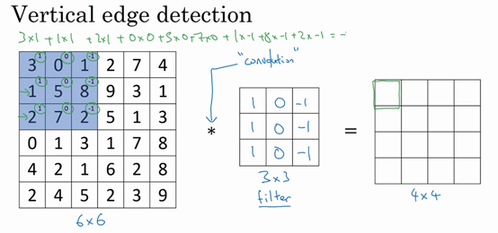

把這9個數加起來得到-5，當然，你可以把這9個數按任何順序相加，我只是先寫了第一列，然後第二列，第三列。

接下來，為了弄明白第二個元素是什麼，你要把藍色的方塊，向右移動一步，像這樣，把這些綠色的標記去掉：

繼續做同樣的元素乘法，然後加起來，所以是 $0×1+5×1+7×1+1×0+8×0+2×0+2×(-1)+ 9×(-1)+5×(-1)=-4 $。

接下來也是一樣，繼續右移一步，把9個數的點積加起來得到0。

繼續移得到8，驗證一下：$2×1+9×1+5×1+7×0+3×0+1×0+4×(-1)+ 1×(-1)+ 3×(-1)=8$。

接下來為了得到下一行的元素，現在把藍色塊下移，現在藍色塊在這個位置：

重複進行元素乘法，然後加起來。通過這樣做得到-10。再將其右移得到-2，接著是2，3。以此類推，這樣計算完矩陣中的其他元素。

為了說得更清楚一點，這個-16是通過底部右下角的3×3區域得到的。

因此6×6矩陣和3×3矩陣進行卷積運算得到4×4矩陣。這些圖片和過濾器是不同維度的矩陣，但左邊矩陣容易被理解為一張圖片，中間的這個被理解為過濾器，右邊的圖片我們可以理解為另一張圖片。這個就是垂直邊緣檢測器，下一頁中你就會明白。

在往下講之前，多說一句，如果你要使用程式語言實現這個運算，不同的程式語言有不同的函數，而不是用“$*$”來表示卷積。所以在編程練習中，你會使用一個叫**conv_forward**的函數。如果在**tensorflow**下，這個函數叫**tf.conv2d**。在其他深度學習框架中，在後面的課程中，你將會看到**Keras**這個框架，在這個框架下用**Conv2D**實現卷積運算。所有的程式框架都有一些函數來實現卷積運算。

為什麼這個可以做垂直邊緣檢測呢？讓我們來看另外一個例子。為了講清楚，我會用一個簡單的例子。這是一個簡單的6×6圖像，左邊的一半是10，右邊一般是0。如果你把它當成一個圖片，左邊那部分看起來是白色的，像素值10是比較亮的像素值，右邊像素值比較暗，我使用灰色來表示0，儘管它也可以被畫成黑的。圖片裡，有一個特別明顯的垂直邊緣在圖像中間，這條垂直線是從黑到白的過渡線，或者從白色到深色。

所以，當你用一個3×3過濾器進行卷積運算的時候，這個3×3的過濾器可視化為下面這個樣子，在左邊有明亮的像素，然後有一個過渡，0在中間，然後右邊是深色的。卷積運算後，你得到的是右邊的矩陣。如果你願意，可以通過數學運算去驗證。舉例來說，最左上角的元素0，就是由這個3×3塊（綠色方框標記）經過元素乘積運算再求和得到的，$10×1+10×1+10×1+10×0+10×0+10×0+10×(-1)+10×(-1)+10×(-1)=0$

。相反這個30是由這個（紅色方框標記）得到的，

$10×1+10×1+10×1+10×0+10×0+10×0+0×(-1)+0×(-1)+ 0×(-1)=30$。

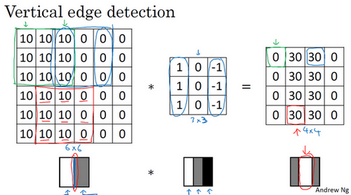

如果把最右邊的矩陣當成圖像，它是這個樣子。在中間有段亮一點的區域，對應檢查到這個6×6圖像中間的垂直邊緣。這裡的維數似乎有點不正確，檢測到的邊緣太粗了。因為在這個例子中，圖片太小了。如果你用一個1000×1000的圖像，而不是6×6的圖片，你會發現其會很好地檢測出圖像中的垂直邊緣。在這個例子中，在輸出圖像中間的亮處，表示在圖像中間有一個特別明顯的垂直邊緣。從垂直邊緣檢測中可以得到的啟發是，因為我們使用3×3的矩陣（過濾器），所以垂直邊緣是一個3×3的區域，左邊是明亮的像素，中間的並不需要考慮，右邊是深色像素。在這個6×6圖像的中間部分，明亮的像素在左邊，深色的像素在右邊，就被視為一個垂直邊緣，卷積運算提供了一個方便的方法來發現圖像中的垂直邊緣。

所以你已經了解卷積是怎麼工作的，在下一個影片中，你將會看到如何使用卷積運算作為卷積神經網路的基本模組的。

### 1.3 更多邊緣檢測內容（More edge detection）

你已經見識到用卷積運算實現垂直邊緣檢測，在本影片中，你將學習如何區分正邊和負邊，這實際就是由亮到暗與由暗到亮的區別，也就是邊緣的過渡。你還能了解到其他類型的邊緣檢測以及如何去實現這些算法，而不要總想著去自己編寫一個邊緣檢測程序，讓我們開始吧。

還是上一個影片中的例子，這張6×6的圖片，左邊較亮，而右邊較暗，將它與垂直邊緣檢測濾波器進行卷積，檢測結果就顯示在了右邊這幅圖的中間部分。

現在這幅圖有什麼變化呢？它的顏色被翻轉了，變成了左邊比較暗，而右邊比較亮。現在亮度為10的點跑到了右邊，為0的點則跑到了左邊。如果你用它與相同的過濾器進行卷積，最後得到的圖中間會是-30，而不是30。如果你將矩陣轉換為圖片，就會是該矩陣下面圖片的樣子。現在中間的過渡部分被翻轉了，之前的30翻轉成了-30，表明是由暗向亮過渡，而不是由亮向暗過渡。

如果你不在乎這兩者的區別，你可以取出矩陣的絕對值。但這個特定的過濾器確實可以為我們區分這兩種明暗變化的區別。

再來看看更多的邊緣檢測的例子，我們已經見過這個3×3的過濾器，它可以檢測出垂直的邊緣。所以，看到右邊這個過濾器，我想你應該猜出來了，它能讓你檢測出水平的邊緣。提醒一下，一個垂直邊緣過濾器是一個3×3的區域，它的左邊相對較亮，而右邊相對較暗。相似的，右邊這個水平邊緣過濾器也是一個3×3的區域，它的上面相對較亮，而下方相對較暗。

這裡還有個更複雜的例子，左上方和右下方都是亮度為10的點。如果你將它繪成圖片，右上角是比較暗的地方，這邊都是亮度為0的點，我把這些比較暗的區域都加上陰影。而左上方和右下方都會相對較亮。如果你用這幅圖與水平邊緣過濾器卷積，就會得到右邊這個矩陣。

再舉個例子，這裡的30（右邊矩陣中綠色方框標記元素）代表了左邊這塊3×3的區域（左邊矩陣綠色方框標記部分），這塊區域確實是上面比較亮，而下面比較暗的，所以它在這裡發現了一條正邊緣。而這裡的-30（右邊矩陣中紫色方框標記元素）又代表了左邊另一塊區域（左邊矩陣紫色方框標記部分），這塊區域確實是底部比較亮，而上面則比較暗，所以在這裡它是一條負邊。

再次強調，我們現在所使用的都是相對很小的圖片，僅有6×6。但這些中間的數值，比如說這個10（右邊矩陣中黃色方框標記元素）代表的是左邊這塊區域（左邊6×6矩陣中黃色方框標記的部分）。這塊區域左邊兩列是正邊，右邊一列是負邊，正邊和負邊的值加在一起得到了一個中間值。但假如這個一個非常大的1000×1000的類似這樣棋盤風格的大圖，就不會出現這些亮度為10的過渡帶了，因為圖片尺寸很大，這些中間值就會變得非常小。

總而言之，透過使用不同的過濾器，你可以找出垂直的或是水平的邊緣。但事實上，對於這個3×3的過濾器來說，我們使用了其中的一種數字組合。

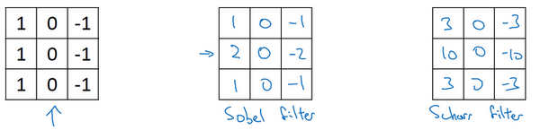

但在歷史上，在計算機視覺的文獻中，曾公平地爭論過怎樣的數字組合才是最好的，所以你還可以使用這種：$\begin{bmatrix}1 & 0 & - 1 \\ 2 & 0 & - 2 \\ 1 & 0 & - 1 \\\end{bmatrix}$，叫做**Sobel**的過濾器，它的優點在於增加了中間一行元素的權重，這使得結果的強健性會更高一些。

但計算機視覺的研究者們也會經常使用其他的數字組合，比如這種：$\begin{bmatrix} 3& 0 & - 3 \\ 10 & 0 & - 10 \\ 3 & 0 & - 3 \\\end{bmatrix}$，這叫做Scharr過濾器，它有著和之前完全不同的特性，實際上也是一種垂直邊緣檢測，如果你將其翻轉90度，你就能得到對應水平邊緣檢測。

隨著深度學習的發展，我們學習的其中一件事就是當你真正想去檢測出複雜圖像的邊緣，你不一定要去使用那些研究者們所選擇的這九個數字，但你可以從中獲益匪淺。把這矩陣中的9個數字當成9個參數，並且在之後你可以學習使用反向傳播算法，其目標就是去理解這9個參數。

當你得到左邊這個6×6的圖片，將其與這個3×3的過濾器進行卷積，將會得到一個出色的邊緣檢測。這就是你在下節影片中將會看到的，把這9個數字當成參數的過濾器，通過反向傳播，你可以學習這種$\begin{bmatrix}1 & 0 & - 1 \\ 1 & 0 & - 1 \\ 1 & 0 & - 1 \\\end{bmatrix}$的過濾器，或者**Sobel**過濾器和**Scharr**過濾器。還有另一種過濾器，這種過濾器對於數據的捕捉能力甚至可以勝過任何之前這些手寫的過濾器。相比這種單純的垂直邊緣和水平邊緣，它可以檢測出45°或70°或73°，甚至是任何角度的邊緣。所以將矩陣的所有數字都設置為參數，通過數據回饋，讓神經網路自動去學習它們，我們會發現神經網路可以學習一些低級的特徵，例如這些邊緣的特徵。儘管比起那些研究者們，我們要更費勁一些，但確實可以動手寫出這些東西。不過構成這些計算的基礎依然是卷積運算，使得反向傳播算法能夠讓神經網路學習任何它所需要的3×3的過濾器，並在整幅圖片上去應用它。這裡，這裡，還有這裡（左邊矩陣藍色方框標記部分），去輸出這些，任何它所檢測到的特徵，不管是垂直的邊緣，水平的邊緣，還有其他奇怪角度的邊緣，甚至是其它的連名字都沒有的過濾器。

所以這種將這9個數字當成參數的思想，已經成為計算機視覺中最為有效的思想之一。在接下來的課程中，也就是下個星期，我們將詳細去探討如何使用反向傳播去讓神經網路學習這9個數字。但在此之前，我們需要先討論一些其它細節，比如一些基礎的卷積運算的變數。在下面兩節影片中，我將與你們討論如何去使用**padding**，以及卷積各種不同的發展，這兩節內容將會是卷積神經網路中卷積模組的重要組成部分，所以我們下節影片再見。

### 1.4 Padding

為了構建深度神經網路，你需要學會使用的一個基本的卷積操作就是**padding**，讓我們來看看它是如何工作的。

我們在之前影片中看到，如果你用一個3×3的過濾器卷積一個6×6的圖像，你最後會得到一個4×4的輸出，也就是一個4×4矩陣。那是因為你的3×3過濾器在6×6矩陣中，只可能有4×4種可能的位置。這背後的數學解釋是，如果我們有一個$n×n$的圖像，用$f×f$的過濾器做卷積，那麼輸出的維度就是$(n-f+1)×(n-f+1)$。在這個例子裡是$6-3+1=4$，因此得到了一個4×4的輸出。

這樣的話會有兩個缺點，第一個缺點是每次做卷積操作，你的圖像就會縮小，從6×6縮小到4×4，你可能做了幾次之後，你的圖像就會變得很小了，可能會縮小到只有1×1的大小。你可不想讓你的圖像在每次識別邊緣或其他特徵時都縮小，這就是第一個缺點。

第二個缺點時，如果你注意角落邊緣的像素，這個像素點（綠色陰影標記）只被一個輸出所觸碰或者使用，因為它位於這個3×3的區域的一角。但如果是在中間的像素點，比如這個（紅色方框標記），就會有許多3×3的區域與之重疊。所以那些在角落或者邊緣區域的像素點在輸出中採用較少，意味著你丟掉了圖像邊緣位置的許多訊息。

為了解決這兩個問題，一是輸出縮小。當我們建立深度神經網路時，你就會知道你為什麼不希望每進行一步操作圖像都會縮小。比如當你有100層深層的網路，如果圖像每經過一層都縮小的話，經過100層網路後，你就會得到一個很小的圖像，所以這是個問題。另一個問題是圖像邊緣的大部分訊息都遺失了。

為了解決這些問題，你可以在卷積操作之前填充這幅圖像。在這個案例中，你可以沿著圖像邊緣再填充一層像素。如果你這樣操作了，那麼6×6的圖像就被你填充成了一個8×8的圖像。如果你用3×3的圖像對這個8×8的圖像卷積，你得到的輸出就不是4×4的，而是6×6的圖像，你就得到了一個尺寸和原始圖像6×6的圖像。習慣上，你可以用0去填充，如果$p$是填充的數量，在這個案例中，$p=1$，因為我們在周圍都填充了一個像素點，輸出也就變成了$(n+2p-f+1)×(n+2p-f+1)$，所以就變成了$(6+2×1-3+1)×(6+2×1-3+1)=6×6$，和輸入的圖像一樣大。這個塗綠的像素點（左邊矩陣）影響了輸出中的這些格子（右邊矩陣）。這樣一來，遺失訊息或者更準確來說角落或圖像邊緣的訊息發揮的作用較小的這一缺點就被削弱了。

剛才我已經展示過用一個像素點來填充邊緣，如果你想的話，也可以填充兩個像素點，也就是說在這裡填充一層。實際上你還可以填充更多像素。我這裡畫的這種情況，填充後$p=2$。

至於選擇填充多少像素，通常有兩個選擇，分別叫做**Valid**卷積和**Same**卷積。

**Valid**卷積意味著不填充，這樣的話，如果你有一個$n×n$的圖像，用一個$f×f$的過濾器卷積，它將會給你一個$(n-f+1)×(n-f+1)$維的輸出。這類似於我們在前面的影片中展示的例子，有一個6×6的圖像，通過一個3×3的過濾器，得到一個4×4的輸出。

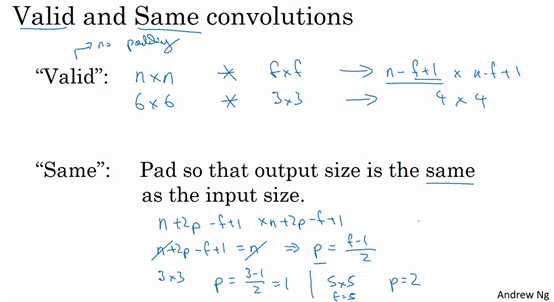

另一個經常被用到的填充方法叫做**Same**卷積，那意味你填充後，你的輸出大小和輸入大小是一樣的。根據這個公式$n-f+1$，當你填充$p$個像素點，$n$就變成了$n+2p$，最後公式變為$n+2p-f+1$。因此如果你有一個$n×n$的圖像，用$p$個像素填充邊緣，輸出的大小就是這樣的$(n+2p-f+1)×(n+2p-f+1)$。如果你想讓$n+2p-f+1=n$的話，使得輸出和輸入大小相等，如果你用這個等式求解$p$，那麼$p=(f-1)/2$。所以當$f$是一個奇數的時候，只要選擇相應的填充尺寸，你就能確保得到和輸入相同尺寸的輸出。這也是為什麼前面的例子，當過濾器是3×3時，和上一張幻燈片的例子一樣，使得輸出尺寸等於輸入尺寸，所需要的填充是(3-1)/2，也就是1個像素。另一個例子，當你的過濾器是5×5，如果$f=5$，然後代入那個式子，你就會發現需要2層填充使得輸出和輸入一樣大，這是過濾器5×5的情況。

習慣上，計算機視覺中，$f$通常是奇數，甚至可能都是這樣。你很少看到一個偶數的過濾器在計算機視覺裡使用，我認為有兩個原因。

其中一個可能是，如果$f$是一個偶數，那麼你只能使用一些不對稱填充。只有$f$是奇數的情況下，**Same**卷積才會有自然的填充，我們可以以同樣的數量填充四周，而不是左邊填充多一點，右邊填充少一點，這樣不對稱的填充。

第二個原因是當你有一個奇數維過濾器，比如3×3或者5×5的，它就有一個中心點。有時在計算機視覺裡，如果有一個中心像素點會更方便，便於指出過濾器的位置。

也許這些都不是為什麼$f$通常是奇數的充分原因，但如果你看了卷積的文獻，你經常會看到3×3的過濾器，你也可能會看到一些5×5，7×7的過濾器。後面我們也會談到1×1的過濾器，以及什麼時候它是有意義的。但是習慣上，我推薦你只使用奇數的過濾器。我想如果你使用偶數f也可能會得到不錯的表現，如果遵循計算機視覺的慣例，我通常使用奇數值的$f$。

你已經看到如何使用**padding**卷積，為了指定卷積操作中的**padding**，你可以指定$p$的值。也可以使用**Valid**卷積，也就是$p=0$。也可使用**Same**卷積填充像素，使你的輸出和輸入大小相同。以上就是**padding**，在接下來的影片中我們討論如何在卷積中設置步長。

### 1.5 卷積步長（Strided convolutions）

卷積中的步幅是另一個構建卷積神經網路的基本操作，讓我向你展示一個例子。

如果你想用3×3的過濾器卷積這個7×7的圖像，和之前不同的是，我們把步幅設置成了2。你還和之前一樣取左上方的3×3區域的元素的乘積，再加起來，最後結果為91。

只是之前我們移動藍框的步長是1，現在移動的步長是2，我們讓過濾器跳過2個步長，注意一下左上角，這個點移動到其後兩格的點，跳過了一個位置。然後你還是將每個元素相乘並求和，你將會得到的結果是100。

現在我們繼續，將藍色框移動兩個步長，你將會得到83的結果。當你移動到下一行的時候，你也是使用步長2而不是步長1，所以我們將藍色框移動到這裡：

注意到我們跳過了一個位置，得到69的結果，現在你繼續移動兩個步長，會得到91，127，最後一行分別是44，72，74。

所以在這個例子中，我們用3×3的矩陣卷積一個7×7的矩陣，得到一個3×3的輸出。輸入和輸出的維度是由下面的公式決定的。如果你用一個$f×f$的過濾器卷積一個$n×n$的圖像，你的**padding**為$p$，步幅為$s$，在這個例子中$s=2$，你會得到一個輸出，因為現在你不是一次移動一個步子，而是一次移動$s$個步子，輸出於是變為$\frac{n+2p - f}{s} + 1 \times \frac{n+2p - f}{s} + 1$

在我們的這個例子裡，$n=7$，$p=0$，$f=3$，$s=2$，$\ \frac{7 + 0 - 3}{2} + 1 =3$，即3×3的輸出。

現在只剩下最後的一個細節了，如果商不是一個整數怎麼辦？在這種情況下，我們向下取整。$⌊ ⌋$這是向下取整的符號，這也叫做對$z$進行地板除(**floor**)，這意味著$z$向下取整到最近的整數。這個原則實現的方式是，你只在藍框完全包括在圖像或填充完的圖像內部時，才對它進行運算。如果有任意一個藍框移動到了外面，那你就不要進行相乘操作，這是一個慣例。你的3×3的過濾器必須完全處於圖像中或者填充之後的圖像區域內才輸出相應結果，這就是慣例。因此正確計算輸出維度的方法是向下取整，以免$\frac{n + 2p - f}{s}$不是整數。

總結一下維度情況，如果你有一個$n×n$的矩陣或者$n×n$的圖像，與一個$f×f$的矩陣卷積，或者說$f×f$的過濾器。**Padding**是$p$，步幅為$s$沒輸出尺寸就是這樣：

可以選擇所有的數使結果是整數是挺不錯的，儘管一些時候，你不必這樣做，只要向下取整也就可以了。你也可以自己選擇一些$n$，$f$，$p$和$s$的值來驗證這個輸出尺寸的公式是對的。

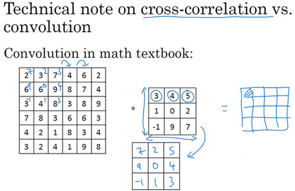

在講下一部分之前，這裡有一個關於互相關和卷積的技術性建議，這不會影響到你構建卷積神經網路的方式，但取決於你讀的是數學教材還是信號處理教材，在不同的教材裡符號可能不一致。如果你看的是一本典型的數學教科書，那麼卷積的定義是做元素乘積求和，實際上還有一個步驟是你首先要做的，也就是在把這個6×6的矩陣和3×3的過濾器卷積之前，首先你將3×3的過濾器沿水平和垂直軸翻轉，所以$\begin{bmatrix}3 & 4 & 5 \\ 1 & 0 & 2 \\  - 1 & 9 & 7 \\ \end{bmatrix}$變為$\begin{bmatrix} 7& 2 & 5 \\ 9 & 0 & 4 \\  - 1 & 1 & 3 \\\end{bmatrix}$，這相當於將3×3的過濾器做了個鏡像，在水平和垂直軸上（整理者註：此處應該是先順時針旋轉90得到$\begin{bmatrix}-1 & 1 & 3 \\ 9 & 0 & 4 \\ 7 & 2 & 5 \\\end{bmatrix}$，再水平翻轉得到$\begin{bmatrix}  7& 2 & 5 \\ 9 & 0 & 4 \\  - 1& 1 & 3 \\\end{bmatrix}$）。然後你再把這個翻轉後的矩陣複製到這裡（左邊的圖像矩陣），你要把這個翻轉矩陣的元素相乘來計算輸出的4×4矩陣左上角的元素，如圖所示。然後取這9個數字，把它們平移一個位置，再平移一格，以此類推。

所以我們在這些影片中定義卷積運算時，我們跳過了這個鏡像操作。從技術上講，我們實際上做的，我們在前面影片中使用的操作，有時被稱為互相關（**cross-correlation**）而不是卷積（**convolution**）。但在深度學習文獻中，按照慣例，我們將這（不進行翻轉操作）叫做卷積操作。

總結來說，按照機器學習的慣例，我們通常不進行翻轉操作。從技術上說，這個操作可能叫做互相關更好。但在大部分的深度學習文獻中都把它叫做卷積運算，因此我們將在這些影片中使用這個約定。如果你讀了很多機器學習文獻的話，你會發現許多人都把它叫做卷積運算，不需要用到這些翻轉。

事實證明在信號處理中或某些數學分支中，在卷積的定義包含翻轉，使得卷積運算符擁有這個性質，即$(A*B)*C=A*(B*C)$，這在數學中被稱為結合律。這對於一些信號處理應用來說很好，但對於深度神經網路來說它真的不重要，因此省略了這個雙重鏡像操作，就簡化了代碼，並使神經網路也能正常工作。

根據慣例，我們大多數人都叫它卷積，儘管數學家們更喜歡稱之為互相關，但這不會影響到你在編程練習中要實現的任何東西，也不會影響你閱讀和理解深度學習文獻。

現在你已經看到了如何進行卷積，以及如何使用填充，如何在卷積中選擇步幅。但到目前為止，我們所使用的是關於矩陣的卷積，例如6×6的矩陣。在下一集影片中，你將看到如何對立體進行卷積，這將會使你的卷積變得更加強大，讓我們繼續下一個影片。

### 1.6 三維卷積（Convolutions over volumes）

你已經知道如何對二維圖像做卷積了，現再看看如何執行卷積不僅僅在二維圖像上，而是三維立體上。

我們從一個例子開始，假如說你不僅想檢測灰度圖像的特徵，也想檢測**RGB**彩色圖像的特徵。彩色圖像如果是6×6×3，這裡的3指的是三個顏色通道，你可以把它想像成三個6×6圖像的堆疊。為了檢測圖像的邊緣或者其他的特徵，不是把它跟原來的3×3的過濾器做卷積，而是跟一個三維的過濾器，它的維度是3×3×3，這樣這個過濾器也有三層，對應紅綠、藍三個通道。

給這些起個名字（原圖像），這裡的第一個6代表圖像高度，第二個6代表寬度，這個3代表通道的數目。同樣你的過濾器也有一個高，寬和通道數，並且圖像的通道數必須和過濾器的通道數匹配，所以這兩個數（紫色方框標記的兩個數）必須相等。下個幻燈片裡，我們就會知道這個卷積操作是如何進行的了，這個的輸出會是一個4×4的圖像，注意是4×4×1，最後一個數不是3了。

我們研究下這背後的細節，首先先換一張好看的圖片。這個是6×6×3的圖像，這個是3×3×3的過濾器，最後一個數字通道數必須和過濾器中的通道數相匹配。為了簡化這個3×3×3過濾器的圖像，我們不把它畫成3個矩陣的堆疊，而畫成這樣，一個三維的立方體。

為了計算這個卷積操作的輸出，你要做的就是把這個3×3×3的過濾器先放到最左上角的位置，這個3×3×3的過濾器有27個數，27個參數就是3的立方。依次取這27個數，然後乘以相應的紅綠藍通道中的數字。先取紅色通道的前9個數字，然後是綠色通道，然後再是藍色通道，乘以左邊黃色立方體覆蓋的對應的27個數，然後把這些數都加起來，就得到了輸出的第一個數字。

如果要計算下一個輸出，你把這個立方體滑動一個單位，再與這27個數相乘，把它們都加起來，就得到了下一個輸出，以此類推。

那麼，這個能幹什麼呢？舉個例子，這個過濾器是3×3×3的，如果你想檢測圖像紅色通道的邊緣，那麼你可以將第一個過濾器設為$\begin{bmatrix}1 & 0 & - 1 \\ 1 & 0 & - 1 \\ 1 & 0 & - 1 \\\end{bmatrix}$，和之前一樣，而綠色通道全為0，$\begin{bmatrix} 0& 0 & 0 \\ 0 &0 & 0 \\ 0 & 0 & 0 \\\end{bmatrix}$，藍色也全為0。如果你把這三個堆疊在一起形成一個3×3×3的過濾器，那麼這就是一個檢測垂直邊界的過濾器，但只對紅色通道有用。

或者如果你不關心垂直邊界在哪個顏色通道裡，那麼你可以用一個這樣的過濾器，$\begin{bmatrix}1 & 0 & - 1 \\ 1 & 0 & - 1 \\ 1 & 0 & - 1 \\ \end{bmatrix}$，$\begin{bmatrix}1 & 0 & - 1 \\ 1 & 0 & - 1 \\ 1 & 0 & - 1 \\ \end{bmatrix}$，$\begin{bmatrix}1 & 0 & - 1 \\ 1 & 0 & - 1 \\ 1 & 0 & - 1 \\\end{bmatrix}$，所有三個通道都是這樣。所以通過設置第二個過濾器參數，你就有了一個邊界檢測器，3×3×3的邊界檢測器，用來檢測任意顏色通道裡的邊界。參數的選擇不同，你就可以得到不同的特徵檢測器，所有的都是3×3×3的過濾器。

按照計算機視覺的慣例，當你的輸入有特定的高寬和通道數時，你的過濾器可以有不同的高，不同的寬，但是必須一樣的通道數。理論上，我們的過濾器只關注紅色通道，或者只關注綠色或者藍色通道也是可行的。

再注意一下這個卷積立方體，一個6×6×6的輸入圖像卷積上一個3×3×3的過濾器，得到一個4×4的二維輸出。

現在你已經了解了如何對立方體卷積，還有最後一個概念，對建立卷積神經網路至關重要。就是，如果我們不僅僅想要檢測垂直邊緣怎麼辦？如果我們同時檢測垂直邊緣和水平邊緣，還有45°傾斜的邊緣，還有70°傾斜的邊緣怎麼做？換句話說，如果你想同時用多個過濾器怎麼辦？

這是我們上一張幻燈片的圖片，我們讓這個6×6×3的圖像和這個3×3×3的過濾器卷積，得到4×4的輸出。（第一個）這可能是一個垂直邊界檢測器或者是學習檢測其他的特徵。第二個過濾器可以用橘色來表示，它可以是一個水平邊緣檢測器。

所以和第一個過濾器卷積，可以得到第一個4×4的輸出，然後卷積第二個過濾器，得到一個不同的4×4的輸出。我們做完卷積，然後把這兩個4×4的輸出，取第一個把它放到前面，然後取第二個過濾器輸出，我把它畫在這，放到後面。所以把這兩個輸出堆疊在一起，這樣你就都得到了一個4×4×2的輸出立方體，你可以把這個立方體當成，重新畫在這，就是一個這樣的盒子，所以這就是一個4×4×2的輸出立方體。它用6×6×3的圖像，然後卷積上這兩個不同的3×3的過濾器，得到兩個4×4的輸出，它們堆疊在一起，形成一個4×4×2的立方體，這裡的2的來源於我們用了兩個不同的過濾器。

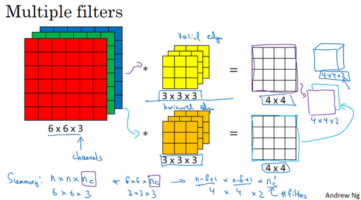

我們總結一下維度，如果你有一個$n \times n \times n_{c}$（通道數）的輸入圖像，在這個例子中就是6×6×3，這裡的$n_{c}$就是通道數目，然後卷積上一個$f×f×n_{c}$，這個例子中是3×3×3，按照慣例，這個（前一個$n_{c}$）和這個（後一個$n_{c}$）必須數值相同。然後你就得到了$（n-f+1）×（n-f+1）×n_{c^{'}}$，這裡$n_{c^{'}}$其實就是下一層的通道數，它就是你用的過濾器的個數，在我們的例子中，那就是4×4×2。我寫下這個假設時，用的步幅為1，並且沒有**padding**。如果你用了不同的步幅或者**padding**，那麼這個$n-f+1$數值會變化，正如前面的影片示範的那樣。

這個對立方體卷積的概念真的很有用，你現在可以用它的一小部分直接在三個通道的**RGB**圖像上進行操作。更重要的是，你可以檢測兩個特徵，比如垂直和水平邊緣或者10個或者128個或者幾百個不同的特徵，並且輸出的通道數會等於你要檢測的特徵數。

對於這裡的符號，我一直用通道數（$n_{c}$）來表示最後一個維度，在文獻裡大家也把它叫做3維立方體的深度。這兩個術語，即通道或者深度，經常被用在文獻中。但我覺得深度容易讓人混淆，因為你通常也會說神經網路的深度。所以，在這些影片裡我會用通道這個術語來表示過濾器的第三個維度的大小。

所以你已經知道怎麼對立方體做卷積了，你已經準備好了實現卷積神經其中一層了，在下個影片裡讓我們看看是怎麼做的。

### 1.7 單層卷積網路（One layer of a convolutional network）

今天我們要講的是如何構建卷積神經網路的卷積層，下面來看個例子。

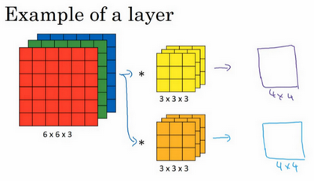

上節課，我們已經講了如何通過兩個過濾器卷積處理一個三維圖像，並輸出兩個不同的4×4矩陣。假設使用第一個過濾器進行卷積，得到第一個4×4矩陣。使用第二個過濾器進行卷積得到另外一個4×4矩陣。

最終各自形成一個卷積神經網路層，然後增加偏差，它是一個實數，通過**Python**的廣播機制給這16個元素都加上同一偏差。然後應用非線性函數，為了說明，它是一個非線性啟動函數**ReLU**，輸出結果是一個4×4矩陣。

對於第二個4×4矩陣，我們加上不同的偏差，它也是一個實數，16個數字都加上同一個實數，然後應用非線性函數，也就是一個非線性啟動函數**ReLU**，最終得到另一個4×4矩陣。然後重複我們之前的步驟，把這兩個矩陣堆疊起來，最終得到一個4×4×2的矩陣。我們通過計算，從6×6×3的輸入推導出一個4×4×2矩陣，它是卷積神經網路的一層，把它映射到標準神經網路中四個卷積層中的某一層或者一個非卷積神經網路中。

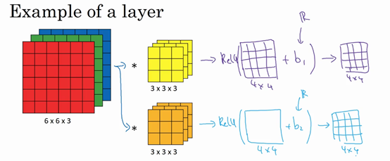

注意前向傳播中一個操作就是$z^{[1]} = W^{[1]}a^{[0]} + b^{[1]}$，其中$a^{[0]} =x$，執行非線性函數得到$a^{[1]}$，即$a^{[1]} = g(z^{[1]})$。這裡的輸入是$a^{\left\lbrack 0\right\rbrack}$，也就是$x$，這些過濾器用變數$W^{[1]}$表示。在卷積過程中，我們對這27個數進行操作，其實是27×2，因為我們用了兩個過濾器，我們取這些數做乘法。實際執行了一個線性函數，得到一個4×4的矩陣。卷積操作的輸出結果是一個4×4的矩陣，它的作用類似於$W^{[1]}a^{[0]}$，也就是這兩個4×4矩陣的輸出結果，然後加上偏差。

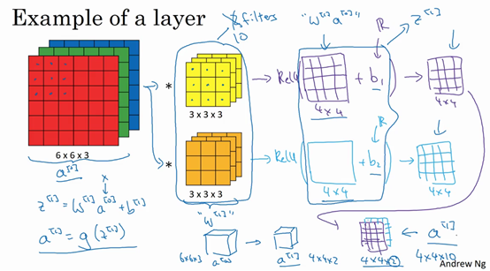

這一部分（圖中藍色邊框標記的部分）就是應用啟動函數**ReLU**之前的值，它的作用類似於$z^{[1]}$，最後應用非線性函數，得到的這個4×4×2矩陣，成為神經網路的下一層，也就是啟動層。

這就是$a^{[0]}$到$a^{[1]}$的演變過程，首先執行線性函數，然後所有元素相乘做卷積，具體做法是運用線性函數再加上偏差，然後應用啟動函數**ReLU**。這樣就透過神經網路的一層把一個6×6×3的維度$a^{[0]}$演化為一個4×4×2維度的$a^{[1]}$，這就是卷積神經網路的一層。

範例中我們有兩個過濾器，也就是有兩個特徵，因此我們才最終得到一個4×4×2的輸出。但如果我們用了10個過濾器，而不是2個，我們最後會得到一個4×4×10維度的輸出圖像，因為我們選取了其中10個特徵映射，而不僅僅是2個，將它們堆疊在一起，形成一個4×4×10的輸出圖像，也就是$a^{\left\lbrack1 \right\rbrack}$。

為了加深理解，我們來做一個練習。假設你有10個過濾器，而不是2個，神經網路的一層是3×3×3，那麼，這一層有多少個參數呢？我們來計算一下，每一層都是一個3×3×3的矩陣，因此每個過濾器有27個參數，也就是27個數。然後加上一個偏差，用參數$b$表示，現在參數增加到28個。上一頁幻燈片裡我畫了2個過濾器，而現在我們有10個，加在一起是28×10，也就是280個參數。

請注意一點，不論輸入圖片有多大，1000×1000也好，5000×5000也好，參數始終都是280個。用這10個過濾器來提取特徵，如垂直邊緣，水平邊緣和其它特徵。即使這些圖片很大，參數卻很少，這就是卷積神經網路的一個特徵，叫作“**避免過擬合**”。你已經知道到如何提取10個特徵，可以應用到大圖片中，而參數數量固定不變，此例中只有28個，相對較少。

最後我們總結一下用於描述卷積神經網路中的一層（以$l$層為例），也就是卷積層的各種標記。

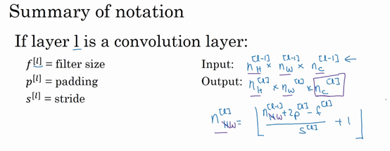

這一層是卷積層，用$f^{[l]}$表示過濾器大小，我們說過過濾器大小為$f×f$，上標$\lbrack l\rbrack$表示$l$層中過濾器大小為$f×f$。通常情況下，上標$\lbrack l\rbrack$用來標記$l$層。用$p^{[l]}$來標記**padding**的數量，**padding**數量也可指定為一個**valid**卷積，即無**padding**。或是**same**卷積，即選定**padding**，如此一來，輸出和輸入圖片的高度和寬度就相同了。用$s^{[l]}$標記步幅。

這一層的輸入會是某個維度的數據，表示為$n \times n \times n_{c}$，$n_{c}$某層上的顏色通道數。

我們要稍作修改，增加上標$\lbrack l -1\rbrack$，即$n^{\left\lbrack l - 1 \right\rbrack} \times n^{\left\lbrack l -1 \right\rbrack} \times n_{c}^{\left\lbrack l - 1\right\rbrack}$，因為它是上一層的啟動值。

此例中，所用圖片的高度和寬度都一樣，但它們也有可能不同，所以分別用上下標$H$和$W$來標記，即$n_{H}^{\left\lbrack l - 1 \right\rbrack} \times n_{W}^{\left\lbrack l - 1 \right\rbrack} \times n_{c}^{\left\lbrack l - 1\right\rbrack}$。那麼在第$l$層，圖片大小為$n_{H}^{\left\lbrack l - 1 \right\rbrack} \times n_{W}^{\left\lbrack l - 1  \right\rbrack} \times n_{c}^{\left\lbrack l - 1\right\rbrack}$，$l$層的輸入就是上一層的輸出，因此上標要用$\lbrack l - 1\rbrack$。神經網路這一層中會有輸出，它本身會輸出圖像。其大小為$n_{H}^{[l]} \times n_{W}^{[l]} \times n_{c}^{[l]}$，這就是輸出圖像的大小。

前面我們提到過，這個公式給出了輸出圖片的大小，至少給出了高度和寬度，$\lfloor\frac{n+2p - f}{s} + 1\rfloor$（注意：（$\frac{n + 2p - f}{s} +1)$直接用這個運算結果，也可以向下取整）。在這個新表達式中，$l$層輸出圖像的高度，即$n_{H}^{[l]} = \lfloor\frac{n_{H}^{\left\lbrack l - 1 \right\rbrack} +2p^{[l]} - f^{[l]}}{s^{[l]}} +1\rfloor$，同樣我們可以計算出圖像的寬度，用$W$替換參數$H$，即$n_{W}^{[l]} = \lfloor\frac{n_{W}^{\left\lbrack l - 1 \right\rbrack} +2p^{[l]} - f^{[l]}}{s^{[l]}} +1\rfloor$，公式一樣，只要變化高度和寬度的參數我們便能計算輸出圖像的高度或寬度。這就是由$n_{H}^{\left\lbrack l - 1 \right\rbrack}$推導$n_{H}^{[l]}$以及$n_{W}^{\left\lbrack l - 1\right\rbrack}$推導$n_{W}^{[l]}$的過程。

那麼通道數量又是什麼？這些數字從哪裡來的？我們來看一下。輸出圖像也具有深度，通過上一個範例，我們知道它等於該層中過濾器的數量，如果有2個過濾器，輸出圖像就是4×4×2，它是二維的，如果有10個過濾器，輸出圖像就是4×4×10。輸出圖像中的通道數量就是神經網路中這一層所使用的過濾器的數量。如何確定過濾器的大小呢？我們知道卷積一個6×6×3的圖片需要一個3×3×3的過濾器，因此過濾器中通道的數量必須與輸入中通道的數量一致。因此，輸出通道數量就是輸入通道數量，所以過濾器維度等於$f^{[l]} \times f^{[l]} \times n_{c}^{\left\lbrack l - 1 \right\rbrack}$。

應用偏差和非線性函數之後，這一層的輸出等於它的啟動值$a^{[l]}$，也就是這個維度（輸出維度）。$a^{[l]}$是一個三維體，即$n_{H}^{[l]} \times n_{W}^{[l]} \times n_{c}^{[l]}$。當你執行批次梯度下降或小批次梯度下降時，如果有$m$個例子，就是有$m$個啟動值的集合，那麼輸出$A^{[l]} = m \times n_{H}^{[l]} \times n_{W}^{[l]} \times n_{c}^{[l]}$。如果採用批次梯度下降，變數的排列順序如下，首先是索引和訓練範例，然後是其它三個變數。

該如何確定權重參數，即參數W呢？過濾器的維度已知，為$f^{[l]} \times  f^{[l]} \times  n_{c}^{[l - 1]}$，這只是一個過濾器的維度，有多少個過濾器，這（$n_{c}^{[l]}$）是過濾器的數量，權重也就是所有過濾器的集合再乘以過濾器的總數量，即$f^{[l]} \times f^{[l]} \times  n_{c}^{[l - 1]} \times n_{c}^{[l]}$，損失數量L就是$l$層中過濾器的個數。

最後我們看看偏差參數，每個過濾器都有一個偏差參數，它是一個實數。偏差包含了這些變數，它是該維度上的一個向量。後續課程中我們會看到，為了方便，偏差在代碼中表示為一個1×1×1×$n_{c}^{[l]}$的四維向量或四維張量。

卷積有很多種標記方法，這是我們最常用的卷積符號。大家在線搜索或查看開原始碼時，關於高度，寬度和通道的順序並沒有完全統一的標準卷積，所以在查看**GitHub**上的原始碼或閱讀一些開源實現的時候，你會發現有些作者會採用把通道放在首位的編碼標準，有時所有變數都採用這種標準。實際上在某些架構中，當檢索這些圖片時，會有一個變數或參數來標識計算通道數量和通道損失數量的先後順序。只要保持一致，這兩種卷積標準都可用。很遺憾，這只是一部分標記法，因為深度學習文獻並未對標記達成一致，但課上我會採用這種卷積標識法，按高度，寬度和通道損失數量的順序依次計算。

我知道，忽然間接觸到這麼多新的標記方法，你可能會說，這麼多怎麼記呢？別擔心，不用全都記住，你可以透過本週的練習來熟悉它們。而這節課我想講的重點是，卷積神經網路的某一卷積層的工作原理，以及如何計算某一卷積層的啟動函數，並映射到下一層的啟動值。了解了卷積神經網路中某一卷積層的工作原理，我們就可以把它們堆疊起來形成一個深度卷積神經網路，我們下節課再講。

### 1.8 簡單卷積網路範例（A simple convolution network example）

上節課，我們講了如何為卷積網路構建一個卷積層。今天我們看一個深度卷積神經網路的具體範例，順便練習一下我們上節課所學的標記法。

假設你有一張圖片，你想做圖片分類或圖片識別，把這張圖片輸入定義為$x$，然後辨別圖片中有沒有貓，用0或1表示，這是一個分類問題，我們來構建適用於這項任務的卷積神經網路。針對這個範例，我用了一張比較小的圖片，大小是39×39×3，這樣設定可以使其中一些數字效果更好。所以$n_{H}^{[0]} = n_{W}^{[0]}$，即高度和寬度都等於39，$n_{c}^{[0]} =3$，即0層的通道數為3。

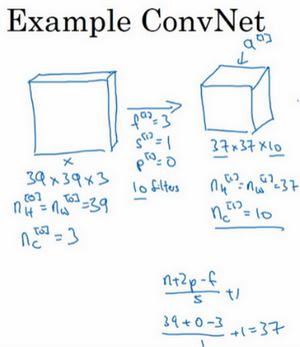

假設第一層我們用一個3×3的過濾器來提取特徵，那麼$f^{[1]} = 3$，因為過濾器時3×3的矩陣。$s^{[1]} = 1$，$p^{[1]} =0$，所以高度和寬度使用**valid**卷積。如果有10個過濾器，神經網路下一層的啟動值為37×37×10，寫10是因為我們用了10個過濾器，37是公式$\frac{n + 2p - f}{s} + 1$的計算結果，也就是$\frac{39 + 0 - 3}{1} + 1 = 37$，所以輸出是37×37，它是一個**vaild**卷積，這是輸出結果的大小。第一層標記為$n_{H}^{[1]} = n_{W}^{[1]} = 37$，$n_{c}^{[1]} = 10$，$n_{c}^{[1]}$等於第一層中過濾器的個數，這（37×37×10）是第一層啟動值的維度。

假設還有另外一個卷積層，這次我們採用的過濾器是5×5的矩陣。在標記法中，神經網路下一層的$f=5$，即$f^{\left\lbrack 2 \right\rbrack} = 5$步幅為2，即$s^{\left\lbrack 2 \right\rbrack} = 2$。**padding**為0，即$p^{\left\lbrack 2 \right\rbrack} = 0$，且有20個過濾器。所以其輸出結果會是一張新圖像，這次的輸出結果為17×17×20，因為步幅是2，維度縮小得很快，大小從37×37減小到17×17，減小了一半還多，過濾器是20個，所以通道數也是20，17×17×20即啟動值$a^{\left\lbrack 2 \right\rbrack}$的維度。因此$n_{H}^{\left\lbrack 2 \right\rbrack} = n_{W}^{\left\lbrack 2 \right\rbrack} = 17$，$n_{c}^{\left\lbrack 2 \right\rbrack} = 20$。

我們來構建最後一個卷積層，假設過濾器還是5×5，步幅為2，即$f^{\left\lbrack 2 \right\rbrack} = 5$，$s^{\left\lbrack 3 \right\rbrack} = 2$，計算過程我跳過了，最後輸出為7×7×40，假設使用了40個過濾器。**padding**為0，40個過濾器，最後結果為7×7×40。

到此，這張39×39×3的輸入圖像就處理完畢了，為圖片提取了7×7×40個特徵，計算出來就是1960個特徵。然後對該卷積進行處理，可以將其平滑或展開成1960個單元。平滑處理後可以輸出一個向量，其填充內容是**logistic**回歸單元還是**softmax**回歸單元，完全取決於我們是想識圖片上有沒有貓，還是想識別$K$種不同對象中的一種，用$\hat y$表示最終神經網路的預測輸出。明確一點，最後這一步是處理所有數字，即全部的1960個數字，把它們展開成一個很長的向量。為了預測最終的輸出結果，我們把這個長向量填充到**softmax**回歸函數中。

這是卷積神經網路的一個典型範例，設計卷積神經網路時，確定這些超參數比較費工夫。要決定過濾器的大小、步幅、**padding**以及使用多少個過濾器。這週和下週，我會針對選擇參數的問題提供一些建議和指導。

而這節課你要掌握的一點是，隨著神經網路計算深度不斷加深，通常開始時的圖像也要更大一些，初始值為39×39，高度和寬度會在一段時間內保持一致，然後隨著網路深度的加深而逐漸減小，從39到37，再到17，最後到7。而通道數量在增加，從3到10，再到20，最後到40。在許多其它卷積神經網路中，你也可以看到這種趨勢。關於如何確定這些參數，後面課上我會更詳細講解，這是我們講的第一個卷積神經網路範例。

一個典型的卷積神經網路通常有三層，一個是卷積層，我們常常用**Conv**來標註。上一個例子，我用的就是**CONV**。還有兩種常見類型的層，我們留在後兩節課講。一個是池化層，我們稱之為**POOL**。最後一個是全連接層，用**FC**表示。雖然僅用卷積層也有可能構建出很好的神經網路，但大部分神經望樓架構師依然會添加池化層和全連接層。幸運的是，池化層和全連接層比卷積層更容易設計。後兩節課我們會快速講解這兩個概念以便你更好的了解神經網路中最常用的這幾種層，你就可以利用它們構建更強大的網路了。

再次恭喜你已經掌握了第一個卷積神經網路，本週後幾節課，我們會學習如何訓練這些卷積神經網路。不過在這之前，我還要簡單介紹一下池化層和全連接層。然後再訓練這些網路，到時我會用到大家熟悉的反向傳播訓練方法。那麼下節課，我們就先來了解如何構建神經網路的池化層。

### 1.9 池化層（Pooling layers）

除了卷積層，卷積網路也經常使用池化層來縮減模型的大小，提高計算速度，同時提高所提取特徵的強健性，我們來看一下。

先舉一個池化層的例子，然後我們再討論池化層的必要性。假如輸入是一個4×4矩陣，用到的池化類型是最大池化（**max pooling**）。執行最大池化的樹池是一個2×2矩陣。執行過程非常簡單，把4×4的輸入拆分成不同的區域，我把這個區域用不同顏色來標記。對於2×2的輸出，輸出的每個元素都是其對應顏色區域中的最大元素值。

左上區域的最大值是9，右上區域的最大元素值是2，左下區域的最大值是6，右下區域的最大值是3。為了計算出右側這4個元素值，我們需要對輸入矩陣的2×2區域做最大值運算。這就像是應用了一個規模為2的過濾器，因為我們選用的是2×2區域，步幅是2，這些就是最大池化的超參數。

因為我們使用的過濾器為2×2，最後輸出是9。然後向右移動2個步幅，計算出最大值2。然後是第二行，向下移動2步得到最大值6。最後向右移動3步，得到最大值3。這是一個2×2矩陣，即$f=2$，步幅是2，即$s=2$。

這是對最大池化功能的直觀理解，你可以把這個4×4輸入看作是某些特徵的集合，也許不是。你可以把這個4×4區域看作是某些特徵的集合，也就是神經網路中某一層的非啟動值集合。數字大意味著可能探測到了某些特定的特徵，左上象限具有的特徵可能是一個垂直邊緣，一隻眼睛，或是大家害怕遇到的**CAP**特徵。顯然左上象限中存在這個特徵，這個特徵可能是一隻貓眼探測器。然而，右上象限並不存在這個特徵。最大化操作的功能就是只要在任何一個象限內提取到某個特徵，它都會保留在最大化的池化輸出裡。所以最大化運算的實際作用就是，如果在過濾器中提取到某個特徵，那麼保留其最大值。如果沒有提取到這個特徵，可能在右上象限中不存在這個特徵，那麼其中的最大值也還是很小，這就是最大池化的直觀理解。

必須承認，人們使用最大池化的主要原因是此方法在很多實驗中效果都很好。儘管剛剛描述的直觀理解經常被引用，不知大家是否完全理解它的真正原因，不知大家是否理解最大池化效率很高的真正原因。

其中一個有意思的特點就是，它有一組超參數，但並沒有參數需要學習。實際上，梯度下降沒有什麼可學的，一旦確定了$f$和$s$，它就是一個固定運算，梯度下降無需改變任何值。

我們來看一個有若干個超級參數的範例，輸入是一個5×5的矩陣。我們採用最大池化法，它的過濾器參數為3×3，即$f=3$，步幅為1，$s=1$，輸出矩陣是3×3.之前講的計算卷積層輸出大小的公式同樣適用於最大池化，即$\frac{n + 2p - f}{s} + 1$，這個公式也可以計算最大池化的輸出大小。

此例是計算3×3輸出的每個元素，我們看左上角這些元素，注意這是一個3×3區域，因為有3個過濾器，取最大值9。然後移動一個元素，因為步幅是1，藍色區域的最大值是9.繼續向右移動，藍色區域的最大值是5。然後移到下一行，因為步幅是1，我們只向下移動一個格，所以該區域的最大值是9。這個區域也是9。這兩個區域的最大值都是5。最後這三個區域的最大值分別為8，6和9。超參數$f=3$，$s=1$，最終輸出如圖所示。

以上就是一個二維輸入的最大池化的示範，如果輸入是三維的，那麼輸出也是三維的。例如，輸入是5×5×2，那麼輸出是3×3×2。計算最大池化的方法就是分別對每個通道執行剛剛的計算過程。如上圖所示，第一個通道依然保持不變。對於第二個通道，我剛才畫在下面的，在這個層做同樣的計算，得到第二個通道的輸出。一般來說，如果輸入是5×5×$n_{c}$，輸出就是3×3×$n_{c}$，$n_{c}$個通道中每個通道都單獨執行最大池化計算，以上就是最大池化算法。

另外還有一種類型的池化，平均池化，它不太常用。我簡單介紹一下，這種運算顧名思義，選取的不是每個過濾器的最大值，而是平均值。範例中，紫色區域的平均值是3.75，後面依次是1.25、4和2。這個平均池化的超級參數$f=2$，$s=2$，我們也可以選擇其它超級參數。

目前來說，最大池化比平均池化更常用。但也有例外，就是深度很深的神經網路，你可以用平均池化來分解規模為7×7×1000的網路的表示層，在整個空間內求平均值，得到1×1×1000，一會我們看個例子。但在神經網路中，最大池化要比平均池化用得更多。

總結一下，池化的超級參數包括過濾器大小$f$和步幅$s$，常用的參數值為$f=2$，$s=2$，應用頻率非常高，其效果相當於高度和寬度縮減一半。也有使用$f=3$，$s=2$的情況。至於其它超級參數就要看你用的是最大池化還是平均池化了。你也可以根據自己意願增加表示**padding**的其他超級參數，雖然很少這麼用。最大池化時，往往很少用到超參數**padding**，當然也有例外的情況，我們下週會講。大部分情況下，最大池化很少用**padding**。目前$p$最常用的值是0，即$p=0$。最大池化的輸入就是$n_{H} \times n_{W} \times n_{c}$，假設沒有**padding**，則輸出$\lfloor\frac{n_{H} - f}{s} +1\rfloor \times \lfloor\frac{n_{w} - f}{s} + 1\rfloor \times n_{c}$。輸入通道與輸出通道個數相同，因為我們對每個通道都做了池化。需要注意的一點是，池化過程中沒有需要學習的參數。執行反向傳播時，反向傳播沒有參數適用於最大池化。只有這些設置過的超參數，可能是手動設置的，也可能是通過交叉驗證設置的。

除了這些，池化的內容就全部講完了。最大池化只是計算神經網路某一層的靜態屬性，沒有什麼需要學習的，它只是一個靜態屬性。

關於池化我們就講到這裡，現在我們已經知道如何構建卷積層和池化層了。下節課，我們會分析一個更複雜的可以引進全連接層的卷積網路範例。

### 1.10 卷積神經網路範例（Convolutional neural network example）

構建全卷積神經網路的構造模組我們已經掌握得差不多了，下面來看個例子。

假設，有一張大小為32×32×3的輸入圖片，這是一張**RGB**模式的圖片，你想做手寫體數字識別。32×32×3的**RGB**圖片中含有某個數字，比如7，你想識別它是從0-9這10個數字中的哪一個，我們構建一個神經網路來實現這個功能。

我用的這個網路模型和經典網路**LeNet-5**非常相似，靈感也來源於此。**LeNet-5**是多年前**Yann LeCun**創建的，我所採用的模型並不是**LeNet-5**，但是受它啟發，許多參數選擇都與**LeNet-5**相似。輸入是32×32×3的矩陣，假設第一層使用過濾器大小為5×5，步幅是1，**paddin**g是0，過濾器個數為6，那麼輸出為28×28×6。將這層標記為**CONV1**，它用了6個過濾器，增加了偏差，應用了非線性函數，可能是**ReLU**非線性函數，最後輸出**CONV1**的結果。

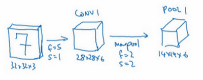

然後構建一個池化層，這裡我選擇用最大池化，參數$f=2$，$s=2$，因為**padding**為0，我就不寫出來了。現在開始構建池化層，最大池化使用的過濾器為2×2，步幅為2，表示層的高度和寬度會減少一半。因此，28×28變成了14×14，通道數量保持不變，所以最終輸出為14×14×6，將該輸出標記為**POOL1**。

人們發現在卷積神經網路文獻中，卷積有兩種分類，這與所謂層的劃分存在一致性。一類卷積是一個卷積層和一個池化層一起作為一層，這就是神經網路的**Layer1**。另一類卷積是把卷積層作為一層，而池化層單獨作為一層。人們在計算神經網路有多少層時，通常只統計具有權重和參數的層。因為池化層沒有權重和參數，只有一些超參數。這裡，我們把**CONV1**和**POOL1**共同作為一個卷積，並標記為**Layer1**。雖然你在閱讀網路文章或研究報告時，你可能會看到卷積層和池化層各為一層的情況，這只是兩種不同的標記術語。一般我在統計網路層數時，只計算具有權重的層，也就是把**CONV1**和**POOL1**作為**Layer1**。這裡我們用**CONV1**和**POOL1**來標記，兩者都是神經網路**Layer1**的一部分，**POOL1**也被劃分在**Layer1**中，因為它沒有權重，得到的輸出是14×14×6。

我們再為它構建一個卷積層，過濾器大小為5×5，步幅為1，這次我們用10個過濾器，最後輸出一個10×10×10的矩陣，標記為**CONV2**。

然後做最大池化，超參數$f=2$，$s=2$。你大概可以猜出結果，$f=2$，$s=2$，高度和寬度會減半，最後輸出為5×5×10，標記為**POOL2**，這就是神經網路的第二個卷積層，即**Layer2**。

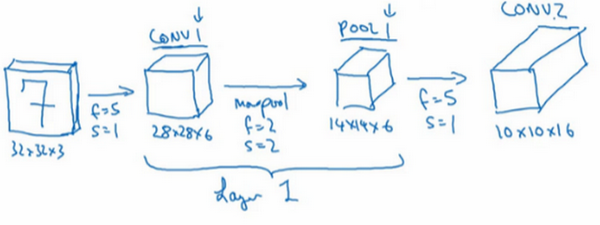

如果對**Layer1**應用另一個卷積層，過濾器為5×5，即$f=5$，步幅是1，**padding**為0，所以這裡省略了，過濾器16個，所以**CONV2**輸出為10×10×16。我們看看**CONV2**，這是**CONV2**層。

繼續執行做大池化計算，參數$f=2$，$s=2$，你能猜到結果嗎？對10×10×16輸入執行最大池化計算，參數$f=2$，$s=2$，高度和寬度減半，計算結果猜到了吧。最大池化的參數$f=2$，$s=2$，輸入的高度和寬度會減半，結果為5×5×16，通道數和之前一樣，標記為**POOL2**。這是一個卷積，即**Layer2**，因為它只有一個權重集和一個卷積層**CONV2**。

5×5×16矩陣包含400個元素，現在將**POOL2**平整化為一個大小為400的一維向量。我們可以把平整化結果想像成這樣的一個神經元集合，然後利用這400個單元構建下一層。下一層含有120個單元，這就是我們第一個全連接層，標記為**FC3**。這400個單元與120個單元緊密相連，這就是全連接層。它很像我們在第一和第二門課中講過的單神經網路層，這是一個標準的神經網路。它的權重矩陣為$W^{\left\lbrack 3 \right\rbrack}$，維度為120×400。這就是所謂的“全連接”，因為這400個單元與這120個單元的每一項連接，還有一個偏差參數。最後輸出120個維度，因為有120個輸出。

然後我們對這個120個單元再添加一個全連接層，這層更小，假設它含有84個單元，標記為**FC4**。

最後，用這84個單元填充一個**softmax**單元。如果我們想透過手寫數字識別來識別手寫0-9這10個數字，這個**softmax**就會有10個輸出。

此例中的卷積神經網路很典型，看起來它有很多超參數，關於如何選定這些參數，後面我提供更多建議。常規做法是，儘量不要自己設置超參數，而是查看文獻中別人採用了哪些超參數，選一個在別人任務中效果很好的架構，那麼它也有可能適用於你自己的應用程式，這塊下週我會細講。

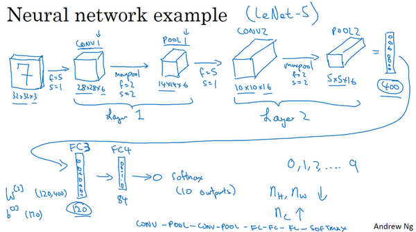

現在，我想指出的是，隨著神經網路深度的加深，高度$n_{H}$和寬度$n_{W}$通常都會減少，前面我就提到過，從32×32到28×28，到14×14，到10×10，再到5×5。所以隨著層數增加，高度和寬度都會減小，而通道數量會增加，從3到6到16不斷增加，然後得到一個全連接層。

在神經網路中，另一種常見模式就是一個或多個卷積後面跟隨一個池化層，然後一個或多個卷積層後面再跟一個池化層，然後是幾個全連接層，最後是一個**softmax**。這是神經網路的另一種常見模式。

接下來我們講講神經網路的啟動值形狀，啟動值大小和參數數量。輸入為32×32×3，這些數做乘法，結果為3072，所以啟動值$a^{[0]}$有3072維，啟動值矩陣為32×32×3，輸入層沒有參數。計算其他層的時候，試著自己計算出啟動值，這些都是網路中不同層的啟動值形狀和啟動值大小。

有幾點要注意，第一，池化層和最大池化層沒有參數；第二卷積層的參數相對較少，前面課上我們提到過，其實許多參數都存在於神經網路的全連接層。觀察可發現，隨著神經網路的加深，啟動值尺寸會逐漸變小，如果啟動值尺寸下降太快，也會影響神經網路性能。範例中，啟動值尺寸在第一層為6000，然後減少到1600，慢慢減少到84，最後輸出**softmax**結果。我們發現，許多卷積網路都具有這些屬性，模式上也相似。

神經網路的基本構造模組我們已經講完了，一個卷積神經網路包括卷積層、池化層和全連接層。許多計算機視覺研究正在探索如何把這些基本模組整合起來，構建高效的神經網路，整合這些基本模組確實需要深入的理解。根據我的經驗，找到整合基本構造模組最好方法就是大量閱讀別人的案例。下週我會示範一些整合基本模組，成功構建高效神經網路的具體案例。我希望下週的課程可以幫助你找到構建有效神經網路的感覺，或許你也可以將別人開發的框架應用於自己的應用程式，這是下週的內容。下節課，也是本週最後一節課，我想花點時間討論下，為什麼大家願意使用卷積，使用卷積的好處和優勢是什麼，以及如何整合多個卷積，如何檢驗神經網路，如何在訓練集上訓練神經網路來識別圖片或執行其他任務，我們下節課繼續講。

### 1.11 為什麼使用卷積？（Why convolutions?）

這是本週最後一節課，我們來分析一下卷積在神經網路中如此受用的原因，然後對如何整合這些卷積，如何通過一個標註過的訓練集訓練卷積神經網路做個簡單概括。和只用全連接層相比，卷積層的兩個主要優勢在於參數共享和稀疏連接，舉例說明一下。

假設有一張32×32×3維度的圖片，這是上節課的範例，假設用了6個大小為5×5的過濾器，輸出維度為28×28×6。32×32×3=3072，28×28×6=4704。我們構建一個神經網路，其中一層含有3072個單元，下一層含有4074個單元，兩層中的每個神經元彼此相連，然後計算權重矩陣，它等於4074×3072≈1400萬，所以要訓練的參數很多。雖然以現在的技術，我們可以用1400多萬個參數來訓練網路，因為這張32×32×3的圖片非常小，訓練這麼多參數沒有問題。如果這是一張1000×1000的圖片，權重矩陣會變得非常大。我們看看這個卷積層的參數數量，每個過濾器都是5×5，一個過濾器有25個參數，再加上偏差參數，那麼每個過濾器就有26個參數，一共有6個過濾器，所以參數共計156個，參數數量還是很少。

卷積網路映射這麼少參數有兩個原因：

一是參數共享。觀察發現，特徵檢測如垂直邊緣檢測如果適用於圖片的某個區域，那麼它也可能適用於圖片的其他區域。也就是說，如果你用一個3×3的過濾器檢測垂直邊緣，那麼圖片的左上角區域，以及旁邊的各個區域（左邊矩陣中藍色方框標記的部分）都可以使用這個3×3的過濾器。每個特徵檢測器以及輸出都可以在輸入圖片的不同區域中使用同樣的參數，以便提取垂直邊緣或其它特徵。它不僅適用於邊緣特徵這樣的低階特徵，同樣適用於高階特徵，例如提取臉上的眼睛，貓或者其他特徵對象。即使減少參數個數，這9個參數同樣能計算出16個輸出。直觀感覺是，一個特徵檢測器，如垂直邊緣檢測器用於檢測圖片左上角區域的特徵，這個特徵很可能也適用於圖片的右下角區域。因此在計算圖片左上角和右下角區域時，你不需要添加其它特徵檢測器。假如有一個這樣的數據集，其左上角和右下角可能有不同分布，也有可能稍有不同，但很相似，整張圖片共享特徵檢測器，提取效果也很好。

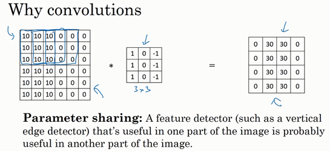

第二個方法是使用稀疏連接，我來解釋下。這個0是通過3×3的卷積計算得到的，它只依賴於這個3×3的輸入的單元格，右邊這個輸出單元（元素0）僅與36個輸入特徵中9個相連接。而且其它像素值都不會對輸出產生任影響，這就是稀疏連接的概念。

再舉一個例子，這個輸出（右邊矩陣中紅色標記的元素 30）僅僅依賴於這9個特徵（左邊矩陣紅色方框標記的區域），看起來只有這9個輸入特徵與輸出相連接，其它像素對輸出沒有任何影響。

神經網路可以通過這兩種機制減少參數，以便我們用更小的訓練集來訓練它，從而預防過度擬合。你們也可能聽過，卷積神經網路善於捕捉平移不變。通過觀察可以發現，向右移動兩個像素，圖片中的貓依然清晰可見，因為神經網路的卷積結構使得即使移動幾個像素，這張圖片依然具有非常相似的特徵，應該屬於同樣的輸出標記。實際上，我們用同一個過濾器生成各層中，圖片的所有像素值，希望網路通過自動學習變得更加健壯，以便更好地取得所期望的平移不變屬性。

這就是卷積或卷積網路在計算機視覺任務中表現良好的原因。

最後，我們把這些層整合起來，看看如何訓練這些網路。比如我們要構建一個貓咪檢測器，我們有下面這個標記訓練集，$x$表示一張圖片，$\hat{y}$是二進位制標記或某個重要標記。我們選定了一個卷積神經網路，輸入圖片，增加卷積層和池化層，然後添加全連接層，最後輸出一個**softmax**，即$\hat{y}$。卷積層和全連接層有不同的參數$w$和偏差$b$，我們可以用任何參數集合來定義代價函數。一個類似於我們之前講過的那種代價函數，並隨機初始化其參數$w$和$b$，代價函數$J$等於神經網路對整個訓練集的預測的損失總和再除以$m$（即$\text{Cost}\ J = \frac{1}{m}\sum_{i = 1}^{m}{L(\hat{y}^{(i)},y^{(i)})}$）。所以訓練神經網路，你要做的就是使用梯度下降法，或其它算法，例如**Momentum**梯度下降法，含**RMSProp**或其它因子的梯度下降來最佳化神經網路中所有參數，以減少代價函數$J$的值。通過上述操作你可以構建一個高效的貓咪檢測器或其它檢測器。

恭喜你完成了這一週的課程，你已經學習了卷積神經網路的所有基本構造模組，以及如何在高效圖片識別系統中整合這些模組。透過本週編程練習，你可以更加具體了解這些概念，試著整合這些構造模組，並用它們解決自己的問題。

下週，我們將繼續深入學習卷積神經網路。我曾提到卷積神經網路中有很多超參數，下週，我打算具體展示一些最有效的卷積神經網路範例，你也可以嘗試去判斷哪些網路架構類型效率更高。人們通常的做法是將別人發現和發表在研究報告上的架構應用於自己的應用程式。下週看過更多具體的範例後，相信你會做的更好。此外，下星期我們也會深入分析卷積神經網路如此高效的原因，同時講解一些新的計算機視覺應用程式，例如，對象檢測和神經風格遷移以及如何利用這些算法創造新的藝術品形式。
