第二週 深度卷積網路：實例探究（Deep convolutional models: case studies）
------------------------------------------------------------------------
[TOC]
### 2.1 為什麼要進行實例探究？（Why look at case studies?）

這週我們首先來看看一些卷積神經網路的實例分析，為什麼要看這些實例分析呢？上週我們講了基本構建，比如卷積層、池化層以及全連接層這些組件。事實上，過去幾年計算機視覺研究中的大量研究都集中在如何把這些基本構件組合起來，形成有效的卷積神經網路。最直觀的方式之一就是去看一些案例，就像很多人透過看別人的代碼來學習程式一樣，通過研究別人構建有效組件的案例是個不錯的辦法。實際上在計算機視覺任務中表現良好的神經網路框架往往也適用於其它任務，也許你的任務也不例外。也就是說，如果有人已經訓練或者計算出擅長識別貓、狗、人的神經網路或者神經網路框架，而你的計算機視覺識別任務是構建一個自動駕駛汽車，你完全可以借鑑別人的神經網路框架來解決自己的問題。

最後，學完這幾節課，你應該可以讀一些計算機視覺方面的研究論文了，我希望這也是你學習本課程的收穫。當然，讀論文並不是必須的，但是我希望當你發現你可以讀懂一些計算機視覺方面的研究論文或研討會內容時會有一種滿足感。言歸正傳，我們進入主題。

這是後面幾節課的提綱，首先我們來看幾個經典的網路。

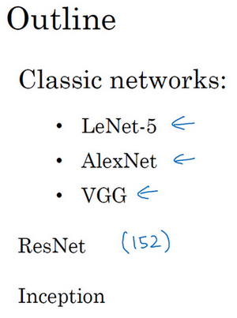

**LeNet-5**網路，我記得應該是1980年代的，經常被引用的**AlexNet**，還有**VGG**網路。這些都是非常有效的神經網路範例，當中的一些思路為現代計算機視覺技術的發展奠定了基礎。論文中的這些想法可能對你大有裨益，對你的工作也可能有所幫助。

然後是**ResNet**，又稱殘差網路。神經網路正在不斷加深，對此你可能有所了解。**ResNet**神經網路訓練了一個深達152層的神經網路，並且在如何有效訓練方面，總結出了一些有趣的想法和竅門。課程最後，我們還會講一個**Inception**神經網路的實例分析。

了解了這些神經網路，我相信你會對如何構建有效的卷積神經網路更有感覺。即使計算機視覺並不是你的主要方向，但我相信你會從**ResNet**和**Inception**網路這樣的實例中找到一些不錯的想法。這裡面有很多思路都是多學科融合的產物。總之，即便你不打算構建計算機視覺應用程式，試著從中發現一些有趣的思路，對你的工作也會有所幫助。

### 2.2 經典網路（Classic networks）

這節課，我們來學習幾個經典的神經網路結構，分別是**LeNet-5**、**AlexNet**和**VGGNet**，開始吧。

首先看看**LeNet-5**的網路結構，假設你有一張32×32×1的圖片，**LeNet-5**可以識別圖中的手寫數字，比如像這樣手寫數字7。**LeNet-5**是針對灰度圖片訓練的，所以圖片的大小只有32×32×1。實際上**LeNet-5**的結構和我們上週講的最後一個範例非常相似，使用6個5×5的過濾器，步幅為1。由於使用了6個過濾器，步幅為1，**padding**為0，輸出結果為28×28×6，圖像尺寸從32×32縮小到28×28。然後進行池化操作，在這篇論文寫成的那個年代，人們更喜歡使用平均池化，而現在我們可能用最大池化更多一些。在這個例子中，我們進行平均池化，過濾器的寬度為2，步幅為2，圖像的尺寸，高度和寬度都縮小了2倍，輸出結果是一個14×14×6的圖像。我覺得這張圖片應該不是完全按照比例繪製的，如果嚴格按照比例繪製，新圖像的尺寸應該剛好是原圖像的一半。

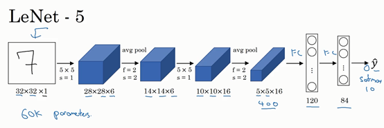

接下來是卷積層，我們用一組16個5×5的過濾器，新的輸出結果有16個通道。**LeNet-5**的論文是在1998年撰寫的，當時人們並不使用**padding**，或者總是使用**valid**卷積，這就是為什麼每進行一次卷積，圖像的高度和寬度都會縮小，所以這個圖像從14到14縮小到了10×10。然後又是池化層，高度和寬度再縮小一半，輸出一個5×5×16的圖像。將所有數字相乘，乘積是400。

下一層是全連接層，在全連接層中，有400個節點，每個節點有120個神經元，這裡已經有了一個全連接層。但有時還會從這400個節點中抽取一部分節點構建另一個全連接層，就像這樣，有2個全連接層。

最後一步就是利用這84個特徵得到最後的輸出，我們還可以在這裡再加一個節點用來預測$\hat{y}$的值，$\hat{y}$有10個可能的值，對應識別0-9這10個數字。在現在的版本中則使用**softmax**函數輸出十種分類結果，而在當時，**LeNet-5**網路在輸出層使用了另外一種，現在已經很少用到的分類器。

相比現代版本，這裡得到的神經網路會小一些，只有約6萬個參數。而現在，我們經常看到含有一千萬到一億個參數的神經網路，比這大1000倍的神經網路也不在少數。

不管怎樣，如果我們從左往右看，隨著網路越來越深，圖像的高度和寬度在縮小，從最初的32×32縮小到28×28，再到14×14、10×10，最後只有5×5。與此同時，隨著網路層次的加深，通道數量一直在增加，從1增加到6個，再到16個。

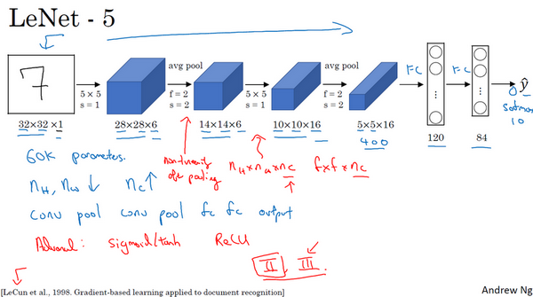

這個神經網路中還有一種模式至今仍然經常用到，就是一個或多個卷積層後面跟著一個池化層，然後又是若干個卷積層再接一個池化層，然後是全連接層，最後是輸出，這種排列方式很常用。

對於那些想嘗試閱讀論文的同學，我再補充幾點。接下來的部分主要針對那些打算閱讀經典論文的同學，所以會更加深入。這些內容你完全可以跳過，算是對神經網路歷史的一種回顧吧，聽不懂也不要緊。

讀到這篇經典論文時，你會發現，過去，人們使用**sigmod**函數和**tanh**函數，而不是**ReLu**函數，這篇論文中使用的正是**sigmod**函數和**tanh**函數。這種網路結構的特別之處還在於，各網路層之間是有關聯的，這在今天看來顯得很有趣。

比如說，你有一個$n_{H} \times n_{W} \times n_{C}$的網路，有$n_{C}$個通道，使用尺寸為$f×f×n_{C}$的過濾器，每個過濾器的通道數和它上一層的通道數相同。這是由於在當時，計算機的運行速度非常慢，為了減少計算量和參數，經典的**LeNet-5**網路使用了非常複雜的計算方式，每個過濾器都採用和輸入模組一樣的通道數量。論文中提到的這些複雜細節，現在一般都不用了。

我認為當時所進行的最後一步其實到現在也還沒有真正完成，就是經典的**LeNet-5**網路在池化後進行了非線性函數處理，在這個例子中，池化層之後使用了**sigmod**函數。如果你真的去讀這篇論文，這會是最難理解的部分之一，我們會在後面的課程中講到。

下面要講的網路結構簡單一些，幻燈片的大部分類容來自於原文的第二段和第三段，原文的後幾段介紹了另外一種思路。文中提到的這種圖形變形網路如今並沒有得到廣泛應用，所以在讀這篇論文的時候，我建議精讀第二段，這段重點介紹了這種網路結構。泛讀第三段，這裡面主要是一些有趣的實驗結果。

我要舉例說明的第二種神經網路是**AlexNet**，是以論文的第一作者**Alex Krizhevsky**的名字命名的，另外兩位合著者是**ilya Sutskever**和**Geoffery Hinton**。

**AlexNet**首先用一張227×227×3的圖片作為輸入，實際上原文中使用的圖像是224×224×3，但是如果你嘗試去推導一下，你會發現227×227這個尺寸更好一些。第一層我們使用96個11×11的過濾器，步幅為4，由於步幅是4，因此尺寸縮小到55×55，縮小了4倍左右。然後用一個3×3的過濾器構建最大池化層，$f=3$，步幅$s$為2，卷積層尺寸縮小為27×27×96。接著再執行一個5×5的卷積，**padding**之後，輸出是27×27×276。然後再次進行最大池化，尺寸縮小到13×13。再執行一次**same**卷積，相同的**padding**，得到的結果是13×13×384，384個過濾器。再做一次**same**卷積，就像這樣。再做一次同樣的操作，最後再進行一次最大池化，尺寸縮小到6×6×256。6×6×256等於9216，將其展開為9216個單元，然後是一些全連接層。最後使用**softmax**函數輸出識別的結果，看它究竟是1000個可能的對象中的哪一個。

實際上，這種神經網路與**LeNet**有很多相似之處，不過**AlexNet**要大得多。正如前面講到的**LeNet**或**LeNet-5**大約有6萬個參數，而**AlexNet**包含約6000萬個參數。當用於訓練圖像和數據集時，**AlexNet**能夠處理非常相似的基本構造模組，這些模組往往包含著大量的隱藏單元或數據，這一點**AlexNet**表現出色。**AlexNet**比**LeNet**表現更為出色的另一個原因是它使用了**ReLu**啟動函數。

同樣的，我還會講一些比較深奧的內容，如果你並不打算閱讀論文，不聽也沒有關係。第一點，在寫這篇論文的時候，**GPU**的處理速度還比較慢，所以**AlexNet**採用了非常複雜的方法在兩個**GPU**上進行訓練。大致原理是，這些層分別拆分到兩個不同的**GPU**上，同時還專門有一個方法用於兩個**GPU**進行交流。

論文還提到，經典的**AlexNet**結構還有另一種類型的層，叫作“局部響應歸一化層”（**Local Response Normalization**），即**LRN**層，這類層應用得並不多，所以我並沒有專門講。局部響應歸一層的基本思路是，假如這是網路的一塊，比如是13×13×256，**LRN**要做的就是選取一個位置，比如說這樣一個位置，從這個位置穿過整個通道，能得到256個數字，並進行歸一化。進行局部響應歸一化的動機是，對於這張13×13的圖像中的每個位置來說，我們可能並不需要太多的高啟動神經元。但是後來，很多研究者發現**LRN**起不到太大作用，這應該是被我劃掉的內容之一，因為並不重要，而且我們現在並不用**LRN**來訓練網路。

如果你對深度學習的歷史感興趣的話，我認為在**AlexNet**之前，深度學習已經在語音識別和其它幾個領域獲得了一些關注，但正是通過這篇論文，計算機視覺群體開始重視深度學習，並確信深度學習可以應用於計算機視覺領域。此後，深度學習在計算機視覺及其它領域的影響力與日俱增。如果你並不打算閱讀這方面的論文，其實可以不用學習這節課。但如果你想讀懂一些相關的論文，這是比較好理解的一篇，學起來會容易一些。

**AlexNet**網路結構看起來相對複雜，包含大量超參數，這些數位（55×55×96、27×27×96、27×27×256……）都是**Alex Krizhevsky**及其合著者不得不給出的。

這節課要講的第三個，也是最後一個範例是**VGG**，也叫作**VGG-16**網路。值得注意的一點是，**VGG-16**網路沒有那麼多超參數，這是一種只需要專注於構建卷積層的簡單網路。首先用3×3，步幅為1的過濾器構建卷積層，**padding**參數為**same**卷積中的參數。然後用一個2×2，步幅為2的過濾器構建最大池化層。因此**VGG**網路的一大優點是它確實簡化了神經網路結構，下面我們具體講講這種網路結構。

假設要識別這個圖像，在最開始的兩層用64個3×3的過濾器對輸入圖像進行卷積，輸出結果是224×224×64，因為使用了**same**卷積，通道數量也一樣。**VGG-16**其實是一個很深的網路，這裡我並沒有把所有卷積層都畫出來。

假設這個小圖是我們的輸入圖像，尺寸是224×224×3，進行第一個卷積之後得到224×224×64的特徵圖，接著還有一層224×224×64，得到這樣2個厚度為64的卷積層，意味著我們用64個過濾器進行了兩次卷積。正如我在前面提到的，這裡採用的都是大小為3×3，步幅為1的過濾器，並且都是採用**same**卷積，所以我就不再把所有的層都畫出來了，只用一串數字代表這些網路。

接下來創建一個池化層，池化層將輸入圖像進行壓縮，從224×224×64縮小到多少呢？沒錯，減少到112×112×64。然後又是若干個卷積層，使用129個過濾器，以及一些**same**卷積，我們看看輸出什麼結果，112×112×128.然後進行池化，可以推導出池化後的結果是這樣（56×56×128）。接著再用256個相同的過濾器進行三次卷積操作，然後再池化，然後再卷積三次，再池化。如此進行幾輪操作後，將最後得到的7×7×512的特徵圖進行全連接操作，得到4096個單元，然後進行**softmax**啟動，輸出從1000個對象中識別的結果。

順便說一下，**VGG-16**的這個數字16，就是指在這個網路中包含16個卷積層和全連接層。確實是個很大的網路，總共包含約1.38億個參數，即便以現在的標準來看都算是非常大的網路。但**VGG-16**的結構並不複雜，這點非常吸引人，而且這種網路結構很規整，都是幾個卷積層後面跟著可以壓縮圖像大小的池化層，池化層縮小圖像的高度和寬度。同時，卷積層的過濾器數量變化存在一定的規律，由64翻倍變成128，再到256和512。作者可能認為512已經足夠大了，所以後面的層就不再翻倍了。無論如何，每一步都進行翻倍，或者說在每一組卷積層進行過濾器翻倍操作，正是設計此種網路結構的另一個簡單原則。這種相對一致的網路結構對研究者很有吸引力，而它的主要缺點是需要訓練的特徵數量非常巨大。

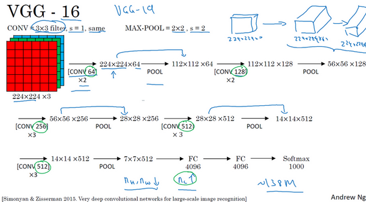

有些文章還介紹了**VGG-19**網路，它甚至比**VGG-16**還要大，如果你想了解更多細節，請參考幻燈片下方的注文，閱讀由**Karen Simonyan**和**Andrew Zisserman**撰寫的論文。由於**VGG-16**的表現幾乎和**VGG-19**不分高下，所以很多人還是會使用**VGG-16**。我最喜歡它的一點是，文中揭示了，隨著網路的加深，圖像的高度和寬度都在以一定的規律不斷縮小，每次池化後剛好縮小一半，而通道數量在不斷增加，而且剛好也是在每組卷積操作後增加一倍。也就是說，圖像縮小的比例和通道數增加的比例是有規律的。從這個角度來看，這篇論文很吸引人。

以上就是三種經典的網路結構，如果你對這些論文感興趣，我建議從介紹**AlexNet**的論文開始，然後就是**VGG**的論文，最後是**LeNet**的論文。雖然有些晦澀難懂，但對於了解這些網路結構很有幫助。

學過這些經典的網路之後，下節課我們會學習一些更先高級更強大的神經網路結構，下節課見。

### 2.3 殘差網路(ResNets)（Residual Networks (ResNets)）

非常非常深的神經網路是很難訓練的，因為存在梯度消失和梯度爆炸問題。這節課我們學習跳躍連接（**Skip connection**），它可以從某一層網路層獲取啟動，然後迅速回饋給另外一層，甚至是神經網路的更深層。我們可以利用跳躍連接構建能夠訓練深度網路的**ResNets**，有時深度能夠超過100層，讓我們開始吧。

**ResNets**是由殘差塊（**Residual block**）構建的，首先我解釋一下什麼是殘差塊。

這是一個兩層神經網路，在$L$層進行啟動，得到$a^{\left\lbrack l + 1 \right\rbrack}$，再次進行啟動，兩層之後得到$a^{\left\lbrack l + 2 \right\rbrack}$。計算過程是從$a^{[l]}$開始，首先進行線性啟動，根據這個公式：$z^{\left\lbrack l + 1 \right\rbrack} = W^{\left\lbrack l + 1 \right\rbrack}a^{[l]} + b^{\left\lbrack l + 1 \right\rbrack}$，通過$a^{[l]}$算出$z^{\left\lbrack l + 1 \right\rbrack}$，即$a^{[l]}$乘以權重矩陣，再加上偏差因子。然後通過**ReLU**非線性啟動函數得到$a^{\left\lbrack l + 1 \right\rbrack}$，$a^{\left\lbrack l + 1 \right\rbrack} =g(z^{\left\lbrack l + 1 \right\rbrack})$計算得出。接著再次進行線性啟動，依據等式$z^{\left\lbrack l + 2 \right\rbrack} = W^{\left\lbrack 2 + 1 \right\rbrack}a^{\left\lbrack l + 1 \right\rbrack} + b^{\left\lbrack l + 2 \right\rbrack}$，最後根據這個等式再次進行**ReLu**非線性啟動，即$a^{\left\lbrack l + 2 \right\rbrack} = g(z^{\left\lbrack l + 2   \right\rbrack})$，這裡的$g$是指**ReLU**非線性函數，得到的結果就是$a^{\left\lbrack l + 2 \right\rbrack}$。換句話說，訊息流從$a^{\left\lbrack l   \right\rbrack}$到$a^{\left\lbrack l + 2  \right\rbrack}$需要經過以上所有步驟，即這組網路層的主路徑。

在殘差網路中有一點變化，我們將$a^{[l]}$直接向後，拷貝到神經網路的深層，在**ReLU**非線性啟動函數前加上$a^{[l]}$，這是一條捷徑。$a^{[l]}$的訊息直接到達神經網路的深層，不再沿著主路徑傳遞，這就意味著最後這個等式($a^{\left\lbrack l + 2 \right\rbrack} = g(z^{\left\lbrack l + 2 \right\rbrack})$)去掉了，取而代之的是另一個**ReLU**非線性函數，仍然對$z^{\left\lbrack l + 2 \right\rbrack}$進行$g$函數處理，但這次要加上$a^{[l]}$，即：$\ a^{\left\lbrack l + 2 \right\rbrack} = g\left(z^{\left\lbrack l + 2 \right\rbrack} + a^{[l]}\right)$，也就是加上的這個$a^{[l]}$產生了一個殘差塊。

在上面這個圖中，我們也可以畫一條捷徑，直達第二層。實際上這條捷徑是在進行**ReLU**非線性啟動函數之前加上的，而這裡的每一個節點都執行了線性函數和**ReLU**啟動函數。所以$a^{[l]}$插入的時機是在線性啟動之後，**ReLU**啟動之前。除了捷徑，你還會聽到另一個術語“跳躍連接”，就是指$a^{[l]}$跳過一層或者好幾層，從而將訊息傳遞到神經網路的更深層。

**ResNet**的發明者是**何凱明**（**Kaiming He**）、**張翔宇**（**Xiangyu Zhang**）、**任少卿**（**Shaoqing Ren**）和**孫劍**（**Jiangxi Sun**），他們發現使用殘差塊能夠訓練更深的神經網路。所以構建一個**ResNet**網路就是透過將很多這樣的殘差塊堆積在一起，形成一個很深神經網路，我們來看看這個網路。

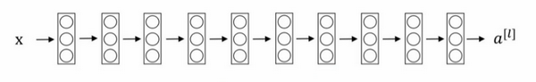

這並不是一個殘差網路，而是一個普通網路（**Plain network**），這個術語來自**ResNet**論文。

把它變成**ResNet**的方法是加上所有跳躍連接，正如前一張幻燈片中看到的，每兩層增加一個捷徑，構成一個殘差塊。如圖所示，5個殘差塊連接在一起構成一個殘差網路。

如果我們使用標準最佳化算法訓練一個普通網路，比如說梯度下降法，或者其它熱門的最佳化算法。如果沒有殘差，沒有這些捷徑或者跳躍連接，憑經驗你會發現隨著網路深度的加深，訓練錯誤會先減少，然後增多。而理論上，隨著網路深度的加深，應該訓練得越來越好才對。也就是說，理論上網路深度越深越好。但實際上，如果沒有殘差網路，對於一個普通網路來說，深度越深意味著用最佳化算法越難訓練。實際上，隨著網路深度的加深，訓練錯誤會越來越多。

但有了**ResNets**就不一樣了，即使網路再深，訓練的表現卻不錯，比如說訓練誤差減少，就算是訓練深達100層的網路也不例外。有人甚至在1000多層的神經網路中做過實驗，儘管目前我還沒有看到太多實際應用。但是對$x$的啟動，或者這些中間的啟動能夠到達網路的更深層。這種方式確實有助於解決梯度消失和梯度爆炸問題，讓我們在訓練更深網路的同時，又能保證良好的性能。也許從另外一個角度來看，隨著網路越來深，網路連接會變得臃腫，但是**ResNet**確實在訓練深度網路方面非常有效。

現在大家對**ResNet**已經有了一個大致的了解，通過本週的程式練習，你可以嘗試親自實現一下這些想法。至於為什麼**ResNets**能有如此好的表現，接下來我會有更多更棒的內容分享給大家，我們下個影片見。

### 2.4 殘差網路為什麼有用？（Why ResNets work?）

為什麼**ResNets**能有如此好的表現，我們來看個例子，它解釋了其中的原因，至少可以說明，如何構建更深層次的**ResNets**網路的同時還不降低它們在訓練集上的效率。希望你已經透過第三門課了解到，通常來講，網路在訓練集上表現好，才能在**Hold-Out**交叉驗證集或**dev**集和測試集上有好的表現，所以至少在訓練集上訓練好**ResNets**是第一步。

先來看個例子，上節課我們了解到，一個網路深度越深，它在訓練集上訓練的效率就會有所減弱，這也是有時候我們不希望加深網路的原因。而事實並非如此，至少在訓練**ResNets**網路時，並非完全如此，舉個例子。

假設有一個大型神經網路，其輸入為$X$，輸出啟動值$a^{[l]}$。假如你想增加這個神經網路的深度，那麼用**Big NN**表示，輸出為$ a^{\left\lbrack l\right\rbrack}$。再給這個網路額外添加兩層，依次添加兩層，最後輸出為$a^{\left\lbrack l + 2 \right\rbrack}$，可以把這兩層看作一個**ResNets**塊，即具有捷徑連接的殘差塊。為了方便說明，假設我們在整個網路中使用**ReLU**啟動函數，所以啟動值都大於等於0，包括輸入$X$的非零異常值。因為**ReLU**啟動函數輸出的數字要嘛是0，要嘛是正數。

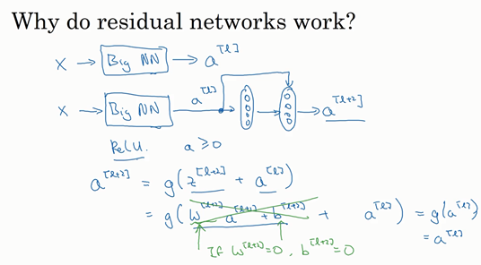

我們看一下$a^{\left\lbrack l + 2\right\rbrack}$的值，也就是上節課講過的表達式，即$a^{\left\lbrack l + 2\right\rbrack} = g(z^{\left\lbrack l + 2 \right\rbrack} + a^{\left\lbrack l\right\rbrack})$，添加項$a^{\left\lbrack l\right\rbrack}$是剛添加的跳躍連接的輸入。展開這個表達式$a^{\left\lbrack l + 2 \right\rbrack} = g(W^{\left\lbrack l + 2 \right\rbrack}a^{\left\lbrack l + 1 \right\rbrack} + b^{\left\lbrack l + 2 \right\rbrack} + a^{\left\lbrack l\right\rbrack})$，其中$z^{\left\lbrack l + 2 \right\rbrack} = W^{\left\lbrack l + 2 \right\rbrack}a^{\left\lbrack l + 1 \right\rbrack} + b^{\left\lbrack l + 2\right\rbrack}$。注意一點，如果使用**L2**正則化或權重衰減，它會壓縮$W^{\left\lbrack l + 2\right\rbrack}$的值。如果對$b$應用權重衰減也可達到同樣的效果，儘管實際應用中，你有時會對$b$應用權重衰減，有時不會。這裡的$W$是關鍵項，如果$W^{\left\lbrack l + 2 \right\rbrack} = 0$，為方便起見，假設$b^{\left\lbrack l + 2 \right\rbrack} = 0$，這幾項就沒有了，因為它們（$W^{\left\lbrack l + 2 \right\rbrack}a^{\left\lbrack l + 1 \right\rbrack} + b^{\left\lbrack l + 2\right\rbrack}$）的值為0。最後$ a^{\left\lbrack l + 2 \right\rbrack} = \ g\left( a^{[l]} \right) = a^{\left\lbrack l\right\rbrack}$，因為我們假定使用**ReLU**啟動函數，並且所有啟動值都是非負的，$g\left(a^{[l]} \right)$是應用於非負數的**ReLU**函數，所以$a^{[l+2]} =a^{[l]}$。

結果表明，殘差塊學習這個恆等式函數並不難，跳躍連接使我們很容易得出$ a^{\left\lbrack l + 2 \right\rbrack} = a^{\left\lbrack l\right\rbrack}$。這意味著，即使給神經網路增加了這兩層，它的效率也並不遜色於更簡單的神經網路，因為學習恆等函數對它來說很簡單。儘管它多了兩層，也只把$a^{[l]}$的值賦值給$a^{\left\lbrack l + 2 \right\rbrack}$。所以給大型神經網路增加兩層，不論是把殘差塊添加到神經網路的中間還是末端位置，都不會影響網路的表現。

當然，我們的目標不僅僅是保持網路的效率，還要提升它的效率。想像一下，如果這些隱藏層單元學到一些有用訊息，那麼它可能比學習恆等函數表現得更好。而這些不含有殘差塊或跳躍連接的深度普通網路情況就不一樣了，當網路不斷加深時，就算是選用學習恆等函數的參數都很困難，所以很多層最後的表現不但沒有更好，反而更糟。

我認為殘差網路起作用的主要原因就是這些殘差塊學習恆等函數非常容易，你能確定網路性能不會受到影響，很多時候甚至可以提高效率，或者說至少不會降低網路的效率，因此創建類似殘差網路可以提升網路性能。

除此之外，關於殘差網路，另一個值得探討的細節是，假設$ z^{\left\lbrack l + 2\right\rbrack}$與$a^{[l]}$具有相同維度，所以**ResNets**使用了許多**same**卷積，所以這個$a^{\left\lbrack l\right\rbrack}$的維度等於這個輸出層的維度。之所以能實現跳躍連接是因為**same**卷積保留了維度，所以很容易得出這個捷徑連接，並輸出這兩個相同維度的向量。

如果輸入和輸出有不同維度，比如輸入的維度是128，$ a^{\left\lbrack l + 2\right\rbrack}$的維度是256，再增加一個矩陣，這裡標記為$W_{s}$，$W_{s}$是一個256×128維度的矩陣，所以$W_{s}a^{\left\lbrack l\right\rbrack}$的維度是256，這個新增項是256維度的向量。你不需要對$W_{s}$做任何操作，它是網路通過學習得到的矩陣或參數，它是一個固定矩陣，**padding**值為0，用0填充$a^{[l]}$，其維度為256，所以者幾個表達式都可以。

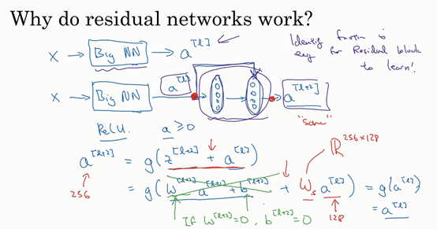

最後，我們來看看**ResNets**的圖片識別。這些圖片是我從何凱明等人論文中截取的，這是一個普通網路，我們給它輸入一張圖片，它有多個卷積層，最後輸出了一個**Softmax**。

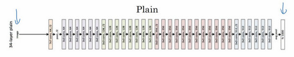

如何把它轉化為**ResNets**呢？只需要添加跳躍連接。這裡我們只討論幾個細節，這個網路有很多層3×3卷積，而且它們大多都是**same**卷積，這就是添加等維特徵向量的原因。所以這些都是卷積層，而不是全連接層，因為它們是**same**卷積，維度得以保留，這也解釋了添加項$ z^{\left\lbrack l + 2 \right\rbrack} + a^{\left\lbrack l\right\rbrack}$（維度相同所以能夠相加）。

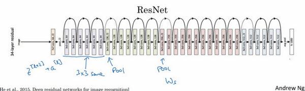

**ResNets**類似於其它很多網路，也會有很多卷積層，其中偶爾會有池化層或類池化層的層。不論這些層是什麼類型，正如我們在上一張幻燈片看到的，你都需要調整矩陣$W_{s}$的維度。普通網路和**ResNets**網路常用的結構是：卷積層-卷積層-卷積層-池化層-卷積層-卷積層-卷積層-池化層……依此重複。直到最後，有一個通過**softmax**進行預測的全連接層。

以上就是**ResNets**的內容。使用1×1的過濾器，即1×1卷積，這個想法很有意思，為什麼呢？我們下節課再講。

### 2.5 網路中的網路以及 1×1 卷積（Network in Network and 1×1 convolutions）

在架構內容設計方面，其中一個比較有幫助的想法是使用1×1卷積。也許你會好奇，1×1的卷積能做什麼呢？不就是乘以數字嗎？聽起來挺好笑的，結果並非如此，我們來具體看看。

過濾器為1×1，這裡是數字2，輸入一張6×6×1的圖片，然後對它做卷積，起過濾器大小為1×1×1，結果相當於把這個圖片乘以數字2，所以前三個單元格分別是2、4、6等等。用1×1的過濾器進行卷積，似乎用處不大，只是對輸入矩陣乘以某個數字。但這僅僅是對於6×6×1的一個通道圖片來說，1×1卷積效果不佳。

如果是一張6×6×32的圖片，那麼使用1×1過濾器進行卷積效果更好。具體來說，1×1卷積所實現的功能是遍歷這36個單元格，計算左圖中32個數字和過濾器中32個數字的元素積之和，然後應用**ReLU**非線性函數。

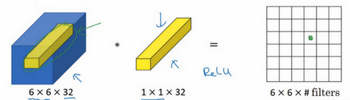

我們以其中一個單元為例，它是這個輸入層上的某個切片，用這36個數字乘以這個輸入層上1×1切片，得到一個實數，像這樣把它畫在輸出中。

這個1×1×32過濾器中的32個數字可以這樣理解，一個神經元的輸入是32個數位（輸入圖片中左下角位置32個通道中的數字），即相同高度和寬度上某一切片上的32個數字，這32個數字具有不同通道，乘以32個權重（將過濾器中的32個數理解為權重），然後應用**ReLU**非線性函數，在這裡輸出相應的結果。

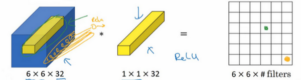

一般來說，如果過濾器不止一個，而是多個，就好像有多個輸入單元，其輸入內容為一個切片上所有數字，輸出結果是6×6過濾器數量。

所以1×1卷積可以從根本上理解為對這32個不同的位置都應用一個全連接層，全連接層的作用是輸入32個數位（過濾器數量標記為$n_{C}^{\left\lbrack l + 1\right\rbrack}$，在這36個單元上重複此過程）,輸出結果是6×6×\#filters（過濾器數量），以便在輸入層上實施一個非平凡（**non-trivial**）計算。

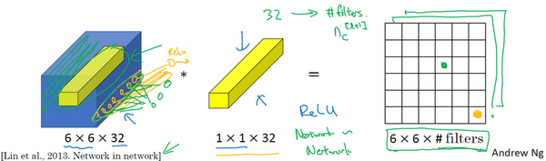

這種方法通常稱為1×1卷積，有時也被稱為**Network in Network**，在林敏、陳強和楊學成的論文中有詳細描述。雖然論文中關於架構的詳細內容並沒有得到廣泛應用，但是1×1卷積或**Network in Network**這種理念卻很有影響力，很多神經網路架構都受到它的影響，包括下節課要講的**Inception**網路。

舉個1×1卷積的例子，相信對大家有所幫助，這是它的一個應用。

假設這是一個28×28×192的輸入層，你可以使用池化層壓縮它的高度和寬度，這個過程我們很清楚。但如果通道數量很大，該如何把它壓縮為28×28×32維度的層呢？你可以用32個大小為1×1的過濾器，嚴格來講每個過濾器大小都是1×1×192維，因為過濾器中通道數量必須與輸入層中通道的數量保持一致。但是你使用了32個過濾器，輸出層為28×28×32，這就是壓縮通道數（$n_{c}$）的方法，對於池化層我只是壓縮了這些層的高度和寬度。

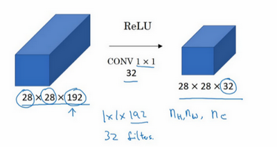

在之後我們看到在某些網路中1×1卷積是如何壓縮通道數量並減少計算的。當然如果你想保持通道數192不變，這也是可行的，1×1卷積只是添加了非線性函數，當然也可以讓網路學習更複雜的函數，比如，我們再添加一層，其輸入為28×28×192，輸出為28×28×192。

1×1卷積層就是這樣實現了一些重要功能的（**doing something pretty non-trivial**），它給神經網路添加了一個非線性函數，從而減少或保持輸入層中的通道數量不變，當然如果你願意，也可以增加通道數量。後面你會發現這對構建**Inception**網路很有幫助，我們放在下節課講。

這節課我們示範了如何根據自己的意願透過1×1卷積的簡單操作來壓縮或保持輸入層中的通道數量，甚至是增加通道數量。下節課，我們再講講1×1卷積是如何幫助我們構建**Inception**網路的，下節課見。

### 2.6 谷歌 Inception 網路簡介（Inception network motivation）

構建卷積層時，你要決定過濾器的大小究竟是1×1（原來是1×3，猜測為口誤），3×3還是5×5，或者要不要添加池化層。而**Inception**網路的作用就是代替你來決定，雖然網路架構因此變得更加複雜，但網路表現卻非常好，我們來了解一下其中的原理。

例如，這是你28×28×192維度的輸入層，**Inception**網路或**Inception**層的作用就是代替人工來確定卷積層中的過濾器類型，或者確定是否需要創建卷積層或池化層，我們示範一下。

如果使用1×1卷積，輸出結果會是28×28×\#（某個值），假設輸出為28×28×64，並且這裡只有一個層。

如果使用3×3的過濾器，那麼輸出是28×28×128。然後我們把第二個值堆積到第一個值上，為了匹配維度，我們應用**same**卷積，輸出維度依然是28×28，和輸入維度相同，即高度和寬度相同。

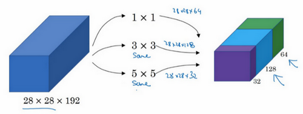

或許你會說，我希望提升網路的表現，用5×5過濾器或許會更好，我們不妨試一下，輸出變成28×28×32，我們再次使用**same**卷積，保持維度不變。

或許你不想要卷積層，那就用池化操作，得到一些不同的輸出結果，我們把它也堆積起來，這裡的池化輸出是28×28×32。為了匹配所有維度，我們需要對最大池化使用**padding**，它是一種特殊的池化形式，因為如果輸入的高度和寬度為28×28，則輸出的相應維度也是28×28。然後再進行池化，**padding**不變，步幅為1。

這個操作非常有意思，但我們要繼續學習後面的內容，一會再實現這個池化過程。

有了這樣的**Inception**模組，你就可以輸入某個量，因為它累加了所有數字，這裡的最終輸出為32+32+128+64=256。**Inception**模組的輸入為28×28×192，輸出為28×28×256。這就是**Inception**網路的核心內容，提出者包括**Christian Szegedy、劉偉、賈陽青、Pierre Sermanet、Scott Reed、Dragomir Anguelov、Dumitru Erhan、Vincent Vanhoucke**和**Andrew Rabinovich**。基本思想是**Inception**網路不需要人為決定使用哪個過濾器或者是否需要池化，而是由網路自行確定這些參數，你可以給網路添加這些參數的所有可能值，然後把這些輸出連接起來，讓網路自己學習它需要什麼樣的參數，採用哪些過濾器組合。

不難發現，我所描述的**Inception**層有一個問題，就是計算成本，下一張幻燈片，我們就來計算這個5×5過濾器在該模組中的計算成本。

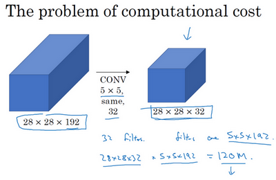

我們把重點集中在前一張幻燈片中的5×5的過濾器，這是一個28×28×192的輸入塊，執行一個5×5卷積，它有32個過濾器，輸出為28×28×32。前一張幻燈片中，我用一個紫色的細長塊表示，這裡我用一個看起來更普通的藍色塊表示。我們來計算這個28×28×32輸出的計算成本，它有32個過濾器，因為輸出有32個通道，每個過濾器大小為5×5×192，輸出大小為28×28×32，所以你要計算28×28×32個數字。對於輸出中的每個數字來說，你都需要執行5×5×192次乘法運算，所以乘法運算的總次數為每個輸出值所需要執行的乘法運算次數（5×5×192）乘以輸出值個數（28×28×32），把這些數相乘結果等於1.2億(120422400)。即使在現在，用計算機執行1.2億次乘法運算，成本也是相當高的。下一張幻燈片會介紹1×1卷積的應用，也就是我們上節課所學的。為了降低計算成本，我們用計算成本除以因子10，結果它從1.2億減小到原來的十分之一。請記住120這個數字，一會還要和下一頁看到的數字做對比。

這裡還有另外一種架構，其輸入為28×28×192，輸出為28×28×32。其結果是這樣的，對於輸入層，使用1×1卷積把輸入值從192個通道減少到16個通道。然後對這個較小層運行5×5卷積，得到最終輸出。請注意，輸入和輸出的維度依然相同，輸入是28×28×192，輸出是28×28×32，和上一頁的相同。但我們要做的就是把左邊這個大的輸入層壓縮成這個較小的的中間層，它只有16個通道，而不是192個。

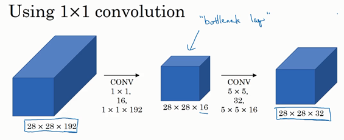

有時候這被稱為瓶頸層，瓶頸通常是某個對象最小的部分，假如你有這樣一個玻璃瓶，這是瓶塞位置，瓶頸就是這個瓶子最小的部分。

同理，瓶頸層也是網路中最小的部分，我們先縮小網路表示，然後再擴大它。

接下來我們看看這個計算成本，應用1×1卷積，過濾器個數為16，每個過濾器大小為1×1×192，這兩個維度相匹配（輸入通道數與過濾器通道數），28×28×16這個層的計算成本是，輸出28×28×192中每個元素都做192次乘法，用1×1×192來表示，相乘結果約等於240萬。

那第二個卷積層呢？240萬隻是第一個卷積層的計算成本，第二個卷積層的計算成本又是多少呢？這是它的輸出，28×28×32，對每個輸出值應用一個5×5×16維度的過濾器，計算結果為1000萬。

所以所需要乘法運算的總次數是這兩層的計算成本之和，也就是1204萬，與上一張幻燈片中的值做比較，計算成本從1.2億下降到了原來的十分之一，即1204萬。所需要的加法運算與乘法運算的次數近似相等，所以我只統計了乘法運算的次數。

總結一下，如果你在構建神經網路層的時候，不想決定池化層是使用1×1，3×3還是5×5的過濾器，那麼**Inception**模組就是最好的選擇。我們可以應用各種類型的過濾器，只需要把輸出連接起來。之後我們講到計算成本問題，我們學習了如何透過使用1×1卷積來構建瓶頸層，從而大大降低計算成本。

你可能會問，僅僅大幅縮小表示層規模會不會影響神經網路的性能？事實證明，只要合理構建瓶頸層，你既可以顯著縮小表示層規模，又不會降低網路性能，從而節省了計算。

這就是**Inception**模組的主要思想，我們在這總結一下。下節課，我們將示範一個完整的**Inception**網路。

### 2.7 Inception 網路（Inception network）

在上節影片中，你已經見到了所有的**Inception**網路基礎模組。在本影片中，我們將學習如何將這些模組組合起來，構築你自己的**Inception**網路。

**Inception**模組會將之前層的啟動或者輸出作為它的輸入，作為前提，這是一個28×28×192的輸入，和我們之前影片中的一樣。我們詳細分析過的例子是，先通過一個1×1的層，再通過一個5×5的層，1×1的層可能有16個通道，而5×5的層輸出為28×28×32，共32個通道，這就是上個影片最後講到的我們處理的例子。

為了在這個3×3的卷積層中節省運算量，你也可以做相同的操作，這樣的話3×3的層將會輸出28×28×128。

或許你還想將其直接通過一個1×1的卷積層，這時就不必在後面再跟一個1×1的層了，這樣的話過程就只有一步，假設這個層的輸出是28×28×64。

最後是池化層。

這裡我們要做些有趣的事情，為了能在最後將這些輸出都連接起來，我們會使用**same**類型的**padding**來池化，使得輸出的高和寬依然是28×28，這樣才能將它與其他輸出連接起來。但注意，如果你進行了最大池化，即便用了**same padding**，3×3的過濾器，**stride**為1，其輸出將會是28×28×192，其通道數或者說深度與這裡的輸入（通道數）相同。所以看起來它會有很多通道，我們實際要做的就是再加上一個1×1的卷積層，去進行我們在1×1卷積層的影片裡所介紹的操作，將通道的數量縮小，縮小到28×28×32。也就是使用32個維度為1×1×192的過濾器，所以輸出的維度其通道數縮小為32。這樣就避免了最後輸出時，池化層占據所有的通道。

最後，將這些方塊全都連接起來。在這過程中，把得到的各個層的通道都加起來，最後得到一個28×28×256的輸出。通道連接實際就是之前影片中看到過的，把所有方塊連接在一起的操作。這就是一個**Inception**模組，而**Inception**網路所做的就是將這些模組都組合到一起。

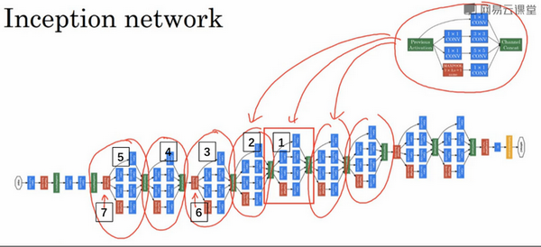

這是一張取自**Szegety et al**的論文中關於**Inception**網路的圖片，你會發現圖中有許多重複的模組，可能整張圖看起來很複雜，但如果你只截取其中一個環節（編號1），就會發現這是在前一頁**ppt**中所見的**Inception**模組。

我們深入看看裡面的一些細節，這是另一個**Inception**模組（編號2），這也是一個**Inception**模組（編號3）。這裡有一些額外的最大池化層（編號6）來修改高和寬的維度。這是另外一個**Inception**模組（編號4），這是另外一個最大池化層（編號7），它改變了高和寬。而這裡又是另一個**Inception**模組（編號5）。

所以**Inception**網路只是很多這些你學過的模組在不同的位置重複組成的網路，所以如果你理解了之前所學的**Inception**模組，你就也能理解**Inception**網路。

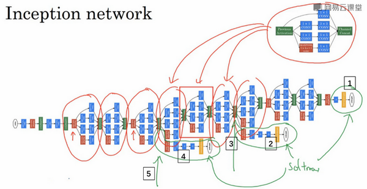

事實上，如果你讀過論文的原文，你就會發現，這裡其實還有一些分支，我現在把它們加上去。所以這些分支有什麼用呢？在網路的最後幾層，通常稱為全連接層，在它之後是一個**softmax**層（編號1）來做出預測，這些分支（編號2）所做的就是透過隱藏層（編號3）來做出預測，所以這其實是一個**softmax**輸出（編號2），這（編號1）也是。這是另一條分支（編號4），它也包含了一個隱藏層，通過一些全連接層，然後有一個**softmax**來預測，輸出結果的標籤。

你應該把它看做**Inception**網路的一個細節，它確保了即便是隱藏單元和中間層（編號5）也參與了特徵計算，它們也能預測圖片的分類。它在**Inception**網路中，起到一種調整的效果，並且能防止網路發生過擬合。

還有這個特別的**Inception**網路是由**Google**公司的作者所研發的，它被叫做**GoogleLeNet**，這個名字是為了向**LeNet**網路致敬。在之前的影片中你應該了解了**LeNet**網路。我覺得這樣非常好，因為深度學習研究人員是如此重視協作，深度學習工作者對彼此的工作成果有一種強烈的敬意。

最後，有個有趣的事實，**Inception**網路這個名字又是緣何而來呢？**Inception**的論文特地提到了這個模因（**meme**，網路用語即“梗”），就是“我們需要走的更深”（**We need to go deeper**），論文還引用了這個網址（<http://knowyourmeme.com/memes/we-need-to-go-deeper>），連接到這幅圖片上，如果你看過**Inception**（**盜夢空間**）這個電影，你應該能看懂這個由來。作者其實是透過它來表明了建立更深的神經網路的決心，他們正是這樣構建了**Inception**。我想一般研究論文，通常不會引用網路流行模因（梗），但這裡顯然很合適。

最後總結一下，如果你理解了**Inception**模組，你就能理解**Inception**網路，無非是很多個**Inception**模組一環接一環，最後組成了網路。自從**Inception**模組誕生以來，經過研究者們的不斷發展，衍生了許多新的版本。所以在你們看一些比較新的**Inception**算法的論文時，會發現人們使用這些新版本的算法效果也一樣很好，比如**Inception V2**、**V3**以及**V4**，還有一個版本引入了跳躍連接的方法，有時也會有特別好的效果。但所有的這些變體都建立在同一種基礎的思想上，在之前的影片中你就已經學到過，就是把許多**Inception**模組透過某種方式連接到一起。通過這個影片，我想你應該能去閱讀和理解這些**Inception**的論文，甚至是一些新版本的論文。

直到現在，你已經了解了許多專用的神經網路結構。在下節影片中，我將會告訴你們如何真正去使用這些算法來構建自己的計算機視覺系統，我們下節影片再見。

### 2.8 使用開源的實現方案（Using open-source implementations）

你現在已經學過幾個非常有效的神經網路和**ConvNet**架構，在接下來的幾段影片中我想與你分享幾條如何使用它們的實用性建議，首先從使用開放原始碼的實現開始。

事實證明很多神經網路複雜細緻，因而難以複製，因為一些參數調整的細節問題，例如學習率衰減等等，會影響性能。所以我發現有些時候，甚至在頂尖大學學習AI或者深度學習的博士生也很難透過閱讀別人的研究論文來複製他人的成果。幸運的是有很多深度學習的研究者都習慣把自己的成果作為開發資源，放在像**GitHub**之類的網站上。當你自己編寫程式碼時，我鼓勵你考慮一下將你的代碼貢獻給開源社區。如果你看到一篇研究論文想應用它的成果，你應該考慮做一件事，我經常做的就是在網路上尋找一個開源的實現。因為你如果能得到作者的實現，通常要比你從頭開始實現要快得多，雖然從零開始實現肯定可以是一個很好的鍛鍊。

如果你已經熟悉如何使用**GitHub**，這段影片對你來說可能沒什麼必要或者沒那麼重要。但是如果你不習慣從**GitHub**下載開原始碼，讓我來示範一下。

（整理者註：**ResNets**實現的**GitHub**地址<https://github.com/KaimingHe/deep-residual-networks>）

假設你對殘差網路感興趣，那就讓我們搜索**GitHub**上的**ResNets**，那麼你可以在**GitHub**看到很多不同的ResNet的實現。我就打開這裡的第一個網址，這是一個**ResNets**實現的**GitHub**資源庫。在很多**GitHub**的網頁上往下翻，你會看到一些描述，這個實現的文字說明。這個**GitHub**資源庫，實際上是由**ResNet**論文原作者上傳的。這些程式碼，這裡有麻省理工學院的許可，你可以點擊查看此許可的含義，**MIT**許可是比較開放的開源許可之一。我將下載代碼，點擊這裡的連結，它會給你一個**URL**，通過這個你可以下載這個代碼。

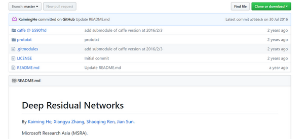

我點擊這裡的按鈕（**Clone or download**），將這個**URL**複製到我的剪切板裡。

（整理者註：**NG**此處使用的是**linux**系統的**bash**命令行，對於**win10**系統，可以開啟**linux**子系統功能，然後在**win10**應用商店下載**ubuntu**安裝，運行**CMD**，輸入命令**bash**即可進入**linux**的**bash**命令行）

接著到這裡，接下來你要做的就是輸入**git clone**，接著黏貼**URL**，按下回車，幾秒之內就將這個資源庫的副本下載到我的本機硬碟裡。

讓我們進入目錄，讓我們看一下，比起**Windows**，我更習慣用**Mac**，不過沒關係，讓我們試一下，讓我們進入**prototxt**，我認為這就是存放這些網路文件的地方。讓我們看一下這個文件。因為這個文件很長，包含了**ResNet**裡101層的詳細配置。我記得，從這個網頁上看到這個特殊實現使用了**Caffe**框架。但如果你想透過其它編程框架來實現這一代碼，你也可以嘗試尋找一下。

如果你在開發一個計算機視覺應用，一個常見的工作流程是，先選擇一個你喜歡的架構，或許是你在這門課中學習到的，或者是你從朋友那聽說的，或者是從文獻中看到的，接著尋找一個開源實現，從**GitHub**下載下來，以此基礎開始構建。這樣做的優點在於，這些網路通常都需要很長的時間來訓練，而或許有人已經使用多個**GPU**，通過龐大的數據集預先訓練了這些網路，這樣一來你就可以使用這些網路進行遷移學習，我們將在下一節課討論這些內容。

當然，如果你是一名計算機視覺研究員，從零來實現這些，那麼你的工作流程將會不同，如果你自己構建，那麼希望你將工作成果貢獻出來，放到開源社區。因為已經有如此多計算機視覺研究者為了實現這些架構做了如此之多的工作，我發現從開源項目上開始是一個更好的方法，它也確實是一個更快開展新項目的方法。

### 2.9 遷移學習（Transfer Learning）

如果你要做一個計算機視覺的應用，相比於從頭訓練權重，或者說從隨機初始化權重開始，如果你下載別人已經訓練好網路結構的權重，你通常能夠進展的相當快，用這個作為預訓練，然後轉換到你感興趣的任務上。計算機視覺的研究社區非常喜歡把許多數據集上傳到網上，如果你聽說過，比如**ImageNet**，或者**MS COCO**，或者**Pascal**類型的數據集，這些都是不同數據集的名字，它們都是由大家上傳到網路的，並且有大量的計算機視覺研究者已經用這些數據集訓練過他們的算法了。有時候這些訓練過程需要花費好幾週，並且需要很多的**GPU**，其它人已經做過了，並且經歷了非常痛苦的尋最優過程，這就意味著你可以下載花費了別人好幾週甚至幾個月而做出來的開源的權重參數，把它當作一個很好的初始化用在你自己的神經網路上。用遷移學習把公共的數據集的知識遷移到你自己的問題上，讓我們看一下怎麼做。

舉個例子，假如說你要建立一個貓咪檢測器，用來檢測你自己的寵物貓。比如網路上的**Tigger**，是一個常見的貓的名字，**Misty**也是比較常見的貓名字。假如你的兩隻貓叫**Tigger**和**Misty**，還有一種情況是，兩者都不是。所以你現在有一個三分類問題，圖片裡是**Tigger**還是**Misty**，或者都不是，我們忽略兩隻貓同時出現在一張圖片裡的情況。現在你可能沒有**Tigger**或者**Misty**的大量的圖片，所以你的訓練集會很小，你該怎麼辦呢？

我建議你從網上下載一些神經網路開源的實現，不僅把代碼下載下來，也把權重下載下來。有許多訓練好的網路，你都可以下載。舉個例子，**ImageNet**數據集，它有1000個不同的類別，因此這個網路會有一個**Softmax**單元，它可以輸出1000個可能類別之一。

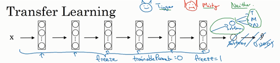

你可以去掉這個**Softmax**層，創建你自己的**Softmax**單元，用來輸出**Tigger**、**Misty**和**neither**三個類別。就網路而言，我建議你把所有的層看作是凍結的，你凍結網路中所有層的參數，你只需要訓練和你的**Softmax**層有關的參數。這個**Softmax**層有三種可能的輸出，**Tigger**、**Misty**或者都不是。

透過使用其他人預訓練的權重，你很可能得到很好的性能，即使只有一個小的數據集。幸運的是，大多數深度學習框架都支持這種操作，事實上，取決於用的框架，它也許會有`trainableParameter=0`這樣的參數，對於這些前面的層，你可能會設置這個參數。為了不訓練這些權重，有時也會有`freeze=1`這樣的參數。不同的深度學習程式框架有不同的方式，允許你指定是否訓練特定層的權重。在這個例子中，你只需要訓練**softmax**層的權重，把前面這些層的權重都凍結。

另一個技巧，也許對一些情況有用，由於前面的層都凍結了，相當於一個固定的函數，不需要改變。因為你不需要改變它，也不訓練它，取輸入圖像$X$，然後把它映射到這層（**softmax**的前一層）的啟動函數。所以這個能加速訓練的技巧就是，如果我們先計算這一層（紫色箭頭標記），計算特徵或者啟動值，然後把它們存到硬碟裡。你所做的就是用這個固定的函數，在這個神經網路的前半部分（**softmax**層之前的所有層視為一個固定映射），取任意輸入圖像$X$，然後計算它的某個特徵向量，這樣你訓練的就是一個很淺的**softmax**模型，用這個特徵向量來做預測。對你的計算有用的一步就是對你的訓練集中所有樣本的這一層的啟動值進行預計算，然後存儲到硬碟裡，然後在此之上訓練**softmax**分類器。所以，存儲到硬碟或者說預計算方法的優點就是，你不需要每次遍歷訓練集再重新計算這個啟動值了。

因此如果你的任務只有一個很小的數據集，你可以這樣做。要有一個更大的訓練集怎麼辦呢？根據經驗，如果你有一個更大的標定的數據集，也許你有大量的**Tigger**和**Misty**的照片，還有兩者都不是的，這種情況，你應該凍結更少的層，比如只把這些層凍結，然後訓練後面的層。如果你的輸出層的類別不同，那麼你需要構建自己的輸出單元，**Tigger**、**Misty**或者兩者都不是三個類別。有很多方式可以實現，你可以取後面幾層的權重，用作初始化，然後從這裡開始梯度下降。

或者你可以直接去掉這幾層，換成你自己的隱藏單元和你自己的**softmax**輸出層，這些方法值得一試。但是有一個規律，如果你有越來越多的數據，你需要凍結的層數越少，你能夠訓練的層數就越多。這個理念就是，如果你有一個更大的數據集，也許有足夠多的數據，那麼不要單單訓練一個**softmax**單元，而是考慮訓練中等大小的網路，包含你最終要用的網路的後面幾層。

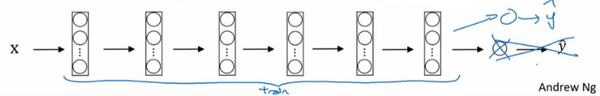

最後，如果你有大量數據，你應該做的就是用開源的網路和它的權重，把這、所有的權重當作初始化，然後訓練整個網路。再次注意，如果這是一個1000節點的**softmax**，而你只有三個輸出，你需要你自己的**softmax**輸出層來輸出你要的標籤。

如果你有越多的標定的數據，或者越多的**Tigger**、**Misty**或者兩者都不是的圖片，你可以訓練越多的層。極端情況下，你可以用下載的權重只作為初始化，用它們來代替隨機初始化，接著你可以用梯度下降訓練，更新網路所有層的所有權重。

這就是卷積網路訓練中的遷移學習，事實上，網上的公開數據集非常龐大，並且你下載的其他人已經訓練好幾週的權重，已經從數據中學習了很多了，你會發現，對於很多計算機視覺的應用，如果你下載其他人的開源的權重，並用作你問題的初始化，你會做的更好。在所有不同學科中，在所有深度學習不同的應用中，我認為計算機視覺是一個你經常用到遷移學習的領域，除非你有非常非常大的數據集，你可以從頭開始訓練所有的東西。總之，遷移學習是非常值得你考慮的，除非你有一個極其大的數據集和非常大的計算量預算來從頭訓練你的網路。

### 2.10 數據增強（Data augmentation）

大部分的計算機視覺任務使用很多的數據，所以數據擴充是經常使用的一種技巧來提高計算機視覺系統的表現。我認為計算機視覺是一個相當複雜的工作，你需要輸入圖像的像素值，然後弄清楚圖片中有什麼，似乎你需要學習一個複雜方程來做這件事。在實踐中，更多的數據對大多數計算機視覺任務都有所幫助，不像其他領域，有時候得到充足的數據，但是效果並不怎麼樣。但是，當下在計算機視覺方面，計算機視覺的主要問題是沒有辦法得到充足的數據。對大多數機器學習應用，這不是問題，但是對計算機視覺，數據就遠遠不夠。所以這就意味著當你訓練計算機視覺模型的時候，數據擴充會有所幫助，這是可行的，無論你是使用遷移學習，使用別人的預訓練模型開始，或者從原始碼開始訓練模型。讓我們來看一下計算機視覺中常見的數據擴充的方法。

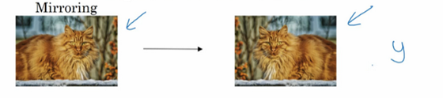

或許最簡單的數據擴充方法就是垂直鏡像對稱，假如，訓練集中有這張圖片，然後將其翻轉得到右邊的圖像。對大多數計算機視覺任務，左邊的圖片是貓，然後鏡像對稱仍然是貓，如果鏡像操作保留了圖像中想識別的物體的前提下，這是個很實用的數據擴充技巧。

另一個經常使用的技巧是隨機裁剪，給定一個數據集，然後開始隨機裁剪，可能修剪這個（編號1），選擇裁剪這個（編號2），這個（編號3），可以得到不同的圖片放在數據集中，你的訓練集中有不同的裁剪。隨機裁剪並不是一個完美的數據擴充的方法，如果你隨機裁剪的那一部分（紅色方框標記部分，編號4），這部分看起來不像貓。但在實踐中，這個方法還是很實用的，隨機裁剪構成了很大一部分的真實圖片。

鏡像對稱和隨機裁剪是經常被使用的。當然，理論上，你也可以使用旋轉，剪切（**shearing**：此處並非裁剪的含義，圖像僅水平或垂直坐標發生變化）圖像，可以對圖像進行這樣的扭曲變形，引入很多形式的局部彎曲等等。當然使用這些方法並沒有壞處，儘管在實踐中，因為太複雜了所以使用的很少。

第二種經常使用的方法是彩色轉換，有這樣一張圖片，然後給**R**、**G**和**B**三個通道上加上不同的失真值。

在這個例子中（編號1），要給紅色、藍色通道加值，給綠色通道減值。紅色和藍色會產生紫色，使整張圖片看起來偏紫，這樣訓練集中就有失真的圖片。為了示範效果，我對圖片的顏色進行改變比較誇張。在實踐中，對**R**、**G**和**B**的變化是基於某些分布的，這樣的改變也可能很小。

這麼做的目的就是使用不同的**R**、**G**和**B**的值，使用這些值來改變顏色。在第二個例子中（編號2），我們少用了一點紅色，更多的綠色和藍色色調，這就使得圖片偏黃一點。

在這（編號3）使用了更多的藍色，僅僅多了點紅色。在實踐中，**R**、**G**和**B**的值是根據某種機率分布來決定的。這麼做的理由是，可能陽光會有一點偏黃，或者是燈光照明有一點偏黃，這些可以輕易的改變圖像的顏色，但是對貓的識別，或者是內容的識別，以及標籤$y$，還是保持不變的。所以介紹這些，顏色失真或者是顏色變換方法，這樣會使得你的學習算法對照片的顏色更改更具強健性。

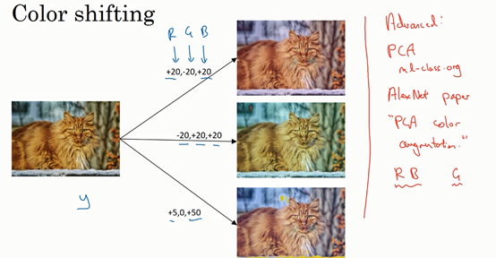

這是對更高級的學習者的一些注意提醒，你可以不理解我用紅色標出來的內容。對**R、G和B**有不同的採樣方式，其中一種影響顏色失真的算法是**PCA**，即主成分分析，我在機器學習的**mooc**中講過，在**Coursera ml-class.Org**機器學習這門課中。但具體顏色改變的細節在**AlexNet**的論文中有時候被稱作**PCA**顏色增強，**PCA**顏色增強的大概含義是，比如說，如果你的圖片呈現紫色，即主要含有紅色和藍色，綠色很少，然後**PCA**顏色增強算法就會對紅色和藍色增減很多，綠色變化相對少一點，所以使總體的顏色保持一致。如果這些你都不懂，不需要擔心，可以在網上搜索你想要了解的東西，如果你願意的話可以閱讀**AlexNet**論文中的細節，你也能找到**PCA**顏色增強的開源實現方法，然後直接使用它。

你可能有存儲好的數據，你的訓練數據存在硬碟上，然後使用符號，這個圓桶來表示你的硬碟。如果你有一個小的訓練數據，你可以做任何事情，這些數據集就夠了。

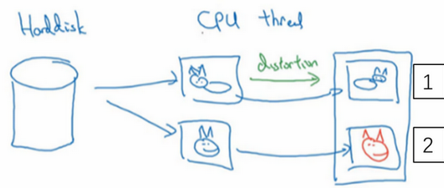

但是你有特別大的訓練數據，接下來這些就是人嗎經常使用的方法。你可能會使用**CPU**執行緒，然後它不停的從硬碟中讀取數據，所以你有一個從硬碟過來的圖片數據流。你可以用**CPU**執行緒來實現這些失真變形，可以是隨機裁剪、顏色變化，或者是鏡像。但是對每張圖片得到對應的某一種變形失真形式，看這張圖片（編號1），對其進行鏡像變換，以及使用顏色失真，這張圖最後會顏色變化（編號2），從而得到不同顏色的貓。

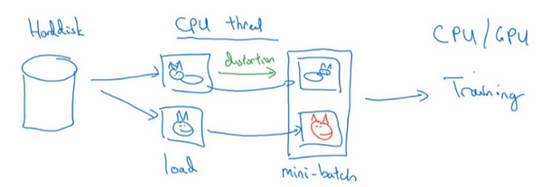

與此同時，**CPU**執行緒持續載入數據，然後實現任意失真變形，從而構成批數據或者最小批數據，這些數據持續的傳輸給其他執行緒或者其他的進程，然後開始訓練，可以在**CPU**或者**GPU**上實現訓一個大型網路的訓練。

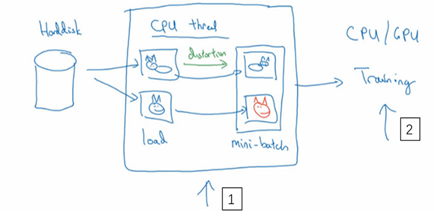

常用的實現數據擴充的方法是使用一個執行緒或者是多執行緒，這些可以用來載入數據，實現變形失真，然後傳給其他的執行緒或者其他進程，來訓練這個（編號2）和這個（編號1），可以並行實現。

這就是數據擴充，與訓練深度神經網路的其他部分類似，在數據擴充過程中也有一些超參數，比如說顏色變化了多少，以及隨機裁剪的時候使用的參數。與計算機視覺其他部分類似，一個好的開始可能是使用別人的開源實現，了解他們如何實現數據擴充。當然如果你想獲得更多的不變特性，而其他人的開源實現並沒有實現這個，你也可以去調整這些參數。因此，我希望你們可以使用數據擴充使你的計算機視覺應用效果更好。

### 2.11 計算機視覺現狀（The state of computer vision）

深度學習已經成功地應用於計算機視覺、自然語言處理、語音識別、在線廣告、物流還有其他許多問題。在計算機視覺的現狀下，深度學習應用於計算機視覺應用有一些獨特之處。在這個影片中，我將和你們分享一些我對深度學習在計算機視覺方面應用的認識，希望能幫助你們更好地理解計算機視覺作品（此處指計算機視覺或者數據競賽中的模型）以及其中的想法，以及如何自己構建這些計算機視覺系統。

你可以認為大部分機器學習問題是介於少量數據和大量數據範圍之間的。舉個例子，我認為今天我們有相當數量的語音識別數據，至少相對於這個問題的複雜性而言。雖然現在圖像識別或圖像分類方面有相當大的數據集，因為圖像識別是一個複雜的問題，通過分析像素並識別出它是什麼，感覺即使線上數據集非常大，如超過一百萬張圖片，我們仍然希望我們能有更多的數據。還有一些問題，比如物體檢測，我們擁有的數據更少。提醒一下，圖像識別其實是如何看圖片的問題，並且告訴你這張圖是不是貓，而對象檢測則是看一幅圖，你畫一個框，告訴你圖片裡的物體，比如汽車等等。因為獲取邊框的成本比標記對象的成本更高，所以我們進行對象檢測的數據往往比圖像識別數據要少，對象檢測是我們下週要討論的內容。

所以，觀察一下機器學習數據範圍圖譜，你會發現當你有很多數據時，人們傾向於使用更簡單的算法和更少的手工工程，因為我們不需要為這個問題精心設計特徵。當你有大量的數據時，只要有一個大型的神經網路，甚至一個更簡單的架構，可以是一個神經網路，就可以去學習它想學習的東西。

相反當你沒有那麼多的數據時，那時你會看到人們從事更多的是手工工程，低調點說就是你有很多小技巧可用（整理者註：在機器學習或者深度學習中，一般更崇尚更少的人工處理，而手工工程更多依賴人工處理，注意領會Andrew NG的意思）。但我認為每你沒有太多數據時，手工工程實際上是獲得良好表現的最佳方式。

所以當我看機器學習應用時，我們認為通常我們的學習算法有兩種知識來源，一個來源是被標記的數據，就像$(x，y)$應用在監督學習。第二個知識來源是手工工程，有很多方法去建立一個手工工程系統，它可以是源於精心設計的特徵，手工精心設計的網路體系結構或者是系統的其他組件。所以當你沒有太多標籤數據時，你只需要更多地考慮手工工程。

所以我認為計算機視覺是在試圖學習一個非常複雜的功能，我們經常感覺我們沒有足夠的數據，即使獲得了更多數據，我們還是經常覺得還是沒有足夠的數據來滿足需求。這就是為什麼計算機視覺，從過去甚至到現在都更多地依賴於手工工程。我認為這也是計算機視覺領域發展相當複雜網路架構地原因，因為在缺乏更多數據的情況下，獲得良好表現的方式還是花更多時間進行架構設計，或者說在網路架構設計上浪費（貶義褒用，即需要花費更多時間的意思）更多時間。

如果你認為我是在貶低手工工程，那並不是我的意思，當你沒有足夠的數據時，手工工程是一項非常困難，非常需要技巧的任務，它需要很好的洞察力，那些對手工工程有深刻見解的人將會得到更好的表現。當你沒有足夠的數據時，手工工程對一個項目來說貢獻就很大。當你有很多數據的時候我就不會花時間去做手工工程，我會花時間去建立學習系統。但我認為從歷史而言，計算機視覺領域還只是使用了非常小的數據集，因此從歷史上來看計算機視覺還是依賴於大量的手工工程。甚至在過去的幾年裡，計算機視覺任務的數據量急劇增加，我認為這導致了手工工程量大幅減少，但是在計算機視覺上仍然有很多的網路架構使用手工工程，這就是為什麼你會在計算機視覺中看到非常複雜的超參數選擇，比你在其他領域中要複雜的多。實際上，因為你通常有比圖像識別數據集更小的對象檢測數據集，當我們談論對象檢測時，其實這是下週的任務，你會看到算法變得更加複雜，而且有更多特殊的組件。

幸運的是，當你有少量的數據時，有一件事對你很有幫助，那就是遷移學習。我想說的是，在之前的幻燈片中，**Tigger**、**Misty**或者二者都不是的檢測問題中，我們有這麼少的數據，遷移學習會有很大幫助。這是另一套技術，當你有相對較少的數據時就可以用很多相似的數據。

如果你看一下計算機視覺方面的作品，看看那裡的創意，你會發現人們真的是躊躇滿志，他們在基準測試中和競賽中表現出色。對計算機視覺研究者來說，如果你在基準上做得很好了，那就更容易發表論文了，所以有許多人致力於這些基準上，把它做得很好。積極的一面是，它有助於整個社區找出最有效得算法。但是你在論文上也看到，人們所做的事情讓你在數據基準上表現出色，但你不會真正部署在一個實際得應用程式用在生產或一個系統上。

（整理著註：**Benchmark** 基準測試，**Benchmark**是一個評價方式，在整個計算機領域有著長期的應用。維基百科上解釋：“As computer architecture advanced, it became more difficult to compare the performance of various computer systems simply by looking at their specifications.Therefore, tests were developed that allowed comparison of different architectures.”Benchmark在計算機領域應用最成功的就是性能測試，主要測試負載的執行時間、傳輸速度、吞吐量、資源占用率等。）

下面是一些有助於在基準測試中表現出色的小技巧，這些都是我自己從來沒使用過的東西，如果我把一個系統投入生產，那就是為客戶服務。

其中一個是集成，這就意味著在你想好了你想要的神經網路之後，可以獨立訓練幾個神經網路，並平均它們的輸出。比如說隨機初始化三個、五個或者七個神經網路，然後訓練所有這些網路，然後平均它們的輸出。另外對他們的輸出$\hat y$進行平均計算是很重要的，不要平均他們的權重，這是行不通的。看看你的7個神經網路，它們有7個不同的預測，然後平均他們，這可能會讓你在基準上提高1%，2%或者更好。這會讓你做得更好，也許有時會達到1%或2%，這真的能幫助你贏得比賽。但因為集成意味著要對每張圖片進行測試，你可能需要在從3到15個不同的網路中運行一個圖像，這是很典型的，因為這3到15個網路可能會讓你的運行時間變慢，甚至更多時間，所以技巧之一的集成是人們在基準測試中表現出色和贏得比賽的利器，但我認為這幾乎不用於生產服務於客戶的，我想除非你有一個巨大的計算預算而且不介意在每個用戶圖像數據上花費大量的計算。

你在論文中可以看到在測試時，對進准測試有幫助的另一個技巧就是**Multi-crop at test time**，我的意思是你已經看到了如何進行數據擴充，**Multi-crop**是一種將數據擴充應用到你的測試圖像中的一種形式。

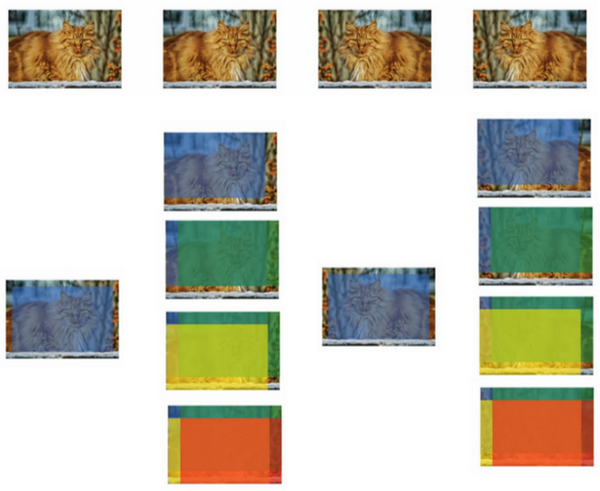

舉個例子，讓我們看看貓的圖片，然後把它複製四遍，包括它的兩個鏡像版本。有一種叫作**10-crop**的技術（**crop**理解為裁剪的意思），它基本上說，假設你取這個中心區域，裁剪，然後通過你的分類器去運行它，然後取左上角區域，運行你的分類器，右上角用綠色表示，左下方用黃色表示，右下方用橙色表示，透過你的分類器來運行它，然後對鏡像圖像做同樣的事情對吧？所以取中心的**crop**，然後取四個角落的**crop**。

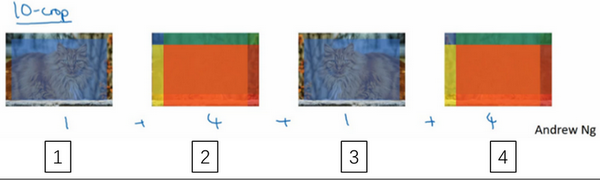

這是這裡（編號1）和這裡（編號3）就是中心**crop**，這裡（編號2）和這裡（編號4）就是四個角落的**crop**。如果把這些加起來，就會有10種不同的圖像的**crop**，因此命名為**10-crop**。所以你要做的就是，透過你的分類器來運行這十張圖片，然後對結果進行平均。如果你有足夠的計算預算，你可以這麼做，也許他們需要10個**crops**，你可以使用更多，這可能會讓你在生產系統中獲得更好的性能。如果是生產的話，我的意思還是實際部署用戶的系統。但這是另一種技術，它在基準測試上的應用，要比實際生產系統中好得多。

集成的一個大問題是你需要保持所有這些不同的神經網路，這就占用了更多的計算機記憶體。對於**multi-crop**，我想你只保留一個網路，所以它不會占用太多的記憶體，但它仍然會讓你的運行時間變慢。

這些是你看到的小技巧，研究論文也可以參考這些，但我個人並不傾向於在構建生產系統時使用這些方法，儘管它們在基準測試和競賽上做得很好。

由於計算機視覺問題建立在小數據集之上，其他人已經完成了大量的網路架構的手工工程。一個神經網路在某個計算機視覺問題上很有效，但令人驚訝的是它通常也會解決其他計算機視覺問題。

所以，要想建立一個實用的系統，你最好先從其他人的神經網路架構入手。如果可能的話，你可以使用開源的一些應用，因為開放的原始碼實現可能已經找到了所有繁瑣的細節，比如學習率衰減方式或者超參數。

最後，其他人可能已經在幾路**GPU**上花了幾個星期的時間來訓練一個模型，訓練超過一百萬張圖片，所以透過使用其他人的預先訓練得模型，然後在數據集上進行微調，你可以在應用程式上運行得更快。當然如果你有電腦資源並且有意願，我不會阻止你從頭開始訓練你自己的網路。事實上，如果你想發明你自己的計算機視覺算法，這可能是你必須要做的。

這就是本週的學習，我希望看到大量的計算機視覺架構能夠幫助你理解什麼是有效的。在本週的程式練習中，你實際上會學習另一種編程框架，並使用它來實現**ResNets**。所以我希望你們喜歡這個編程練習，我期待下週還能見到你們。

**參考文獻：**

- Kaiming He, Xiangyu Zhang, Shaoqing Ren, Jian Sun - [Deep Residual Learning for Image Recognition (2015)](https://arxiv.org/abs/1512.03385)
- Francois Chollet's github repository: <https://github.com/fchollet/deep-learning-models/blob/master/resnet50.py>