第三週 目標檢測（Object detection）
------------------------------------------------------------------------
[TOC]
### 3.1 目標定位（Object localization）

大家好，歡迎回來，這一週我們學習的主要內容是對象檢測，它是計算機視覺領域中一個新興的應用方向，相比前兩年，它的性能越來越好。在構建對象檢測之前，我們先了解一下對象定位，首先我們看看它的定義。

圖片分類任務我們已經熟悉了，就是算法遍歷圖片，判斷其中的對象是不是汽車，這就是圖片分類。這節課我們要學習構建神經網路的另一個問題，即定位分類問題。這意味著，我們不僅要用算法判斷圖片中是不是一輛汽車，還要在圖片中標記出它的位置，用邊框或紅色方框把汽車圈起來，這就是定位分類問題。其中“定位”的意思是判斷汽車在圖片中的具體位置。這週後面幾天，我們再講講當圖片中有多個對象時，應該如何檢測它們，並確定出位置。比如，你正在做一個自動駕駛程序，程序不但要檢測其它車輛，還要檢測其它對象，如行人、摩托車等等，稍後我們再詳細講。

本週我們要研究的分類定位問題，通常只有一個較大的對象位於圖片中間位置，我們要對它進行識別和定位。而在對象檢測問題中，圖片可以含有多個對象，甚至單張圖片中會有多個不同分類的對象。因此，圖片分類的思路可以幫助學習分類定位，而對象定位的思路又有助於學習對象檢測，我們先從分類和定位開始講起。

圖片分類問題你已經並不陌生了，例如，輸入一張圖片到多層卷積神經網路。這就是卷積神經網路，它會輸出一個特徵向量，並回饋給**softmax**單元來預測圖片類型。

如果你正在構建汽車自動駕駛系統，那麼對象可能包括以下幾類：行人、汽車、摩托車和背景，這意味著圖片中不含有前三種對象，也就是說圖片中沒有行人、汽車和摩托車，輸出結果會是背景對象，這四個分類就是softmax函數可能輸出的結果。

這就是標準的分類過程，如果你還想定位圖片中汽車的位置，該怎麼做呢？我們可以讓神經網路多輸出幾個單元，輸出一個邊界框。具體說就是讓神經網路再多輸出4個數字，標記為$b_{x}$,$b_{y}$,$b_{h}$和$b_{w}$，這四個數字是被檢測對象的邊界框的參數化表示。

我們先來約定本週課程將使用的符號表示，圖片左上角的坐標為$(0,0)$，右下角標記為$(1,1)$。要確定邊界框的具體位置，需要指定紅色方框的中心點，這個點表示為($b_{x}$,$b_{y}$)，邊界框的高度為$b_{h}$，寬度為$b_{w}$。因此訓練集不僅包含神經網路要預測的對象分類標籤，還要包含表示邊界框的這四個數字，接著採用監督學習算法，輸出一個分類標籤，還有四個參數值，從而給出檢測對象的邊框位置。此例中，$b_{x}$的理想值是0.5，因為它表示汽車位於圖片水平方向的中間位置；$b_{y}$大約是0.7，表示汽車位於距離圖片底部$\frac{3}{10}$的位置；$b_{h}$約為0.3，因為紅色方框的高度是圖片高度的0.3倍；$b_{w}$約為0.4，紅色方框的寬度是圖片寬度的0.4倍。

下面我再具體講講如何為監督學習任務定義目標標籤 $y$。

請注意，這有四個分類，神經網路輸出的是這四個數字和一個分類標籤，或分類標籤出現的機率。目標標籤$y$的定義如下：$y= \ \begin{bmatrix} p_{c} \\ b_{x} \\ b_{y} \\ b_{h} \\ b_{w} \\ c_{1} \\ c_{2}\\ c_{3} \\\end{bmatrix}$

它是一個向量，第一個組件$p_{c}$表示是否含有對象，如果對象屬於前三類（行人、汽車、摩托車），則$p_{c}= 1$，如果是背景，則圖片中沒有要檢測的對象，則$p_{c} =0$。我們可以這樣理解$p_{c}$，它表示被檢測對象屬於某一分類的機率，背景分類除外。

如果檢測到對象，就輸出被檢測對象的邊界框參數$b_{x}$、$b_{y}$、$b_{h}$和$b_{w}$。最後，如果存在某個對象，那麼$p_{c}=1$，同時輸出$c_{1}$、$c_{2}$和$c_{3}$，表示該對象屬於1-3類中的哪一類，是行人，汽車還是摩托車。鑑於我們所要處理的問題，我們假設圖片中只含有一個對象，所以針對這個分類定位問題，圖片最多只會出現其中一個對象。

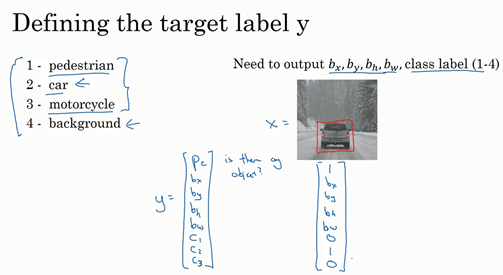

我們再看幾個樣本，假如這是一張訓練集圖片，標記為$x$，即上圖的汽車圖片。而在$y$當中，第一個元素$p_{c} =1$，因為圖中有一輛車，$b_{x}$、$b_{y}$、$b_{h}$和$b_{w}$會指明邊界框的位置，所以標籤訓練集需要標籤的邊界框。圖片中是一輛車，所以結果屬於分類2，因為定位目標不是行人或摩托車，而是汽車，所以$c_{1}= 0$，$c_{2} = 1$，$c_{3} =0$，$c_{1}$、$c_{2}$和$c_{3}$中最多只有一個等於1。

這是圖片中只有一個檢測對象的情況，如果圖片中沒有檢測對象呢？如果訓練樣本是這樣一張圖片呢？

這種情況下，$p_{c} =0$，$y$的其它參數將變得毫無意義，這裡我全部寫成問號，表示“毫無意義”的參數，因為圖片中不存在檢測對象，所以不用考慮網路輸出中邊界框的大小，也不用考慮圖片中的對象是屬於$c_{1}$、$c_{2}$和$c_{3}$中的哪一類。針對給定的被標記的訓練樣本，不論圖片中是否含有定位對象，構建輸入圖片$x$和分類標籤$y$的具體過程都是如此。這些數據最終定義了訓練集。

最後，我們介紹一下神經網路的損失函數，其參數為類別$y$和網路輸出$\hat{y}$，如果採用平方誤差策略，則$L\left(\hat{y},y \right) = \left( \hat{y_1} - y_{1} \right)^{2} + \left(\hat{y_2} - y_{2}\right)^{2} + \ldots\left( \hat{y_8} - y_{8}\right)^{2}$，損失值等於每個元素相應差值的平方和。

如果圖片中存在定位對象，那麼$y_{1} = 1$，所以$y_{1} =p_{c}$，同樣地，如果圖片中存在定位對象，$p_{c} =1$，損失值就是不同元素的平方和。

另一種情況是，$y_{1} = 0$，也就是$p_{c} = 0$，損失值是$\left(\hat{y_1} - y_{1}\right)^{2}$，因為對於這種情況，我們不用考慮其它元素，只需要關注神經網路輸出$p_{c}$的準確度。

回顧一下，當$y_{1} =1$時，也就是這種情況（編號1），平方誤差策略可以減少這8個元素預測值和實際輸出結果之間差值的平方。如果$y_{1}=0$，$y$  矩陣中的後7個元素都不用考慮（編號2），只需要考慮神經網路評估$y_{1}$（即$p_{c}$）的準確度。

為了讓大家了解對象定位的細節，這裡我用平方誤差簡化了描述過程。實際應用中，你可以不對$c_{1}$、$c_{2}$、$c_{3}$和**softmax**啟動函數應用對數損失函數，並輸出其中一個元素值，通常做法是對邊界框坐標應用平方差或類似方法，對$p_{c}$應用邏輯回歸函數，甚至採用平方預測誤差也是可以的。

以上就是利用神經網路解決對象分類和定位問題的詳細過程，結果證明，利用神經網路輸出批次實數來識別圖片中的對象是個非常有用的算法。下節課，我想和大家分享另一種思路，就是把神經網路輸出的實數集作為一個回歸任務，這個思想也被應用於計算機視覺的其它領域，也是非常有效的，所以下節課見。

### 3.2 特徵點檢測（Landmark detection）

上節課，我們講了如何利用神經網路進行對象定位，即通過輸出四個參數值$b_{x}$、$b_{y}$、$b_{h}$和$b_{w}$給出圖片中對象的邊界框。更概括地說，神經網路可以通過輸出圖片上特徵點的$(x,y)$坐標來實現對目標特徵的識別，我們看幾個例子。

假設你正在構建一個人臉識別應用，出於某種原因，你希望算法可以給出眼角的具體位置。眼角坐標為$(x,y)$，你可以讓神經網路的最後一層多輸出兩個數字$l_{x}$和$l_{y}$，作為眼角的坐標值。如果你想知道兩隻眼睛的四個眼角的具體位置，那麼從左到右，依次用四個特徵點來表示這四個眼角。對神經網路稍做些修改，輸出第一個特徵點（$l_{1x}$，$l_{1y}$），第二個特徵點（$l_{2x}$，$l_{2y}$），依此類推，這四個臉部特徵點的位置就可以透過神經網路輸出了。

也許除了這四個特徵點，你還想得到更多的特徵點輸出值，這些（圖中眼眶上的紅色特徵點）都是眼睛的特徵點，你還可以根據嘴部的關鍵點輸出值來確定嘴的形狀，從而判斷人物是在微笑還是皺眉，也可以提取鼻子周圍的關鍵特徵點。為了便於說明，你可以設定特徵點的個數，假設臉部有64個特徵點，有些點甚至可以幫助你定義臉部輪廓或下頜輪廓。選定特徵點個數，並生成包含這些特徵點的標籤訓練集，然後利用神經網路輸出臉部關鍵特徵點的位置。

具體做法是，準備一個卷積網路和一些特徵集，將人臉圖片輸入卷積網路，輸出1或0，1表示有人臉，0表示沒有人臉，然後輸出（$l_{1x}$，$l_{1y}$）……直到（$l_{64x}$，$l_{64y}$）。這裡我用$l$代表一個特徵，這裡有129個輸出單元，其中1表示圖片中有人臉，因為有64個特徵，64×2=128，所以最終輸出128+1=129個單元，由此實現對圖片的人臉檢測和定位。這只是一個識別臉部表情的基本構造模組，如果你玩過**Snapchat**或其它娛樂類應用，你應該對**AR**（增強現實）過濾器多少有些了解，**Snapchat**過濾器實現了在臉上畫皇冠和其他一些特殊效果。檢測臉部特徵也是計算機圖形效果的一個關鍵構造模組，比如實現臉部扭曲，頭戴皇冠等等。當然為了構建這樣的網路，你需要準備一個標籤訓練集，也就是圖片$x$和標籤$y$的集合，這些點都是人為辛苦標註的。

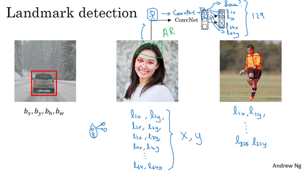

最後一個例子，如果你對人體姿態檢測感興趣，你還可以定義一些關鍵特徵點，如胸部的中點，左肩，左肘，腰等等。然後透過神經網路標註人物姿態的關鍵特徵點，再輸出這些標註過的特徵點，就相當於輸出了人物的姿態動作。當然，要實現這個功能，你需要設定這些關鍵特徵點，從胸部中心點($l_{1x}$，$l_{1y}$)一直往下，直到($l_{32x}$，$l_{32y}$)。

一旦了解如何用二維坐標系定義人物姿態，操作起來就相當簡單了，批次添加輸出單元，用以輸出要識別的各個特徵點的$(x,y)$坐標值。要明確一點，特徵點1的特性在所有圖片中必須保持一致，就好比，特徵點1始終是右眼的外眼角，特徵點2是右眼的內眼角，特徵點3是左眼內眼角，特徵點4是左眼外眼角等等。所以標籤在所有圖片中必須保持一致，假如你雇用他人或自己標記了一個足夠大的數據集，那麼神經網路便可以輸出上述所有特徵點，你可以利用它們實現其他有趣的效果，比如判斷人物的動作姿態，識別圖片中的人物表情等等。

以上就是特徵點檢測的內容，下節課我們將利用這些構造模組來構建對象檢測算法。

### 3.3 目標檢測（Object detection）

學過了對象定位和特徵點檢測，今天我們來構建一個對象檢測算法。這節課，我們將學習如何透過卷積網路進行對象檢測，採用的是基於滑動窗口的目標檢測算法。

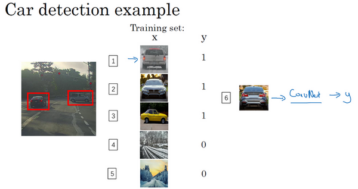

假如你想構建一個汽車檢測算法，步驟是，首先創建一個標籤訓練集，也就是$x$和$y$表示適當剪切的汽車圖片樣本，這張圖片（編號1）$x$是一個正樣本，因為它是一輛汽車圖片，這幾張圖片（編號2、3）也有汽車，但這兩張（編號4、5）沒有汽車。出於我們對這個訓練集的期望，你一開始可以使用適當剪切的圖片，就是整張圖片$x$幾乎都被汽車占據，你可以照張照片，然後剪切，剪掉汽車以外的部分，使汽車居於中間位置，並基本占據整張圖片。有了這個標籤訓練集，你就可以開始訓練卷積網路了，輸入這些適當剪切過的圖片（編號6），卷積網路輸出$y$，0或1表示圖片中有汽車或沒有汽車。訓練完這個卷積網路，就可以用它來實現滑動窗口目標檢測，具體步驟如下。

假設這是一張測試圖片，首先選定一個特定大小的窗口，比如圖片下方這個窗口，將這個紅色小方塊輸入卷積神經網路，卷積網路開始進行預測，即判斷紅色方框內有沒有汽車。

滑動窗口目標檢測算法接下來會繼續處理第二個圖像，即紅色方框稍向右滑動之後的區域，並輸入給卷積網路，因此輸入給卷積網路的只有紅色方框內的區域，再次運行卷積網路，然後處理第三個圖像，依次重複操作，直到這個窗口滑過圖像的每一個角落。

為了滑動得更快，我這裡選用的步幅比較大，思路是以固定步幅移動窗口，遍歷圖像的每個區域，把這些剪切後的小圖像輸入卷積網路，對每個位置按0或1進行分類，這就是所謂的圖像滑動窗口操作。

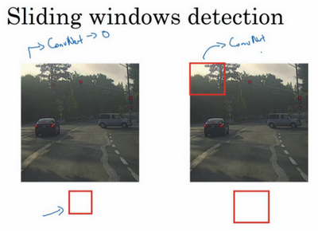

重複上述操作，不過這次我們選擇一個更大的窗口，截取更大的區域，並輸入給卷積神經網路處理，你可以根據卷積網路對輸入大小調整這個區域，然後輸入給卷積網路，輸出0或1。

再以某個固定步幅滑動窗口，重複以上操作，遍歷整個圖像，輸出結果。

然後第三次重複操作，這次選用更大的窗口。

如果你這樣做，不論汽車在圖片的什麼位置，總有一個窗口可以檢測到它。

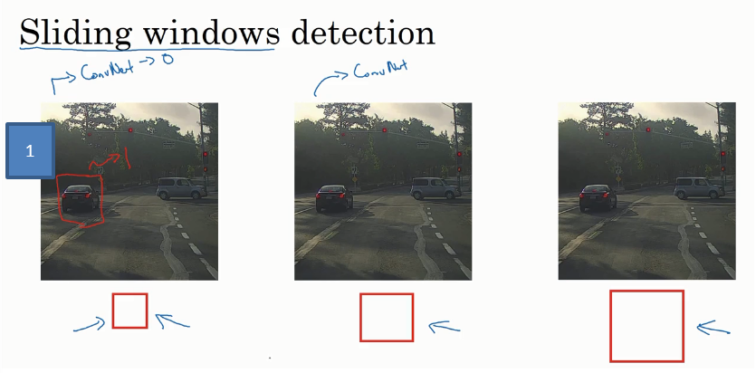

比如，將這個窗口（編號1）輸入卷積網路，希望卷積網路對該輸入區域的輸出結果為1，說明網路檢測到圖上有輛車。

這種算法叫作滑動窗口目標檢測，因為我們以某個步幅滑動這些方框窗口遍歷整張圖片，對這些方形區域進行分類，判斷裡面有沒有汽車。

滑動窗口目標檢測算法也有很明顯的缺點，就是計算成本，因為你在圖片中剪切出太多小方塊，卷積網路要一個個地處理。如果你選用的步幅很大，顯然會減少輸入卷積網路的窗口個數，但是粗糙間隔尺寸可能會影響性能。反之，如果採用小粒度或小步幅，傳遞給卷積網路的小窗口會特別多，這意味著超高的計算成本。

所以在神經網路興起之前，人們通常採用更簡單的分類器進行對象檢測，比如透過採用手工處理工程特徵的簡單的線性分類器來執行對象檢測。至於誤差，因為每個分類器的計算成本都很低，它只是一個線性函數，所以滑動窗口目標檢測算法表現良好，是個不錯的算法。然而，卷積網路運行單個分類人物的成本卻高得多，像這樣滑動窗口太慢。除非採用超細粒度或極小步幅，否則無法準確定位圖片中的對象。

不過，慶幸的是，計算成本問題已經有了很好的解決方案，大大提高了卷積層上應用滑動窗口目標檢測器的效率，關於它的具體實現，我們下節課再講。

### 3.4 滑動窗口的卷積實現（Convolutional implementation of sliding windows）

上節課，我們學習了如何透過卷積網路實現滑動窗口對象檢測算法，但效率很低。這節課我們講講如何在卷積層上應用這個算法。

為了構建滑動窗口的卷積應用，首先要知道如何把神經網路的全連接層轉化成卷積層。我們先講解這部分內容，下一張幻燈片，我們將按照這個思路來示範卷積的應用過程。

假設對象檢測算法輸入一個14×14×3的圖像，圖像很小，不過示範起來方便。在這裡過濾器大小為5×5，數量是16，14×14×3的圖像在過濾器處理之後映射為10×10×16。然後通過參數為2×2的最大池化操作，圖像減小到5×5×16。然後添加一個連接400個單元的全連接層，接著再添加一個全連接層，最後通過**softmax**單元輸出$y$。為了跟下圖區分開，我先做一點改動，用4個數字來表示$y$，它們分別對應**softmax**單元所輸出的4個分類出現的機率。這4個分類可以是行人、汽車、摩托車和背景或其它對象。

現在我要示範的就是如何把這些全連接層轉化為卷積層，畫一個這樣的卷積網路，它的前幾層和之前的一樣，而對於下一層，也就是這個全連接層，我們可以用5×5的過濾器來實現，數量是400個（編號1所示），輸入圖像大小為5×5×16，用5×5的過濾器對它進行卷積操作，過濾器實際上是5×5×16，因為在卷積過程中，過濾器會遍歷這16個通道，所以這兩處的通道數量必須保持一致，輸出結果為1×1。假設應用400個這樣的5×5×16過濾器，輸出維度就是1×1×400，我們不再把它看作一個含有400個節點的集合，而是一個1×1×400的輸出層。從數學角度看，它和全連接層是一樣的，因為這400個節點中每個節點都有一個5×5×16維度的過濾器，所以每個值都是上一層這些5×5×16啟動值經過某個任意線性函數的輸出結果。

我們再添加另外一個卷積層（編號2所示），這裡用的是1×1卷積，假設有400個1×1的過濾器，在這400個過濾器的作用下，下一層的維度是1×1×400，它其實就是上個網路中的這一全連接層。最後經由1×1過濾器的處理，得到一個**softmax**啟動值，透過卷積網路，我們最終得到這個1×1×4的輸出層，而不是這4個數位（編號3所示）。

以上就是用卷積層代替全連接層的過程，結果這幾個單元集變成了1×1×400和1×1×4的維度。

參考論文：**Sermanet, Pierre, et al. "OverFeat: Integrated Recognition, Localization and Detection using Convolutional Networks." *Eprint Arxiv* (2013).**

掌握了卷積知識，我們再看看如何通過卷積實現滑動窗口對象檢測算法。講義中的內容借鑑了螢幕下方這篇關於**OverFeat**的論文，它的作者包括**Pierre Sermanet**，**David Eigen**，**張翔**，**Michael Mathieu**，**Rob Fergus**，**Yann LeCun**。

假設向滑動窗口卷積網路輸入14×14×3的圖片，為了簡化示範和計算過程，這裡我們依然用14×14的小圖片。和前面一樣，神經網路最後的輸出層，即**softmax**單元的輸出是1×1×4，我畫得比較簡單，嚴格來說，14×14×3應該是一個長方體，第二個10×10×16也是一個長方體，但為了方便，我只畫了正面。所以，對於1×1×400的這個輸出層，我也只畫了它1×1的那一面，所以這裡顯示的都是平面圖，而不是3D圖像。

假設輸入給卷積網路的圖片大小是14×14×3，測試集圖片是16×16×3，現在給這個輸入圖片加上黃色條塊，在最初的滑動窗口算法中，你會把這片藍色區域輸入卷積網路（紅色筆標記）生成0或1分類。接著滑動窗口，步幅為2個像素，向右滑動2個像素，將這個綠框區域輸入給卷積網路，運行整個卷積網路，得到另外一個標籤0或1。繼續將這個橘色區域輸入給卷積網路，卷積後得到另一個標籤，最後對右下方的紫色區域進行最後一次卷積操作。我們在這個16×16×3的小圖像上滑動窗口，卷積網路運行了4次，於是輸出了了4個標籤。

結果發現，這4次卷積操作中很多計算都是重複的。所以執行滑動窗口的卷積時使得卷積網路在這4次前向傳播過程中共享很多計算，尤其是在這一步操作中（編號1），卷積網路運行同樣的參數，使得相同的5×5×16過濾器進行卷積操作，得到12×12×16的輸出層。然後執行同樣的最大池化（編號2），輸出結果6×6×16。照舊應用400個5×5的過濾器（編號3），得到一個2×2×400的輸出層，現在輸出層為2×2×400，而不是1×1×400。應用1×1過濾器（編號4）得到另一個2×2×400的輸出層。再做一次全連接的操作（編號5），最終得到2×2×4的輸出層，而不是1×1×4。最終，在輸出層這4個子方塊中，藍色的是圖像左上部分14×14的輸出（紅色箭頭標識），右上角方塊是圖像右上部分（綠色箭頭標識）的對應輸出，左下角方塊是輸入層左下角（橘色箭頭標識），也就是這個14×14區域經過卷積網路處理後的結果，同樣，右下角這個方塊是卷積網路處理輸入層右下角14×14區域(紫色箭頭標識)的結果。

如果你想了解具體的計算步驟，以綠色方塊為例，假設你剪切出這塊區域（編號1），傳遞給卷積網路，第一層的啟動值就是這塊區域（編號2），最大池化後的下一層的啟動值是這塊區域（編號3），這塊區域對應著後面幾層輸出的右上角方塊（編號4，5，6）。

所以該卷積操作的原理是我們不需要把輸入圖像分割成四個子集，分別執行前向傳播，而是把它們作為一張圖片輸入給卷積網路進行計算，其中的公共區域可以共享很多計算，就像這裡我們看到的這個4個14×14的方塊一樣。

下面我們再看一個更大的圖片樣本，假如對一個28×28×3的圖片應用滑動窗口操作，如果以同樣的方式運行前向傳播，最後得到8×8×4的結果。跟上一個範例一樣，以14×14區域滑動窗口，首先在這個區域應用滑動窗口，其結果對應輸出層的左上角部分。接著以大小為2的步幅不斷地向右移動窗口，直到第8個單元格，得到輸出層的第一行。然後向圖片下方移動，最終輸出這個8×8×4的結果。因為最大池化參數為2，相當於以大小為2的步幅在原始圖片上應用神經網路。

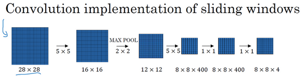

總結一下滑動窗口的實現過程，在圖片上剪切出一塊區域，假設它的大小是14×14，把它輸入到卷積網路。繼續輸入下一塊區域，大小同樣是14×14，重複操作，直到某個區域識別到汽車。

但是正如在前一頁所看到的，我們不能依靠連續的卷積操作來識別圖片中的汽車，比如，我們可以對大小為28×28的整張圖片進行卷積操作，一次得到所有預測值，如果足夠幸運，神經網路便可以識別出汽車的位置。

以上就是在卷積層上應用滑動窗口算法的內容，它提高了整個算法的效率。不過這種算法仍然存在一個缺點，就是邊界框的位置可能不夠準確。下節課，我們將學習如何解決這個問題。

### 3.5 Bounding Box預測（Bounding box predictions）

在上一個影片中，你們學到了滑動窗口法的卷積實現，這個算法效率更高，但仍然存在問題，不能輸出最精準的邊界框。在這個影片中，我們看看如何得到更精準的邊界框。

在滑動窗口法中，你取這些離散的位置集合，然後在它們上運行分類器，在這種情況下，這些邊界框沒有一個能完美匹配汽車位置，也許這個框（編號1）是最匹配的了。還有看起來這個真實值，最完美的邊界框甚至不是方形，稍微有點長方形（紅色方框所示），長寬比有點向水平方向延伸，有沒有辦法讓這個算法輸出更精準的邊界框呢？

其中一個能得到更精準邊界框的算法是**YOLO**算法，**YOLO**(**You only look once**)意思是你只看一次，這是由**Joseph Redmon**，**Santosh Divvala**，**Ross Girshick**和**Ali Farhadi**提出的算法。

是這麼做的，比如你的輸入圖像是100×100的，然後在圖像上放一個網格。為了介紹起來簡單一些，我用3×3網格，實際實現時會用更精細的網格，可能是19×19。基本思路是使用圖像分類和定位算法，前幾個影片介紹過的，然後將算法應用到9個格子上。（基本思路是，採用圖像分類和定位算法，本週第一個影片中介紹過的，逐一應用在圖像的9個格子中。）更具體一點，你需要這樣定義訓練標籤，所以對於9個格子中的每一個指定一個標籤$y$，$y$是8維的，和你之前看到的一樣，$y= \ \begin{bmatrix} p_{c} \\ b_{x} \\ b_{y} \\ b_{h} \\ b_{w} \\ c_{1} \\ c_{2}\\ c_{3} \\\end{bmatrix}$，$p_{c}$等於0或1取決於這個綠色格子中是否有圖像。然後$b_{x}$、$b_{y}$、$b_{h}$和$b_{w}$作用就是，如果那個格子裡有對象，那麼就給出邊界框坐標。然後$c_{1}$、$c_{2}$和$c_{3}$就是你想要識別的三個類別，背景類別不算，所以你嘗試在背景類別中識別行人、汽車和摩托車，那麼$c_{1}$、$c_{2}$和$c_{3}$可以是行人、汽車和摩托車類別。這張圖裡有9個格子，所以對於每個格子都有這麼一個向量。

我們看看左上方格子，這裡這個（編號1），裡面什麼也沒有，所以左上格子的標籤向量$y$是$\begin{bmatrix}0 \\ ? \\ ? \\ ? \\ ? \\ ? \\ ? \\ ? \\\end{bmatrix}$。然後這個格子（編號2）的輸出標籤$y$也是一樣，這個格子（編號3），還有其他什麼也沒有的格子都一樣。

現在這個格子呢？講的更具體一點，這張圖有兩個對象，**YOLO**算法做的就是，取兩個對象的中點，然後將這個對象分配給包含對象中點的格子。所以左邊的汽車就分配到這個格子上（編號4），然後這輛**Condor**（車型：神鷹）中點在這裡，分配給這個格子（編號6）。所以即使中心格子（編號5）同時有兩輛車的一部分，我們就假裝中心格子沒有任何我們感興趣的對象，所以對於中心格子，分類標籤$y$和這個向量類似，和這個沒有對象的向量類似，即$y= \ \begin{bmatrix} 0 \\ ? \\ ? \\ ? \\ ? \\ ? \\ ? \\ ? \\\end{bmatrix}$。而對於這個格子，這個用綠色框起來的格子（編號4），目標標籤就是這樣的，這裡有一個對象，$p_{c}=1$，然後你寫出$b_{x}$、$b_{y}$、$b_{h}$和$b_{w}$來指定邊界框位置，然後還有類別1是行人，那麼$c_{1}= 0$，類別2是汽車，所以$c_{2} = 1$，類別3是摩托車，則數值$c_{3} = 0$，即$y= \begin{bmatrix} 1 \\ b_{x} \\ b_{y} \\ b_{h} \\ b_{w} \\ 0 \\ 1 \\0 \\\end{bmatrix}$。右邊這個格子（編號6）也是類似的，因為這裡確實有一個對象，它的向量應該是這個樣子的，$y=\begin{bmatrix} 1 \\ b_{x} \\ b_{y} \\ b_{h} \\ b_{w} \\ 0 \\ 1 \\0 \\ \end{bmatrix}$作為目標向量對應右邊的格子。

所以對於這裡9個格子中任何一個，你都會得到一個8維輸出向量，因為這裡是3×3的網格，所以有9個格子，總的輸出尺寸是3×3×8，所以目標輸出是3×3×8。因為這裡有3×3格子，然後對於每個格子，你都有一個8維向量$y$，所以目標輸出尺寸是3×3×8。

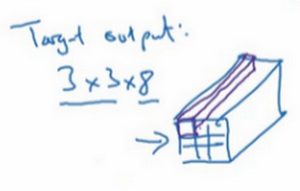

對於這個例子中，左上格子是1×1×8，對應的是9個格子中左上格子的輸出向量。所以對於這3×3中每一個位置而言，對於這9個格子，每個都對應一個8維輸出目標向量$y$，其中一些值可以是**dont care-s**（即？），如果這裡沒有對象的話。所以總的目標輸出，這個圖片的輸出標籤尺寸就是3×3×8。

如果你現在要訓練一個輸入為100×100×3的神經網路，現在這是輸入圖像，然後你有一個普通的卷積網路，卷積層，最大池化層等等，最後你會有這個，選擇卷積層和最大池化層，這樣最後就映射到一個3×3×8輸出尺寸。所以你要做的是，有一個輸入$x$，就是這樣的輸入圖像，然後你有這些3×3×8的目標標籤$y$。當你用反向傳播訓練神經網路時，將任意輸入$x$映射到這類輸出向量$y$。

所以這個算法的優點在於神經網路可以輸出精確的邊界框，所以測試的時候，你做的是餵入輸入圖像$x$，然後跑正向傳播，直到你得到這個輸出$y$。然後對於這裡3×3位置對應的9個輸出，我們在輸出中展示過的，你就可以讀出1或0（編號1位置），你就知道9個位置之一有個對象。如果那裡有個對象，那個對象是什麼（編號3位置），還有格子中這個對象的邊界框是什麼（編號2位置）。只要每個格子中對象數目沒有超過1個，這個算法應該是沒問題的。一個格子中存在多個對象的問題，我們稍後再討論。但實踐中，我們這裡用的是比較小的3×3網格，實踐中你可能會使用更精細的19×19網格，所以輸出就是19×19×8。這樣的網格精細得多，那麼多個對象分配到同一個格子得機率就小得多。

重申一下，把對象分配到一個格子的過程是，你觀察對象的中點，然後將這個對象分配到其中點所在的格子，所以即使對象可以橫跨多個格子，也只會被分配到9個格子其中之一，就是3×3網路的其中一個格子，或者19×19網路的其中一個格子。在19×19網格中，兩個對象的中點（圖中藍色點所示）處於同一個格子的機率就會更低。

所以要注意，首先這和圖像分類和定位算法非常像，我們在本週第一節課講過的，就是它顯式地輸出邊界框坐標，所以這能讓神經網路輸出邊界框，可以具有任意寬高比，並且能輸出更精確的坐標，不會受到滑動窗口分類器的步長大小限制。其次，這是一個卷積實現，你並沒有在3×3網格上跑9次算法，或者，如果你用的是19×19的網格，19平方是361次，所以你不需要讓同一個算法跑361次。相反，這是單次卷積實現，但你使用了一個卷積網路，有很多共享計算步驟，在處理這3×3計算中很多計算步驟是共享的，或者你的19×19的網格，所以這個算法效率很高。

事實上**YOLO**算法有一個好處，也是它受歡迎的原因，因為這是一個卷積實現，實際上它的運行速度非常快，可以達到即時識別。在結束之前我還想給你們分享一個小細節，如何編碼這些邊界框$b_{x}$、$b_{y}$、$b_{h}$和$b_{w}$，我們在下一張幻燈片上討論。

這裡有兩輛車，我們有個3×3網格，我們以右邊的車為例（編號1），紅色格子裡有個對象，所以目標標籤$y$就是，$p_{c}= 1$，然後$b_{x}$、$b_{y}$、$b_{h}$和$b_{w}$，然後$c_{1} =0$，$c_{2} = 1$，$c_{3} = 0$，即$y = \begin{bmatrix} 1 \\ b_{x}\\ b_{y} \\ b_{h} \\ b_{w} \\ 0 \\ 1 \\ 0 \\\end{bmatrix}$。你怎麼指定這個邊界框呢？

**Specify the bounding boxes**：

在**YOLO**算法中，對於這個方框（編號1所示），我們約定左上這個點是$(0,0)$，然後右下這個點是$(1,1)$,要指定橙色中點的位置，$b_{x}$大概是0.4，因為它的位置大概是水平長度的0.4，然後$b_{y}$大概是0.3，然後邊界框的高度用格子總體寬度的比例表示，所以這個紅框的寬度可能是藍線（編號2所示的藍線）的90%，所以$b_{h}$是0.9，它的高度也許是格子總體高度的一半，這樣的話$b_{w}$就是0.5。換句話說，$b_{x}$、$b_{y}$、$b_{h}$和$b_{w}$單位是相對於格子尺寸的比例，所以$b_{x}$和$b_{y}$必須在0和1之間，因為從定義上看，橙色點位於對象分配到格子的範圍內，如果它不在0和1之間，如果它在方塊外，那麼這個對象就應該分配到另一個格子上。這個值（$b_{h}$和$b_{w}$）可能會大於1，特別是如果有一輛汽車的邊界框是這樣的（編號3所示），那麼邊界框的寬度和高度有可能大於1。

指定邊界框的方式有很多，但這種約定是比較合理的，如果你去讀**YOLO**的研究論文，**YOLO**的研究工作有其他參數化的方式，可能效果會更好，我這裡就只給出了一個合理的約定，用起來應該沒問題。不過還有其他更複雜的參數化方式，涉及到**sigmoid**函數，確保這個值（$b_{x}$和$b_{y}$）介於0和1之間，然後使用指數參數化來確保這些（$b_{h}$和$b_{w}$）都是非負數，因為0.9和0.5，這個必須大於等於0。還有其他更高級的參數化方式，可能效果要更好一點，但我這裡講的辦法應該是管用的。

這就是**YOLO**算法，你只看一次算法，在接下來的幾個影片中，我會告訴你一些其他的思路可以讓這個算法做的更好。在此期間，如果你感興趣，也可以看看**YOLO**的論文，在前幾張幻燈片底部引用的**YOLO**論文。

**Redmon, Joseph, et al. "You Only Look Once: Unified, Real-Time Object Detection." (2015):779-788.**

不過看這些論文之前，先給你們提個醒，**YOLO**論文是相對難度較高的論文之一，我記得我第一次讀這篇論文的時候，我真的很難搞清楚到底是怎麼實現的，我最後問了一些我認識的研究員，看看他們能不能給我講清楚，即使是他們，也很難理解這篇論文的一些細節。所以如果你看論文的時候，發現看不懂，這是沒問題的，我希望這種場合出現的機率要更低才好，但實際上，即使是資深研究員也有讀不懂研究論文的時候，必須去讀原始碼，或者聯繫作者之類的才能弄清楚這些算法的細節。但你們不要被我嚇到，你們可以自己看看這些論文，如果你們感興趣的話，但這篇論文相對較難。現在你們了解了**YOLO**算法的基礎，我們繼續討論別的讓這個算法效果更好的研究。

### 3.6 交並比（Intersection over union）

你如何判斷對象檢測算法運作良好呢？在本影片中，你將了解到並交比函數，可以用來評價對象檢測算法。在下一個影片中，我們用它來插入一個分量來進一步改善檢測算法，我們開始吧。

在對象檢測任務中，你希望能夠同時定位對象，所以如果實際邊界框是這樣的，你的算法給出這個紫色的邊界框，那麼這個結果是好還是壞？所以交並比（**loU**）函數做的是計算兩個邊界框交集和聯集之比。兩個邊界框的聯集是這個區域，就是屬於包含兩個邊界框區域（綠色陰影表示區域），而交集就是這個比較小的區域（橙色陰影表示區域），那麼交並比就是交集的大小，這個橙色陰影面積，然後除以綠色陰影的聯集面積。

一般約定，在計算機檢測任務中，如果$loU≥0.5$，就說檢測正確，如果預測器和實際邊界框完美重疊，**loU**就是1，因為交集就等於聯集。但一般來說只要$loU≥0.5$，那麼結果是可以接受的，看起來還可以。一般約定，0.5是閾值，用來判斷預測的邊界框是否正確。一般是這麼約定，但如果你希望更嚴格一點，你可以將**loU**定得更高，比如說大於0.6或者更大的數字，但**loU**越高，邊界框越精確。

所以這是衡量定位精確度的一種方式，你只需要統計算法正確檢測和定位對象的次數，你就可以用這樣的定義判斷對象定位是否準確。再次，0.5是人為約定，沒有特別深的理論依據，如果你想更嚴格一點，可以把閾值定為0.6。有時我看到更嚴格的標準，比如0.6甚至0.7，但很少見到有人將閾值降到0.5以下。

人們定義**loU**這個概念是為了評價你的對象定位算法是否精準，但更一般地說，**loU**衡量了兩個邊界框重疊地相對大小。如果你有兩個邊界框，你可以計算交集，計算聯集，然後求兩個數值的比值，所以這也可以判斷兩個邊界框是否相似，我們將在下一個影片中再次用到這個函數，當我們討論非最大值抑制時再次用到。

好，這就是**loU**，或者說交並比，不要和借據中提到的我欠你錢的這個概念所混淆，如果你借錢給別人，他們會寫給你一個借據，說：“我欠你這麼多錢（**I own you this much money**）。”，這也叫做**loU**。這是完全不同的概念，這兩個概念重名。

現在介紹了**loU**交並比的定義之後，在下一個影片中，我想討論非最大值抑制，這個工具可以讓**YOLO**算法輸出效果更好，我們下一個影片繼續。

### 3.7 非極大值抑制（Non-max suppression）

到目前為止你們學到的對象檢測中的一個問題是，你的算法可能對同一個對象做出多次檢測，所以算法不是對某個對象檢測出一次，而是檢測出多次。非極大值抑制這個方法可以確保你的算法對每個對象只檢測一次，我們講一個例子。

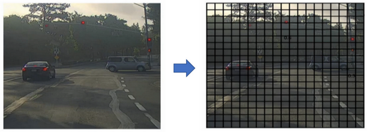

假設你需要在這張圖片裡檢測行人和汽車，你可能會在上面放個19×19網格，理論上這輛車只有一個中點，所以它應該只被分配到一個格子裡，左邊的車子也只有一個中點，所以理論上應該只有一個格子做出有車的預測。

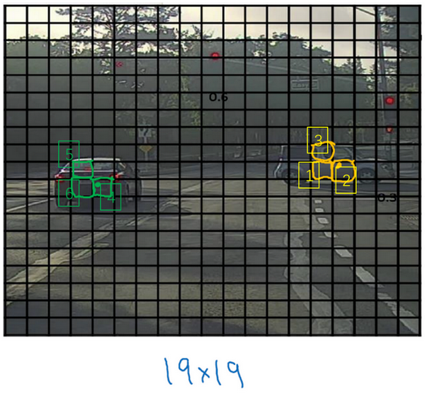

實踐中當你運行對象分類和定位算法時，對於每個格子都運行一次，所以這個格子（編號1）可能會認為這輛車中點應該在格子內部，這幾個格子（編號2、3）也會這麼認為。對於左邊的車子也一樣，所以不僅僅是這個格子，如果這是你們以前見過的圖像，不僅這個格（編號4）子會認為它裡面有車，也許這個格子（編號5）和這個格子（編號6）也會，也許其他格子也會這麼認為，覺得它們格子內有車。

我們分步介紹一下非極大抑制是怎麼奏效的，因為你要在361個格子上都運行一次圖像檢測和定位算法，那麼可能很多格子都會舉手說我的$p_{c}$，我這個格子裡有車的機率很高，而不是361個格子中僅有兩個格子會報告它們檢測出一個對象。所以當你運行算法的時候，最後可能會對同一個對象做出多次檢測，所以非極大值抑制做的就是清理這些檢測結果。這樣一輛車只檢測一次，而不是每輛車都觸發多次檢測。

所以具體上，這個算法做的是，首先看看每次報告每個檢測結果相關的機率$p_{c}$，在本週的程式練習中有更多細節，實際上是$p_{c}$乘以$c_{1}$、$c_{2}$或$c_{3}$。現在我們就說，這個$p_{c}$檢測機率，首先看機率最大的那個，這個例子（右邊車輛）中是0.9，然後就說這是最可靠的檢測，所以我們就用高亮標記，就說我這裡找到了一輛車。這麼做之後，非極大值抑制就會逐一審視剩下的矩形，所有和這個最大的邊框有很高交並比，高度重疊的其他邊界框，那麼這些輸出就會被抑制。所以這兩個矩形$p_{c}$分別是0.6和0.7，這兩個矩形和淡藍色矩形重疊程度很高，所以會被抑制，變暗，表示它們被抑制了。

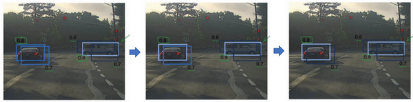

接下來，逐一審視剩下的矩形，找出機率最高，$p_{c}$最高的一個，在這種情況下是0.8，我們就認為這裡檢測出一輛車（左邊車輛），然後非極大值抑制算法就會去掉其他**loU**值很高的矩形。所以現在每個矩形都會被高亮顯示或者變暗，如果你直接拋棄變暗的矩形，那就剩下高亮顯示的那些，這就是最後得到的兩個預測結果。

所以這就是非極大值抑制，非最大值意味著你只輸出機率最大的分類結果，但抑制很接近，但不是最大的其他預測結果，所以這方法叫做非極大值抑制。

我們來看看算法的細節，首先這個19×19網格上執行一下算法，你會得到19×19×8的輸出尺寸。不過對於這個例子來說，我們簡化一下，就說你只做汽車檢測，我們就去掉$c_{1}$、$c_{2}$和$c_{3}$，然後假設這條線對於19×19的每一個輸出，對於361個格子的每個輸出，你會得到這樣的輸出預測，就是格子中有對象的機率（$p_{c}$），然後是邊界框參數（$b_{x}$、$b_{y}$、$b_{h}$和$b_{w}$）。如果你只檢測一種對象，那麼就沒有$c_{1}$、$c_{2}$和$c_{3}$這些預測分量。多個對象處於同一個格子中的情況，我會放到編程練習中，你們可以在本週末之前做做。

現在要實現非極大值抑制，你可以做的第一件事是，去掉所有邊界框，我們就將所有的預測值，所有的邊界框$p_{c}$小於或等於某個閾值，比如$p_{c}≤0.6$的邊界框去掉。

我們就這樣說，除非算法認為這裡存在對象的機率至少有0.6，否則就拋棄，所以這就拋棄了所有機率比較低的輸出邊界框。所以思路是對於這361個位置，你輸出一個邊界框，還有那個最好邊界框所對應的機率，所以我們只是拋棄所有低機率的邊界框。

接下來剩下的邊界框，沒有拋棄沒有處理過的，你就一直選擇機率$p_{c}$最高的邊界框，然後把它輸出成預測結果，這個過程就是上一張幻燈片，取一個邊界框，讓它高亮顯示，這樣你就可以確定輸出做出有一輛車的預測。

接下來去掉所有剩下的邊界框，任何沒有達到輸出標準的邊界框，之前沒有拋棄的邊界框，把這些和輸出邊界框有高重疊面積和上一步輸出邊界框有很高交並比的邊界框全部拋棄。所以**while**循環的第二步是上一張幻燈片變暗的那些邊界框，和高亮標記的邊界重疊面積很高的那些邊界框拋棄掉。在還有剩下邊界框的時候，一直這麼做，把沒處理的都處理完，直到每個邊界框都判斷過了，它們有的作為輸出結果，剩下的會被拋棄，它們和輸出結果重疊面積太高，和輸出結果交並比太高，和你剛剛輸出這裡存在對象結果的重疊程度過高。

在這張幻燈片中，我只介紹了算法檢測單個對象的情況，如果你嘗試同時檢測三個對象，比如說行人、汽車、摩托車，那麼輸出向量就會有三個額外的分量。事實證明，正確的做法是獨立進行三次非極大值抑制，對每個輸出類別都做一次，但這個細節就留給本週的程式練習吧，其中你可以自己嘗試實現，我們可以自己試試在多個對象類別檢測時做非極大值抑制。

這就是非極大值抑制，如果你能實現我們說過的對象檢測算法，你其實可以得到相當不錯的結果。但結束我們對**YOLO**算法的介紹之前，最後我還有一個細節想給大家分享，可以進一步改善算法效果，就是anchor box的思路，我們下一個影片再介紹。

### 3.8 Anchor Boxes

到目前為止，對象檢測中存在的一個問題是每個格子只能檢測出一個對象，如果你想讓一個格子檢測出多個對象，你可以這麼做，就是使用**anchor box**這個概念，我們從一個例子開始講吧。

假設你有這樣一張圖片，對於這個例子，我們繼續使用3×3網格，注意行人的中點和汽車的中點幾乎在同一個地方，兩者都落入到同一個格子中。所以對於那個格子，如果 $y$ 輸出這個向量$y= \ \begin{bmatrix} p_{c} \\ b_{x} \\ b_{y} \\ b_{h} \\ b_{w} \\ c_{1} \\ c_{2}\\ c_{3} \\\end{bmatrix}$，你可以檢測這三個類別，行人、汽車和摩托車，它將無法輸出檢測結果，所以我必須從兩個檢測結果中選一個。 

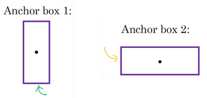

而**anchor box**的思路是，這樣子，預先定義兩個不同形狀的**anchor box**，或者**anchor box**形狀，你要做的是把預測結果和這兩個**anchor box**關聯起來。一般來說，你可能會用更多的**anchor box**，可能要5個甚至更多，但對於這個影片，我們就用兩個**anchor box**，這樣介紹起來簡單一些。

你要做的是定義類別標籤，用的向量不再是上面這個$\begin{bmatrix} p_{c} & b_{x} &b_{y} & b_{h} & b_{w} & c_{1} & c_{2} & c_{3} \\\end{bmatrix}^{T}$，而是重複兩次，$y=  \begin{bmatrix} p_{c} & b_{x} & b_{y} &b_{h} & b_{w} & c_{1} & c_{2} & c_{3} & p_{c} & b_{x} & b_{y} & b_{h} & b_{w} &c_{1} & c_{2} & c_{3} \\\end{bmatrix}^{T}$，前面的$p_{c},b_{x},b_{y},b_{h},b_{w},c_{1},c_{2},c_{3}$（綠色方框標記的參數）是和**anchor box 1**關聯的8個參數，後面的8個參數（橙色方框標記的元素）是和**anchor box 2**相關聯。因為行人的形狀更類似於**anchor box 1**的形狀，而不是**anchor box 2**的形狀，所以你可以用這8個數值（前8個參數），這麼編碼$p_{c} =1$，是的，代表有個行人，用$b_{x},b_{y},b_{h}$和$b_{w}$來編碼包住行人的邊界框，然後用$c_{1},c_{2},c_{3}$($c_{1}= 1,c_{2} = 0,c_{3} = 0$)來說明這個對象是個行人。

然後是車子，因為車子的邊界框比起**anchor box 1**更像**anchor box 2**的形狀，你就可以這麼編碼，這裡第二個對象是汽車，然後有這樣的邊界框等等，這裡所有參數都和檢測汽車相關($p_{c}= 1,b_{x},b_{y},b_{h},b_{w},c_{1} = 0,c_{2} = 1,c_{3} = 0$)。

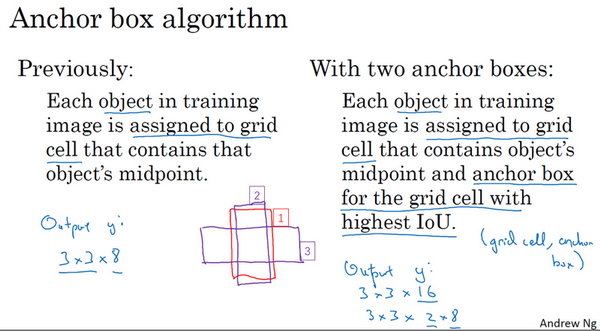

總結一下，用**anchor box**之前，你做的是這個，對於訓練集圖像中的每個對象，都根據那個對象中點位置分配到對應的格子中，所以輸出$y$就是3×3×8，因為是3×3網格，對於每個網格位置，我們有輸出向量，包含$p_{c}$，然後邊界框參數$b_{x},b_{y},b_{h}$和$b_{w}$，然後$c_{1},c_{2},c_{3}$。

現在用到**anchor box**這個概念，是這麼做的。現在每個對像都和之前一樣分配到同一個格子中，分配到對象中點所在的格子中，以及分配到和對象形狀交並比最高的**anchor box**中。所以這裡有兩個**anchor box**，你就取這個對象，如果你的對象形狀是這樣的（編號1，紅色框），你就看看這兩個**anchor box**，**anchor box 1**形狀是這樣（編號2，紫色框），**anchor box 2**形狀是這樣（編號3，紫色框），然後你觀察哪一個**anchor box**和實際邊界框（編號1，紅色框）的交並比更高，不管選的是哪一個，這個對象不只分配到一個格子，而是分配到一對，即（**grid cell，anchor box**）對，這就是對象在目標標籤中的編碼方式。所以現在輸出 $y$ 就是3×3×16，上一張幻燈片中你們看到 $y$ 現在是16維的，或者你也可以看成是3×3×2×8，因為現在這裡有2個**anchor box**，而 $y$ 是8維的。$y$ 維度是8，因為我們有3個對象類別，如果你有更多對象，那麼$y$ 的維度會更高。

所以我們來看一個具體的例子，對於這個格子（編號2），我們定義一下$y$:

$y =\begin{bmatrix} p_{c} & b_{x} & b_{y} & b_{h} & b_{w} & c_{1} & c_{2} & c_{3} &p_{c} & b_{x} & b_{y} & b_{h} & b_{w} & c_{1} & c_{2} & c_{3} \\\end{bmatrix}^{T}$。

所以行人更類似於**anchor box 1**的形狀，所以對於行人來說，我們將她分配到向量的上半部分。是的，這裡存在一個對象，即$p_{c}= 1$，有一個邊界框包住行人，如果行人是類別1，那麼 $c_{1} = 1,c_{2} = 0,c_{3} =0$（編號1所示的橙色參數）。車子的形狀更像**anchor box 2**，所以這個向量剩下的部分是 $p_{c} = 1$，然後和車相關的邊界框，然後$c_{1} = 0,c_{2} = 1,c_{3} =0$（編號1所示的綠色參數）。所以這就是對應中下格子的標籤 $y$，這個箭頭指向的格子（編號2所示）。

現在其中一個格子有車，沒有行人，如果它裡面只有一輛車，那麼假設車子的邊界框形狀是這樣，更像**anchor**
**box 2**，如果這裡只有一輛車，行人走開了，那麼**anchor box 2**分量還是一樣的，要記住這是向量對應**anchor box 2**的分量和**anchor box 1**對應的向量分量，你要填的就是，裡面沒有任何對象，所以 $p_{c} =0$，然後剩下的就是**don’t care-s**(即？)（編號3所示）。

現在還有一些額外的細節，如果你有兩個anchor box，但在同一個格子中有三個對象，這種情況算法處理不好，你希望這種情況不會發生，但如果真的發生了，這個算法並沒有很好的處理辦法，對於這種情況，我們就引入一些打破僵局的默認手段。還有這種情況，兩個對象都分配到一個格子中，而且它們的**anchor box**形狀也一樣，這是算法處理不好的另一種情況，你需要引入一些打破僵局的默認手段，專門處理這種情況，希望你的數據集裡不會出現這種情況，其實出現的情況不多，所以對性能的影響應該不會很大。

這就是**anchor box**的概念，我們建立**anchor box**這個概念，是為了處理兩個對象出現在同一個格子的情況，實踐中這種情況很少發生，特別是如果你用的是19×19網格而不是3×3的網格，兩個對象中點處於361個格子中同一個格子的機率很低，確實會出現，但出現頻率不高。也許設立**anchor box**的好處在於**anchor box**能讓你的學習算法能夠更有徵對性，特別是如果你的數據集有一些很高很瘦的對象，比如說行人，還有像汽車這樣很寬的對象，這樣你的算法就能更有針對性的處理，這樣有一些輸出單元可以針對檢測很寬很胖的對象，比如說車子，然後輸出一些單元，可以針對檢測很高很瘦的對象，比如說行人。

最後，你應該怎麼選擇**anchor box**呢？人們一般手工指定**anchor box**形狀，你可以選擇5到10個**anchor box**形狀，覆蓋到多種不同的形狀，可以涵蓋你想要檢測的對象的各種形狀。還有一個更高級的版本，我就簡單說一句，你們如果接觸過一些機器學習，可能知道後期**YOLO**論文中有更好的做法，就是所謂的**k-平均算法**，可以將兩類對象形狀聚類，如果我們用它來選擇一組**anchor box**，選擇最具有代表性的一組**anchor box**，可以代表你試圖檢測的十幾個對象類別，但這其實是自動選擇**anchor box**的高級方法。如果你就人工選擇一些形狀，合理的考慮到所有對象的形狀，你預計會檢測的很高很瘦或者很寬很胖的對象，這應該也不難做。

所以這就是**anchor box**，在下一個影片中，我們把學到的所有東西一起融入到**YOLO**算法中。

### 3.9 YOLO 算法（Putting it together: YOLO algorithm）

你們已經學到對象檢測算法的大部分組件了，在這個影片裡，我們會把所有組件組裝在一起構成**YOLO**對象檢測算法。

我們先看看如何構造你的訓練集，假設你要訓練一個算法去檢測三種對象，行人、汽車和摩托車，你還需要顯式指定完整的背景類別。這裡有3個類別標籤，如果你要用兩個**anchor box**，那麼輸出 $y$ 就是3×3×2×8，其中3×3表示3×3個網格，2是**anchor box**的數量，8是向量維度，8實際上先是5（$p_{c},b_{x},b_{y},b_{h},b_{w}$）再加上類別的數量（$c_{1},c_{2},c_{3}$）。你可以將它看成是3×3×2×8，或者3×3×16。要構造訓練集，你需要遍歷9個格子，然後構成對應的目標向量$y$。

所以先看看第一個格子（編號1），裡面沒什麼有價值的東西，行人、車子和摩托車，三個類別都沒有出現在左上格子中，所以對應那個格子目標$y$就是這樣的，$y= \begin{bmatrix} 0 & ? & ? & ? & ? & ? & ? & ? & 0 & ? & ? & ? & ? & ? & ? & ?\\ \end{bmatrix}^{T}$，第一個**anchor box**的 $p_{c}$ 是0，因為沒什麼和第一個**anchor box**有關的，第二個**anchor box**的 $p_{c}$ 也是0，剩下這些值是**don’t care-s**。

現在網格中大多數格子都是空的，但那裡的格子（編號2）會有這個目標向量$y$，$y =\begin{bmatrix} 0 & ? & ? & ? & ? & ? & ? & ? & 1 & b_{x} & b_{y} & b_{h} &b_{w} & 0 & 1 & 0 \\\end{bmatrix}^{T}$，所以假設你的訓練集中，對於車子有這樣一個邊界框（編號3），水平方向更長一點。所以如果這是你的**anchor box**，這是**anchor box 1**（編號4），這是**anchor box 2**（編號5），然後紅框和**anchor box 2**的交並比更高，那麼車子就和向量的下半部分相關。要注意，這裡和**anchor box 1**有關的 $p_{c}$ 是0，剩下這些分量都是**don’t care-s**，然後你的第二個 $p_{c} =1$，然後你要用這些（$b_{x},b_{y},b_{h},b_{w}$）來指定紅邊界框的位置，然後指定它的正確類別是2($c_{1}= 0 ,c_{2} = 1,c_{3} = 0$)，對吧，這是一輛汽車。

所以你這樣遍歷9個格子，遍歷3×3網格的所有位置，你會得到這樣一個向量，得到一個16維向量，所以最終輸出尺寸就是3×3×16。和之前一樣，簡單起見，我在這裡用的是3×3網格，實踐中用的可能是19×19×16，或者需要用到更多的**anchor box**，可能是19×19×5×8，即19×19×40，用了5個**anchor box**。這就是訓練集，然後你訓練一個卷積網路，輸入是圖片，可能是100×100×3，然後你的卷積網路最後輸出尺寸是，在我們例子中是3×3×16或者3×3×2×8。

接下來我們看看你的算法是怎樣做出預測的，輸入圖像，你的神經網路的輸出尺寸是這個3×3×2×8，對於9個格子，每個都有對應的向量。對於左上的格子（編號1），那裡沒有任何對象，那麼我們希望你的神經網路在那裡（第一個$p_{c}$）輸出的是0，這裡（第二個$p_{c}$）是0，然後我們輸出一些值，你的神經網路不能輸出問號，不能輸出**don’t care-s**，剩下的我輸入一些數字，但這些數字基本上會被忽略，因為神經網路告訴你，那裡沒有任何東西，所以輸出是不是對應一個類別的邊界框無關緊要，所以基本上是一組數字，多多少少都是噪音（輸出 $y$ 如編號3所示）。

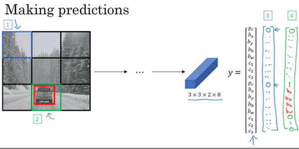

和這裡的邊界框不大一樣，希望$y$的值，那個左下格子（編號2）的輸出$y$（編號4所示），形式是，對於邊界框1來說（$p_{c}$）是0，然後就是一組數字，就是噪音（**anchor box 1**對應行人，此格子中無行人，$p_{c} = 0,b_{x} = ?,b_{y} = ?,b_{h} = ?,b_{w} = ?,c_{1} = ?c_{2} = ?,c_{3} =?$）。希望你的算法能輸出一些數字，可以對車子指定一個相當準確的邊界框（**anchor box 2**對應汽車，此格子中有車，$ p_{c} = 1,b_{x},b_{y},b_{h},b_{w},c_{1} = 0,c_{2}= 1,c_{3} = 0$），這就是神經網路做出預測的過程。

最後你要運行一下這個非極大值抑制，為了讓內容更有趣一些，我們看看一張新的測試圖像，這就是運行非極大值抑制的過程。如果你使用兩個**anchor box**，那麼對於9個格子中任何一個都會有兩個預測的邊界框，其中一個的機率$p_{c}​$很低。但9個格子中，每個都有兩個預測的邊界框，比如說我們得到的邊界框是是這樣的，注意有一些邊界框可以超出所在格子的高度和寬度（編號1所示）。接下來你拋棄機率很低的預測，去掉這些連神經網路都說，這裡很可能什麼都沒有，所以你需要拋棄這些（編號2所示）。

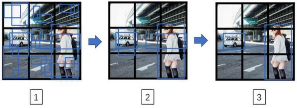

最後，如果你有三個對象檢測類別，你希望檢測行人，汽車和摩托車，那麼你要做的是，對於每個類別單獨運行非極大值抑制，處理預測結果所屬類別的邊界框，用非極大值抑制來處理行人類別，用非極大值抑制處理車子類別，然後對摩托車類別進行非極大值抑制，運行三次來得到最終的預測結果。所以算法的輸出最好能夠檢測出圖像裡所有的車子，還有所有的行人（編號3所示）。

這就是**YOLO**對象檢測算法，這實際上是最有效的對象檢測算法之一，包含了整個計算機視覺對象檢測領域文獻中很多最精妙的思路。你可以在本週的程式作業中嘗試現實這個算法，所以我希望你喜歡本週的程式練習，這裡還有一個可選的影片，你們可以看，也可以不看，總之，我們下週見。

### 3.10 候選區域（選修）（Region proposals (Optional)）

如果你們閱讀一下對象檢測的文獻，可能會看到一組概念，所謂的候選區域，這在計算機視覺領域是非常有影響力的概念。我把這個影片定為可選影片是因為我用到候選區域這一系列算法的頻率沒有那麼高，但當然了，這些工作是很有影響力的，你們在工作中也可能會碰到，我們來看看。

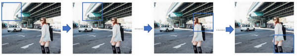

你們還記得滑動窗法吧，你使用訓練過的分類器，在這些窗口中全部運行一遍，然後運行一個檢測器，看看裡面是否有車輛，行人和摩托車。現在你也可以運行一下卷積算法，這個算法的其中一個缺點是，它在顯然沒有任何對象的區域浪費時間，對吧。

所以這裡這個矩形區域（編號1）基本是空的，顯然沒有什麼需要分類的東西。也許算法會在這個矩形上（編號2）運行，而你知道上面沒有什麼有趣的東西。

[**Girshick R, Donahue J, Darrell T, et al. Rich feature hierarchies for accurate object detection and semantic segmentation[C]//Proceedings of the IEEE conference on computer vision and pattern recognition. 2014: 580-587.**]

所以**Ross Girshick**，**Jeff Donahue**，**Trevor Darrell**，**Jitendra Malik**，在本幻燈片底部引用到的論文中提出一種叫做**R-CNN**的算法，意思是帶區域的卷積網路，或者說帶區域的**CNN**。這個算法嘗試選出一些區域，在這些區域上運行卷積網路分類器是有意義的，所以這裡不再針對每個滑動窗運行檢測算法，而是只選擇一些窗口，在少數窗口上運行卷積網路分類器。

選出候選區域的方法是運行圖像分割算法，分割的結果是下面的圖像，為了找出可能存在對象的區域。比如說，分割算法在這裡得到一個色塊，所以你可能會選擇這樣的邊界框（編號1），然後在這個色塊上運行分類器，就像這個綠色的東西（編號2），在這裡找到一個色塊，接下來我們還會在那個矩形上（編號2）運行一次分類器，看看有沒有東西。在這種情況下，如果在藍色色塊上（編號3）運行分類器，希望你能檢測出一個行人，如果你在青色色塊(編號4)上運行算法，也許你可以發現一輛車，我也不確定。

所以這個細節就是所謂的分割算法，你先找出可能2000多個色塊，然後在這2000個色塊上放置邊界框，然後在這2000個色塊上運行分類器，這樣需要處理的位置可能要少的多，可以減少卷積網路分類器運行時間，比在圖像所有位置運行一遍分類器要快。特別是這種情況，現在不僅是在方形區域（編號5）中運行卷積網路，我們還會在高高瘦瘦（編號6）的區域運行，嘗試檢測出行人，然後我們在很寬很胖的區域（編號7）運行，嘗試檢測出車輛，同時在各種尺度運行分類器。

這就是**R-CNN**或者**區域CNN**的特色概念，現在看來**R-CNN**算法還是很慢的。所以有一系列的研究工作去改進這個算法，所以基本的**R-CNN**算法是使用某種算法求出候選區域，然後對每個候選區域運行一下分類器，每個區域會輸出一個標籤，有沒有車子？有沒有行人？有沒有摩托車？並輸出一個邊界框，這樣你就能在確實存在對象的區域得到一個精確的邊界框。

澄清一下，**R-CNN**算法不會直接信任輸入的邊界框，它也會輸出一個邊界框$b_{x}$，$b_{y}$，$b_{h}$和$b_{w}$，這樣得到的邊界框比較精確，比單純使用圖像分割算法給出的色塊邊界要好，所以它可以得到相當精確的邊界框。

現在**R-CNN**算法的一個缺點是太慢了，所以這些年來有一些對**R-CNN**算法的改進工作，**Ross Girshik**提出了快速的**R-CNN**算法，它基本上是**R-CNN**算法，不過用卷積實現了滑動窗法。最初的算法是逐一對區域分類的，所以快速**R-CNN**用的是滑動窗法的一個卷積實現，這和你在本週第四個影片（3.4 卷積的滑動窗口實現）中看到的大致相似，這顯著提升了**R-CNN**的速度。

事實證明，**Fast R-CNN**算法的其中一個問題是得到候選區域的聚類步驟仍然非常緩慢，所以另一個研究組，**任少卿**（**Shaoqing Ren**）、**何凱明**（**Kaiming He**）、**Ross Girshick**和**孫劍**（**Jiangxi Sun**）提出了更快的**R-CNN**算法（**Faster R-CNN**），使用的是卷積神經網路，而不是更傳統的分割算法來獲得候選區域色塊，結果比**Fast R-CNN**算法快得多。不過我認為大多數更快**R-CNN**的算法實現還是比**YOLO**算法慢很多。

候選區域的概念在計算機視覺領域的影響力相當大，所以我希望你們能了解一下這些算法，因為你可以看到還有人在用這些概念。對我個人來說，這是我的個人看法而不是整個計算機視覺研究界的看法，我覺得候選區域是一個有趣的想法，但這個方法需要兩步，首先得到候選區域，然後再分類，相比之下，能夠一步做完，類似於**YOLO**或者你只看一次（**You only look once**）這個算法，在我看來，是長遠而言更有希望的方向。但這是我的個人看法，而不是整個計算機視覺研究界的看法，所以你們最好批判接受。但我想這個**R-CNN**概念，你可能會想到，或者碰到其他人在用，所以這也是值得了解的，這樣你可以更好地理解別人的算法。

現在我們就講完這週對象檢測的材料了，我希望你們喜歡本週的程式練習，我們下週見。

**參考文獻：**

- Joseph Redmon, Santosh Divvala, Ross Girshick, Ali Farhadi - [You Only Look Once: Unified, Real-Time Object Detection](https://arxiv.org/abs/1506.02640) (2015)
- Joseph Redmon, Ali Farhadi - [YOLO9000: Better, Faster, Stronger](https://arxiv.org/abs/1612.08242) (2016)
- Allan Zelener - [YAD2K: Yet Another Darknet 2 Keras](https://github.com/allanzelener/YAD2K)
- The official YOLO website (<https://pjreddie.com/darknet/yolo/>)