第四周 特殊應用：人臉識別和神經風格轉換（Special applications: Face recognition &Neural style transfer）
------------------------------------------------------------------------

 

[TOC]
### 4.1 什麼是人臉識別？（What is face recognition?）

歡迎來到第四周，即這門課卷積神經網路課程的最後一週。到目前為止，你學了很多卷積神經網路的知識。我這週準備向你展示一些重要的卷積神經網路的特殊應用，我們將從人臉識別開始，之後講神經風格遷移，你將有機會在編程作業中實現這部分內容，創造自己的藝術作品。

讓我們先從人臉識別開始，我這裡有一個有意思的示範。我在領導百度**AI**團隊的時候，其中一個小組由林元慶帶領的，做過一個人臉識別系統，這個系統非常棒，讓我們來看一下。

（以下內容為示範影片內容）

**影片開始：**

我想示範一個人臉識別系統，我現在在百度的中國總部，很多公司要求進入公司的時候要刷工卡，但是在這裡我們並不需要它，使用人臉識別，看看我能做什麼。當我走近的時候，它會識別我的臉，然後說歡迎我（**Andrew NG**），不需要工卡，我就能通過了。

讓我們看看另一種情況，在旁邊的是林元慶，**IDL**（百度深度學習實驗室）的主管，他領導開發了這個人臉識別系統，我把我的工卡給他，上面有我的頭像，他會試著用我的頭像照片，而不是真人來通過。

（林元慶語：我將嘗試用**Andrew**的工卡騙過機器，看看發生什麼，系統不會識別，系統拒絕識別。現在我要用我自己的臉，（系統語音：“歡迎您”）（林元慶順利通過））

類似於這樣的人臉識別系統在中國發展很快，我希望這個技術也可以在其他的國家使用。

**\#影片結束**

挺厲害的吧，你剛看到的這個影片展示了人臉識別和活體檢測，後一項技術確認你是一個活人。事實上，活體檢測可以使用監督學習來實現，去預測是不是一個真人，這個方面我就不多說了。我主要想講的是，如何構造這個系統中的人臉識別這一部分。

首先，讓我們了解一下人臉識別的一些術語。

在人臉識別的相關文獻中，人們經常提到人臉驗證（**face verification**）和人臉識別（**face recognition**）。

這是人臉驗證問題，如果你有一張輸入圖片，以及某人的**ID**或者是名字，這個系統要做的是，驗證輸入圖片是否是這個人。有時候也被稱作1對1問題，只需要弄明白這個人是否和他聲稱的身份相符。

而人臉識別問題比人臉驗證問題難很多（整理者註：1對多問題（$1:K$）），為什麼呢？假設你有一個驗證系統，準確率是99%，還可以。但是現在，假設在識別系統中，$K=100$，如果你把這個驗證系統應用在100個人身上，人臉識別上，你犯錯的機會就是100倍了。如果每個人犯錯的機率是1%，如果你有一個上百人的資料庫，如果你想得到一個可接受的識別誤差，你要構造一個驗證系統，其準確率為99.9%或者更高，然後才可以在100人的資料庫上運行，而保證有很大機率不出錯。事實上，如果我們有一個100人的資料庫，正確率可能需要遠大於99%，才能得到很好的效果。

在之後的幾個影片中，我們主要講構造一個人臉驗證，作為基本模組，如果準確率夠高，你就可以把它用在識別系統上。

下一個影片中，我們將開始討論如何構造人臉驗證系統，人臉驗證之所以難，原因之一在於要解決“一次學”（**one-shot learning problem**）問題。讓我們看下一個影片，什麼是一次學習問題。

### 4.2 One-Shot學習（One-shot learning）

人臉識別所面臨的一個挑戰就是你需要解決一次學習問題，這意味著在大多數人臉識別應用中，你需要通過單單一張圖片或者單單一個人臉樣例就能去識別這個人。而歷史上，當深度學習只有一個訓練樣例時，它的表現並不好，讓我們看一個直觀的例子，並討論如何去解決這個問題。

假設你的資料庫裡有4張你們公司的員工照片，實際上他們確實是我們**deeplearning.ai**的員工，分別是**Kian**，**Danielle**，**Younes**和**Tian**。現在假設有個人（編號1所示）來到辦公室，並且她想通過帶有人臉識別系統的柵門，現在系統需要做的就是，僅僅通過一張已有的**Danielle**照片，來識別前面這個人確實是她。相反，如果機器看到一個不在資料庫裡的人（編號2所示），機器應該能分辨出她不是資料庫中四個人之一。

所以在一次學習問題中，只能通過一個樣本進行學習，以能夠認出同一個人。大多數人臉識別系統都需要解決這個問題，因為在你的資料庫中每個雇員或者組員可能都只有一張照片。

有一種辦法是，將人的照片放進卷積神經網路中，使用**softmax**單元來輸出4種，或者說5種標籤，分別對應這4個人，或者4個都不是，所以**softmax**裡我們會有5種輸出。但實際上這樣效果並不好，因為如此小的訓練集不足以去訓練一個穩健的神經網路。

而且，假如有新人加入你的團隊，你現在將會有5個組員需要識別，所以輸出就變成了6種，這時你要重新訓練你的神經網路嗎？這聽起來實在不像一個好辦法。

所以要讓人臉識別能夠做到一次學習，為了能有更好的效果，你現在要做的應該是學習**Similarity**函數。詳細地說，你想要神經網路學習這樣一個用$d$表示的函數，$d(img1,img2) = degree\ of\ difference\ between\ images$，它以兩張圖片作為輸入，然後輸出這兩張圖片的差異值。如果你放進同一個人的兩張照片，你希望它能輸出一個很小的值，如果放進兩個長相差別很大的人的照片，它就輸出一個很大的值。所以在識別過程中，如果這兩張圖片的差異值小於某個閾值$\tau$，它是一個超參數，那麼這時就能預測這兩張圖片是同一個人，如果差異值大於τ，就能預測這是不同的兩個人，這就是解決人臉驗證問題的一個可行辦法。

要將它應用於識別任務，你要做的是拿這張新圖片（編號6），然後用$d$函數去比較這兩張圖片（編號1和編號6），這樣可能會輸出一個非常大的數字，在該例中，比如說這個數字是10。之後你再讓它和資料庫中第二張圖（編號2）片比較，因為這兩張照片是同一個人，所以我們希望會輸出一個很小的數。然後你再用它與資料庫中的其他圖片（編號3、4）進行比較，通過這樣的計算，最終你能夠知道，這個人確實是**Danielle**。

對應的，如果某個人（編號7）不在你的資料庫中，你透過函數$d$將他們的照片兩兩進行比較，最後我們希望$d$會對所有的比較都輸出一個很大的值，這就證明這個人並不是資料庫中4個人的其中一個。

要注意在這過程中你是如何解決一次學習問題的，只要你能學習這個函數$d$，通過輸入一對圖片，它將會告訴你這兩張圖片是否是同一個人。如果之後有新人加入了你的團隊（編號5），你只需將他的照片加入你的資料庫，系統依然能照常工作。

現在你已經知道函數d是如何工作的，通過輸入兩張照片，它將讓你能夠解決一次學習問題。那麼，下節影片中，我們將會學習如何訓練你的神經網路學會這個函數$d$。

### 4.3 Siamese 網路（Siamese network）

上個影片中你學到的函數$d$的作用就是輸入兩張人臉，然後告訴你它們的相似度。實現這個功能的一個方式就是用**Siamese**網路，我們看一下。

你經常看到這樣的卷積網路，輸入圖片$x^{(1)}$，然後通過一些列卷積，池化和全連接層，最終得到這樣的特徵向量（編號1）。有時這個會被送進**softmax**單元來做分類，但在這個影片裡我們不會這麼做。我們關注的重點是這個向量（編號1），假如它有128個數，它是由網路深層的全連接層計算出來的，我要給這128個數命個名字，把它叫做$f(x^{(1)})$。你可以把$f(x^{(1)})$看作是輸入圖像$x^{(1)}$的編碼，取這個輸入圖像（編號2），在這裡是**Kian**的圖片，然後表示成128維的向量。

建立一個人臉識別系統的方法就是，如果你要比較兩個圖片的話，例如這裡的第一張（編號1）和第二張圖片（編號2），你要做的就是把第二張圖片餵給有同樣參數的同樣的神經網路，然後得到一個不同的128維的向量（編號3），這個向量代表或者編碼第二個圖片，我要把第二張圖片的編碼叫做$f(x^{(2)})$。這裡我用$x^{(1)}$和$x^{(2)}$僅僅代表兩個輸入圖片，他們沒必要非是第一個和第二個訓練樣本，可以是任意兩個圖片。

最後如果你相信這些編碼很好地代表了這兩個圖片，你要做的就是定義$d$，將$x^{(1)}$和$x^{(2)}$的距離定義為這兩幅圖片的編碼之差的範數，$d( x^{( 1)},x^{( 2)}) =|| f( x^{( 1)}) - f( x^{( 2)})||_{2}^{2}$。

對於兩個不同的輸入，運行相同的卷積神經網路，然後比較它們，這一般叫做**Siamese**網路架構。這裡提到的很多觀點，都來自於**Yaniv Taigman**，**Ming Yang**，**Marc’ Aurelio Ranzato**，**Lior Wolf**的這篇論文，他們開發的系統叫做**DeepFace**。

怎麼訓練這個**Siamese**神經網路呢？不要忘了這兩個網路有相同的參數，所以你實際要做的就是訓練一個網路，它計算得到的編碼可以用於函數$d$，它可以告訴你兩張圖片是否是同一個人。更準確地說，神經網路的參數定義了一個編碼函數$f(x^{(i)})$，如果給定輸入圖像$x^{(i)}$，這個網路會輸出$x^{(i)}$的128維的編碼。你要做的就是學習參數，使得如果兩個圖片$x^{( i)}$和$x^{( j)}$是同一個人，那麼你得到的兩個編碼的距離就小。前面幾個幻燈片我都用的是$x^{(1)}$和$x^{( 2)}$，其實訓練集裡任意一對$x^{(i)}$和$x^{(j)}$都可以。相反，如果$x^{(i)}$和$x^{(j)}$是不同的人，那麼你會想讓它們之間的編碼距離大一點。

如果你改變這個網路所有層的參數，你會得到不同的編碼結果，你要做的就是用反向傳播來改變這些所有的參數，以確保滿足這些條件。

你已經了解了**Siamese**網路架構，並且知道你想要網路輸出什麼，即什麼是好的編碼。但是如何定義實際的目標函數，能夠讓你的神經網路學習並做到我們剛才討論的內容呢？在下一個影片裡，我們會看到如何用三元組損失函數達到這個目的。

### 4.4 Triplet 損失（Triplet 損失）

要想透過學習神經網路的參數來得到優質的人臉圖片編碼，方法之一就是定義三元組損失函數然後應用梯度下降。

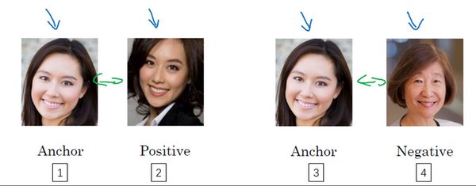

我們看下這是什麼意思，為了應用三元組損失函數，你需要比較成對的圖像，比如這個圖片，為了學習網路的參數，你需要同時看幾幅圖片，比如這對圖片（編號1和編號2），你想要它們的編碼相似，因為這是同一個人。然而假如是這對圖片（編號3和編號4），你會想要它們的編碼差異大一些，因為這是不同的人。

用三元組損失的術語來說，你要做的通常是看一個 **Anchor** 圖片，你想讓**Anchor**圖片和**Positive**圖片（**Positive**意味著是同一個人）的距離很接近。然而，當**Anchor**圖片與**Negative**圖片（**Negative**意味著是非同一個人）對比時，你會想讓他們的距離離得更遠一點。

這就是為什麼叫做三元組損失，它代表你通常會同時看三張圖片，你需要看**Anchor**圖片、**Postive**圖片，還有**Negative**圖片，我要把**Anchor**圖片、**Positive**圖片和**Negative**圖片簡寫成$A$、$P$、$N$。

把這些寫成公式的話，你想要的是網路的參數或者編碼能夠滿足以下特性，也就是說你想要$|| f(A) - f(P) ||^{2}$，你希望這個數值很小，準確地說，你想讓它小於等$f(A)$和$f(N)$之間的距離，或者說是它們的範數的平方（即：$|| f(A) - f(P)||^{2} \leq ||f(A) - f(N)||^{2}$）。（$|| f(A) - f(P) ||^{2}$）當然這就是$d(A,P)$，（$|| f(A) - f(N) ||^{2}$）這是$d(A,N)$，你可以把$d$ 看作是距離(**distance**)函數，這也是為什麼我們把它命名為$d$。

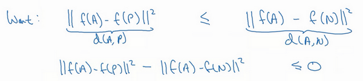

現在如果我把方程右邊項移到左邊，最終就得到：

$|| f(A) - f(P)||^{2} \leq ||f(A) - f(N)||^{2}$

現在我要對這個表達式做一些小的改變，有一種情況滿足這個表達式，但是沒有用處，就是把所有的東西都學成0，如果$f$總是輸出0，即0-0≤0，這就是0減去0還等於0，如果所有圖像的$f$都是一個零向量，那麼總能滿足這個方程。所以為了確保網路對於所有的編碼不會總是輸出0，也為了確保它不會把所有的編碼都設成互相相等的。另一種方法能讓網路得到這種沒用的輸出，就是如果每個圖片的編碼和其他圖片一樣，這種情況，你還是得到0-0。

為了阻止網路出現這種情況，我們需要修改這個目標，也就是，這個不能是剛好小於等於0，應該是比0還要小，所以這個應該小於一個$-a$值（即$|| f(A) - f(P)||^{2} -||f(A) - f(N)||^{2} \leq -a$），這裡的$a$是另一個超參數，這個就可以阻止網路輸出無用的結果。按照慣例，我們習慣寫$+a$（即$|| f(A) - f(P)||^{2} -||f(A) - f(N)||^{2} +a\leq0$），而不是把$-a$寫在後面，它也叫做間隔(**margin**)，這個術語你會很熟悉，如果你看過關於支持向量機 (**SVM**)的文獻，沒看過也不用擔心。我們可以把上面這個方程（$|| f(A) - f(P)||^{2}  -||f(A) - f(N)||^{2}$）也修改一下，加上這個間隔參數。haox 

舉個例子，假如間隔設置成0.2，如果在這個例子中，$d(A,P) =0.5$，如果 **Anchor**和 **Negative**圖片的$d$，即$d(A,N)$只大一點，比如說0.51，條件就不能滿足。雖然0.51也是大於0.5的，但還是不夠好，我們想要$d(A,N)$比$d(A,P)$大很多，你會想讓這個值（$d(A,N)$）至少是0.7或者更高，或者為了使這個間隔，或者間距至少達到0.2，你可以把這項調大或者這個調小，這樣這個間隔$a$，超參數$a$ 至少是0.2，在$d(A,P)$和$d(A,N)$之間至少相差0.2，這就是間隔參數$a$的作用。它拉大了**Anchor**和**Positive** 圖片對和**Anchor**與**Negative** 圖片對之間的差距。取下面的這個方框圈起來的方程式，在下個幻燈片裡，我們會更公式化表示，然後定義三元組損失函數。

三元組損失函數的定義基於三張圖片，假如三張圖片$A$、$P$、$N$，即**Anchor**樣本、**Positive**樣本和**Negative**樣本，其中**Positive**圖片和**Anchor**圖片是同一個人，但是**Negative**圖片和**Anchor**不是同一個人。

接下來我們定義損失函數，這個例子的損失函數，它的定義基於三元圖片組，我先從前一張幻燈片複製過來一些式子，就是$|| f( A) - f( P)||^{2} -||f( A) - f( N)||^{2} +a \leq0$。所以為了定義這個損失函數，我們取這個和0的最大值：

$L( A,P,N) = max(|| f( A) - f( P)||^{2} -|| f( A) - f( N)||^{2} + a,0)$

這個$max$函數的作用就是，只要這個$|| f( A) - f( P)||^{2} -|| f( A) - f( N)||^{2} + a\leq0$，那麼損失函數就是0。只要你能使畫綠色下劃線部分小於等於0，只要你能達到這個目標，那麼這個例子的損失就是0。

另一方面如果這個$|| f( A) - f( P)||^{2} -|| f( A) - f( N)||^{2} + a\leq0$，然後你取它們的最大值，最終你會得到綠色下劃線部分（即$|| f(A) - f( P)||^{2} -|| f( A) - f( N)||^{2} +a$）是最大值，這樣你會得到一個正的損失值。通過最小化這個損失函數達到的效果就是使這部分$|| f( A) - f( P)||^{2} -||f( A) - f( N)||^{2} +a$成為0，或者小於等於0。只要這個損失函數小於等於0，網路不會關心它負值有多大。

這是一個三元組定義的損失，整個網路的代價函數應該是訓練集中這些單個三元組損失的總和。假如你有一個10000個圖片的訓練集，裡面是1000個不同的人的照片，你要做的就是取這10000個圖片，然後生成這樣的三元組，然後訓練你的學習算法，對這種代價函數用梯度下降，這個代價函數就是定義在你數據集裡的這樣的三元組圖片上。

注意，為了定義三元組的數據集你需要成對的$A$和$P$，即同一個人的成對的圖片，為了訓練你的系統你確實需要一個數據集，裡面有同一個人的多個照片。這是為什麼在這個例子中，我說假設你有1000個不同的人的10000張照片，也許是這1000個人平均每個人10張照片，組成了你整個數據集。如果你只有每個人一張照片，那麼根本沒辦法訓練這個系統。當然，訓練完這個系統之後，你可以應用到你的一次學習問題上，對於你的人臉識別系統，可能你只有想要識別的某個人的一張照片。但對於訓練集，你需要確保有同一個人的多個圖片，至少是你訓練集裡的一部分人，這樣就有成對的**Anchor**和**Positive**圖片了。

現在我們來看，你如何選擇這些三元組來形成訓練集。一個問題是如果你從訓練集中，隨機地選擇$A$、$P$和$N$，遵守$A$和$P$是同一個人，而$A$和$N$是不同的人這一原則。有個問題就是，如果隨機的選擇它們，那麼這個約束條件（$d(A,P) + a \leq d(A,N)$）很容易達到，因為隨機選擇的圖片，$A$和$N$比$A$和$P$差別很大的機率很大。我希望你還記得這個符號$d(A,P)$就是前幾個幻燈片裡寫的$|| f(A) - f(P)||^{2}$，$d(A,N)$就是$||f(A) -f(N)||^{2}$，$d(A,P) + a \leq d(A,N)$即$|| f( A) - f( P)||^{2} + a \leq|| f(A) - f( N)||^{2}$。但是如果$A$和$N$是隨機選擇的不同的人，有很大的可能性$||f(A) - f(N)||^{2}$會比左邊這項$||f( A) - f(P)||^{2}$大，而且差距遠大於$a$，這樣網路並不能從中學到什麼。

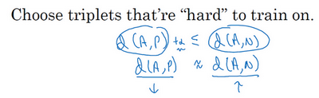

所以為了構建一個數據集，你要做的就是儘可能選擇難訓練的三元組$A$、$P$和$N$。具體而言，你想要所有的三元組都滿足這個條件（$d(A,P) + a \leq d(A,N)$），難訓練的三元組就是，你的$A$、$P$和$N$的選擇使得$d(A,P)$很接近$d(A,N)$，即$d(A,P) \approx d(A,N)$，這樣你的學習算法會竭盡全力使右邊這個式子變大（$d(A,N)$），或者使左邊這個式子（$d(A,P)$）變小，這樣左右兩邊至少有一個$a$的間隔。並且選擇這樣的三元組還可以增加你的學習算法的計算效率，如果隨機的選擇這些三元組，其中有太多會很簡單，梯度算法不會有什麼效果，因為網路總是很輕鬆就能得到正確的結果，只有選擇難的三元組梯度下降法才能發揮作用，使得這兩邊離得儘可能遠。

如果你對此感興趣的話，這篇論文中有更多細節，作者是**Florian Schroff**, **Dmitry Kalenichenko**, **James Philbin**，他們建立了這個叫做**FaceNet**的系統，我影片裡許多的觀點都是來自於他們的工作。

•  **Florian Schroff, Dmitry Kalenichenko, James Philbin (2015).** [FaceNet: A Unified Embedding forFace Recognition and Clustering](https://arxiv.org/pdf/1503.03832.pdf)

順便說一下，這有一個有趣的事實，關於在深度學習領域，算法是如何命名的。如果你研究一個特定的領域，假如說“某某”領域，通常會將系統命名為“某某”網路或者深度“某某”，我們一直討論人臉識別，所以這篇論文叫做**FaceNet**(人臉網路)，上個影片裡你看到過**DeepFace**(深度人臉)。“某某”網路或者深度“某某”，是深度學習領域流行的命名算法的方式，你可以看一下這篇論文，如果你想要了解更多的關於透過選擇最有用的三元組訓練來加速算法的細節，這是一個很棒的論文。

總結一下，訓練這個三元組損失你需要取你的訓練集，然後把它做成很多三元組，這就是一個三元組（編號1），有一個**Anchor**圖片和**Positive**圖片，這兩個（**Anchor**和**Positive**）是同一個人，還有一張另一個人的**Negative**圖片。這是另一組（編號2），其中**Anchor**和**Positive**圖片是同一個人，但是**Anchor**和**Negative**不是同一個人，等等。

定義了這些包括$A$、$P$和$N$圖片的數據集之後，你還需要做的就是用梯度下降最小化我們之前定義的代價函數$J$，這樣做的效果就是反向傳播到網路中的所有參數來學習到一種編碼，使得如果兩個圖片是同一個人，那麼它們的$d$就會很小，如果兩個圖片不是同一個人，它們的$d$ 就會很大。

這就是三元組損失，並且如何用它來訓練網路輸出一個好的編碼用於人臉識別。現在的人臉識別系統，尤其是大規模的商業人臉識別系統都是在很大的數據集上訓練，超過百萬圖片的數據集並不罕見，一些公司用千萬級的圖片，還有一些用上億的圖片來訓練這些系統。這些是很大的數據集，即使按照現在的標準，這些數據集並不容易獲得。幸運的是，一些公司已經訓練了這些大型的網路並且上傳了模型參數。所以相比於從頭訓練這些網路，在這一領域，由於這些數據集太大，這一領域的一個實用操作就是下載別人的預訓練模型，而不是一切都要從頭開始。但是即使你下載了別人的預訓練模型，我認為了解怎麼訓練這些算法也是有用的，以防針對一些應用你需要從頭實現這些想法。

這就是三元組損失，下個影片中，我會給你展示**Siamese**網路的一些其他變體，以及如何訓練這些網路，讓我們進入下個影片吧。

### 4.5 人臉驗證與二分類（Face verification and binary classification）

**Triplet loss**是一個學習人臉識別卷積網路參數的好方法，還有其他學習參數的方法，讓我們看看如何將人臉識別當成一個二分類問題。

另一個訓練神經網路的方法是選取一對神經網路，選取**Siamese**網路，使其同時計算這些嵌入，比如說128維的嵌入（編號1），或者更高維，然後將其輸入到邏輯回歸單元，然後進行預測，如果是相同的人，那麼輸出是1，若是不同的人，輸出是0。這就把人臉識別問題轉換為一個二分類問題，訓練這種系統時可以替換**Triplet loss**的方法。

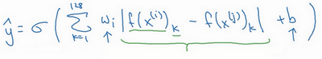

最後的邏輯回歸單元是怎麼處理的？輸出$\hat y$會變成，比如說**sigmoid**函數應用到某些特徵上，相比起直接放入這些編碼（$f(x^{(i)}),f( x^{(j)})$），你可以利用編碼之間的不同。

$\hat y = \sigma(\sum_{k = 1}^{128}{w_{i}| f( x^{( i)})_{k} - f( x^{( j)})_{k}| + b})$

我解釋一下，符號$f( x^{( i)})_{k}$代表圖片$x^{(i)}$的編碼，下標$k$代表選擇這個向量中的第$k$個元素，$| f(x^{( i)})_{k} - f( x^{( j)})_{k}|$對這兩個編碼取元素差的絕對值。你可能想，把這128個元素當作特徵，然後把他們放入邏輯回歸中，最後的邏輯回歸可以增加參數$w_{i}$和$b$，就像普通的邏輯回歸一樣。你將在這128個單元上訓練合適的權重，用來預測兩張圖片是否是一個人，這是一個很合理的方法來學習預測0或者1，即是否是同一個人。

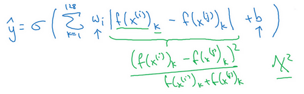

還有其他不同的形式來計算綠色標記的這部分公式（$| f( x^{( i)})_{k} - f( x^{( j)})_{k}|$），比如說，公式可以是$\frac{(f( x^{( i)})_{k} - f(x^{( j)})_{k})^{2}}{f(x^{( i)})_{k} + f( x^{( j)})_{k}}$，這個公式也被叫做$\chi^{2}$公式，是一個希臘字母$\chi$，也被稱為$\chi$平方相似度。

•      **Yaniv Taigman, Ming Yang, Marc'Aurelio Ranzato, Lior Wolf (2014).** [DeepFace:Closing the gap to human-level performance in face verification](https://research.fb.com/wp-content/uploads/2016/11/deepface-closing-the-gap-to-human-level-performance-in-face-verification.pdf)

這些公式及其變形在這篇**DeepFace**論文中有討論，我之前也引用過。

但是在這個學習公式中，輸入是一對圖片，這是你的訓練輸入$x$（編號1、2），輸出$y$是0或者1，取決於你的輸入是相似圖片還是非相似圖片。與之前類似，你正在訓練一個**Siamese**網路，意味著上面這個神經網路擁有的參數和下面神經網路的相同（編號3和4所示的網路），兩組參數是綁定的，這樣的系統效果很好。

之前提到一個計算技巧可以幫你顯著提高部署效果，如果這是一張新圖片（編號1），當員工走進門時，希望門可以自動為他們打開，這個（編號2）是在資料庫中的圖片，不需要每次都計算這些特徵（編號6），不需要每次都計算這個嵌入，你可以提前計算好，那麼當一個新員工走近時，你可以使用上方的卷積網路來計算這些編碼（編號5），然後使用它，和預先計算好的編碼進行比較，然後輸出預測值$\hat y$。

因為不需要存儲原始圖像，如果你有一個很大的員工資料庫，你不需要為每個員工每次都計算這些編碼。這個預先計算的思想，可以節省大量的計算，這個預訓練的工作可以用在**Siamese**網路結構中，將人臉識別當作一個二分類問題，也可以用在學習和使用**Triplet loss**函數上，我在之前的影片中描述過。

總結一下，把人臉驗證當作一個監督學習，創建一個只有成對圖片的訓練集，不是三個一組，而是成對的圖片，目標標籤是1表示一對圖片是一個人，目標標籤是0表示圖片中是不同的人。利用不同的成對圖片，使用反向傳播算法去訓練神經網路，訓練**Siamese**神經網路。

這個你看到的版本，處理人臉驗證和人臉識別擴展為二分類問題，這樣的效果也很好。我希望你知道，在一次學習時，你需要什麼來訓練人臉驗證，或者人臉識別系統。

### 4.6 什麼是神經風格遷移？（What is neural style transfer?）

最近，卷積神經網路最有趣的應用是神經風格遷移，在編程作業中，你將自己實現這部分並創造出你的藝術作品。

什麼是神經風格遷移？讓我們來看幾個例子，比如這張照片，照片是在斯坦福大學拍攝的，離我的辦公室不遠，你想利用右邊照片的風格來重新創造原本的照片，右邊的是梵谷的星空，神經風格遷移可以幫你生成下面這張照片。

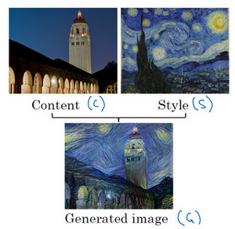

這仍是斯坦福大學的照片，但是用右邊圖像的風格畫出來。

為了描述如何實現神經網路遷移，我將使用$C$來表示內容圖像，$S$表示風格圖像，$G$表示生成的圖像。

另一個例子，比如，這張圖片，$C$代表在舊金山的金門大橋，還有這張風格圖片，是畢加索的風格，然後把兩張照片結合起來，得到G這張畢加索風格的的金門大橋。

這頁中展示的例子，是由**Justin Johnson**製作，在下面幾個影片中你將學到如何自己生成這樣的圖片。

為了實現神經風格遷移，你需要知道卷積網路提取的特徵，在不同的神經網路，深層的、淺層的。在深入了解如何實現神經風格遷移之前，我將在下一個影片中直觀地介紹卷積神經網路不同層之間的具體運算，讓我們來看下一個影片。

### 4.7 CNN特徵可視化（What are deep ConvNets learning?）

深度卷積網路到底在學什麼？在這個影片中我將展示一些可視化的例子，可以幫助你理解卷積網路中深度較大的層真正在做什麼，這樣有助於理解如何實現神經風格遷移。

來看一個例子，假如你訓練了一個卷積神經網路，是一個**Alexnet**，輕量級網路，你希望將看到不同層之間隱藏單元的計算結果。

你可以這樣做，從第一層的隱藏單元開始，假設你遍歷了訓練集，然後找到那些使得單元啟動最大化的一些圖片，或者是圖片塊。換句話說，將你的訓練集經過神經網路，然後弄明白哪一張圖片最大限度地啟動特定的單元。注意在第一層的隱藏單元，只能看到小部分卷積神經，如果要畫出來哪些啟動了啟動單元，只有一小塊圖片塊是有意義的，因為這就是特定單元所能看到的全部。你選擇一個隱藏單元，發現有9個圖片最大化了單元啟動，你可能找到這樣的9個圖片塊（編號1），似乎是圖片淺層區域顯示了隱藏單元所看到的，找到了像這樣的邊緣或者線（編號2），這就是那9個最大化地啟動了隱藏單元啟動項的圖片塊。

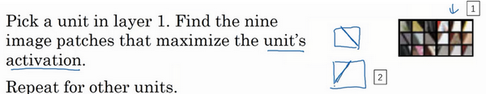

然後你可以選一個另一個第一層的隱藏單元，重複剛才的步驟，這是另一個隱藏單元，似乎第二個由這9個圖片塊（編號1）組成。看來這個隱藏單元在輸入區域，尋找這樣的線條（編號2），我們也稱之為接受域。

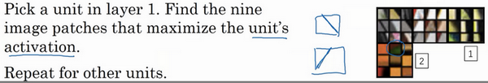

對其他隱藏單元也進行處理，會發現其他隱藏單元趨向於啟動類似於這樣的圖片。這個似乎對垂直明亮邊緣左邊有綠色的圖片塊（編號1）感興趣，這一個隱藏單元傾向於橘色，這是一個有趣的圖片塊（編號2），紅色和綠色混合成褐色或者棕橙色，但是神經元仍可以啟動它。

以此類推，這是9個不同的代表性神經元，每一個不同的圖片塊都最大化地啟動了。你可以這樣理解，第一層的隱藏單元通常會找一些簡單的特徵，比如說邊緣或者顏色陰影。

我在這個影片中使用的所有例子來自於**Matthew Zener**和**Rob Fergus**的這篇論文，題目是（**Zeiler M D, Fergus R.Visualizing and Understanding Convolutional Networks[J]. 2013, 8689:818-833.**）《可視化理解卷積神經網路》，我會使用一種更簡單的方法來可視化神經網路隱藏單元的計算內容。如果你讀過他們的論文，他們提出了一些更複雜的方式來可視化卷積神經網路的計算。

你已經在第一層的9個隱藏單元重複了這個過程好幾遍，如果在深層的隱藏單元中進行這樣的計算呢？卷積神經網路的深層部分學到了什麼？在深層部分，一個隱藏單元會看到一張圖片更大的部分，在極端的情況下，可以假設每一個像素都會影響到神經網路更深層的輸出，靠後的隱藏單元可以看到更大的圖片塊，我還會畫出和這頁中的大小相同的圖片塊。

但如果我們重複這一過程，這（**Layer 1**所示圖片）是之前第一層得到的，這個（**Layer 2**所示圖片）是可視化的第2層中最大程度啟動的9個隱藏單元。我想解釋一下這個可視化，這是（編號2所示）使一個隱藏單元最大啟動的9個圖片塊，每一個組合，這是另一組（編號2），使得一個隱藏單元被啟動的9個圖片塊，這個可視化展示了第二層的9個隱藏單元，每一個又有9個圖片塊使得隱藏單元有較大的輸出或是較大的啟動。

在更深的層上，你可以重複這個過程。

在這頁裡很難看清楚，這些微小的淺層圖片塊，讓我們放大一些，這是第一層，這是第一個被高度啟動的單元，你能在輸入圖片的區域看到，大概是這個角度的邊緣（編號1）放大第二層的可視化圖像。

有意思了，第二層似乎檢測到更複雜的形狀和模式，比如說這個隱藏單元（編號1），它會找到有很多垂線的垂直圖案，這個隱藏單元（編號2）似乎在左側有圓形圖案時會被高度啟動，這個的特徵（編號3）是很細的垂線，以此類推，第二層檢測的特徵變得更加複雜。

看看第三層我們將其放大，放得更大一點，看得更清楚一點，這些東西啟動了第三層。再放大一點，這又很有趣了，這個隱藏單元（編號1）似乎對圖像左下角的圓形很敏感，所以檢測到很多車。這一個（編號2）似乎開始檢測到人類，這個（編號3）似乎檢測特定的圖案，蜂窩形狀或者方形，類似這樣規律的圖案。有些很難看出來，需要手動弄明白檢測到什麼，但是第三層明顯，檢測到更複雜的模式。

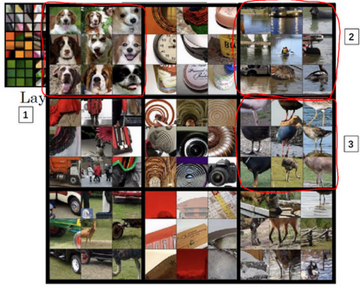

下一層呢？這是第四層，檢測到的模式和特徵更加複雜，這個（編號1）學習成了一個狗的檢測器，但是這些狗看起來都很類似，我並不知道這些狗的種類，但是你知道這些都是狗，他們看起來也類似。第四層中的這個（編號2）隱藏單元它檢測什麼？水嗎？這個（編號3）似乎檢測到鳥的腳等等。

第五層檢測到更加複雜的事物，注意到這（編號1）也有一個神經元，似乎是一個狗檢測器，但是可以檢測到的狗似乎更加多樣性。這個（編號2）可以檢測到鍵盤，或者是鍵盤質地的物體，可能是有很多點的物體。我認為這個神經元（編號3）可能檢測到文本，但是很難確定，這個（編號4）檢測到花。我們已經有了一些進展，從檢測簡單的事物，比如說，第一層的邊緣，第二層的質地，到深層的複雜物體。

我希望這讓你可以更直觀地了解卷積神經網路的淺層和深層是如何計算的，接下來讓我們使用這些知識開始構造神經風格遷移算法。

### 4.8 代價函數（Cost function）

要構建一個神經風格遷移系統，讓我們為生成的圖像定義一個代價函數，你接下看到的是，通過最小化代價函數，你可以生成你想要的任何圖像。

記住我們的問題，給你一個內容圖像$C$，給定一個風格圖片$S$，而你的目標是生成一個新圖片$G$。為了實現神經風格遷移，你要做的是定義一個關於$G$的代價函數$J$用來評判某個生成圖像的好壞，我們將使用梯度下降法去最小化$J(G)$，以便於生成這個圖像。

怎麼判斷生成圖像的好壞呢？我們把這個代價函數定義為兩個部分。

$J_{\text{content}}(C,G)$

第一部分被稱作內容代價，這是一個關於內容圖片和生成圖片的函數，它是用來度量生成圖片$G$的內容與內容圖片$C$的內容有多相似。

$J_{\text{style}}(S,G)$

然後我們會把結果加上一個風格代價函數，也就是關於$S$和$G$的函數，用來度量圖片$G$的風格和圖片$S$的風格的相似度。

$J( G) = a J_{\text{content}}( C,G) + \beta J_{\text{style}}(S,G)$

最後我們用兩個超參數$a$和$\beta$來來確定內容代價和風格代價，兩者之間的權重用兩個超參數來確定。兩個代價的權重似乎是多餘的，我覺得一個超參數似乎就夠了，但提出神經風格遷移的原始作者使用了兩個不同的超參數，我準備保持一致。

關於神經風格遷移算法我將在接下來幾段影片中展示的，是基於**Leon Gatys**， **Alexandra Ecker**和**Matthias Bethge**的這篇論文。這篇論文並不是很難讀懂，如果你願意，看完這些影片，我也非常推薦你去看看他們的論文。

**Leon A. Gatys, Alexander S. Ecker, Matthias Bethge, (2015). A Neural Algorithm of Artistic Style** (<https://arxiv.org/abs/1508.06576>)

算法的運行是這樣的，對於代價函數$J(G)$，為了生成一個新圖像，你接下來要做的是隨機初始化生成圖像$G$，它可能是100×100×3，可能是500×500×3，又或者是任何你想要的尺寸。

然後使用在之前的幻燈片上定義的代價函數$J(G)$，你現在可以做的是使用梯度下降的方法將其最小化，更新$G:= G - \frac{\partial}{\partial G}J(G)$。在這個步驟中，你實際上更新的是圖像$G$的像素值，也就是100×100×3，比如**RGB**通道的圖片。

這裡有個例子，假設你從這張內容圖片（編號1）和風格（編號2）圖片開始，這是另一張公開的畢加索畫作，當你隨機初始化$G$，你隨機初始化的生成圖像就是這張隨機選取像素的白噪聲圖（編號3）。接下來運行梯度下降算法，最小化代價函數$J(G)$，逐步處理像素，這樣慢慢得到一個生成圖片（編號4、5、6），越來越像用風格圖片的風格畫出來的內容圖片。

在這段影片中你看到了神經風格遷移算法的概要，定義一個生成圖片$G$的代價函數，並將其最小化。接下來我們需要了解怎麼去定義內容代價函數和風格代價函數，讓我們從下一個影片開始學習這部分內容吧。

### 4.9 內容代價函數（Content cost function）

風格遷移網路的代價函數有一個內容代價部分，還有一個風格代價部分。

$J( G) = \alpha J_{\text{content}}( C,G) + \beta J_{\text{style}}(S,G)$

我們先定義內容代價部分，不要忘了這就是我們整個風格遷移網路的代價函數，我們看看內容代價函數應該是什麼。

假如說，你用隱含層$l$來計算內容代價，如果$l$是個很小的數，比如用隱含層1，這個代價函數就會使你的生成圖片像素上非常接近你的內容圖片。然而如果你用很深的層，那麼那就會問，內容圖片裡是否有狗，然後它就會確保生成圖片裡有一個狗。所以在實際中，這個層$l$在網路中既不會選的太淺也不會選的太深。因為你要自己做這週結束的程式練習，我會讓你獲得一些直覺，在編程練習中的具體例子裡通常$l$會選擇在網路的中間層，既不太淺也不很深，然後用一個預訓練的卷積模型，可以是**VGG網路**或者其他的網路也可以。

現在你需要衡量假如有一個內容圖片和一個生成圖片他們在內容上的相似度，我們令這個$a^{[l][C]}$和$a^{[l][G]}$，代表這兩個圖片$C$和$G$的$l$層的啟動函數值。如果這兩個啟動值相似，那麼就意味著兩個圖片的內容相似。

我們定義這個

$J_{\text{content}}( C,G) = \frac{1}{2}|| a^{[l][C]} - a^{[l][G]}||^{2}$

為兩個啟動值不同或者相似的程度，我們取$l$層的隱含單元的啟動值，按元素相減，內容圖片的啟動值與生成圖片相比較，然後取平方，也可以在前面加上歸一化或者不加，比如$\frac{1}{2}$或者其他的，都影響不大,因為這都可以由這個超參數$a$來調整（$J(G) =a J_{\text{content}}( C,G) + \beta J_{\text{style}}(S,G)$）。

要清楚我這裡用的符號都是展成向量形式的，這個就變成了這一項（$a^{[l]\lbrack C\rbrack}$）減這一項（$a^{[l]\lbrack C\rbrack}$）的$L2$範數的平方，在把他們展成向量後。這就是兩個啟動值間的差值平方和，這就是兩個圖片之間$l$層啟動值差值的平方和。後面如果對$J(G)$做梯度下降來找$G$的值時，整個代價函數會激勵這個算法來找到圖像$G$，使得隱含層的啟動值和你內容圖像的相似。

這就是如何定義風格遷移網路的內容代價函數，接下來讓我們學習風格代價函數。

### 4.10 風格代價函數（Style cost function）

在上節影片中，我們學習了如何為神經風格遷移定義內容代價函數，這節課我們來了解風格代價函數。那麼圖片的風格到底是什麼意思呢？

這麼說吧，比如你有這樣一張圖片，你可能已經對這個計算很熟悉了，它能算出這裡是否含有不同隱藏層。現在你選擇了某一層$l$（編號1），比如這一層去為圖片的風格定義一個深度測量，現在我們要做的就是將圖片的風格定義為$l$層中各個通道之間啟動項的相關係數。

我來詳細解釋一下，現在你將$l$層的啟動項取出，這是個$ n_{H} \times n_{W} \times n_{C}$的啟動項，它是一個三維的數據塊。現在問題來了，如何知道這些不同通道之間啟動項的相關係數呢？

為了解釋這些聽起來很含糊不清的詞語，現在注意這個啟動塊，我把它的不同通道渲染成不同的顏色。在這個例子中，假如我們有5個通道為了方便講解，我將它們染成了五種顏色。一般情況下，我們在神經網路中會有許多通道，但這裡只用5個通道，會更方便我們理解。

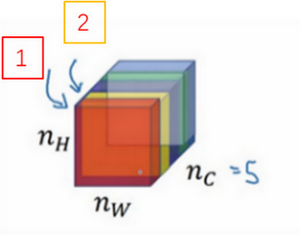

為了能捕捉圖片的風格，你需要進行下面這些操作，首先，先看前兩個通道，前兩個通道（編號1、2）分別是圖中的紅色和黃色部分，那我們該如何計算這兩個通道間啟動項的相關係數呢？

舉個例子，在影片的左下角在第一個通道中含有某個啟動項，第二個通道也含有某個啟動項，於是它們組成了一對數位（編號1所示）。然後我們再看看這個啟動項塊中其他位置的啟動項，它們也分別組成了很多對數位（編號2，3所示），分別來自第一個通道，也就是紅色通道和第二個通道，也就是黃色通道。現在我們得到了很多個數字對，當我們取得這兩個$n_{H}\times n_{W}$的通道中所有的數字對後，現在該如何計算它們的相關係數呢？它是如何決定圖片風格的呢？

我們來看一個例子，這是之前影片中的一個可視化例子，它來自一篇論文，作者是**Matthew Zeile**和**Rob Fergus** 我之前有提到過。我們知道，這個紅色的通道（編號1）對應的是這個神經元，它能找出圖片中的特定位置是否含有這些垂直的紋理（編號3），而第二個通道也就是黃色的通道（編號2），對應這個神經元（編號4），它可以粗略地找出橙色的區域。什麼時候兩個通道擁有高度相關性呢？如果它們有高度相關性，那麼這幅圖片中出現垂直紋理的地方（編號2），那麼這塊地方（編號4）很大機率是橙色的。如果說它們是不相關的，又是什麼意思呢？顯然，這意味著圖片中有垂直紋理的地方很大機率不是橙色的。而相關係數描述的就是當圖片某處出現這種垂直紋理時，該處又同時是橙色的可能性。

相關係數這個概念為你提供了一種去測量這些不同的特徵的方法，比如這些垂直紋理，這些橙色或是其他的特徵去測量它們在圖片中的各個位置同時出現或不同時出現的頻率。

如果我們在通道之間使用相關係數來描述通道的風格，你能做的就是測量你的生成圖像中第一個通道（編號1）是否與第二個通道（編號2）相關，通過測量，你能得知在生成的圖像中垂直紋理和橙色同時出現或者不同時出現的頻率，這樣你將能夠測量生成的圖像的風格與輸入的風格圖像的相似程度。

現在我們來證實這種說法，對於這兩個圖像，也就是風格圖像與生成圖像，你需要計算一個風格矩陣，說得更具體一點就是用$l$層來測量風格。

我們設$a_{i,\ j,\ k}^{[l]}$，設它為隱藏層l中$(i,j,k)$位置的啟動項，$i$，$j$，$k$分別代表該位置的高度、寬度以及對應的通道數。現在你要做的就是去計算一個關於$l$層和風格圖像的矩陣，即$G^{[l](S)}$（$l$表示層數，$S$表示風格圖像），這（$G^{[l]( S)}$）是一個$n_{c} \times n_{c}$的矩陣，同樣地，我們也對生成的圖像進行這個操作。

但是現在我們先來定義風格圖像，設這個關於$l$層和風格圖像的，$G$是一個矩陣，這個矩陣的高度和寬度都是$l$層的通道數。在這個矩陣中$k$和$k'$元素被用來描述$k$通道和$k'$通道之間的相關係數。具體地：

$G_{kk^{'}}^{[l]( S)} = \sum_{i = 1}^{n_{H}^{[l]}}{\sum_{j = 1}^{n_{W}^{[l]}}{a_{i,\ j,\ k}^{[l](S)}a_{i,\ j,\ k^{'}}^{[l](S)}}}$

用符號$i$，$j$表示下界，對$i$，$j$，$k$位置的啟動項$a_{i,\ j,\ k}^{[l]}$，乘以同樣位置的啟動項，也就是$i$,$ j$,$k'$位置的啟動項，即$a_{i,j,k^{'}}^{[l]}$，將它們兩個相乘。然後$i$和$j$分別加到l層的高度和寬度，即$n_{H}^{[l]}$和$n_{W}^{[l]}$，將這些不同位置的啟動項都加起來。$(i,j,k)$和$(i,j,k')$中$x$坐標和$y$坐標分別對應高度和寬度，將$k$通道和$k'$通道上這些位置的啟動項都進行相乘。我一直以來用的這個公式，嚴格來說，它是一種非標準的互相關函數，因為我們沒有減去平均數，而是將它們直接相乘。

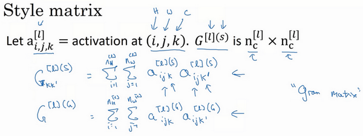

這就是輸入的風格圖像所構成的風格矩陣，然後，我們再對生成圖像做同樣的操作。

$G_{kk^{'}}^{[l]( G)} = \sum_{i = 1}^{n_{H}^{[l]}}{\sum_{j = 1}^{n_{W}^{[l]}}{a_{i,\ j,\ k}^{[l](G)}a_{i,\ j,\ k^{'}}^{[l](G)}}}$

$a_{i,\ j,\ k}^{[l](S)}$和$a_{i, j,k}^{[l](G)}$中的上標$(S)$和$(G)$分別表示在風格圖像$S$中的啟動項和在生成圖像$G$的啟動項。我們之所以用大寫字母$G$來代表這些風格矩陣，是因為在線性代數中這種矩陣有時也叫**Gram**矩陣，但在這裡我只把它們叫做風格矩陣。

所以你要做的就是計算出這張圖像的風格矩陣，以便能夠測量出剛才所說的這些相關係數。更正規地來表示，我們用$a_{i,j,k}^{[l]}$來記錄相應位置的啟動項，也就是$l$層中的$i,j,k$位置，所以$i$代表高度，$j$代表寬度，$k$代表著$l$中的不同通道。之前說過，我們有5個通道，所以$k$就代表這五個不同的通道。

對於這個風格矩陣，你要做的就是計算這個矩陣也就是$G^{[l]}$矩陣，它是個$n_{c} \times n_{c}$的矩陣，也就是一個方陣。記住，因為這裡有$n_{c}$個通道，所以矩陣的大小是$n_{c}\times n_{c}$。以便計算每一對啟動項的相關係數，所以$G_{\text{kk}^{'}}^{[l]}$可以用來測量$k$通道與$k'$通道中的啟動項之間的相關係數，$k$和$k'$會在1到$n_{c}$之間取值，$n_{c}$就是$l$層中通道的總數量。

當在計算$G^{[l]}$時，我寫下的這個符號（下標$kk’$）只代表一種元素，所以我要在右下角標明是$kk'$元素，和之前一樣$i$，$j$從一開始往上加，對應$(i,j,k)$位置的啟動項與對應$(i, j, k')$位置的啟動項相乘。記住，這個$i$和$j$是啟動塊中對應位置的坐標，也就是該啟動項所在的高和寬，所以$i$會從1加到$n_{H}^{[l]}$，$j$會從1加到$n_{W}^{[l]}$，$k$和$k'$則表示對應的通道，所以$k$和$k'$值的範圍是從1開始到這個神經網路中該層的通道數量$n_{C}^{[l]}$。這個式子就是把圖中各個高度和寬度的啟動項都遍歷一遍，並將$k$和$k'$通道中對應位置的啟動項都進行相乘，這就是$G_{{kk}^{'}}^{[l]}$的定義。通過對$k$和$k'$通道中所有的數值進行計算就得到了$G$矩陣，也就是風格矩陣。

$G_{kk^{'}}^{[l]} = \sum_{i = 1}^{n_{H}^{[l]}}{\sum_{j = 1}^{n_{W}^{[l]}}{a_{i,\ j,\ k}^{[l]}a_{i,\ j,\ k^{'}}^{[l]}}}$

要注意，如果兩個通道中的啟動項數值都很大，那麼$G_{{kk}^{'}}^{[l]}$也會變得很大，對應地，如果他們不相關那麼$G_{{kk}^{'}}^{[l]}$就會很小。嚴格來講，我一直使用這個公式來表達直覺想法，但它其實是一種非標準的互協方差，因為我們並沒有減去均值而只是把這些元素直接相乘，這就是計算圖像風格的方法。

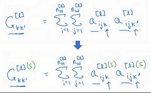

$G_{kk^{'}}^{[l]( S)} = \sum_{i = 1}^{n_{H}^{[l]}}{\sum_{j = 1}^{n_{W}^{[l]}}{a_{i,\ j,\ k}^{[l](S)}a_{i,\ j,\ k^{'}}^{[l](S)}}}$

你要同時對風格圖像$S$和生成圖像$G$都進行這個運算，為了區分它們，我們在它的右上角加一個$(S)$，表明它是風格圖像$S$，這些都是風格圖像S中的啟動項，之後你需要對生成圖像也做相同的運算。

$G_{kk^{'}}^{[l]( G)} = \sum_{i = 1}^{n_{H}^{[l]}}{\sum_{j = 1}^{n_{W}^{[l]}}{a_{i,\ j,\ k}^{[l](G)}a_{i,\ j,\ k^{'}}^{[l](G)}}}$

和之前一樣，再把公式都寫一遍，把這些都加起來，為了區分它是生成圖像，在這裡放一個$(G)$。

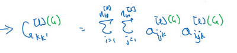

現在，我們有2個矩陣，分別從風格圖像$S$和生成圖像$G$。

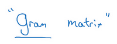

再提醒一下，我們一直使用大寫字母$G$來表示矩陣，是因為在線性代數中，這種矩陣被稱為**Gram**矩陣，但在本影片中我把它叫做風格矩陣，我們取了**Gram**矩陣的首字母$G$來表示這些風格矩陣。

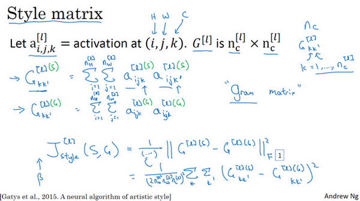

最後，如果我們將$S$和$G$代入到風格代價函數中去計算，這將得到這兩個矩陣之間的誤差，因為它們是矩陣，所以在這裡加一個$F$（**Frobenius**範數，編號1所示），這實際上是計算兩個矩陣對應元素相減的平方的和，我們把這個式子展開，從$k$和$k'$開始作它們的差，把對應的式子寫下來，然後把得到的結果都加起來，作者在這裡使用了一個歸一化常數，也就是$\frac{1}{2n_{H}^{[l]l}n_{W}^{[l]}n_{C}^{[l]}}$，再在外面加一個平方，但是一般情況下你不用寫這麼多，一般我們只要將它乘以一個超參數$\beta$就行。

最後，這是對$l$層定義的風格代價函數，和之前你見到的一樣，這是兩個矩陣間一個基本的**Frobenius**範數，也就是$S$圖像和$G$圖像之間的範數再乘上一個歸一化常數，不過這不是很重要。實際上，如果你對各層都使用風格代價函數，會讓結果變得更好。如果要對各層都使用風格代價函數，你可以這麼定義代價函數，把各個層的結果（各層的風格代價函數）都加起來，這樣就能定義它們全體了。我們還需要對每個層定義權重，也就是一些額外的超參數，我們用$\lambda^{[l]}$來表示，這樣將使你能夠在神經網路中使用不同的層，包括之前的一些可以測量類似邊緣這樣的低級特徵的層，以及之後的一些能測量高級特徵的層，使得我們的神經網路在計算風格時能夠同時考慮到這些低級和高級特徵的相關係數。這樣，在基礎的訓練中你在定義超參數時，可以儘可能的得到更合理的選擇。

為了把這些東西封裝起來，你現在可以定義一個全體代價函數：

$J(G) = a J_{\text{content}( C,G)} + \beta J_{{style}}(S,G)$

之後用梯度下降法，或者更複雜的最佳化算法來找到一個合適的圖像$G$，並計算$J(G)$的最小值，這樣的話，你將能夠得到非常好看的結果，你將能夠得到非常漂亮的結果。

這節神經風格遷移的內容就講到這裡，希望你能愉快地在本週的基礎訓練中進行實踐。在本週結束之前，還有最後一節內容想告訴你們，就是如何對**1D**和**3D**的數據進行卷積，之前我們處理的都是**2D**圖片，我們下節影片再見。

### 4.11 一維到三維推廣（1D and 3D generalizations of models）

你已經學習了許多關於卷積神經網路（**ConvNets**）的知識，從卷積神經網路框架，到如何使用它進行圖像識別、對象檢測、人臉識別與神經網路轉換。即使我們大部分討論的圖像數據，某種意義上而言都是**2D**數據，考慮到圖像如此普遍，許多你所掌握的思想不僅局限於**2D**圖像，甚至可以延伸至**1D**，乃至**3D**數據。

讓我們回頭看看在第一週課程中你所學習關於**2D**卷積，你可能會輸入一個14×14的圖像，並使用一個5×5的過濾器進行卷積，接下來你看到了14×14圖像是如何與5×5的過濾器進行卷積的，通過這個操作你會得到10×10的輸出。

如果你使用了多通道，比如14×14×3，那麼相匹配的過濾器可能是5×5×3，如果你使用了多重過濾，比如16，最終你得到的是10×10×16。

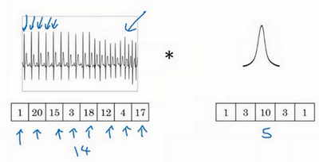

事實證明早期想法也同樣可以用於1維數據，舉個例子，左邊是一個**EKG**信號，或者說是心電圖，當你在你的胸部放置一個電極，電極透過胸部測量心跳帶來的微弱電流，正因為心臟跳動，產生的微弱電波能被一組電極測量，這就是人心跳產生的**EKG**，每一個峰值都對應著一次心跳。

如果你想使用**EKG**信號，比如醫學診斷，那麼你將處理1維數據，因為**EKG**數據是由時間序列對應的每個瞬間的電壓組成，這次不是一個14×14的尺寸輸入，你可能只有一個14尺寸輸入，在這種情況下你可能需要使用一個1維過濾進行卷積，你只需要一個1×5的過濾器，而不是一個5×5的。

二維數據的卷積是將同一個5×5特徵檢測器應用於圖像中不同的位置（編號1所示），你最後會得到10×10的輸出結果。1維過濾器可以取代你的5維過濾器（編號2所示），可在不同的位置中應用類似的方法（編號3，4，5所示）。

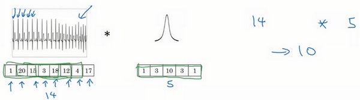

當你對這個1維信號使用卷積，你將發現一個14維的數據與5維數據進行卷積，並產生一個10維輸出。

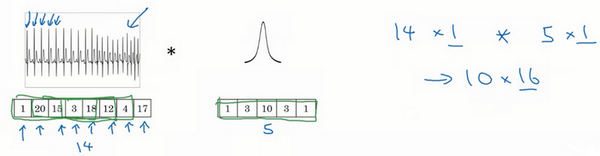

再一次如果你使用多通道，在這種場景下可能會獲得一個14×1的通道。如果你使用一個**EKG**，就是5×1的，如果你有16個過濾器，可能你最後會獲得一個10×16的數據，這可能會是你卷積網路中的某一層。

對於卷積網路的下一層，如果輸入一個10×16數據，你也可以使用一個5維過濾器進行卷積，這需要16個通道進行匹配，如果你有32個過濾器，另一層的輸出結果就是6×32，如果你使用了32個過濾器的話。

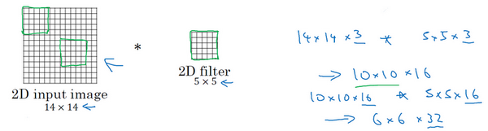

對於2D數據而言，當你處理10×10×16的數據時也是類似的，你可以使用5×5×16進行卷積，其中兩個通道數16要相匹配，你將得到一個6×6的輸出，如果你用的是32過濾器，輸出結果就是6×6×32，這也是32的來源。

所有這些方法也可以應用於1維數據，你可以在不同的位置使用相同的特徵檢測器，比如說，為了區分**EKG**信號中的心跳的差異，你可以在不同的時間軸位置使用同樣的特徵來檢測心跳。

所以卷積網路同樣可以被用於**1D**數據，對於許多1維數據應用，你實際上會使用遞迴神經網路進行處理，這個網路你會在下一個課程中學到，但是有些人依舊願意嘗試使用卷積網路解決這些問題。

下一門課將討論序列模型，包括遞迴神經網路、**LCM**與其他類似模型。我們將探討使用**1D**卷積網路的優缺點，對比於其它專門為序列數據而精心設計的模型。

這也是**2D**向**1D**的進化，對於3D數據來說如何呢？什麼是**3D**數據？與**1D**數列或數字矩陣不同，你現在有了一個**3D**塊，一個**3D**輸入數據。以你做**CT**掃描為例，這是一種使用**X**光照射，然後輸出身體的**3D**模型，**CT**掃描實現的是它可以獲取你身體不同片段（圖片訊息）。

當你進行**CT**掃描時，與我現在做的事情一樣，你可以看到人體軀幹的不同切片（整理者註：圖中所示為人體軀幹中不同層的切片，附**CT**掃描示意圖，圖片源於網際網路），本質上這個數據是3維的。

一種對這份數據的理解方式是，假設你的數據現在具備一定長度、寬度與高度，其中每一個切片都與軀幹的切片對應。

如果你想要在**3D**掃描或**CT**掃描中應用卷積網路進行特徵識別，你也可以從第一張幻燈片（**Convolutions in 2D and 1D**）裡得到想法，並將其應用到**3D**卷積中。為了簡單起見，如果你有一個**3D**對象，比如說是14×14×14，這也是輸入**CT**掃描的寬度與深度（後兩個14）。再次提醒，正如圖像不是必須以矩形呈現，**3D**對象也不是一定是一個完美立方體，所以長和寬可以不一樣，同樣**CT**掃描結果的長寬高也可以是不一致的。為了簡化討論，我僅使用14×14×14為例。

如果你現在使用5×5×5過濾器進行卷積，你的過濾器現在也是**3D**的，這將會給你一個10×10×10的結果輸出，技術上來說你也可以再×1（編號1所示），如果這有一個1的通道。這僅僅是一個**3D**模組，但是你的數據可以有不同數目的通道，那種情況下也是乘1（編號2所示），因為通道的數目必須與過濾器匹配。如果你使用16過濾器處理5×5×5×1，接下來的輸出將是10×10×10×16，這將成為你**3D**數據卷積網路上的一層。

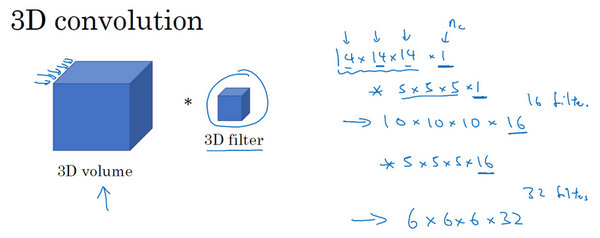

如果下一層卷積使用5×5×5×16維度的過濾器再次卷積，通道數目也與往常一樣匹配，如果你有32個過濾器，操作也與之前相同，最終你得到一個6×6×6×32的輸出。

某種程度上**3D**數據也可以使用**3D**卷積網路學習，這些過濾器實現的功能正是通過你的3D數據進行特徵檢測。**CT**醫療掃描是**3D**數據的一個實例，另一個數據處理的例子是你可以將電影中隨時間變化的不同影片切片看作是**3D**數據，你可以將這個技術用於檢測動作及人物行為。

總而言之這就是**1D**、**2D**及**3D**數據處理，圖像數據無處不在，以至於大多數卷積網路都是基於圖像上的**2D**數據，但我希望其他模型同樣會對你有幫助。

這是本週最後一次影片，也是最後一次關於卷積神經網路的課程，你已經學習了許多關於卷積網路的知識，我希望你能夠在未來工作中發現許多思想對你有所裨益，祝賀你完成了這些影片學習，我希望你能喜歡這週的課後練習，接下來關於順序模型的課程我們不見不散。

**參考文獻：**

- Florian Schroff, Dmitry Kalenichenko, James Philbin (2015). [FaceNet: A Unified Embedding for Face Recognition and Clustering](https://arxiv.org/pdf/1503.03832.pdf)
- Yaniv Taigman, Ming Yang, Marc'Aurelio Ranzato, Lior Wolf (2014). [DeepFace: Closing the gap to human-level performance in face verification](https://research.fb.com/wp-content/uploads/2016/11/deepface-closing-the-gap-to-human-level-performance-in-face-verification.pdf)
- The pretrained model we use is inspired by Victor Sy Wang's implementation and was loaded using his code: <https://github.com/iwantooxxoox/Keras-OpenFace>.
- Our implementation also took a lot of inspiration from the official FaceNet github repository: <https://github.com/davidsandberg/facenet>
- Leon A. Gatys, Alexander S. Ecker, Matthias Bethge, (2015). A Neural Algorithm of Artistic Style (<https://arxiv.org/abs/1508.06576>)
- Harish Narayanan, Convolutional neural networks for artistic style transfer. <https://harishnarayanan.org/writing/artistic-style-transfer/>
- Log0, TensorFlow Implementation of "A Neural Algorithm of Artistic Style". <http://www.chioka.in/tensorflow-implementation-neural-algorithm-of-artistic-style>
- Karen Simonyan and Andrew Zisserman (2015). Very deep convolutional networks for large-scale image recognition (<https://arxiv.org/pdf/1409.1556.pdf>)
- MatConvNet. <http://www.vlfeat.org/matconvnet/pretrained/>