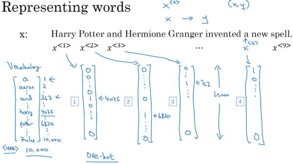
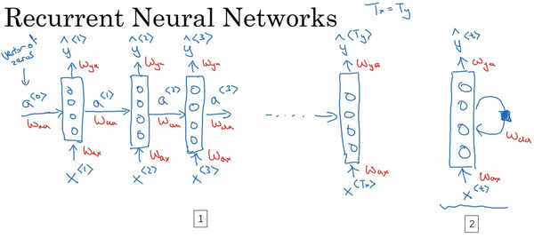
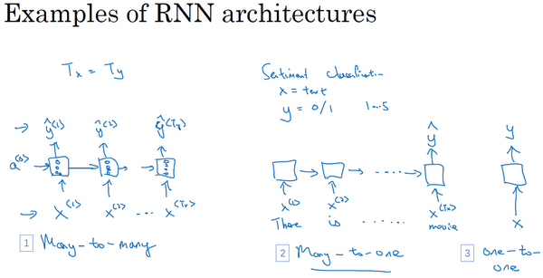
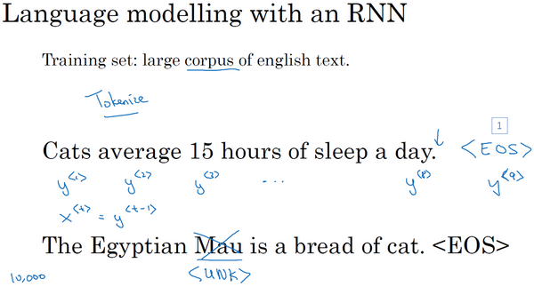
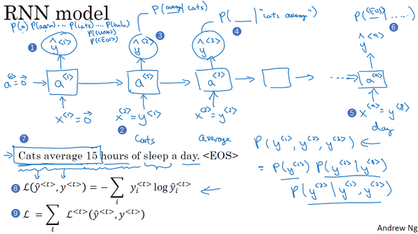
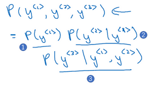
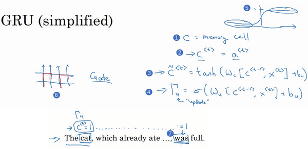
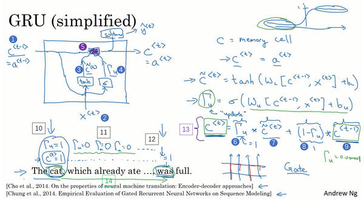
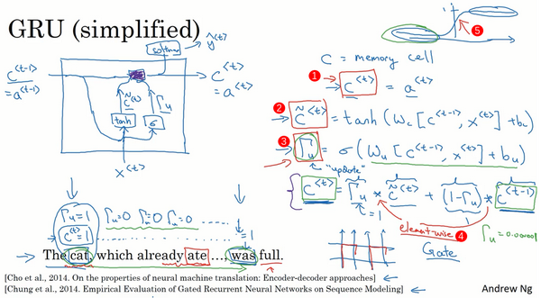
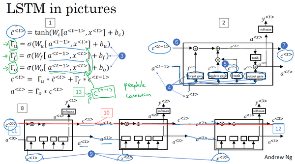

# 第五門課 序列模型(Sequence Models)

第一週 循環序列模型（Recurrent Neural Networks）
--------------------------------------------------------------
[TOC]
### 1.1 為什麼選擇序列模型？（Why Sequence Models?）

在本課程中你將學會序列模型，它是深度學習中最令人激動的內容之一。循環神經網路（**RNN**）之類的模型在語音識別、自然語言處理和其他領域中引起變革。在本節課中，你將學會如何自行創建這些模型。我們先看一些例子，這些例子都有效使用了序列模型。

在進行語音識別時，給定了一個輸入音訊片段 $X$，並要求輸出對應的文字記錄 $Y$。這個例子裡輸入和輸出數據都是序列模型，因為 $X$是一個按時播放的音訊片段，輸出 $Y$是一系列單詞。所以之後將要學到的一些序列模型，如循環神經網路等等在語音識別方面是非常有用的。

音樂生成問題是使用序列數據的另一個例子，在這個例子中，只有輸出數據 $Y$是序列，而輸入數據可以是空集，也可以是個單一的整數，這個數可能指代你想要生成的音樂風格，也可能是你想要生成的那首曲子的頭幾個音符。輸入的 $X$可以是空的，或者就是個數字，然後輸出序列 $Y$。

在處理情感分類時，輸入數據 $X$是序列，你會得到類似這樣的輸入：“**There is nothing to like in this movie.**”，你認為這句評論對應幾星？

系列模型在**DNA**序列分析中也十分有用，你的**DNA**可以用**A**、**C**、**G**、**T**四個字母來表示。所以給定一段**DNA**序列，你能夠標記出哪部分是匹配某種蛋白質的嗎？

在機器翻譯過程中，你會得到這樣的輸入句：“**Voulez-vou chante avecmoi?**”（法語：要和我一起唱嗎？），然後要求你輸出另一種語言的翻譯結果。

在進行視訊行為識別時，你可能會得到一系列影片幀，然後要求你識別其中的行為。

在進行命名實體識別時，可能會給定一個句子要你識別出句中的人名。

所以這些問題都可以被稱作使用標籤數據 $(X,Y)$作為訓練集的監督學習。但從這一系列例子中你可以看出序列問題有很多不同類型。有些問題裡，輸入數據 $X$和輸出數據$Y$都是序列，但就算在那種情況下，$X$和$Y$有時也會不一樣長。或者像上圖編號1所示和上圖編號2的$X$和$Y$有相同的數據長度。在另一些問題裡，只有 $X$或者只有$Y$是序列。

所以在本節我們學到適用於不同情況的序列模型。

下節中我們會定義一些定義序列問題要用到的符號。

### 1.2 數學符號（Notation）

本節先從定義符號開始一步步構建序列模型。

比如說你想要建立一個序列模型，它的輸入語句是這樣的：“**Harry Potter and Herminoe Granger invented a new spell.**”，(這些人名都是出自於**J.K.Rowling**筆下的系列小說**Harry Potter**)。假如你想要建立一個能夠自動識別句中人名位置的序列模型，那麼這就是一個命名實體識別問題，這常用於搜尋引擎，比如說索引過去24小時內所有新聞報導提及的人名，用這種方式就能夠恰當地進行索引。命名實體識別系統可以用來查找不同類型的文本中的人名、公司名、時間、地點、國家名和貨幣名等等。

現在給定這樣的輸入數據$x$，假如你想要一個序列模型輸出$y$，使得輸入的每個單詞都對應一個輸出值，同時這個$y$能夠表明輸入的單詞是否是人名的一部分。技術上來說這也許不是最好的輸出形式，還有更加複雜的輸出形式，它不僅能夠表明輸入詞是否是人名的一部分，它還能夠告訴你這個人名在這個句子裡從哪裡開始到哪裡結束。比如**Harry Potter**（上圖編號1所示）、**Hermione Granger**（上圖示號2所示）。

更簡單的那種輸出形式:

這個輸入數據是9個單詞組成的序列，所以最終我們會有9個特徵集和來表示這9個單詞，並按序列中的位置進行索引，$x^{<1>}$、$x^{<2>}$、$x^{<3>}$等等一直到$x^{<9>}$來索引不同的位置，我將用$x^{<t>}$來索引這個序列的中間位置。$t$意味著它們是時序序列，但不論是否是時序序列，我們都將用$t$來索引序列中的位置。

輸出數據也是一樣，我們還是用$y^{<1>}$、$y^{<2>}$、$y^{<3>}$等等一直到$y^{<9>}$來表示輸出數據。同時我們用$T_{x}$來表示輸入序列的長度，這個例子中輸入是9個單詞，所以$T_{x}= 9$。我們用$T_{y}$來表示輸出序列的長度。在這個例子裡$T_{x} =T_{y}$，上個影片裡你知道$T_{x}$和$T_{y}$可以有不同的值。

你應該記得我們之前用的符號，我們用$x^{(i)}$來表示第$i$個訓練樣本，所以為了指代第$t$個元素，或者說是訓練樣本i的序列中第$t$個元素用$x^{\left(i \right) <t>}$這個符號來表示。如果$T_{x}$是序列長度，那麼你的訓練集裡不同的訓練樣本就會有不同的長度，所以$T_{x}^{(i)}$就代表第$i$個訓練樣本的輸入序列長度。同樣$y^{\left( i \right) < t>}$代表第$i$個訓練樣本中第$t$個元素，$T_{y}^{(i)}$就是第$i$個訓練樣本的輸出序列的長度。

所以在這個例子中，$T_{x}^{(i)}=9$，但如果另一個樣本是由15個單詞組成的句子，那麼對於這個訓練樣本，$T_{x}^{(i)}=15$。

既然我們這個例子是**NLP**，也就是自然語言處理，這是我們初次涉足自然語言處理，一件我們需要事先決定的事是怎樣表示一個序列裡單獨的單詞，你會怎樣表示像**Harry**這樣的單詞，$x^{<1>}$實際應該是什麼？

接下來我們討論一下怎樣表示一個句子裡單個的詞。想要表示一個句子裡的單詞，第一件事是做一張詞表，有時也稱為詞典，意思是列一列你的表示方法中用到的單詞。這個詞表（下圖所示）中的第一個詞是**a**，也就是說詞典中的第一個單詞是**a**，第二個單詞是**Aaron**，然後更下面一些是單詞**and**，再後面你會找到**Harry**，然後找到**Potter**，這樣一直到最後，詞典裡最後一個單詞可能是**Zulu**。

因此**a**是第一個單詞，**Aaron**是第二個單詞，在這個詞典裡，**and**出現在367這個位置上，**Harry**是在4075這個位置，**Potter**在6830，詞典裡的最後一個單詞**Zulu**可能是第10,000個單詞。所以在這個例子中我用了10,000個單詞大小的詞典，這對現代自然語言處理應用來說太小了。對於商業應用來說，或者對於一般規模的商業應用來說30,000到50,000詞大小的詞典比較常見，但是100,000詞的也不是沒有，而且有些大型網際網路公司會用百萬詞，甚至更大的詞典。許多商業應用用的詞典可能是30,000詞，也可能是50,000詞。不過我將用10,000詞大小的詞典做說明，因為這是一個很好用的整數。

如果你選定了10,000詞的詞典，構建這個詞典的一個方法是遍歷你的訓練集，並且找到前10,000個常用詞，你也可以去瀏覽一些網路詞典，它能告訴你英語裡最常用的10,000個單詞，接下來你可以用**one-hot**表示法來表示詞典裡的每個單詞。

舉個例子，在這裡$x^{<1>}$表示**Harry**這個單詞，它就是一個第4075行是1，其餘值都是0的向量（上圖編號1所示），因為那是**Harry**在這個詞典裡的位置。

同樣$x^{<2>}$是個第6830行是1，其餘位置都是0的向量（上圖編號2所示）。

**and**在詞典裡排第367，所以$x^{<3>}$就是第367行是1，其餘值都是0的向量（上圖編號3所示）。如果你的詞典大小是10,000的話，那麼這裡的每個向量都是10,000維的。

因為**a**是字典第一個單詞，$x^{<7>}$對應**a**，那麼這個向量的第一個位置為1，其餘位置都是0的向量（上圖編號4所示）。

所以這種表示方法中，$x^{<t>}$指代句子裡的任意詞，它就是個**one-hot**向量，因為它只有一個值是1，其餘值都是0，所以你會有9個**one-hot**向量來表示這個句中的9個單詞，目的是用這樣的表示方式表示$X$，用序列模型在$X$和目標輸出$Y$之間學習建立一個映射。我會把它當作監督學習的問題，我確信會給定帶有$(x，y)$標籤的數據。

那麼還剩下最後一件事，我們將在之後的影片討論，如果你遇到了一個不在你詞表中的單詞，答案就是創建一個新的標記，也就是一個叫做**Unknow Word**的偽造單詞，用\<**UNK**\>作為標記，來表示不在詞表中的單詞，我們之後會討論更多有關這個的內容。

總結一下本節課的內容，我們描述了一套符號用來表述你的訓練集裡的序列數據$x$和$y$，在下節課我們開始講述循環神經網路中如何構建$X$到$Y$的映射。

### 1.3 循環神經網路模型（Recurrent Neural Network Model）

上節影片中，你了解了我們用來定義序列學習問題的符號。現在我們討論一下怎樣才能建立一個模型，建立一個神經網路來學習$X$到$Y$的映射。

可以嘗試的方法之一是使用標準神經網路，在我們之前的例子中，我們有9個輸入單詞。想像一下，把這9個輸入單詞，可能是9個**one-hot**向量，然後將它們輸入到一個標準神經網路中，經過一些隱藏層，最終會輸出9個值為0或1的項，它表明每個輸入單詞是否是人名的一部分。

但結果表明這個方法並不好，主要有兩個問題，

一、是輸入和輸出數據在不同例子中可以有不同的長度，不是所有的例子都有著同樣輸入長度$T_{x}$或是同樣輸出長度的$T_{y}$。即使每個句子都有最大長度，也許你能夠填充（**pad**）或零填充（**zero pad**）使每個輸入語句都達到最大長度，但仍然看起來不是一個好的表達方式。

二、一個像這樣單純的神經網路結構，它並不共享從文本的不同位置上學到的特徵。具體來說，如果神經網路已經學習到了在位置1出現的**Harry**可能是人名的一部分，那麼如果**Harry**出現在其他位置，比如$x^{<t>}$時，它也能夠自動識別其為人名的一部分的話，這就很棒了。這可能類似於你在卷積神經網路中看到的，你希望將部分圖片裡學到的內容快速推廣到圖片的其他部分，而我們希望對序列數據也有相似的效果。和你在卷積網路中學到的類似，用一個更好的表達方式也能夠讓你減少模型中參數的數量。

之前我們提到過這些（上圖編號1所示的$x^{<1>}$……$x^{<t>}$……$x^{< T_{x}>}$）都是10,000維的**one-hot**向量，因此這會是十分龐大的輸入層。如果總的輸入大小是最大單詞數乘以10,000，那麼第一層的權重矩陣就會有著巨量的參數。但循環神經網路就沒有上述的兩個問題。

那麼什麼是循環神經網路呢？我們先建立一個（下圖編號1所示）。如果你以從左到右的順序讀這個句子，第一個單詞就是，假如說是$x^{<1>}$，我們要做的就是將第一個詞輸入一個神經網路層，我打算這樣畫，第一個神經網路的隱藏層，我們可以讓神經網路嘗試預測輸出，判斷這是否是人名的一部分。循環神經網路做的是，當它讀到句中的第二個單詞時，假設是$x^{<2>}$，它不是僅用$x^{<2>}$就預測出${\hat{y}}^{<2>}$，他也會輸入一些來自時間步1的訊息。具體而言，時間步1的啟動值就會傳遞到時間步2。然後，在下一個時間步，循環神經網路輸入了單詞$x^{<3>}$，然後它嘗試預測輸出了預測結果${\hat{y}}^{<3>}$，等等，一直到最後一個時間步，輸入了$x^{<T_{x}>}$，然後輸出了${\hat{y}}^{< T_{y} >}$。至少在這個例子中$T_{x} =T_{y}$，同時如果$T_{x}$和$T_{y}$不相同，這個結構會需要作出一些改變。所以在每一個時間步中，循環神經網路傳遞一個啟動值到下一個時間步中用於計算。

要開始整個流程，在零時刻需要構造一個啟動值$a^{<0>}$，這通常是零向量。有些研究人員會隨機用其他方法初始化$a^{<0>}$，不過使用零向量作為零時刻的偽啟動值是最常見的選擇，因此我們把它輸入神經網路。

在一些研究論文中或是一些書中你會看到這類神經網路，用這樣的圖形來表示（上圖編號2所示），在每一個時間步中，你輸入$x^{<t>}$然後輸出$y^{<t>}$。然後為了表示循環連接有時人們會像這樣畫個圈，表示輸回網路層，有時他們會畫一個黑色方塊，來表示在這個黑色方塊處會延遲一個時間步。我個人認為這些循環圖很難理解，所以在本次課程中，我畫圖更傾向於使用左邊這種分布畫法（上圖編號1所示）。不過如果你在教材中或是研究論文中看到了右邊這種圖表的畫法（上圖編號2所示），它可以在心中將這圖展開成左圖那樣。

循環神經網路是從左向右掃描數據，同時每個時間步的參數也是共享的，所以下頁幻燈片中我們會詳細講述它的一套參數，我們用$W_{\text{ax}}$來表示管理著從$x^{<1>}$到隱藏層的連接的一系列參數，每個時間步使用的都是相同的參數$W_{\text{ax}}$。而啟動值也就是水平聯繫是由參數$W_{aa}$決定的，同時每一個時間步都使用相同的參數$W_{aa}$，同樣的輸出結果由$W_{\text{ya}}$決定。下圖詳細講述這些參數是如何起作用。

在這個循環神經網路中，它的意思是在預測${\hat{y}}^{< 3 >}$時，不僅要使用$x^{<3>}$的訊息，還要使用來自$x^{<1>}$和$x^{<2>}$的訊息，因為來自$x^{<1>}$的訊息可以透過這樣的路徑（上圖編號1所示的路徑）來幫助預測${\hat{y}}^{<3>}$。這個循環神經網路的一個缺點就是它只使用了這個序列中之前的訊息來做出預測，尤其當預測${\hat{y}}^{<3>}$時，它沒有用到$x^{<4>}$，$x^{<5>}$，$x^{<6>}$等等的訊息。所以這就有一個問題，因為如果給定了這個句子，“**Teddy Roosevelt was a great President.**”，為了判斷**Teddy**是否是人名的一部分，僅僅知道句中前兩個詞是完全不夠的，還需要知道句中後部分的訊息，這也是十分有用的，因為句子也可能是這樣的，“**Teddy bears are on sale!**”。因此如果只給定前三個單詞，是不可能確切地知道**Teddy**是否是人名的一部分，第一個例子是人名，第二個例子就不是，所以你不可能只看前三個單詞就能分辨出其中的區別。

所以這樣特定的神經網路結構的一個限制是它在某一時刻的預測僅使用了從序列之前的輸入訊息並沒有使用序列中後部分的訊息，我們會在之後的雙向循環神經網路（**BRNN**）的影片中處理這個問題。但對於現在，這個更簡單的單向神經網路結構就夠我們來解釋關鍵概念了，之後只要在此基礎上作出修改就能同時使用序列中前面和後面的訊息來預測${\hat{y}}^{<3>}$，不過我們會在之後的影片講述這些內容，接下來我們具體地寫出這個神經網路計算了些什麼。

這裡是一張清理後的神經網路示意圖，和我之前提及的一樣，一般開始先輸入$a^{<0>}$，它是一個零向量。接著就是前向傳播過程，先計算啟動值$a^{<1>}$，然後再計算$y^{<1>}$。

$a^{<1>} = g_{1}(W_{{aa}}a^{< 0 >} + W_{{ax}}x^{< 1 >} + b_{a})$

$\hat y^{< 1 >} = g_{2}(W_{{ya}}a^{< 1 >} + b_{y})$

我將用這樣的符號約定來表示這些矩陣下標，舉個例子$W_{\text{ax}}$，第二個下標意味著$W_{\text{ax}}$要乘以某個$x$類型的量，然後第一個下標$a$表示它是用來計算某個$a$類型的變數。同樣的，可以看出這裡的$W_{\text{ya}}$乘上了某個$a$類型的量，用來計算出某個$\hat {y}$類型的量。

循環神經網路用的啟動函數經常是**tanh**，不過有時候也會用**ReLU**，但是**tanh**是更通常的選擇，我們有其他方法來避免梯度消失問題，我們將在之後進行講述。選用哪個啟動函數是取決於你的輸出$y$，如果它是一個二分問題，那麼我猜你會用**sigmoid**函數作為啟動函數，如果是$k$類別分類問題的話，那麼可以選用**softmax**作為啟動函數。不過這裡啟動函數的類型取決於你有什麼樣類型的輸出$y$，對於命名實體識別來說$y$只可能是0或者1，那我猜這裡第二個啟動函數$g$可以是**sigmoid**啟動函數。

更一般的情況下，在$t$時刻，

$a^{< t >} = g_{1}(W_{aa}a^{< t - 1 >} + W_{ax}x^{< t >} + b_{a})$

$\hat y^{< t >} = g_{2}(W_{{ya}}a^{< t >} + b_{y})$

所以這些等式定義了神經網路的前向傳播，你可以從零向量$a^{<0>}$開始，然後用$a^{<0>}$和$x^{<1>}$來計算出$a^{<1>}$和$\hat y^{<1>}$，然後用$x^{<2>}$和$a^{<1>}$一起算出$a^{<2>}$和$\hat y^{<2>}$等等，像圖中這樣，從左到右完成前向傳播。

現在為了幫我們建立更複雜的神經網路，我實際要將這個符號簡化一下，我在下一張幻燈片裡複製了這兩個等式（上圖編號1所示的兩個等式）。

接下來為了簡化這些符號，我要將這部分（$W_{\text{aa}}a^{<t -1>} +W_{\text{ax}}x^{<t>}$）（上圖編號1所示）以更簡單的形式寫出來，我把它寫做$a^{<t>} =g(W_{a}\left\lbrack a^{< t-1 >},x^{<t>} \right\rbrack +b_{a})$（上圖編號2所示），那麼左右兩邊劃線部分應該是等價的。所以我們定義$W_{a}$的方式是將矩陣$W_{aa}$和矩陣$W_{{ax}}$水平並列放置，$[ {{W}_{aa}}\vdots {{W}_{ax}}]=W_{a}$（上圖編號3所示）。舉個例子，如果$a$是100維的，然後延續之前的例子，$x$是10,000維的，那麼$W_{aa}$就是個$（100，100）$維的矩陣，$W_{ax}$就是個$（100，10,000）$維的矩陣，因此如果將這兩個矩陣堆起來，$W_{a}$就會是個$（100，10,100）$維的矩陣。

用這個符號（$\left\lbrack a^{< t - 1 >},x^{< t >}\right\rbrack$）的意思是將這兩個向量堆在一起，我會用這個符號表示，即$\begin{bmatrix}a^{< t-1 >} \\ x^{< t >} \\\end{bmatrix}$（上圖編號4所示），最終這就是個10,100維的向量。你可以自己檢查一下，用這個矩陣乘以這個向量，剛好能夠得到原來的量，因為此時，矩陣$[ {{W}_{aa}}\vdots {{W}_{ax}}]$乘以$\begin{bmatrix} a^{< t - 1 >} \\ x^{< t >} \\ \end{bmatrix}$，剛好等於$W_{{aa}}a^{<t-1>} + W_{{ax}}x^{<t>}$，剛好等於之前的這個結論（上圖編號5所示）。這種記法的好處是我們可以不使用兩個參數矩陣$W_{{aa}}$和$W_{{ax}}$，而是將其壓縮成一個參數矩陣$W_{a}$，所以當我們建立更複雜模型時這就能夠簡化我們要用到的符號。

同樣對於這個例子（$\hat y^{<t>} = g(W_{ya}a^{<t>} +b_{y})$），我會用更簡單的方式重寫，$\hat y^{< t >} = g(W_{y}a^{< t >} +b_{y})$（上圖編號6所示）。現在$W_{y}$和$b_{y}$符號僅有一個下標，它表示在計算時會輸出什麼類型的量，所以$W_{y}$就表明它是計算$y$類型的量的權重矩陣，而上面的$W_{a}$和$b_{a}$則表示這些參數是用來計算$a$類型或者說是啟動值的。

**RNN**前向傳播示意圖：

好就這麼多，你現在知道了基本的循環神經網路，下節課我們會一起來討論反向傳播，以及你如何能夠用**RNN**進行學習。

### 1.4 通過時間的反向傳播（Backpropagation through time）

之前我們已經學過了循環神經網路的基礎結構，在本節影片中我們將來了解反向傳播是怎樣在循環神經網路中運行的。和之前一樣，當你在編程框架中實現循環神經網路時，編程框架通常會自動處理反向傳播。但我認為，在循環神經網路中，對反向傳播的運行有一個粗略的認識還是非常有用的，讓我們來一探究竟。

在之前你已經見過對於前向傳播（上圖藍色箭頭所指方向）怎樣在神經網路中從左到右地計算這些啟動項，直到輸出所有地預測結果。而對於反向傳播，我想你已經猜到了，反向傳播地計算方向（上圖紅色箭頭所指方向）與前向傳播基本上是相反的。

我們來分析一下前向傳播的計算，現在你有一個輸入序列，$x^{<1>}$，$x^{<2>}$，$x^{<3>}$一直到$x^{< T_{x} >}$，然後用$x^{<1>}$還有$a^{<0>}$計算出時間步1的啟動項，再用$x^{<2>}$和$a^{<1>}$計算出$a^{<2>}$，然後計算$a^{<3>}$等等，一直到$a^{< T_{x} >}$。

為了真正計算出$a^{<1>}$，你還需要一些參數，$W_{a}$和$b_{a}$，用它們來計算出$a^{<1>}$。這些參數在之後的每一個時間步都會被用到，於是繼續用這些參數計算$a^{<2>}$，$a^{<3>}$等等，所有的這些啟動項都要取決於參數$W_{a}$和$b_{a}$。有了$a^{<1>}$，神經網路就可以計算第一個預測值$\hat y^{<1>}$，接著到下一個時間步，繼續計算出$\hat y^{<2>}$，$\hat  y^{<3>}$，等等，一直到$\hat y^{<T_{y}>}$。為了計算出${\hat{y}}$，需要參數$W_{y}$和$b_{y}$，它們將被用於所有這些節點。

然後為了計算反向傳播，你還需要一個損失函數。我們先定義一個元素損失函數（上圖編號1所示）

$L^{<t>}( \hat y^{<t>},y^{<t>}) = - y^{<t>}\log\hat  y^{<t>}-( 1- y^{<t>})log(1-\hat y^{<t>})$

它對應的是序列中一個具體的詞，如果它是某個人的名字，那麼$y^{<t>}$的值就是1，然後神經網路將輸出這個詞是名字的機率值，比如0.1。我將它定義為標準邏輯回歸損失函數，也叫交叉熵損失函數（**Cross Entropy Loss**），它和之前我們在二分類問題中看到的公式很像。所以這是關於單個位置上或者說某個時間步$t$上某個單詞的預測值的損失函數。

現在我們來定義整個序列的損失函數，將$L$定義為（上圖編號2所示）

$L(\hat y,y) = \ \sum_{t = 1}^{T_{x}}{L^{< t >}(\hat  y^{< t >},y^{< t >})}$

在這個計算圖中，通過$\hat y^{<1>}$可以計算對應的損失函數，於是計算出第一個時間步的損失函數（上圖編號3所示），然後計算出第二個時間步的損失函數，然後是第三個時間步，一直到最後一個時間步，最後為了計算出總體損失函數，我們要把它們都加起來，通過下面的等式（上圖編號2所示的等式）計算出最後的$L$（上圖編號4所示），也就是把每個單獨時間步的損失函數都加起來。

這就是完整的計算圖，在之前的例子中，你已經見過反向傳播，所以你應該能夠想得到反向傳播算法需要在相反的方向上進行計算和傳遞訊息，最終你做的就是把前向傳播的箭頭都反過來，在這之後你就可以計算出所有合適的量，然後你就可以通過導數相關的參數，用梯度下降法來更新參數。

在這個反向傳播的過程中，最重要的訊息傳遞或者說最重要的遞迴運算就是這個從右到左的運算，這也就是為什麼這個算法有一個很別緻的名字，叫做**“通過（穿越）時間反向傳播**（**backpropagation through time**）”。取這個名字的原因是對於前向傳播，你需要從左到右進行計算，在這個過程中，時刻$t$不斷增加。而對於反向傳播，你需要從右到左進行計算，就像時間倒流。“通過時間反向傳播”，就像穿越時光，這種說法聽起來就像是你需要一台時光機來實現這個算法一樣。

**RNN**反向傳播示意圖：

希望你大致了解了前向和反向傳播是如何在**RNN**中工作的，到目前為止，你只見到了**RNN**中一個主要的例子，其中輸入序列的長度和輸出序列的長度是一樣的。在下節課將展示更多的**RNN**架構，這將讓你能夠處理一些更廣泛的應用。

### 1.5 不同類型的循環神經網路（Different types of **RNN**s）

現在你已經了解了一種**RNN**結構，它的輸入量$T_{x}$等於輸出數量$T_{y}$。事實上，對於其他一些應用，$T_{x}$和$T_{y}$並不一定相等。在這個影片裡，你會看到更多的**RNN**的結構。

你應該還記得這週第一個影片中的那個幻燈片，那裡有很多例子輸入$x$和輸出$y$，有各種類型，並不是所有的情況都滿足$T_{x}=T_{y}$。

比如音樂生成這個例子，$T_{x}$可以是長度為1甚至為空集。再比如電影情感分類，輸出$y$可以是1到5的整數，而輸入是一個序列。在命名實體識別中，這個例子中輸入長度和輸出長度是一樣的。

還有一些情況，輸入長度和輸出長度不同，他們都是序列但長度不同，比如機器翻譯，一個法語句子和一個英語句子不同數量的單詞卻能表達同一個意思。

所以我們應該修改基本的**RNN**結構來處理這些問題，這個影片的內容參考了**Andrej Karpathy**的部落格，一篇叫做《循環神經網路的非理性效果》（“**The Unreasonable Effectiveness of Recurrent Neural Networks**”）的文章，我們看一些例子。

你已經見過$T_{x} = T_{y}$的例子了（下圖編號1所示），也就是我們輸入序列$x^{<1>}$，$x^{<2>}$，一直到$x^{< T_{x}>}$，我們的循環神經網路這樣工作，輸入$x^{<1>}$來計算$\hat y^{<1>}$，$\hat y^{<2>}$等等一直到$\hat y^{<T_{y}>}$。在原先的圖裡，我會畫一串圓圈表示神經元，大部分時候為了讓符號更加簡單，此處就以簡單的小圈表示。這個就叫做“多對多”（**many-to-many**）的結構，因為輸入序列有很多的輸入，而輸出序列也有很多輸出。

現在我們看另外一個例子，假如說，你想處理情感分類問題（下圖編號2所示），這裡$x$可能是一段文本，比如一個電影的評論，“**These is nothing to like in this movie.**”（“這部電影沒什麼還看的。”），所以$x$就是一個序列，而$y$可能是從1到5的一個數字，或者是0或1，這代表正面評價和負面評價，而數字1到5代表電影是1星，2星，3星，4星還是5星。所以在這個例子中，我們可以簡化神經網路的結構，輸入$x^{<1 >}$，$x^{< 2 >}$，一次輸入一個單詞，如果輸入文本是“**These is nothing to like in this movie**”，那麼單詞的對應如下圖編號2所示。我們不再在每個時間上都有輸出了，而是讓這個**RNN**網路讀入整個句子，然後在最後一個時間上得到輸出，這樣輸入的就是整個句子，所以這個神經網路叫做“多對一”（**many-to-one**）結構，因為它有很多輸入，很多的單詞，然後輸出一個數字。

為了完整性，還要補充一個“**一對一**”（**one-to-one**）的結構（上圖編號3所示），這個可能沒有那麼重要，這就是一個小型的標準的神經網路，輸入$x$然後得到輸出$y$，我們這個系列課程的前兩個課程已經討論過這種類型的神經網路了。

除了“**多對一**”的結構，也可以有“**一對多**”（**one-to-many**）的結構。對於一個“一對多”神經網路結構的例子就是音樂生成（上圖編號1所示），事實上，你會在這個課後編程練習中去實現這樣的模型，你的目標是使用一個神經網路輸出一些音符。對應於一段音樂，輸入$x$可以是一個整數，表示你想要的音樂類型或者是你想要的音樂的第一個音符，並且如果你什麼都不想輸入，$x$可以是空的輸入，可設為0向量。

這樣這個神經網路的結構，首先是你的輸入$x$，然後得到**RNN**的輸出，第一個值，然後就沒有輸入了，再得到第二個輸出，接著輸出第三個值等等，一直到合成這個音樂作品的最後一個音符，這裡也可以寫上輸入$a^{<0>}$（上圖編號3所示）。有一個後面才會講到的技術細節，當你生成序列時通常會把第一個合成的輸出也餵給下一層（上圖編號4所示），所以實際的網路結構最終就像這個樣子。

我們已經討論了“**多對多**”、“**多對一**”、“**一對一**”和“**一對多**”的結構，對於“多對多”的結構還有一個有趣的例子值得詳細說一下，就是輸入和輸出長度不同的情況。你剛才看過的多對多的例子，它的輸入長度和輸出長度是完全一樣的。而對於像機器翻譯這樣的應用，輸入句子的單詞的數量，比如說一個法語的句子，和輸出句子的單詞數量，比如翻譯成英語，這兩個句子的長度可能不同，所以還需要一個新的網路結構，一個不同的神經網路（上圖編號2所示）。首先讀入這個句子，讀入這個輸入，比如你要將法語翻譯成英語，讀完之後，這個網路就會輸出翻譯結果。有了這種結構$T_{x}$和$T_{y}$就可以是不同的長度了。同樣，你也可以畫上這個$a^{<0>}$。這個網路的結構有兩個不同的部分，這（上圖編號5所示）是一個編碼器，獲取輸入，比如法語句子，這（上圖編號6所示）是解碼器，它會讀取整個句子，然後輸出翻譯成其他語言的結果。

這就是一個“**多對多**”結構的例子，到這週結束的時候，你就能對這些各式各樣結構的基本構件有一個很好的理解。嚴格來說，還有一種結構，我們會在第四周涉及到，就是“注意力”（**attention based**）結構，但是根據我們現在畫的這些圖不好理解這個模型。

總結一下這些各式各樣的**RNN**結構，這（上圖編號1所示）是“**一對一**”的結構，當去掉$a^{<0>}$時它就是一種標準類型的神經網路。還有一種“**一對多**”的結構（上圖編號2所示），比如音樂生成或者序列生成。還有“**多對一**”，這（上圖編號3所示）是情感分類的例子，首先讀取輸入，一個電影評論的文本，然後判斷他們是否喜歡電影還是不喜歡。還有“**多對多**”的結構（上圖編號4所示），命名實體識別就是“**多對多**”的例子，其中$T_{x}=T_{y}$。最後還有一種“**多對多**”結構的其他版本（上圖編號5所示），對於像機器翻譯這樣的應用，$T_{x}$和$T_{y}$就可以不同了。

現在，你已經了解了大部分基本的模組，這些就是差不多所有的神經網路了，除了序列生成，有些細節的問題我們會在下節課講解。

我希望你從本影片中了解到用這些**RNN**的基本模組，把它們組合在一起就可以構建各式各樣的模型。但是正如我前面提到的，序列生成還有一些不一樣的地方，在這週的練習裡，你也會實現它，你需要構建一個語言模型，結果好的話會得到一些有趣的序列或者有意思的文本。下節課深入探討序列生成。

### 1.6 語言模型和序列生成（Language model and sequence generation）

在自然語言處理中，構建語言模型是最基礎的也是最重要的工作之一，並且能用**RNN**很好地實現。在本影片中，你將學習用**RNN**構建一個語言模型，在本週結束的時候，還會有一個很有趣的程式練習，你能在練習中構建一個語言模型，並用它來生成莎士比亞文風的文本或其他類型文本。

所以什麼是語言模型呢？比如你在做一個語音識別系統，你聽到一個句子，“**the apple and pear（pair） salad was delicious.**”，所以我究竟說了什麼？我說的是 “**the apple and pair salad**”，還是“**the apple and pear salad**”？（**pear**和**pair**是近音詞）。你可能覺得我說的應該更像第二種，事實上，這就是一個好的語音識別系統要幫助輸出的東西，即使這兩句話聽起來是如此相似。而讓語音識別系統去選擇第二個句子的方法就是使用一個語言模型，他能計算出這兩句話各自的可能性。

舉個例子，一個語音識別模型可能算出第一句話的機率是$P( \text{The apple  and  pair  salad}) = 3.2 \times 10^{-13}$，而第二句話的機率是$P\left(\text{The apple  and  pear salad} \right) = 5.7 \times 10^{-10}$，比較這兩個機率值，顯然我說的話更像是第二種，因為第二句話的機率比第一句高出1000倍以上，這就是為什麼語音識別系統能夠在這兩句話中作出選擇。

所以語言模型所做的就是，它會告訴你某個特定的句子它出現的機率是多少，根據我所說的這個機率，假設你隨機拿起一張報紙，打開任意郵件，或者任意網頁或者聽某人說下一句話，並且這個人是你的朋友，這個你即將從世界上的某個地方得到的句子會是某個特定句子的機率是多少，例如“**the apple and pear salad**”。它是兩種系統的基本組成部分，一個剛才所說的語音識別系統，還有機器翻譯系統，它要能正確輸出最接近的句子。而語言模型做的最基本工作就是輸入一個句子，準確地說是一個文本序列，$y^{<1>}$，$y^{<2>}$一直到$y^{<T_{y}>}$。對於語言模型來說，用$y$來表示這些序列比用$x$來表示要更好，然後語言模型會估計某個句子序列中各個單詞出現的可能性。

那麼如何建立一個語言模型呢？為了使用**RNN**建立出這樣的模型，你首先需要一個訓練集，包含一個很大的英文文本語料庫（**corpus**）或者其它的語言，你想用於構建模型的語言的語料庫。語料庫是自然語言處理的一個專有名詞，意思就是很長的或者說數量眾多的英文句子組成的文本。

假如說，你在訓練集中得到這麼一句話，“**Cats average 15 hours of sleep a day.**”(貓一天睡15小時)，你要做的第一件事就是將這個句子標記化，意思就是像之前影片中一樣，建立一個字典，然後將每個單詞都轉換成對應的**one-hot**向量，也就是字典中的索引。可能還有一件事就是你要定義句子的結尾，一般的做法就是增加一個額外的標記，叫做**EOS**（上圖編號1所示），它表示句子的結尾，這樣能夠幫助你搞清楚一個句子什麼時候結束，我們之後會詳細討論這個。**EOS**標記可以被附加到訓練集中每一個句子的結尾，如果你想要你的模型能夠準確識別句子結尾的話。在本週的練習中我們不需要使用這個**EOS**標記，不過在某些應用中你可能會用到它，不過稍後就能見到它的用處。於是在本例中我們，如果你加了**EOS**標記，這句話就會有9個輸入，有$y^{<1>}$，$y^{<2>}$一直到$y^{<9>}$。在標記化的過程中，你可以自行決定要不要把標點符號看成標記，在本例中，我們忽略了標點符號，所以我們只把**day**看成標誌，不包括後面的句號，如果你想把句號或者其他符號也當作標誌，那麼你可以將句號也加入你的字典中。

現在還有一個問題如果你的訓練集中有一些詞並不在你的字典裡，比如說你的字典有10,000個詞，10,000個最常用的英語單詞。現在這個句，“**The Egyptian Mau is a bread of cat.**”其中有一個詞**Mau**，它可能並不是預先的那10,000個最常用的單詞，在這種情況下，你可以把**Mau**替換成一個叫做**UNK**的代表未知詞的標誌，我們只針對**UNK**建立機率模型，而不是針對這個具體的詞**Mau**。

完成標識化的過程後，這意味著輸入的句子都映射到了各個標誌上，或者說字典中的各個詞上。下一步我們要構建一個**RNN**來構建這些序列的機率模型。在下一張幻燈片中會看到的一件事就是最後你會將$x^{<t>}$設為$y^{<t-1>}$。

現在我們來建立**RNN**模型，我們繼續使用“**Cats average 15 hours of sleep a day.**”這個句子來作為我們的運行樣例，我將會畫出一個**RNN**結構。在第0個時間步，你要計算啟動項$a^{<1>}$，它是以$x^{<1 >}$作為輸入的函數，而$x^{<1>}$會被設為全為0的集合，也就是0向量。在之前的$a^{<0>}$按照慣例也設為0向量，於是$a^{<1>}$要做的就是它會透過**softmax**進行一些預測來計算出第一個詞可能會是什麼，其結果就是$\hat y^{<1>}$（上圖編號1所示），這一步其實就是透過一個**softmax**層來預測字典中的任意單詞會是第一個詞的機率，比如說第一個詞是$a$的機率有多少，第一個詞是**Aaron**的機率有多少，第一個詞是**cats**的機率又有多少，就這樣一直到**Zulu**是第一個詞的機率是多少，還有第一個詞是**UNK**（未知詞）的機率有多少，還有第一個詞是句子結尾標誌的機率有多少，表示不必閱讀。所以$\hat y^{<1>}$的輸出是**softmax**的計算結果，它只是預測第一個詞的機率，而不去管結果是什麼。在我們的例子中，最終會得到單詞**Cats**。所以**softmax**層輸出10,000種結果，因為你的字典中有10,000個詞，或者會有10,002個結果，因為你可能加上了未知詞，還有句子結尾這兩個額外的標誌。

然後**RNN**進入下個時間步，在下一時間步中，仍然使用啟動項$a^{<1>}$，在這步要做的是計算出第二個詞會是什麼。現在我們依然傳給它正確的第一個詞，我們會告訴它第一個詞就是**Cats**，也就是$\hat y^{<1>}$，告訴它第一個詞就是**Cats**，這就是為什麼$y^{<1>} = x^{<2>}$（上圖編號2所示）。然後在第二個時間步中，輸出結果同樣經過**softmax**層進行預測，**RNN**的職責就是預測這些詞的機率（上圖編號3所示），而不會去管結果是什麼，可能是b或者**arron**，可能是**Cats**或者**Zulu**或者**UNK**（未知詞）或者**EOS**或者其他詞，它只會考慮之前得到的詞。所以在這種情況下，我猜正確答案會是**average**，因為句子確實就是**Cats average**開頭的。

然後再進行**RNN**的下個時間步，現在要計算$a^{<3>}$。為了預測第三個詞，也就是15，我們現在給它之前兩個詞，告訴它**Cats average**是句子的前兩個詞，所以這是下一個輸入，$x^{<3>} = y^{<2>}$，輸入**average**以後，現在要計算出序列中下一個詞是什麼，或者說計算出字典中每一個詞的機率（上圖編號4所示），通過之前得到的**Cats**和**average**，在這種情況下，正確結果會是15，以此類推。

一直到最後，沒猜錯的話，你會停在第9個時間步，然後把$x^{<9>}$也就是$y^{<8>}$傳給它（上圖編號5所示），也就是單詞**day**，這裡是$a^{<9>}$，它會輸出$y^{<9>}$，最後的得到結果會是**EOS**標誌，在這一步中，通過前面這些得到的單詞，不管它們是什麼，我們希望能預測出**EOS**句子結尾標誌的機率會很高（上圖編號6所示）。

所以**RNN**中的每一步都會考慮前面得到的單詞，比如給它前3個單詞（上圖編號7所示），讓它給出下個詞的分布，這就是**RNN**如何學習從左往右地每次預測一個詞。

接下來為了訓練這個網路，我們要定義代價函數。於是，在某個時間步$t$，如果真正的詞是$y^{<t>}$，而神經網路的**softmax**層預測結果值是$y^{<t>}$，那麼這（上圖編號8所示）就是**softmax**損失函數，$L\left( \hat y^{<t>},y^{<t>}>\right) = - \sum_{i}^{}{y_{i}^{<t>}\log\hat y_{i}^{<t>}}$。而總體損失函數（上圖編號9所示）$L = \sum_{t}^{}{L^{< t >}\left( \hat y^{<t>},y^{<t>} \right)}$，也就是把所有單個預測的損失函數都相加起來。

如果你用很大的訓練集來訓練這個**RNN**，你就可以通過開頭一系列單詞像是**Cars average 15**或者**Cars average 15 hours of**來預測之後單詞的機率。現在有一個新句子，它是$y^{<1>}$，$y^{<2>}$，$y^{<3>}$，為了簡單起見，它只包含3個詞（如上圖所示），現在要計算出整個句子中各個單詞的機率，方法就是第一個**softmax**層會告訴你$y^{<1>}$的機率（上圖編號1所示），這也是第一個輸出，然後第二個**softmax**層會告訴你在考慮$y^{<1>}$的情況下$y^{<2>}$的機率（上圖編號2所示），然後第三個**softmax**層告訴你在考慮$y^{<1>}$和$y^{<2>}$的情況下$y^{<3>}$的機率（上圖編號3所示），把這三個機率相乘，最後得到這個含3個詞的整個句子的機率。

這就是用**RNN**訓練一個語言模型的基礎結構，可能我說的這些東西聽起來有些抽象，不過別擔心，你可以在編程練習中親自實現這些東西。下一節課用語言模型做的一件最有趣的事就是從模型中進行採樣。

### 1.7 對新序列採樣（Sampling novel sequences）

在你訓練一個序列模型之後，要想了解到這個模型學到了什麼，一種非正式的方法就是進行一次新序列採樣，來看看到底應該怎麼做。

記住一個序列模型模擬了任意特定單詞序列的機率，我們要做的就是對這些機率分布進行採樣來生成一個新的單詞序列。下圖編號1所示的網路已經被上方所展示的結構訓練訓練過了，而為了進行採樣（下圖編號2所示的網路），你要做一些截然不同的事情。

第一步要做的就是對你想要模型生成的第一個詞進行採樣，於是你輸入$x^{<1>} =0$，$a^{<0>} =0$，現在你的第一個時間步得到的是所有可能的輸出是經過**softmax**層後得到的機率，然後根據這個**softmax**的分布進行隨機採樣。**Softmax**分布給你的訊息就是第一個詞**a**的機率是多少，第一個詞是**aaron**的機率是多少，第一個詞是**zulu**的機率是多少，還有第一個詞是**UNK**（未知標識）的機率是多少，這個標識可能代表句子的結尾，然後對這個向量使用例如**numpy**命令，`np.random.choice`（上圖編號3所示），來根據向量中這些機率的分布進行採樣，這樣就能對第一個詞進行採樣了。

然後繼續下一個時間步，記住第二個時間步需要$\hat y^{<1>}$作為輸入，而現在要做的是把剛剛採樣得到的$\hat y^{<1>}$放到$a^{<2>}$（上圖編號4所示），作為下一個時間步的輸入，所以不管你在第一個時間步得到的是什麼詞，都要把它傳遞到下一個位置作為輸入，然後**softmax**層就會預測$\hat y^{<2>}$是什麼。舉個例子，假如說對第一個詞進行抽樣後，得到的是**The**，**The**作為第一個詞的情況很常見，然後把**The**當成$x^{<2>}$，現在$x^{<2>}$就是$\hat y^{<1>}$，現在你要計算出在第一詞是**The**的情況下，第二個詞應該是什麼（上圖編號5所示），然後得到的結果就是$\hat y^{<2>}$，然後再次用這個採樣函數來對$\hat y^{<2>}$進行採樣。

然後再到下一個時間步，無論你得到什麼樣的用**one-hot**碼表示的選擇結果，都把它傳遞到下一個時間步，然後對第三個詞進行採樣。不管得到什麼都把它傳遞下去，一直這樣直到最後一個時間步。

那麼你要怎樣知道一個句子結束了呢？方法之一就是，如果代表句子結尾的標識在你的字典中，你可以一直進行採樣直到得到**EOS**標識（上圖編號6所示），這代表著已經抵達結尾，可以停止採樣了。另一種情況是，如果你的字典中沒有這個詞，你可以決定從20個或100個或其他個單詞進行採樣，然後一直將採樣進行下去直到達到所設定的時間步。不過這種過程有時候會產生一些未知標識（上圖編號7所示），如果你要確保你的算法不會輸出這種標識，你能做的一件事就是拒絕採樣過程中產生任何未知的標識，一旦出現就繼續在剩下的詞中進行重採樣，直到得到一個不是未知標識的詞。如果你不介意有未知標識產生的話，你也可以完全不管它們。

這就是你如何從你的**RNN**語言模型中生成一個隨機選擇的句子。直到現在我們所建立的是基於詞彙的**RNN**模型，意思就是字典中的詞都是英語單詞（下圖編號1所示）。

根據你實際的應用，你還可以構建一個基於字元的**RNN**結構，在這種情況下，你的字典僅包含從**a**到**z**的字母，可能還會有空格符，如果你需要的話，還可以有數字0到9，如果你想區分字母大小寫，你可以再加上大寫的字母，你還可以實際地看一看訓練集中可能會出現的字元，然後用這些字元組成你的字典（上圖編號2所示）。

如果你建立一個基於字元的語言模型，比起基於詞彙的語言模型，你的序列$\hat y^{<1>}$，$\hat y^{<2>}$，$\hat y^{<3>}$在你的訓練數據中將會是單獨的字元，而不是單獨的詞彙。所以對於前面的例子來說，那個句子（上圖編號3所示），“**Cats average 15 hours of sleep a day.**”，在該例中**C**就是$\hat y^{<1>}$，**a**就是$\hat y^{<2>}$，**t**就是$\hat y^{<3>}$，空格符就是$\hat y^{<4>}$等等。

使用基於字元的語言模型有有點也有缺點，優點就是你不必擔心會出現未知的標識，例如基於字元的語言模型會將**Mau**這樣的序列也視為可能性非零的序列。而對於基於詞彙的語言模型，如果**Mau**不在字典中，你只能把它當作未知標識**UNK**。不過基於字元的語言模型一個主要缺點就是你最後會得到太多太長的序列，大多數英語句子只有10到20個的單詞，但卻可能包含很多很多字元。所以基於字元的語言模型在捕捉句子中的依賴關係也就是句子較前部分如何影響較後部分不如基於詞彙的語言模型那樣可以捕捉長範圍的關係，並且基於字元的語言模型訓練起來計算成本比較高昂。所以我見到的自然語言處理的趨勢就是，絕大多數都是使用基於詞彙的語言模型，但隨著計算機性能越來越高，會有更多的應用。在一些特殊情況下，會開始使用基於字元的模型。但是這確實需要更昂貴的計算力來訓練，所以現在並沒有得到廣泛地使用，除了一些比較專門需要處理大量未知的文本或者未知詞彙的應用，還有一些要面對很多專有詞彙的應用。

在現有的方法下，現在你可以構建一個**RNN**結構，看一看英文文本的語料庫，然後建立一個基於詞彙的或者基於字元的語言模型，然後從訓練的語言模型中進行採樣。

這裡有一些樣本，它們是從一個語言模型中採樣得到的，準確來說是基於字元的語言模型，你可以在編程練習中自己實現這樣的模型。如果模型是用新聞文章訓練的，它就會生成左邊這樣的文本，這有點像一篇不太合乎語法的新聞文本，不過聽起來，這句“**Concussion epidemic**”，**to be examined**，確實有點像新聞報導。用莎士比亞的文章訓練後生成了右邊這篇東西，聽起來很像是莎士比亞寫的東西：

“**The mortal moon hath her eclipse in love.**

**And subject of this thou art another this fold.**

**When besser be my love to me see sabl's.**

**For whose are ruse of mine eyes heaves.**”

這些就是基礎的**RNN**結構和如何去建立一個語言模型並使用它，對於訓練出的語言模型進行採樣。在之後的影片中，我想探討在訓練**RNN**時一些更加深入的挑戰以及如何適應這些挑戰，特別是梯度消失問題來建立更加強大的**RNN**模型。下節課，我們將談到梯度消失並且會開始談到**GRU**，也就是門控循環單元和**LSTM**長期記憶網路模型。

### 1.8 循環神經網路的梯度消失（Vanishing gradients with **RNN**s）

你已經了解了**RNN**時如何工作的了，並且知道如何應用到具體問題上，比如命名實體識別，比如語言模型，你也看到了怎麼把反向傳播用於**RNN**。其實，基本的**RNN**算法還有一個很大的問題，就是梯度消失的問題。這節課我們會討論，在下幾節課我們會討論一些方法用來解決這個問題。

你已經知道了**RNN**的樣子，現在我們舉個語言模型的例子，假如看到這個句子（上圖編號1所示），“**The cat, which already ate ……, was full.**”，前後應該保持一致，因為**cat**是單數，所以應該用**was**。“**The cats, which ate ……, were full.**”（上圖編號2所示），**cats**是複數，所以用**were**。這個例子中的句子有長期的依賴，最前面的單詞對句子後面的單詞有影響。但是我們目前見到的基本的**RNN**模型（上圖編號3所示的網路模型），不擅長捕獲這種長期依賴效應，解釋一下為什麼。

你應該還記得之前討論的訓練很深的網路，我們討論了梯度消失的問題。比如說一個很深很深的網路（上圖編號4所示），100層，甚至更深，對這個網路從左到右做前向傳播然後再反向傳播。我們知道如果這是個很深的神經網路，從輸出$\hat y$得到的梯度很難傳播回去，很難影響靠前層的權重，很難影響前面層（編號5所示的層）的計算。

對於有同樣問題的**RNN**，首先從左到右前向傳播，然後反向傳播。但是反向傳播會很困難，因為同樣的梯度消失的問題，後面層的輸出誤差（上圖編號6所示）很難影響前面層（上圖編號7所示的層）的計算。這就意味著，實際上很難讓一個神經網路能夠意識到它要記住看到的是單數名詞還是複數名詞，然後在序列後面生成依賴單複數形式的**was**或者**were**。而且在英語裡面，這中間的內容（上圖編號8所示）可以任意長，對吧？所以你需要長時間記住單詞是單數還是複數，這樣後面的句子才能用到這些訊息。也正是這個原因，所以基本的**RNN**模型會有很多局部影響，意味著這個輸出$\hat y^{<3>}$（上圖編號9所示）主要受$\hat y^{<3>}$附近的值（上圖編號10所示）的影響，上圖編號11所示的一個數值主要與附近的輸入（上圖編號12所示）有關，上圖編號6所示的輸出，基本上很難受到序列靠前的輸入（上圖編號10所示）的影響，這是因為不管輸出是什麼，不管是對的，還是錯的，這個區域都很難反向傳播到序列的前面部分，也因此網路很難調整序列前面的計算。這是基本的**RNN**算法的一個缺點，我們會在下幾節影片裡處理這個問題。如果不管的話，**RNN**會不擅長處理長期依賴的問題。

儘管我們一直在討論梯度消失問題，但是，你應該記得我們在講很深的神經網路時，我們也提到了梯度爆炸，我們在反向傳播的時候，隨著層數的增多，梯度不僅可能指數型的下降，也可能指數型的上升。事實上梯度消失在訓練**RNN**時是首要的問題，儘管梯度爆炸也是會出現，但是梯度爆炸很明顯，因為指數級大的梯度會讓你的參數變得極其大，以至於你的網路參數崩潰。所以梯度爆炸很容易發現，因為參數會大到崩潰，你會看到很多**NaN**，或者不是數字的情況，這意味著你的網路計算出現了數值溢出。如果你發現了梯度爆炸的問題，一個解決方法就是用梯度修剪。梯度修剪的意思就是觀察你的梯度向量，如果它大於某個閾值，縮放梯度向量，保證它不會太大，這就是透過一些最大值來修剪的方法。所以如果你遇到了梯度爆炸，如果導數值很大，或者出現了**NaN**，就用梯度修剪，這是相對比較魯棒的，這是梯度爆炸的解決方法。然而梯度消失更難解決，這也是我們下幾節影片的主題。

總結一下，在前面的課程，我們了解了訓練很深的神經網路時，隨著層數的增加，導數有可能指數型的下降或者指數型的增加，我們可能會遇到梯度消失或者梯度爆炸的問題。加入一個**RNN**處理1,000個時間序列的數據集或者10,000個時間序列的數據集，這就是一個1,000層或者10,000層的神經網路，這樣的網路就會遇到上述類型的問題。梯度爆炸基本上用梯度修剪就可以應對，但梯度消失比較棘手。我們下節會介紹**GRU**，門控循環單元網路，這個網路可以有效地解決梯度消失的問題，並且能夠使你的神經網路捕獲更長的長期依賴，我們去下個影片一探究竟吧。

### 1.9 **GRU**單元（Gated Recurrent Unit（**GRU**））

你已經了解了基礎的**RNN**模型的運行機制，在本節影片中你將會學習門控循環單元，它改變了**RNN**的隱藏層，使其可以更好地捕捉深層連接，並改善了梯度消失問題，讓我們看一看。

你已經見過了這個公式，$a^{< t >} = g(W_{a}\left\lbrack a^{< t - 1 >},x^{< t >}\right\rbrack +b_{a})$，在**RNN**的時間$t$處，計算啟動值。我把這個畫個圖，把**RNN**的單元畫個圖，畫一個方框，輸入$a^{<t-1>}$（上圖編號1所示），即上一個時間步的啟動值，再輸入$x^{<t>}$（上圖編號2所示），再把這兩個並起來，然後乘上權重項，在這個線性計算之後（上圖編號3所示），如果$g$是一個**tanh**啟動函數，再經過**tanh**計算之後，它會計算出啟動值$a^{<t>}$。然後啟動值$a^{<t>}$將會傳**softmax**單元（上圖編號4所示），或者其他用於產生輸出$y^{<t>}$的東西。就這張圖而言，這就是**RNN**隱藏層的單元的可視化呈現。我向展示這張圖，因為我們將使用相似的圖來講解門控循環單元。

許多**GRU**的想法都來分別自於**Yu Young Chang, Kagawa，Gaza Hera, Chang Hung Chu**和
**Jose Banjo**的兩篇論文。我再引用上個影片中你已經見過的這個句子，“**The cat, which already ate……, was full.**”，你需要記得貓是單數的，為了確保你已經理解了為什麼這裡是**was**而不是**were**，“**The cat was full.**”或者是“**The cats were full**”。當我們從左到右讀這個句子，**GRU**單元將會有個新的變數稱為$c$，代表細胞（**cell**），即記憶細胞（下圖編號1所示）。記憶細胞的作用是提供了記憶的能力，比如說一隻貓是單數還是複數，所以當它看到之後的句子的時候，它仍能夠判斷句子的主語是單數還是複數。於是在時間$t$處，有記憶細胞$c^{<t>}$，然後我們看的是，**GRU**實際上輸出了啟動值$a^{<t>}$，$c^{<t>} = a^{<t>}$（下圖編號2所示）。於是我們想要使用不同的符號$c$和$a$來表示記憶細胞的值和輸出的活化值，即使它們是一樣的。我現在使用這個標記是因為當我們等會說到**LSTMs**的時候，這兩個會是不同的值，但是現在對於**GRU**，$c^{<t>}$的值等於$a^{<t>}$的啟動值。

所以這些等式表示了**GRU**單元的計算，在每個時間步，我們將用一個候選值重寫記憶細胞，即${\tilde{c}}^{<t>}$的值，所以它就是個候選值，替代了$c^{<t>}$的值。然後我們用**tanh**啟動函數來計算，${\tilde{c}}^{<t>} =tanh(W_{c}\left\lbrack c^{<t-1>},x^{<t>} \right\rbrack +b_{c})$，所以${\tilde{c}}^{<t>}$的值就是個替代值，代替表示$c^{<t>}$的值（下圖編號3所示）。

重點來了，在**GRU**中真正重要的思想是我們有一個門，我先把這個門叫做$\Gamma_{u}$（上圖編號4所示），這是個下標為$u$的大寫希臘字母$\Gamma$，$u$代表更新門，這是一個0到1之間的值。為了讓你直觀思考**GRU**的工作機制，先思考$\Gamma_{u}$，這個一直在0到1之間的門值，實際上這個值是把這個式子帶入**sigmoid**函數得到的，$\Gamma_{u}= \sigma(W_{u}\left\lbrack c^{<t-1>},x^{<t>} \right\rbrack +b_{u})$。我們還記得**sigmoid**函數是上圖編號5所示這樣的，它的輸出值總是在0到1之間，對於大多數可能的輸入，**sigmoid**函數的輸出總是非常接近0或者非常接近1。在這樣的直覺下，可以想到$\Gamma_{u}$在大多數的情況下非常接近0或1。然後這個字母**u**表示“**update**”，我選了字母$\Gamma$是因為它看起來像門。還有希臘字母**G**，**G**是門的首字母，所以**G**表示門。

然後**GRU**的關鍵部分就是上圖編號3所示的等式，我們剛才寫出來的用$\tilde{c}$更新$c$的等式。然後門決定是否要真的更新它。於是我們這麼看待它，記憶細胞$c^{<t>}$將被設定為0或者1，這取決於你考慮的單詞在句子中是單數還是複數，因為這裡是單數情況，所以我們先假定它被設為了1，或者如果是複數的情況我們就把它設為0。然後**GRU**單元將會一直記住$c^{<t>}$的值，直到上圖編號7所示的位置，$c^{<t>}$的值還是1，這就告訴它，噢，這是單數，所以我們用**was**。於是門，即$\Gamma_{u}$的作用就是決定什麼時候你會更新這個值，特別是當你看到詞組**the cat**，即句子的主語貓，這就是一個好時機去更新這個值。然後當你使用完它的時候，“**The cat, which already ate……, was full.**”，然後你就知道，我不需要記住它了，我可以忘記它了。

所以我們接下來要給**GRU**用的式子就是$c^{<t>} = \Gamma_{u}*{\tilde{c}}^{<t>} +\left( 1- \Gamma_{u} \right)*c^{<t-1>}$（上圖編號1所示）。你應該注意到了，如果這個更新值$\Gamma_{u} =1$，也就是說把這個新值，即$c^{<t>}$設為候選值（$\Gamma_{u} =1$時簡化上式，$c^{<t>} = {\tilde{c}}^{<t>}$）。將門值設為1（上圖編號2所示），然後往前再更新這個值。對於所有在這中間的值，你應該把門的值設為0，即$\Gamma_{u}= 0$，意思就是說不更新它，就用舊的值。因為如果$\Gamma_{u} = 0$，則$c^{<t>} =c^{<t-1>}$，$c^{<t>}$等於舊的值。甚至你從左到右掃描這個句子，當門值為0的時候（上圖編號3所示，中間$\Gamma_{u}=0$一直為0，表示一直不更新），就是說不更新它的時候，不要更新它，就用舊的值，也不要忘記這個值是什麼，這樣即使你一直處理句子到上圖編號4所示，$c^{<t>}$應該會一直等$c^{<t-1>}$，於是它仍然記得貓是單數的。

讓我再畫個圖來（下圖所示）解釋一下**GRU**單元，順便說一下，當你在看網路上的部落格或者教科書或者教學之類的，這些圖對於解釋**GRU**和我們稍後會講的**LSTM**是相當流行的，我個人感覺式子在圖片中比較容易理解，那麼即使看不懂圖片也沒關係，我就畫畫，萬一能幫得上忙就最好了。

**GRU**單元輸入$c^{<t-1>}$（下圖編號1所示），對於上一個時間步，先假設它正好等於$a^{<t-1>}$，所以把這個作為輸入。然後$x^{<t>}$也作為輸入（下圖編號2所示），然後把這兩個用合適權重結合在一起，再用**tanh**計算，算出${\tilde{c}}^{<t>}$，${\tilde{c}}^{<t>} =tanh(W_{c}\left\lbrack c^{<t-1>},x^{<t>} \right\rbrack +b_{c})$，即$c^{<t>}$的替代值。

再用一個不同的參數集，通過**sigmoid**啟動函數算出$\Gamma_{u}$，$\Gamma_{u}= \sigma(W_{u}\left\lbrack c^{<t-1>},x^{<t>} \right\rbrack +b_{u})$，即更新門。最後所有的值通過另一個運算符結合，我並不會寫出公式，但是我用紫色陰影標註的這個方框（下圖編號5所示，其所代表的運算過程即下圖編號13所示的等式），代表了這個式子。所以這就是紫色運算符所表示的是，它輸入一個門值（下圖編號6所示），新的候選值（下圖編號7所示），這再有一個門值（下圖編號8所示）和$c^{<t>}$的舊值（下圖編號9所示），所以它把這個（下圖編號1所示）、這個（下圖編號3所示）和這個（下圖編號4所示）作為輸入一起產生記憶細胞的新值$c^{<t>}$，所以$c^{<t>}$等於$a^{<t>}$。如果你想，你也可以也把這個代入**softmax**或者其他預測$y^{<t>}$的東西。

這就是**GRU**單元或者說是一個簡化過的**GRU**單元，它的優點就是通過門決定，當你從左（上圖編號10所示）到右掃描一個句子的時候，這個時機是要更新某個記憶細胞，還是不更新，不更新（上圖編號11所示，中間$\Gamma_{u}=0$一直為0，表示一直不更新）直到你到你真的需要使用記憶細胞的時候（上圖編號12所示），這可能在句子之前就決定了。因為sigmoid的值，現在因為門很容易取到0值，只要這個值是一個很大的負數，再由於數值上的四捨五入，上面這些門大體上就是0，或者說非常非常非常接近0。所以在這樣的情況下，這個更新式子（上圖編號13所示的等式）就會變成$c^{<t>} = c^{<t-1>}$，這非常有利於維持細胞的值。因為$\Gamma_{u}$很接近0，可能是0.000001或者更小，這就不會有梯度消失的問題了。因為$\Gamma_{u}$很接近0，這就是說$c^{<t>}$幾乎就等於$c^{<t-1>}$，而且$c^{<t>}$的值也很好地被維持了，即使經過很多很多的時間步（上圖編號14所示）。這就是紓解梯度消失問題的關鍵，因此允許神經網路運行在非常龐大的依賴詞上，比如說**cat**和**was**單詞即使被中間的很多單詞分割開。

現在我想說下一些實現的細節，在這個我寫下的式子中$c^{<t>}$可以是一個向量（上圖編號1所示），如果你有100維的隱藏的啟動值，那麼$c^{<t>}$也是100維的，${\tilde{c}}^{<t>}$也是相同的維度（${\tilde{c}}^{<t>} =tanh(W_{c}\left\lbrack c^{<t-1>},x^{<t>} \right\rbrack +b_{c})$），$\Gamma_{u}$也是相同的維度（$\Gamma_{u}= \sigma(W_{u}\left\lbrack c^{<t-1>},x^{<t>} \right\rbrack +b_{u})$），還有畫在框中的其他值。這樣的話“\*”實際上就是元素對應的乘積（$c^{<t>} = \Gamma_{u}*{\tilde{c}}^{<t>} +\left( 1- \Gamma_{u} \right)*c^{<t-1>}$），所以這裡的$\Gamma_{u}$：（$\Gamma_{u}= \sigma(W_{u}\left\lbrack c^{<t-1>},x^{<t>} \right\rbrack +b_{u})$），即如果門是一個100維的向量，$\Gamma_{u}$也就100維的向量，裡面的值幾乎都是0或者1，就是說這100維的記憶細胞$c^{<t>}$（$c^{<t>}=a^{<t>}$上圖編號1所示）就是你要更新的比特。

當然在實際應用中$\Gamma_{u}$不會真的等於0或者1，有時候它是0到1的一個中間值（上圖編號5所示），但是這對於直觀思考是很方便的，就把它當成確切的0，完全確切的0或者就是確切的1。元素對應的乘積做的就是告訴**GRU**單元哪個記憶細胞的向量維度在每個時間步要做更新，所以你可以選擇保存一些比特不變，而去更新其他的比特。比如說你可能需要一個比特來記憶貓是單數還是複數，其他比特來理解你正在談論食物，因為你在談論吃飯或者食物，然後你稍後可能就會談論“**The cat was full.**”，你可以每個時間點只改變一些比特。

你現在已經理解**GRU**最重要的思想了，幻燈片中展示的實際上只是簡化過的**GRU**單元，現在來描述一下完整的**GRU**單元。

對於完整的**GRU**單元我要做的一個改變就是在我們計算的第一個式子中給記憶細胞的新候選值加上一個新的項，我要添加一個門$\Gamma_{r}$（下圖編號1所示），你可以認為$r$代表相關性（**relevance**）。這個$\Gamma_{r}$門告訴你計算出的下一個$c^{<t>}$的候選值${\tilde{c}}^{<t>}$跟$c^{<t-1>}$有多大的相關性。計算這個門$\Gamma_{r}$需要參數，正如你看到的這個，一個新的參數矩陣$W_{r}$，$\Gamma_{r}= \sigma(W_{r}\left\lbrack c^{<t-1>},x^{<t>} \right\rbrack + b_{r})$。

正如你所見，有很多方法可以來設計這些類型的神經網路，然後我們為什麼有$\Gamma_{r}$？為什麼不用上一張幻燈片裡的簡單的版本？這是因為多年來研究者們試驗過很多很多不同可能的方法來設計這些單元，去嘗試讓神經網路有更深層的連接，去嘗試產生更大範圍的影響，還有解決梯度消失的問題，**GRU**就是其中一個研究者們最常使用的版本，也被發現在很多不同的問題上也是非常健壯和實用的。你可以嘗試發明新版本的單元，只要你願意。但是**GRU**是一個標準版本，也就是最常使用的。你可以想像到研究者們也嘗試了很多其他版本，類似這樣的但不完全是，比如我這裡寫的這個。然後另一個常用的版本被稱為**LSTM**，表示長短時記憶網路，這個我們會在下節影片中講到，但是**GRU**和**LSTM**是在神經網路結構中最常用的兩個具體實例。

還有在符號上的一點，我嘗試去定義固定的符號讓這些概念容易理解，如果你看學術文章的話，你有的時候會看到有些人使用另一種符號$\tilde{x}$，$u$，$r$和$h$表示這些量。但我試著在**GRU**和**LSTM**之間用一種更固定的符號，比如使用更固定的符號$\Gamma$來表示門，所以希望這能讓這些概念更好理解。

所以這就是**GRU**，即門控循環單元，這是**RNN**的其中之一。這個結構可以更好捕捉非常長範圍的依賴，讓**RNN**更加有效。然後我簡單提一下其他常用的神經網路，比較經典的是這個叫做**LSTM**，即長短時記憶網路，我們在下節影片中講解。

（**Chung J, Gulcehre C, Cho K H, et al. Empirical Evaluation of Gated Recurrent Neural Networks on Sequence Modeling[J]. Eprint Arxiv, 2014.**

**Cho K, Merrienboer B V, Bahdanau D, et al. On the Properties of Neural Machine Translation: Encoder-Decoder Approaches[J]. Computer Science, 2014.**）

### 1.10 長短期記憶（**LSTM**（long short term memory）unit）

在上一個影片中你已經學了**GRU**（門控循環單元）。它能夠讓你可以在序列中學習非常深的連接。其他類型的單元也可以讓你做到這個，比如**LSTM**即長短時記憶網路，甚至比**GRU**更加有效，讓我們看看。

這裡是上個影片中的式子，對於**GRU**我們有$a^{< t >} = c^{<t>}$。

還有兩個門:

更新門$\Gamma_{u}$（**the update gate**）

相關門$\Gamma_{r}$（**the relevance gate**）

${\tilde{c}}^{<t>}$，這是代替記憶細胞的候選值，然後我們使用更新門$\Gamma_{u}$來決定是否要用${\tilde{c}}^{<t>}$ 更新$c^{<t>}$。

**LSTM**是一個比**GRU**更加強大和通用的版本，這多虧了 **Sepp Hochreiter**和 **Jurgen Schmidhuber**，感謝那篇開創性的論文，它在序列模型上有著巨大影響。我感覺這篇論文是挺難讀懂的，雖然我認為這篇論文在深度學習社群有著重大的影響，它深入討論了梯度消失的理論，我感覺大部分的人學到**LSTM**的細節是在其他的地方，而不是這篇論文。

這就是**LSTM**主要的式子（上圖編號2所示），我們繼續回到記憶細胞**c**上面來，使用${\tilde{c}}^{<t>} = tanh(W_{c}\left\lbrack a^{<t-1>},x^{<t>} \right\rbrack +b_{c}$來更新它的候選值${\tilde{c}}^{<t>}$（上圖編號3所示）。注意了，在**LSTM**中我們不再有$a^{<t>} = c^{<t>}$的情況，這是現在我們用的是類似於左邊這個式子（上圖編號4所示），但是有一些改變，現在我們專門使用$a^{<t>}$或者$a^{<t-1>}$，而不是用$c^{<t-1>}$，我們也不用$\Gamma_{r}$，即相關門。雖然你可以使用**LSTM**的變體，然後把這些東西（左邊所示的**GRU**公式）都放回來，但是在更加典型的**LSTM**裡面，我們先不那樣做。

我們像以前那樣有一個更新門$\Gamma_{u}$和表示更新的參數$W_{u}$，$\Gamma_{u}= \sigma(W_{u}\left\lbrack a^{<t-1>},x^{<t>} \right\rbrack +b_{u})$（上圖編號5所示）。一個**LSTM**的新特性是不只有一個更新門控制，這裡的這兩項（上圖編號6，7所示），我們將用不同的項來代替它們，要用別的項來取代$\Gamma_{u}$和$1-\Gamma_{u}$，這裡（上圖編號6所示）我們用$\Gamma_{u}$。

然後這裡（上圖編號7所示）用遺忘門（**the forget gate**），我們叫它$\Gamma_{f}$，所以這個$\Gamma_{f} =\sigma(W_{f}\left\lbrack a^{<t-1>},x^{<t>} \right\rbrack +b_{f})$（上圖編號8所示）；

然後我們有一個新的輸出門，$\Gamma_{o} =\sigma(W_{o}\left\lbrack a^{<t-1>},x^{<t>} \right\rbrack +>b_{o})$（上圖編號9所示）；

於是記憶細胞的更新值$c^{<t>} =\Gamma_{u}*{\tilde{c}}^{<t>} + \Gamma_{f}*c^{<t-1>}$（上圖編號10所示）；

所以這給了記憶細胞選擇權去維持舊的值$c^{<t-1>}$或者就加上新的值${\tilde{c}}^{<t>}$，所以這裡用了單獨的更新門$\Gamma_{u}$和遺忘門$\Gamma_{f}$，

然後這個表示更新門（$\Gamma_{u}= \sigma(W_{u}\left\lbrack a^{<t-1>},x^{<t>} \right\rbrack +b_{u})$上圖編號5所示）；

遺忘門（$\Gamma_{f} =\sigma(W_{f}\left\lbrack a^{<t-1>},x^{<t>} \right\rbrack +b_{f})$上圖編號8所示）和輸出門（上圖編號9所示）。

最後$a^{<t>} = c^{<t>}$的式子會變成$a^{<t>} = \Gamma_{o}*c^{<t>}$。這就是**LSTM**主要的式子了，然後這裡（上圖編號11所示）有三個門而不是兩個，這有點複雜，它把門放到了和之前有點不同的地方。

再提一下，這些式子就是控制**LSTM**行為的主要的式子了（上圖編號1所示）。像之前一樣用圖片稍微解釋一下，先讓我把圖畫在這裡（上圖編號2所示）。如果圖片過於複雜，別擔心，我個人感覺式子比圖片好理解，但是我畫圖只是因為它比較直觀。這個右上角的圖的靈感來自於**Chris Ola**的一篇部落格，標題是《理解**LSTM**網路》（**Understanding LSTM Network**），這裡的這張圖跟他部落格上的圖是很相似的，但關鍵的不同可能是這裡的這張圖用了$a^{<t-1>}$和$x^{<t>}$來計算所有門值（上圖編號3，4所示），在這張圖裡是用$a^{<t-1>}$， $x^{<t>}$一起來計算遺忘門$\Gamma_{f}$的值，還有更新門$\Gamma_{u}$以及輸出門$\Gamma_{o}$（上圖編號4所示）。然後它們也經過**tanh**函數來計算${\tilde{c}}^{<t>}$（上圖編號5所示），這些值被用複雜的方式組合在一起，比如說元素對應的乘積或者其他的方式來從之前的$c^{<t-1>}$（上圖編號6所示）中獲得$c^{<t>}$（上圖編號7所示）。

這裡其中一個元素很有意思，如你在這一堆圖（上圖編號8所示的一系列圖片）中看到的，這是其中一個，再把他們連起來，就是把它們按時間次序連起來，這裡（上圖編號9所示）輸入$x^{<1>}$，然後$x^{<2>}$，$x^{<3>}$，然後你可以把這些單元依次連起來，這裡輸出了上一個時間的$a$，$a$會作為下一個時間步的輸入，$c$同理。在下面這一塊，我把圖簡化了一下（相對上圖編號2所示的圖有所簡化）。然後這有個有意思的事情，你會注意到上面這裡有條線（上圖編號10所示的線），這條線顯示了只要你正確地設置了遺忘門和更新門，**LSTM**是相當容易把$c^{<0>}$的值（上圖編號11所示）一直往下傳遞到右邊，比如$c^{<3>} = c^{<0>}$（上圖編號12所示）。這就是為什麼**LSTM**和**GRU**非常擅長於長時間記憶某個值，對於存在記憶細胞中的某個值，即使經過很長很長的時間步。

這就是**LSTM**，你可能會想到這裡和一般使用的版本會有些不同，最常用的版本可能是門值不僅取決於$a^{<t-1>}$和$x^{<t>}$，有時候也可以偷窺一下$c^{<t-1>}$的值（上圖編號13所示），這叫做“窺視孔連接”（**peephole connection**）。雖然不是個好聽的名字，但是你想，“**偷窺孔連接**”其實意思就是門值不僅取決於$a^{<t-1>}$和$x^{<t>}$，也取決於上一個記憶細胞的值（$c^{<t-1>}$），然後“偷窺孔連接”就可以結合這三個門（$\Gamma_{u}$、$\Gamma_{f}$、$\Gamma_{o}$）來計算了。

如你所見**LSTM**主要的區別在於一個技術上的細節，比如這（上圖編號13所示）有一個100維的向量，你有一個100維的隱藏的記憶細胞單元，然後比如第50個$c^{<t-1>}$的元素只會影響第50個元素對應的那個門，所以關係是一對一的，於是並不是任意這100維的$c^{<t-1>}$可以影響所有的門元素。相反的，第一個$c^{<t-1>}$的元素只能影響門的第一個元素，第二個元素影響對應的第二個元素，如此類推。但如果你讀過論文，見人討論“**偷窺孔連接**”，那就是在說$c^{<t-1>}$也能影響門值。

**LSTM**前向傳播圖：

**LSTM**反向傳播計算：

**門求偏導：**

$d \Gamma_o^{\langle t \rangle} = da_{next}*\tanh(c_{next}) * \Gamma_o^{\langle t \rangle}*(1-\Gamma_o^{\langle t \rangle})\tag{1}$

$d\tilde c^{\langle t \rangle} = dc_{next}*\Gamma_i^{\langle t \rangle}+ \Gamma_o^{\langle t \rangle} (1-\tanh(c_{next})^2) * i_t * da_{next} * \tilde c^{\langle t \rangle} * (1-\tanh(\tilde c)^2) \tag{2}$

$d\Gamma_u^{\langle t \rangle} = dc_{next}*\tilde c^{\langle t \rangle} + \Gamma_o^{\langle t \rangle} (1-\tanh(c_{next})^2) * \tilde c^{\langle t \rangle} * da_{next}*\Gamma_u^{\langle t \rangle}*(1-\Gamma_u^{\langle t \rangle})\tag{3}$

$d\Gamma_f^{\langle t \rangle} = dc_{next}*\tilde c_{prev} + \Gamma_o^{\langle t \rangle} (1-\tanh(c_{next})^2) * c_{prev} * da_{next}*\Gamma_f^{\langle t \rangle}*(1-\Gamma_f^{\langle t \rangle})\tag{4}$

**參數求偏導 ：**

$ dW_f = d\Gamma_f^{\langle t \rangle} * \begin{pmatrix} a_{prev} \\ x_t\end{pmatrix}^T \tag{5} $
$ dW_u = d\Gamma_u^{\langle t \rangle} * \begin{pmatrix} a_{prev} \\ x_t\end{pmatrix}^T \tag{6} $
 $ dW_c = d\tilde c^{\langle t \rangle} * \begin{pmatrix} a_{prev} \\ x_t\end{pmatrix}^T \tag{7} $
$ dW_o = d\Gamma_o^{\langle t \rangle} * \begin{pmatrix} a_{prev} \\ x_t\end{pmatrix}^T \tag{8}$

為了計算$db_f, db_u, db_c, db_o$ 需要各自對$d\Gamma_f^{\langle t \rangle}, d\Gamma_u^{\langle t \rangle}, d\tilde c^{\langle t \rangle}, d\Gamma_o^{\langle t \rangle}$ 求和。

最後，計算隱藏狀態、記憶狀態和輸入的偏導數：

$ da_{prev} = W_f^T*d\Gamma_f^{\langle t \rangle} + W_u^T * d\Gamma_u^{\langle t \rangle}+ W_c^T * d\tilde c^{\langle t \rangle} + W_o^T * d\Gamma_o^{\langle t \rangle} \tag{9}$

$ dc_{prev} = dc_{next}\Gamma_f^{\langle t \rangle} + \Gamma_o^{\langle t \rangle} * (1- \tanh(c_{next})^2)*\Gamma_f^{\langle t \rangle}*da_{next} \tag{10}$
$ dx^{\langle t \rangle} = W_f^T*d\Gamma_f^{\langle t \rangle} + W_u^T * d\Gamma_u^{\langle t \rangle}+ W_c^T * d\tilde c_t + W_o^T * d\Gamma_o^{\langle t \rangle}\tag{11} $

這就是**LSTM**，我們什麼時候應該用**GRU**？什麼時候用**LSTM**？這裡沒有統一的準則。而且即使我先講解了**GRU**，在深度學習的歷史上，**LSTM**也是更早出現的，而**GRU**是最近才發明出來的，它可能源於**Pavia**在更加複雜的**LSTM**模型中做出的簡化。研究者們在很多不同問題上嘗試了這兩種模型，看看在不同的問題不同的算法中哪個模型更好，所以這不是個學術和高深的算法，我才想要把這兩個模型展示給你。

**GRU**的優點是這是個更加簡單的模型，所以更容易創建一個更大的網路，而且它只有兩個門，在計算性上也運行得更快，然後它可以擴大模型的規模。

但是**LSTM**更加強大和靈活，因為它有三個門而不是兩個。如果你想選一個使用，我認為**LSTM**在歷史進程上是個更優先的選擇，所以如果你必須選一個，我感覺今天大部分的人還是會把**LSTM**作為預設的選擇來嘗試。雖然我認為最近幾年**GRU**獲得了很多支持，而且我感覺越來越多的團隊也正在使用**GRU**，因為它更加簡單，而且還效果還不錯，它更容易適應規模更加大的問題。

所以這就是**LSTM**，無論是**GRU**還是**LSTM**，你都可以用它們來構建捕獲更加深層連接的神經網路。

（**Hochreiter S, Schmidhuber J. Long Short-Term Memory[J]. Neural Computation, 1997, 9(8):1735-1780.**）

### 1.11 雙向循環神經網路（Bidirectional **RNN**）

現在，你已經了解了大部分**RNN**模型的關鍵的構件，還有兩個方法可以讓你構建更好的模型，其中之一就是雙向**RNN**模型，這個模型可以讓你在序列的某點處不僅可以獲取之前的訊息，還可以獲取未來的訊息，我們會在這個影片裡講解。第二個就是深層的**RNN**，我們會在下個影片裡見到，現在先從雙向**RNN**開始吧。

為了了解雙向**RNN**的動機，我們先看一下之前在命名實體識別中已經見過多次的神經網路。這個網路有一個問題，在判斷第三個詞**Teddy**（上圖編號1所示）是不是人名的一部分時，光看句子前面部分是不夠的，為了判斷$\hat y^{<3>}$（上圖編號2所示）是0還是1，除了前3個單詞，你還需要更多的訊息，因為根據前3個單詞無法判斷他們說的是**Teddy熊**，還是前美國總統**Teddy Roosevelt**，所以這是一個非雙向的或者說只有前向的**RNN**。我剛才所說的總是成立的，不管這些單元（上圖編號3所示）是標準的**RNN**塊，還是**GRU**單元或者是**LSTM**單元，只要這些構件都是只有前向的。

那麼一個雙向的**RNN**是如何解決這個問題的？下面解釋雙向**RNN**的工作原理。為了簡單，我們用四個輸入或者說一個只有4個單詞的句子，這樣輸入只有4個，$x^{<1>}$到$x^{<4>}$。從這裡開始的這個網路會有一個前向的循環單元叫做${\overrightarrow{a}}^{<1>}$，${\overrightarrow{a}}^{<2>}$，${\overrightarrow{a}}^{<3>}$還有${\overrightarrow{a}}^{<4>}$，我在這上面加個向右的箭頭來表示前向的循環單元，並且他們這樣連接（下圖編號1所示）。這四個循環單元都有一個當前輸入$x$輸入進去，得到預測的$\hat y^{<1>}$，$\hat y^{<2>}$，$\hat y^{<3>}$和$\hat y^{<4>}$。

到目前為止，我還沒做什麼，僅僅是把前面幻燈片裡的**RNN**畫在了這裡，只是在這些地方畫上了箭頭。我之所以在這些地方畫上了箭頭是因為我們想要增加一個反向循環層，這裡有個${\overleftarrow{a}}^{<1>}$，左箭頭代表反向連接，${\overleftarrow{a}}^{<2>}$反向連接，${\overleftarrow{a}}^{<3>}$反向連接，${\overleftarrow{a}}^{<4>}$反向連接，所以這裡的左箭頭代表反向連接。

同樣，我們把網路這樣向上連接，這個$a$反向連接就依次反向向前連接（上圖編號2所示）。這樣，這個網路就構成了一個無環圖。給定一個輸入序列$x^{<1>}$到$x^{<4>}$，這個序列首先計算前向的${\overrightarrow{a}}^{<1>}$，然後計算前向的${\overrightarrow{a}}^{<2>}$，接著${\overrightarrow{a}}^{<3>}$，${\overrightarrow{a}}^{<4>}$。而反向序列從計算${\overleftarrow{a}}^{<4>}$開始，反向進行，計算反向的${\overleftarrow{a}}^{<3>}$。你計算的是網路啟動值，這不是反向而是前向的傳播，而圖中這個前向傳播一部分計算是從左到右，一部分計算是從右到左。計算完了反向的${\overleftarrow{a}}^{<3>}$，可以用這些啟動值計算反向的${\overleftarrow{a}}^{<2>}$，然後是反向的${\overleftarrow{a}}^{<1>}$，把所有這些啟動值都計算完了就可以計算預測結果了。

舉個例子，為了預測結果，你的網路會有如$\hat y^{<t>}$，$\hat y^{<t>} =g(W_{g}\left\lbrack {\overrightarrow{a}}^{< t >},{\overleftarrow{a}}^{< t >} \right\rbrack +b_{y})$（上圖編號1所示）。比如你要觀察時間3這裡的預測結果，訊息從$x^{<1>}$過來，流經這裡，前向的${\overrightarrow{a}}^{<1>}$到前向的${\overrightarrow{a}}^{<2>}$，這些函數裡都有表達，到前向的${\overrightarrow{a}}^{<3>}$再到$\hat y^{<3>}$（上圖編號2所示的路徑），所以從$x^{<1>}$，$x^{<2>}$，$x^{<3>}$來的訊息都會考慮在內，而從$x^{<4>}$來的訊息會流過反向的${\overleftarrow{a}}^{<4>}$，到反向的${\overleftarrow{a}}^{<3>}$再到$\hat y^{<3>}$（上圖編號3所示的路徑）。這樣使得時間3的預測結果不僅輸入了過去的訊息，還有現在的訊息，這一步涉及了前向和反向的傳播訊息以及未來的訊息。給定一個句子"**He said Teddy Roosevelt...**"來預測**Teddy**是不是人名的一部分，你需要同時考慮過去和未來的訊息。

這就是雙向循環神經網路，並且這些基本單元不僅僅是標準**RNN**單元，也可以是**GRU**單元或者**LSTM**單元。事實上，很多的**NLP**問題，對於大量有自然語言處理問題的文本，有**LSTM**單元的雙向**RNN**模型是用的最多的。所以如果有**NLP**問題，並且文本句子都是完整的，首先需要標定這些句子，一個有**LSTM**單元的雙向**RNN**模型，有前向和反向過程是一個不錯的首選。

以上就是雙向**RNN**的內容，這個改進的方法不僅能用於基本的**RNN**結構，也能用於**GRU**和**LSTM**。通過這些改變，你就可以用一個用**RNN**或**GRU**或**LSTM**構建的模型，並且能夠預測任意位置，即使在句子的中間，因為模型能夠考慮整個句子的訊息。這個雙向**RNN**網路模型的缺點就是你需要完整的數據的序列，你才能預測任意位置。比如說你要構建一個語音識別系統，那麼雙向**RNN**模型需要你考慮整個語音表達，但是如果直接用這個去實現的話，你需要等待這個人說完，然後獲取整個語音表達才能處理這段語音，並進一步做語音識別。對於實際的語音識別的應用通常會有更加複雜的模組，而不是僅僅用我們見過的標準的雙向**RNN**模型。但是對於很多自然語言處理的應用，如果你總是可以獲取整個句子，這個標準的雙向**RNN**算法實際上很高效。

好的，這就是雙向**RNN**，下一個影片，也是這週的最後一個，我們會討論如何用這些概念，標準的**RNN**，**LSTM**單元，**GRU**單元，還有雙向的版本，構建更深的網路。

### 1.12 深層循環神經網路（Deep **RNN**s）

目前你學到的不同**RNN**的版本，每一個都可以獨當一面。但是要學習非常複雜的函數，通常我們會把**RNN**的多個層堆疊在一起構建更深的模型。這節影片裡我們會學到如何構建這些更深的**RNN**。

一個標準的神經網路，首先是輸入$x$，然後堆疊上隱含層，所以這裡應該有啟動值，比如說第一層是$a^{\left\lbrack 1 \right\rbrack}$，接著堆疊上下一層，啟動值$a^{\left\lbrack 2 \right\rbrack}$，可以再加一層$a^{\left\lbrack 3 \right\rbrack}$，然後得到預測值$\hat{y}$。深層的**RNN**網路跟這個有點像，用手畫的這個網路（下圖編號1所示），然後把它按時間展開就是了，我們看看。

這是我們一直見到的標準的**RNN**（上圖編號3所示方框內的**RNN**），只是我把這裡的符號稍微改了一下，不再用原來的$a^{<0 >}$表示0時刻的啟動值了，而是用$a^{\lbrack 1\rbrack <0>}$來表示第一層（上圖編號4所示），所以我們現在用$a^{\lbrack l\rbrack <t>}$來表示第l層的啟動值，這個$\<t\>$表示第$t$個時間點，這樣就可以表示。第一層第一個時間點的啟動值$a^{\lbrack 1\rbrack <1>}$，這（$a^{\lbrack 1\rbrack <2>}$）就是第一層第二個時間點的啟動值，$a^{\lbrack 1\rbrack <3>}$和$a^{\lbrack 1\rbrack <4>}$。然後我們把這些（上圖編號4方框內所示的部分）堆疊在上面，這就是一個有三個隱層的新的網路。

我們看個具體的例子，看看這個值（$a^{\lbrack 2\rbrack <3>}$，上圖編號5所示）是怎麼算的。啟動值$a^{\lbrack 2\rbrack <3>}$有兩個輸入，一個是從下面過來的輸入（上圖編號6所示），還有一個是從左邊過來的輸入（上圖編號7所示），$a^{\lbrack 2\rbrack < 3 >} = g(W_{a}^{\left\lbrack 2 \right\rbrack}\left\lbrack a^{\left\lbrack 2 \right\rbrack < 2 >},a^{\left\lbrack 1 \right\rbrack < 3 >} \right\rbrack + b_{a}^{\left\lbrack 2 \right\rbrack})$，這就是這個啟動值的計算方法。參數$W_{a}^{\left\lbrack 2 \right\rbrack}$和$b_{a}^{\left\lbrack 2 \right\rbrack}$在這一層的計算裡都一樣，相對應地第一層也有自己的參數$W_{a}^{\left\lbrack 1 \right\rbrack}$和$b_{a}^{\left\lbrack 1 \right\rbrack}$。

對於像左邊這樣標準的神經網路，你可能見過很深的網路，甚至於100層深，而對於**RNN**來說，有三層就已經不少了。由於時間的維度，**RNN**網路會變得相當大，即使只有很少的幾層，很少會看到這種網路堆疊到100層。但有一種會容易見到，就是在每一個上面堆疊循環層，把這裡的輸出去掉（上圖編號1所示），然後換成一些深的層，這些層並不水平連接，只是一個深層的網路，然後用來預測$y^{<1>}$。同樣這裡（上圖編號2所示）也加上一個深層網路，然後預測$y^{<2>}$。這種類型的網路結構用的會稍微多一點，這種結構有三個循環單元，在時間上連接，接著一個網路在後面接一個網路，當然$y^{<3>}$和$y^{<4>}$也一樣，這是一個深層網路，但沒有水平方向上的連接，所以這種類型的結構我們會見得多一點。通常這些單元（上圖編號3所示）沒必要非是標準的**RNN**，最簡單的**RNN**模型，也可以是**GRU**單元或者**LSTM**單元，並且，你也可以構建深層的雙向**RNN**網路。由於深層的**RNN**訓練需要很多計算資源，需要很長的時間，儘管看起來沒有多少循環層，這個也就是在時間上連接了三個深層的循環層，你看不到多少深層的循環層，不像卷積神經網路一樣有大量的隱含層。

這就是深層**RNN**的內容，從基本的**RNN**網路，基本的循環單元到**GRU**，**LSTM**，再到雙向**RNN**，還有深層版的模型。這節課後，你已經可以構建很不錯的學習序列的模型了。
