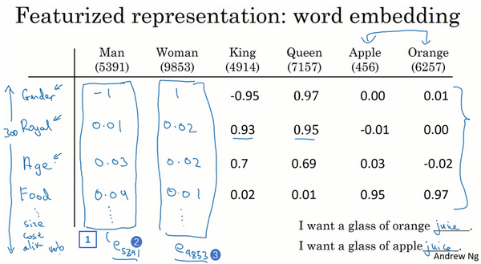
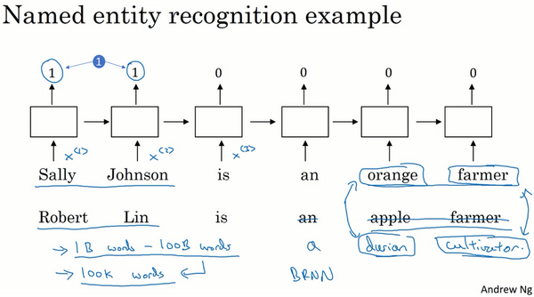
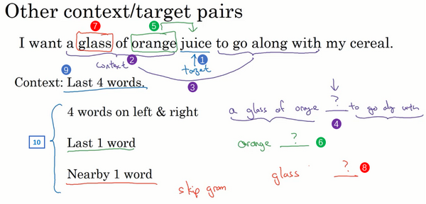
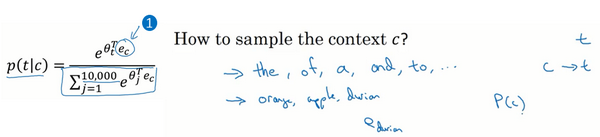
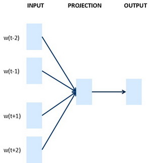
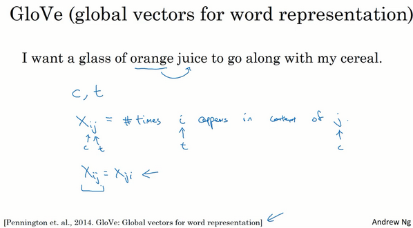
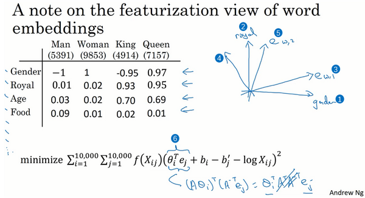
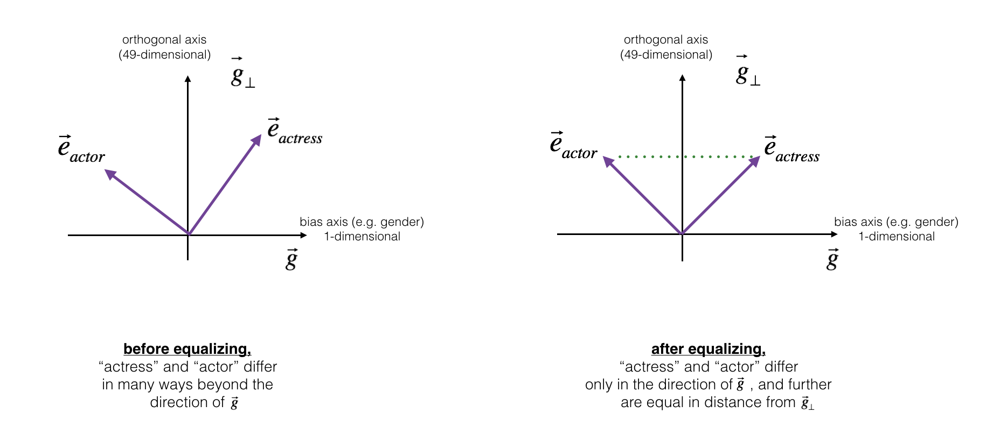

第二週 自然語言處理與詞嵌入（Natural Language Processing and Word Embeddings）
--------------------------------------------------------------
[TOC]
### 2.1 詞彙表徵（Word Representation）

上週我們學習了**RNN**、**GRU**單元和**LSTM**單元。本週你會看到我們如何把這些知識用到**NLP**上，用於自然語言處理，深度學習已經給這一領域帶來了革命性的變革。其中一個很關鍵的概念就是詞嵌入（**word embeddings**），這是語言表示的一種方式，可以讓算法自動的理解一些類似的詞，比如男人對女人，比如國王對王后，還有其他很多的例子。透過詞嵌入的概念你就可以構建**NLP**應用了，即使你的模型標記的訓練集相對較小。這週的最後我們會消除詞嵌入的偏差，就是去除不想要的特性，或者學習算法有時會學到的其他類型的偏差。

現在我們先開始討論詞彙表示，目前為止我們一直都是用詞彙表來表示詞，上週提到的詞彙表，可能是10000個單詞，我們一直用**one-hot**向量來表示詞。比如如果**man**（上圖編號1所示）在詞典裡是第5391個，那麼就可以表示成一個向量，只在第5391處為1（上圖編號2所示），我們用$O_{5391}$代表這個量，這裡的$O$代表**one-hot**。接下來，如果**woman**是編號9853（上圖編號3所示），那麼就可以用$O_{9853}$來表示，這個向量只在9853處為1（上圖編號4所示），其他為0，其他的詞**king**、**queen**、**apple**、**orange**都可以這樣表示出來這種表示方法的一大缺點就是它把每個詞孤立起來，這樣使得算法對相關詞的泛化能力不強。

舉個例子，假如你已經學習到了一個語言模型，當你看到“**I want a glass of orange ___**”，那麼下一個詞會是什麼？很可能是**juice**。即使你的學習算法已經學到了“**I want a glass of orange juice**”這樣一個很可能的句子，但如果看到“**I want a glass of apple ___**”，因為算法不知道**apple**和**orange**的關係很接近，就像**man**和**woman**，**king**和**queen**一樣。所以算法很難從已經知道的**orange** **juice**是一個常見的東西，而明白**apple** **juice**也是很常見的東西或者說常見的句子。這是因為任何兩個**one-hot**向量的內積都是0，如果你取兩個向量，比如**king**和**queen**，然後計算它們的內積，結果就是0。如果用**apple**和**orange**來計算它們的內積，結果也是0。很難區分它們之間的差別，因為這些向量內積都是一樣的，所以無法知道**apple**和**orange**要比**king**和**orange**，或者**queen**和**orange**相似地多。

換一種表示方式會更好，如果我們不用**one-hot**表示，而是用特徵化的表示來表示每個詞，**man**，**woman**，**king**，**queen**，**apple**，**orange**或者詞典裡的任何一個單詞，我們學習這些詞的特徵或者數值。

舉個例子，對於這些詞，比如我們想知道這些詞與**Gender**（**性別**）的關係。假定男性的性別為-1，女性的性別為+1，那麼**man**的性別值可能就是-1，而**woman**就是-1。最終根據經驗**king**就是-0.95，**queen**是+0.97，**apple**和**orange**沒有性別可言。

另一個特徵可以是這些詞有多**Royal**（**高貴**），所以這些詞，**man**，**woman**和高貴沒太關係，所以它們的特徵值接近0。而**king**和**queen**很高貴，**apple**和**orange**跟高貴也沒太大關係。

那麼**Age**（**年齡**）呢？**man**和**woman**一般沒有年齡的意思，也許**man**和**woman**隱含著成年人的意思，但也可能是介於**young**和**old**之間，所以它們（**man**和**woman**）的值也接近0。而通常**king**和**queen**都是成年人，**apple**和**orange**跟年齡更沒什麼關係了。

還有一個特徵，這個詞是否是**Food**（**食物**），**man**不是食物，**woman**不是食物，**king**和**queen**也不是，但**apple**和**orange**是食物。

當然還可以有很多的其他特徵，從**Size**（**尺寸大小**），**Cost**（**花費多少**），這個東西是不是**alive**（**活的**），是不是一個**Action**（**動作**），或者是不是**Noun**（**名詞**）或者是不是**Verb**（**動詞**），還是其他的等等。

所以你可以想很多的特徵，為了說明，我們假設有300個不同的特徵，這樣的話你就有了這一列數位（上圖編號1所示），這裡我只寫了4個，實際上是300個數字，這樣就組成了一個300維的向量來表示**man**這個詞。接下來，我想用$e_{5391}$這個符號來表示，就像這樣（上圖編號2所示）。同樣這個300維的向量，我用$e_{9853}$代表這個300維的向量用來表示**woman**這個詞（上圖編號3所示），這些其他的例子也一樣。現在，如果用這種表示方法來表示**apple**和**orange**這些詞，那麼**apple**和**orange**的這種表示肯定會非常相似，可能有些特徵不太一樣，因為**orange**的顏色口味，**apple**的顏色口味，或者其他的一些特徵會不太一樣，但總的來說**apple**和**orange**的大部分特徵實際上都一樣，或者說都有相似的值。這樣對於已經知道**orange juice**的算法很大機率上也會明白**apple**
**juice**這個東西，這樣對於不同的單詞算法會泛化的更好。

後面的幾個影片，我們會找到一個學習詞嵌入的方式，這裡只是希望你能理解這種高維特徵的表示能夠比**one-hot**更好的表示不同的單詞。而我們最終學習的特徵不會像這裡一樣這麼好理解，沒有像第一個特徵是性別，第二個特徵是高貴，第三個特徵是年齡等等這些，新的特徵表示的東西肯定會更難搞清楚。儘管如此，接下來要學的特徵表示方法卻能使算法高效地發現**apple**和**orange**會比**king**和**orange**，**queen**和**orange**更加相似。

如果我們能夠學習到一個300維的特徵向量，或者說300維的詞嵌入，通常我們可以做一件事，把這300維的數據嵌入到一個二維空間裡，這樣就可以可視化了。常用的可視化算法是**t-SNE算法**，來自於**Laurens van der Maaten** 和 **Geoff Hinton**的論文。如果觀察這種詞嵌入的表示方法，你會發現**man**和**woman**這些詞聚集在一塊（上圖編號1所示），**king**和**queen**聚集在一塊（上圖編號2所示），這些都是人，也都聚集在一起（上圖編號3所示）。動物都聚集在一起（上圖編號4所示），水果也都聚集在一起（上圖編號5所示），像1、2、3、4這些數字也聚集在一起（上圖編號6所示）。如果把這些生物看成一個整體，他們也聚集在一起（上圖編號7所示）。

在網上你可能會看到像這樣的圖用來可視化，300維或者更高維度的嵌入。希望你能有個整體的概念，這種詞嵌入算法對於相近的概念，學到的特徵也比較類似，在對這些概念可視化的時候，這些概念就比較相似，最終把它們映射為相似的特徵向量。這種表示方式用的是在300維空間裡的特徵表示，這叫做嵌入（**embeddings**）。之所以叫嵌入的原因是，你可以想像一個300維的空間，我畫不出來300維的空間，這裡用個3維的代替（上圖編號8所示）。現在取每一個單詞比如**orange**，它對應一個3維的特徵向量，所以這個詞就被嵌在這個300維空間裡的一個點上了（上圖編號9所示），**apple**這個詞就被嵌在這個300維空間的另一個點上了（上圖編號10所示）。為了可視化，**t-SNE算法**把這個空間映射到低維空間，你可以畫出一個2維圖像然後觀察，這就是這個術語嵌入的來源。

詞嵌入已經是**NLP**領域最重要的概念之一了，在自然語言處理領域。本節影片中你已經知道為什麼要學習或者使用詞嵌入了，下節影片我們會深入講解如何用這些算法構建**NLP**算法。

### 2.2 使用詞嵌入（Using Word Embeddings）

上一個影片中，你已經了解不同單詞的特徵化表示了。這節你會看到我們如何把這種表示方法應用到**NLP**應用中。

我們從一個例子開始，我們繼續用命名實體識別的例子，如果你要找出人名，假如有一個句子：“**Sally Johnson is an orange farmer.**”（**Sally Johnson是一個種橙子的農民**），你會發現**Sally Johnson**就是一個人名，所以這裡的輸出為1。之所以能確定**Sally Johnson**是一個人名而不是一個公司名，是因為你知道種橙子的農民一定是一個人，前面我們已經討論過用**one-hot**來表示這些單詞，$x^{<1>}$ ，$x^{< 2 >}$等等。

但是如果你用特徵化表示方法，嵌入的向量，也就是我們在上個影片中討論的。那麼用詞嵌入作為輸入訓練好的模型，如果你看到一個新的輸入：“**Robert Lin is an apple farmer.**”（**Robert Lin是一個種蘋果的農民**），因為知道**orange**和**apple**很相近，那麼你的算法很容易就知道**Robert Lin**也是一個人，也是一個人的名字。一個有意思的情況是，要是測試集裡這句話不是“**Robert Lin is an apple farmer.**”，而是不太常見的詞怎麼辦？要是你看到：“**Robert Lin is a durian cultivator.**”（**Robert Lin是一個榴槤培育家**）怎麼辦？**榴槤**（**durian**）是一種比較稀罕的水果，這種水果在新加坡和其他一些國家流行。如果對於一個命名實體識別任務，你只有一個很小的標記的訓練集，你的訓練集裡甚至可能沒有**durian**（**榴槤**）或者**cultivator**（**培育家**）這兩個詞。但是如果你有一個已經學好的詞嵌入，它會告訴你**durian**（**榴槤**）是水果，就像**orange**（**橙子**）一樣，並且**cultivator**（**培育家**），做培育工作的人其實跟**farmer**（**農民**）差不多，那麼你就有可能從你的訓練集裡的“**an orange farmer**”（**種橙子的農民**）歸納出“**a durian cultivator**”（**榴槤培育家**）也是一個人。

詞嵌入能夠達到這種效果，其中一個原因就是學習詞嵌入的算法會考察非常大的文本集，也許是從網上找到的，這樣你可以考察很大的數據集可以是1億個單詞，甚至達到100億也都是合理的，大量的無標籤的文本的訓練集。通過考察大量的無標籤文本，很多都是可以免費下載的，你可以發現**orange**（**橙子**）和**durian**（**榴槤**）相近，**farmer**（**農民**）和**cultivator**（**培育家**）相近。因此學習這種嵌入表達，把它們都聚集在一塊，透過讀取大量的網際網路文本發現了**orange**（**橙子**）和**durian**（**榴槤**）都是水果。接下來你可以把這個詞嵌入應用到你的命名實體識別任務當中，儘管你只有一個很小的訓練集，也許訓練集裡有100,000個單詞，甚至更小，這就使得你可以使用遷移學習，把你從網際網路上免費獲得的大量的無標籤文本中學習到的知識，能夠分辨**orange**（**橙子**）、**apple**（**蘋果**）和**durian**（**榴槤**）都是水果的知識，然後把這些知識遷移到一個任務中，比如你只有少量標記的訓練數據集的命名實體識別任務中。當然了，這裡為了簡化我只畫了單向的**RNN**，事實上如果你想用在命名實體識別任務上，你應該用一個雙向的**RNN**，而不是這樣一個簡單的。

總結一下，這是如何用詞嵌入做遷移學習的步驟。

第一步，先從大量的文本集中學習詞嵌入。一個非常大的文本集，或者可以下載網上預訓練好的詞嵌入模型，網上你可以找到不少，詞嵌入模型並且都有許可。

第二步，你可以用這些詞嵌入模型把它遷移到你的新的只有少量標註訓練集的任務中，比如說用這個300維的詞嵌入來表示你的單詞。這樣做的一個好處就是你可以用更低維度的特徵向量代替原來的10000維的**one-hot**向量，現在你可以用一個300維更加緊湊的向量。儘管**one-hot**向量很快計算，而學到的用於詞嵌入的300維的向量會更加緊湊。

第三步，當你在你新的任務上訓練模型時，在你的命名實體識別任務上，只有少量的標記數據集上，你可以自己選擇要不要繼續微調，用新的數據調整詞嵌入。實際中，只有這個第二步中有很大的數據集你才會這樣做，如果你標記的數據集不是很大，通常我不會在微調詞嵌入上費力氣。

當你的任務的訓練集相對較小時，詞嵌入的作用最明顯，所以它廣泛用於**NLP**領域。我只提到一些，不要太擔心這些術語（下問列舉的一些**NLP**任務），它已經用在命名實體識別，用在文本摘要，用在文本解析、指代消解，這些都是非常標準的**NLP**任務。

詞嵌入在語言模型、機器翻譯領域用的少一些，尤其是你做語言模型或者機器翻譯任務時，這些任務你有大量的數據。在其他的遷移學習情形中也一樣，如果你從某一任務**A**遷移到某個任務**B**，只有**A**中有大量數據，而**B**中數據少時，遷移的過程才有用。所以對於很多**NLP**任務這些都是對的，而對於一些語言模型和機器翻譯則不然。

最後，詞嵌入和人臉編碼之間有奇妙的關係，你已經在前面的課程學到了關於人臉編碼的知識了，如果你上了卷積神經網路的課程的話。你應該還記得對於人臉識別，我們訓練了一個**Siamese**網路結構，這個網路會學習不同人臉的一個128維表示，然後透過比較編碼結果來判斷兩個圖片是否是同一個人臉，這個詞嵌入的意思和這個差不多。在人臉識別領域大家喜歡用編碼這個詞來指代這些向量$f(x^{\left(i \right)})$，$f(x^{\left( j\right)})$（上圖編號1所示），人臉識別領域和這裡的詞嵌入有一個不同就是，在人臉識別中我們訓練一個網路，任給一個人臉照片，甚至是沒有見過的照片，神經網路都會計算出相應的一個編碼結果。上完後面幾節課，你會更明白，我們學習詞嵌入則是有一個固定的詞彙表，比如10000個單詞，我們學習向量$e_{1}$到$e_{10000}$，學習一個固定的編碼，每一個詞彙表的單詞的固定嵌入，這就是人臉識別與我們接下來幾節影片要討論的算法之間的一個不同之處。這裡的術語編碼（**encoding**）和嵌入（**embedding**）可以互換，所以剛才講的差別不是因為術語不一樣，這個差別就是，人臉識別中的算法未來可能涉及到巨量的人臉照片，而自然語言處理有一個固定的詞彙表，而像一些沒有出現過的單詞我們就記為未知單詞。

這節影片裡，你看到如何用詞嵌入來實現這種類型的遷移學習，並且透過替換原來的**one-hot**表示，而是用之前的嵌入的向量，你的算法會泛化的更好，你也可以從較少的標記數據中進行學習。接下來我會給你展示一些詞嵌入的特性，這之後再討論學習這些詞嵌入的算法。下個影片我們會看到詞嵌入在做類比推理中發揮的作用。

### 2.3 詞嵌入的特性（Properties of Word Embeddings）

到現在，你應該明白了詞嵌入是如何幫助你構建自然語言處理應用的。詞嵌入還有一個迷人的特性就是它還能幫助實現類比推理，儘管類比推理可能不是自然語言處理應用中最重要的，不過它能幫助人們理解詞嵌入做了什麼，以及詞嵌入能夠做什麼，讓我們來一探究竟。

這是一系列你希望詞嵌入可以捕捉的單詞的特徵表示，假如我提出一個問題，**man**如果對應**woman**，那麼**king**應該對應什麼？你們應該都能猜到**king**應該對應**queen**。能否有一種算法來自動推導出這種關係，下面就是實現的方法。

我們用一個四維向量來表示**man**，我們用$e_{5391}$來表示，不過在這節影片中我們先把它（上圖編號1所示）稱為$e_{\text{man}}$，而旁邊這個（上圖編號2所示）表示**woman**的嵌入向量，稱它為$e_{\text{woman}}$，對**king**和**queen**也是用一樣的表示方法。在該例中，假設你用的是四維的嵌入向量，而不是比較典型的50到1000維的向量。這些向量有一個有趣的特性，就是假如你有向量$e_{\text{man}}$和$e_{\text{woman}}$，將它們進行減法運算，即

$$
e_{\text{man}} - e_{\text{woman}} = \begin{bmatrix}
 - 1 \\
     0.01 \\
       0.03 \\
       0.09 \\
       \end{bmatrix} - \begin{bmatrix}
       1 \\
       0.02 \\
       0.02 \\
       0.01 \\
       \end{bmatrix} = \begin{bmatrix}
 - 2 \\
 - 0.01 \\
     0.01 \\
       0.08 \\
       \end{bmatrix} \approx \begin{bmatrix}
 - 2 \\
     0 \\
       0 \\
       0 \\
       \end{bmatrix}
$$

類似的，假如你用$e_{\text{king}}$減去$e_{\text{queen}}$，最後也會得到一樣的結果，即

$$
e_{\text{king}} - e_{\text{queen}} = \begin{bmatrix}
 - 0.95 \\
     0.93 \\
       0.70 \\
       0.02 \\
       \end{bmatrix} - \begin{bmatrix}
       0.97 \\
       0.95 \\
       0.69 \\
       0.01 \\
       \end{bmatrix} = \begin{bmatrix}
 - 1.92 \\
 - 0.02 \\
     0.01 \\
       0.01 \\
       \end{bmatrix} \approx \begin{bmatrix}
 - 2 \\
     0 \\
       0 \\
       0 \\
       \end{bmatrix}
$$

這個結果表示，**man**和**woman**主要的差異是**gender**（**性別**）上的差異，而**king**和**queen**之間的主要差異，根據向量的表示，也是**gender**（**性別**）上的差異，這就是為什麼$e_{\text{man}}- e_{\text{woman}}$和$e_{\text{king}} -  e_{\text{queen}}$結果是相同的。所以得出這種類比推理的結論的方法就是，當算法被問及**man**對**woman**相當於**king**對什麼時，算法所做的就是計算$e_{\text{man}}-e_{\text{woman}}$，然後找出一個向量也就是找出一個詞，使得$e_{\text{man}}-e_{\text{woman}}$≈$\ e_{\text{king}}- e_{?}$，也就是說，當這個新詞是**queen**時，式子的左邊會近似地等於右邊。這種思想首先是被**Tomas  Mikolov** 和 **Wen-tau Yih**還有**Geoffrey  Zweig**提出的，這是詞嵌入領域影響力最為驚人和顯著的成果之一，這種思想幫助了研究者們對詞嵌入領域建立了更深刻的理解。

（**Mikolov T, Yih W T, Zweig G. Linguistic regularities in continuous space word representations[J]. In HLT-NAACL, 2013.**）

讓我們來正式地探討一下應該如何把這種思想寫成算法。在圖中，詞嵌入向量在一個可能有300維的空間裡，於是單詞**man**代表的就是空間中的一個點，另一個單詞**woman**代表空間另一個點，單詞**king**也代表一個點，還有單詞**queen**也在另一點上（上圖編號1方框內所示的點）。事實上，我們在上個幻燈片所展示的就是向量**man**和**woman**的差值非常接近於向量**king**和**queen**之間的差值，我所畫的這個箭頭（上圖編號2所示）代表的就是向量在**gender**（**性別**）這一維的差，不過不要忘了這些點是在300維的空間裡。為了得出這樣的類比推理，計算當**man**對於**woman**，那麼**king**對於什麼，你能做的就是找到單詞**w**來使得，$e_{\text{man}}-e_{\text{woman}}≈ e_{\text{king}} - e_{w}$這個等式成立，你需要的就是找到單詞**w**來最大化$e_{w}$與$e_{\text{king}} -  e_{\text{man}} + e_{\text{woman}}$的相似度，即

$Find\ word\ w:argmax \ Sim(e_{w},e_{\text{king}} - e_{\text{man}} + e_{\text{woman}})$

所以我做的就是我把這個$e_{w}$全部放到等式的一邊，於是等式的另一邊就會是$e_{\text{king}}- e_{\text{man}} +  e_{\text{woman}}$。我們有一些用於測算$e_{w}$和$e_{\text{king}} -e_{\text{man}} +  e_{\text{woman}}$之間的相似度的函數，然後通過方程找到一個使得相似度最大的單詞，如果結果理想的話會得到單詞**queen**。值得注意的是這種方法真的有效，如果你學習一些詞嵌入，透過算法來找到使得相似度最大化的單詞**w**，你確實可以得到完全正確的答案。不過這取決於過程中的細節，如果你查看一些研究論文就不難發現，透過這種方法來做類比推理準確率大概只有30%\~75%，只要算法猜中了單詞，就把該次計算視為正確，從而計算出準確率，在該例子中，算法選出了單詞**queen**。

在繼續下一步之前，我想再說明一下左邊的這幅圖（上圖編號1所示），在之前我們談到過用**t-SNE**算法來將單詞可視化。**t-SNE算法**所做的就是把這些300維的數據用一種非線性的方式映射到2維平面上，可以得知**t-SNE**中這種映射很複雜而且很非線性。在進行**t-SNE**映射之後，你不能總是期望使等式成立的關係，會像左邊那樣成一個平行四邊形，儘管在這個例子最初的300維的空間內你可以依賴這種平行四邊形的關係來找到使等式成立的一對類比，通過**t-SNE算法**映射出的圖像可能是正確的。但在大多數情況下，由於**t-SNE**的非線性映射，你就沒辦法再指望這種平行四邊形了，很多這種平行四邊形的類比關係在**t-SNE**映射中都會失去原貌。

現在，再繼續之前，我想再快速地列舉一個最常用的相似度函數，這個最常用的相似度函數叫做餘弦相似度。這是我們上個幻燈片所得到的等式（下圖編號1所示），在餘弦相似度中，假如在向量$u$和$v$之間定義相似度:$\text{sim}\left( u,v \right) = \frac{u^{T}v}{\left| \left| u \right| \right|_{2}\left| \left| v \right| \right|_{2}}$

現在我們先不看分母，分子其實就是$u$和$v$的內積。如果u和v非常相似，那麼它們的內積將會很大，把整個式子叫做餘弦相似度，其實就是因為該式是$u$和$v$的夾角的餘弦值，所以這個角（下圖編號2所示）就是Φ角，這個公式實際就是計算兩向量夾角Φ角的餘弦。你應該還記得在微積分中，Φ角的餘弦圖像是這樣的（下圖編號3所示），所以夾角為0度時，餘弦相似度就是1，當夾角是90度角時餘弦相似度就是0，當它們是180度時，圖像完全跑到了相反的方向，這時相似度等於-1，這就是為什麼餘弦相似度對於這種類比工作能起到非常好的效果。
距離用平方距離或者歐氏距離來表示:$\left| \left| u - v \right| \right|^{2}$

**參考資料：餘弦相似度**
為了測量兩個詞的相似程度，我們需要一種方法來測量兩個詞的兩個嵌入向量之間的相似程度。 給定兩個向量$u$和$v$，餘弦相似度定義如下： 
${CosineSimilarity(u, v)} = \frac {u . v} {||u||_2 ||v||_2} = cos(\theta) \tag{1}$
其中 $u.v$ 是兩個向量的點積（或內積），$||u||_2$是向量$u$的範數（或長度），並且 $\theta$ 是向量$u$和$v$之間的角度。這種相似性取決於角度在向量$u$和$v$之間。如果向量$u$和$v$非常相似，它們的餘弦相似性將接近1; 如果它們不相似，則餘弦相似性將取較小的值。

**圖1：**兩個向量之間角度的餘弦是衡量它們有多相似的指標，角度越小，兩個向量越相似。

從學術上來說，比起測量相似度，這個函數更容易測量的是相異度，所以我們需要對其取負，這個函數才能正常工作，不過我還是覺得餘弦相似度用得更多一點，這兩者的主要區別是它們對$u$和$v$之間的距離標準化的方式不同。

詞嵌入的一個顯著成果就是，可學習的類比關係的一般性。舉個例子，它能學會**man**對於**woman**相當於**boy**對於**girl**，因為**man**和**woman**之間和**king**和**queen**之間，還有**boy**和**girl**之間的向量差在**gender**（**性別**）這一維都是一樣的。它還能學習**Canada**（**加拿大**）的首都是**Ottawa**（**渥太華**），而渥太華對於加拿大相當於**Nairobi**（**奈洛比**）對於**Kenya**（**肯尼亞**），這些都是國家中首都城市名字。它還能學習**big**對於**bigger**相當於**tall**對於**taller**，還能學習**Yen**（**円**）對於**Janpan**（**日本**），**円**是日本的貨幣單位，相當於**Ruble**（**盧比**）對於**Russia**（**俄羅斯**）。這些東西都能夠學習，只要你在大型的文本語料庫上實現一個詞嵌入學習算法，只要從足夠大的語料庫中進行學習，它就能自主地發現這些模式。

在本節影片中，你見到了詞嵌入是如何被用於類比推理的，可能你不會自己動手構建一個類比推理系統作為一項應用，不過希望在這些可學習的類特徵的表示方式能夠給你一些直觀的感受。你還看知道了餘弦相似度可以作為一種衡量兩個詞嵌入向量間相似度的辦法，我們談了許多有關這些嵌入的特性，以及如何使用它們。下節影片中，我們來討論如何真正的學習這些詞嵌入。

### 2.4 嵌入矩陣（Embedding Matrix）

接下來我們要將學習詞嵌入這一問題具體化，當你應用算法來學習詞嵌入時，實際上是學習一個嵌入矩陣，我們來看一下這是什麼意思。

和之前一樣，假設我們的詞彙表含有10,000個單詞，詞彙表裡有**a**，**aaron**，**orange**，**zulu**，可能還有一個未知詞標記\<**UNK**\>。我們要做的就是學習一個嵌入矩陣$E$，它將是一個300×10,000的矩陣，如果你的詞彙表裡有10,000個，或者加上未知詞就是10,001維。這個矩陣的各列代表的是詞彙表中10,000個不同的單詞所代表的不同向量。假設**orange**的單詞編號是6257（下圖編號1所示），代表詞彙表中第6257個單詞，我們用符號$O_{6527}$
來表示這個**one-hot**向量，這個向量除了第6527個位置上是1（下圖編號2所示），其餘各處都為0，顯然它是一個10,000維的列向量，它只在一個位置上有1，它不像圖上畫的那麼短，它的高度應該和左邊的嵌入矩陣的寬度相等。

假設這個嵌入矩陣叫做矩陣$E$，注意如果用$E$去乘以右邊的**one-hot**向量（上圖編號3所示），也就是$O_{6527}$，那麼就會得到一個300維的向量，$E$是300×10,000的，$O_{6527}$是10,000×1的，所以它們的積是300×1的，即300維的向量。要計算這個向量的第一個元素，你需要做的是把$E$的第一行（上圖編號4所示）和$O_{6527}$的整列相乘，不過$O_{6527}$的所有元素都是0，只有6257位置上是1，最後你得到的這個向量的第一個元素（上圖編號5所示）就是**orange**這一列下的數位（上圖編號6所示）。然後我們要計算這個向量的第二個元素，就是把$E$的第二行（上圖編號7所示）和這個$O_{6527}$相乘，和之前一樣，然後得到第二個元素（上圖編號8所示），以此類推，直到你得到這個向量剩下的所有元素（上圖編號9所示）。

這就是為什麼把矩陣$E$和這個**one-hot**向量相乘，最後得到的其實就是這個300維的列，就是單詞**orange**下的這一列，它等於$e_{6257}$，這個符號是我們用來表示這個300×1的嵌入向量的符號，它表示的單詞是**orange**。

更廣泛來說，假如說有某個單詞**w**，那麼$e_{w}$就代表單詞**w**的嵌入向量。同樣，$EO_{j}$，$O_{j}$就是只有第$j$個位置是1的**one-hot**向量，得到的結果就是$e_{j}$，它表示的是字典中單詞**j**的嵌入向量。

在這一小節中，要記住的一件事就是我們的目標是學習一個嵌入矩陣$E$。在下節影片中你將會隨機地初始化矩陣$E$，然後使用梯度下降法來學習這個300×10,000的矩陣中的各個參數，$E$乘以這個**one-hot**向量（上圖編號1所示）會得到嵌入向量。再多說一點，當我們寫這個等式（上圖編號2所示）的時候，寫出這些符號是很方便的，代表用矩陣$E$乘以**one-hot**向量$O_{j}$。但當你動手實現時，用大量的矩陣和向量相乘來計算它，效率是很低下的，因為**one-hot**向量是一個維度非常高的向量，並且幾乎所有元素都是0，所以矩陣向量相乘效率太低，因為我們要乘以一大堆的0。所以在實踐中你會使用一個專門的函數來單獨查找矩陣$E$的某列，而不是用通常的矩陣乘法來做，但是在畫示意圖時（上圖所示，即矩陣$E$乘以**one-hot**向量示意圖），這樣寫比較方便。但是例如在**Keras**中就有一個嵌入層，然後我們用這個嵌入層更有效地從嵌入矩陣中提取出你需要的列，而不是對矩陣進行很慢很複雜的乘法運算。

在本影片中你見到了在學習嵌入向量的過程中用來描述這些算法的符號以及關鍵術語，矩陣$E$它包含了詞彙表中所有單詞的嵌入向量。在下節影片中，我們將討論學習矩陣$E$的具體算法。

### 2.5 學習詞嵌入（Learning Word Embeddings）

在本節影片中，你將要學習一些具體的算法來學習詞嵌入。在深度學習應用於學習詞嵌入的歷史上，人們一開始使用的算法比較複雜，但隨著時間推移，研究者們不斷發現他們能用更加簡單的算法來達到一樣好的效果，特別是在數據集很大的情況下。但有一件事情就是，現在很多最流行的算法都十分簡單，如果我一開始就介紹這些簡單的算法，你可能會覺得這有點神奇，這麼簡單的算法究竟是怎麼起作用的？稍微複雜一些的算法開始，因為我覺得這樣更容易對算法的運作方式有一個更直觀的了解，之後我們會對這些算法進行簡化，使你能夠明白即使一些簡單的算法也能得到非常好的結果，我們開始吧。

假如你在構建一個語言模型，並且用神經網路來實現這個模型。於是在訓練過程中，你可能想要你的神經網路能夠做到比如輸入：“**I want a glass of orange ___.**”，然後預測這句話的下一個詞。在每個單詞下面，我都寫上了這些單詞對應詞彙表中的索引。實踐證明，建立一個語言模型是學習詞嵌入的好方法，我提出的這些想法是源於**Yoshua Bengio**，**Rejean Ducharme**，**Pascal Vincent**，**Rejean Ducharme**，**Pascal Vincent**還有**Christian Jauvin**。

下面我將介紹如何建立神經網路來預測序列中的下一個單詞，讓我為這些詞列一個表格，“**I want a glass of orange**”，我們從第一個詞**I**開始，建立一個**one-hot**向量表示這個單詞**I**。這是一個**one-hot**向量（上圖編號1所示），在第4343個位置是1，它是一個10,000維的向量。然後要做的就是生成一個參數矩陣$E$，然後用$E$乘以$O_{4343}$，得到嵌入向量$e_{4343}$，這一步意味著$e_{4343}$是由矩陣$E$乘以**one-hot**向量得到的（上圖編號2所示）。然後我們對其他的詞也做相同的操作，單詞**want**在第9665個，我們將$E$與這個**one-hot**向量（$O_{9665}$）相乘得到嵌入向量$e_{9665}$。對其他單詞也是一樣，**a**是字典中的第一個詞，因為**a**是第一個字母，由$O_{1}$得到$e_{1}$。同樣地，其他單詞也這樣操作。

於是現在你有許多300維的嵌入向量。我們能做的就是把它們全部放進神經網路中（上圖編號3所示），經過神經網路以後再通過**softmax**層（上圖編號4所示），這個**softmax**也有自己的參數，然後這個**softmax**分類器會在10,000個可能的輸出中預測結尾這個單詞。假如說在訓練集中有**juice**這個詞，訓練過程中**softmax**的目標就是預測出單詞**juice**，就是結尾的這個單詞。這個隱藏層（上圖編號3所示）有自己的參數，我這裡用$W^{\left\lbrack1 \right\rbrack}$和$b^{\left\lbrack 1\right\rbrack}$來表示，這個**softmax**層（上圖編號4所示）也有自己的參數$W^{\left\lbrack2 \right\rbrack}$和$b^{\left\lbrack 2\right\rbrack}$。如果它們用的是300維大小的嵌入向量，而這裡有6個詞，所以用6×300，所以這個輸入會是一個1800維的向量，這是透過將這6個嵌入向量堆在一起得到的。

實際上更常見的是有一個固定的歷史窗口，舉個例子，你總是想預測給定四個單詞（上圖編號1所示）後的下一個單詞，注意這裡的4是算法的超參數。這就是如何適應很長或者很短的句子，方法就是總是只看前4個單詞，所以說我只用這4個單詞（上圖編號2所示）而不去看這幾個詞（上圖編號3所示）。如果你一直使用一個4個詞的歷史窗口，這就意味著你的神經網路會輸入一個1200維的特徵變數到這個層中（上圖編號4所示），然後再透過**softmax**來預測輸出，選擇有很多種，用一個固定的歷史窗口就意味著你可以處理任意長度的句子，因為輸入的維度總是固定的。所以這個模型的參數就是矩陣$E$，對所有的單詞用的都是同一個矩陣$E$，而不是對應不同的位置上的不同單詞用不同的矩陣。然後這些權重（上圖編號5所示）也都是算法的參數，你可以用反向傳播來進行梯度下降來最大化訓練集似然，透過序列中給定的4個單詞去重複地預測出語料庫中下一個單詞什麼。

事實上通過這個算法能很好地學習詞嵌入，原因是，如果你還記得我們的**orange jucie**，**apple juice**的例子，在這個算法的激勵下，**apple**和**orange**會學到很相似的嵌入，這樣做能夠讓算法更好地擬合訓練集，因為它有時看到的是**orange juice**，有時看到的是**apple juice**。如果你只用一個300維的特徵向量來表示所有這些詞，算法會發現要想最好地擬合訓練集，就要使**apple**（**蘋果**）、**orange**（**橘子**）、**grape**（**葡萄**）和**pear**（**梨**）等等，還有像**durian**（**榴槤**）這種很稀有的水果都擁有相似的特徵向量。

這就是早期最成功的學習詞嵌入，學習這個矩陣$E$的算法之一。現在我們先概括一下這個算法，看看我們該怎樣來推導出更加簡單的算法。現在我想用一個更複雜的句子作為例子來解釋這些算法，假設在你的訓練集中有這樣一個更長的句子：“**I want a glass of orange juice to go along with my cereal.**”。我們在上個幻燈片看到的是算法預測出了某個單詞**juice**，我們把它叫做目標詞（下圖編號1所示），它是通過一些上下文，在本例中也就是這前4個詞（下圖編號2所示）推導出來的。如果你的目標是學習一個嵌入向量，研究人員已經嘗試過很多不同類型的上下文。如果你要建立一個語言模型，那麼一般選取目標詞之前的幾個詞作為上下文。但如果你的目標不是學習語言模型本身的話，那麼你可以選擇其他的上下文。

比如說，你可以提出這樣一個學習問題，它的上下文是左邊和右邊的四個詞，你可以把目標詞左右各4個詞作為上下文（上圖編號3所示）。這就意味著我們提出了一個這樣的問題，算法獲得左邊4個詞，也就是**a glass of orange**，還有右邊四個詞**to go along with**，然後要求預測出中間這個詞（上圖編號4所示）。提出這樣一個問題，這個問題需要將左邊的還有右邊這4個詞的嵌入向量提供給神經網路，就像我們之前做的那樣來預測中間的單詞是什麼，來預測中間的目標詞，這也可以用來學習詞嵌入。

或者你想用一個更簡單的上下文，也許只提供目標詞的前一個詞，比如只給出**orange**這個詞來預測**orange**後面是什麼（上圖編號5所示），這將會是不同的學習問題。只給出一個詞**orange**來預測下一個詞是什麼（上圖編號6所示），你可以構建一個神經網路，只把目標詞的前一個詞或者說前一個詞的嵌入向量輸入神經網路來預測該詞的下一個詞。

還有一個效果非常好的做法就是上下文是附近一個單詞，它可能會告訴你單詞**glass**（上圖編號7所示）是一個鄰近的單詞。或者說我看見了單詞**glass**，然後附近有一個詞和**glass**位置相近，那麼這個詞會是什麼（上圖編號8所示）？這就是用附近的一個單詞作為上下文。我們將在下節影片中把它公式化，這用的是一種**Skip-Gram**模型的思想。這是一個簡單算法的例子，因為上下文相當的簡單，比起之前4個詞，現在只有1個，但是這種算法依然能工作得很好。

研究者發現，如果你真想建立一個語言模型，用目標詞的前幾個單詞作為上下文是常見做法（上圖編號9所示）。但如果你的目標是學習詞嵌入，那麼你就可以用這些其他類型的上下文（上圖編號10所示），它們也能得到很好的詞嵌入。我會在下節影片詳細介紹這些，我們會談到**Word2Vec**模型。

總結一下，在本節影片中你學習了語言模型問題，模型提出了一個機器學習問題，即輸入一些上下文，例如目標詞的前4個詞然後預測出目標詞，學習了提出這些問題是怎樣幫助學習詞嵌入的。在下節影片，你將看到如何用更簡單的上下文和更簡單的算法來建立從上下文到目標詞的映射，這將讓你能夠更好地學習詞嵌入，一起進入下節影片學習**Word2Vec**模型。

### 2.6 Word2Vec

在上個影片中你已經見到了如何學習一個神經語言模型來得到更好的詞嵌入，在本影片中你會見到 **Word2Vec**算法，這是一種簡單而且計算時更加高效的方式來學習這種類型的嵌入，讓我們來看看。

本影片中的大多數的想法來源於**Tomas Mikolov**，**Kai Chen**，**Greg Corrado** 和 **Jeff Dean**。

（**Mikolov T, Chen K, Corrado G, et al. Efficient Estimation of Word Representations in Vector Space[J]. Computer Science, 2013.**）

假設在訓練集中給定了一個這樣的句子：“**I want a glass of orange juice to go along with my cereal.**”，在**Skip-Gram**模型中，我們要做的是抽取上下文和目標詞配對，來構造一個監督學習問題。上下文不一定總是目標單詞之前離得最近的四個單詞，或最近的$n$個單詞。我們要的做的是隨機選一個詞作為上下文詞，比如選**orange**這個詞，然後我們要做的是隨機在一定詞距內選另一個詞，比如在上下文詞前後5個詞內或者前後10個詞內，我們就在這個範圍內選擇目標詞。可能你正好選到了**juice**作為目標詞，正好是下一個詞（表示**orange**的下一個詞），也有可能你選到了前面第二個詞，所以另一種配對目標詞可以是**glass**，還可能正好選到了單詞**my**作為目標詞。

於是我們將構造一個監督學習問題，它給定上下文詞，要求你預測在這個詞正負10個詞距或者正負5個詞距內隨機選擇的某個目標詞。顯然，這不是個非常簡單的學習問題，因為在單詞**orange**的正負10個詞距之間，可能會有很多不同的單詞。但是構造這個監督學習問題的目標並不是想要解決這個監督學習問題本身，而是想要使用這個學習問題來學到一個好的詞嵌入模型。

接下來說說模型的細節，我們繼續假設使用一個10,000詞的詞彙表，有時訓練使用的詞彙表會超過一百萬詞。但我們要解決的基本的監督學習問題是學習一種映射關係，從上下文**c**，比如單詞**orange**，到某個目標詞，記為**t**，可能是單詞**juice**或者單詞**glass**或者單詞**my**。延續上一張幻燈片的例子，在我們的詞彙表中，**orange**是第6257個單詞，**juice**是10,000個單詞中的第4834個，這就是你想要的映射到輸出$y$的輸入$x$。

為了表示輸入，比如單詞**orange**，你可以先從**one-hot**向量開始，我們將其寫作$O_{c}$，這就是上下文詞的**one-hot**向量（上圖編號1所示）。然後和你在上節影片中看到的類似，你可以拿嵌入矩陣$E$乘以向量$O_{c}$，然後得到了輸入的上下文詞的嵌入向量，於是這裡$e_{c}=EO_{c}$。在這個神經網路中（上圖編號2所示），我們將把向量$e_{c}$餵入一個**softmax**單元。我通常把**softmax**單元畫成神經網路中的一個節點（上圖編號3所示），這不是字母**O**，而是**softmax**單元，**softmax**單元要做的就是輸出$\hat y$。然後我們再寫出模型的細節，這是**softmax**模型（上圖編號4所示），預測不同目標詞的機率：

$Softmax:p\left( t \middle| c \right) = \frac{e^{\theta_{t}^{T}e_{c}}}{\sum_{j = 1}^{10,000}e^{\theta_{j}^{T}e_{c}}}$

這裡$\theta_{t}$是一個與輸出$t$有關的參數，即某個詞$t$和標籤相符的機率是多少。我省略了**softmax**中的偏差項，想要加上的話也可以加上。

最終**softmax**的損失函數就會像之前一樣，我們用$y$表示目標詞，我們這裡用的$y$和$\hat y$都是用**one-hot**表示的，於是損失函數就會是：

$L\left( \hat y,y \right) = - \sum_{i = 1}^{10,000}{y_{i}\log \hat y_{i}}$

這是常用的**softmax**損失函數，$y$ 就是只有一個1其他都是0的**one-hot**向量，如果目標詞是**juice**，那麼第4834個元素就是1，其餘是0（上圖編號5所示）。類似的$\hat y$是一個從**softmax**單元輸出的10,000維的向量，這個向量是所有可能目標詞的機率。

總結一下，這大體上就是一個可以找到詞嵌入的簡化模型和神經網路（上圖編號2所示），其實就是個**softmax**單元。矩陣$E$將會有很多參數，所以矩陣$E$有對應所有嵌入向量$e_{c}$的參數（上圖編號6所示），**softmax**單元也有$\theta_{t}$的參數（上圖編號3所示）。如果最佳化這個關於所有這些參數的損失函數，你就會得到一個較好的嵌入向量集，這個就叫做**Skip-Gram**模型。它把一個像**orange**這樣的詞作為輸入，並預測這個輸入詞，從左數或從右數的某個詞，預測上下文詞的前面一些或者後面一些是什麼詞。

實際上使用這個算法會遇到一些問題，首要的問題就是計算速度。尤其是在**softmax**模型中，每次你想要計算這個機率，你需要對你詞彙表中的所有10,000個詞做求和計算，可能10,000個詞的情況還不算太差。如果你用了一個大小為100,000或1,000,000的詞彙表，那麼這個分母的求和操作是相當慢的，實際上10,000已經是相當慢的了，所以擴大詞彙表就更加困難了。

這裡有一些解決方案，如分級（**hierarchical**）的**softmax**分類器和**負採樣**（**Negative Sampling**）。

在文獻中你會看到的方法是使用一個分級（**hierarchical**）的**softmax**分類器，意思就是說不是一下子就確定到底是屬於10,000類中的哪一類。想像如果你有一個分類器（上圖編號1所示），它告訴你目標詞是在詞彙表的前5000個中還是在詞彙表的後5000個詞中，假如這個二分類器告訴你這個詞在前5000個詞中（上圖編號2所示），然後第二個分類器會告訴你這個詞在詞彙表的前2500個詞中，或者在詞彙表的第二組2500個詞中，諸如此類，直到最終你找到一個詞準確所在的分類器（上圖編號3所示），那麼就是這棵樹的一個葉子節點。像這樣有一個樹形的分類器，意味著樹上內部的每一個節點都可以是一個二分類器，比如邏輯回歸分類器，所以你不需要再為單次分類，對詞彙表中所有的10,000個詞求和了。實際上用這樣的分類樹，計算成本與詞彙表大小的對數成正比（上圖編號4所示），而不是詞彙表大小的線性函數，這個就叫做分級**softmax**分類器。

我要提一下，在實踐中分級**softmax**分類器不會使用一棵完美平衡的分類樹或者說一棵左邊和右邊分支的詞數相同的對稱樹（上圖編號1所示的分類樹）。實際上，分級的**softmax**分類器會被構造成常用詞在頂部，然而不常用的詞像**durian**會在樹的更深處（上圖編號2所示的分類樹），因為你想更常見的詞會更頻繁，所以你可能只需要少量檢索就可以獲得常用單詞像**the**和**of**。然而你更少見到的詞比如**durian**就更合適在樹的較深處，因為你一般不需要到那樣的深處，所以有不同的經驗法則可以幫助構造分類樹形成分級**softmax**分類器。所以這是你能在文獻中見到的一個加速**softmax**分類的方法，但是我不會在花太多時間在這上面了，你可以從我在第一張幻燈片中提到的**Tomas Mikolov**等人的論文中參閱更多的細節，所以我不會在花更多時間講這個了。因為在下個影片中，我們會講到另一個方法叫做負採樣，我感覺這個會更簡單一點，對於加速**softmax**和解決需要在分母中對整個詞彙表求和的問題也很有作用，下個影片中你會看到更多的細節。

但是在進入下個影片前，我想要你理解一個東西，那就是怎麼對上下文**c**進行採樣，一旦你對上下文**c**進行採樣，那麼目標詞**t**就會在上下文**c**的正負10個詞距內進行採樣。但是你要如何選擇上下文**c**？一種選擇是你可以就對語料庫均勻且隨機地採樣，如果你那麼做，你會發現有一些詞，像**the**、**of**、**a**、**and**、**to**諸如此類是出現得相當頻繁的，於是你那麼做的話，你會發現你的上下文到目標詞的映射會相當頻繁地得到這些種類的詞，但是其他詞，像**orange**、**apple**或**durian**就不會那麼頻繁地出現了。你可能不會想要你的訓練集都是這些出現得很頻繁的詞，因為這會導致你花大部分的力氣來更新這些頻繁出現的單詞的$e_{c}$（上圖編號1所示），但你想要的是花時間來更新像**durian**這些更少出現的詞的嵌入，即$e_{\text{durian}}$。實際上詞$p(c)$的分布並不是單純的在訓練集語料庫上均勻且隨機的採樣得到的，而是採用了不同的分級來平衡更常見的詞和不那麼常見的詞。

這就是**Word2Vec**的**Skip-Gram**模型，如果你讀過我之前提到的論文原文，你會發現那篇論文實際上有兩個不同版本的**Word2Vec**模型，**Skip-Gram**只是其中的一個，另一個叫做**CBOW**，即連續詞袋模型（**Continuous**
**Bag-Of-Words Model**），它獲得中間詞兩邊的的上下文，然後用周圍的詞去預測中間的詞，這個模型也很有效，也有一些優點和缺點。

總結下：**CBOW**是從原始語句推測目標字詞；而**Skip-Gram**正好相反，是從目標字詞推測出原始語句。**CBOW**對小型資料庫比較合適，而**Skip-Gram**在大型語料中表現更好。 （下圖左邊為**CBOW**，右邊為**Skip-Gram**）

                                  

而剛才講的**Skip-Gram**模型，關鍵問題在於**softmax**這個步驟的計算成本非常昂貴，因為它需要在分母裡對詞彙表中所有詞求和。通常情況下，**Skip-Gram**模型用到更多點。在下個影片中，我會展示給你一個算法，它修改了訓練目標使其可以運行得更有效，因此它可以讓你應用在一個更大的訓練集上面，也可以學到更好的詞嵌入。

### 2.7 負採樣（Negative Sampling）

在上個影片中，你見到了**Skip-Gram**模型如何幫助你構造一個監督學習任務，把上下文映射到了目標詞上，它如何讓你學到一個實用的詞嵌入。但是它的缺點就在於**softmax**計算起來很慢。在本影片中，你會看到一個改善過的學習問題叫做負採樣，它能做到與你剛才看到的**Skip-Gram**模型相似的事情，但是用了一個更加有效的學習算法，讓我們來看看這是怎麼做到的。

在本影片中大多數的想法源於**Tomas Mikolov**，**Ilya Sutskever**，**Kai Chen**，**Greg Corrado** 和 **Jeff Dean**。

（**Mikolov T, Sutskever I, Chen K, et al. Distributed Representations of Words and Phrases and their Compositionality[J]. 2013, 26:3111-3119.**）

我們在這個算法中要做的是構造一個新的監督學習問題，那麼問題就是給定一對單詞，比如**orange**和**juice**，我們要去預測這是否是一對上下文詞-目標詞（**context-target**）。

在這個例子中**orange**和**juice**就是個正樣本，那麼**orange**和**king**就是個負樣本，我們把它標為0。我們要做的就是採樣得到一個上下文詞和一個目標詞，在這個例子中就是**orange** 和**juice**，我們用1作為標記，我把中間這列（下圖編號1所示）叫做詞（**word**）。這樣生成一個正樣本，正樣本跟上個影片中生成的方式一模一樣，先抽取一個上下文詞，在一定詞距內比如說正負10個詞距內選一個目標詞，這就是生成這個表的第一行，即**orange– juice -1**的過程。然後為了生成一個負樣本，你將用相同的上下文詞，再在字典中隨機選一個詞，在這裡我隨機選了單詞**king**，標記為0。然後我們再拿**orange**，再隨機從詞彙表中選一個詞，因為我們設想，如果隨機選一個詞，它很可能跟**orange**沒關聯，於是**orange–book–0**。我們再選點別的，**orange**可能正好選到**the**，然後是0。還是**orange**，再可能正好選到**of**這個詞，再把這個標記為0，注意**of**被標記為0，即使**of**的確出現在**orange**詞的前面。

總結一下，生成這些數據的方式是我們選擇一個上下文詞（上圖編號2所示），再選一個目標詞（上圖編號3所示），這（上圖編號4所示）就是表的第一行，它給了一個正樣本，上下文，目標詞，並給定標籤為1。然後我們要做的是給定幾次，比如$K$次（上圖編號5所示），我們將用相同的上下文詞，再從字典中選取隨機的詞，**king**、**book**、**the**、**of**等，從詞典中任意選取的詞，並標記0，這些就會成為負樣本（上圖編號6所示）。出現以下情況也沒關係，就是如果我們從字典中隨機選到的詞，正好出現在了詞距內，比如說在上下文詞**orange**正負10個詞之內。

接下來我們將構造一個監督學習問題，其中學習算法輸入$x$，輸入這對詞（上圖編號7所示），要去預測目標的標籤（上圖編號8所示），即預測輸出$y$。因此問題就是給定一對詞，像**orange**和**juice**，你覺得它們會一起出現嗎？你覺得這兩個詞是透過對靠近的兩個詞採樣獲得的嗎？或者你覺得我是分別在文本和字典中隨機選取得到的？這個算法就是要分辨這兩種不同的採樣方式，這就是如何生成訓練集的方法。

那麼如何選取$K$？**Mikolov**等人推薦小數據集的話，$K$從5到20比較好。如果你的數據集很大，$K$就選的小一點。對於更大的數據集$K$就等於2到5，數據集越小$K$就越大。那麼在這個例子中，我們就用$K=4$。

下面我們講講學習從$x$映射到$y$的監督學習模型，這（上圖編號1所示:$Softmax:p\left( t \middle| c \right) = \frac{e^{\theta_{t}^{T}e_{c}}}{\sum_{j = 1}^{10,000}e^{\theta_{j}^{T}e_{c}}}$）的**softmax**模型。這是我們從上張幻燈片中得到的訓練集，這個（上圖編號2所示）將是新的輸入$x$，這個（上圖編號3所示）將是你要預測的值$y$。為了定義模型，我們將使用記號$c$表示上下文詞，記號$t$表示可能的目標詞，我再用$y$表示0和1，表示是否是一對上下文-目標詞。我們要做的就是定義一個邏輯回歸模型，給定輸入的$c$，$t$對的條件下，$y=1$的機率，即：

$P\left( y = 1 \middle| c,t \right) = \sigma(\theta_{t}^{T}e_{c})$

這個模型基於邏輯回歸模型，但不同的是我們將一個**sigmoid**函數作用於$\theta_{t}^{T}e_{c}$，參數和之前一樣，你對每一個可能的目標詞有一個參數向量$\theta_{t}$和另一個參數向量$e_{c}$，即每一個可能上下文詞的的嵌入向量，我們將用這個公式估計$y=1$的機率。如果你有$K$個樣本，你可以把這個看作$\frac{1}{K}$的正負樣本比例，即每一個正樣本你都有$K$個對應的負樣本來訓練一個類似邏輯回歸的模型。

我們把這個畫成一個神經網路，如果輸入詞是**orange**，即詞6257，你要做的就是輸入**one-hot**向量，再傳遞給$E$，通過兩者相乘獲得嵌入向量$e_{6257}$，你就得到了10,000個可能的邏輯回歸分類問題，其中一個（上圖編號4所示）將會是用來判斷目標詞是否是**juice**的分類器，還有其他的詞，比如說可能下面的某個分類器（上圖編號5所示）是用來預測**king**是否是目標詞，諸如此類，預測詞彙表中這些可能的單詞。把這些看作10,000個二分類邏輯回歸分類器，但並不是每次疊代都訓練全部10,000個，我們只訓練其中的5個，我們要訓練對應真正目標詞那一個分類器，再訓練4個隨機選取的負樣本，這就是$K=4$的情況。所以不使用一個巨大的10,000維度的**softmax**，因為計算成本很高，而是把它轉變為10,000個二分類問題，每個都很容易計算，每次疊代我們要做的只是訓練它們其中的5個，一般而言就是$K+1$個，其中$K$個負樣本和1個正樣本。這也是為什麼這個算法計算成本更低，因為只需更新$K+1$個邏輯單元，$K+1$個二分類問題，相對而言每次疊代的成本比更新10,000維的**softmax**分類器成本低。

你也會在本週的程式練習中用到這個算法，這個技巧就叫負採樣。因為你做的是，你有一個正樣本詞**orange**和**juice**，然後你會特地生成一系列負樣本，這些（上圖編號6所示）是負樣本，所以叫負採樣，即用這4個負樣本訓練，4個額外的二分類器，在每次疊代中你選擇4個不同的隨機的負樣本詞去訓練你的算法。

這個算法有一個重要的細節就是如何選取負樣本，即在選取了上下文詞**orange**之後，你如何對這些詞進行採樣生成負樣本？一個辦法是對中間的這些詞進行採樣，即候選的目標詞，你可以根據其在語料中的經驗頻率進行採樣，就是通過詞出現的頻率對其進行採樣。但問題是這會導致你在**like**、**the**、**of**、**and**諸如此類的詞上有很高的頻率。另一個極端就是用1除以詞彙表總詞數，即$\frac{1}{\left|v\right|}$，均勻且隨機地抽取負樣本，這對於英文單詞的分布是非常沒有代表性的。所以論文的作者**Mikolov**等人根據經驗，他們發現這個經驗值的效果最好，它位於這兩個極端的採樣方法之間，既不用經驗頻率，也就是實際觀察到的英文文本的分布，也不用均勻分布，他們採用以下方式：

$P\left( w_{i} \right) = \frac{f\left( w_{i} \right)^{\frac{3}{4}}}{\sum_{j = 1}^{10,000}{f\left( w_{j} \right)^{\frac{3}{4}}}}$

進行採樣，所以如果$f(w_{i})$是觀測到的在語料庫中的某個英文詞的詞頻，通過$\frac{3}{4}$次方的計算，使其處於完全獨立的分布和訓練集的觀測分布兩個極端之間。我並不確定這是否有理論證明，但是很多研究者現在使用這個方法，似乎也效果不錯。

總結一下，你已經知道了在**softmax**分類器中如何學到詞向量，但是計算成本很高。在這個影片中，你見到了如何透過將其轉化為一系列二分類問題使你可以非常有效的學習詞向量。如果你使用這個算法，你將可以學到相當好的詞向量。當然和深度學習的其他領域一樣，有很多開源的實現，當然也有預訓練過的詞向量，就是其他人訓練過的然後授權許可發布在網上的，所以如果你想要在**NLP**問題上取得進展，去下載其他人的詞向量是很好的方法，在此基礎上改進。

**Skip-Gram**模型就介紹到這裡，在下個影片中，我會跟你分享另一個版本的詞嵌入學習算法**GloVe**，而且這可能比你之前看到的都要簡單。

### 2.8 GloVe 詞向量（GloVe Word Vectors）

你已經了解了幾個計算詞嵌入的算法，另一個在**NLP**社區有著一定勢頭的算法是**GloVe**算法，這個算法並不如**Word2Vec**或是**Skip-Gram**模型用的多，但是也有人熱衷於它，我認為可能是因為它簡便吧，我們來看看這個算法。

**Glove**算法是由**Jeffrey Pennington**，**Richard Socher**和**Chris Manning**發明的。

(**Pennington J, Socher R, Manning C. Glove: Global Vectors for Word Representation[C]// Conference on Empirical Methods in Natural Language Processing. 2014:1532-1543.**)

**GloVe**代表用詞表示的全局變數（**global vectors for word representation**）。在此之前，我們曾通過挑選語料庫中位置相近的兩個詞，列舉出詞對，即上下文和目標詞，**GloVe**算法做的就是使其關係開始明確化。假定$X_{{ij}}$是單詞$i$在單詞$j$上下文中出現的次數，那麼這裡$i$和$j$就和$t$和$c$的功能一樣，所以你可以認為$X_{{ij}}$等同於$X_{{tc}}$。你也可以遍歷你的訓練集，然後數出單詞$i$在不同單詞$j$上下文中出現的個數，單詞$t$在不同單詞$c$的上下文中共出現多少次。根據上下文和目標詞的定義，你大概會得出$X_{{ij}}$等於$X_{ji}$這個結論。事實上，如果你將上下文和目標詞的範圍定義為出現於左右各10詞以內的話，那麼就會有一種對稱關係。如果你對上下文的選擇是，上下文總是目標詞前一個單詞的話，那麼$X_{{ij}}$和$X_{ji}$就不會像這樣對稱了。不過對於**GloVe**算法，我們可以定義上下文和目標詞為任意兩個位置相近的單詞，假設是左右各10詞的距離，那麼$X_{{ij}}$就是一個能夠獲取單詞$i$和單詞$j$出現位置相近時或是彼此接近的頻率的計數器。

**GloVe**模型做的就是進行最佳化，我們將他們之間的差距進行最小化處理：

$\text{mini}\text{mize}\sum_{i = 1}^{10,000}{\sum_{j = 1}^{10,000}{f\left( X_{{ij}} \right)\left( \theta_{i}^{T}e_{j} + b_{i} + b_{j}^{'} - logX_{{ij}} \right)^{2}}}$

其中$\theta_{i}^{T}e_{j}$，想一下$i$和$j$與$t$和$c$的功能一樣，因此這就和你之前看的有些類似了，即$\theta_{t}^{T}e_{c}$。同時對於這個（$\theta_{t}^{T}e_{c}$，下圖編號1所示）來說，你想要知道的是告訴你這兩個單詞之間有多少聯繫，$t$和$c$之間有多緊密，$i$和$j$之間聯繫程度如何，換句話說就是他們同時出現的頻率是多少，這是由這個$X_{{ij}}$影響的。然後，我們要做的是解決參數$\theta$和$e$的問題，然後準備用梯度下降來最小化上面的公式，你只想要學習一些向量，這樣他們的輸出能夠對這兩個單詞同時出現的頻率進行良好的預測。

現在一些附加的細節是如果$X_{{ij}}$是等於0的話，那麼$log0$就是未定義的，是負無窮大的，所以我們想要對$X_{{ij}}$為0時進行求和，因此要做的就是添加一個額外的加權項$f\left(X_{{ij}}\right)$（上圖編號2所示）。如果$X_{{ij}}$等於0的話，同時我們會用一個約定，即$0log0= 0$，這個的意思是如果$X_{{ij}} =0$，先不要進行求和，所以這個$log0$項就是不相關項。上面的求和公式表明，這個和僅是一個上下文和目標詞關係裡連續出現至少一次的詞對的和。$f\left(X_{{ij}}\right)$的另一個作用是，有些詞在英語裡出現十分頻繁，比如說**this**，**is**，**of**，**a**等等，有些情況，這叫做**停止詞**，但是在頻繁詞和不常用詞之間也會有一個連續統（**continuum**）。不過也有一些不常用的詞，比如**durion**，你還是想將其考慮在內，但又不像那些常用詞這樣頻繁。因此，這個加權因子$f\left(X_{{ij}}\right)$就可以是一個函數，即使是像**durion**這樣不常用的詞，它也能給予大量有意義的運算，同時也能夠給像**this**，**is**，**of**，**a**這樣在英語裡出現更頻繁的詞更大但不至於過分的權重。因此有一些對加權函數f的選擇有著啟發性的原則，就是既不給這些詞（**this**，**is**，**of**，**a**）過分的權重，也不給這些不常用詞（**durion**）太小的權值。如果你想要知道f是怎麼能夠啟發性地完成這個功能的話，你可以看一下我之前的幻燈片裡引用的**GloVe**算法論文。

最後，一件有關這個算法有趣的事是$\theta$和$e$現在是完全對稱的，所以那裡的$\theta_{i}$和$e_{j}$就是對稱的。如果你只看數學式的話，他們（$\theta_{i}$和$e_{j}$）的功能其實很相近，你可以將它們顛倒或者將它們進行排序，實際上他們都輸出了最佳結果。因此一種訓練算法的方法是一致地初始化$\theta$和$e$，然後使用梯度下降來最小化輸出，當每個詞都處理完之後取平均值，所以，給定一個詞$w$，你就會有$e_{w}^{(final)}= \frac{e_{w} +\theta_{w}}{2}$。因為$\theta$和$e$在這個特定的公式裡是對稱的，而不像之前影片裡我們了解的模型，$\theta$和$e$功能不一樣，因此也不能像那樣取平均。

這就是**GloVe**算法的內容，我認為這個算法的一個疑惑之處是如果你看著這個等式，它實在是太簡單了，對吧？僅僅是最小化，像這樣的一個二次代價函數（上圖編號3所示）是怎麼能夠讓你學習有意義的詞嵌入的呢？但是結果證明它確實有效，發明者們發明這個算法的過程是他們以歷史上更為複雜的算法，像是**newer language**模型，以及之後的**Word2Vec**、**Skip-Gram**模型等等為基礎，同時希望能夠簡化所有之前的算法才發明的。

在我們總結詞嵌入學習算法之前，有一件更優先的事，我們會簡單討論一下。就是說，我們以這個特製的表格作為例子來開始學習詞向量，我們說，第一行的嵌入向量是來表示**Gender**的，第二行是來表示**Royal**的，然後是是**Age**，在之後是**Food**等等。但是當你在使用我們了解過的算法的一種來學習一個詞嵌入時，例如我們之前的幻燈片裡提到的**GloVe**算法，會發生一件事就是你不能保證嵌入向量的獨立組成部分是能夠理解的，為什麼呢？

假設說有個空間，裡面的第一個軸（上圖編號1所示）是**Gender**，第二個軸（上圖編號2所示）是**Royal**，你能夠保證的是第一個嵌入向量對應的軸（上圖編號3所示）是和這個軸（上面提到的第一和第二基軸，編號1，2所示）有聯繫的，它的意思可能是**Gender**、**Royal**、**Age**和**Food**。具體而言，這個學習算法會選擇這個（上圖編號3所示）作為第一維的軸，所以給定一些上下文詞，第一維可能是這個軸（上圖編號3所示），第二維也許是這個（上圖編號4所示），或者它可能不是正交的，它也可能是第二個非正交軸（上圖編號5所示），它可以是你學習到的詞嵌入中的第二部分。當我們看到這個（上圖編號6所示）的時候，如果有某個可逆矩陣$A$，那麼這項（上圖編號6所示）就可以簡單地替換成$\left(A\theta_{i} \right)^{T}(A^{- T}e_{j})$，因為我們將其展開：

$\left( A\theta_{i} \right)^{T}\left( A^{- T}e_{j} \right) = \theta_{i}^{T}A^{T}A^{- T}e_{j} = \theta_{i}^{T}e_{j}$

不必擔心，如果你沒有學過線性代數的話會，和這個算法一樣有一個簡單證明過程。你不能保證這些用來表示特徵的軸能夠等同於人類可能簡單理解的軸，具體而言，第一個特徵可能是個**Gender**、**Roya**、**Age**、**Food Cost**和**Size**的組合，它也許是名詞或是一個行為動詞和其他所有特徵的組合，所以很難看出獨立組成部分，即這個嵌入矩陣的單行部分，然後解釋出它的意思。儘管有這種類型的線性變換，這個平行四邊形映射也說明了我們解決了這個問題，當你在類比其他問題時，這個方法也是行得通的。因此儘管存在特徵量潛在的任意線性變換，你最終還是能學習出解決類似問題的平行四邊形映射。

這就是詞嵌入學習的內容，你現在已經了解了一些學習詞嵌入的算法了，你可以在本週的程式練習裡更多地運用它們。下節課講解怎樣使用這些算法來解決情感分類問題。

### 2.9 情感分類（Sentiment Classification）

情感分類任務就是看一段文本，然後分辨這個人是否喜歡他們在討論的這個東西，這是**NLP**中最重要的模組之一，經常用在許多應用中。情感分類一個最大的挑戰就是可能標記的訓練集沒有那麼多，但是有了詞嵌入，即使只有中等大小的標記的訓練集，你也能構建一個不錯的情感分類器，讓我們看看是怎麼做到的。

這是一個情感分類問題的一個例子（上圖所示），輸入$x$是一段文本，而輸出$y$是你要預測的相應情感。比如說是一個餐館評價的星級，

比如有人說，"**The dessert is excellent.**"（甜點很棒），並給出了四星的評價；

"**Service was quite slow**"（服務太慢），兩星評價；

"**Good for a quick meal but nothing special**"（適合吃快餐但沒什麼亮點），三星評價；

還有比較刁鑽的評論，"**Completely lacking in good taste, good service and good ambiance.**"（完全沒有好的味道，好的服務，好的氛圍），給出一星評價。

如果你能訓練一個從$x$到$y$的映射，基於這樣的標記的數據集，那麼你就可以用來搜集大家對你運營的餐館的評價。一些人可能會把你的餐館訊息放到一些社交媒體上，**Twitter**、**Facebook**、**Instagram**或者其他的社交媒體，如果你有一個情感分類器，那麼它就可以看一段文本然後分析出這個人對你的餐館的評論的情感是正面的還是負面的，這樣你就可以一直記錄是否存在一些什麼問題，或者你的餐館是在蒸蒸日上還是每況愈下。

情感分類一個最大的挑戰就是可能標記的訓練集沒有那麼多。對於情感分類任務來說，訓練集大小從10,000到100,000個單詞都很常見，甚至有時會小於10,000個單詞，採用了詞嵌入能夠帶來更好的效果，尤其是只有很小的訓練集時。

接下來你可以這樣做，這節我們會講幾個不同的算法。這是一個簡單的情感分類的模型，假設有一個句子"**dessert is excellent**"，然後在詞典裡找這些詞，我們通常用10,000個詞的詞彙表。我們要構建一個分類器能夠把它映射成輸出四個星，給定這四個詞（"**dessert is excellent**"），我們取這些詞，找到相應的**one-hot**向量，所以這裡（上圖編號1所示）就是$o_{8928}$，乘以嵌入矩陣$E$，$E$可以從一個很大的文本集裡學習到，比如它可以從一億個詞或者一百億個詞裡學習嵌入，然後用來提取單詞**the**的嵌入向量$e_{8928}$，對**dessert**、**is**、**excellent**做同樣的步驟。

如果在很大的訓練集上訓練$E$，比如一百億的單詞，這樣你就會獲得很多知識，甚至從有些不常用的詞中獲取，然後應用到你的問題上，即使你的標記數據集裡沒有這些詞。我們可以這樣構建一個分類器，取這些向量（上圖編號2所示），比如是300維度的向量。然後把它們求和或者求平均，這裡我畫一個大點的平均值計算單元（上圖編號3所示），你也可以用求和或者平均。這個單元（上圖編號3所示）會得到一個300維的特徵向量，把這個特徵向量送進**softmax**分類器，然後輸出$\hat y$。這個**softmax**能夠輸出5個可能結果的機率值，從一星到五星，這個就是5個可能輸出的**softmax**結果用來預測$y$的值。

這裡用的平均值運算單元，這個算法適用於任何長短的評論，因為即使你的評論是100個詞長，你也可以對這一百個詞的特徵向量求和或者平均它們，然後得到一個表示一個300維的特徵向量表示，然後把它送進你的**softmax**分類器，所以這個平均值運算效果不錯。它實際上會把所有單詞的意思給平均起來，或者把你的例子中所有單詞的意思加起來就可以用了。

這個算法有一個問題就是沒考慮詞序，尤其是這樣一個負面的評價，"**Completely lacking in good taste, good service, and good ambiance.**"，但是**good**這個詞出現了很多次，有3個**good**，如果你用的算法跟這個一樣，忽略詞序，僅僅把所有單詞的詞嵌入加起來或者平均下來，你最後的特徵向量會有很多**good**的表示，你的分類器很可能認為這是一個好的評論，儘管事實上這是一個差評，只有一星的評價。

我們有一個更加複雜的模型，不用簡單的把所有的詞嵌入都加起來，我們用一個**RNN**來做情感分類。我們這樣做，首先取這條評論，"**Completely lacking in good taste, good service, and good ambiance.**"，找出每一個**one-hot**向量，這裡我跳過去每一個**one-hot**向量的表示。用每一個**one-hot**向量乘以詞嵌入矩陣$E$，得到詞嵌入表達$e$，然後把它們送進**RNN**裡。**RNN**的工作就是在最後一步（上圖編號1所示）計算一個特徵表示，用來預測$\hat y$，這是一個多對一的網路結構的例子，我們之前已經見過了。有了這樣的算法，考慮詞的順序效果就更好了，它就能意識到"**things are lacking in good taste**"，這是個負面的評價，“**not good**”也是一個負面的評價。而不像原來的算法一樣，只是把所有的加在一起得到一個大的向量，根本意識不到“**not good**”和 “**good**”不是一個意思，"**lacking in good taste**"也是如此，等等。

如果你訓練一個這樣的算法，最後會得到一個很合適的情感分類的算法。由於你的詞嵌入是在一個更大的數據集裡訓練的，這樣效果會更好，更好的泛化一些沒有見過的新的單詞。比如其他人可能會說，"**Completely absent of good taste, good service, and good ambiance.**"，即使**absent**這個詞不在標記的訓練集裡，如果是在一億或者一百億單詞集裡訓練詞嵌入，它仍然可以正確判斷，並且泛化的很好，甚至這些詞是在訓練集中用於訓練詞嵌入的，但是可以不在專門用來做情感分類問題的標記的訓練集中。

以上就是情感分類的問題，我希望你能大體了解。一旦你學習到或者從網上下載詞嵌入，你就可以很快構建一個很有效的**NLP**系統。

### 2.10 詞嵌入除偏（Debiasing Word Embeddings）

現在機器學習和人工智慧算法正漸漸地被信任用以輔助或是制定極其重要的決策，因此我們想儘可能地確保它們不受非預期形式偏見影響，比如說性別歧視、種族歧視等等。本節影片中我會向你展示詞嵌入中一些有關減少或是消除這些形式的偏見的辦法。

本節影片中當我使用術語**bias**時，我不是指**bias**本身這個詞，或是偏見這種感覺，而是指性別、種族、性取向方面的偏見，那是不同的偏見，同時這也通常用於機器學習的學術討論中。不過我們討論的大部分內容是詞嵌入是怎樣學習類比像**Man**：**Woman**，就像**King**：**Queen**，不過如果你這樣問，如果**Man**對應**Computer Programmer**，那麼**Woman**會對應什麼呢？所以這篇論文（上圖編號1所示:**Bolukbasi T, Chang K W, Zou J, et al. Man is to Computer Programmer as Woman is to Homemaker? Debiasing Word Embeddings[J]. 2016.**）的作者**Tolga Bolukbasi**、**Kai-Wei Chang**、**James Zou**、**Venkatesh Saligrama**和 **Adam Kalai**發現了一個十分可怕的結果，就是說一個已經完成學習的詞嵌入可能會輸出**Man**：**Computer Programmer**，同時輸出**Woman**：**Homemaker**，那個結果看起來是錯的，並且它執行了一個十分不良的性別歧視。如果算法輸出的是**Man**：**Computer Programmer**，同時**Woman**：**Computer Programmer**這樣子會更合理。同時他們也發現如果**Father**：**Doctor**，那麼**Mother**應該對應什麼呢？一個十分不幸的結果是，有些完成學習的詞嵌入會輸出**Mother**：**Nurse**。

因此根據訓練模型所使用的文本，詞嵌入能夠反映出性別、種族、年齡、性取向等其他方面的偏見，一件我尤其熱衷的事是，這些偏見都和社會經濟狀態相關，我認為每個人不論你出身富裕還是貧窮，亦或是二者之間，我認為每個人都應當擁有好的機會，同時因為機器學習算法正用來制定十分重要的決策，它也影響著世間萬物，從大學錄取到人們找工作的途徑，到貸款申請，不論你的的貸款申請是否會被批准，再到刑事司法系統，甚至是判決標準，學習算法都在作出非常重要的決策，所以我認為我們儘量修改學習算法來儘可能減少或是理想化消除這些非預期類型的偏見是十分重要的。

至於詞嵌入，它們能夠輕易學會用來訓練模型的文本中的偏見內容，所以算法獲取到的偏見內容就可以反映出人們寫作中的偏見。在漫長的世紀裡，我認為人類已經在減少這些類型的偏見上取得了進展，幸運的是對於人工智慧來說，實際上我認為有更好的辦法來實現更快地減少**AI**領域中相比與人類社會中的偏見。雖然我認為我們仍未實現人工智慧，仍然有許多研究許多難題需要完成來減少學習算法中這些類型的偏見。

本節影片裡我想要做的是與你們分享一個例子，它是一篇論文的一套辦法，就是下面引用的這篇由**Bolukbasi**和其他人共同撰寫的論文，它是研究減少詞嵌入中偏見問題的。就是這些，假設說我們已經完成一個詞嵌入的學習，那麼**babysitter**就是在這裡，**doctor**在這裡，**grandmother**在這裡，**grandfather**在這裡，也許**girl**嵌入在這裡，**boy**嵌入在這裡，也許**she**嵌在這裡，**he**在這裡（上圖編號1所示的區域內），所以首先我們要做的事就是辨別出我們想要減少或想要消除的特定偏見的趨勢。

為了便於說明，我會集中討論性別歧視，不過這些想法對於所有我在上個幻燈片裡提及的其他類型的偏見都是通用的。這個例子中，你會怎樣辨別出與這個偏見相似的趨勢呢？主要有以下三個步驟：

一、對於性別歧視這種情況來說，我們能做的是$e_{\text{he}}-e_{\text{she}}$，因為它們的性別不同，然後將$e_{\text{male}}-e_{\text{female}}$，然後將這些值取平均（上圖編號2所示），將這些差簡單地求平均。這個趨勢（上圖編號3所示）看起來就是性別趨勢或說是偏見趨勢，然後這個趨勢（上圖編號4所示）與我們想要嘗試處理的特定偏見並不相關，因此這就是個無偏見趨勢。在這種情況下，偏見趨勢可以將它看做**1D**子空間，所以這個無偏見趨勢就會是**299D**的子空間。我已經略微簡化了，原文章中的描述這個偏見趨勢可以比1維更高，同時相比於取平均值，如同我在這裡描述的這樣，實際上它會用一個更加複雜的算法叫做**SVU**，也就是奇異值分解，如果你對主成分分析（**Principle  Component Analysis**）很熟悉的話，奇異值分解這個算法的一些方法和主成分分析  (**PCA**)其實很類似。

二、中和步驟，所以對於那些定義不確切的詞可以將其處理一下，避免偏見。有些詞本質上就和性別有關，像**grandmother**、**grandfather**、**girl**、**boy**、**she**、**he**，他們的定義中本就含有性別的內容，不過也有一些詞像**doctor**和**babysitter**我們想使之在性別方面是中立的。同時在更通常的情況下，你可能會希望像**doctor**或**babysitter**這些詞成為種族中立的，或是性取向中立的等等，不過這裡我們仍然只用性別來舉例說明。對於那些定義不明確的詞，它的基本意思是不像**grandmother**和**grandfather**這種定義裡有著十分合理的性別含義的，因為從定義上來說**grandmothers**是女性，**grandfather**是男性。所以對於像**doctor**和**babysitter**這種單詞我們就可以將它們在這個軸（上圖編號1所示）上進行處理，來減少或是消除他們的性別歧視趨勢的成分，也就是說減少他們在這個水平方向上的距離（上圖編號2方框內所示的投影），所以這就是第二個中和步。

三、均衡步，意思是說你可能會有這樣的詞對，**grandmother**和**grandfather**，或者是**girl**和**boy**，對於這些詞嵌入，你只希望性別是其區別。那為什麼要那樣呢？在這個例子中，**babysitter**和**grandmother**之間的距離或者說是相似度實際上是小於**babysitter**和**grandfather**之間的（上圖編號1所示），因此這可能會加重不良狀態，或者可能是非預期的偏見，也就是說**grandmothers**相比於**grandfathers**最終更有可能輸出**babysitting**。所以在最後的均衡步中，我們想要確保的是像**grandmother**和**grandfather**這樣的詞都能夠有一致的相似度，或者說是相等的距離，和**babysitter**或是**doctor**這樣性別中立的詞一樣。這其中會有一些線性代數的步驟，但它主要做的就是將**grandmother**和**grandfather**移至與中間軸線等距的一對點上（上圖編號2所示），現在性別歧視的影響也就是這兩個詞與**babysitter**的距離就完全相同了（上圖編號3所示）。所以總體來說，會有許多對象**grandmother-grandfather**，**boy-girl**，**sorority-fraternity**，**girlhood-boyhood**，**sister-brother**，**niece-nephew**，**daughter-son**這樣的詞對，你可能想要透過均衡步來解決他們。

最後一個細節是你怎樣才能夠決定哪個詞是中立的呢？對於這個例子來說**doctor**看起來像是一個應該對其中立的單詞來使之性別不確定或是種族不確定。相反地，**grandmother**和**grandfather**就不應是性別不確定的詞。也會有一些像是**beard**詞，一個統計學上的事實是男性相比於比女性更有可能擁有鬍子，因此也許**beard**應該比**female**更靠近**male**一些。

因此論文作者做的就是訓練一個分類器來嘗試解決哪些詞是有明確定義的，哪些詞是性別確定的，哪些詞不是。結果表明英語裡大部分詞在性別方面上是沒有明確定義的，意思就是說性別並是其定義的一部分，只有一小部分詞像是**grandmother-grandfather**，**girl-boy**，**sorority-fraternity**等等，不是性別中立的。因此一個線性分類器能夠告訴你哪些詞能夠透過中和步來預測這個偏見趨勢，或將其與這個本質是**299D**的子空間進行處理。

最後，你需要平衡的詞對的數實際上是很小的，至少對於性別歧視這個例子來說，用手都能夠數出來你需要平衡的大部分詞對。完整的算法會比我在這裡展示的更複雜一些，你可以去看一下這篇論文了解詳細內容，你也可以透過編程作業來練習一下這些想法。

**參考資料：針對性別特定詞彙的均衡算法**

如何對兩個單詞除偏，比如："**actress**“（“**女演員**”）和“**actor**”（“**演員**”）。 均衡算法適用於您可能希望僅通過性別屬性不同的單詞對。 舉一個具體的例子，假設"**actress**“（“**女演員**”）比“**actor**”（“**演員**”）更接近“保姆”。 透過將中和應用於"**babysit**"（“**保姆**”），我們可以減少與保姆相關的性別刻板印象。 但是這仍然不能保證"**actress**“（“**女演員**”）和“**actor**”（“**演員**”）與"**babysit**"（“**保姆**”）等距。 均衡算法可以解決這個問題。

均衡背後的關鍵思想是確保一對特定的單詞與49維$g_\perp$距離相等 。均衡步驟還可以確保兩個均衡步驟現在與$e_{receptionist}^{debiased}$ 距離相同，或者用其他方法進行均衡。下圖示範了均衡算法的工作原理： 

公式的推導有點複雜(參考論文：**Bolukbasi T, Chang K W, Zou J, et al. Man is to Computer Programmer as Woman is to Homemaker? Debiasing Word Embeddings[J]. 2016.**) 

主要步驟如下: 

$ \mu = \frac{e_{w1} + e_{w2}}{2}\tag{1}$ 

$ \mu_{B} = \frac {\mu *  \text{bias_axis}}{||\text{bias_axis}||_2} + ||\text{bias_axis}||_2 *\text{bias_axis}\tag{2}$ 

$\mu_{\perp} = \mu - \mu_{B} \tag{3}$

$e_{w1B} = \sqrt{ |{1 - ||\mu_{\perp} ||^2_2} |} * \frac{(e_{{w1}} - \mu_{\perp}) - \mu_B} {|(e_{w1} - \mu_{\perp}) - \mu_B)|} \tag{4}$

$e_{w2B} = \sqrt{ |{1 - ||\mu_{\perp} ||^2_2} |} * \frac{(e_{\text{w2}} - \mu_{\perp}) - \mu_B} {|(e_{w2} - \mu_{\perp}) - \mu_B)|} \tag{5}$

$e_1 = e_{w1B} + \mu_{\perp} \tag{6}$
$e_2 = e_{w2B} + \mu_{\perp} \tag{7}$

總結一下，減少或者是消除學習算法中的偏見問題是個十分重要的問題，因為這些算法會用來輔助制定越來越多的社會中的重要決策，在本節影片中分享了一套如何嘗試處理偏見問題的辦法，不過這仍是一個許多學者正在進行主要研究的領域。

**參考文獻：**

- The debiasing algorithm is from Bolukbasi et al., 2016, [Man is to Computer Programmer as Woman is to Homemaker? Debiasing Word Embeddings](https://papers.nips.cc/paper/6228-man-is-to-computer-programmer-as-woman-is-to-homemaker-debiasing-word-embeddings.pdf)
- The GloVe word embeddings were due to Jeffrey Pennington, Richard Socher, and Christopher D. Manning. (<https://nlp.stanford.edu/projects/glove/>)