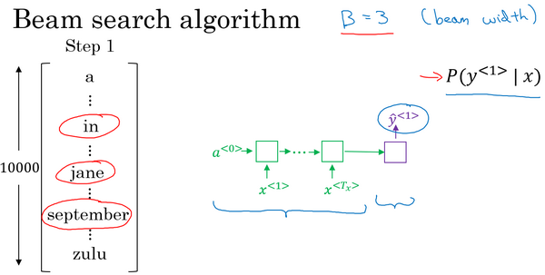
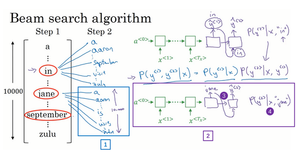
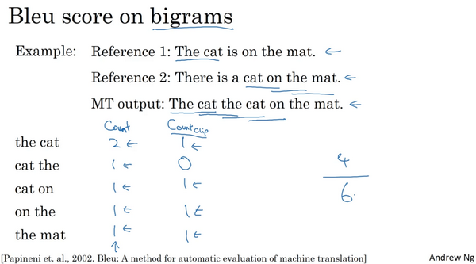
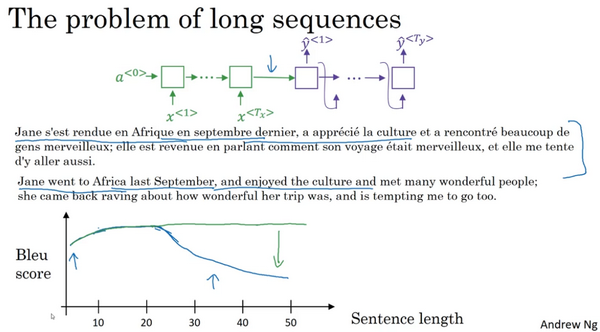
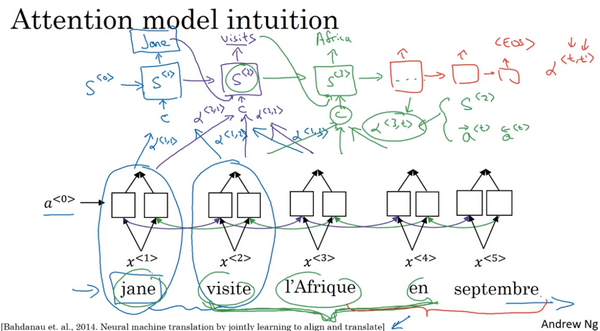
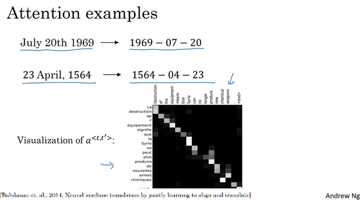
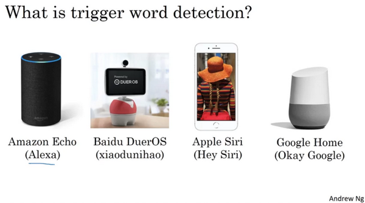
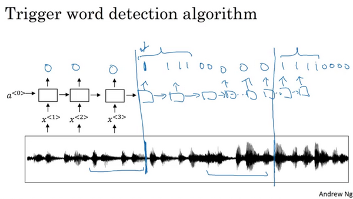

**第三週 序列模型和注意力機制（**Sequence models & Attention mechanism**）**
----------------------------------------------------------------------------
[TOC]
### 3.1 基礎模型（Basic Models）

在這一週，你將會學習**seq2seq**（**sequence to sequence**）模型，從機器翻譯到語音識別，它們都能起到很大的作用，從最基本的模型開始。之後你還會學習集束搜索（**Beam search**）和注意力模型（**Attention Model**），一直到最後的音訊模型，比如語音。

現在就開始吧，比如你想通過輸入一個法語句子，比如這句 “**Jane visite I'Afrique en septembre.**”，將它翻譯成一個英語句子，“**Jane is visiting Africa in September.**”。和之前一樣，我們用$x^{<1>}$ 一直到$x^{< 5>}$來表示輸入的句子的單詞，然後我們用$y^{<1>}$到$y^{<6>}$來表示輸出的句子的單詞，那麼，如何訓練出一個新的網路來輸入序列$x$和輸出序列$y$呢？

這裡有一些方法，這些方法主要都來自於兩篇論文，作者是**Sutskever**，**Oriol Vinyals** 和 **Quoc Le**，另一篇的作者是**Kyunghyun Cho**，**Bart van Merrienboer**，**Caglar Gulcehre**，**Dzmitry Bahdanau**，**Fethi Bougares**，**Holger Schwen** 和 **Yoshua Bengio**。

首先，我們先建立一個網路，這個網路叫做編碼網路（**encoder network**）（上圖編號1所示），它是一個**RNN**的結構， **RNN**的單元可以是**GRU** 也可以是**LSTM**。每次只向該網路中輸入一個法語單詞，將輸入序列接收完畢後，這個**RNN**網路會輸出一個向量來代表這個輸入序列。之後你可以建立一個解碼網路，我把它畫出來（上圖編號2所示），它以編碼網路的輸出作為輸入，編碼網路是左邊的黑色部分（上圖編號1所示），之後它可以被訓練為每次輸出一個翻譯後的單詞，一直到它輸出序列的結尾或者句子結尾標記，這個解碼網路的工作就結束了。和往常一樣我們把每次生成的標記都傳遞到下一個單元中來進行預測，就像之前用語言模型合成文本時一樣。

深度學習在近期最卓越的成果之一就是這個模型確實有效，在給出足夠的法語和英語文本的情況下，如果你訓練這個模型，透過輸入一個法語句子來輸出對應的英語翻譯，這個模型將會非常有效。這個模型簡單地用一個編碼網路來對輸入的法語句子進行編碼，然後用一個解碼網路來生成對應的英語翻譯。

還有一個與此類似的結構被用來做圖像描述，給出一張圖片，比如這張貓的圖片（上圖編號1所示），它能自動地輸出該圖片的描述，一隻貓坐在椅子上，那麼你如何訓練出這樣的網路？透過輸入圖像來輸出描述，像這個句子一樣。

方法如下，在之前的卷積網路課程中，你已經知道了如何將圖片輸入到卷積神經網路中，比如一個預訓練的**AlexNet**結構（上圖編號2方框所示），然後讓其學習圖片的編碼，或者學習圖片的一系列特徵。現在幻燈片所展示的就是**AlexNet**結構，我們去掉最後的**softmax**單元（上圖編號3所示），這個預訓練的**AlexNet**結構會給你一個4096維的特徵向量，向量表示的就是這隻貓的圖片，所以這個預訓練網路可以是圖像的編碼網路。現在你得到了一個4096維的向量來表示這張圖片，接著你可以把這個向量輸入到**RNN**中（上圖編號4方框所示），RNN要做的就是生成圖像的描述，每次生成一個單詞，這和我們在之前將法語譯為英語的機器翻譯中看到的結構很像，現在你輸入一個描述輸入的特徵向量，然後讓網路生成一個輸出序列，或者說一個一個地輸出單詞序列。

事實證明在圖像描述領域，這種方法相當有效，特別是當你想生成的描述不是特別長時。據我所知，這種模型首先是由**Junhua Mao**，**Wei Xu**，**Yi Yang**，**Jiang Wang**，**Zhiheng Huang**和**Alan Yuille**提出的，儘管有幾個團隊都幾乎在同一時間構造出了非常相似的模型，因為還有另外兩個團隊也在同一時間得出了相似的結論。我覺得有可能**Mao**的團隊和**Oriol Vinyals**，**Alexander Toshev**，**Samy Bengio**和**Dumitru Erhan**，還有**Andrej Karpathy**和**Fei-Fei Y**i是同一個團隊。

現在你知道了基本的**seq2seq**模型是怎樣運作的，以及**image to sequence**模型或者說圖像描述模型是怎樣運作的。不過這兩個模型運作方式有一些不同，主要體現在如何用語言模型合成新的文本，並生成對應序列的方面。一個主要的區別就是你大概不會想得到一個隨機選取的翻譯，你想要的是最準確的翻譯，或者說你可能不想要一個隨機選取的描述，你想要的是最好的最貼切的描述，我們將在下節影片中介紹如何生成這些序列。

### 3.2 選擇最可能的句子（Picking the most likely sentence）

在**seq2seq**機器翻譯模型和我們在第一週課程所用的語言模型之間有很多相似的地方，但是它們之間也有許多重要的區別，讓我們來一探究竟。

你可以把機器翻譯想成是建立一個條件語言模型，在語言模型中上方是一個我們在第一週所建立的模型，這個模型可以讓你能夠估計句子的可能性，這就是語言模型所做的事情。你也可以將它用於生成一個新的句子，如果你在圖上的該處（下圖編號1所示），有$x^{<1>}$和$x^{<2>}$，那麼在該例中$x^{<2>} = y^{<1>}$，但是$x^{<1>}$、$x^{<2>}$等在這裡並不重要。為了讓圖片看起來更簡潔，我把它們先抹去，可以理解為$x^{<1>}$是一個全為0的向量，然後$x^{<2>}$、$x^{<3>}$等都等於之前所生成的輸出，這就是所說的語言模型。

而機器翻譯模型是下面這樣的，我這裡用兩種不同的顏色來表示，即綠色和紫色，用綠色（上圖編號2所示）表示**encoder**網路，用紫色（上圖編號3所示）表示**decoder**網路。你會發現**decoder**網路看起來和剛才所畫的語言模型幾乎一模一樣，機器翻譯模型其實和語言模型非常相似，不同在於語言模型總是以零向量（上圖編號4所示）開始，而**encoder**網路會計算出一系列向量（上圖編號2所示）來表示輸入的句子。有了這個輸入句子，**decoder**網路就可以以這個句子開始，而不是以零向量開始，所以我把它叫做條件語言模型（**conditional language model**）。相比語言模型，輸出任意句子的機率，翻譯模型會輸出句子的英文翻譯（上圖編號5所示），這取決於輸入的法語句子（上圖編號6所示）。換句話說，你將估計一個英文翻譯的機率，比如估計這句英語翻譯的機率，"**Jane is visiting Africa in September.**"，這句翻譯是取決於法語句子，"**Jane visite I'Afrique en septembre.**"，這就是英語句子相對於輸入的法語句子的可能性，所以它是一個條件語言模型。

現在，假如你想真正地透過模型將法語翻譯成英文，透過輸入的法語句子模型將會告訴你各種英文翻譯所對應的可能性。$x$在這裡是法語句子"**Jane visite l'Afrique en septembre.**"，而它將告訴你不同的英語翻譯所對應的機率。顯然你不想讓它隨機地進行輸出，如果你從這個分布中進行取樣得到$P(y|x)$，可能取樣一次就能得到很好的翻譯，"**Jane is visiting Africa in September.**"。但是你可能也會得到一個截然不同的翻譯，"**Jane is going to be visiting Africa in September.**"，這句話聽起來有些笨拙，但它不是一個糟糕的翻譯，只是不是最好的而已。有時你也會偶然地得到這樣的翻譯，"**In September, Jane will visit Africa.**"，或者有時候你還會得到一個很糟糕的翻譯，"**Her African friend welcomed Jane in September.**"。所以當你使用這個模型來進行機器翻譯時，你並不是從得到的分布中進行隨機取樣，而是你要找到一個英語句子$y$（上圖編號1所示），使得條件機率最大化。所以在開發機器翻譯系統時，你需要做的一件事就是想出一個算法，用來找出合適的$y$值，使得該項最大化，而解決這種問題最通用的算法就是束搜索(**Beam Search**)，你將會在下節課見到它。

不過在了解束搜索之前，你可能會問一個問題，為什麼不用貪心搜索(**Greedy Search**)呢？貪心搜索是一種來自電腦科學的算法，生成第一個詞的分布以後，它將會根據你的條件語言模型挑選出最有可能的第一個詞進入你的機器翻譯模型中，在挑選出第一個詞之後它將會繼續挑選出最有可能的第二個詞，然後繼續挑選第三個最有可能的詞，這種算法就叫做貪心搜索，但是你真正需要的是一次性挑選出整個單詞序列，從$y^{<1>}$、$y^{<2>}$到$y^{<T_{y}>}$來使得整體的機率最大化。所以這種貪心算法先挑出最好的第一個詞，在這之後再挑最好的第二詞，然後再挑第三個，這種方法其實並不管用，為了證明這個觀點，我們來考慮下面兩種翻譯。

第一串（上圖編號1所示）翻譯明顯比第二個（上圖編號2所示）好，所以我們希望機器翻譯模型會說第一個句子的$P(y|x)$比第二個句子要高，第一個句子對於法語原文來說更好更簡潔，雖然第二個也不錯，但是有些囉嗦，裡面有很多不重要的詞。但如果貪心算法挑選出了"**Jane is**"作為前兩個詞，因為在英語中**going**更加常見，於是對於法語句子來說"**Jane is going**"相比"**Jane is visiting**"會有更高的機率作為法語的翻譯，所以很有可能如果你僅僅根據前兩個詞來估計第三個詞的可能性，得到的就是**going**，最終你會得到一個欠佳的句子，在$P(y|x)$模型中這不是一個最好的選擇。

我知道這種說法可能比較粗略，但是它確實是一種廣泛的現象，當你想得到單詞序列$y^{<1>}$、$y^{<2>}$一直到最後一個詞總體的機率時，一次僅僅挑選一個詞並不是最佳的選擇。當然，在英語中各種詞彙的組合數量還有很多很多，如果你的字典中有10,000個單詞，並且你的翻譯可能有10個詞那麼長，那麼可能的組合就有10,000的10次方這麼多，這僅僅是10個單詞的句子，從這樣大一個字典中來挑選單詞，所以可能的句子數量非常巨大，不可能去計算每一種組合的可能性。所以這時最常用的辦法就是用一個近似的搜索算法，這個近似的搜索算法做的就是它會盡力地，儘管不一定總會成功，但它將挑選出句子$y$使得條件機率最大化，儘管它不能保證找到的$y$值一定可以使機率最大化，但這已經足夠了。

最後總結一下，在本影片中，你看到了機器翻譯是如何用來解決條件語言模型問題的，這個模型和之前的語言模型一個主要的區別就是，相比之前的模型隨機地生成句子，在該模型中你要找到最有可能的英語句子，最可能的英語翻譯，但是可能的句子組合數量過於巨大，無法一一列舉，所以我們需要一種合適的搜索算法，讓我們在下節課中學習集束搜索。

### 3.3 集束搜索（Beam Search）

這節影片中你會學到集束搜索（**beam search**）算法，上節影片中我們講了對於機器翻譯來說，給定輸入，比如法語句子，你不會想要輸出一個隨機的英語翻譯結果，你想要一個最好的，最可能的英語翻譯結果。對於語音識別也一樣，給定一個輸入的語音片段，你不會想要一個隨機的文本翻譯結果，你想要最好的，最接近原意的翻譯結果，集束搜索就是解決這個最常用的算法。這節影片裡，你會明白怎麼把集束搜索算法應用到你自己的工作中，就用我們的法語句子的例子來試一下集束搜索吧。

“**Jane visite l'Afrique en Septembre.**”（法語句子），我們希望翻譯成英語，"**Jane is visiting Africa in September**".（英語句子），集束搜索算法首先做的就是挑選要輸出的英語翻譯中的第一個單詞。這裡我列出了10,000個詞的詞彙表（下圖編號1所示），為了簡化問題，我們忽略大小寫，所有的單詞都以小寫列出來。在集束搜尋的第一步中我用這個網路部分，綠色是編碼部分（下圖編號2所示），紫色是解碼部分（下圖編號3所示），來評估第一個單詞的機率值，給定輸入序列$x$，即法語作為輸入，第一個輸出$y$的機率值是多少。

貪婪算法只會挑出最可能的那一個單詞，然後繼續。而集束搜索則會考慮多個選擇，集束搜索算法會有一個參數**B**，叫做集束寬（**beam width**）。在這個例子中我把這個集束寬設成3，這樣就意味著集束搜索不會只考慮一個可能結果，而是一次會考慮3個，比如對第一個單詞有不同選擇的可能性，最後找到**in**、**jane**、**september**，是英語輸出的第一個單詞的最可能的三個選項，然後集束搜索算法會把結果存到計算機記憶體裡以便後面嘗試用這三個詞。如果集束寬設的不一樣，如果集束寬這個參數是10的話，那麼我們跟蹤的不僅僅3個，而是10個第一個單詞的最可能的選擇。所以要明白，為了執行集束搜索的第一步，你需要輸入法語句子到編碼網路，然後會解碼這個網路，這個**softmax**層（上圖編號3所示）會輸出10,000個機率值，得到這10,000個輸出的機率值，取前三個存起來。

讓我們看看集束搜索算法的第二步，已經選出了**in**、**jane**、**september**作為第一個單詞三個最可能的選擇，集束算法接下來會針對每個第一個單詞考慮第二個單詞是什麼，單詞**in**後面的第二個單詞可能是**a**或者是**aaron**，我就是從詞彙表裡把這些詞列了出來，或者是列表裡某個位置，**september**，可能是列表裡的 **visit**，一直到字母**z**，最後一個單詞是**zulu**（下圖編號1所示）。

為了評估第二個詞的機率值，我們用這個神經網路的部分，綠色是編碼部分（上圖編號2所示），而對於解碼部分，當決定單詞**in**後面是什麼，別忘了解碼器的第一個輸出$y^{<1>}$，我把$y^{<1>}$設為單詞**in**（上圖編號3所示），然後把它餵回來，這裡就是單詞**in**（上圖編號4所示），因為它的目的是努力找出第一個單詞是**in**的情況下，第二個單詞是什麼。這個輸出就是$y^{<2>}$（上圖編號5所示），有了這個連接（上圖編號6所示），就是這裡的第一個單詞**in**（上圖編號4所示）作為輸入，這樣這個網路就可以用來評估第二個單詞的機率了，在給定法語句子和翻譯結果的第一個單詞**in**的情況下。

注意，在第二步裡我們更關心的是要找到最可能的第一個和第二個單詞對，所以不僅僅是第二個單詞有最大的機率，而是第一個、第二個單詞對有最大的機率（上圖編號7所示）。按照條件機率的準則，這個可以表示成第一個單詞的機率（上圖編號8所示）乘以第二個單詞的機率（上圖編號9所示），這個可以從這個網路部分裡得到（上圖編號10所示），對於已經選擇的**in**、**jane**、**september**這三個單詞，你可以先保存這個機率值（上圖編號8所示），然後再乘以第二個機率值（上圖編號9所示）就得到了第一個和第二個單詞對的機率（上圖編號7所示）。

現在你已經知道在第一個單詞是in的情況下如何評估第二個單詞的機率，現在第一個單詞是**jane**，道理一樣，句子可能是"**jane a**"、"**jane aaron**"，等等到"**jane is**"、"**jane visits**"等等（上圖編號1所示）。你會用這個新的網路部分（上圖編號2所示），我在這裡畫一條線，代表從$y^{<1>}$，即**jane**，$y^{< 1 >}$連接**jane**（上圖編號3所示），那麼這個網路部分就可以告訴你給定輸入$x$和第一個詞是**jane**下，第二個單詞的機率了（上圖編號4所示），和上面一樣，你可以乘以$P(y^{<1>}|x)$得到$P(y^{<1>},y^{<2>}|x)$。

針對第二個單詞所有10,000個不同的選擇，最後對於單詞**september**也一樣，從單詞**a**到單詞**zulu**，用這個網路部分，我把它畫在這裡。來看看如果第一個單詞是**september**，第二個單詞最可能是什麼。所以對於集束搜索的第二步，由於我們一直用的集束寬為3，並且詞彙表裡有10,000個單詞，那麼最終我們會有3乘以10,000也就是30,000個可能的結果，因為這裡（上圖編號1所示）是10,000，這裡（上圖編號2所示）是10,000，這裡（上圖編號3所示）是10,000，就是集束寬乘以詞彙表大小，你要做的就是評估這30,000個選擇。按照第一個詞和第二個詞的機率，然後選出前三個，這樣又減少了這30,000個可能性，又變成了3個，減少到集束寬的大小。假如這30,000個選擇裡最可能的是“**in September**”（上圖編號4所示）和“**jane is**”（上圖編號5所示），以及“**jane visits**”（上圖編號6所示），畫的有點亂，但這就是這30,000個選擇裡最可能的三個結果，集束搜索算法會保存這些結果，然後用於下一次集束搜索。

注意一件事情，如果集束搜索找到了第一個和第二個單詞對最可能的三個選擇是“**in September**”或者“**jane is**”或者“**jane visits**”，這就意味著我們去掉了**september**作為英語翻譯結果的第一個單詞的選擇，所以我們的第一個單詞現在減少到了兩個可能結果，但是我們的集束寬是3，所以還是有$y^{<1>}$，$y^{<2>}$對的三個選擇。

在我們進入集束搜索的第三步之前，我還想提醒一下因為我們的集束寬等於3，每一步我們都複製3個，同樣的這種網路來評估部分句子和最後的結果，由於集束寬等於3，我們有三個網路副本（上圖編號7所示），每個網路的第一個單詞不同，而這三個網路可以高效地評估第二個單詞所有的30,000個選擇。所以不需要初始化30,000個網路副本，只需要使用3個網路的副本就可以快速的評估**softmax**的輸出，即$y^{<2>}$的10,000個結果。

讓我們快速解釋一下集束搜索的下一步，前面說過前兩個單詞最可能的選擇是“**in September**”和“**jane is**”以及“**jane visits**”，對於每一對單詞我們應該保存起來，給定輸入$x$，即法語句子作為$x$的情況下，$y^{<1>}$和$y^{<2>}$的機率值和前面一樣，現在我們考慮第三個單詞是什麼，可以是“**in September a**”，可以是“**in September aaron**”，一直到“**in September zulu**”。為了評估第三個單詞可能的選擇，我們用這個網路部分，第一單詞是**in**（上圖編號1所示），第二個單詞是**september**（上圖編號2所示），所以這個網路部分可以用來評估第三個單詞的機率，在給定輸入的法語句子$x$和給定的英語輸出的前兩個單詞“**in September**”情況下（上圖編號3所示）。對於第二個片段來說也一樣，就像這樣一樣（上圖編號4所示），對於“**jane visits**”也一樣，然後集束搜索還是會挑選出針對前三個詞的三個最可能的選擇，可能是“**in september jane**”（上圖編號5所示），“**Jane is visiting**”也很有可能（上圖編號6所示），也很可能是“**Jane visits Africa**”（上圖編號7所示）。

然後繼續，接著進行集束搜索的第四步，再加一個單詞繼續，最終這個過程的輸出一次增加一個單詞，集束搜索最終會找到“**Jane visits africa in september**”這個句子，終止在句尾符號（上圖編號8所示），用這種符號的系統非常常見，它們會發現這是最有可能輸出的一個英語句子。在本週的練習中，你會看到更多的執行細節，同時，你會運用到這個集束算法，在集束寬為3時，集束搜索一次只考慮3個可能結果。注意如果集束寬等於1，只考慮1種可能結果，這實際上就變成了貪婪搜索算法，上個影片裡我們已經討論過了。但是如果同時考慮多個，可能的結果比如3個，10個或者其他的個數，集束搜索通常會找到比貪婪搜索更好的輸出結果。

你已經了解集束搜索是如何工作的了，事實上還有一些額外的提示和技巧的改進能夠使集束算法更高效，我們在下個影片中一探究竟。

### 3.4 改進集束搜索（Refinements to Beam Search）

上個影片中, 你已經學到了基本的束搜索算法(**the basic beam search algorithm**)，這個影片裡,我們會學到一些技巧, 能夠使算法運行的更好。長度歸一化（**Length normalization**）就是對束搜索算法稍作調整的一種方式，幫助你得到更好的結果，下面介紹一下它。

前面講到束搜索就是最大化這個機率，這個乘積就是$P(y^{< 1 >}\ldots y^{< T_{y}}|X)$，可以表示成:$P(y^{<1>}|X)$ $P(y^{< 2 >}|X,y^{< 1 >})$ $P(y^{< 3 >}|X,y^{< 1 >},y^{< 2>})$…$P(y^{< T_{y} >}|X,y^{<1 >},y^{<2 >}\ldots y^{< T_{y} - 1 >})$

這些符號看起來可能比實際上嚇人，但這就是我們之前見到的乘積機率（**the product probabilities**）。如果計算這些，其實這些機率值都是小於1的，通常遠小於1。很多小於1的數乘起來，會得到很小很小的數字，會造成數值下溢（**numerical underflow**）。數值下溢就是數值太小了，導致電腦的浮點表示不能精確地儲存，因此在實踐中,我們不會最大化這個乘積，而是取$log$值。如果在這加上一個$log$，最大化這個$log$求和的機率值，在選擇最可能的句子$y$時，你會得到同樣的結果。所以通過取$log$，我們會得到一個數值上更穩定的算法，不容易出現四捨五入的誤差，數值的舍入誤差（**rounding errors**）或者說數值下溢（**numerical underflow**）。因為$log$函數它是嚴格單調遞增的函數，最大化$P(y)$，因為對數函數，這就是$log$函數，是嚴格單調遞增的函數，所以最大化$logP(y|x)$和最大化$P(y|x)$結果一樣。如果一個$y$值能夠使前者最大，就肯定能使後者也取最大。所以實際工作中，我們總是記錄機率的對數和（**the sum of logs of the probabilities**），而不是機率的乘積（**the production of probabilities**）。

對於目標函數（**this objective function**），還可以做一些改變，可以使得機器翻譯表現的更好。如果參照原來的目標函數（**this original objective**），如果有一個很長的句子，那麼這個句子的機率會很低，因為乘了很多項小於1的數字來估計句子的機率。所以如果乘起來很多小於1的數字，那麼就會得到一個更小的機率值，所以這個目標函數有一個缺點，它可能不自然地傾向於簡短的翻譯結果，它更偏向短的輸出，因為短句子的機率是由更少數量的小於1的數字乘積得到的，所以這個乘積不會那麼小。順便說一下，這裡也有同樣的問題，機率的$log$值通常小於等於1，實際上在$log$的這個範圍內，所以加起來的項越多，得到的結果越負，所以對這個算法另一個改變也可以使它表現的更好，也就是我們不再最大化這個目標函數了，我們可以把它歸一化，通過除以翻譯結果的單詞數量（**normalize this by the number of words in your translation**）。這樣就是取每個單詞的機率對數值的平均了，這樣很明顯地減少了對輸出長的結果的懲罰（**this significantly reduces the penalty for outputting longer translations.**）。

在實踐中，有個探索性的方法，相比於直接除$T_{y}$，也就是輸出句子的單詞總數，我們有時會用一個更柔和的方法（**a softer approach**），在$T_{y}$上加上指數$a$，$a$可以等於0.7。如果$a$等於1，就相當於完全用長度來歸一化，如果$a$等於0，$T_{y}$的0次冪就是1，就相當於完全沒有歸一化，這就是在完全歸一化和沒有歸一化之間。$a$就是算法另一個超參數（**hyper parameter**），需要調整大小來得到最好的結果。不得不承認，這樣用$a$實際上是試探性的，它並沒有理論驗證。但是大家都發現效果很好，大家都發現實踐中效果不錯，所以很多人都會這麼做。你可以嘗試不同的$a$值，看看哪一個能夠得到最好的結果。

總結一下如何運行束搜索算法。當你運行束搜索時，你會看到很多長度等於1的句子，很多長度等於2的句子，很多長度等於3的句子，等等。可能運行束搜索30步，考慮輸出的句子可能達到，比如長度30。因為束寬為3，你會記錄所有這些可能的句子長度，長度為1、2、 3、 4 等等一直到30的三個最可能的選擇。然後針對這些所有的可能的輸出句子，用這個式子（上圖編號1所示）給它們打分，取機率最大的幾個句子，然後對這些束搜索得到的句子，計算這個目標函數。最後從經過評估的這些句子中，挑選出在歸一化的$log$ 機率目標函數上得分最高的一個（**you pick the one that achieves the highest value on this normalized log probability objective.**），有時這個也叫作**歸一化的對數似然目標函數**（**a normalized log likelihood objective**）。這就是最終輸出的翻譯結果，這就是如何實現束搜索。這週的練習中你會自己實現這個算法。

最後還有一些實現的細節，如何選擇束寬**B**。**B**越大，你考慮的選擇越多，你找到的句子可能越好，但是**B**越大，你的算法的計算代價越大，因為你要把很多的可能選擇保存起來。最後我們總結一下關於如何選擇束寬**B**的一些想法。接下來是針對或大或小的**B**各自的優缺點。如果束寬很大，你會考慮很多的可能，你會得到一個更好的結果，因為你要考慮很多的選擇，但是算法會運行的慢一些，記憶體占用也會增大，計算起來會慢一點。而如果你用小的束寬，結果會沒那麼好，因為你在算法運行中，保存的選擇更少，但是你的算法運行的更快，記憶體占用也小。在前面影片裡，**我們例子中用了束寬為3，所以會保存3個可能選擇，在實踐中這個值有點偏小**。**在產品中，經常可以看到把束寬設到10，**我認為束寬為100對於產品系統來說有點大了，這也取決於不同應用。但是對科研而言，人們想壓榨出全部性能，這樣有個最好的結果用來發論文，也經常看到大家用束寬為1000或者3000，這也是取決於特定的應用和特定的領域。在你實現你的應用時，嘗試不同的束寬的值，當B很大的時候，性能提高會越來越少。對於很多應用來說，從束寬1，也就是貪心算法，到束寬為3、到10，你會看到一個很大的改善。但是當束寬從1000增加到3000時，效果就沒那麼明顯了。對於之前上過電腦科學課程的同學來說，如果你熟悉電腦科學裡的搜索算法（**computer science search algorithms**）, 比如廣度優先搜索（**BFS, Breadth First Search algorithms**），或者深度優先搜索（**DFS, Depth First Search**），你可以這樣想束搜索，不像其他你在電腦科學算法課程中學到的算法一樣。如果你沒聽說過這些算法也不要緊，但是如果你聽說過廣度優先搜索和深度優先搜索，不同於這些算法，這些都是精確的搜索算法（**exact search algorithms**），束搜索運行的更快，但是不能保證一定能找到**argmax**的準確的最大值。如果你沒聽說過廣度優先搜索和深度優先搜索，也不用擔心，這些對於我們的目標也不重要，如果你聽說過，這就是束搜索和其他算法的關係。

好，這就是束搜索。這個算法廣泛應用在多產品系統或者許多商業系統上，在深度學習系列課程中的第三門課中，我們討論了很多關於誤差分析（**error analysis**）的問題。事實上在束搜索上做誤差分析是我發現的最有用的工具之一。有時你想知道是否應該增大束寬，我的束寬是否足夠好，你可以計算一些簡單的東西來指導你需要做什麼，來改進你的搜索算法。我們在下個影片裡進一步討論。

### 3.5 集束搜索的誤差分析（Error analysis in beam search）

在這五門課中的第三門課裡，你了解了誤差分析是如何能夠幫助你集中時間做你的項目中最有用的工作，束搜索算法是一種近似搜索算法（**an approximate search algorithm**），也被稱作啟發式搜索算法（**a heuristic search algorithm**），它不總是輸出可能性最大的句子，它僅記錄著**B**為前3或者10或是100種可能。那麼如果束搜索算法出現錯誤會怎樣呢?

本節影片中，你將會學習到誤差分析和束搜索算法是如何相互起作用的，以及你怎樣才能發現是束搜索算法出現了問題，需要花時間解決，還是你的**RNN**模型出了問題，要花時間解決。我們先來看看如何對束搜索算法進行誤差分析。

我們來用這個例子說明： “**Jane visite l'Afrique en septembre**”。假如說，在你的機器翻譯的**dev**集中，也就是開發集（**development set**），人工是這樣翻譯的: **Jane visits Africa in September**,我會將這個標記為$y^*$。這是一個十分不錯的人工翻譯結果，不過假如說，當你在已經完成學習的**RNN**模型，也就是已完成學習的翻譯模型中運行束搜索算法時，它輸出了這個翻譯結果：**Jane visited Africa last September**，我們將它標記為$\hat y$。這是一個十分糟糕的翻譯，它實際上改變了句子的原意，因此這不是個好翻譯。

你的模型有兩個主要部分，一個是神經網路模型，或說是序列到序列模型（**sequence to sequence model**），我們將這個稱作是**RNN**模型，它實際上是個編碼器和解碼器（ **an encoder and a decoder**）。另一部分是束搜索算法，以某個集束寬度**B**運行。如果你能夠找出造成這個錯誤，這個不太好的翻譯的原因，是兩個部分中的哪一個，不是很好嗎? **RNN** (**循環神經網路**)是更可能是出錯的原因呢，還是束搜索算法更可能是出錯的原因呢？你在第三門課中了解到了大家很容易想到去收集更多的訓練數據，這總歸沒什麼壞處。所以同樣的，大家也會覺得不行就增大束寬，也是不會錯的，或者說是很大可能是沒有危害的。但是就像單純獲取更多訓練數據，可能並不能得到預期的表現結果。相同的，單純增大束寬也可能得不到你想要的結果，不過你怎樣才能知道是不是值得花時間去改進搜索算法呢?
下面我們來分解這個問題弄清楚什麼情況下該用什麼解決辦法。

**RNN** (**循環神經網路**)實際上是個編碼器和解碼器（**the encoder and the decoder**），它會計算$P(y|x)$。所以舉個例子，對於這個句子：**Jane visits Africa in September**，你將**Jane visits Africa**填入這裡（上圖編號1所示），同樣，我現在忽略了字母的大小寫，後面也是一樣，然後這個就會計算。$P(y|x)$結果表明，你此時能做的最有效的事就是用這個模型來計算$P(y^*|x)$，同時也用你的RNN模型來計算$P(\hat y|x)$，然後比較一下這兩個值哪個更大。有可能是左邊大於右邊，也有可能是$P(y^*)$小於$P(\hat y)$，其實應該是小於或等於，對吧。取決於實際是哪種情況，你就能夠更清楚地將這個特定的錯誤歸咎於**RNN**或是束搜索算法，或說是哪個負有更大的責任。我們來探究一下其中的邏輯。

這是之前幻燈片裡的兩個句子。記住，我們是要計算$P(y^*|x)$和$P(\hat y|x)$，然後比較這兩個哪個更大，所以就會有兩種情況。

第一種情況，**RNN**模型的輸出結果$P(y^*|x)$ 大於$P(\hat y|x)$，這意味著什麼呢?
束搜索算法選擇了$\hat y$ ，對吧?
你得到$\hat y$的方式是，你用一個**RNN**模型來計算$P(y|x)$，然後束搜索算法做的就是嘗試尋找使$P(y|x)$最大的$y$，不過在這種情況下，相比於$\hat y$，$y^*$的值更$P(y|x)$大，因此你能夠得出束搜索算法實際上不能夠給你一個能使$P(y|x)$最大化的$y$值，因為束搜索算法的任務就是尋找一個$y$的值來使這項更大，但是它卻選擇了$\hat y$，而$y^*$實際上能得到更大的值。因此這種情況下你能夠得出是束搜索算法出錯了。那另一種情況是怎樣的呢?

第二種情況是$P(y^*|x)$小於或等於$P(\hat y|x)$對吧？這兩者之中總有一個是真的。情況1或是情況2總有一個為真。情況2你能夠總結出什麼呢?
在我們的例子中，$y^*$ 是比 $\hat y$更好的翻譯結果，不過根據RNN模型的結果，$P(y^*)$ 是小於$P(\hat y)$的，也就是說，相比於$\hat y$，$y^*$成為輸出的可能更小。因此在這種情況下，看來是**RNN**模型出了問題。同時可能值得在**RNN**模型上花更多時間。這裡我少講了一些有關長度歸一化（**length normalizations**）的細節。這裡我略過了有關長度歸一化的細節，如果你用了某種長度歸一化，那麼你要做的就不是比較這兩種可能性大小，而是比較長度歸一化後的最佳化目標函數值。不過現在先忽略這種複雜的情況。第二種情況表明雖然$y^*$是一個更好的翻譯結果，**RNN**模型卻賦予它更低的可能性，是**RNN**模型出現了問題。

所以誤差分析過程看起來就像下面這樣。你先遍歷開發集，然後在其中找出算法產生的錯誤，這個例子中，假如說$P(y^*|x)$的值為2 x 10-10，而$P(\hat y|x)$的值為 1 x10-10，根據上頁幻燈片中的邏輯關係，這種情況下我們得知束搜索算法實際上選擇了比$y^*$可能性更低的$\hat y$，因此我會說束搜索算法出錯了。我將它縮寫為**B**。接著你繼續遍歷第二個錯誤，再來看這些可能性。也許對於第二個例子來說，你認為是**RNN**模型出現了問題，我會用縮寫**R**來代表**RNN**。再接著你遍歷了更多的例子，有時是束搜索算法出現了問題，有時是模型出現了問題，等等。通過這個過程，你就能夠執行誤差分析，得出束搜索算法和**RNN**模型出錯的比例是多少。有了這樣的誤差分析過程，你就可以對開發集中每一個錯誤例子，即算法輸出了比人工翻譯更差的結果的情況，嘗試確定這些錯誤，是搜索算法出了問題，還是生成目標函數(束搜索算法使之最大化)的**RNN**模型出了問題。並且通過這個過程，你能夠發現這兩個部分中哪個是產生更多錯誤的原因，並且只有當你發現是束搜索算法造成了大部分錯誤時，才值得花費努力增大集束寬度。相反地，如果你發現是**RNN**模型出了更多錯，那麼你可以進行更深層次的分析，來決定是需要增加正則化還是獲取更多的訓練數據，抑或是嘗試一個不同的網路結構，或是其他方案。你在第三門課中，了解到各種技巧都能夠應用在這裡。

這就是束搜索算法中的誤差分析，我認為這個特定的誤差分析過程是十分有用的，它可以用於分析近似最佳算法(如束搜索算法)，這些算法被用來最佳化學習算法(例如序列到序列模型/**RNN**)輸出的目標函數。也就是我們這些課中一直討論的。學會了這個方法，我希望你能夠在你的應用裡更有效地運用好這些類型的模型。

### 3.6 Bleu 得分（選修）（Bleu Score (optional)）

機器翻譯（**machine translation**）的一大難題是一個法語句子可以有多種英文翻譯而且都同樣好，所以當有多個同樣好的答案時，怎樣評估一個機器翻譯系統呢？不像圖像識別（**image recognition**），只有一個正確答案，就只要測量準確性就可以了。如果有多個不錯的答案，要怎樣衡量準確性呢?
常見的解決辦法是，通過一個叫做**BLEU**得分（**the BLEU score**）的東西來解決。所以，在這個選修影片中，我想與你分享，我想讓你了解**BLEU**得分是怎樣工作的。

假如給你一個法語句子：**Le chat est sur le tapis**，然後給你一個這個句子的人工翻譯作參考：**The cat is on the mat**。不過有多種相當不錯的翻譯。所以一個不同的人，也許會將其翻譯為：**There is a cat on the mat**，同時，實際上這兩個都是很好的，都準確地翻譯了這個法語句子。**BLEU得分做的就是，給定一個機器生成的翻譯，它能夠自動地計算一個分數來衡量機器翻譯的好壞。**直覺告訴我們，只要這個機器生成的翻譯與任何一個人工翻譯的結果足夠接近，那麼它就會得到一個高的**BLEU**分數。順便提一下**BLEU**代表**bilingual evaluation understudy** (雙語評估替補)。在戲劇界，侯補演員(**understudy**)學習資深的演員的角色，這樣在必要的時候，他們就能夠接替這些資深演員。而**BLEU**的初衷是相對於請評估員（**ask human evaluators**），人工評估機器翻譯系統（**the machine translation system**），**BLEU**得分就相當於一個侯補者，它可以代替人類來評估機器翻譯的每一個輸出結果。**BLEU**得分是由**Kishore Papineni,** **Salim Roukos**，**Todd Ward**和**Wei-Jing Zhu**發表的這篇論文十分有影響力並且實際上也是一篇很好讀的文章。所以如果有時間的話，我推薦你讀一下。**BLEU**得分背後的理念是觀察機器生成的翻譯，然後看生成的詞是否出現在少一個人工翻譯參考之中。因此這些人工翻譯的參考會包含在開發集或是測試集中。

（**參考論文**：**Papineni, Kishore& Roukos, Salim & Ward, Todd & Zhu, Wei-jing. (2002). BLEU: a Method for Automatic Evaluation of Machine Translation.10.3115/1073083.1073135.**）

現在，我們來看一個極端的例子。我們假設機器翻譯系統縮寫為**MT**。機器翻譯 (**MT**)的輸出是：**the the the the the the the**。這顯然是一個十分糟糕的翻譯。衡量機器翻譯輸出質量的方法之一是觀察輸出結果的每一個詞看其是否出現在參考中，這被稱做是機器翻譯的精確度（**a precision of the machine translation output**）。這個情況下，機器翻譯輸出了七個單詞並且這七個詞中的每一個都出現在了參考1或是參考2。單詞**the**在兩個參考中都出現了，所以看起來每個詞都是很合理的。因此這個輸出的精確度就是7/7，看起來是一個極好的精確度。這就是為什麼把出現在參考中的詞在**MT**輸出的所有詞中所占的比例作為精確度評估標準並不是很有用的原因。因為它似乎意味著，例子中**MT**輸出的翻譯有很高的精確度，因此取而代之的是我們要用的這個改良後的精確度評估方法，我們把每一個單詞的記分上限定為它在參考句子中出現的最多次數。在參考1中，單詞**the**出現了兩次，在參考2中，單詞**the**只出現了一次。而2比1大，所以我們會說，單詞**the**的得分上限為2。有了這個改良後的精確度，我們就說，這個輸出句子的得分為2/7，因為在7個詞中，我們最多只能給它2分。所以這裡分母就是7個詞中單詞**the**總共出現的次數，而分子就是單詞**the**出現的計數。我們在達到上限時截斷計數，這就是改良後的精確度評估（**the modified precision measure**）。

到目前為止，我們都只是關注單獨的單詞，在**BLEU**得分中，你不想僅僅考慮單個的單詞，你也許也想考慮成對的單詞，我們定義一下二元詞組（**bigrams**）的**BLEU**得分。bigram的意思就是相鄰的兩個單詞。現在我們來看看怎樣用二元詞組來定義**BLEU**得分，並且這僅僅只是最終的BLEU得分的一部分。我們會考慮一元詞組（**unigrams**）也就是單個單詞以及二元詞組（**bigrams**），即成對的詞，同時也許會有更長的單詞序列，比如說三元詞組（**trigrams**）。意思是三個靠在一起的詞。我們繼續剛才的例子，還是前面出現過的參考1和2，不過現在我們假定機器翻譯輸出了稍微好一點的翻譯:**The cat the cat on the mat**，仍然不是一個好的翻譯，不過也許比上一個好一些。這裡，可能的二元詞組有**the cat** ，忽略大小寫，接著是**cat the**， 這是另一個二元詞組，然後又是**the cat**。不過我已經有了，所以我們跳過它，然後下一個是**cat on**，然後是**on the**，再然後是**the mat**。所以這些就是機器翻譯中的二元詞組。好，我們來數一數每個二元詞組出現了多少次。**the cat**出現了兩次 ，**cat the**出現了一次，剩下的都只出現了一次。最後 ，我們來定義一下截取計數（**the clipped count**）。也就是**Count_clip**。為了定義它，我們以這列的值為基礎，但是給算法設置得分上限，上限值為二元詞組出現在參考1或2中的最大次數。**the cat**在兩個參考中最多出現一次，所以我將截取它的計數為1。**cat the**它並沒有出現在參考1和參考2中，所以我將它截取為0。**cat on** ，好，它出現了一次，我們就記1分。**on the**出現一次就記1分，**the mat**出現了一次，所以這些就是截取完的計數（**the clipped counts**）。我們把所有的這些計數都截取了一遍，實際上就是將它們降低使之不大於二元詞組出現在參考中的次數。最後，修改後的二元詞組的精確度就是**count_clip**之和。因此那就是4除以二元詞組的總個數，也就是6。因此是4/6也就是2/3為二元詞組改良後的精確度。

現在我們將它公式化。基於我們在一元詞組中學到的內容，我們將改良後的一元詞組精確度定義為$P_1$，$P$代表的是精確度。這裡的下標1的意思是一元詞組。不過它定義為一元詞組之和，也就是對機器翻譯結果中所有單詞求和，**MT** 輸出就是$\hat y$，**Countclip**(**unigram**)。除以機器翻譯輸出中的一元詞組出現次數之和。因此這個就是最終結果應該是兩頁幻燈片前得到的2/7。這裡的1指代的是一元詞組，意思是我們在考慮單獨的詞，你也可以定義$P_n$為$n$元詞組精確度，用**n-gram**替代掉一元詞組。所以這就是機器翻譯輸出中的$n$元詞組的**countclip**之和除以$n$元詞組的出現次數之和。因此這些精確度或說是這些改良後的精確度得分評估的是一元詞組或是二元詞組。就是我們前頁幻燈片中做的，或者是三元詞組，也就是由三個詞組成的，甚至是$n$取更大數值的$n$元詞組。這個方法都能夠讓你衡量機器翻譯輸出中與參考相似重複的程度。另外，你能夠確信如果機器翻譯輸出與參考1或是參考2完全一致的話，那麼所有的這些$P_1$、$P_2$等等的值，都會等於1.0。為了得到改良後的1.0的精確度，只要你的輸出與參考之一完全相同就能滿足，不過有時即使輸出結果並不完全與參考相同，這也是有可能實現的。你可以將它們以另一種方式組合，但願仍能得到不錯的翻譯結果。

最後，我們將這些組合一下來構成最終的**BLEU**得分。$P_n$就是$n$元詞組這一項的**BLEU**得分，也是計算出的$n$元詞組改良後的精確度，按照慣例，為了用一個值來表示你需要計算$P_1$，$P_2$， $P_3$，$P_4$。然後將它們用這個公式組合在一起，就是取平均值。按照慣例**BLEU**得分被定義為，$exp (\frac{1}{4}\sum\limits_{n=1}^{4}{{{P}_{n}}})$，對這個線性運算進行乘方運算，乘方是嚴格單調遞增的運算，我們實際上會用額外的一個叫做**BP** 的懲罰因子（**the BP penalty**）來調整這項。**BP**的意思是“簡短懲罰”（ **brevity penalty**）。這些細節也許並不是十分重要，但是你可以大致了解一下。
事實表明，如果你輸出了一個非常短的翻譯，那麼它會更容易得到一個高精確度。因為輸出的大部分詞可能都出現在參考之中，不過我們並不想要特別短的翻譯結果。因此簡短懲罰(**BP**)就是一個調整因子，它能夠懲罰輸出了太短翻譯結果的翻譯系統。**BP**的公式如上圖所示。如果你的機器翻譯系統實際上輸出了比人工翻譯結果更長的翻譯，那麼它就等於1，其他情況下就是像這樣的公式，懲罰所有更短的翻譯，細節部分你能夠在這篇論文中找到。

再說一句，在之前的影片中，你了解了擁有單一實數評估指標（**a single real number evaluation metric**）的重要性，因為它能夠讓你嘗試兩種想法，然後看一下哪個得分更高，儘量選擇得分更高的那個，**BLEU**得分對於機器翻譯來說，具有革命性的原因是因為它有一個相當不錯的雖然不是完美的但是非常好的單一實數評估指標，因此它加快了整個機器翻譯領域的進程，我希望這節影片能夠讓你了解**BLEU**得分是如何操作的。實踐中，很少人會從零實現一個**BLEU**得分（**implement a BLEU score from scratch**），有很多開源的實現結果，你可以下載下來然後直接用來評估你的系統。不過今天，**BLEU**得分被用來評估許多生成文本的系統（**systems that generate text**），比如說機器翻譯系統（**machine translation systems**），也有我之前簡單提到的圖像描述系統（**image captioning systems**）。也就是說你會用神經網路來生成圖像描述，然後使用**BLEU**得分來看一下，結果在多大程度上與參考描述或是多個人工完成的參考描述內容相符。**BLEU**得分是一個有用的單一實數評估指標，用於評估生成文本的算法，判斷輸出的結果是否與人工寫出的參考文本的含義相似。不過它並沒有用於語音識別（**speech recognition**）。因為在語音識別當中，通常只有一個答案，你可以用其他的評估方法，來看一下你的語音識別結果，是否十分相近或是字字正確（**pretty much, exactly word for word correct**）。不過在圖像描述應用中，對於同一圖片的不同描述，可能是同樣好的。或者對於機器翻譯來說，有多個一樣好的翻譯結果，**BLEU**得分就給了你一個能夠自動評估的方法，幫助加快算法開發進程。說了這麼多，希望你明白了**BLEU**得分是怎麼運行的。

### 3.7 注意力模型直觀理解（Attention Model Intuition）

在本週大部分時間中，你都在使用這個編碼解碼的構架（**a Encoder-Decoder architecture**）來完成機器翻譯。當你使用**RNN**讀一個句子，於是另一個會輸出一個句子。我們要對其做一些改變，稱為注意力模型（**the Attention Model**），並且這會使它工作得更好。注意力模型或者說注意力這種思想（**The attention algorithm, the attention idea**）已經是深度學習中最重要的思想之一，我們看看它是怎麼運作的。

像這樣給定一個很長的法語句子，在你的神經網路中，這個綠色的編碼器要做的就是讀整個句子，然後記憶整個句子，再在感知機中傳遞（**to read in the whole sentence and then memorize the whole sentences and store it in the activations conveyed her**）。而對於這個紫色的神經網路，即解碼網路（**the decoder network**）將生成英文翻譯，**Jane**去年九月去了非洲，非常享受非洲文化，遇到了很多奇妙的人，她回來就嚷嚷道，她經歷了一個多棒的旅行，並邀請我也一起去。人工翻譯並不會通過讀整個法語句子，再記憶裡面的東西，然後從零開始，機械式地翻譯成一個英語句子。而人工翻譯，首先會做的可能是先翻譯出句子的部分，再看下一部分，並翻譯這一部分。看一部分，翻譯一部分，一直這樣下去。你會通過句子，一點一點地翻譯，因為記憶整個的像這樣的的句子是非常困難的。你在下面這個編碼解碼結構中，會看到它對於短句子效果非常好，於是它會有一個相對高的**Bleu**分（**Bleu score**），但是對於長句子而言，比如說大於30或者40詞的句子，它的表現就會變差。**Bleu**評分看起來就會像是這樣，隨著單詞數量變化，短的句子會難以翻譯，因為很難得到所有詞。對於長的句子，效果也不好，因為在神經網路中，記憶非常長句子是非常困難的。在這個和下個影片中，你會見識到注意力模型，它翻譯得很像人類，一次翻譯句子的一部分。而且有了注意力模型，機器翻譯系統的表現會像這個一樣，因為翻譯只會翻譯句子的一部分，你不會看到這個有一個巨大的下傾（**huge dip**），這個下傾實際上衡量了神經網路記憶一個長句子的能力，這是我們不希望神經網路去做的事情。在這個影片中，我想要給你們注意力機制運行的一些直觀的東西。然後在下個影片中，完善細節。

注意力模型源於**Dimitri,** **Bahdanau**, **Camcrun Cho**, **Yoshe Bengio**。（**Bahdanau D, Cho K, Bengio Y. Neural Machine Translation by Jointly Learning to Align and Translate[J]. Computer Science,2014.**）雖然這個模型源於機器翻譯，但它也推廣到了其他應用領域。我認為在深度學習領域，這個是個非常有影響力的，非常具有開創性的論文。

讓我們用一個短句舉例說明一下，即使這些思想可能是應用於更長的句子。但是用短句來舉例說明，講解這些思想會更簡單。我們有一個很平常的句子：(法語)**Jane visite l'Afrique en Septembre**。假定我們使用**RNN**，在這個情況中，我們將使用一個雙向的**RNN**（**a bidirectional RNN**），為了計算每個輸入單詞的的特徵集（**set of features**），你必須要理解輸出$\hat y^{<1>}$到$\hat y^{<3>}$一直到$\hat y^{<5>}$的雙向**RNN**。但是我們並不是只翻譯一個單詞，讓我們先去掉上面的$Y$，就用雙向的**RNN**。我們要對單詞做的就是，對於句子裡的每五個單詞，計算一個句子中單詞的特徵集，也有可能是周圍的詞，讓我們試試，生成英文翻譯。我們將使用另一個**RNN**生成英文翻譯，這是我平時用的**RNN**記號。我不用$A$來表示感知機（**the activation**），這是為了避免和這裡的感知機（**the activations**）混淆。我會用另一個不同的記號，我會用$S$來表示**RNN**的隱藏狀態（**the hidden state in this RNN**），不用$A^{<1>}$，而是用$S^{<1>}$。我們希望在這個模型裡第一個生成的單詞將會是**Jane**，為了生成**Jane visits Africa in September**。於是等式就是，當你嘗試生成第一個詞，即輸出，那麼我們應該看輸入的法語句子的哪個部分？似乎你應該先看第一個單詞，或者它附近的詞。但是你別看太遠了，比如說看到句尾去了。所以注意力模型就會計算注意力權重（**a set of attention weights**），我們將用$a^{<1,1>}$來表示當你生成第一個詞時你應該放多少注意力在這個第一塊訊息處。然後我們算第二個，這個叫注意力權重，$a^{<1,2>}$它告訴我們當你嘗試去計算第一個詞**Jane**時，我們應該花多少注意力在輸入的第二個詞上面。同理這裡是$a^{<1,3>}$，接下去也同理。這些將會告訴我們，我們應該花多少注意力在記號為$C$的內容上。這就是**RNN**的一個單元，如何嘗試生成第一個詞的，這是**RNN**的其中一步，我們將會在下個影片中講解細節。對於**RNN**的第二步，我們將有一個新的隱藏狀態$S^{<2>}$，我們也會用一個新的注意力權值集**(a new set of the attention weights**),我們將用$a^{<2,1>}$來告訴我們什麼時候生成第二個詞, 那麼**visits**就會是第二個標籤了(**the ground trip label**)。我們應該花多少注意力在輸入的第一個法語詞上。然後同理$a^{<2,2>}$，接下去也同理，我們應該花多少注意力在**visite**詞上，我們應該花多少注意在詞**l'Afique**上面。當然我們第一個生成的詞**Jane**也會輸入到這裡，於是我們就有了需要花注意力的上下文。第二步，這也是個輸入，然後會一起生成第二個詞，這會讓我們來到第三步$S^{<3>}$，這是輸入，我們再有上下文**C**，它取決於在不同的時間集（**time sets**）,上面的$a^{<3>}$。這個告訴了我們我們要花注意力在不同的法語的輸入詞上面。
然後同理。有些事情我還沒說清楚，但是在下個影片中，我會講解一些細節，比如如何準確定義上下文，還有第三個詞的上下文，是否真的需要去注意句子中的周圍的詞。這裡要用到的公式以及如何計算這些注意力權重（**these attention weights**），將會在下個影片中講解到。在下個影片中你會看到$a^{<3,t>}$，即當你嘗試去生成第三個詞，應該是**l'Afique**，就得到了右邊這個輸出，這個**RNN**步驟應該要花注意力在$t$時的法語詞上，這取決於在$t$時的雙向**RNN**的啟動值。那麼它應該是取決於第四個啟動值，它會取決於上一步的狀態，它會取決於$S^{<2>}$。然後這些一起影響你應該花多少注意在輸入的法語句子的某個詞上面。我們會在下個影片中講解這些細節。但是直觀來想就是**RNN**向前進一次生成一個詞，在每一步直到最終生成可能是**\<EOS\>**。這些是注意力權重，即$a^{<t,t>}$告訴你，當你嘗試生成第$t$個英文詞，它應該花多少注意力在第$t$個法語詞上面。當生成一個特定的英文詞時，這允許它在每個時間步去看周圍詞距內的法語詞要花多少注意力。

我希望這個影片傳遞了關於注意力模型的一些直觀的東西。我們現在可能對算法的運行有了大概的感覺，讓我們進入到下個影片中，看看具體的細節。

### 3.8注意力模型（Attention Model）

在上個影片中你已經見到了,**注意力模型如何讓一個神經網路只注意到一部分的輸入句子。當它在生成句子的時候，更像人類翻譯**。讓我們把這些想法轉化成確切的式子，來實現注意力模型。

跟上個影片一樣，我們先假定有一個輸入句子，並使用雙向的**RNN**，或者雙向的**GRU**或者雙向的**LSTM**，去計算每個詞的特徵。實際上**GRU**和**LSTM**經常應用於這個，可能**LSTM**更經常一點。對於前向傳播（**the forward occurrence**），你有第一個時間步的前向傳播的啟動值（**a forward occurrence first time step**），第一個時間步後向傳播的啟動值，後向的啟動值，以此類推。他們一共向前了五個時間步，也向後了五個時間步，技術上我們把這裡設置為0。我們也可以後向傳播6次，設一個都是0的因子，實際上就是個都是0的因子。為了簡化每個時間步的記號，即使你在雙向**RNN**已經計算了前向的特徵值和後向的特徵值，我就用$a^{<t>}$來一起表示這些聯繫。所以$a^{<t>}$就是時間步$t$上的特徵向量。**但是為了保持記號的一致性，我們用第二個，也就是$t'$，實際上我將用$t'$來索引法語句子裡面的詞**。接下來我們只進行前向計算，就是說這是個單向的**RNN**，用狀態$S$表示生成翻譯。所以第一個時間步，它應該生成$y^{<1>}$，當你輸入上下文$C$的時候就會這樣，如果你想用時間來索引它，你可以寫$C^{<1>}$，但有時候我就寫個$C$，就是沒有上標的$C$，這個會取決於注意力參數，即$a^{<1,1>}$，$a^{<1,2>}$以此類推，告訴我們應該花多少注意力。同樣的，這個$a$參數告訴我們上下文有多少取決於我們得到的特徵，或者我們從不同時間步中得到的啟動值。所以我們定義上下文的方式實際上來源於被注意力權重加權的不同時間步中的特徵值。於是更公式化的注意力權重將會滿足非負的條件，所以這就是個0或正數，它們加起來等於1。我們等會會見到我們如何確保這個成立，我們將會有上下文，或者說在$t=1$時的上下文，我會經常省略上標，這就會變成對$t'$的求和。這個權重的所有的$t'$值，加上這些啟動值。所以這裡的這項（上圖編號1所示）就是注意力權重，這裡的這項（上圖編號2）來自於這裡（上圖編號3），於是$a^{<t,t'>}$就是$y^{<t>}$應該在$t'$時花在$a$上注意力的數量。換句話來說，當你在$t$處生成輸出詞，你應該花多少注意力在第$t'$個輸入詞上面，這是生成輸出的其中一步。然後下一個時間步，你會生成第二個輸出。於是相似的，你現在有了一個新的注意力權重集，再找到一個新的方式將它們相加，這就產生了一個新的上下文，這個也是輸入，且允許你生成第二個詞。只有現在才用這種方式相加，它會變成第二個時間步的上下文。即對$t'$的$a^{<2,t'>}$進行求和，於是使用這些上下文向量，$C^{<1>}$寫到這裡，$C^{<2>}$也同理。這裡的神經網路看起來很像相當標準的**RNN**序列，這裡有著上下文向量作為輸出，我們可以一次一個詞地生成翻譯，我們也定義了如何透過這些注意力權重和輸入句子的特徵值來計算上下文向量。剩下唯一要做的事情就是定義如何計算這些注意力權重。讓我們下張幻燈片看看。

回憶一下$a^{<t,t'>}$，是你應該花費在$a^{<t'>}$上的注意力的數量，當你嘗試去生成第$t$個輸出的翻譯詞，讓我們先把式子寫下來，再討論它是怎麼來的。這個式子你可以用來計算$a^{<t,t'>}$，在此之前我們要先計算$e^{<t,t'>}$，關鍵要用**softmax**，來確保這些權重加起來等於1。如果你對$t'$求和，比如每一個固定的$t$值，這些加起來等於1。如果你對$t'$求和，然後優先使用**softmax**，確保這些值加起來等於1。

現在我們如何計算這些$e$項，一種我們可以用的方式是用下面這樣的小的神經網路，於是$s^{<t-1>}$就是神經網路在上個時間步的狀態，於是這裡我們有一個神經網路，如果你想要生成$y^{<t>}$，那麼$s^{<t-1>}$就是上一時間步的隱藏狀態，即$s^{<t>}$。這是給小神經網路的其中一個輸入，也就是在神經網路中的一個隱藏層，因為你需要經常計算它們，然後$a^{<t'>}$，即上個時間步的的特徵是另一個輸入。直觀來想就是，如果你想要決定要花多少注意力在$t'$的啟動值上。於是，似乎它會很大程度上取決於你上一個時間步的的隱藏狀態的啟動值。你還沒有當前狀態的啟動值，因為上下文會輸入到這裡，所以你還沒計算出來，但是看看你生成上一個翻譯的**RNN**的隱藏狀態，然後對於每一個位置，每一個詞都看向他們的特徵值，這看起來很自然，即$a^{<t,t'>}$和$e^{<t,t'>}$應該取決於這兩個量。但是我們不知道具體函數是什麼，所以我們可以做的事情就是訓練一個很小的神經網路，去學習這個函數到底是什麼。相信反向傳播算法，相信梯度下降算法學到一個正確的函數。這表示，如果你應用這整個的模型，然後用梯度下降來訓練它，這是可行的。這個小型的神經網路做了一件相當棒的事情，告訴你$y^{<t>}$應該花多少注意力在$a^{<t>}$上面，然後這個式子確保注意力權重加起來等於1，於是當你持續地一次生成一個詞，這個神經網路實際上會花注意力在右邊的這個輸入句子上，它會完全自動的透過梯度下降來學習。

這個算法的一個缺點就是它要花費三次方的時間，就是說這個算法的複雜是$O(n3)$的，如果你有$T_x$個輸入單詞和$T_y$個輸出單詞，於是注意力參數的總數就會是$T_x\times T_y$，所以這個算法有著三次方的消耗。但是在機器翻譯的應用上，輸入和輸出的句子一般不會太長，可能三次方的消耗是可以接受，但也有很多研究工作，嘗試去減少這樣的消耗。那麼講解注意想法在機器翻譯中的應用，就到此為止了。雖然沒有講到太多的細節，但這個想法也被應用到了其他的很多問題中去了，比如圖片加標題（**image captioning**），圖片加標題就是看一張圖，寫下這張圖的標題。底下的這篇論文來源於**Kevin Chu**，**Jimmy Barr**, **Ryan Kiros**, **Kelvin Shaw**, **Aaron Korver**, **Russell Zarkutnov**, **Virta Zemo**, 和 **Andrew Benjo**。他們也顯示了你可以有一個很相似的結構看圖片，然後，當你在寫圖片標題的時候，一次只花注意力在一部分的圖片上面。如果你感興趣，那麼我鼓勵你，也去看看這篇論文，做一些編程練習。

因為機器翻譯是一個非常複雜的問題，在之前的練習中，你應用了注意力，在日期標準化的問題（**the date normalization problem**）上面，問題輸入了像這樣的一個日期，這個日期實際上是阿波羅登月的日期，把它標準化成標準的形式，或者這樣的日期。用一個序列的神經網路，即序列模型去標準化到這樣的形式，這個日期實際上是威廉·莎士比亞的生日。一般認為是這個日期正如你之前聯繫中見到的，你可以訓練一個神經網路，輸入任何形式的日期，生成標準化的日期形式。其他可以做的有意思的事情是看看可視化的注意力權重（**the visualizations of the attention weights**）。這個一個機器翻譯的例子，這裡被畫上了不同的顏色，不同注意力權重的大小，我不想在這上面花太多時間，但是你可以發現，對應的輸入輸出詞，你會發現注意力權重，會變高，因此這顯示了當它生成特定的輸出詞時通常會花注意力在輸入的正確的詞上面，包括學習花注意在哪。
在注意力模型中，使用反向傳播時， 什麼時候學習完成。

這就是注意力模型，在深度學習中真的是個非常強大的想法。在本週的程式練習中，我希望你可以享受自己應用它的過程。

### 3.9語音識別（Speech recognition）

現今，最令人振奮的發展之一，就是**seq2seq**模型（**sequence-to-sequence models**）在語音識別方面準確性有了很大的提升。這門課程已經接近尾聲，現在我想通過剩下幾節影片，來告訴你們，**seq2seq**模型是如何應用於音訊數據的（**audio data**），比如語音（**the speech**）。

什麼是語影音問題呢？現在你有一個音訊片段$x$（**an audio clip,x**），你的任務是自動地生成文本$y$。現在有一個音訊片段，畫出來是這樣，該圖的橫軸是時間。一個麥克風的作用是測量出微小的氣壓變化，現在你之所以能聽到我的聲音，是因為你的耳朵能夠探測到這些微小的氣壓變化，它可能是由你的揚聲器或者耳機產生的，也就是像圖上這樣的音訊片段，氣壓隨著時間而變化。假如這個我說的音訊片段的內容是："**the quick brown fox**"(敏捷的棕色狐狸)，這時我們希望一個語音識別算法（**a speech recognition algorithm**），透過輸入這段音訊，然後輸出音訊的文本內容。考慮到人的耳朵並不會處理聲音的原始波形，而是透過一種特殊的物理結構來測量這些，不同頻率和強度的聲波。音訊數據的常見預處理步驟，就是運行這個原始的音訊片段，然後生成一個聲譜圖（**a spectrogram**），就像這樣。同樣地，橫軸是時間，縱軸是聲音的頻率（**frequencies**），而圖中不同的顏色，顯示了聲波能量的大小（**the amount of energy**），也就是在不同的時間和頻率上這些聲音有多大。通過這樣的聲譜圖，或者你可能還聽過人們談到過偽空白輸出（**the false blank outputs**），也經常應用於預處理步驟，也就是在音訊被輸入到學習算法之前，而人耳所做的計算和這個預處理過程非常相似。語音識別方面，最令人振奮的趨勢之一就是曾經有一段時間，語音識別系統是用音位（**phonemes**）來構建的，也就是人工設計的基本單元（**hand-engineered basic units of cells**），如果用音位來表示"**the quick brown fox**"，我這裡稍微簡化一些，"**the**"含有"**th**"和"**e**"的音，而"**quick**"有"**k**" "**w**" "**i**" "**k**"的音，語音學家過去把這些音作為聲音的基本單元寫下來，把這些語音分解成這些基本的聲音單元，而"**brown**"不是一個很正式的音位，因為它的音寫起來比較複雜，不過語音學家（**linguists**）們認為用這些基本的音位單元（**basic units of sound called phonemes**）來表示音訊（**audio**），是做語音識別最好的辦法。不過在**end-to-end**模型中，我們發現這種音位表示法（**phonemes representations**）已經不再必要了，而是可以構建一個系統，透過向系統中輸入音訊片段（**audio clip**），然後直接輸出音訊的文本（**a transcript**），而不需要使用這種人工設計的表示方法。使這種方法成為可能的一件事就是用一個很大的數據集，所以語音識別的研究數據集可能長達300個小時，在學術界，甚至3000小時的文本音訊數據集，都被認為是合理的大小。大量的研究，大量的論文所使用的數據集中，有幾千種不同的聲音，而且，最好的商業系統現在已經訓練了超過1萬個小時的數據，甚至10萬個小時，並且它還會繼續變得更大。在文本音訊數據集中（**Transcribe audio data sets**）同時包含$x$和$y$，通過深度學習算法大大推進了語音識別的進程。那麼，如何建立一個語音識別系統呢？

在上一節影片中，我們談到了注意力模型，所以，一件你能做的事就是在橫軸上，也就是在輸入音訊的不同時間幀上，你可以用一個注意力模型，來輸出文本描述，如"**the quick brown fox**"，或者其他語音內容。

還有一種效果也不錯的方法，就是用**CTC**損失函數（**CTC cost**）來做語音識別。**CTC**就是**Connectionist Temporal Classification**，它是由**Alex Graves**、**Santiago Fernandes**, **Faustino Gomez**、和**Jürgen Schmidhuber**提出的。（**Graves A, Gomez F. Connectionist temporal classification:labelling unsegmented sequence data with recurrent neural networks[C]// International Conference on Machine Learning. ACM, 2006:369-376.**）

算法思想如下:

假設語音片段內容是某人說："**the quick brown fox**"，這時我們使用一個新的網路，結構像這個樣子，這裡輸入$x$和輸出$y$的數量都是一樣的，因為我在這裡畫的，只是一個簡單的單向**RNN**結構。然而在實際中，它有可能是雙向的**LSTM**結構，或者雙向的**GIU**結構，並且通常是很深的模型。但注意一下這裡時間步的數量，它非常地大。在語音識別中，通常輸入的時間步數量（**the number of input time steps**）要比輸出的時間步的數量（**the number of output time steps**）多出很多。舉個例子，比如你有一段10秒的音訊，並且特徵（**features**）是100赫茲的，即每秒有100個樣本，於是這段10秒的音訊片段就會有1000個輸入，就是簡單地用100赫茲乘上10秒。所以有1000個輸入，但可能你的輸出就沒有1000個字母了，或者說沒有1000個字元。這時要怎麼辦呢？**CTC**損失函數允許**RNN**生成這樣的輸出：**ttt**，這是一個特殊的字元，叫做空白符，我們這裡用下劃線表示，這句話開頭的音可表示為**h_eee\_ \_ \_**，然後這裡可能有個空格，我們用這個來表示空格，之後是**\_ \_ \_qqq\_\_**，這樣的輸出也被看做是正確的輸出。下面這段輸出對應的是"**the q**"。**CTC損失函數的一個基本規則是將空白符之間的重複的字元摺疊起來，再說清楚一些，我這裡用下劃線來表示這個特殊的空白符（a special blank character），它和空格（the space character）是不一樣的**。所以**the**和**quick**之間有一個空格符，所以我要輸出一個空格，透過把用空白符所分割的重複的字元摺疊起來，然後我們就可以把這段序列摺疊成"**the q**"。這樣一來你的神經網路因為有很多這種重複的字元，和很多插入在其中的空白符（**blank characters**），所以最後我們得到的文本會短上很多。於是這句"**the quick brown fox**"包括空格一共有19個字元，在這樣的情況下，透過允許神經網路有重複的字元和插入空白符使得它能強制輸出1000個字元，甚至你可以輸出1000個$y$值來表示這段19個字元長的輸出。這篇論文來自於**Alex Grace**以及剛才提到的那些人。我所參與的深度語音識別系統項目就使用這種思想來構建有效的語音識別系統。

希望這能給你一個粗略的理解，理解語音識別模型是如何工作的：注意力模型是如何工作的，以及**CTC**模型是如何工作的，以及這兩種不同的構建這些系統的方法。現今，在生產技術中，構建一個有效語音識別系統，是一項相當重要的工作，並且它需要很大的數據集，下節影片我想做的是告訴你如何構建一個觸發字檢測系統（**a rigger word detection system**），其中的關鍵字檢測系統（**keyword detection system**）將會更加簡單，它可以透過一個更簡潔的數量更合理的數據來完成。所以我們下節課再見。

### 3.10觸發字檢測（Trigger Word Detection）

現在你已經學習了很多關於深度學習和序列模型的內容，於是我們可以真正去簡便地描繪出一個觸發字系統（**a trigger word system**），就像上節影片中你看到的那樣。隨著語音識別的發展，越來越多的設備可以透過你的聲音來喚醒，這有時被叫做觸發字檢測系統（**rigger word detection systems**）。我們來看一看如何建立一個觸發字系統。

觸發字系統的例子包括**Amazon echo**，它通過單詞**Alexa**喚醒；還有百度**DuerOS**設備，通過"小度你好"來喚醒；蘋果的**Siri**用**Hey Siri**來喚醒；**Google Home**使用**Okay Google**來喚醒，這就是觸發字檢測系統。假如你在臥室中，有一台**Amazon echo**，你可以在臥室中簡單說一句: **Alexa**, 現在幾點了?就能喚醒這個設備。它將會被單詞"**Alexa**"喚醒，並回答你的詢問。如果你能建立一個觸發字檢測系統，也許你就能讓你的電腦透過你的聲音來執行某些事，我有個朋友也在做一種用觸發字來打開的特殊的燈，這是個很有趣的項目。但我想教會你的，是如何構建一個觸發字檢測系統。

有關於觸發字檢測系統的文獻，還處於發展階段。對於觸發字檢測，最好的算法是什麼，目前還沒有一個廣泛的定論。我這裡就簡單向你介紹一個你能夠使用的算法好了。現在有一個這樣的**RNN**結構，**我們要做的就是把一個音訊片段（an audio clip）計算出它的聲譜圖特徵（spectrogram features）得到特徵向量**$x^{<1>}$, $x^{<2>}$, $x^{<3>}$..，然後把它放到**RNN**中，最後要做的，就是定義我們的目標標籤$y$。假如音訊片段中的這一點是某人剛剛說完一個觸發字，比如"**Alexa**"，或者"小度你好" 或者"**Okay Google**"，那麼在這一點之前，你就可以在訓練集中把目標標籤都設為0，然後在這個點之後把目標標籤設為1。假如在一段時間之後，觸發字又被說了一次，比如是在這個點說的，那麼就可以再次在這個點之後把目標標籤設為1。這樣的標籤方案對於**RNN**來說是可行的，並且確實運行得非常不錯。不過該算法一個明顯的缺點就是它構建了一個很不平衡的訓練集（**a very imbalanced training set**），0的數量比1多太多了。

這裡還有一個解決方法，雖然聽起來有點簡單粗暴，但確實能使其變得更容易訓練。比起只在一個時間步上去輸出1，其實你可以在輸出變回0之前，多次輸出1，或說在固定的一段時間內輸出多個1。這樣的話，就稍微提高了1與0的比例，這確實有些簡單粗暴。在音訊片段中，觸發字剛被說完之後，就把多個目標標籤設為1，這裡觸發字又被說了一次。說完以後，又讓**RNN**去輸出1。在之後的程式練習中，你可以進行更多這樣的操作，我想你應該會對自己學會了這麼多東西而感到自豪。我們僅僅用了一張幻燈片來描述這種複雜的觸發字檢測系統。在這個基礎上，希望你能夠實現一個能有效地讓你能夠檢測出觸發字的算法，不過在編程練習中你可以看到更多的學習內容。這就是觸發字檢測，希望你能對自己感到自豪。因為你已經學了這麼多深度學習的內容，現在你可以只用幾分鐘時間，就能用一張幻燈片來描述觸發字能夠實現它，並讓它發揮作用。你甚至可能在你的家裡用觸發字系統做一些有趣的事情，比如打開或關閉電器，或者可以改造你的電腦，使得你或者其他人可以用觸發字來操作它。

這是深度學習課程最後一個技術影片，所以總結一下我們對序列模型的學習。我們學了**RNN**，包括**GRU**和**LSTM**，然後在上一週我們學了詞嵌入（**word embeddings**），以及它們如何學習詞彙的表達（**how they learn representations of words**）。在這週還學了注意力模型（**the attention model**）以及如何使用它來處理音訊數據（**audio data**）。希望你在編程練習中實現這些思想的時候，能夠體會到諸多樂趣。接下來我們來看最後一個影片。

### 3.11結論和致謝（Conclusion and thank you）

恭喜你能走到這一步，在最後這節影片中，只想做個總結，並給你一些最後的想法。

我們一起經歷了一段很長的旅程，如果你已經學完了整個專業的課程，那麼現在你已經學會了神經網路和深度學習，如何改進深度神經網路，如何結構化機器學習項目，和卷積神經網路。在最近的課程中還學了序列模型，我知道你為此非常努力，也希望你能對自己感到自豪，為你的努力，為你所做的這一切。

我想向你傳達一個對你來說可能很重要的想法。就是我覺得深度學習是一種超能力，通過深度學習算法，你可以讓計算機擁有"視覺"（**make a computer see**），可以讓計算機自己合成小說（**synthesize novel art**），或者合成音樂（**synthesized music**），可以讓計算機將一種語言翻譯成另一種（**translate from one language to another**），或者對放射影像進行定位然後進行醫療診斷（**Maybe have it located radiology image and render a medical diagnosis**），或者構建自動駕駛系統（**build pieces of a car that can drive itself**）。如果說這還不是超能力的話，那還能是什麼呢？當我們結束這一系列課程的時候，結束整個專業的時候，我希望你能夠使用這些思想來發展你的事業，追逐你的夢想，但最重要的是，去做你認為最合適的能對人類有貢獻的事。這個世界現在面臨著諸多挑戰，但是在這種力量下，在人工智慧和深度學習的力量下，我覺得我們可以讓世界變得更美好。現在這種超能力就掌握在你的手中，去突破障礙，讓生活變得更好，這不單單是為自己，也是為了其他人。當然我也希望你能夠對自己取得的成就以及你學到的一切感到自豪。當你完成這一系列課程的學習後，我想你可以把課程分享到社交媒體上，比如**Twitter**和**Facebook**，讓你的朋友也能知道這門課程。

最後，我想告訴你的最後一件事，就是恭喜你完成了這門課程的學習，為自己所取得的成就歡呼吧！同時也非常感謝你們，因為我知道大家都很忙，即便如此你們還是花了很多時間來學習這些影片，可能還花了很多時間來做課堂測驗還有編程練習，希望你們能夠樂在其中，並學到很多算法流程。我很榮幸你們能夠花費時間，付諸精力，來學習這些東西，非常感謝大家！

