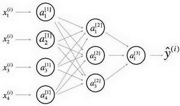
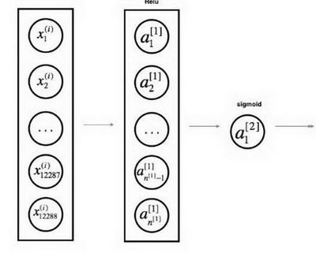

# 深度學習符號

_此筆記中使用的數學符號參考自《深度學習》和 Deep learning specialization_

## 常用的定義

* 原版符號定義中，$x^{(i)}$ 與 $x_i$ 存在混用的情況，請注意識別

### 數據標記與上下標

* 上標 $^{(i)}$ 代表第 $i$ 個訓練樣本
* 上標 $^{[l]}$ 代表第 $l$ 層
* $m$ 數據集的樣本數
* 下標 $_x$ 輸入數據
* 下標 $_y$ 輸出數據
* $n_x$ 輸入大小
* $n_y$ 輸出大小 (或者類別數)
* $n_h^{[l]}$ 第 $l$ 層的隱藏單元數
* $L$ 神經網路的層數
* 在循環中
    * $n_x = n_h^{[0]}$
    * $n_y = n_h^{[L + 1]}$

### 神經網路模型

* $X \in \mathbb{R}^{n_x \times m}$ 代表輸入的矩陣
* $x^{(i)} \in \mathbb{R}^{n_x}$ 代表第 $i$ 個樣本的列向量
* $Y \in \mathbb{R}^{n_y \times m}$ 是標記矩陣
* $y^{(i)} \in \mathbb{R}^{n_y}$ 是第 $i$樣本的輸出標籤
* $W^{[l]} \in \mathbb{R}^{l \times (l-1)}$ 代表第 $[l]$ 層的權重矩陣
* $b^{[l]} \in \mathbb{R}^{l}$ 代表第 $[l]$ 層的偏差矩陣
* $\hat{y} \in \mathbb{R}^{n_y}$ 是預測輸出向量
    * 也可以用 $a^{[L]}$ 表示

#### 正向傳播方程範例

* $a = g^{[l]}(W_x x^{(i)}_ + b_1) = g^{[l]}(z_1)$
    * 其中， $g^{[l]}$ 代表第 $l$ 層的啟動函數
* $\hat{y} = softmax(W_h h + b_2)$

#### 通用啟動公式

* $a_j^{[l]} = g^{[l]}(z_j^{[l]}) = g^{[l]}(\sum_k w_{jk}^{[l]}a_k^{[l-1]} + b_j^{[l]})$
    * $j$ 當前層的維度
    * $k$ 上一層的維度

#### 損失函數

* $J(x, W, b, y)$ 或者 $J(\hat{y}, y)$
* 常見損失函數範例
    * $J_{CE}(\hat{y}, y) = -\sum_{i=0}^m y^{(i)}log\hat{y}^{(i)}$
    * $J_1(\hat{y}, y) = -\sum_{i=0}^m |y^{(i)} - \hat{y}^{(i)}|$

## 深度學習圖示

* 節點：代表輸入、啟動或者輸出
* 邊：代表權重或者誤差

提供兩種等效的示意圖

### 詳細的網路

常用於神經網路的表示,為了更好的審美，我們省略了一些在邊上的參數的細節(如$w_{ij}^{[l]}$ 和$b_{i}^{[l]}$等)。

### 簡化網路

兩層神經網路的更簡單的表示。

_****_
